# АЛГЕБРА 

## 2-бөлім

Жалпы білім беретін мектептін 9-сыныбына арналған окулык

Казакстан Респубикасынын
Біпім және гылым министртігі бекіткен

## 9

ᲔОЖ 373.167.1
КБЖ 22.14g72
A39

Авторгары:

## А.Е. Эбілкасымова, Т.І. Кучер. В.Е. Корчевский, 3.ә. Жұмағұлова

Шартты белгілер:

- аныктамалар, каснетер, ережелер
(?) - жана білімді менгеру барысында шешілетін маселе
Б - пысыктау сұрактары
(10) - теориялык матерналлы езіндік штеруте арналған
- теорема немесе каспеттін далелеуінін аяктатуы

B - косымша матерналдар
A - барлығы үшін міндетті жаттығулар
B - орта денгейлі жаттығулар
C - жоғары денгейлі жатығулар
(Lab) - ерітінділер мен коспаларға берілген жатытулар
(ива) - практикага багыталтан жаттытулар
□ - электронды ресурстарды колцануға арналған жаттығулар

А39 Алгебра: Жалпы білім беретін мектептін 9-сыныбына арналған окулык. 2-бөлім / А.Е. Эбілкасымова, Т.П. Кучер, В.Е. Корчевский. 3.Θ. Жұмағұлова. - Алматы: Мектеп, 2019. - 152 б., сур.

ISBN 978-601-07-1094-8
A $\frac{4306020503-003}{404(05)-19} 11(1)-19$
ᲔᲢᲯ 373.167.1
КБЖ 22.14я72

| Кормевский В.Е., Жұлагұлова 3.0., 2019 |  | 哩 |
| :--- | :--- | :--- |
| c | керкем безендірітуі, | 2019 |
| Бартмк кұпактары коргалгам |  |  |
| Басмтамныя мутіктік | кукмктары | "Mekren" |
| баспасмы тнесіті |  |  |

ISBN 978-601-07-1094-8

## IV тарау. ТРИГОНОМЕТРИЯ

## § 19. БҰРЫШ ПЕН ДОҒАНЫН ГРАДУСТЫК ЖЭНЕ РАДИАНДЫК Ө.ЛШЕМДЕРІ

## Түйінді ұғымдар

Радиан, градус, бірлік шенбер

Бұрыштың радиандық өлшемі ұғымымен танысасындар; градусты радианға және радианды градусқа айналдыруды, $0 ; \frac{\pi}{2} ; \pi \frac{3 \pi}{2} ; 2 \pi$ сандарын бірлік шенберде белгілеуді үйренесіндер.

## СЕНДЕР БІЛЕСІҢДЕР

Бір нүктеден шығатын екі сәуледен кұралған геометрияцык фигура бұрыш деп аталады (35-сурет).

Сонымен катар сәулені басынан бұрған кезде шығатын фшураны да бұрыш деп карастыруға болады (36-сурет). Сәулені бұрғанда онын алғашкы және сонғы орналасу жағдайына катысты пайда болатын геометрнялык фигура да бұрышты береді.

Сәулені бұру карама-карсы екі бағытта жүргізіледі. Эдете, сағат тілі бағытына карсы бұру он бағып, ал сағат тілімен бір бағыта бұру теріс бағыт деп саналады (37-сурет).

Erep α бұрышы сәулені сағат тілі бағытына карсы бұру аркылы алынса, онда бұрыш он, ал сағат тілі бағытымен буру аркылы алынса, онда бұрыш mepic деп аталады (37-сурет).
$O$ нүктесі аркылы $O A$ сәулесін $\alpha$ бұрышына буруды орындайык. Буру нәтижесінде $O M$ сәулесін аламыз (38-сурет).
$O A$ сәулесін О бұрышына, сонымен катар теріс және он бағытарда кез келген бүтін санға тен бұру орындалса, онда сол $O M$ сәулесіне кайта ораламыз (38-сурет).

Демек, $\angle A O M=\alpha$ бурышына шексіз көп он және теріс бұрыштар сәйкес келеді. Ол бурыштарды $\beta=\alpha+360^{\circ} k$ формуласымен (мүндағы $k$ - кез келтен бүтін сан, яғни $k=0$,

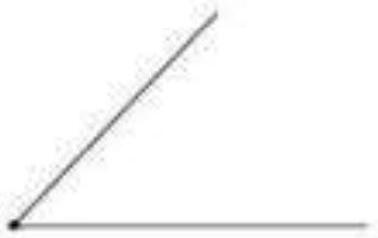
35-cyper

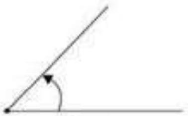
36-cyper

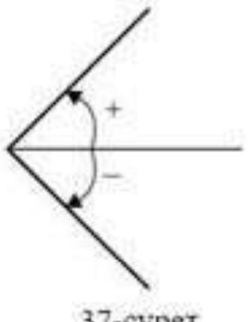
37-cyper

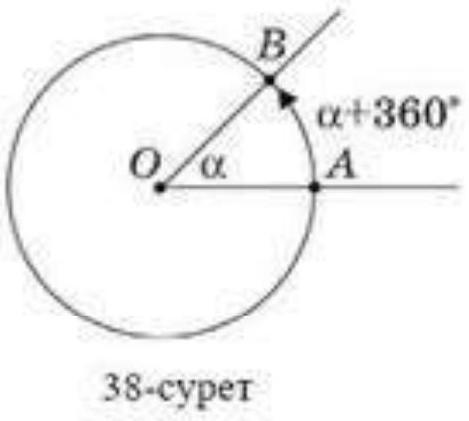
$\pm 1, \pm 2,3, \ldots$ )беруге болады.

## МЫСАЛ

1. Егер сәулені $O$ нүктесі аркылы $20^{\circ}$-ка тен бұрышка он бағытта бұрса, онда сәуленің орналасуына $20^{\circ}, 380^{\circ}, 740^{\circ}$, … он бұрыштар, немесе $-340^{\circ},-700^{\circ}$, ... теріс бұрыштар сәйкес келеді.

Барлык шыккан бұрыштарды $(k=0,1,2,3, \ldots$ болғанда, он бұрыштар және $k=-1,-2,-3, \ldots$ болғанда, теріс бұрыштар үшін) $\beta=20^{\circ}+360^{\circ} k$ формуласымен ернектеуге болады.

Егер сәулені $O$ нуктесінен $40^{\circ}$-ка тен бұрышқа он бағытта бұрса, онда сәуленін орналасуына $-40^{\circ},-400^{\circ},-760^{\circ}$, ... теріс бұрыштар немесе $320^{\circ}, 680^{\circ}, \ldots$ он бұрыштар сәйкес келеді.

Барлык шыккан бұрыштарды $(k=1,2,3, \ldots$ болғанда он бұрыштар және $k=0,-1,-2,-3, \ldots$ болғанда теріс бұрыштар үшін) $\beta=-40^{\circ}+360^{\circ} k$ формуласымен ернектеуге болады.
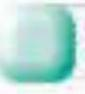

## СЕНДЕР БІЛЕСІҢДЕР

Геометрия курсынан бұрыш өлшемі тәрізді шенбер доғасынын ұзындығы да градуспен өлшенетінін білесіндер.
$O$ нүктесінен сағат тілі бағытына карсы бұрғанда шыккан бұрыштыи градустык елшемі толык бұрышты $\frac{1}{360}$ белігіне, яғни бір градуска тен. Жазылуы: $1^{\circ}$.
$O$ нүктесінен сағат тілі бағытына карсы толык бір айналым жасағанда $360^{\circ}$-ка тен, ал $O$ нүктесінен сағат тілі бағытымен бір
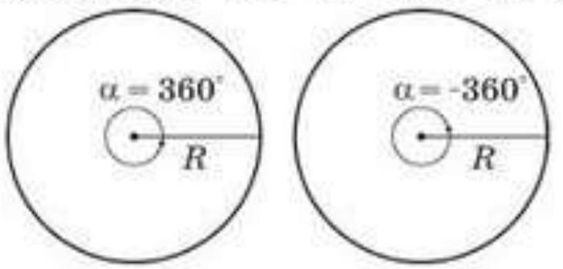
толык айналым жасағанда $-360^{\circ}$-ка тен бұрышты аламыз (39-сурет).
$1^{\prime}$ (мннут) $1^{\circ}$-тын $\frac{1}{60}$-іне, $1^{\prime \prime}$ (секунд) $1^{\prime}$-тын $\frac{1}{60}$-іне тен болатынын еске түсі-
39-cyper рейік.
Математикада, сонымен катар, физикада, астрономняда және тағы да баска ғылымдарда бұрыштарды елшеу үшін радиан колданылады. Кеп жағдайда шенбер доғасының ұзындығы ретінде сол шенбердін радиусынын ұзындығына тен доғаның ұзындығын алады (40-сурет).

## МЫСАЛ

2. Erep " $A B$ доғасыныи елшем 2,3 -ке тен" делінсе, онда шенбердін бұл доғасынын ұзындығы берілген шенбердін радиусына тен болатын доғанын 2,3 белігінен тұратынын білдіреді (41-сурет).

Егер доға ұзындығының бірлігі ретінде $R$ радиусынын ұзындык бірлігі алынса, онда шенберде $2 \pi$ доға болады, себебі шенбердін

ұзындығы $C=2 \pi R$ (мүндағы $R$ - шенбер радиусынын ұзындығы) формуласымен есептелінеді.

Шецбердін ұзындығын немесе доғаныи ұзындығын осылайша өлшеу радианмен өлшеу деп аталады.

Сонымен, $l$ доға ұзындығының раднандык өлшемі немесе $\alpha$ бұрышыныи шамасы ретінде $\alpha$ бұрышын кұрайтын шенбер доғасынын $l$ ұзындығынын $R$ раднус ұзындығына катынасы алынады (42-сурет). Онда шенбер доғасынын $l$ ұзындығына сәйкес $\alpha$ бұрышынын раднандык өлшемін былай жазуға болады:

$$
\alpha=\frac{l}{R},
$$

мұндағы $l$-шенбер доғасынын ұзындығы, $R$-шенбер радиусынын ұзындығы, $\alpha$ - шенбер доғасына сәїкес бұрыштын шамасы.

Егер $l=R$ болса, онда бұрыштын раднандык елшемі 1 -ге тен болады. Ондай бұрыш 1 радиан дым бұрыи деп аталады (43-сурет).
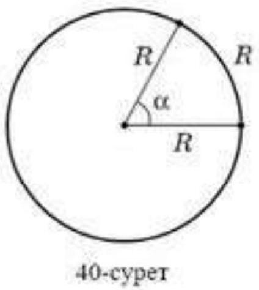

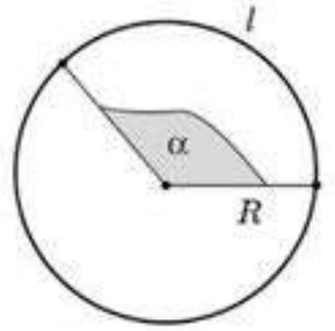
42-cyper

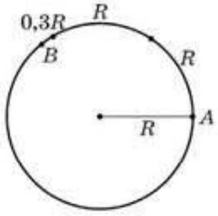
41-cyper

43-cypet

Ұзындызы шенбер радиусынын ұзындызына тен догаза сәйкес кететін центртік бұрыи 1 радиандық бұрыи деп атагады.

## 1 радианды кыскаша 1 рад деп жазады.

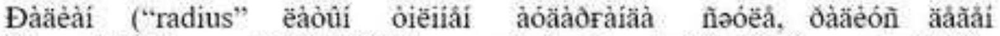
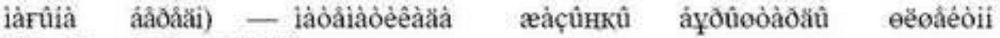 iăăiçải eëoåi åiõeiê.

Шенберде әркайсынын ұзындығы радиус ұзындығына тен $2 \pi$ доға болғандыктан, толык бұрыш пен шенбердін ұзындығы $2 \pi$ рад-ға тен ( 44 -сурет). Жарты шенбер мен жазынкы бұрыштын радиандык өлшемі П-ге тен (45-сурет).
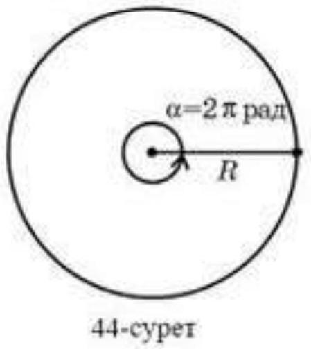
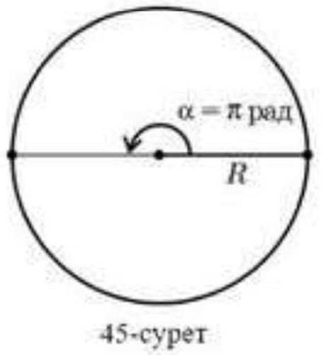

Жарты шенбердін градустык елшемі $180^{\circ}$-ка, ал раднандык өлшемі Прад-ға тен болғандыктан.

1) доғанын градустык өлшемі және бір радианға тен бұрыштын шамасы $\frac{180}{\pi}$ болады, яғни 1 рад $=\frac{180}{\pi} \approx 57^{\circ} 17^{\prime} 45^{\prime \prime}$;
2) доғаныи градустык өлшемі және бір градуска тен бұрыштын шамасы $\frac{\pi}{180}$, яғни $1^{\circ}=\frac{\pi}{180}$ рад $\approx 0,017$ рад.

Градустык елшеммен берілген кез келген бұрышты радианға, ал радиандык өлшеммен берілген бұрышты градустык елшемге аударуға болады.
$\alpha^{\circ}$ - кандай да бір бұрыштын градустык елшемі, $a$ - сол бұрыштын раднандык елшемі болсын, онда мына пропоршия акикат:

$$
\alpha^{\circ}: 180=a: \pi
$$

Бұл пропоршидан $a$ рад мен $\alpha^{\circ}$ былай ернектеледі:

$$
\begin{align*}
& a \text { paz }=\frac{\pi \alpha}{180^{\prime}},  \tag{1}\\
& \alpha^{\circ}=\frac{a \cdot 180^{\circ}}{\pi} . \tag{2}
\end{align*}
$$

(3)(1) формуланың көмегімен $30^{\circ}, 45^{\circ}, 60^{\circ}, 90^{\circ}, 120^{\circ}, 135^{\circ}, 150^{\circ}, 180^{\circ}$, $270^{\circ}, 360^{\circ}$ бұрыштарын раднанға айналдырындар.
Жиі кездесетін бұрыштардын радиандық және градустык өлшемдері төменгі кестеде келтірілген (5-кесте).

5-кесте

| a | $30^{\circ}$ | $45^{\circ}$ | $60^{\circ}$ | $90^{\circ}$ | $120^{\circ}$ | $135^{\circ}$ | $150^{\circ}$ | $180^{\circ}$ | $270^{\circ}$ | $360^{\circ}$ |
| :--- | :--- | :--- | :--- | :--- | :--- | :--- | :--- | ---: | :--- | :---: |
| a part | $\frac{\pi}{6}$ | $\frac{\pi}{4}$ | $\frac{\pi}{3}$ | $\frac{\pi}{2}$ | $\frac{2}{3} \pi$ | $\frac{3}{4} \pi$ | $\frac{5}{6} \pi$ | $\pi$ | $\frac{3}{2} \pi$ | $2 \pi$ |

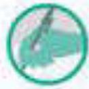

Транспортирдін кемегінсіз тікбұрышты үшбұрыштыи бұрыштары мен кабырғалары арасындағы касиеттерді колданып, шенберде $0^{\circ}, 30^{\circ}, 45^{\circ}, 60^{\circ}, 90^{\circ}$ бұрыштарына сәїкес нүктелерді калай салуға болады (46-сурет)?

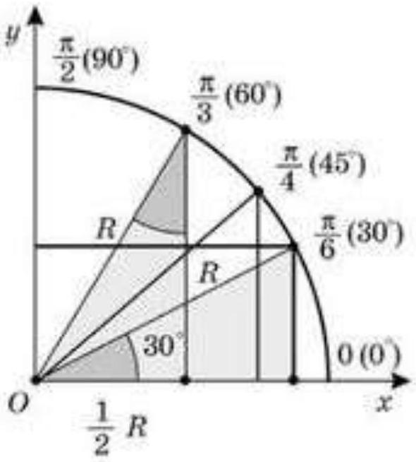
46-cyper

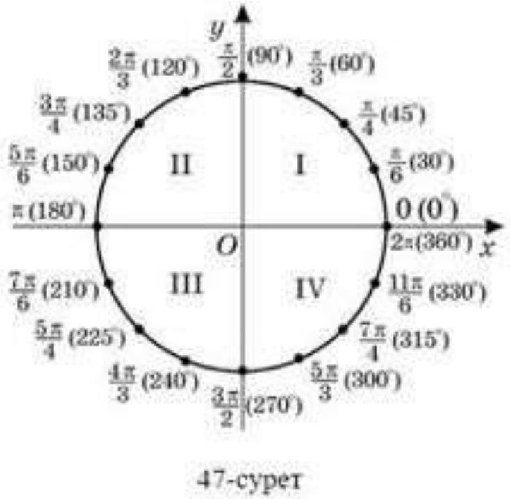

47-суретте ете жиі кездесетін бұрыштар (градуспен және раднанмен берілген) шенбер бойында нүктелермен белгіленген.

## МЫСАЛ

3. $30^{\circ}$ бұрыштың радианмен алынған жуык мәнін табайык.

Шешуі. $30^{\circ}=\frac{\pi}{6}$ (рад) болғандыктан, $30^{\circ} \approx \frac{3,14}{6}($ рад $) \approx 0,52$ (рад), $30^{\circ} \approx \frac{3,1416}{6}(\mathrm{paд}) \approx 0,5236$ (рад) және ɪ.с.c.
Жауабы : = 0,52 рад. = 0,5236 рад және т.с.с.

## МЫСАЛ

4. $a=0,3$ рад бұрыштын градуспен алынған жуык мәнін табайык.

Шешуі. $\alpha^{\circ}=\frac{a \cdot 180^{\circ}}{\pi}$ формуласын колданамыз:

$$
\alpha^{\circ}=\frac{180^{\circ} \cdot 0,3}{\pi} \approx \frac{54^{\circ}}{3,14} \approx 17^{\circ} .
$$

Жауабы : = $17^{\circ}$.
Кез келген бұрышты градустык елшемнен раднанға немесе радиандык өлшемнен градуска жылдам ауыстыру үшін математикалык аныктамалыктарда арнайы кестелер берілген.

## МЫСАЛ

5. Санды шенбердін $P_{t}$ нүктесіне сәйкес барлык сандарды (бұрыштардын шамаларын) табайық (48-сурет).
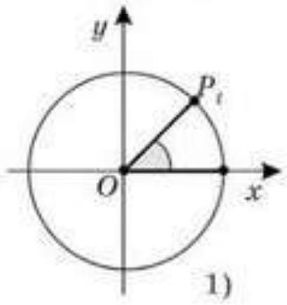

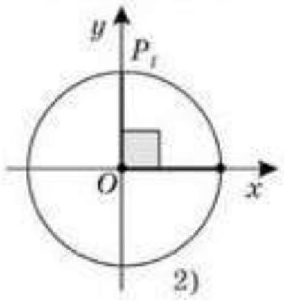
48-cyper

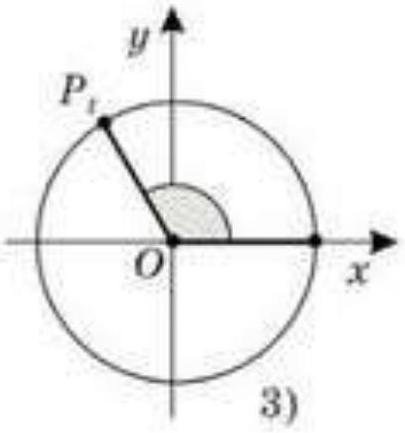

Жауабы: 1) $t=\frac{\pi}{4}+2 \pi k$, мұндагы $k-$ кез келген бүтін сан:
2) $t=\frac{\pi}{2}+2 \pi k$, мундағы $k-$ кез келген бутін сан;
3) $t=\frac{2 \pi}{3}+2 \pi k$, мұндагы $k$ - кез келген бүтін сан.

Жогарыдағы мысаддың жауаптарынын дұрыстығын тексеріндер.

## ?

1. Қангай бұрыштар он, кандай бұрыштар теріс бұрыштар деп аталады?
2. Бұрыштар кандай бірліктермен өлшенеді?
3. Бұрыштын рашандык елшемін градустык елшемге және градустык өлшемін раднандык өлшемте калай айналдырута болады?

## Жаттығулар

## A

19.1. Егер бұрыштын градустык өлшемі:

1) $30^{\circ}$,
2) $45^{\circ}$,
3) $60^{\circ}$,
4) $90^{\circ}$,
5) $150^{\circ}$,
6) $180^{\circ}$ ка тен болca, онда бұрышты радиан аркылы жазындар.
19.2. Егер бұрыштын радиандык елшемі:
7) $\frac{\pi}{4}$;
8) $\frac{3 \pi}{4}$;
9) $\frac{\pi}{3}$;
10) $\frac{2 \pi}{3}$;
11) $\frac{5 \pi}{6}$;
12) $\frac{\pi}{2}$-ге тен болса, онда бұрышты градус аркылы жазындар.
19.3. 1) Тенбүйірлі тікбұрышты үшбұрыштын бұрыштарын;
13) тенкабырғалы үшбұрыштын бұрыштарын;
14) тіктертбұрыштын бұрыштарын Прадиан аркылы жазындар.
19.4. 1) 1 pas; 2) 0,4 paz; 3) 2,3 paz; 4) $-4,2$ paz; 5) $-3,5$ paz; 6) -10 paz бұрыштарды градуспен өрнектендер.
19.5. Градуспен берілен бұрышты радиан аркылы ернектендер:
15) $24^{\circ}$,
16) $240^{\circ}$;
17) $154^{\circ}$,
18) $1025^{\circ}$,
19) $2040^{\circ}$,
20) $2405:$.
19.6. Erep: 1) $\alpha=\frac{5 \pi}{3}$;
21) $\alpha=\frac{9 \pi}{4}$;
22) $\alpha=\frac{16 \pi}{5}$;
23) $\alpha=\frac{17 \pi}{6}$ болса, онда $\alpha$ бұрышы кай ширекте жатад ы?

## B

19.7. 1) Ромбынын бір бұрышыныи радиандык елшемі 0,2 П-ге тен. Ромбынын калған бұрыштарынын раднандык өлшемдерін табындар.
2) Ромбынын бір бұрышынын раднандык елшемі 0,7 П-ге тен. Ромбынын калған бұрыштарынын радиандык өлшемдерін табындар.
19.8. 1) Тенбүйірлі трапециянын бір бұрышынын раднандык елшемі $\frac{\pi}{6}$-га тен. Трапешиянын калган бұрыштарыныи радиандык елшемдерін табындар.
2) Тенбүйірлі трапециянын бір бұрышынын радпандык өлшемі $\frac{2 \pi}{3}$-ке тен. Трапециянын калған бұрышарынын раднандык өлшемдерін табындар.
19.9. 1) $\frac{\pi}{4} ; \quad$ 2) $\frac{\pi}{6} ; \quad$ 3) $\frac{\pi}{2} ; \quad$ 4) $\frac{3 \pi}{4} ; \quad$ 5) $\frac{4 \pi}{9} ; \quad$ 6) $\frac{7 \pi}{11}$ болатын бұрышка сыбайлас бұрыштын раднандык елшемін табындар.
19.10. $\alpha$ бұрышын $\alpha=\alpha_{0}+2$ Пh (мұндағы $n$ - бүтін сан және $0 \mathrm{~m} \alpha_{0}< <2$ T) түрінде жазындар:

1) $\alpha=2,5 \pi$;
2) $\alpha=14,3 \pi ;$
3) $\alpha=-2,2 \pi$;
4) $\alpha=-19,7 \pi$;
5) $\alpha=-\frac{13}{4} \pi ;$
6) $\alpha=-\frac{23}{6} \pi$
19.11. Erep: 1) $\alpha=3,7 \pi$;
7) $\alpha=4,2 \pi ; \quad$ 3) $\alpha=-3,2 \pi ;$
8) $\alpha=-9,8 \pi$;
9) $a=-\frac{14}{5} \pi ;$
10) $\alpha=-\frac{25}{7} \pi$ болса, онда $\alpha$ бұрышы кай ширекте орналаскан?
19.12. Санды шенбердін бойына: 1) $30^{\circ}$, 2) $150^{\circ}$, 3) $-150^{\circ}$, 4) $-270^{\circ}$, 5) $420^{\circ}$, 6) $-300^{\circ}$ ка тен α бұрышына сәїкес нүктені салындар.
19.13. 1) Тенбүйірлі үшбұрыштың табанындағы сырткы бұрышы $130^{\circ}$-ка тен болса, онда үшбұрыштын ішкі бұрыштарын раднан аркылы ернектендер.
11) Тенбүйірлі үшбұрыштын тебесіндегі сыртқы бұрышы $140^{\circ}$-ка тен болса, онда үшбұрыштын ішкі бұрыштарын раднан аркылы ернектендер.
19.14. 1) Тенбүйірлі трапециянын үлкен табанындағы сырткы бұрышы $120^{\circ}$-ка тен болса, онда трапециянын ішкі бұрыштарын раднан аркылы өрнектендер.
12) Тенбүйірлі трапециянын үлкен табанындағы сырткы бұрышы $110^{\circ}$-ка тен болса, онда трапециянын ішкі бұрыштарын радиан аркылы өрнектендер.

## C

19.15. Мына тұжырымдар акнкат па:

1) егер $0^{\circ}<\alpha<90^{\circ}$ болса, онда $\alpha$ - бірінші ширектін бұрышы;
2) егер $\alpha$-бірінші ширектін бұрышы болса, онда $0^{\circ}<\alpha<90^{\circ}$;
3) егер $90^{\circ}<\alpha<180^{\circ}$ болса, онда $\alpha$ - екінші ширектін бұрышы;
4) егер $\alpha$-екінші ширектін бұрышы болса, онда $90^{\circ}<\alpha<180^{\circ}$ ?
19.16. Денгелектін бұрыштык жылдамдығы 23 рад/с. Денгелектін

минутына канша толык айналым жасайтынын табындар.
19.17.

1) 3 car;
2) 6 car;
3) 9 car;
4) тәулік бойына сағаттын мннуттык тілі кандай бұрышты (градустык және раднандык елшемде) керсетеді?
19.18.
5) $\frac{P_{\frac{\pi}{6}}}{\frac{1}{6}}$;
6) $\frac{P_{5 \pi}}{6}$;
7) $\frac{P_{7 \pi}}{6}$;
8) $\frac{P_{4 \pi}}{3}$;
9) $\frac{P_{5 \pi}}{3}$;
10) $\frac{P_{5 \pi}}{4}$
нүктесін санды (бірлік) шенберге салындар.

## ҚАЙТАЛАУ

19.19. Жүйенін шешімін координаталык жазыктыкта кескіндендер:

1) $\left\{\begin{array}{l}x^{2}+y^{2} \leqslant 9, \\ y \geqslant x^{2}-3 ;\end{array}\right.$
2) $\left\{\begin{array}{l}x^{2}+y^{2} \leqslant 16, \\ y \leqslant x^{2}-4 ;\end{array}\right.$
3) $\left\{\begin{array}{l}x^{2}+y^{2} \leqslant 25, \\ y \geqslant x^{2}+2 ;\end{array}\right.$
4) $\left\{\begin{array}{l}x^{2}+y^{2} \geqslant 4, \\ y \leqslant x^{2}+9 .\end{array}\right.$
19.20. Функциянын аныкталу облысын табындар:
5) $y=\sqrt{x^{2}-3 x-6}$;
6) $y=\sqrt{2 x^{2}-5 x-3}$;
7) $y=\sqrt{-x^{2}-6 x+8}$;
8) $y=\sqrt{-2 x^{2}+x+6}$.
19.21. Функшиянын графигін салындар:
9) $y=(x-3)^{2}-2$;
10) $y=(x+1)^{2}-3$;
з) $y=3-(x-2)^{2}$;
11) $y=4-(x+2)^{2}$.
19.22. $y=\frac{2 x^{2}-1}{3 x+1}$ функциясыныи мәні $2 ; 3 ; 4,5$ болатындай $x$-тін мәндерін табындар.
19.23. Цинаграммада гүлзардағы гүлдердін түрлеріне карай саны көрсетілген (49-сурет).

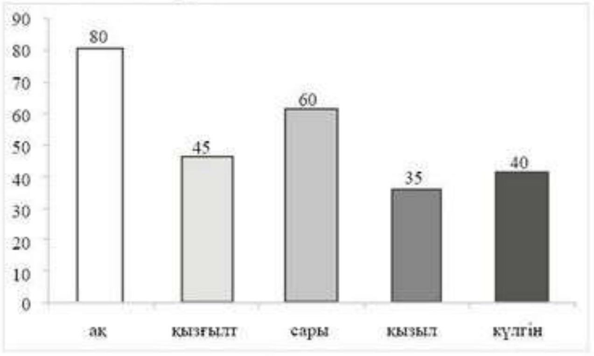
49-cyper

Егер $A$ сары және кызғылт, $B$ ак және сары гүлдердін санын берсе, онда акикат тұжырымдарды керсетіндер:
А) $A=B$;
B) $A>2 B$;
C) $A+15<B$;
D) $A>B$;
E) $A+10=B$.

## Жана білімді менгеруге дайындаламыз

19.24. Өрнектін мәнін табындар:

1) $2 \sin 60^{\circ}-3 \operatorname{tg} 45^{\circ}$;
2) $2 \cos 60^{\circ}-3 \operatorname{ctg} 45^{\circ}$;
3) $2 \sin 45^{\circ}-3 \operatorname{ctg} 60^{\circ}$;
4) $4 \sin 30^{\circ}-3 \operatorname{tg} 30^{\circ}$.

## Жана білімді менгеруге дайындаламыз

19.25. Коордннаталык жазыктыкта $A(2 ; 6)$ нүктесін белгілендер. Осы нүктені $O(0 ; 0)$ нүктесімен косындар. 1) $O x ; 2) O y$ осінін он бағыты және $O A$ сәулесі аркылы кұрылған бұрыштын тангенсінін мәнін табындар.

## Жана білімді менгеруге арналған тірек ұғымдар

Бұрыи, бұрыитын түртері, бұрыитын градустык және радиандык өлшемдері, тікбұрышты үшбұрыштын сүйір бұрышыныя синусы, косинусы, тангенсі және котангенсі және олардын белгілеугері, координаталык жазықтықтагы нуктенін абсциссасы мен ординатасы, дөнгелек, дөнгелектін радиусы, коороинататық жазықтыктын ширектері .

## §20. КЕЗ КЕЛГЕН БҰРЫШТЫН СИНУСЫ, КОСИНУСЫ, ТАНГЕНСІ, КОТАНГЕНСІ.   БҰРЫшТЫЦ СИНУСЫНЫН, КОСИНУСЫНЫН, ТАНГЕНСІНІН, КОТАНГЕНСІНІН МЭНДЕРІ

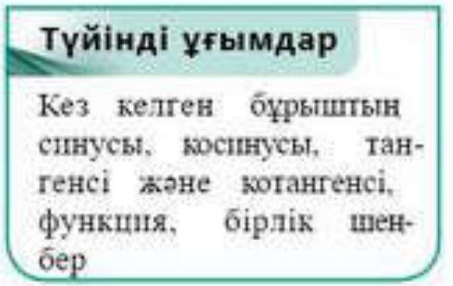

> Тригонометриялық функциялардың анықтамаларымен танысасындар;

> бірлік шеңбердің нүктелерінің координаталарынын тригонометриялық функциялармен байланысын білесіндер.

Сендер осы уакытка дейін $y=a x+b ; y=a x^{2}+b x+c ; y=x^{n}$ және т.б. алгебралык функцияларды окыдындар. Ол функциялар алгебралык операциялар, яғни косу, азайту, көбейту, белу, дәрежеге шығару, квадрат түбір шығару аркылы жазылды. Бірак практикада кептеген процестерді функциялардын баска түрлері, мысалы, тригонанетриятык функциягар аркылы сшаттайды.

Тригонометрнялык функшяларды енгізу үшін сан түзуімен катар санды шенбер кажет болады.
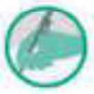

Сан түзуі ұғымын еске түсіріндер. M, O, E, K нүктелерінін координаталарын атандар ( 50 -сурет).

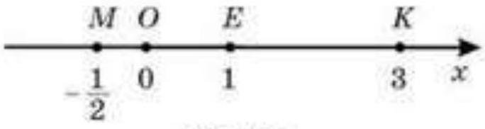
50-cyper

## СЕНДЕР БІЛЕСІҢДЕР

Санды түзу: 1) 0 бастапкы нуктесі; 2) бірлік кесіндісі; 3) он бағыты бар түзуді беретіні сендерге белгілі. Кез келген накты санды осы түзудін бойында белгілеуге болады және санды түзудін әрбір нүктесіне кандай да бір накты нүкте сәїкес келеді.

Сонымен катар нүктенін 0 бастапкы нүктесіне катысты орналасуына қарай санды тузуі боїындағы кез келген нүктенін координатасы он немесе теріс болатыны белгілі.

Санды шенбер деп бастапкы нүкте, бірлік доға, он бағыты бар шенберді айтады.

Санды шенберді салу үшін:

1) шенбер салынады;
2) бастапкы нүкте белгіленеді;
3) бірлік ретінде шенбердін раднусына тен доғанын ұзындығы алынады;
4) сағат тіліне карсы бағыттағы козғалыс он бағыт, сағат тілімен бір бағыттағы козғалыс теріс бағыт ретінде алынады (51-сурет).

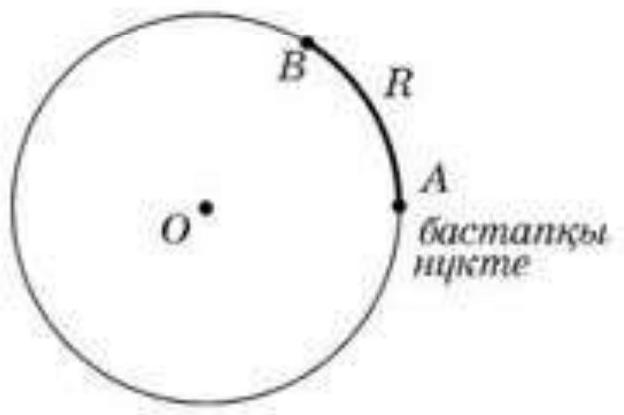
51-cyper

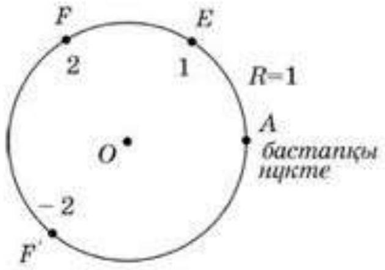
52-cyper

Сәйкестік бойынша кез келген $=$ нақты санына $A B=$ = рад доганыи соны болатын шенбердін бір ғана $B$ нүктесі сәйкес келеді. Бұл санды $B$ нуктесінін дөнгетек координатасы деп атап, $B(z)$ деп белгілейді.

Демек, кез келген накты санға шенбердін белгілі бір нүктесі сәйкес келеді. Осылайша, 0 санына $A$ нүктесінін бастапкы нүктесі, 1 санына $A E=1$ рад болатын доғанын соны $E$ нүктесі, 2 санына $A F=2$ рад болатын доғанын соны $F$ нүктесі, 6,5 санына ұзындығы 6,5 рад болатын доғанын сонғы нүктесі сәйкес келеді ( $A$ нүктесі доғанын бастапкы нүктесі болған жағдайда). Сондыктан кез келген теріс сан үшін теріс доғанын соны болатын нүкте сәйкес келеді.

Мысалы, $z=-2$ санына $A F^{\prime}=-2$ рад болатын доғаныи соны $F^{\prime}$ нүктесі сәйкес келеді (52-сурет).

1. Сан түзуі мен санды шенбердін ұқсастығы мен айырмашылығы кандай?
2. Кез келген накты санға сан түзуінін (санды шенбердін) бір ғана нүктесі сәйкес келе ме?
3. Сан түзуінін (санды шенбердін) кез келген нуктесіне бір ғана накты сан сәйкес келе ме?

Санды шенбердін кез келген $B$ нүктесіне шексіз накты сандар жиыны сәйкес келеді.

Геометрия курсында $\alpha$ сүйір бұрышынын синусы, косинусы және тангенсі карастырылды.
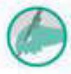

Тікбұрышты үшбұрыштын $\alpha$ сүйір бұрышынын $\sin \alpha$-сын, $\cos \alpha$-сын, tg $\alpha$-сын, сtg $\alpha$-сын еске түсіріндер (53-сурет).

$$
\sin \alpha=\frac{a}{c}, \cos \alpha=\frac{b}{c}, \operatorname{tg} \alpha=\frac{a}{b}, \operatorname{ctg} \alpha=\frac{b}{a} .
$$

## B

Ảãeãièi àdaá raëûiû Iañiồ aä-Ăiiiin åHåãèoåòi
òdèaiiiiåòodèyíŭ æaêả rũeûi áieûn kàeŭiòànóusià çiồ ùkiàè adòi. Iaǹiò aä-Äii æàçùK æaiả
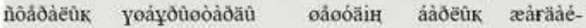 êàoûi κàdañòûorài.
"Ödeàiiiiiåòdèy" ñeçi adoáeòiH "ódècaiiii "-
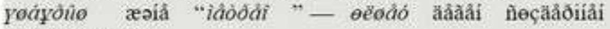 кұдañoûuũẽrài.

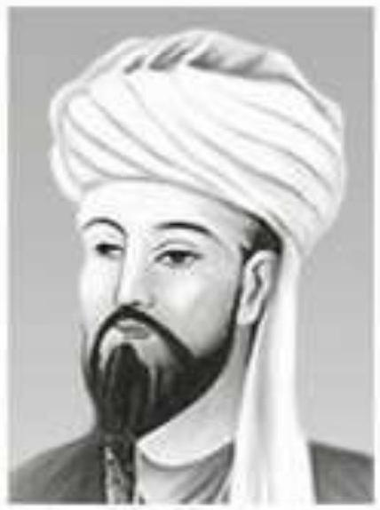
İañiô əä-Äii (1201-1274)

α бұрышыныи кез келген шамасы үшін аныктама енгіземіз. Ол үшін алдымен координаталар жүйесінде салынған санды шенберді карастырамыз.

Координаталар жүйесіне центрі координаталар басында болатын шенбер саламыз (54-сурет).
$O A$ раднусын бастапкы раднус деп атайык. $O B$ раднусы $O A$ бастапкы раднусын кандай да бір а бұрышына бұрғанда алынған раднус (55-сурет). Баскаша айтканда, бастапкы $O A$ радиусы мен жылжымалы $O B$ радиусы $\alpha$ бұрышын кұрайды.

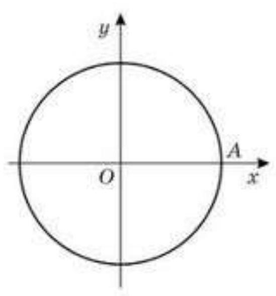
54-cyper

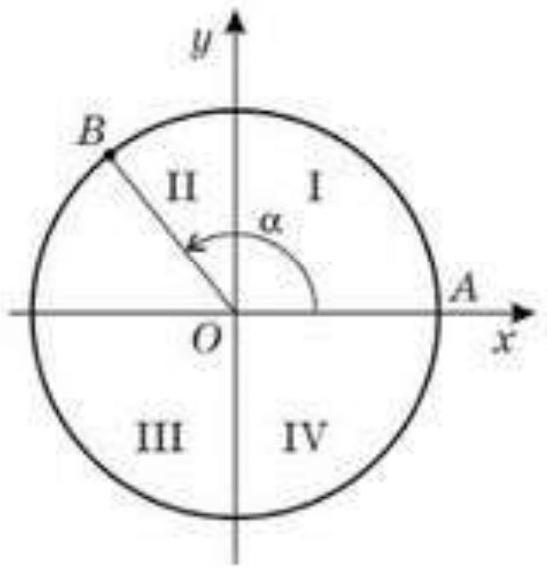
55-cyper

Жылжымалы $O B$ раднусын бұрганда онын ұшы терт ширектін бірінде немесе кооршнаталар осінін бірінде болуы мүмкін. Бастапкы раднуспен а бұрыш жасайтын жылжымалы радиустын ұшы кай ширекте аякталса, $\alpha$ бұрышы со.т ширектін бұрышы деп аталады.

Мысалы, егер жылжымалы $O B$ радпусыныи ұшы $B$ нүктесі II ширекте жатса, онда $\alpha$ бұрышы II шрекке тиісті болады ( 55 -сурет).
$а, \beta, \gamma, \phi$ бұрышы кай шпрекке тністі (56-сурет)?

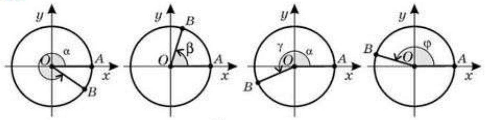
56-cypex

$\frac{\pi}{2}$-ге еселік болатын бұрыштар ешбір ширекте аякталм айды деп саналады.

Бастапкы $O A$ радиусын $O$ нүктесінен $\alpha$ бұрышқа бұрғанда ол $O B$ радиусына кешсін делік (57-сурет).
$O B C$ тікбұрышты үшбұрышынын сүйір бұрышыныи синусы, косинусы, тангенсі және котангенсінін аныктамаларын колданып, кез келген бұрыштын синусы, косннусы, тангенсі және котангенсінін анықтамасын берейік (57-сурет).
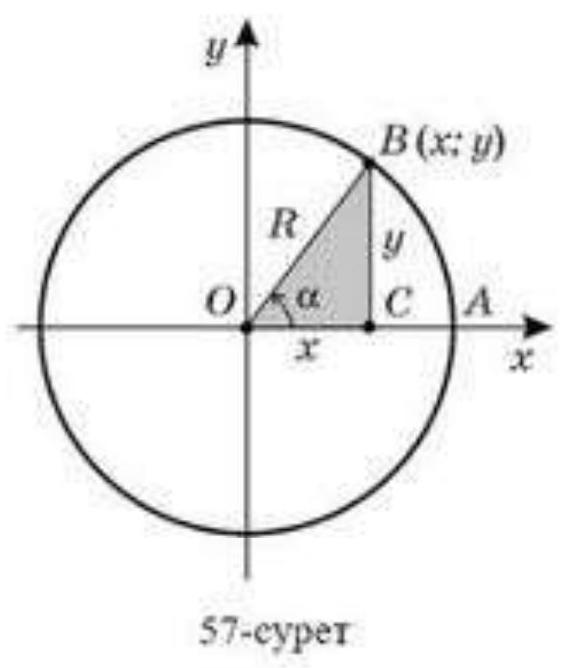

Шенберге muiсті В нуктесінін ординатасынын шенбер радиусына қатынасы 0 бұрышынын синусы деп аталады.

Шенберге muісті В нуктесінін абсциссасынын шенбер радиусына қатынасы Х бурышынын косинусы деп аталады .

Шенберге muісті в нуктесінін ординатасыныи нуктенін абсциссасына катынасы 0 бұрышынын тангенсі деп атагады.

Шенберге muісті В нуктесінін абсциссасынын нуктенін ординатасына катынасы 0 бррышынын котангенсі деп аталады.

Егер $B$ нүктесінін координаталарын $\quad x$ және $y$, ал шенбер раднусынын ұзындығын $R$ аркылы белгілесек, онда мына тендіктерді аламыз:

$$
\sin \alpha=\frac{y}{R} ; \cos \alpha=\frac{x}{R} ; \operatorname{tg} \alpha=\frac{y}{x} ; \operatorname{ctg} \alpha=\frac{x}{y} .
$$

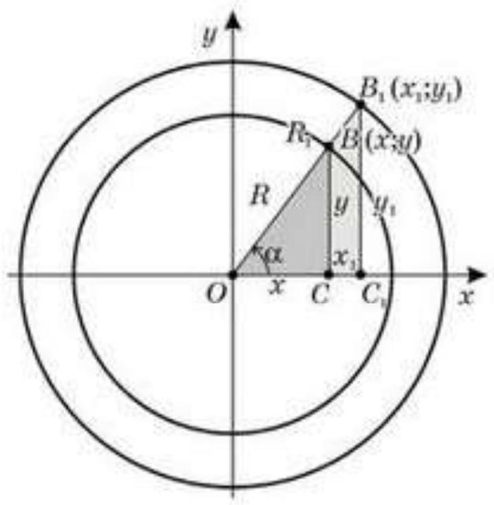
58-cyper

Берілген $\alpha$ бұрышы ушін $\frac{y}{R}, \frac{x}{R}, \frac{x}{y}$, $\frac{y}{x}$ катынастары тұракты, сондыктан олардын шамалары раднустын ұзындығына тәуелді емес.

Расында да, $B_{1}$ нүктесі жылжымалы $O B$ радиусында немесе онын жалғасында жататын кез келген нүкте болсын ( 58 -сурет).

Онда $O B C$ және $O_{1} B_{1} C_{1}$ үшбұрыштарынын ұксастығынан $\quad \frac{y}{R}=\frac{y_{1}}{R_{1}}$;

$$
\begin{aligned}
& \frac{x}{R}=\frac{x_{1}}{R_{1}} ; \frac{y}{x}=\frac{y_{1}}{x_{1}} ; \frac{x}{y}=\frac{x_{1}}{y_{1}} \text { (мундағы } \\
& R_{1}=O B_{1}, \text { ал } x_{1} \text { және } y_{1}-B_{1} \text { нуктесінін } \\
& \text { координаталары аламыз. }
\end{aligned}
$$

$\sin \alpha, \cos \alpha, \operatorname{tg} \alpha, \operatorname{ctg} \alpha$ шамалары радиустын ұзындығына тәуелді болмағандыктан, радпусынын ұзындығы 1 -ге тен шенбер карастырылады. Мүндай шенберді біртік шенбер деп атайды.

Сонымен, $\sin \alpha, \cos \alpha, \operatorname{tg} \alpha, \operatorname{ctg} \alpha$-нын мәндері тек кана $\alpha$ бұрышынын шамасына тәуелді. Кез келген $\alpha$ бұрышына синус, косинус, тангенс ( $\frac{\pi}{2}+\pi k$, мүндағы $k \in Z$ бұрыштарынан баска) және котангенстін (Пk, мұндағы $k \in Z$ бұрыштарынан баска) бір ғана мәні сәйкес келеді.

> Синус, косинус, тангенс және котангенстін а бұрышынын шамасына тәуетоітігі тригонометриялық функциялар деп аталады.

Тригонометриялык функшялардын белгіленуі: $y=\sin \alpha, y=\cos \alpha$, $y=\operatorname{tg} \alpha, y=\operatorname{ctg} \alpha$.

Тригонометриялык функцияларды санға тәуелді функциялар ретінде карастыруға болады. Өйткені бұрыштын градустык өлшемімен катар раднандык елшемі де бар. Сондыктан α раднанта тәуелді тригонометриялык функшяларды $\alpha$ санына тәуелді функшия ретінде карастыруға болады.

## МЫСАЛ

1. Қабырғасы шенбердін $B(3 ;-2)$ нүктесі аркылы өтетін $\alpha$ бұрышыныи тригонометрнялык функцияларын табайык (59-сурет).

Шешуі $\cdot x=3 ; y=-2$ болғандықтан, $R=\sqrt{9+4}=\sqrt{13}$. Олай болса
$\sin \alpha=\frac{y}{R}=-\frac{2 \sqrt{13}}{13} ;$
$\cos \alpha=\frac{x}{R}=\frac{3 \sqrt{13}}{13} ;$
$\operatorname{tg} \alpha=\frac{y}{x}=-\frac{2}{3} ;$
$\operatorname{ctg} \alpha=\frac{x}{y}=-\frac{3}{2}=-1,5$.

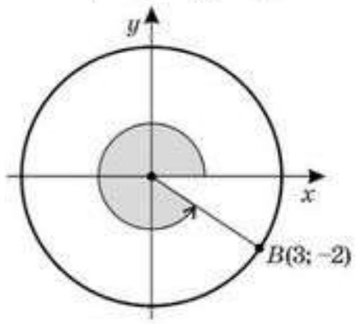
59-cyper

Жауабы $: \sin \alpha=-\frac{2 \sqrt{13}}{13} ; \cos \alpha=\frac{3 \sqrt{13}}{13} ; \operatorname{tg} \alpha=-\frac{2}{3} ; \operatorname{ctg} \alpha=-1,5$.

## МЫСАЛ

2.1) $0^{\circ}$, 2) $180^{\circ}$, 3) $270^{\circ}$ болатын бұрыштардын тригонометриялык функцияларынын мәндерін табайык (60-сурет).

Шешуі . 1) Егер $\alpha=0^{\circ}$ болса, онда $\sin 0^{\circ}=0$, $\cos 0^{\circ}=1, \operatorname{tg} 0^{\circ}=\frac{0}{R}=0, \operatorname{ctg} 0^{\circ}=\frac{R}{0}$ - аныкталмаған.
2) Егер $\alpha=180^{\circ}, x=-R, y=0$ болса, онда $|O A|=|O B|=R$ және $\sin 180^{\circ}=\frac{0}{R}=0, \cos 180^{\circ}= =\frac{-R}{R}=-1 ; \operatorname{tg} 180^{\circ}=\frac{y}{x}=\frac{0}{R}=0, \operatorname{ctg} 180^{\circ}=$

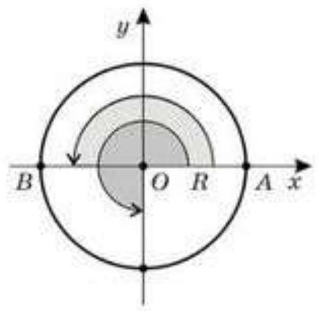
60-cyper

3) Erep $\alpha=270^{\circ}$ болса, онда бұрыштын кабыргасы $O y$ осінін теріс бағытымен беттеседі, сондыктан $x=0$ және $y=-R$.
$\sin 270^{\circ}=\frac{y}{R}=\frac{-R}{R}=-1 ; \cos 270^{\circ}=\frac{x}{R}=0 ; \operatorname{ctg} 270^{\circ}=\frac{x}{y}=\frac{0}{-R}=0 ; \operatorname{tg} 270^{\circ}=\frac{y}{x}=\frac{-R}{0}$ - аныкталмаған.

Жауабы: 1) $\sin 0^{\circ}=0, \cos 0^{\circ}=1, \operatorname{tg} 0^{\circ}=0, \operatorname{ctg} 0^{\circ}$ - аныкталмаған.
2) $\sin 180^{\circ}=0 . \cos 180^{\circ}=-1 . \operatorname{tg} 180^{\circ}=0 ; \operatorname{ctg} 180^{\circ}$ - аныкталмаған;
3) $\sin 270^{\circ}=-1 ; \cos 270^{\circ}=0, \operatorname{ctg} 270^{\circ}=0, \operatorname{tg} 270^{\circ}$ - аныкталмаған.

6-кест еде және 61-суретте практикада жні колданылатын радшанмен (градуспен) берілген бурыштардын тригонометриялык функцияларынын мәндері жа зыпан.

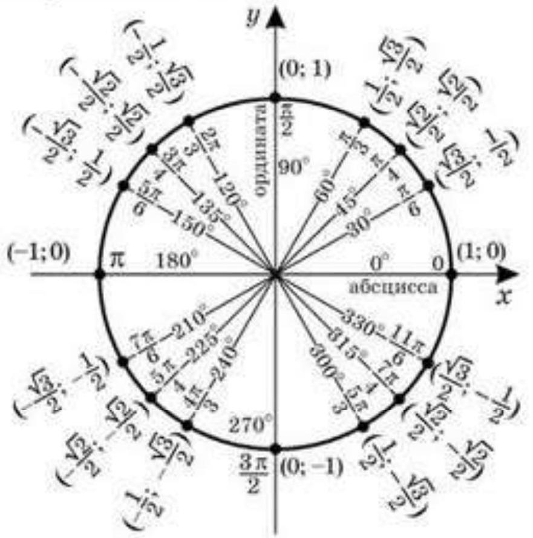
61-cyper

6-кесте

| а бұрышы | Рашанмен (градуспен берілген бұрыштын мәні) |  |  |  |  |  |  |  |  |  |
| :--- | :--- | :--- | :--- | :--- | :--- | :--- | :--- | :--- | :--- | :--- |
| Функшия | 0 $\left(0^{\circ}\right)$ | $\frac{\pi}{6}$ ( $30^{\circ}$ ) | $\frac{\pi}{4}$ ( $45^{\circ}$ ) | $\frac{\pi}{3}$ ( $60^{\circ}$ ) | $\frac{\pi}{2}$ ( $90^{\circ}$ ) | $\frac{2 \pi}{3} \left(120^{\circ}\right)$ | $\frac{5 \pi}{6}$ ( $150^{\circ}$ ) | $\Pi$ ( $180^{\circ}$ ) | $\frac{3 \pi}{2}$ ( $270^{\circ}$ ) | $2 \pi$ ( $360^{\circ}$ ) |
| $\sin \alpha$ | 0 | $\frac{1}{2}$ | $\frac{\sqrt{2}}{2}$ | $\frac{\sqrt{3}}{2}$ | 1 | $\frac{\sqrt{3}}{2}$ | $\frac{1}{2}$ | 0 | -1 | 0 |
| $\cos \alpha$ | 1 | $\frac{\sqrt{3}}{2}$ | $\frac{\sqrt{2}}{2}$ | $\frac{1}{2}$ | 0 | $-\frac{1}{2}$ | $-\frac{\sqrt{3}}{2}$ | -1 | 0 | 1 |
| $\operatorname{tg} \alpha$ | 0 | $\frac{1}{\sqrt{3}}$ | 1 | $\sqrt{3}$ | анык-талмаған | $-\sqrt{3}$ | $-\frac{1}{\sqrt{3}}$ | 0 | анық-талмаған | 0 |
| ctg ${ }^{\alpha}$ | анық-талмаған | $\sqrt{3}$ | 1 | $\frac{1}{\sqrt{3}}$ | 0 | $-\frac{1}{\sqrt{3}}$ | $-\sqrt{3}$ | анык-талмаған | 0 | анық-талмаган |

## МЫСАЛ

3. $2 \cos 0^{\circ}+3 \sin 90^{\circ}+4 \operatorname{tg} 45^{\circ}$ ернегінін мәнін табайык.

Шешуі . 6-кестені колцанамыз:

$$
2 \cos 0^{\circ}+3 \sin 90^{\circ}+4 \operatorname{tg} 45^{\circ}=2 \cdot 1+3 \cdot 1+4 \cdot 1=9 .
$$

Жауабы : 9.

## $?$

?

1. Қандай функшялар тригонометриялык функшялар деп аталады?
2. Санды шенбер дегеніміз не?
3. Кез келген бұрыштың синусы, косннусы, тантенсі, котантенсі дегеніміз не?

## Жаттығулар

A
20.1. $45^{\circ},-60^{\circ}, 90^{\circ}$ ка тен бұрышқа сәйкес келетін нүктені бірлік шенберге салындар және елшеу аркылы осы бұрыштардын синусын және косинусын есептендер.
20.2. Erep:

1) $\sin \alpha=\frac{1}{4}$;
2) $\sin \alpha=\frac{2}{3}$;
3) $\cos \alpha=\frac{3}{4}$;
4) $\cos \alpha=\frac{3}{5}$;
5) $\operatorname{tg} \alpha=2$;
6) $\operatorname{tg} \alpha=3$ болса, онда $\alpha$ бұры- шын салындар.
20.3. Центрі кооршнаталар басы болатын бірлік шенберді салындар. Бастапкы радиусты $\alpha$ бұрышына бұрындар, мүндағы $\alpha$ бұрышы:
7) $35^{\circ}$;
8) $75^{\circ}$;
9) $135^{\circ}$;
10) $170^{\circ}$;
11) $-80^{\circ}$;
12) $-130^{\circ}$.
20.4.
13) $2 \sin 30^{\circ}+2 \cos 45^{\circ}$;
14) $3 \sin 60^{\circ}-2 \cos 60^{\circ}$;
15) $\sin 30^{\circ}-3 \operatorname{tg} 45^{\circ}$;
16) $\sin 45^{\circ}+2 \operatorname{ctg} 60^{\circ}$ ернегінін мәнін табындар.
20.5.
17) $\operatorname{tg} \frac{\pi}{3}+2 \operatorname{ctg} \frac{\pi}{6}$;
18) $\operatorname{tg} \frac{\pi}{4}-3 \operatorname{ctg} \frac{5 \pi}{6}$;
з) $3 \cos \frac{\pi}{3}+2 \sin \frac{\pi}{4}$;
19) $-\sin \frac{\pi}{2}+2 \operatorname{ctg} \frac{3 \pi}{4}$ ернегінін мәнін табындар.
20.6.
20) $\sin \alpha=0$;
21) $\sin \alpha=0,5$;
22) $\cos \alpha=-1$;
23) $\cos \alpha=1$;
24) $\cos \alpha=0$;
25) $\sin \alpha=-1$ болса, онда $\alpha$-нын бірнеше мәнін табындар.
20.7 1) $\operatorname{tg} \beta=0$;
26) $\operatorname{tg} \beta=1$;
27) $\operatorname{tg} \beta=-1$;
28) $\operatorname{ctg} \beta=1$;
29) $\operatorname{ctg} \beta=-1$;
30) $\operatorname{ctg} \beta=0$ болса, онда $\beta$-нын бірнеше мәнін табындар.
20.8.
31) $2 \cos 0^{\circ}+3 \operatorname{tg} 45^{\circ}-\sin 120^{\circ}$;
32) $\sin 270^{\circ}+3 \operatorname{tg} 180^{\circ}$;
33) $\cos 90^{\circ}-3 \sin 360^{\circ}+2 \operatorname{tg} 180^{\circ}$ ернегінін мәнін табындар.
20.9. 1) $\operatorname{tg} \beta$; 2) $\operatorname{ctg} \beta$; 3) $\operatorname{ctg} 2 \beta$; 4) $\operatorname{tg} 2 \beta$ epнегінін мәні болмайтындай, $\beta$-нын бірнеше мәнін керсетіндер.
20.10.
34) $\sin \alpha=1,22$;
35) $\sin \alpha=-3,2$;
36) $\cos \alpha=2,25$;
37) $\cos \alpha=-1,2$ тендігі орындалатындай, α бұрышынын мәні бола ма?
20.11.
38) $\sin \alpha=1-\sqrt{3}$;
39) $\sin \alpha=\sqrt{5}-1$;
40) $\cos \alpha=\sqrt{3}-1$;
41) $\cos \alpha=\sqrt{7}-1$ тендігі орындалатындай, $\alpha$ бұрышынын мәні бола ма?

## B

20.12. 1) $\sin \frac{\pi}{6}\left(\operatorname{tg} \frac{\pi}{4}+\cos \frac{\pi}{3}\right)$;
2) $\operatorname{tg} \frac{\pi}{6}\left(\sin \frac{\pi}{3}+\cos \frac{\pi}{6}\right)$;
3) $\cos \frac{\pi}{4}\left(\operatorname{ctg} \frac{\pi}{4}+\sin \frac{\pi}{3}\right)$ ернегінін мәнін табындар.
20.13. 1) $-\sin \frac{\pi}{2}\left(2 \operatorname{tg} \frac{\pi}{4}-\cos \frac{\pi}{6}\right)$;
2) $\operatorname{ctg} \frac{\pi}{6}\left(\sin \frac{\pi}{3}-3 \cos \frac{\pi}{3}\right)$;
3) $\cos \frac{\pi}{4}\left(2 \operatorname{ctg} \frac{\pi}{4}-3 \sin \frac{\pi}{6}\right)$ ернегінін мәнін табындар.
20.14. 1) Сүйір бұрыштардын синустары; 2) сүйір бұрыштардын косинустары аркылы $\frac{\sqrt{3}}{2}+\frac{1}{2}$ косындысыныи мәнін ернектендер.
20.15. 1) Сүйір бұрыштардын синустары; 2) сүйір бұрыштардыи косннустары аркылы $\frac{\sqrt{3}}{2}-\frac{\sqrt{2}}{2}$ алгебралык косындысынын мәнін өрнектендер.
20.16. 1) Сүйір бұрыштардыи тангенстері; 2) сүйір бұрыштардын котангенстері аркылы $\frac{\sqrt{3}}{3}-1$ айырымынын мәнін табындар.
20.17.

1) $\alpha=0^{\circ}$;
2) $\alpha=120^{\circ}$;
3) $\alpha=30^{\circ}$;
4) $\alpha=135^{\circ}$ болса, онда $\sin \alpha+\cos \alpha$ өрнегінін мәні неге тен?
20.18.
5) $\frac{\left(-\sin 30^{\circ}-\cos 30^{\circ}\right)^{2}}{3 \cos 45^{\circ} \sin 45^{\circ}-6 \operatorname{tg} 30^{\circ} \operatorname{ctg} 60^{\circ}}$;
6) $\frac{2 \operatorname{tg}^{2} \frac{\pi}{3} \cos \pi-1}{\sin \frac{\pi}{2} \cos \frac{\pi}{3} \operatorname{tg} \frac{\pi}{4}}$;
7) $\left.\frac{\sqrt{\left(\cos 60^{\circ}-\sin 60^{\circ}\right)^{2}}}{\sin 30^{\circ} \cdot\left(1-\operatorname{tg} 60^{\circ}\right)} ; 4\right) \frac{\sqrt{\left(\operatorname{tg} \frac{\pi}{6}-\operatorname{tg} \frac{\pi}{3}\right)^{2}}}{\left(\operatorname{ctg} \frac{\pi}{6}-\operatorname{ctg} \frac{\pi}{3}\right)^{2}}$ өрнегінін мәнін табындар.
20.19. 1) $\cos \alpha \cdot \operatorname{tg} \alpha ; 2) \sin \alpha \cdot \operatorname{ctg} \alpha ; 3) \sin \alpha+\cos \alpha$ eрнегінін мәні нелге тен болатындай $\alpha$-ныи бірнеше мәнін табындар.
20.20. $\frac{1}{\operatorname{tg} \frac{\pi}{6}}, \frac{1}{\sin \frac{\pi}{3}}, \frac{1}{\operatorname{ctg} \frac{\pi}{6}}$ тізбегінін арифметикалык прогрессия болатынын тексеріндер .
$\begin{array}{ll}\text { 20.21. 1) } \sin \alpha=-\frac{\sqrt{2}}{2} ; & \text { 2) } \cos \alpha=-\frac{\sqrt{2}}{2} ; \\ \text { 3) } \sin \alpha=-\frac{\sqrt{3}}{2} \text { болса, онда } \alpha \text {-нын терт мәнін керсетіндер. }\end{array}$
20.22. 1) $\cos \alpha=-0,5$;
8) $\operatorname{tg} \alpha=\sqrt{3}$;
9) $\operatorname{ctg} \alpha=-\sqrt{3}$ болса, онда $\alpha_{\text {-нын }}$ терт мәнін керсетіндер.
20.23.
10) $2 \operatorname{tg} 30^{\circ} \operatorname{ctg} 30^{\circ} \cos 30^{\circ} \sin 30^{\circ}+\sqrt{3} \operatorname{tg} 60^{\circ}$;
11) $\frac{4 \cdot \sin \frac{\pi}{6} \cos \frac{\pi}{6}}{\sin \frac{\pi}{2}+2 \cos \pi}+2$ өрнегінін мәнін табындар.
20.24. 1) $\sqrt{\frac{3}{4}+2 \cos ^{2} 30^{\circ}}+\sqrt{\frac{5}{4}-3 \operatorname{tg}^{2} 30^{\circ}}$; 2) $\sqrt{\operatorname{tg}^{2} \frac{\pi}{3}-2 \frac{3}{4}-2 \sin \frac{3 \pi}{4}}$ өрнегінін мәнін табындар.
20.25. $\sin \alpha=0,5$ екені белгілі.
12) $\alpha=30^{\circ}$ дегеніміз дұрыс па? 2) Синусы 0,5 -ке тен болатын бірнеше бұрышты көрсетіндер. 3) Синусы 0,5-ке тен болатын барлык бұрыштын жалпы түрін жазындар.
20.26. $\cos \alpha=\frac{\sqrt{2}}{2}$ екені белгілі.
13) $\alpha=45^{\circ}$ дегеніміз дурыс па? 2) Косннусы $\frac{\sqrt{2}}{2}$-ге тен болатын бірнеше бұрышты керсетіндер. 3) Косинусы $\frac{\sqrt{2}}{2}$-ге тен болатын барлык бұры штын жалпы түрін жазындар.
20.27. 1) $\sin \alpha+2 \cos \alpha=3$;
14) $3 \sin \alpha-2 \cos \alpha=5$;
15) $\sin \alpha-7 \cos \alpha=-8$;
16) $\sin \alpha+2 \cos \alpha=1$ тендігі орындала ма?
20.28. Erep: 1) $\beta=30^{\circ}$; 2) $\beta=45^{\circ}$; 3) $\beta=60^{\circ}$ болса, онда $A=2 \cos \beta$ және $B=3 \operatorname{tg} \beta$ ернектерінін мәндерін салыстырындар.

## C

20.29. 1) $\sin \alpha+\cos \alpha=-1,3 ; 2) \sin \alpha-\cos \alpha=1,3$ болса, α бұрышы кай ширекте орналаскан?
20.30.

1) $\sqrt{\sin 150^{\circ}}$;
2) $\sqrt{-\cos 180^{\circ}}$;
3) $\sqrt{\cos 120^{\circ}}$;
4) $\sqrt{\operatorname{tg} 180^{\circ}}$

ернегінін мағынасы бар ма?
20.31. Erep: 1) $\beta=30^{\circ}$; 2) $\beta=45^{\circ}$; 3) $\beta=60^{\circ}$ болса, онда $A=-3 \sin \beta$

және $B=-2 \cos \beta$ ернектерінін мәндерін салыстырындар.

## ҒАЛЫМДАР - МАТЕМАТИК ЖЭНЕ АСТРОНОМ ТУРАЛЫ ХАБАРЛАМА ДАЙЫНДАНДАР

20.32. 1) XVIII ғàñûoäûH iocỏăûuăà швейцарнялык математик
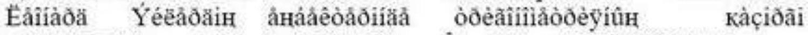
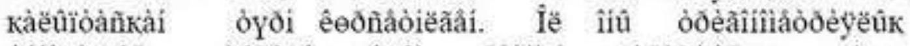 ôóiêoèyeàà óodaẽû ғûêù dảoiăă κàdanòûobm, $\sin x, \operatorname{tg} x$ æáçóĕàoûi ảiâçreн, AAN γшбұрышыныи κàáûoràeàoûi à,
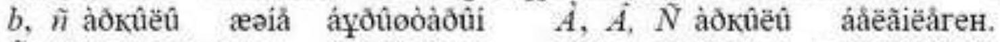
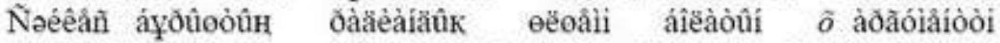
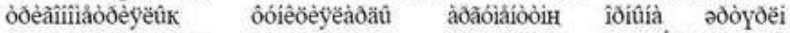 (î̀н, ởõiñ) iəίăåo
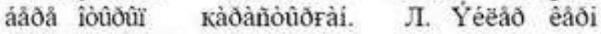 òdeâiiîiåòoèyěûK ôbiêoèyĕàdaûu âiảiçãải.

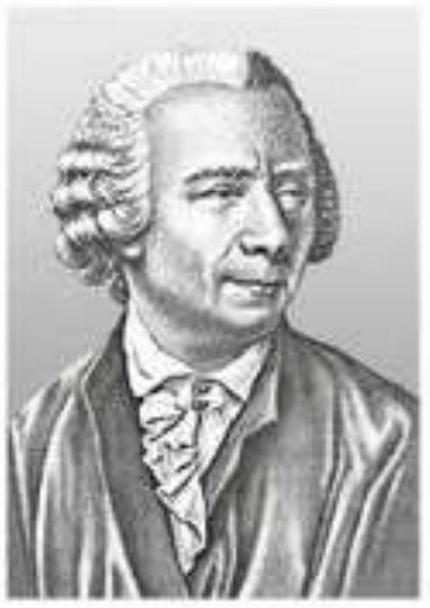
ΕΑайіăŏ Ύẽeãõ (1707—1783)

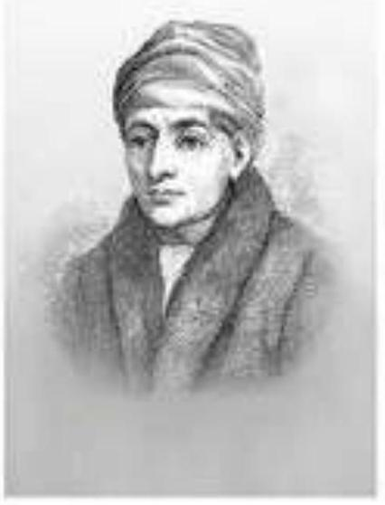
Региомонтан (1436-1476)

2) XV ғàñûoäûH aéāiĕi iåiiñ añödiîîiû Đaaaèîîíòài æåòiioi iəiäi oéôorà ăaéii äeëäiêiài aëûirài æàçûHkû áydunoòàoäûH ñèiónûiûH eânỏảnii κyõanôuõrài.

## ҚАЙТАЛАУ

20.33.

1) $3 x^{2}-5 x-27=0$;
2) $5 x^{2}-7 x-1,2=0$;
3) $3,5 x^{2}+7,6 x+1=0$ квадрат тендеуі түбірлерінін косындысы мен көбейтіндісініи мәндерін табындар.
20.34.
4) $\frac{x^{2}+4 x-5}{(x-3)^{2}}<0$;
5) $\frac{x^{2}-4 x-5}{(x+2)^{4}}<0$;
6) $\frac{7}{x^{2}-5 x+6}+1<\frac{9}{3-x}$ тенсіздігін шешіндер және тенсіздіктін ен үлкен бүтін шешімін көрсетіндер.
20.35.
7) $y=x^{2}+6|x|-2$;
8) $y=-2 x^{2}+4|x|+1$;
9) $y=\frac{2}{1+x^{2}}$;
10) $y=\frac{x^{2}-1}{x}$ функшисынын жұп немесе так екенін аныктандар және функциянын графигін салындар.
20.36.
11) $1<\frac{x+2}{5-x}<6$;
12) $-1<\frac{x-8}{x+1}<3$ костенсіздігін канағаттан- дыратын $x$ айнымалысынын барлық бүтін он мәндерін табындар.
20.37. Тенсіздіктер жүйесінін шешімдер жнынын координаталык жазыктықта кескіндендер:
13) $\left\{\begin{array}{l}2 \leqslant x \leqslant 6, \\ -1 \leqslant y \leqslant 3 ;\end{array}\right.$
14) $\left\{\begin{array}{l}-1 \leqslant x \leqslant 3, \\ -1 \leqslant y \leqslant 4 ;\end{array}\right.$
15) $\left\{\begin{array}{l}0 \leqslant x \leqslant 4, \\ y \leqslant 3-x ;\end{array}\right.$
16) $\left\{\begin{array}{l}-2 \leqslant x \leqslant 2, \\ y \leqslant x^{2}-1 .\end{array}\right.$
20.38. Фермер баласымен бірге жұмысты 6 сағ-та орындады. Егер баласы жұмысты орындауға әкесіне карағанда 5 сағ артык уакыт жіберсе, онда олардын әркайсысы осы жұмысты канша уакыта орындайды?

## Жана білімді менгеруге дайындаламыз

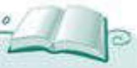
20.39. Функцияныи мәндер жиынын табындар:

1) $y=x^{2}-4 x+1$;
2) $y=-x^{2}+2 x+3$;
3) $y=\sqrt{x+1}-1$;
4) $y=2-\sqrt{1-x}$.
20.40. Берілген функциялардын графиктерін координаталык жазыктықта салындар және кнылысу нүктелерінін координаталарын (шамамен) табындар:
5) $y=x^{2}-2 x$ және $y=x-2$;
6) $y=-x^{2}-4 x$ және $y=x^{2}-2$.

## Жана білімді менгеруге арналған тірек ұғымдар

Санды шенбер, координаталык ширек, санды аргументтін тригонометриятых функциясы, бұрыштын жаты турі, тригонометриялых функциятардын анықтату облысы мен мәндер жиыны, эр тригонометриятых функцияныи анықтату обтысына кірепін бұрыи манінің жазыгуынын жаты түрі, жиі кездесетін бұрыитардын тригонаметриятык функциятарынын мәндері.

## §21. ТРИГОНОМЕТРИЯЛЫК ФУНКЦИЯЛАРДЫН КАСИЕТТЕРІ

## Түйінді уғымдар

Аныкталу облысы мен мәндер жныны, жүптығы (тактығы), пернодтылығы, бірсарындылығы және таюбагурактылық аратыктары

Бірлік шеңбердің көмегімен тригонометриялық функциялардың анықталу облысы мен мәндер жиынын табуды;

тригонометриялық функциялардың жұптығын (тақтығын), периодтылығын, бірсарындылығын және таңбатұрақтылық аралықтарын түсіндіруді үйренесіңдер.

## Тригонометриялык функциялардыи аныкталу облысы мен мәндер жиыны

$\sin \alpha$ бірлік шенбер нүктесінін ординатасы, ал $\cos \alpha$ бірлік шенбер нүктесінін абсциссасы болғандыктан, $\alpha$ аргументінін кез келген мәндерінде $y=\sin \alpha, y=\cos \alpha$ функцияларынын накты мәндері болады. Сондыктан бұл тригонометриялык функциялардын аныкталу облысы ( $-^{\infty} ;+^{\infty}$ ) аралығы болады.

$$
\begin{aligned}
& y=\sin \alpha, y=\cos \alpha \text { функцияларынын аныкталу облысы } \\
& (-\infty ;+\infty) \text { аралығы болады. }
\end{aligned}
$$

$\alpha$ кандай мән кабылдаса да $\sin \alpha$ және $\cos \alpha$-нын мәндері 1-ден аспайды және -1-ден кіші болмайды. Сондыктан жылжымалы $O B$ радиусынын ұшы болатын $B$ нүктесінін абсциссасы да, ординатасы да модулі бойынша радиустын ұзындығынан, ягни 1-ден артык болмайды.

Сонымен, $\sin \alpha$ және $\cos \alpha$-нын мәндері $[-1 ; 1]$ санды кесіндісіне тністі.

$$
\begin{aligned}
& y=\sin \alpha \text { және } y=\cos \alpha \text { функиняларынын мәндер жныны } \\
& {[-1 ; 1] \text { кесіндісі болады. }}
\end{aligned}
$$

$\operatorname{tg} \alpha$ және $\operatorname{ctg} \alpha$-нын мәндері $B$ нүктесінін координаталарынын катынасымен ернектелетіні жоғарыда айтылған.

Бұл катынастарда, егер B нүктесінін абсциссасы нелте тен болса, онда $\operatorname{tg} G$-нын мәні болмайлы, ал егер $B$ нүктесінін ординатасы нелге тен болса, онда ctg $\alpha$-нын мәні болмайды (ейткені белшектін белімі нелге тен болмауы керек).

Демек, $\alpha$-нын $\pm \frac{\pi}{2} ; \pm \frac{3 \pi}{2}$ және т.с.с. мәндері $\operatorname{tg} \alpha$-нын аныкталу облысына кірмейді; ал $\alpha$-нын $0, \pm \pi ; \pm 2 \pi$ және т.с.с. мәндері ctg $\alpha$-нын аныкталу облысына кірмейді.

Осы бұрыштарды біріктіріп темендегі тұжырымды аламыз.
$\frac{\pi}{2}+\pi k$ (мундағы $k$ - кез келген бүтін сан) мәндерінен баска $\alpha$-нын барлык мәндері $y=\operatorname{tg} \alpha$ функциясынын анықталу облысы болады;

Пk (мұндағы k - кез келген бүтін сан) мәндерінен баска а-нын барлык мәндері $y=\operatorname{ctg} \alpha$ функшясынын аныкталу облысы болады.

(3)1) $n$-нін мәні 0,$1 ; 0,01 ; 0,00001 ; 0,000000001$-ге тен болганда, $\frac{1}{n}$ белшегінің мәнін есептендер. Белімі 0-ге дейін кемігенде алымы 1 саны және белімі он сан болатын белшектін мәні калай езгереді? 2) n-нін мәні $-0,1 ;-0,01 ;-0,00001 ;-0,000000001$-ге тен болғанда, $\frac{1}{n}$ белшегінін мәнін есептендер. Белімі 0-re дейін артканда алымы 1 саны және белімі теріс сан болатын белшектін мәні қалай өзгереді?
$\operatorname{tg} \alpha=\frac{\sin \alpha}{\cos \alpha}, \operatorname{ctg} \alpha=\frac{\cos \alpha}{\sin \alpha}$ және $|\sin \alpha| m_{1},|\cos \alpha| m_{1}$ болғандыктан, белш ектін белімін ін мәні нелге дейін кеміген кезде онын белімі он сан болса, бөлшектін мәні шексіздікке, яғни $+\infty$-ке дейін өзгереді, ал белімі теріс сан болса, белшектін мәні шексіздікке, яғни - ${ }^{\infty}$-ке дейін езгереді.
> $y=\operatorname{tg} \alpha, y=\operatorname{ctg} \alpha$ функцияларынын мәндер жныны ( $-\infty ;+\infty$ ) аралығы болады.

## Тригонометриялык функциялардын танбатұрактылык аралыктары

$\sin \alpha, \cos \alpha, \operatorname{tg} \alpha, \operatorname{ctg} \alpha$ аныктамасынан әрбір $y=\sin \alpha, y=\cos \alpha$, $y=\operatorname{tg} \alpha, y=\operatorname{ctg} \alpha$ тригонометрнялык функцияларынын танбалары ("+" және "-") жылжымалы раднустын ұшынын координаталарынын танбаларына, яғни жылжымалы радиустын ұшы кай координаталык ширекте жатканына байланысты болады.

Бірлік шенбердін $A, B, C, P, K$ нүктелерінін абсщиссалары мен оршнаталарын табындар (62-сурет ).

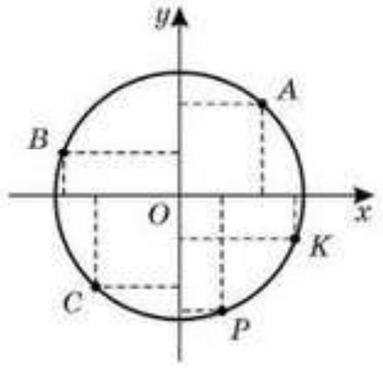
62-cypet

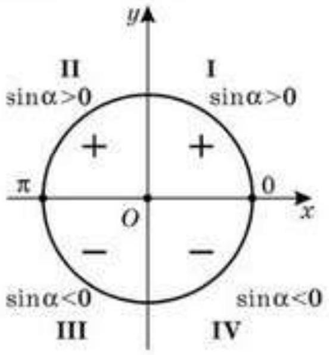
63-cypet

$B$ жоғарғы жарты шенберге тиісті болса, онда $y$ ординатасынын танбасы он, ал $B$ нүктесі теменгі жарты шенберге тністі болса, онда $y$ ординатасынын танбасы теріс болады. Бұрыштын синусынын танбасы, аныктама бойынша $y$ ординатасынын танбасына байланысты болғандыктан, I мен II ширектерде $\sin \alpha>0$, III пен IV ширектерде $\sin \alpha<0$ (63-сурет).

Бұрыштың косннусының танбасы, аныктама боїынша $x$ абсшиссасынын танбасына байланысты. $\quad B$ он жактағы жарты шенберге тиісті болса, онда $x$ абсциссасынын танбасы он, ал $B$ нүктесі сол жактағы жарты шенберге тиісті болса, онда $x$ абсциссасынын танбасы теріс болады. Сондыктан I және IV ширектерде $\cos \alpha>0$, II және III ширектерде $\cos \alpha<0$ (64-сурет).
$\operatorname{tg} \alpha=\frac{y}{x}, \operatorname{ctg} \alpha=\frac{x}{y}$ болғандыктан, бұл функциялардын танбалары $B$ нүктесінін координаталарынын танбасы бірдей болат ын координаталық ширектерде он, ал $B$ нүктесінін координаталарынын танбасы әртүрлі болатын координата лык ширектерде теріс болады.

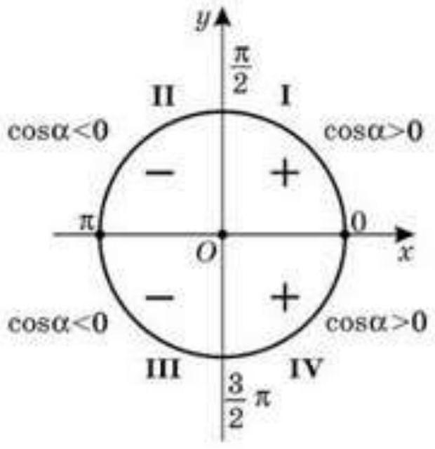
64-cypet

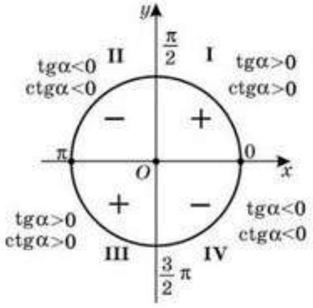
65-cypet

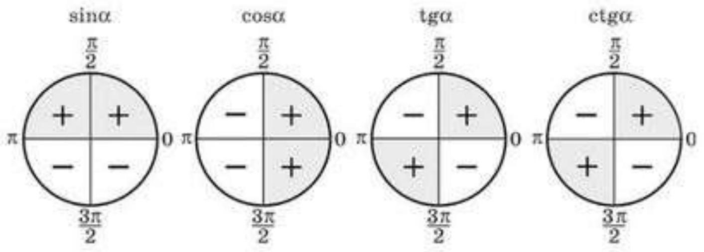
66-cyper

Сондыктан I және III ширектерде $\operatorname{tg} \alpha>0$, $\operatorname{ctg} \alpha>0$, II және IV ширектерде $\operatorname{tg} \alpha<0, \operatorname{ctg} \alpha<0$ (65-cyper).

66-суретте а бұрышыныи синусы, косннусы, тангенсі және котангенсінін танбалары көрсетілген.

7-кестеде а бұрышынын синусы, косннусы, тангенсі және котангенсінін танбалары керсетілген.

7-кесте
| Ширек | I | II | III | IV |
| :--- | :--- | :--- | :--- | :--- |
| Функшия | $0<\alpha<\frac{\pi}{2}$ | $\frac{\pi}{2}<a<\pi$ | $\pi<a<\frac{3 \pi}{2}$ | $\frac{3 \pi}{2}<a<2 \pi$ |
| $\sin \alpha$ | + | + | - | - |
| $\cos \alpha$ | + | - | - | + |
| $\operatorname{tg} \alpha$ | $+$ | - | + | - |
| ctg $\alpha$ | + | - | + | - |

## Тригонометриялык функциялардыи периодтылығы

Жоғ арыда жылжымалы рашустын толык бір айналым жасауы карастырылды. Егер жылжымалы раднусты бұруды әрі карай жалғастырса, онда ол 0 -ден 2 П-ге дейінгі орыннын біреуіне келетіні белгілі. Жылжымалы раднустын толык айналымынын санын арттырғанмен бұл мәндер өзгеріссіз калып отырады.
α-ға 2 П-ді канша рет косса да 0 бұрышынын спнусы, косинусы, тангенсі және котангенсінін мәндері өзгеріссіз калады.

67-суретте $O A$ радиусын а бұрышына, $\alpha+360^{\circ}$ бұрышына, $\alpha+2+360^{\circ}$ бұрышына және т.с.с. бұрғанда, $O B$ радиусынын кайтадан шығатыны керсетілген. Сондыктан $\alpha$, $\alpha+360^{\circ}, \alpha+2 \cdot 360^{\circ}$ және т.с.с. бұрыштар үшін синус, коспнус, тангенс және котангенстін мәндері бірдей болады.

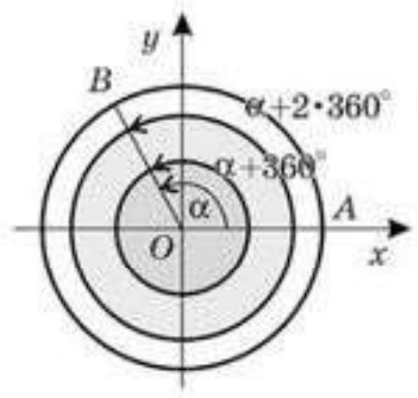
67-cypet

## МЫСАЛ

1. $\sin 45^{\circ}=\sin \left(45^{\circ}+360^{\circ}\right)=\sin \left(45^{\circ}-360^{\circ}\right)=\sin \left(45^{\circ}+2 \cdot 360^{\circ}\right)= =\sin \left(45^{\circ}-2 \cdot 360^{\circ}\right)=\sin \left(45^{\circ}+3 \cdot 360^{\circ}\right)=\ldots=\frac{\sqrt{2}}{2}$.

Бұл каснет кез келген бұрыштын синусы, косинусы, тангенсі және котангенсінін мәнін табуды $360^{\circ}$-тан кіші теріс емес бұрыштын мәнін табуға әкеледі.

## МЫСАЛ

2. 3) $\left.\sin 1470^{\circ} ; 2\right) \cos \left(-1845^{\circ}\right)$ ернегінін мәнін табайық.

Шешуі. $1470^{\circ}$ бұрышта канша толык бұрыш бар екенін аныктайык. Ол үшін $1470^{\circ}: 360^{\circ}$ амалын орындаймыз. Сонда беліндіде 4 және калдыкта $30^{\circ}$ шығалы. Демек, $1470^{\circ}=360^{\circ} \cdot 4+30^{\circ}$.

Ендеше $\sin 1470^{\circ}=\sin \left(360^{\circ} \cdot 4+30^{\circ}\right)=\sin 30^{\circ}=\frac{1}{2}$.
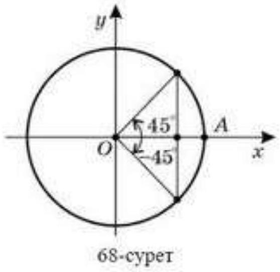
2) $-1845^{\circ}$ бұрышта канша толык бұрыш бар екенін аныктайық. Ол үшін $1845^{\circ}: 360^{\circ}$ амалын орындаймыз. Сонда бөліндіде 5 және калдыкта $45^{\circ}$ шығады.

Демек, $-1845^{\circ}=-360^{\circ} \cdot 5-45^{\circ}$.
$\cos \left(-1845^{\circ}\right)=\cos \left(-360^{\circ} \cdot 5-45^{\circ}\right)=\cos \left(-45^{\circ}\right)= =\frac{\sqrt{2}}{2}$, себебі $\cos \left(-45^{\circ}\right)=\cos 45^{\circ}(68$-сурет $)$.

Жауабы :

1) $\frac{1}{2}$;
2) $\frac{\sqrt{2}}{2}$.

Жоғарыда керсетілген каснеттері бар функшияларды пернодты функциялар деп атайды.

Егер $y=f(x)$ аныктату обтысынан атынган кез келген $x$ ушін $f(x-T)=f(x)=f(x+T)$ тендігі орындагатындай нелге тен емес $T$ саны бар богса, онда $y=f(x)$ функциясы периодты функция, ал ен кіиі $T$ саны функциянын периоды деп аталады.

Демек, $y=\sin x ; y=\cos x ; y=\operatorname{tg} x ; y=\operatorname{ctg} x$ функциялары пернодты функциялар.

Тригонометриялык функциялардан баска да периодты функциялар болады. $y=[x]$ функциясы, мұндағы $[x]-x$ санынын бүтін белігі ( $x$-тен артпайтын ен үлкен бүтін сан), $y=\{x\}$ функщиясын, мұндағы $\{x\}-x$ саныныи белшек белігі, аныктауға мүмкіндік береді. Аныктама бойынша $\{x\}=x-[x]$ (мысалы, $\{3,7\}=$
$=0,7 ;\{-6\}=0 ;\{-4,2\}=-4,2-(-5)=0,8)$. Санныи белшек белігі - перноды $T=1$ болатын функшия.

Санныи бүтін бөлігі $x$-тен Антье деп аталады және $E(x)=[x]$ деп белгіленеді. $E(x)=[x]$ графигі 69-суретте берілген.

Санныи белшек белігінін $y=\{x\}=x-[x]$ графигі 70-суретте керсетілген.

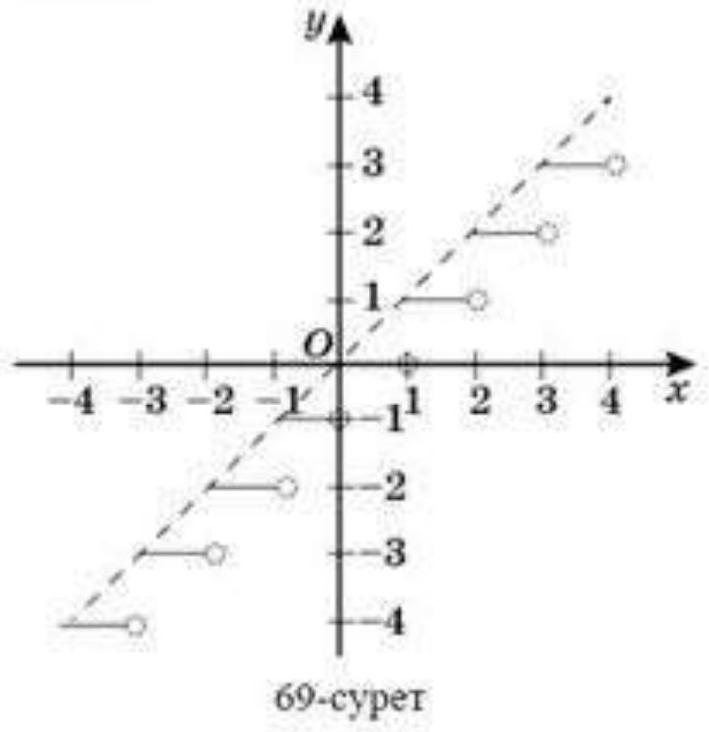
Тригонометриялык функциялардын жұптылығы

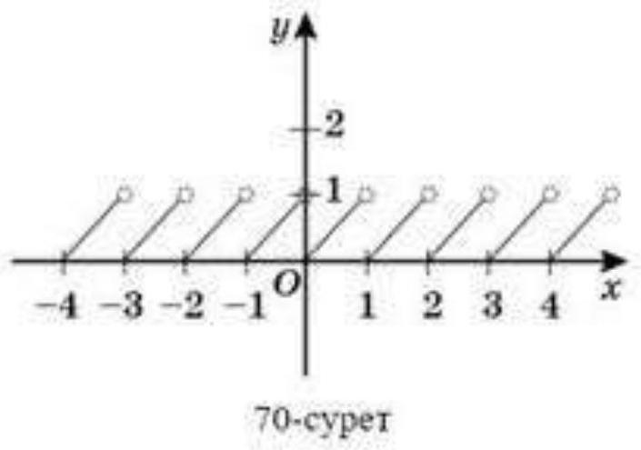
Тригонометриялык функциялардын жұптылығы

Тікбұрышты координаталар жүйесінде центрі координаталар басында және радиусы $O A$ кесіндісі болатын шенберді карастырайык.
$O A$ радиусын $\alpha$ бұрышына бұрганда $O B$ радиусына, ал $O A$ раднусын - $\alpha$ бұрышына бұрғанда $O B_{1}$ раднусына кешсін (71-сурет).

Erep $B$ және $B_{1}$ нүктелерін косса, онда $O B B_{1}$ тенбүйірлі үшбұрышы шығады. $O P$ осы $B O B_{1}$ ушбұрышынын биссектрисасы.

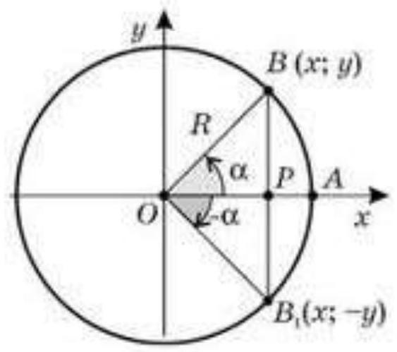
71-cypex

## СЕНДЕР БІЛЕСІҢДЕР

$O x$ осіне карағанда симметриялы нүктелердін абсциссалары бірдей, ал ординаталары карама-карсы болатыны белгілі. Сондыктан $B$ нүктесінін координаталарын $x$ және $y$ аркылы белгілесек, онда $B_{1}$ нүктесінін коорднаталары $x$ және $-y$ болады.

Сонда

$$
\begin{gathered}
\sin (-\alpha)=\frac{-y}{R}=-\sin \alpha ; \quad \operatorname{tg}(-\alpha)=\frac{-y}{x}=-\operatorname{tg} \alpha ; \\
\cos (-\alpha)=\frac{x}{R}=\cos \alpha ; \quad \operatorname{ctg}(-\alpha)=\frac{x}{-y}=-\operatorname{ctg} \alpha .
\end{gathered}
$$

Яғни, мына тендіктерді аламыз:

$$
\begin{array}{ll}
\sin (-\alpha)=-\sin \alpha ; & \cos (-\alpha)=\cos \alpha ; \\
\operatorname{tg}(-\alpha)=-\operatorname{tg} \alpha ; & \operatorname{ctg}(-\alpha)=-\operatorname{ctg} \alpha .
\end{array}
$$

## СЕНДЕР БІЛЕСІҢДЕР

Функцияныи аныкталу облысынан алынған кез келген $x$ ушін $f(-x)=f(x)$ тендігі орындалса, онда функциянын жүп, ал егер $f(-x)=-f(x)$ тендігі орындалса, онда функциянын так болатыны белгілі. Сондыктан жогарыда алынған тендіктерден $y=\sin x ; y=\operatorname{tg} x$; $y=\operatorname{ctg} x$ функциялары так функциялар, ал $y=\cos x$ функциясы жци функция болады деген корытынды жасауға болады.

## МЫСАЛ

3. Тригонометрнялык функциялардын жұптылығын колданып, $\sin \left(-60^{\circ}\right) ; \cos \left(-60^{\circ}\right) ; \operatorname{tg}(-459) ; \operatorname{ctg}(-309)$ ернектерінін мәндерін табайык.

Шешуі. $\quad \sin \left(-60^{\circ}\right)=-\sin 60^{\circ}=-\frac{\sqrt{3}}{2} ; \cos \left(-60^{\circ}\right)=\cos 60^{\circ}=\frac{1}{2} ; \operatorname{tg}\left(-45^{\circ}\right)=-\operatorname{tg} 45^{\circ}=-1 ; \quad \operatorname{ctg}\left(-30^{\circ}\right)=-\operatorname{ctg} 30^{\circ}=-\sqrt{3}$.

Жауабы; $-\frac{\sqrt{3}}{2} ; \frac{1}{2} ;-1 ;-\sqrt{3}$.
(2) 1. $\sin \alpha=2 ; \cos \alpha=-0,0001 ; \operatorname{tg} x=1000000$ тендігі тура болатындай бұрыш болуы мүмкін бе?
2. Қай шпректе спнус, косннус, тангенс және котантенстін танбалары бірдеї?
3. Қарама-карсы бұрыштардын сннусы, косннусы, тантенсі жане котангенсі арасында кандай байланыс бар?
4. Теріс бұрыштын спнусы он болуы мүмкін бе? Мысая келтіріндер.

## Жаттығулар

## A

21.1. Erep:

1) $\alpha=67^{\circ}$;
2) $\alpha=127^{\circ}$;
3) $d=267^{\circ}$;
4) $\alpha=319^{\circ}$ болса, онда $\sin \alpha, \cos \alpha, \operatorname{tg} \alpha$ ернектер мәндерінін танбалары кандай?
21.2.
5) $\sin 79^{\circ}$;
6) $\sin 187^{\circ}$;
7) $\cos 145^{\circ}$;
8) $\cos 235^{\circ}$;
9) $\operatorname{tg} 123^{\circ}$;
10) $\operatorname{tg} 247^{\circ}$;
11) $\sin 88^{\circ} \cos 124^{\circ}$;
12) $\sin 128^{\circ} \cos 224^{\circ} ;$
13) $\sin 280^{\circ} \cos 254^{\circ}$; танбасьн аныктандар.
14) $\sin 258^{\circ} \cos 184^{\circ}$ eрнегі мәнініц
21.3. Erep:
15) $\sin \alpha>0$ және $\cos \alpha<0$;
16) $\sin \alpha<0$ және $\cos \alpha<0 ;$
17) $\sin \alpha<0$ және $\cos \alpha>0$;
18) $\sin \alpha>0$ және $\cos \alpha>0 ;$
19) $\sin \alpha<0$ және $\operatorname{tg} \alpha>0$;
20) $\operatorname{tg} \alpha>0$ және $\cos \alpha<0$ болса,

онда $\alpha$ бұрышы кай ширекте орналаскан?
21.4. 1) $\sin \frac{3 \pi}{5} ; \quad$ 2) $\sin \frac{7 \pi}{4} ; \quad$ 3) $\cos \frac{13 \pi}{3} ; \quad$ 4) $\cos \frac{31 \pi}{7} ;$
5) $\operatorname{tg} \frac{15 \pi}{4}$;
6) $\operatorname{ctg} \frac{36 \pi}{11}$;
7) $\sin 2,7 \pi ;$
8) $\sin (-1,4 \pi)$
9) $\cos (-3,5 \mathrm{TI})$;
10) $\cos (-5,6 \pi)$;
11) $\operatorname{tg}(-4,2 \pi)$;
12) $\operatorname{ctg}(-5,2 \pi)$. өрнегі мәнініц танбасын аныктандар.
21.5. 1) $\sin 0,6$ және $\sin 4,8$;
2) $\sin 1,6$ және $\sin 5,4$;
3) $\cos 1,96$ және $\cos 5,8$;
4) $\cos 1,2$ және $\sin 3,8$ ернектерінін мәндерін салыстырындар.
21.6. 1) $\sin \frac{\pi}{3} ; \sin \frac{5 \pi}{6} ; \sin \frac{4 \pi}{3} ; \quad$ 2) $\cos \frac{\pi}{4} ; \cos \frac{5 \pi}{6} ; \cos \left(-\frac{\pi}{6}\right) ;$
3) $\operatorname{tg} \frac{\pi}{3} ; \operatorname{tg} \frac{5 \pi}{6} ; \operatorname{tg} \frac{5 \pi}{4}$ ернектерінін мәндерін есу ретімен жазындар.
21.7. $R$ жнынында $f(x)$ функшисы берілген. $x=2$ болғанда, $f(2+ +a)=f(2)$ және $x=5$ болғанда, $f(5+a)=f(5) . f(x)$ функциясы пернодты және онын перноды $T=a$ деп айтуға бола ма?
21.8. 1) $\sin 30^{\circ}-2 \cos \left(-60^{\circ}\right)$; 2) $2 \operatorname{tg} 225^{\circ}-\cos 45^{\circ}$;
3) $3 \cos 270^{\circ}-\operatorname{ctg} 250^{\circ}$; 4) $4 \sin 60^{\circ}-\operatorname{ctg}\left(-60^{\circ}\right)$ айырымынын танбасын аныктандар.

## B

21.9 1) $\sin 45^{\circ} \cos 120^{\circ} \operatorname{tg} 135^{\circ}$;
2) $\sin 60^{\circ} \cos 180^{\circ} \operatorname{ctg} 135^{\circ}$;
3) $\sin 215^{\circ} \cos 150^{\circ} \operatorname{tg} 225^{\circ}$;
4) $\operatorname{tg} 145^{\circ} \cos 220^{\circ} \operatorname{tg} 335^{\circ}$ санды ернегі мәнінін танбасын аныктандар.
21.10. Erep:

1) $270^{\circ}<\alpha<360^{\circ}$ болса, онда $\cos ^{2} \alpha<\cos \alpha$;
2) $180^{\circ}<\alpha<270^{\circ}$ болса, онда $\cos ^{2} \alpha>\cos \alpha$;
3) $90^{\circ}<\alpha<180^{\circ}$ болса, онда $\sin ^{2} \alpha<\sin \alpha$;
4) $270^{\circ}<\alpha<360^{\circ}$ болса, онда $\sin ^{2} \alpha>\sin \alpha$ тенсіздігін дәлелдендер.
21.11. Erep:
5) $|\sin \alpha|=\sin \alpha$;
6) $|\sin \alpha|>\sin \alpha$;
7) $|\cos \alpha|=\cos \alpha$;
8) $|\cos \alpha|>\cos \alpha$;
9) $|\operatorname{tg} \alpha|=\operatorname{tg} \alpha$;
10) $|\operatorname{tg} \alpha|>\operatorname{tg} \alpha$;
11) $|\operatorname{ctg} \alpha|=\operatorname{ctg} \alpha$;
12) $|\operatorname{ctg} \alpha|>\operatorname{ctg} \alpha$ болса, онда $\alpha$ бұрышы кай ширекке тиісті болады?
21.12. $y=f(x)$ функщиясыныи графигі бойынша функшияныи периодты болатынын аныктандар. Егер $y=f(x)$ функциясы пернодты болса, онда онын пернодын табындар (72-сурет).

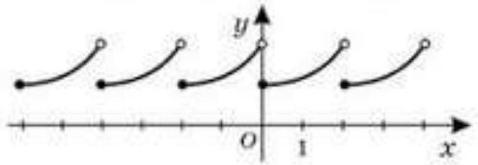
1)

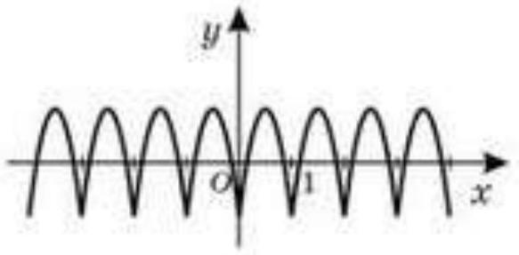
2)

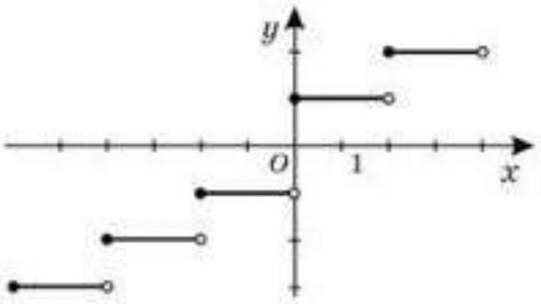
3)

72-сурет
21.13. 1) $1-\sin 215^{\circ} \cos 135^{\circ} \operatorname{tg} 229^{\circ}$;
2) $\sin 320^{\circ} \cos 285^{\circ} \operatorname{tg} 30^{\circ}-2$ өрнегінің таңбасын табындар.
21.14. $y=f(x)$ функщиясыныи перноды $T=3$ екені белгілі.

1) $y=f(x)+5$;
2) $y=f(x)-3$;
3) $y=2 f(x)$;
4) $y=-f(x)$

функциясынын пернодын табындар.
21.15. Егер параллелограмнын бір бұрышының косинусынын мәні:

1) $\frac{\sqrt{3}}{2}$;
2) $\frac{\sqrt{2}}{2}$;
3) $-0,5$;
4) $-\frac{\sqrt{3}}{2}$ болса, онда парал- лелограмныи бұрыштарын табындар.
21.16. Егер параллелограмныи бір бұрышынын тангенсінін мәні:
5) $\frac{\sqrt{3}}{3}$;
6) $\sqrt{3}$;
З) -1 ;
7) $-\frac{\sqrt{3}}{3}$ болса, онда параллелограм нын бұрыштарын табындар.
21.17. Егер тенбүйірлі трапецияның бір бұрышынын косинусыныи мәні:
8) $\frac{\sqrt{3}}{2}$;
9) $\frac{\sqrt{2}}{2}$;
з) $-0,5$;
10) $-\frac{\sqrt{3}}{2}$ болса, онда

трапешияныи бұрыштарын табында р.
21.18. $0^{\circ}<\alpha<90^{\circ}$ екені белгілі.

1) $\sin \alpha>\sin ^{4} \alpha$;
2) $\cos \alpha>\cos ^{4} \alpha$;
3) $\sin \alpha>\sin \alpha \cdot \cos \alpha$;
4) $\operatorname{tg} \alpha>\sin \alpha \cdot \operatorname{tg} \alpha$ тенсіздігін дәлелдендер.

## C

21.19. Erep $0^{\circ}<\alpha<90^{\circ}$ болса, онда $\sin \alpha+\cos \alpha>1$ тенсіздігін делелдендер.
21.20. Кез келген $\alpha$ бұрышы үшін $|\sin \alpha|+|\cos \alpha| 1+$ тенсіздігінін тура болатынын дәлелдендер.
21.21. 1) $1+3 \sin 2 x$; 2) $3-2 \sin 3 x$; 3) $4-3 \cos 2 x$; 4) $2-0,5 \cos x$ ернегінін ен кіші және ен үлкен мәнін табындар.
*21.22. $R$ жнынынца $y=f(x)$ функшясы берілген және онын перноды $T=4 . x \in[0 ; 4]$ аралығында функция $y=x^{2}-4 x$ формуласымен берілген. $y=f(x)$ функциясынын $\quad R$ жнынындағы графигін салындар.
21.23.

1) $1+\sin ^{2} 2 x$;
2) $4-\sin ^{4} 3 x$;
3) $4-3|\cos 2 x|$;
4) $2,4-0,5 \cos ^{2} x$ ернегінін ен кіші және ен үлкен мәнін табындар.
*21.24. $y=f(x)$ функшисынын пернодын табындар:
5) $y=\sin 2 \pi x+\cos 4 \pi x ;$
6) $y=\sin \pi x+\cos 2 \pi x$;
7) $y=\cos 4 \pi r+\sin 8 \pi r$;
8) $y=\operatorname{tg} 4 \pi x+\sin 2 \pi x$.

## ҚАЙТАЛАУ

21.25. 1) $y=\frac{x^{2}-4}{x-2} ; \quad$ 2) $y=\frac{x^{2}-9}{x+3} ; \quad$ 3) $y=\frac{2 x^{2}}{x} ; \quad$ 4) $y=\frac{2(x-1)^{2}}{x-1}$ функиияс ынын графигін салып, мәндер жиынын керсетіндер.
21.26. 1) $\left\{\begin{array}{l}x^{2}+y^{2}=5 \\ x^{2}-y^{2}=3\end{array}\right.$ 2) $\left\{\begin{array}{l}x^{2}+y^{2}=18, \\ x y=9\end{array}\right.$ тендеулер жүйесін шешін дер.
21.27. 1) $\frac{x+a}{x^{2}+a x+a^{2}} \cdot \frac{x^{3}-a^{3}}{a^{2}-x^{2}}:\left(1-\frac{1+a}{a}\right)$;
2) $\left(\frac{4 b+a}{2 b}+\frac{6 b}{a-4 b}\right)+\left(\frac{a^{2}-2 a b+b^{2}}{4 b^{2}-a^{2}}+1\right)$ ернегін ыкшамдандар.
21.28. Тікбұрышты үшбұрыштын катеттерінін косындысынын мәні 79 см-ге тен. Егер онын бір катетін 23 см-ге арттырып, екіншісін 11 см-ге кемітсе, онда шыккан үшбұрыш пен бе-

рілген үшбұрыштың гипотенузаларынын ұзындығы бірдей
болады. Үшбұрыштын катеттерінін ұзындыктарын табындар.

## Жана білімді менгеруге дайындаламыз

21.29. Тепе-тендіктін акикаттығын тексеріндер:

1) $\sin ^{2} 60^{\circ}+\cos ^{2} 60^{\circ}-\operatorname{tg} 45^{\circ}=0$;
2) $\sin ^{2} 45^{\circ}+\cos ^{2} 45^{\circ}-\operatorname{ctg} 45^{\circ}=0$.
21.30. $\sin \alpha$ және $\cos \alpha$ кандай ширектерде:
3) бірдей танбаны;
4) әртүрлі танбаларды кабылдайды?

## Жана білімді менгеруге арналған тірек ұғымдар

Тепе-тендік, бұрыитын тригонометриялық функциясы, тригононетриятық функция.лар ареументінін мумкін болатын мәндері, тригонометриялых функциялардын мәндер жиыны, жұп және так тригонаметриятых функциятар, Пифагор теоремасы.

## §22. ТРИГОНОМЕТРИЯЛЬК ТЕПЕ-ТЕНДКТЕР

## Түйінді ұғымдар

Тригонометриялык те-пе-тендіктер, синус, коспнус. тантенс және котантенс

Негізгі тригонометриялық тепе-теңдіктерді қорытып шығару мен қолдануды үйренесіндер.
$\sin \alpha, \cos \alpha, \operatorname{tg} \alpha, \operatorname{ctg} \alpha$-нын мәндері радиустын шамасына тәуелді емес, тек бұрыштын шамасына ғана тәуелді болғандыктан, тригонометриялык функиняларды қарастырғанда радиусы 1-ге тен шенберді аламыз. Онда, мысалы, сннус функшиясынын мәні $O B$ жылжымалы радиусыныи ұшы $B$ нүктесінін $y$ ордннатасымен, ал косннус функциясынын мәні $O B$ жылжымалы радигусынын $B$ нүктесінін $x$ абсшиссасымен аныкталады (73.1-сурет).
$O B C$ тікбұрышты ушбұрышын карастырайык (73.2-сурет). Пифагор теоремасы бойынша $O B^{2}=O C^{2}+B C^{2}$.
$O B=1, O C=x=\cos \alpha, B C=y=\sin \alpha$ болғандыктан,$\quad 1=\cos ^{2} \alpha+ +\sin ^{2} \mathrm{~d}$ немесе

$$
\begin{equation*}
\sin ^{2} \alpha+\cos ^{2} \alpha=1 . \tag{1}
\end{equation*}
$$

Бұл тендік $\alpha$-нын кез келген мәнінде тура болады, яғни ол тепетендік.

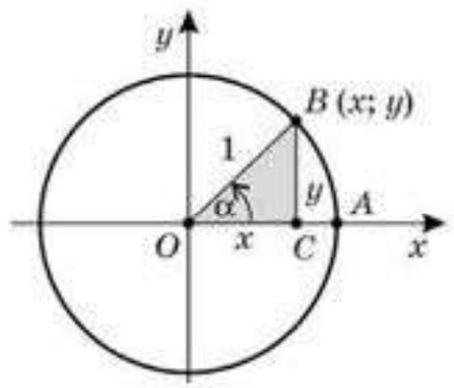
1)

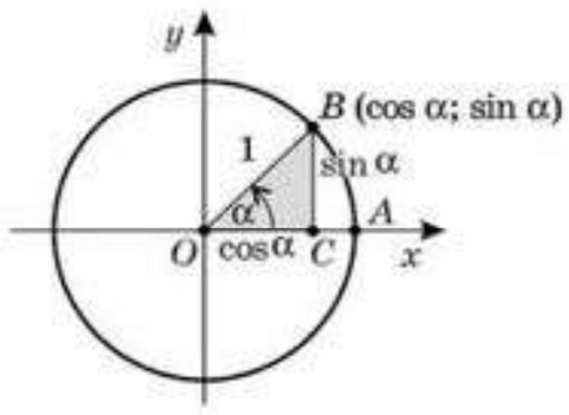
2)

73-cyper
Аныктама бойынша $\operatorname{tg} \alpha=\frac{y}{x}, \operatorname{ctg} \alpha=\frac{x}{y}$ жене $y=\sin \alpha, x=\cos \alpha$ болғандыктан,

$$
\begin{align*}
& \operatorname{tg} \alpha=\frac{\sin \alpha}{\cos \alpha},  \tag{2}\\
& \operatorname{ctg} \alpha=\frac{\cos \alpha}{\sin \alpha} . \tag{3}
\end{align*}
$$

(1) - (3) тендіктерді негізгі тригонометриятык тепе-теноіктер деп атайды.

## ЕСТЕ САҚТАҢДАР

Негізгі тригонометриялык тепе-тендіктер :

$$
\begin{gathered}
\sin ^{2} \alpha+\cos ^{2} \alpha=1 \\
\operatorname{tg} \alpha=\frac{\sin \alpha}{\cos \alpha} \\
\operatorname{ctg} \alpha=\frac{\cos \alpha}{\sin \alpha}
\end{gathered}
$$

Кұрамында тригонометриялық функциялары бар және бұрыитын кез кепеен мумкін мәнінде акиқат, ал функцияны кез кетген шамамен адмастыреанда акиқат болмайтын тендік тригонаметриялық тепе-тендік деп аталады.

Мысалы, 1) $(\sin \alpha+\cos \alpha)^{2}=\sin ^{2} \alpha+2 \sin \alpha \cos \alpha+\cos ^{2} \alpha$ тепе-тендігі тригонометриялык тепе-тендік болмайды. Өйткені $\sin \alpha$ және $\cos \alpha$ шамаларын сәйкесінше $a$ және $b$ шамаларымен алмастырса, онда тура тендік шығады. Онда ол алгебралык тепе-тендік болады: $(a+b)^{2}=a^{2}+2 a b+b^{2}$.
2) $(\sin \alpha+\cos \alpha)^{2}=1+2 \sin \alpha \cos \alpha$ тепе-тендігі тригонометриялык тепе-тендік болады. Өйткені $a$ және $b$ шамаларын сәйкесінше $a$

және $b$ шамаларымен алмастырса, онда тура емес $(a+b)^{2}=1+2 a b$ тендігі шығады.
(2) және (3) тепе-те ндіктерін мүшелеп көбейтіп, $\operatorname{tg} \alpha \cdot \operatorname{ctg} \alpha= =\frac{\sin \alpha}{\cos \alpha} \cdot \frac{\cos \alpha}{\sin \alpha}=1$, Яғни

$$
\begin{equation*}
\operatorname{tg} \alpha \cdot \operatorname{ctg} \alpha=1 \tag{4}
\end{equation*}
$$

тригонометриялық тепе-тендігін аламыз.
Егер (1) тепе-тендіктін екі жағын $\sin \alpha \neq 0$ деп $\sin ^{2} \alpha$-ға белсек, онда $\frac{\sin ^{2} \alpha}{\sin ^{2} \alpha}+\frac{\cos ^{2} \alpha}{\sin ^{2} \alpha}=\frac{1}{\sin ^{2} \alpha}$ тендігін, немесе

$$
\begin{equation*}
1+\operatorname{ctg}^{2} \alpha=\frac{1}{\sin ^{2} \alpha} \tag{5}
\end{equation*}
$$

тригонометрнялык тепе-тендігін аламыз.
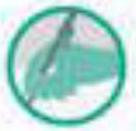

Мына тепе-тендіктерді дәлелдендер:

$$
\begin{align*}
1+\operatorname{tg}^{2} \alpha & =\frac{1}{\cos ^{2} \alpha}  \tag{6}\\
\operatorname{tg} \alpha & =\frac{1}{\operatorname{ctg} \alpha}  \tag{7}\\
\operatorname{ctg} \alpha & =\frac{1}{\operatorname{tg} \alpha} \tag{8}
\end{align*}
$$

8-кестеде бір аргументке байланысты тригонометриялык функшиялардын арасындағы катынастар берілген.

| $\sin ^{2} \alpha+\cos ^{2} \alpha=1$ | $\operatorname{tg} \alpha=\frac{\sin \alpha}{\cos \alpha}=\frac{1}{\operatorname{ctg} \alpha}$ |
| :--- | :--- |
| $\sin \alpha= \pm \sqrt{1-\cos ^{2} \alpha}$ | $\operatorname{ctg} \alpha=\frac{\cos \alpha}{\sin \alpha}=\frac{1}{\operatorname{tg} \alpha}$ |
| $\cos \alpha= \pm \sqrt{1-\sin ^{2} \alpha}$ | $\operatorname{tg} \alpha \cdot \operatorname{ctg} \alpha=1$ |
| $1+\operatorname{tg}^{2} \alpha=\frac{1}{\cos ^{2} \alpha}$ | $1+\operatorname{ctg}^{2} \alpha=\frac{1}{\sin ^{2} \alpha}$ |

## МЫСАЛ

1. Егер $\cos \alpha=\frac{12}{13}$ және $0<\alpha<\frac{\pi}{2}$ болса, онда $\sin \alpha$, tg $\alpha$ және $\operatorname{ctg} \alpha$-нын мәндерін табайык.

Шешуi , (1) формуладан $\sin ^{2} \alpha=1-\cos ^{2} \alpha$ немесе $\sin \alpha= = \pm \sqrt{1-\cos ^{2} \alpha}$. Есептін шарты бойынша $\alpha$ бірінші ширектін бұрышы,

ал бұл ширекте көрсетілген функциялардың танбалары он. Ендеше $\sin \alpha=\sqrt{1-\left(\frac{12}{13}\right)^{2}}=\sqrt{1-\frac{144}{169}}=\sqrt{\frac{25}{169}}=\frac{5}{13}$.
(2) формула бойынша $\operatorname{tg} \alpha=\frac{\sin \alpha}{\cos \alpha}$, ал $\sin \alpha=\frac{5}{13}$ және $\cos \alpha=\frac{12}{13}$ болғандык тан, $\operatorname{tg} \alpha=\frac{\frac{5}{13}}{\frac{12}{13}}=\frac{5}{12}$. (8) формулада $\mathrm{H} \operatorname{ctg} \alpha=\frac{1}{\operatorname{tg} \alpha}=\frac{12}{5}= =2,4$ аламыз.

Жауабы $: \sin \alpha=\frac{5}{13}, \operatorname{tg} \alpha=\frac{5}{12}, \operatorname{ctg} \alpha=2,4$.

## МЫСАЛ

2. Егер $\sin \alpha=\frac{1}{2}$ және $\frac{\pi}{2}<\alpha<\pi$ болса, онда $\cos \alpha$, $\operatorname{tg} \alpha$ және $\operatorname{ctg} \alpha$ нын мәндерін табайық.

Шешуі . Есептін шарты боїынша $\alpha$ бұрышы II шректін бұрышы, сондыктан $\cos \alpha$, $\operatorname{tg} \alpha$ және $\operatorname{ctg} \alpha$ теріс мәндерді кабылдайды. Демек,
$\cos \alpha=-\sqrt{1-\sin ^{2} \alpha}=-\sqrt{1-\left(\frac{1}{2}\right)^{2}}=-\frac{\sqrt{3}}{2} ; \operatorname{tg} \alpha=\frac{\sin \alpha}{\cos \alpha}=-\frac{\sqrt{3}}{3} ; \operatorname{ctg} \alpha=\frac{1}{\operatorname{tg} \alpha}=-\sqrt{3}$.

Жауабы : $\cos \alpha=-\frac{\sqrt{3}}{2}, \operatorname{tg} \alpha=-\frac{\sqrt{3}}{3}, \operatorname{ctg} \alpha=-\sqrt{3}$.

## МЫСАЛ

3. $\operatorname{ctg} \alpha=-3$ және $\frac{3}{2} \pi<\alpha<2 \pi, \sin \alpha, \cos \alpha, \operatorname{tg} \alpha$-ны есептейк.

Шешуi $.1+\operatorname{ctg}^{2} \alpha=\frac{1}{\sin ^{2} \alpha}$ формуласынан $\sin ^{2} \alpha=\frac{1}{1+\operatorname{ctg}^{2} \alpha}$ аламыз.
$\sin \alpha$ және $\operatorname{tg} \alpha$-нын мәндері IV ширекте теріс, ал $\cos \alpha$-нын мәні он болғандыктан, $\sin \alpha=\sqrt{\frac{1}{1+9}}=-\sqrt{\frac{1}{10}}=-\frac{\sqrt{10}}{10} . \operatorname{ctg} \alpha=\frac{\cos \alpha}{\sin \alpha}$ формуласынан $\cos \alpha=\operatorname{ctg} \alpha \cdot \sin \alpha=-3 \cdot\left(-\frac{\sqrt{10}}{10}\right)=\frac{3 \sqrt{10}}{10}$. (7) формула дан $\operatorname{tg} \alpha=\frac{1}{\operatorname{ctg} \alpha}=-\frac{1}{3}$ шығады.

Жауабы $: \sin \alpha=-\frac{\sqrt{10}}{10}, \cos \alpha=\frac{3 \sqrt{10}}{10}, \operatorname{tg} \alpha=-\frac{1}{3}$.

## ?

1. Қандай тритонометриялык функшиялардын көбейтіндісі бірге тен?
2. Спнус және коспнус функиялары кандай тепе-тендікпен байланыскан?
3. Қандай бұрыштын спнусы мен осы бұрыштын кандай да бір шпрекке пистілігін біле отырып, берілген бұрыштын котангенсін есептеуге бола ма?

## Жаттығулар

## A

22.1. 1) $\cos \beta=0,5$ және $0^{\circ}<\beta<90^{\circ}$ болса, онда $\sin \beta$-ны;
2) $\sin \beta=0,5$ және $0^{\circ}<\beta<90^{\circ}$ болса, онда $\cos \beta$-ны;
3) $\cos \beta=-0,5$ және $90^{\circ}<\beta<180^{\circ}$ болса, онда $\sin \beta$-ны;
4) $\sin \beta=-0,5$ және $180^{\circ}<\beta<270^{\circ}$ болса, онда $\cos \beta$-ны есептендер.
22.2. Өрнекті ыкшамдандар:

1) $\frac{1-\sin ^{2} \alpha}{\cos \alpha}$;
2) $\frac{\cos ^{2} \alpha-1}{\sin \alpha}$;
3) $\sin ^{2} \alpha-\left(1+\operatorname{tg}^{2} \alpha\right) \cdot \cos ^{2} \alpha$;
4) $\sin ^{2} \alpha+\cos ^{2} \alpha \cdot\left(1+\operatorname{ctg}^{2} \alpha\right) \cdot \sin ^{2} \alpha$.
22.3. Erep:
5) $\sin \alpha=\frac{\sqrt{3}}{3}$ болса, онда $1-\sin \alpha \cos \alpha \operatorname{ctg} \alpha$;
6) $\operatorname{tg} \alpha=\frac{2}{3}$ болса, онда $\frac{\operatorname{tg} \alpha+\operatorname{ctg} \alpha}{\operatorname{tg} \alpha-\operatorname{ctg} \alpha}$;
7) $\operatorname{tg} \alpha=\frac{2}{5}$ болса, онда $\frac{\sin \alpha-\cos \alpha}{\sin \alpha+\cos \alpha}$;
8) $\operatorname{tg} \alpha=\frac{3}{2}$ болса, онда $\frac{\sin \alpha \cos \alpha}{\sin ^{2} \alpha-\cos ^{2} \alpha}$;
9) $\sin \alpha=\frac{2}{3}$ болса, онда $\frac{1-\operatorname{tg}^{2} \alpha}{1-\operatorname{ctg}^{2} \alpha}$;
10) $\cos \alpha=-\frac{1}{3}$ болса, онда $\frac{1-\operatorname{tg}^{2} \alpha}{1-\operatorname{ctg}^{2} \alpha}$ өрнегінін мәнін табындар.
22.4. Өрнекті ыкшамдандар:
11) $\frac{\sin \alpha \cos \alpha}{\operatorname{tg} \alpha}-1$;
12) $\frac{\sin \alpha \cos \alpha}{\operatorname{ctg} \alpha}-1$;
13) $\frac{1}{1-\cos \alpha}-\frac{1}{1+\cos \alpha}$;
14) $\frac{1+\operatorname{tg} \alpha}{1+\operatorname{ctg} \alpha}$;
15) $\frac{1-\operatorname{ctg} \alpha}{1-\operatorname{tg} \alpha}$;
16) $\frac{\operatorname{tg} \alpha-1}{\operatorname{ctg} \alpha-1}$;
17) $\frac{1}{1+\sin \alpha}-\frac{1}{1-\sin \alpha}$;
18) $\frac{\operatorname{ctg} \alpha+1}{\operatorname{tg} \alpha+1}$;
19) $\frac{\sin \alpha}{1+\cos \alpha}+\operatorname{ctg} \alpha$;
20) $\frac{\cos \alpha}{1-\sin \alpha}-\operatorname{tg} \alpha$;
21) $\frac{\sin \beta}{1-\cos \beta}+\frac{\sin \beta}{1+\cos \beta}$;
22) $\frac{\cos \beta}{1+\sin \beta}+\frac{\cos \beta}{1-\sin \beta}$.
22.5. Тепе-тендікті далелдендер:
23) $\frac{\sin x+\cos x}{1+\operatorname{tg} x}=\cos x$;
24) $\frac{\operatorname{ctg} x-1}{\sin x-\cos x}=-\sin x$;
25) $\frac{1+\operatorname{ctg} x}{\sin x+\cos x}=\sin x$;
26) $\frac{\sin x-\cos x}{1-\operatorname{tg} x}=-\cos x$.
22.6. Өрнекті ыкшамдандар:
27) $\cos ^{2} \alpha+\frac{\operatorname{tg}^{2} \alpha-1}{\operatorname{tg}^{2} \alpha+1}$;
28) $\sin ^{2} \phi+\frac{\operatorname{ctg}^{2} \varphi-1}{\operatorname{ctg}^{2} \varphi+1}$;
29) $\frac{\operatorname{ctg}^{2} \gamma-1}{\operatorname{ctg}^{2} \gamma+1}-\cos ^{2} \gamma$;
30) $\frac{\operatorname{tg}^{2} x-1}{\operatorname{tg}^{2} x+1}-\sin ^{2} x$.

## B

22.7. Өрнекті ыкшамдандар:

1) $\frac{\operatorname{tg} \alpha+\operatorname{tg} \beta}{\operatorname{ctg} \alpha+\operatorname{ctg} \beta}$;
2) $\frac{2 \sin ^{2} \alpha-1}{\sin \alpha+\cos \alpha}$;
3) $\frac{\cos ^{2} \alpha-\operatorname{ctg}^{2} \alpha}{\sin ^{2} \alpha-\operatorname{tg}^{3} \alpha}$;
4) $\operatorname{ctg} \beta+\frac{\sin \beta}{1+\cos \beta}$.
22.8. Тепе-тендікті дәлелдендер:
5) $\sin ^{2} x-\cos ^{2} x=\sin ^{4} x-\cos ^{4} x ;$
6) $(1+\cos \alpha)(1+\operatorname{tg} \alpha)=1+\sin \alpha+\cos \alpha+\operatorname{tg} \alpha$;
7) $(\operatorname{tg} x+\operatorname{ctg} x)^{2}-(\operatorname{tg} x-\operatorname{ctg} x)^{2}=4$;
8) $(\sin \alpha+\cos \alpha)^{2}+(\sin \alpha-\cos \alpha)^{2}=2$;
9) $\sin ^{3} x(1+\operatorname{ctg} x)+\cos ^{3} x(1+\operatorname{tg} x)=\sin x+\cos x$;
10) $\frac{(\sin \alpha+\cos \alpha)^{2}-1}{\operatorname{ctg} \alpha-\sin \alpha \cos \alpha}=2 \operatorname{tg}^{2} \alpha$.
*22.9. $\alpha$-нын барлык мүмкін болатын мәндерінде тендіктін тура болатынын далелдендер:
11) $3 \sin ^{2} \alpha \cos ^{2} \alpha+\sin ^{6} \alpha+\cos ^{6} \alpha=1$;
12) $\frac{\sin ^{2} \alpha}{\sin \alpha-\cos \alpha}-\frac{\sin \alpha+\cos \alpha}{\operatorname{tg}^{2} \alpha-1}=\sin \alpha+\cos \alpha$.
22.10. Өрнектін мәні айнымалыға
13) $\frac{2 \sin x \cos x-1}{(\sin x-\cos x)^{2}}$;
14) $\frac{\sin ^{2} \alpha-\cos ^{2} \alpha}{\sin ^{4} \alpha-\cos ^{4} \alpha}$;

тәуелді болмайтынын дәлелдендер:
2) $\frac{1}{1+\operatorname{ctg}^{2} x}+\frac{1}{1+\operatorname{tg}^{2} x}$;
4) $\frac{1}{1-\operatorname{tg}^{2} x}+\frac{1}{1-\operatorname{ctg}^{2} x}$.
22.11. Erep:

1) $\operatorname{tg} \alpha=\frac{1}{3}$ болса, онда $\operatorname{tg}^{2} \alpha+\operatorname{ctg}^{2} \alpha$;
2) $\sin \alpha=\frac{1}{3}$ болса, онда $3 \sin ^{2} \alpha+2 \cos ^{2} \alpha$ epнегінін мәнін табындар.
22.12. Өрнекті ыкшамдандар:
3) $\frac{1}{\sqrt{1-\cos ^{2} \alpha}}+\sqrt{1+\operatorname{ctg}^{2} \alpha}$;
4) $\frac{1}{\sqrt{1+\operatorname{tg}^{2} \alpha}}+\sqrt{1-\sin ^{2} \alpha}$.
22.13. Тепе-тендікті дәлелдендер:
5) $\frac{\cos ^{3} \beta-\sin ^{3} \beta}{1+\cos \beta \sin \beta}=\cos \beta-\sin \beta$;
6) $\frac{\cos \beta}{1+\sin \beta}-\frac{\cos \beta}{1-\sin \beta}=-2 \operatorname{tg} \beta$;
7) $(1+\operatorname{tg} \beta)^{2}+(1-\operatorname{tg} \beta)^{2}=\frac{2}{\cos ^{2} \beta}$;
8) $\frac{1-4 \cos ^{2} \beta \sin ^{2} \beta}{(\cos \beta+\sin \beta)^{2}}+2 \cos \beta \cdot \sin \beta=1$.
22.14. 1) $1-\sin \gamma \cos \gamma \operatorname{tg} \gamma$ ернегін ыкшамдап, $\quad \sin \gamma=0,6$ болғандағы;
9) $\cos ^{4} \beta+\cos ^{2} \beta \sin ^{2} \beta$ ернегін ыкшамдап, $\operatorname{tg} \beta=3$ болғандағы;
10) $\frac{\sin \beta}{1+\cos \beta}+\frac{\sin \beta}{1+\cos \beta}$ ернегін ыкшамдап, $\sin \beta=0,3$ болғандағы;
11) $\frac{\cos \beta}{1-\sin \beta}+\frac{\cos \beta}{1+\sin \beta}$ ернегін ыкшамдап, $\cos \beta=0,4$ болғандағы мәнін табындар.
22.15. Тепе-тендікті дәлелдендер:
12) $\frac{\cos \alpha}{1-\sin \alpha}+\operatorname{ctg} \alpha=\frac{1}{\sin \alpha}$;
13) $\frac{\cos \alpha}{1+\sin \alpha}+\operatorname{tg} \alpha=\frac{1}{\cos \alpha}$;
14) $\sin (-\alpha) \operatorname{ctg} \alpha+\cos (-\alpha)=0$;
15) $\cos \alpha \operatorname{tg}(-\alpha)-\sin (-\alpha)=0$.
22.16. Erep $\operatorname{tg} \alpha=3$ болса, онда:
16) $\frac{4 \cos \alpha-2 \sin \alpha}{3 \sin \alpha+\cos \alpha}$;
17) $\frac{5 \cos \alpha+3 \sin \alpha}{3 \sin \alpha-2 \cos \alpha}$;
18) $\frac{4 \cos \alpha-3 \sin \alpha}{3 \sin ^{3} \alpha+\cos ^{3} \alpha}$;
19) $\frac{\sin \alpha \cos \alpha-2 \sin ^{2} \alpha}{3 \sin ^{2} \alpha+2 \cos ^{2} \alpha}$

өрнегінін мәнін та бындар.
22.17. Erep $\operatorname{ctg} \alpha=3$ болса, онда:

1) $\frac{4 \cos \alpha-\sin \alpha}{2 \sin \alpha+\cos \alpha}$;
2) $\frac{4 \cos \alpha+6 \sin \alpha}{3 \sin \alpha-2 \cos \alpha}$;
3) $\frac{5 \cos \alpha-9 \sin \alpha}{\sin ^{3} \alpha+5 \cos ^{3} \alpha}$;
4) $\frac{\sin \alpha \cos \alpha-3 \sin ^{2} \alpha}{3 \sin ^{2} \alpha+5 \cos ^{2} \alpha}$

өрнегінін мәнін таб ындар.

## C

*22.18. Тендеулер жүйесін кұрамында $\alpha$ параметрі болмайтындай тендеумен алмастырындар:

1) $\left\{\begin{array}{l}x=4 \cos \alpha, \\ y=4 \sin \alpha ;\end{array}\right.$
2) $\left\{\begin{array}{l}x=4 \cos \alpha, \\ y=6 \sin \alpha ;\end{array}\right.$
3) $\left\{\begin{array}{l}x=\sin \alpha+\cos \alpha, \\ y=\sin \alpha \cos \alpha ;\end{array}\right.$
4) $\left\{\begin{array}{l}\operatorname{tg}^{4} \alpha+\operatorname{ctg}^{4} \alpha=x, \\ \operatorname{tg}^{2} \alpha+\operatorname{ctg}^{2} \alpha=y .\end{array}\right.$
22.19. 1) $\sin ^{2} \alpha+3 \cos ^{2} \alpha-3$;
5) $3 \cos ^{2} \alpha-\sin ^{2} \alpha+1$;
6) $4 \sin ^{2} \alpha+3 \operatorname{ctg} \alpha \operatorname{tg} \alpha$;
7) $5 \cos ^{2} \alpha-\operatorname{ctg} \alpha \operatorname{tg} \alpha$ epнегінін ен үлкен және ен кіші мәндері болатындай $\alpha$-нын мәндерін табындар.
22.20. С-нын мүмкін болатын мәндерінде:
8) $\frac{(\operatorname{tg} \alpha+\operatorname{ctg} \alpha)^{2}-(\operatorname{tg} \alpha-\operatorname{ctg} \alpha)^{2}}{\frac{1}{\cos ^{2} \alpha \sin ^{2} \alpha}-\operatorname{ctg}^{2} \alpha-\operatorname{tg}^{2} \alpha}$;
9) $\cos ^{6} \alpha+\sin ^{6} \alpha+3 \cos ^{2} \alpha \cdot \sin ^{2} \alpha$ ернегінін мәні тұракты шама болатынын дәлелденцер.
22.21. Өрнекті ыкшамдандар:
10) $(1+\operatorname{tg} \beta) \cdot \cos ^{3} \beta+(1+\operatorname{ctg} \beta) \cdot \sin ^{3} \beta+1 ;$
11) $2-\left(\frac{\operatorname{ctg} \beta+\sin \beta}{\sin \beta \operatorname{tg} \beta+1}\right)^{2}+\operatorname{ctg}^{2} \beta$.
22.22. 1) $\sin \alpha=\frac{4}{5}$ және $\cos \alpha=\frac{3}{5}$;
12) $\sin \alpha=\frac{5}{8}$ және $\cos \alpha=\frac{3}{8}$;
13) $\sin \alpha=\frac{4}{5}$ және $\cos \alpha=\frac{3}{4}$;
14) $\operatorname{tg} \alpha=1,4$ және $\operatorname{ctg} \alpha=\frac{5}{7}$;
15) $\operatorname{tg} \alpha=-2,4$ және $\operatorname{ctg} \alpha=\frac{5}{12}$;
16) $\operatorname{tg} \alpha=\sqrt{3}$ және $\operatorname{ctg} \alpha=-\frac{\sqrt{3}}{3}$ тендігі акикат болатындай $\alpha$ бұрышы бола ма?
22.23. Erep $\operatorname{ctg} \beta+\operatorname{tg} \beta=4$ болса, онда $\operatorname{ctg}^{2} \beta+\frac{1}{\cos \beta \sin \beta}+\operatorname{tg}^{2} \beta$ ернегінін мәнін табындар.
22.24. Өрнекті ыкшамдандар:
17) $1-\sin ^{2} 3 \beta-\cos ^{2} 3 \beta$;
18) $\frac{\left(\sin ^{2} 4 \alpha-\cos ^{2} 4 \alpha\right)^{2}}{1-4 \sin ^{2} 4 \alpha \cos ^{2} 4 \alpha}$;
19) $2-2 \sin ^{2} \alpha \cos ^{2} \alpha-\sin ^{4} \alpha-\cos ^{4} \alpha$;
20) $1-2 \sin ^{2} \alpha \cos ^{2} \alpha-\sin ^{6} \alpha-\cos ^{6} \alpha$.
22.25. $\sin \beta+\cos \beta=0,6$ екені белгілі. 1) $\sin \beta-\cos \beta ; 2) \sin ^{3} \beta+\cos ^{3} \beta ;$
21) $\left.\sin ^{4} \beta+\cos ^{4} \beta ; 4\right) \sin { }^{6} \beta+\cos ^{6} \beta$ ернегінін мәнін табындар.

## ҒАЛЫМ-МАТЕМАТИК ТУРАЛЫ ХАБАРЛАМА ДАЙЫНДАҢДАР

22.26. $X$ ғàñûdäà ẢáFäää ғàëûiû əáó-ë-Åâôà ñèióñ, êinèióñ, òaiảảiñ, êiòaiảảiñ, nảeàiñ, êiñảeàiñ yFûlăàoûi және iĕàdäûH àdànûữăàrû iảãiçải kàoûuiăñòàoăû âiảiçảâi. Ортағасырлык шығыс математигі Әбу-л-Вефа туралы хабарлама дайындандар.

## ҚАЙТАЛАУ

22.27. 1) Егер $a_{53}=30$ болса, онда арифметикалык прогресспянын алғашкы 105 мүшесінін косындысынын мәнін табындар.

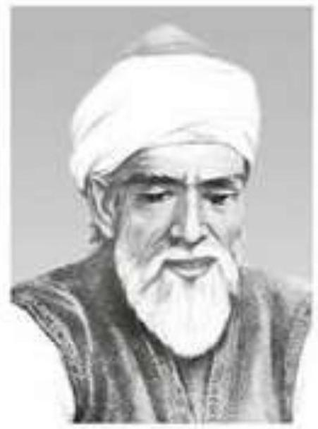
Әбу-л-Вефа (940—998)

2) Егер $a_{103}=15$ болса, онда арифметнкалық прогрессиянын алғашкы 207 мүшесінін косындысынын мәнін табындар.
22.28. Тендеудін графигін салындар:
3) $\frac{y-x^{2}}{x-2}=0$;
4) $\frac{y-x^{2}+2}{x-2}=0$;
з) $\frac{y-0,5 x^{2}}{|x|-2}=0$;
5) $\frac{y+0,5 x^{2}}{|x|-3}=0$.
22.29. Өрнекті ыкшамдандар;
6) $\left(\frac{1}{a-x}-\frac{3 x^{2}}{a^{3}-x^{3}}-\frac{x}{a^{2}+a x+x^{2}}\right) \cdot\left(\frac{a^{2}}{a+x}+x\right)$;
7) $\frac{2 x-3}{3 x}-\frac{1}{x+3} \cdot\left(\frac{x}{3}-\frac{3}{x}\right)+\frac{2}{3}$.
22.30. Тенсіздікті шешіндер:
8) $\frac{\left(x^{2}-7 x-8\right)(x-10)^{3}}{(x+2)^{2}(3-x)} \mathrm{m} 0$;
9) $\left.\frac{\left(x^{2}-6 x+8\right)\left(x^{2}-9\right)}{5\left(x^{3}-8\right)} \right\rvert\, 0$;
10) $\frac{\left(3 x^{2}+5 x\right)\left(4 x-x^{2}\right)}{(x+5)^{2}} \mathrm{~m} 0$;
11) $\frac{(x+3)^{4}(x-5)^{3}}{6\left(x^{2}+x-2\right)}$ | 0 .

## Жана білімді менгеруге дайындаламыз

22.31. Өрнектердін мәндерін өсу ретімен орналастырындар:

1) $\sin 30^{\circ}, \cos 60^{\circ}, \sin 150^{\circ}, \cos 120^{\circ} ;$
2) $\operatorname{tg} 30^{\circ}, \operatorname{ctg} 60^{\circ}, \operatorname{tg} 150^{\circ}, \operatorname{ctg} 120^{\circ}$.
22.32. Өрнектін мәнін табындар:
3) $\sin 90^{\circ}+2 \cos 150^{\circ}-\sin 150^{\circ}+\operatorname{ctg} 120^{\circ}$;
4) $2 \sin 120^{\circ}+\cos 90^{\circ}-\cos 120^{\circ}+\operatorname{tg} 150^{\circ}$.

## Жана білімді менгеруге арналған тірек ұғымдар

Санды шенбер, бастапкы және козеалмалы радич, α бұрышына бұру, санды аргументтін тригонометриятык функциятардын анықтамасы, тригонометриятык функциялардын касиеттері, тригонаметриятых функциятардын координататык ширектердегі танбалары, периодтытызы, жұптыеы мен тақтыгы, бір аргументке байланысты тригонометриятық функциятар арасындагы қатынастар.

## § 23. КЕЛТІРУ ФОРМУЛАЛАРЫ

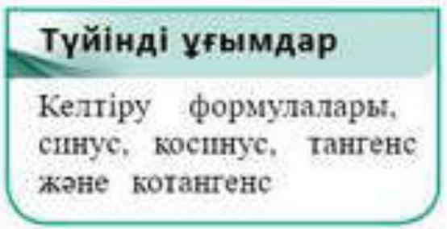

Келтіру формулаларын қорытып шығару мен қолдануды үйренесіңдер.

Тригонометрнялык функшялармен байланысты кептеген есептерді шығарғанда кез келген бұрыштын тригонометриялык функшиларын сүйір бұрыштын тригонометриялык функцияс ына келтірудін манызы зор. Баскаша айтканда, $\frac{\pi}{2} k \pm \alpha$ (мүндағы $k$ - кез келген бүтін сан, $ɑ$ - сүйір бұрыш) бұрышынын триг онометриялык функщиялары берілсе, онда оларды $\alpha$ бұрышыныи тригонометрнялык функшяларына келтірген ынғайлы. Ол үшін арнайы кеттіру формуталары колданылады.

Алдымен синус пен косинустын келтіру формулаларын карастырайык. Одан кейін алған формулалар аркылы тангенс пен котангенстін формулаларын корытып шығарамыз.

II ширектегі синус және косинусты карастырайык. II ширектін кез келген бұрышын $\frac{\pi}{2}+\alpha$ (мұндағы $\alpha$ - сүйір бұрыш) түріне келтіруге болады. Шенбер алып, онын пентрі $O$ нүктесінен айналдыра шенбердін $R=O A$ радиусын, алдымен α бұрышына, одан кейін $\frac{\pi}{2}+\alpha$ бұрышына бұрайык (74-сурет). Осы бұрулар кезінде $O A$ раднусы сәйкесінше $O B$ және $O B_{1}$ радпустарына кешеді. $B$ және $B_{1}$ нүктелерінен координаталык осьтерге перпендикуляр түсіреміз.

Нәтижесінде $O C B D$ және $O C_{1} B_{1} D_{1}$ тіктертбұрыштарын аламыз. $O C_{1} B_{1} D_{1}$ тіктертбұрышы $O C B D$ тіктертбұрышын $O$ нүктесінен айналдыра он бағыта $\frac{\pi}{2}$ бұрышына бұру

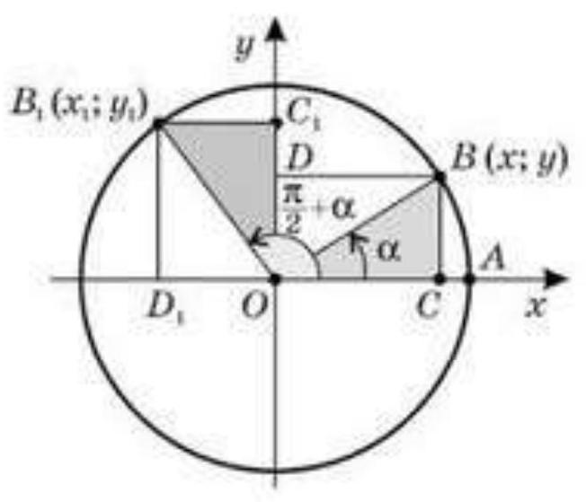
74-cyper

Сондыктан $\quad B_{1}$ нүктесінін ордннатасы ретінде $B$ нүктесінін абсциссасын, ал $B_{1}$ нүктесінін абсциссасы ретінде $B$ нүктесінін ординатасын карама-карсы танбамен алуға болады:

немесе

$$
\begin{gathered}
y_{1}=x \text { және } x_{1}=-y, \\
\frac{y_{1}}{R}=\frac{x}{R} \text { және } \frac{x_{1}}{R}=-\frac{y}{R} .
\end{gathered}
$$

## СЕНДЕР БІЛЕСІҢДЕР

Анықтама бойынша бұрыштын синусы нүкте ординатасынын радиуска катынасына тен екенін білесіндер, яғни
$\sin \left(\frac{\pi}{2}+\alpha\right)=\frac{B_{1} D_{1}}{R}=\frac{y_{1}}{R}$, aл $\sin \alpha=\frac{B C}{R}=\frac{y}{R} ;$
$\cos \left(\frac{\pi}{2}+\alpha\right)=\frac{O D_{1}}{R}=\frac{x_{1}}{R}$, ал $\cos \alpha=\frac{O C}{R}=\frac{x}{R}$.
Осы тендіктерден мына келтіру формулаларын аламыз:

$$
\begin{equation*}
\sin \left(\frac{\pi}{2}+\alpha\right)=\cos \alpha ; \quad \cos \left(\frac{\pi}{2}+\alpha\right)=-\sin \alpha \tag{1}
\end{equation*}
$$

## МЫСАЛ

$y=\sin x$ функшясынын периоды $2 \pi$ болатынын делелдейік.
Далелдеуi $\sin (x+2 \pi n)=\sin x$, мүндағы $n=0, \pm 1, \pm 2, \ldots$ болғандыктан, синустын аргументіне 2 Пh -ді косканнан функщиянын мәні езгермейді. Кез келген $x$ үшін $\sin (x+P)=\sin x$ тендігі орындалатындай $P$ саны берілсін. Онда бұл тендік $x=\frac{\pi}{2}$ ушін де орындалады, яғни, $\sin \left(\frac{\pi}{2}+P\right)=\sin \frac{\pi}{2}=1$. Келтіру формуласы бойынша $\sin \left(\frac{\pi}{2}+P\right)=\cos P$.

Сонғы екі тендіктен $\cos P=1$ аламыз, бұл тендік $P=2 \Pi$ болғанда ғана тура. Себебі, $2 T h$ сандарынын ішіндегі нелден өзгеше ен кіші сан $2 \pi$, демек, бұл сан $y=\sin x$ функциясыныи периоды болып табылады.
$\sin 2 x=\sin (2 x+2 \pi n)=\sin [2(x+\pi n)]$. Демек, $x$ аргументіне Пn-ді косканнан функщинын мәні езгермейші. Сонда П $t$ сандарынын ішіндегі нелден езгеше ен кіші сан П. Демек, бұл сан $y=\sin 2 x$ функциясынын перноды болып табылады.
$\frac{\pi}{2}-α$ бұрышы үшін сннус пен коспнустын келтіру формулаларын корытып шығару үш ін (1) формуладағы $\alpha$ бұрышын - $\alpha$ бұрышымен алмастырамыз:
$\sin \left(\frac{\pi}{2}+(-\alpha)\right)=\cos (-\alpha)=\cos \alpha$, ейткені коспнус функциясы жұп;
$\cos \left(\frac{\pi}{2}+(-\alpha)\right)=-\sin (-\alpha)=-(-\sin \alpha)=\sin \alpha$, өйткені синус функциясы так функция.

Сонымен, келтіру формулаларыныи тағы екі түрі алынды:

$$
\begin{equation*}
\sin \left(\frac{\pi}{2}-\alpha\right)=\cos \alpha ; \cos \left(\frac{\pi}{2}-\alpha\right)=\sin \alpha . \tag{2}
\end{equation*}
$$

Бұл екі формула $\alpha$ сүйір бұрышы үшін ғана емес, кез келген $\alpha$ бұрышы үшін де тура болады.

П+ $\alpha$ бұрышы үшін синус пен коспнустын келтіру формулаларын корытып шығарайык.

Ол үшін $\pi+\alpha$ бұрышын $\frac{\pi}{2}+\left(\frac{\pi}{2}+\alpha\right)$ түріне келтіреміз және (1) формуланы екі рет колда нып,
$\sin (\pi+\alpha)=\sin \left(\frac{\pi}{2}+\left(\frac{\pi}{2}+\alpha\right)\right)=\cos \left(\frac{\pi}{2}+\alpha\right)=-\sin \alpha$ аламыз, дәл осылай

$$
\cos (\pi+\alpha)=\cos \left(\frac{\pi}{2}+\left(\frac{\pi}{2}+\alpha\right)\right)=-\sin \left(\frac{\pi}{2}+\alpha\right)=-\cos \alpha .
$$

$$
\begin{equation*}
\sin (\pi+\alpha)=-\sin \alpha ; \cos (\pi+\alpha)=-\cos \alpha . \tag{3}
\end{equation*}
$$

$\Pi-\alpha$ бұрышын $\pi+(-\alpha)$ түрінде жазып, (3) формуладан $\pi-\alpha$ бұрышынын синусы мен косинусын тапсак, мынадай келтіру формулаларын аламыз:

$$
\begin{equation*}
\sin (\pi-\alpha)=\sin \alpha ; \cos (\pi-\alpha)=-\cos \alpha . \tag{4}
\end{equation*}
$$

(A)
(4) формуланы өздерін дателдендер.
$\frac{3 \pi}{2}+\alpha$ бұрышы үшін синус пен косинустыи келтіру формулаларын корытып шығарайық. Мұнда да (3)-формуланы корытып шығарғанда колданған тәсілді пайдаланамыз. Баскаша айтканда, $\frac{3 \pi}{2}+\alpha$ бұрышын $\frac{\pi}{2}+(\pi+\alpha)$ түріне келтіреміз. Одан кейін (1) және (3) формулаларды біртін деп колдана мыз. Сонда

$$
\begin{gather*}
\sin \left(\frac{3 \pi}{2}+\alpha\right)=\sin \left[\frac{\pi}{2}+(\pi+\alpha)\right]=\cos (\pi+\alpha)=-\cos \alpha \\
\cos \left(\frac{3 \pi}{2}+\alpha\right)=\cos \left[\frac{\pi}{2}+(\pi+\alpha)\right]=-\sin (\pi+\alpha)=-(-\sin \alpha)=\sin \alpha \\
\sin \left(\frac{3 \pi}{2}+\alpha\right)=-\cos \alpha ; \cos \left(\frac{3 \pi}{2}+\alpha\right)=\sin \alpha . \tag{5}
\end{gather*}
$$

$\frac{3 \pi}{2}$ - а бұрышы үшін спнус пен коспнустын келтіру формулаларын корытып шығарындар:

$$
\begin{equation*}
\sin \left(\frac{3 \pi}{2}-\alpha\right)=-\cos \alpha ; \cos \left(\frac{3 \pi}{2}-\alpha\right)=-\sin \alpha . \tag{6}
\end{equation*}
$$

$2 \pi+\alpha$ және $2 \pi-\alpha$ бұрыштары үшін спнус пен косинустын келтіру формулаларын берейік. Алдымен $2 \pi+\alpha$ бұрышы үшін келтіру формулаларын карастырамыз.

## СЕНДЕР БІЛЕСІҢДЕР

Егер а бұрышына 2 Птолык бұрышын коссак, одан тригонометриялык функциялардын мәндері өзгермейтінін сендер білесіндер.

Сондыктан келтіру формулаларын аламыз:

$$
\begin{equation*}
\sin (2 \pi+\alpha)=\sin \alpha ; \quad \cos (2 \pi+\alpha)=\cos \alpha . \tag{7}
\end{equation*}
$$

(7)-формуладағы $\alpha$ бұрышын $-\alpha$ бұрышына ауыстырып, келесі келтіру формулаларын аламыз:

$$
\begin{equation*}
\sin (2 \pi-\alpha)=-\sin \alpha ; \quad \cos (2 \pi-\alpha)=\cos \alpha . \tag{8}
\end{equation*}
$$

1. (8)-формуланы өздерін делелдендер.
2. $\operatorname{tg} \alpha=\frac{\sin \alpha}{\cos \alpha}$ формуласын және жоғарыда дәлелдентен (1) - (8) формулаларды колдан ып, тангенс пен котангенстін келтіру формулаларын ( $9-12$ ) депелдендер:

$$
\begin{align*}
\operatorname{tg}\left(\frac{\pi}{2} \pm \alpha\right)=\mp \operatorname{ctg} \alpha ; & \operatorname{ctg}\left(\frac{\pi}{2} \pm \alpha\right)=\mp \operatorname{tg} \alpha ;  \tag{9}\\
\operatorname{tg}(\pi \pm \alpha)= \pm \operatorname{tg} \alpha ; & \operatorname{ctg}(\pi \pm \alpha)= \pm \operatorname{ctg} \alpha ;  \tag{10}\\
\operatorname{tg}\left(\frac{3 \pi}{2} \pm \alpha\right)=\mp \operatorname{ctg} \alpha ; & \operatorname{ctg}\left(\frac{3 \pi}{2} \pm \alpha\right)=\mp \operatorname{tg} \alpha ;  \tag{11}\\
\operatorname{tg}(2 \pi \pm \alpha)= \pm \operatorname{tg} \alpha ; & \operatorname{ctg}(2 \pi \pm \alpha)= \pm \operatorname{ctg} \alpha . \tag{12}
\end{align*}
$$

(1) - (12) келтіру формулаларын бір кестеге енгізейік:

9-кесте

| $x$ | $\frac{\pi}{2}+\alpha$ ( $90^{\circ}+$ a ) | $\frac{\pi}{2}-\alpha$ ( $90^{\circ}-\alpha$ ) | \#+ a $\left(180^{\circ}+\alpha\right)$ | T- $\alpha$ ( $180^{\circ}-$ a) | $\frac{3 \pi}{2}+\alpha$ ( $270^{\circ}+\mathrm{a}$ ) | $\frac{3 \pi}{2}-\alpha$ ( $270^{\circ}-\alpha$ ) | $2 \pi+\alpha$ ( $360^{\circ}+\alpha$ ) | 2TL( $360^{\circ}-\alpha$ ) |
| :--- | :--- | :--- | :--- | :--- | :--- | :--- | :--- | :--- |
| $\sin x$ | $\cos \alpha$ | $\cos \mathrm{d}$ | $-\sin \alpha$ | $\sin \alpha$ | $-\cos \alpha$ | $-\cos \mathrm{a}$ | $\sin \alpha$ | $-\sin \alpha$ |
| $\cos x$ | $-\sin \alpha$ | $\sin \mathrm{G}$ | - $\cos \mathrm{a}$ | $-\cos \mathrm{a}$ | $\sin \alpha$ | $-\sin \mathrm{a}$ | $\cos \mathrm{a}$ | $\cos \alpha$ |
| $\operatorname{tg} x$ | -ctg ɑ | $\operatorname{ctg}{ }^{\alpha}$ | $\operatorname{tg} \alpha$ | $-\operatorname{tg} \alpha$ | -ctg a | ctg $\alpha$ | $\operatorname{tg} \alpha$ | $-\operatorname{tg} \alpha$ |
| $\operatorname{ctg} x$ | -tg $\alpha$ | $\operatorname{tg} \alpha$ | ctg ${ }^{\text {a }}$ | -ctg $\alpha$ | -tg a | $\operatorname{tg} a$ | ctg ${ }^{\text {a }}$ | -ctg a |

Жогарыдағы кестеден кандай зандылыкты байкаута болады?
Кестені колданып, келесі сұрактарға жауап беріндер:

1. Қандай жағдайда (кандай бұрыштар үшін) тригонометриялык функцияныи аты өзгермейді?
2. Кай уакытта (кандай бұрыштар үшін) тригонометриялык функщиныи аты езгереді (синус коспнуска, коспнус спнуска, тантенс котангенске, котангенс тангенске)?
3. Келтіру формулаларынын он жактары үшін тригонометриялык функцияныи танбасы қалай аныкталады?
Бұл сұрақтарға дұрыс жауап бере отырып, темендегідей корытындыны аламыз:
1) егер келтірілетін тригонометриялык функциянын аргументі (бұрышы):
$\Pi \pm \alpha\left(180^{\circ} \pm \alpha\right), 2 \pi \pm \alpha\left(360^{\circ} \pm \alpha\right)$ болса, онда функциянын аты өзгермейді;
$\frac{\pi}{2} \pm \alpha\left(90^{\circ} \pm \alpha\right), \frac{3 \pi}{2} \pm \alpha\left(270^{\circ} \pm \alpha\right)$ болса, онда функшияныи аты өзгереді, яғни син ус косинуска, косинус синуска, тангенс котангенске, котангенс тангенске ауысады;
2) келтіру формуласынын он жағынын танбасы сәйкес ширекте келтірілетін функциянын танбасымен бірдей жазылады.

## МЫСАЛ

1. $\sin \frac{7}{3} \pi$ мәнін есептейік.

Шешуi $\cdot \sin \frac{7}{3} \pi=\sin \left(2 \pi+\frac{\pi}{3}\right)=\sin \frac{\pi}{3}=\frac{\sqrt{3}}{2}$.
Жауабы: $\frac{\sqrt{3}}{2}$.

## МЫСАЛ

2. $\cos \left(-780^{\circ}\right)$ мәнін есептейік.

Шешуі. $\cos \left(-780^{\circ}\right)=\cos 780^{\circ}=\cos \left(2 \cdot 360^{\circ}+60^{\circ}\right)=\cos 60^{\circ}=\frac{1}{2}$.
Жауабы: $\frac{1}{2}$.

## МЫСАЛ

3. $\operatorname{ctg}\left(-750^{\circ}\right)$ мәнін есептейік.

Шешуi $\cdot \operatorname{ctg}\left(-750^{\circ}\right)=-\operatorname{ctg} 750^{\circ}=-\operatorname{ctg}\left(2 \cdot 360^{\circ}+30^{\circ}\right)=-\operatorname{ctg} 30^{\circ}= =-\sqrt{3}$.

Жауабы : $-\sqrt{3}$.

## МЫСАЛ

4. 5) $\cos 510^{\circ}$;
2) $\operatorname{tg} 1665^{\circ}$;
3) $\sin \left(-\frac{17}{3} \pi\right)$ мәндерін есептейік.
Шешуi
4) $\cos 510^{\circ}=\cos \left(360^{\circ}+150^{\circ}\right)=\cos 150^{\circ}=\cos \left(180^{\circ}-30^{\circ}\right)= =-\cos 30^{\circ}=-\frac{\sqrt{3}}{2}$;
5) $\operatorname{tg} 1665^{\circ}=\operatorname{tg}\left(4 \cdot 360^{\circ}+225^{\circ}\right)=\operatorname{tg} 225^{\circ}=\operatorname{tg}\left(180^{\circ}+45^{\circ}\right)=\operatorname{tg} 45^{\circ}=1$;
6) $\sin \left(-\frac{17}{3} \pi\right)=-\sin \left(3 \cdot 2 \pi-\frac{\pi}{3}\right)=\sin \frac{\pi}{3}=\frac{\sqrt{3}}{2}$.

Жауабы :

$$
\text { 1) }-\frac{\sqrt{3}}{2} \text {; }
$$

2) 1 ;
3) $\frac{\sqrt{3}}{2}$.

## МЫСАЛ

5. 6) $\operatorname{ctg}(-5 \pi-\alpha) \sin (\alpha-3 \pi)$;
2) $\frac{\sin (2 \pi-\alpha) \operatorname{tg}(\pi+\alpha) \operatorname{ctg}(-\alpha-\pi)}{\cos (\pi-\alpha) \operatorname{tg}(3 \pi-\alpha)}$ өрнектерін ыкшамдайык.

Шешуі

1) $\operatorname{ctg}(-5 \pi-\alpha) \sin (\alpha-3 \pi)=\operatorname{ctg}[-(5 \pi+\alpha)] \sin [-(3 \pi-\alpha)]= =-\operatorname{ctg}(5 \pi+\alpha)[-\sin (3 \pi-\alpha)]=-\operatorname{ctg}(\pi+\alpha)[-\sin (\pi-\alpha)]= =-\operatorname{ctg} \alpha(-\sin \alpha)=\cos \alpha$.
2) $\frac{\sin (2 \pi-\alpha) \operatorname{tg}(\pi+\alpha) \operatorname{ctg}(-\alpha-\pi)}{\cos (\pi-\alpha) \operatorname{tg}(3 \pi-\alpha)}=\frac{-\sin \alpha \operatorname{tg} \alpha[-\operatorname{ctg}(\pi+\alpha)]}{-\cos \alpha \operatorname{tg}(\pi-\alpha)}= =\frac{-\sin \alpha \operatorname{tg} \alpha(-\operatorname{ctg} \alpha)}{-\cos \alpha(-\operatorname{tg} \alpha)}=\frac{\sin \alpha}{\cos \alpha} \cdot \frac{\cos \alpha}{\sin \alpha}=1$.

Жауабы: 1) $\left.\cos \mathrm{a}_{\text {; }} 2\right) 1$.
?

1. $\sin x, \cos x, \operatorname{tg} x, \operatorname{ctg} x$ ернектерін түрлендіргенде, $x$ бұрышынын кандай түрлері үшін келтіру формулалары колданылалы?
2. Барлык келтіру формулаларын корытып шытару үшін кандай формулалар негізгі болып саналады?

## Жаттығулар

## A

23.1. Мына ернектерді бұрышы $\alpha$ болатын тригонометрнялык функшяға келтіріндер:

1) $\sin \left(90^{\circ}-\alpha\right)$;
2) $\cos \left(90^{\circ}-\alpha\right) ;$
3) $\sin \left(180^{\circ}-\alpha\right)$;
4) $\cos \left(180^{\circ}-\alpha\right)$;
5) $\sin \left(270^{\circ}+\alpha\right) ;$
6) $\cos \left(270^{\circ}-a\right) ;$
7) $\sin \left(360^{\circ}-\alpha\right)$;
8) $\cos \left(360^{\circ}+\alpha\right)$;
9) $\operatorname{ctg}\left(180^{\circ}-\alpha\right)$;
10) $\operatorname{tg}\left(90^{\circ}+\alpha\right)$;
11) $\operatorname{ctg}\left(270^{\circ}-\alpha\right)$;
12) $\operatorname{tg}\left(360^{\circ}-\alpha\right)$.
23.2. Есептендер:
13) $\sin 225:$
14) $\sin 330^{\circ}$
15) $\cos 210^{\circ}$,
16) $\operatorname{tg} 225 \quad$,
17) $\cos 120^{\circ}$,
18) $\operatorname{ctg} 150^{\circ}$.
23.3. Өрнектін мәнін табындар:
19) $\sin (-2259$;
20) $\sin \frac{7 \pi}{6}$;
з) $\cos \left(-\frac{4 \pi}{3}\right)$;
21) $\operatorname{tg}(-240)$;
22) $\cos \frac{25 \pi}{3}$;
23) $\operatorname{ctg}\left(-\frac{9 \pi}{4}\right)$;
24) $\sin \left(-\frac{17 \pi}{6}\right)$;
25) $\operatorname{tg}\left(-\frac{19 \pi}{6}\right)$.

## Өрнекті ыкшамдандар (23.4-23.5) :

23.4.

1) $1-\sin ^{2}\left(270^{\circ}+\alpha\right)$;
2) $1-\cos ^{2}\left(270^{\circ}-\alpha\right)$;
3) $1-\sin ^{2}\left(360^{\circ}-\alpha\right)$;
4) $1-\cos ^{2}\left(360^{\circ}+\alpha\right)$;
5) $1+\operatorname{ctg}^{2}\left(270^{\circ}-\alpha\right)$;
6) $1+\operatorname{tg}^{2}\left(360^{\circ}-\alpha\right)$.
23.5. 1) $\sin \left(90^{\circ}-\alpha\right)+\cos \left(180^{\circ}+\alpha\right)+\operatorname{ctg}\left(270^{\circ}-\alpha\right)+\operatorname{tg}\left(360^{\circ}-\alpha\right)$;
7) $\cos \left(90^{\circ}+\alpha\right)-\sin \left(180^{\circ}+\alpha\right)+\operatorname{ctg}\left(270^{\circ}+\alpha\right)+\operatorname{tg}\left(360^{\circ}+\alpha\right) ;$
8) $\cos \left(\frac{3 \pi}{2}+\alpha\right)-\sin (\pi+\alpha)+\operatorname{ctg}\left(\frac{\pi}{2}+\alpha\right)+\operatorname{tg}(2 \pi+\alpha)$;
9) $\sin \left(\frac{3 \pi}{2}-\alpha\right)-\cos (\pi+\alpha)+\operatorname{tg}\left(\frac{3 \pi}{2}+\alpha\right)+\operatorname{ctg}(2 \pi+\alpha)$.
23.6. Берілген тригонометриялык функцияны бұрышы $\alpha\left(0^{\circ} \mathrm{mq} \mathrm{m} 45^{\circ}\right)$ болатын функцияға келтіріндер:
10) $\sin 545 \quad a$
11) $\cos 945^{\circ}$;
12) $\operatorname{tg} 1545^{\circ}$;
13) $\operatorname{ctg} 545 ;$
14) $\sin \frac{9 \pi}{4}$;
15) $\cos \frac{91 \pi}{5}$;
16) $\operatorname{tg} \frac{29 \pi}{3}$;
17) $\operatorname{ctg} \frac{39 \pi}{7}$;
18) $\sin \left(-\frac{49 \pi}{4}\right)$;
19) $\cos \left(-\frac{419 \pi}{5}\right)$;
20) $\sin (-2489)$;
21) $\operatorname{tg}(-4789 \quad 9$.
23.7. Эрнектін мәнін табындар:
22) $\operatorname{ctg}\left(-45 \quad 9 \cdot \cos 225^{\circ} \cdot \sin 150^{\circ} ;\right.$
23) $\operatorname{tg}\left(-135{ }^{\circ}\right) \cdot \cos 300^{\circ} \cdot \sin 210^{\circ}$,
24) $\operatorname{ctg}\left(-\frac{3 \pi}{4}\right) \cdot \cos 150^{\circ} \cdot \sin \frac{5 \pi}{3}$;
25) $\operatorname{ctg}\left(-225 \quad 9 \cdot \cos \frac{8 \pi}{3} \cdot \sin 330^{\circ}\right.$.
23.8. Тепе-тендікті дәлелдендер:
26) $\cos ^{2}\left(180^{\circ}-x\right)+\cos ^{2}\left(270^{\circ}+x\right)=1$;
27) $\cos ^{2}\left(720^{\circ}-x\right)+\sin ^{2}\left(540^{\circ}+x\right)=1$;
28) $\operatorname{tg}(2 \pi-x) \operatorname{tg}\left(\frac{3 \pi}{2}-x\right)=-1$;
29) $\operatorname{ctg}(6 \pi-x) \operatorname{ctg}\left(\frac{9 \pi}{2}-x\right)=-1$.

## B

23.9. Эрнек мәнінін танбасын аныктандар:

1) $\sin 135^{\circ} \cdot \cos 210^{\circ} \cdot \operatorname{tg} 405^{\circ} \cdot \operatorname{ctg} 330^{\circ} \cdot \cos 560^{\circ}$,
2) $\sin 425^{\circ} \cdot \cos 250^{\circ} \cdot \operatorname{ctg} 420^{\circ} \cdot \operatorname{tg} 330^{\circ} \cdot \sin 750^{\circ}$,
3) $\sin \frac{7 \pi}{3} \cdot \cos \frac{2 \pi}{3} \cdot \operatorname{tg} \frac{9 \pi}{4} \cdot \operatorname{ctg} \frac{13 \pi}{6} \cdot \cos \frac{7 \pi}{4}$;
4) $\sin \frac{5 \pi}{3} \cdot \cos \frac{7 \pi}{6} \cdot \operatorname{tg} \frac{11 \pi}{4} \cdot \operatorname{ctg} \frac{8 \pi}{3} \cdot \sin \frac{11 \pi}{6}$.
23.10. Өрнекті ыкшамдандар:
5) $\frac{\sin (-\alpha) \operatorname{ctg}(\pi-\alpha)}{\cos \left(360^{\circ}-\alpha\right) \operatorname{tg}(\pi+\alpha)}$;
6) $\frac{\sin (\pi+\alpha) \operatorname{ctg}(2 \pi-\alpha)}{\cos \left(720^{\circ}-\alpha\right) \operatorname{tg}(2 \pi+\alpha)}$;
7) $\frac{\operatorname{tg}(-\alpha) \cos (\pi-\alpha)}{\sin (\pi-\alpha) \operatorname{ctg}(\pi+\alpha)}$.
23.11. Өрнектін мәнін табындар:
8) $\sin \left(-135^{\circ}\right) \cdot \cos 390^{\circ} \cdot \operatorname{tg} 405^{\circ} \cdot \operatorname{ctg}\left(-330^{\circ}\right) ;$
9) $\sin \left(-225^{\circ}\right) \cdot \cos \left(-480^{\circ}\right) \cdot \operatorname{ctg}\left(-420^{\circ}\right) \cdot \operatorname{tg} 300^{\circ}$.
23.12. Тепе-тендікті дәлелдендер:
10) $\operatorname{tg} x+\operatorname{tg}\left(180^{\circ}-x\right)+\operatorname{ctg}\left(360^{\circ}-x\right)=\operatorname{ctg}\left(180^{\circ}-x\right)$;
11) $\operatorname{ctg} x+\operatorname{tg}\left(90^{\circ}+x\right)+\operatorname{tg}\left(360^{\circ}+x\right)=\operatorname{ctg}\left(270^{\circ}-x\right)$;
12) $\sin \left(\frac{3 \pi}{2}+\beta\right) \cdot \operatorname{ctg}\left(\frac{\pi}{2}-\beta\right)+\sin \left(180^{\circ}-\beta\right)+\operatorname{ctg}\left(\frac{3 \pi}{2}-\beta\right)=\operatorname{tg} \beta$.
23.13. Өрнекті ыкшамдандар:
13) $\sin (2 \pi-x) \cdot \cos \left(90^{\circ}+x\right)-\cos (2 \pi+x) \cdot \sin \left(270^{\circ}-x\right)-1 ;$
14) $\sin (4 \pi-x) \cdot \cos \left(270^{\circ}-x\right)+\cos (\pi+x) \cdot \sin \left(270^{\circ}+x\right)-1$.
23.14. Өрнектін мәнін табындар:
15) $\frac{\operatorname{tg} \frac{5 \pi}{3} \cos \frac{\pi}{3}}{\sin 30^{\circ}}$;
16) $\frac{\operatorname{ctg} 135^{\circ} \sin 225^{\circ}}{\cos \frac{\pi}{3}}$;
17) $\frac{\operatorname{tg} 315^{\circ} \sin 135^{\circ}}{\cos ^{2} \frac{\pi}{6}}$;
18) $\frac{\operatorname{tg} 315^{\circ} \sin 135^{\circ}}{\cos ^{2} \frac{\pi}{6}}$.
23.15. Өрнекті ыкшамдандар:
19) $\frac{\sin (-\alpha)}{\cos (\pi-\alpha)}-\frac{\sin \left(\frac{3 \pi}{2}-\alpha\right)}{1+\sin \alpha}$;
20) $\frac{\cos (2 \pi-\alpha)}{\sin (-\alpha)}+\frac{\sin (2 \pi-\alpha)}{1+\cos (-\alpha)}$;
21) $\operatorname{tg}^{2}\left(270^{\circ}+\alpha\right) \cdot \sin ^{2}\left(180^{\circ}+\alpha\right)+\operatorname{tg} 315^{\circ}$;
22) $\operatorname{ctg}^{2}\left(360^{\circ}-\alpha\right) \cdot \cos ^{2}\left(270^{\circ}+\alpha\right)+\sin 270^{\circ}$.
23.16. Санды өрнектін мәнін есептендер:
23) $\left(\sin 315^{\circ}-\cos 315^{\circ}\right)^{2}$;
24) $\left(\sin 225^{\circ}-\cos 225^{\circ}\right)^{2}$;
25) $\left(\sin 135^{\circ}+\cos 135^{\circ}\right)^{2}$;
26) $\left(\sin 315^{\circ}+\cos 315^{\circ}\right)^{2}$.
23.17. Формуланын дұрыстығын дәлелдендер:
27) $\sin \left(45^{\circ}+\alpha\right)=\cos \left(45^{\circ}-\alpha\right)$;
28) $\cos \left(45^{\circ}+\alpha\right)=\sin \left(45^{\circ}-\alpha\right) ;$
29) $\operatorname{tg}\left(45^{\circ}+\alpha\right)=\operatorname{ctg}\left(45^{\circ}-\alpha\right)$;
30) $\operatorname{ctg}\left(45^{\circ}+\alpha\right)=\operatorname{tg}\left(45^{\circ}-\alpha\right)$;
31) $\sin \left(60^{\circ}-\alpha\right)=\cos \left(30^{\circ}+\alpha\right) ;$
32) $\operatorname{ctg}\left(80^{\circ}-\alpha\right)=\operatorname{tg}\left(10^{\circ}-\alpha\right)$.
23.18. Тепе-тендікті далелдендер:
33) $\frac{\operatorname{tg}(\pi-x)}{\cos (\pi+x)} \cdot \frac{\sin \left(270^{\circ}+x\right)}{\operatorname{tg}\left(270^{\circ}+x\right)}=\operatorname{tg}^{2} x$;
34) $\frac{\sin (\pi-x)}{\operatorname{tg}(\pi+x)} \cdot \frac{\operatorname{ctg}\left(270^{\circ}+x\right)}{\operatorname{ctg}\left(270^{\circ}+x\right)} \cdot \frac{\cos (2 \pi-x)}{\sin x}=\sin x$.
23.19. 1) $\operatorname{tg}(\pi-\alpha)-2 \operatorname{tg}(-\alpha)$ ернегін ыкшамдап, $\alpha=-45^{\circ}$ болғандағы;
35) $\operatorname{ctg}(2 \pi-\alpha)-2 \operatorname{tg}(-2 \quad \alpha)$ ернегін ыкшамдап, $\quad \alpha=30^{\circ}$ болғандагы;
36) $\cos (3 \pi-\alpha)-4 \sin (-\alpha)$ ернегін ыкшамдап, $\alpha=-45^{\circ}$ болғандағы;
37) $\cos (3 \pi-\alpha)-3 \sin (-\alpha)$ ернегін ыкшамдап, $\alpha=-30^{\circ}$ болғандағы мәнін табындар.
23.20. Өрнекті ыкшамдандар:
38) $\frac{(1-\cos (2 \pi-\alpha))(1+\cos (2 \pi+\alpha))}{\sin (\pi-\alpha)}$;
39) $\frac{(1+\sin (2 \pi-\alpha))(1+\cos (2 \pi+\alpha))}{\cos (\pi-\alpha)}$;
40) $\frac{\operatorname{tg}(\pi-\alpha) \cos (\pi+\alpha)}{\sin \left(\frac{\pi}{2}-\alpha\right)}$;
41) $\frac{\operatorname{ctg}(\pi+\alpha) \sin (\pi+\alpha)}{\sin \left(\frac{3 \pi}{2}-\alpha\right)}$.
23.21. Тепе-тендікті дәлелдендер:
42) $\frac{\cos ^{2}(\pi+\alpha)}{1-\sin \alpha}-\cos \left(\frac{\pi}{2}-\alpha\right)=1$;
43) $\frac{\sin ^{2}(\pi+\alpha)}{1-\cos \alpha}-\cos (2 \pi-\alpha)=1$;
44) $\frac{\cos ^{2}(2 \pi-\alpha)}{1+\sin (-\alpha)}+\cos \left(\frac{3 \pi}{2}-\alpha\right)=1$;
45) $\frac{\sin ^{2}(3 \pi-\alpha)}{1-\cos (-\alpha)}+\cos (5 \pi-\alpha)=1$.

## C

23.22. Өрнектін мәнін табындар:

1) $\sin 135^{\circ} \cdot \cos 210^{\circ} \cdot \operatorname{tg} 405^{\circ} \cdot \operatorname{ctg} 330^{\circ}$,
2) $\sin 225^{\circ} \cdot \cos 150^{\circ} \cdot \operatorname{ctg} 420^{\circ} \cdot \operatorname{tg} 300^{\circ}$;
3) $\sin \frac{\pi}{3} \cdot \cos \frac{2 \pi}{3} \cdot \operatorname{tg} \frac{7 \pi}{4} \cdot \operatorname{ctg} \frac{13 \pi}{6}$;
4) $\sin \frac{4 \pi}{3} \cdot \cos \frac{5 \pi}{6} \cdot \operatorname{tg} \frac{11 \pi}{4} \cdot \operatorname{ctg} \frac{19 \pi}{3}$.
23.23. Erep $A, B, C$ ушбұрыштын бұрыштары болса, онда:
5) $\sin (A+B)=\sin C$;
6) $\sin \frac{A+B}{2}=\cos \frac{C}{2}$;
7) $\cos (A+B)=-\cos C$;
8) $\operatorname{tg} \frac{A+B}{2}=\operatorname{ctg} \frac{C}{2}$ тендігінін

дұрыстығын дәлелдендер.
23.24. Өрнектін мәнін табындар:

1) $\operatorname{tg} 15^{\circ} \cdot \operatorname{tg} 210^{\circ} \cdot \operatorname{tg} 75^{\circ} \cdot \operatorname{ctg} 330^{\circ}$;
2) $\operatorname{ctg} 35^{\circ} \cdot \operatorname{ctg} 55^{\circ} \cdot \operatorname{tg} 420^{\circ} \cdot \operatorname{ctg} 300^{\circ}$,
3) $\sin \frac{4 \pi}{3} \cdot \cos \frac{2 \pi}{3} \cdot \operatorname{ctg} \frac{7 \pi}{4} \cdot \operatorname{tg} \frac{13 \pi}{6}$;
4) $\sin \frac{5 \pi}{3} \cdot \cos \frac{5 \pi}{6} \cdot \operatorname{ctg} \frac{11 \pi}{4} \cdot \operatorname{tg} \frac{19 \pi}{3}$.
23.25. Өрнекті ыкшамдандар:
5) $\operatorname{tg} 1^{\circ} \cdot \operatorname{tg} 2^{\circ} \ldots \cdot \operatorname{tg} 88^{\circ} \cdot \operatorname{tg} 89^{\circ}$,
6) $\operatorname{ctg} 1^{\circ} \cdot \operatorname{ctg} 2^{\circ} \cdot \ldots \cdot \operatorname{ctg} 88^{\circ} \cdot \operatorname{ctg} 89^{\circ}$,
7) $\operatorname{tg} 1^{\circ} \cdot \operatorname{tg} 3^{\circ} \cdot \ldots \cdot \operatorname{tg} 87^{\circ} \cdot \operatorname{tg} 89^{\circ}$;
8) $\operatorname{ctg} 2^{\circ} \cdot \operatorname{ctg} 4^{\circ} \cdot \ldots \cdot \operatorname{ctg} 86^{\circ} \cdot \operatorname{ctg} 88^{\circ}$.
23.26. Тепе-тендікті дәлелдендер:
9) $\operatorname{ctg}^{3} \alpha \cdot \operatorname{tg} \alpha+\operatorname{tg}^{3} \alpha \cdot \operatorname{ctg} \alpha+2=(\operatorname{tg}(\pi+\alpha)+\operatorname{ctg}(2 \pi+\alpha))^{2}$;
10) $\sin ^{3} \alpha \cdot(1+\operatorname{tg} \alpha)+\cos ^{3} \alpha \cdot(1+\operatorname{ctg} \alpha)=\sin \left(\frac{\pi}{2}+\alpha\right)+\cos \left(\frac{3 \pi}{2}+\alpha\right)$;
11) $\operatorname{ctg}^{2}(3 \pi+\beta)+\sin \left(\frac{\pi}{2}-\beta\right) \cdot \frac{1}{\cos \beta}=\frac{1}{\sin ^{2} \beta}$.
23.27. Есептендер:
12) $\cos 20^{\circ}+\cos 40^{\circ}+\cos 60^{\circ}+\ldots+\cos 160^{\circ}+\cos 180^{\circ}$,
13) $\operatorname{tg} 20^{\circ}+\operatorname{tg} 40^{\circ}+\operatorname{tg} 60^{\circ}+\ldots+\operatorname{tg} 160^{\circ}+\operatorname{tg} 180^{\circ}$;
14) $\operatorname{ctg} 15^{\circ}+\operatorname{ctg} 30^{\circ}+\operatorname{ctg} 45^{\circ}+\ldots+\operatorname{ctg} 150^{\circ}+\operatorname{ctg} 165^{\circ}$.

## Қайталау

23.28. $90^{\circ}<\alpha<180^{\circ}$ екені белгілі. Eгер:

1) $\cos \alpha=-0,8$ болса, онда $\sin \alpha$ және $\operatorname{ctg} \alpha$-ны;
2) $\sin \alpha=0,6$ болса, онда $\cos \alpha$ және $\operatorname{ctg} \alpha$-ны;
3) $\operatorname{tg} \alpha=-4$ болса, онда $\sin \alpha$ және $\cos \alpha$-ны;
4) $\operatorname{ctg} \alpha=-6$ болса, онда $\sin \alpha$ және $\cos \alpha$-ны есептендер.
23.29. Функцияныи графигін салындар:
5) $y=3 x^{2}-2|x|$;
6) $y=-x^{2}-2|x|$;
7) $y=x^{2}-2|x-1|$;
8) $y=x^{2}-|x+2|$.
23.30. Тасжол бойымен аралығы 75 км болатын $A$ және $B$ пункттерінен бір-біріне карама-карсы бағытта шыккан автобус пен женіл мәшине жарты сағаттан кейін кездесті. Женіл мәшине $A$ пунктіне жеткеннен кейін 25 мин өткен сон автобус $B$ пунктіне жетті. Автобус пен женіл мәшиненін жылдамдыктарын табындар.
23.31. Тендеулер жүйесін шешіндер:
9) $\left\{\begin{array}{l}x^{2}-3 x-18 \leqslant 0, \\ |x-3|>1 ;\end{array}\right.$
10) $\left\{\begin{array}{l}x^{2}+x-12 \leqslant 0, \\ |x+5| \leqslant 6 ;\end{array}\right.$
11) $\left\{\begin{array}{l}2 x^{2}+3 x-14<0, \\ |x-1| \geqslant 2 .\end{array}\right.$

## Жана білімді менгеруге дайындаламыз

23.32. Өрнекті ыкшамдандар:

1) $\cos \left(90^{\circ}+\alpha\right)-2 \sin \left(180^{\circ}+\alpha\right)+\operatorname{ctg}\left(270^{\circ}+\alpha\right)+\operatorname{tg}\left(360^{\circ}+\alpha\right) ;$
2) $\cos \left(\frac{3 \pi}{2}+\alpha\right)-\sin (2 \pi-\alpha)+\operatorname{ctg}\left(\frac{\pi}{2}+\alpha\right) \cdot \operatorname{ctg}(2 \pi+\alpha)$.
23.33. Бірлік шенберді салындар және $O x$ осінін он бағытымен $60^{\circ}, 120^{\circ}, 210^{\circ}, 270^{\circ}$ бұрышты кұрайтын $O A$ векторын кескіндендер, мүндағы $A$ нүктесі - шенбердін бойында жататын нүкте.

## Жана білімді менгеруге арналған тірек ұғымдар

Санды шенбер, бастапқы және жылжымалы радиустар, негізгі тригонометриятық тепе-тендіктер, кеттіру формулалары, вектор, вектортардын скатяр көбейтіндісі.

## §24. ЕКІ БҰРЫШТЫН КОСЫНДЫСЫ МЕН АЙЫРЫМЫНЫН СИНУСЫ ЖӘНЕ КОСИНУСЫНЫИ ФОРМУЛАЛАРЫ

## Түйінді ұғымдар

Спнус, коспнус

Тригонометриялық функциялардың бұрыштарының қосындысы мен айырымының формулаларын қорытып шығару мен қолдануды үйренесіңдер.

Екі бұрыитын косындысы мен айырымынын пригонаметриялык функцияларын сол бұрыштарыня тригонометриялык функциятары аркыпы өрнектейтін форыпгатарды косу формулалары деп атайды.

Алдымен тригонометриялық функциялар аркылы екі бұрыштың айырымынын косинусынын формуласын шығарайык. Ол үшін центрі тікбұрышты координаталар жүйесінін басында орналаскан және радиусы $R=O A$ болатын шенберді карастырайык ( 75 -сурет).
$O A$ бастапкы раднусты $O$ нүктесінен айналдыра $\alpha$ және $\beta$ бұрыштарына бұру нәтижесінде сәйкесінше $O B$ және $O C$ радиустарын аламыз. Егер $B$ нүктесінін координа-
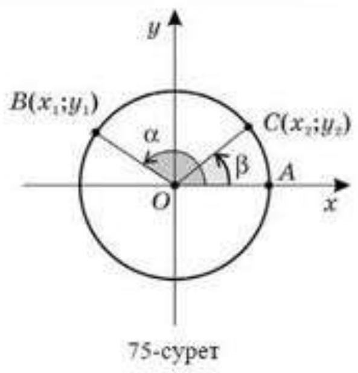 талары $x_{1}$ және $y_{1}$, ал $C$ нуктесінін координаталары $x_{2}$ және $y_{2}$ болса, онда $\overline{O B}$ және $\overline{O C}$ векторларынын координаталары сәйкесінше дәл осындай болады, яғніI $\overline{O B}=\left(x_{1} ; y_{1}\right)$ және $\overline{O C}=\left(x_{2} ; y_{2}\right)$.

Енді $\overline{O B}$ және $\overline{O C}$ векторларынын скаляр көбейтіндісін табамыз:

$$
\begin{equation*}
\overline{O B} \cdot \overline{O C}=x_{1} \cdot x_{2}+y_{1} \cdot y_{2} . \tag{1}
\end{equation*}
$$

$\alpha$ және $\beta$ бұрыштарыныи синусы және коспнусынын аныктамасы бойынша $\cos \alpha=\frac{x_{1}}{R}, \sin \alpha=\frac{y_{1}}{R}, \cos \beta=\frac{x_{2}}{R}, \sin \beta=\frac{y_{2}}{R}$ (75-cyper). Осы тендіктерден $x_{1}, y_{1}, x_{2}, y_{2}$-ні табайык: $x_{1}=R \cos \alpha, y_{1}=R \sin \alpha$, $x_{2}=R \cos \beta, y_{2}=R \sin \beta$. Енді $x_{1}, y_{1}, x_{2}, y_{2}$-нін мәндерін (1) тендікке коямыз:

$$
\overline{O B} \cdot \overline{O C}=R^{2} \cos \alpha \cos \beta+R^{2} \sin \alpha \sin \beta=R^{2}(\cos \alpha \cos \beta+\sin \alpha \sin \beta) .
$$

Яғніі

$$
\begin{equation*}
\overline{O B} \cdot \overline{O C}=R^{2}(\cos \alpha \cos \beta+\sin \alpha \sin \beta) . \tag{2}
\end{equation*}
$$

Екі вектордын скаляр кебейтіндісі туралы теореманы колданып, (2) формуланын сол жак белігін былай жазамыз:

$$
\begin{equation*}
\overrightarrow{O B} \cdot \overrightarrow{O C}=|\overrightarrow{O B}| \cdot \overrightarrow{O C} \mid \cos \angle B O C . \tag{3}
\end{equation*}
$$

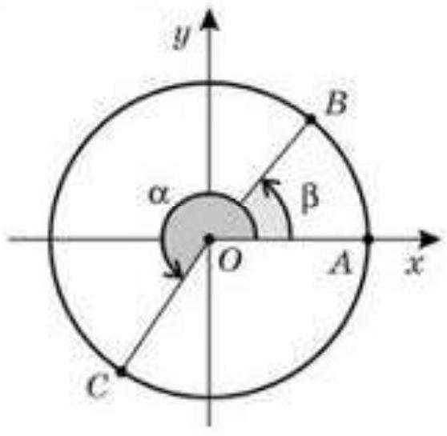
76-cyper

$\overline{O B}$ және $\overline{O C}$ векторларынын арасындағы бұрыш BOC бұрышын, немесе $\alpha$ - $\beta$ бұрышын, немесе $2 \pi-(\alpha-\beta)$-ға тен бурышы береді (76-сурет). BOC бұрышы керсетілген бұрыштардан толык бұрыштын еселі санына өзгешеленуі мүмкін.

Барлык керсетілген жағдайларда
$\cos \angle B O C=\cos (\alpha-\beta)$.
Сонғы тендікті және $|\overline{O B}|=R,|\overline{O C}|=R$ екенін ескеріп, (3) тендікті былай жазамыз:
$\overline{O B} \cdot \overline{O C}=R \cdot R \cdot \cos (\alpha-\beta)$, немесе

$$
\begin{equation*}
\overrightarrow{O B} \cdot \overrightarrow{O C}=R^{2} \cdot \cos (\alpha-\beta) . \tag{4}
\end{equation*}
$$

(2) және (4) тендіктердін сол жактары тен, демек, олардын он жактары да тен болады. Яғни $R^{2} \cdot \cos (\alpha-\beta)=R^{2}(\cos \alpha \cos \beta+\sin \alpha \times { }^{x} \sin \beta$ ). Осыдан:

$$
\begin{equation*}
\cos (\alpha-\beta)=\cos \alpha \cos \beta+\sin \alpha \sin \beta . \tag{5}
\end{equation*}
$$

(5) формуланы айырымнын косинусы деп атайды.

Екі бұрыштын айырымынын косинусы осы бұрыитардын косинустарынын көбейтіндісін сот бұрыитардын синустарынын көбейтіндісіне қосқанга тен.

Екі бұрыштын косындысынын косинусынын формуласын, яғни косындыныи косинусын алу ушін $\alpha+\beta$ косындысын $\alpha-(-\beta)$ айырымы түріне келтіріп, (5) формуланы колданамыз. Сонда $\cos (\alpha+\beta)= =\cos [\alpha-(-\beta)]=\cos \alpha \cdot \cos (-\beta)+\sin \alpha \cdot \sin (-\beta)=\cos \alpha \cdot \cos \beta-\sin \alpha \cdot$ - $\sin \beta$, ейткені $\cos (-\beta)=\cos \beta, \sin (-\beta)=-\sin \beta$.

Сонымен, мына формуланы аламыз:

$$
\begin{equation*}
\cos (\alpha+\beta)=\cos \alpha \cos \beta-\sin \alpha \sin \beta . \tag{6}
\end{equation*}
$$

(6) формуланы косындынын косинусы деп атайды.

Екі бұрыитын косындысынын косинусы осы бұрыштардын косинустарынын көбейтіндісінен сат бұрыитардын синустарынын көбейтіндісін азайтқанга тен.

Екі бұрыштын косындысы мен айырымынын синусынын формулаларын корытып шығарайык. Ол үшін (5) формула мен кепіру формулаларын колданамыз.
$\sin (\alpha+\beta)=\cos \left[\frac{\pi}{2}-(\alpha+\beta)\right]=\cos \left[\left(\frac{\pi}{2}-\alpha\right)-\beta\right]=\cos \left(\frac{\pi}{2}-\alpha\right) \cos \beta+ +\sin \left(\frac{\pi}{2}-\alpha\right) \sin \beta=\sin \alpha \cos \beta+\cos \alpha \sin \beta$, себебі келтіру формулалары бойынш а $\cos \left(\frac{\pi}{2}-\alpha\right)=\sin \alpha, \sin \left(\frac{\pi}{2}-\alpha\right)=\cos \alpha$.

Демек,

$$
\begin{equation*}
\sin (\alpha+\beta)=\sin \alpha \cos \beta+\cos \alpha \sin \beta . \tag{7}
\end{equation*}
$$

(7) формуланы қосындыныи синусы деп атайды.

Екі бұрыитын косындысыныя синусы біріниі бұрыитын синусы мен екіниі бұрыитын косинусынын көбейтіндісіне біріниі бұрыштын косинусы мен екіниі бұрыштын синусынын көбейтіндісін косканга тен.
(7) формуланы колданып, екі бұрыштын айырымынын синусынын формуласын корытып шығарайык.
$\sin (\alpha-\beta)=\sin [\alpha+(-\beta)]=\sin \alpha \cos (-\beta)+\cos \alpha \sin (-\beta)=\sin \alpha \cos \beta- -\cos \alpha \sin \beta$, ейткені $\cos (-\beta)=\cos \beta, \sin (-\beta)=-\sin \beta$.

Демек.

$$
\begin{equation*}
\sin (\alpha-\beta)=\sin \alpha \cos \beta-\cos \alpha \sin \beta . \tag{8}
\end{equation*}
$$

(8) формуланы айырымнын синусы деп атайды.

Екі бұрыитын айырымынын синусы біріниі бұрыштын синусы мен екіниі бұрыштын косинусынын көбейтіндісінен біріниі бұрыштын косинусы мен екінші бұрыштын синусынын көбейтіндісін азайтканга тен.

## МЫСАЛ

1. Кестені пайдаланобай және мнкрокалькулятордын көмегінсіз $\cos 105^{\circ}$ ернегініц мәнін табайык.

Шешуі $.105^{\circ}$ бурышын $60^{\circ}+45^{\circ}$ косындысы түрінде жазайык:
$\cos 105^{\circ}=\cos \left(60^{\circ}+459\right)=\cos 60 \cos 45^{\circ}-\sin 60 \sin 45^{\circ}=\frac{1}{2} \cdot \frac{\sqrt{2}}{2}-\frac{\sqrt{3}}{2} \cdot \frac{\sqrt{2}}{2}= =\frac{\sqrt{2}}{4}(1-\sqrt{3})$.

Жауабы: $\frac{\sqrt{2}}{4}(1-\sqrt{3})$.

## МЫСАЛ

2. $\sin (\alpha+\beta)-\sin (\alpha-\beta)$ ернегін ыкшамдандар.

Шешуі . Қосындысы мен айырымының спнусынын формулаларын колданамыз:
$\sin (\alpha+\beta)-\sin (\alpha-\beta)=\sin \alpha \cos \beta+\cos \alpha \sin \beta-\sin \alpha \cos \beta+\cos \alpha \sin \beta= =2 \cos \alpha_{\sin \beta}$.

Жауабы: $2 \cos \alpha \sin \beta$.
?

1. α және β бұрыштарыныи косындысы мен айырымыныи синусы мен косннусынын формулалары кандай бұрыштарға колцанылалы?
2. Косу формулаларын атанцар.

## Жаттығулар

## A

24.1. Өрнекті ыкшамдандар:

1) $\sin \left(60^{\circ}+\alpha\right)+\sin \left(\alpha-60^{\circ}\right) ;$
2) $\cos \left(60^{\circ}+\alpha\right)+\cos \left(\alpha-60^{\circ}\right)$;
3) $\sin \left(30^{\circ}+\alpha\right)-\sin \left(30^{\circ}-\alpha\right)$;
4) $\cos \left(30^{\circ}+\alpha\right)-\cos \left(30^{\circ}-\alpha\right) ;$
5) $\cos 2 \phi \cos 3 \phi+\sin 2 \phi \sin 3 \phi$;
6) $\sin Y \cos 2 Y-\cos Y \sin 2 Y$;
7) $\cos \frac{1}{3} \alpha \cos \frac{2}{3} \alpha-\sin \frac{1}{3} \alpha \sin \frac{2}{3} \alpha$;
8) $\sin \frac{1}{2} Y \cos \frac{3}{2} Y+\cos \frac{1}{2} Y \sin \frac{3}{2} Y$.
24.2. Өрнектін мәнін табындар:
9) $\sin 20^{\circ} \cos 10^{\circ}+\cos 20^{\circ} \sin 10^{\circ} ;$
10) $\cos 50^{\circ} \cos 5^{\circ}+\sin 50^{\circ} \sin 5^{\circ}$;
11) $\sin 71^{\circ} \cos 11^{\circ}-\cos 71^{\circ} \sin 11^{\circ}$;
12) $\cos 25^{\circ} \cos 65^{\circ}-\sin 25^{\circ} \sin 65^{\circ}$.
24.3. Есептендер:
13) $\cos \frac{8 \pi}{15} \cdot \cos \frac{\pi}{5}+\sin \frac{8 \pi}{15} \cdot \sin \frac{\pi}{5}$;
14) $\cos \frac{1}{10} \pi \cdot \cos \frac{2}{5} \pi-\sin \frac{1}{10} \pi \cdot \sin \frac{2}{5} \pi$;
15) $\sin \frac{\pi}{6} \cdot \cos \frac{\pi}{12}+\cos \frac{\pi}{6} \cdot \sin \frac{\pi}{12}$;
16) $\sin \frac{1}{9} \pi \cdot \cos \frac{4}{9} \pi-\cos \frac{1}{9} \pi \cdot \sin \frac{4}{9} \pi$
24.4. $\alpha$ және $\beta$ бұрыштары I ширекке тиісті және $\sin \alpha=\frac{3}{5}, \cos \beta= =\frac{1}{3}$ екені белгілі.
17) $\sin (\alpha+\beta)$;
18) $\sin (\alpha-\beta)$;
19) $\cos (\alpha+\beta) ;$
20) $\cos (\alpha-\beta)$ ернегінін мәнін табындар.
24.5. Қосу формулаларын колданып өрнектін мәнін табындар:
21) $\sin 105^{\circ}$;
22) $\cos 105^{\circ} ;$
23) $\sin 165^{\circ}$;
24) $\cos 165^{\circ}$.
24.6. Қосу формулаларын колданып тепе-тендікті дәлелдендер:
25) $\sin \left(\frac{\pi}{2}-\alpha\right)=\cos \alpha$;
26) $\cos (\Pi+\alpha)=-\cos \alpha$;
27) $\cos \left(\frac{3}{2} \pi-\alpha\right)=-\sin \alpha$;
28) $\sin (\pi+\alpha)=-\sin \alpha$.
24.7. Өрнекті $\alpha$ бұрышыныи тригонометриялык функшисы арқылы өрнектендер:
29) $\sin \left(\frac{\pi}{4}+\alpha\right)$;
30) $\cos \left(\frac{\pi}{4}-\alpha\right)$;
31) $\sin \left(\frac{\pi}{3}-\alpha\right)$;
32) $\cos \left(\frac{\pi}{3}+\alpha\right)$;
33) $\sin \left(\frac{\pi}{6}+\alpha\right)$;
34) $\cos \left(\frac{\pi}{6}-\alpha\right)$.
24.8. Қосу формуласын колданып есептендер:
35) $\sin 15^{\circ}$;
36) $\sin 75^{\circ}$;
37) $\cos 15^{\circ}$;
38) $\cos 75^{\circ}$;
39) $\operatorname{tg} 15^{\circ}$;
40) $\operatorname{tg} 75^{\circ}$;
41) $\operatorname{ctg} 15^{\circ}$;
42) $\operatorname{ctg} 75^{\circ}$.
24.9. Erep:
43) $\sin \alpha=0,3$ және $0^{\circ}<\alpha<90^{\circ}$ болса, онда $\sin \left(45^{\circ}-\alpha\right)$;
44) $\cos \alpha=0,4$ және $0^{\circ}<\alpha<90^{\circ}$ болса, онда $\sin \left(60^{\circ}+\alpha\right)$;
45) $\sin \alpha=0,2$ және $0^{\circ}<\alpha<90^{\circ}$ болса, онда $\cos \left(45^{\circ}-\alpha\right)$;
46) $\cos \alpha=0,1$ және $0^{\circ}<\alpha<90^{\circ}$ болса, онда $\sin \left(30^{\circ}+\alpha\right)$ ернегінін мәнін табындар.

## B

24.10. Өрнекті ыкшамдандар:

1) $2 \sin \left(\frac{\pi}{6}+\alpha\right)-\sqrt{3} \sin \alpha$;
2) $\frac{1}{2} \cos \alpha-\cos \left(\frac{\pi}{3}+\alpha\right)$;
3) $\sqrt{2} \sin \alpha-2 \sin \left(\alpha-\frac{\pi}{4}\right)$;
4) $\cos \left(\alpha-\frac{\pi}{6}\right)-\frac{\sqrt{3}}{2} \cos \alpha$.
24.11. Өрнекті ыкшамдандар:
5) $\sin (\alpha+\beta)-\sin \beta \cos \alpha$;
6) $\sin \alpha \sin \beta+\cos (\alpha+\beta) ;$
7) $\cos (\alpha-\beta)-\cos \alpha \cos \beta$;
8) $\cos \alpha \sin \beta+\sin (\alpha-\beta)$.
24.12. Erep:
9) $\cos \alpha=-0,5$ және $90^{\circ}<\alpha<180^{\circ}$ болса, онда $\sin \left(45^{\circ}-\alpha\right)$;
10) $\sin \alpha=\frac{\sqrt{3}}{2}$ және $90^{\circ}<\alpha<180^{\circ}$ болса, онда $\sin \left(60^{\circ}+\alpha\right)$;
11) $\cos \alpha=-\frac{\sqrt{3}}{2}$ және $90^{\circ}<\alpha<180^{\circ}$ болса, онда $\cos \left(60^{\circ}+\alpha\right)$;
12) $\sin \alpha=\frac{\sqrt{3}}{2}$ және $90^{\circ}<\alpha<180^{\circ}$ болса, онда $\cos \left(30^{\circ}-\alpha\right)$ өрнегінін мәнін табындар.
24.13. Өрнектін мәнін табындар:
13) $\frac{\sin \frac{3 \pi}{20} \cdot \cos \frac{21 \pi}{10}+\cos \frac{3 \pi}{20} \cdot \sin \frac{\pi}{10}}{\cos \frac{7 \pi}{24} \cdot \cos \frac{\pi}{8}+\sin \frac{7 \pi}{8} \cdot \sin \frac{7 \pi}{24}}$;
14) $\frac{\sin \frac{15 \pi}{7} \cdot \sin \frac{4 \pi}{21}+\cos \frac{4 \pi}{21} \cdot \cos \frac{6 \pi}{7}}{\sin \frac{7 \pi}{24} \cdot \cos \frac{\pi}{24}-\cos \frac{7 \pi}{24} \cdot \sin \frac{23 \pi}{24}}$.
24.14. Өрнекті ықшамдандар:
15) $\cos \beta+\sin \beta-\sqrt{2} \sin \left(45^{\circ}+\beta\right) ;$
16) $\cos \beta+\sqrt{3} \sin \beta-2 \cos \left(60^{\circ}-\beta\right) ;$
17) $\cos \beta-\sin \beta-\sqrt{2} \sin \left(45^{\circ}-\beta\right)$;
18) $\sqrt{3} \cos \beta+\sin \beta-2 \cos \left(30^{\circ}-\beta\right)$.
24.15. Тепе-тендікті дәлелдендер:
19) $\sin (\alpha+\beta)+\sin (-\alpha) \cos \beta=\cos \alpha \sin \beta ;$
20) $\cos (\alpha-\beta)-\sin (-\alpha) \sin (-\beta)=\cos \alpha \cos \beta ;$
21) $\sin (\alpha-\beta)+\cos (-\alpha) \sin (-\beta)=\sin \alpha \cos \beta$;
22) $\cos (\alpha+\beta)-\cos (-\alpha) \cos (-\beta)=-\sin \alpha \cos \beta$;
23) $\cos (\alpha+\beta)+\cos (\alpha-\beta)=2 \cos \alpha \cos \beta$;
24) $\sin (\alpha+\beta)+\sin (\alpha-\beta)=2 \sin \alpha \cos \beta ;$
25) $\sin (\alpha+\beta) \sin (\alpha-\beta)=\sin ^{2} \alpha-\sin ^{2} \beta$;
26) $\cos (\alpha+\beta) \cos (\alpha-\beta)=\cos ^{2} \alpha-\sin ^{2} \beta$.
24.16. Өрнекті ыкшамдандар:
27) $\frac{\sin (\alpha+\beta)-\sin (\alpha-\beta)}{\sin (\alpha+\beta)+\sin (\alpha-\beta)}$;
28) $\frac{\cos (\alpha+\beta)+\cos (\alpha-\beta)}{\cos (\alpha+\beta)-\cos (\alpha-\beta)}$;
29) $\frac{\sin (\alpha+\beta)+\sin (\alpha-\beta)}{\cos (\alpha+\beta)+\cos (\alpha-\beta)}$;
30) $\frac{\cos (\alpha+\beta)-\cos (\alpha-\beta)}{\sin (\alpha+\beta)-\sin (\alpha-\beta)}$.

C
24.17. Тепе-тендікті дәлелдендер:

1) $\cos \alpha \cos (\beta+\gamma)-\cos \beta \cos (\alpha+\gamma)=\sin \gamma \sin (\alpha-\beta) ;$
2) $\sin (\alpha-\beta) \sin \gamma+\sin (\beta-\gamma) \sin \alpha=\sin (\alpha-\gamma) \sin \beta$.
24.18. Erep $\alpha, \beta$ және $\gamma$ үшбұрыштын бұрыштары болса, онда мына тендіктердін дұрыстығын далелдендер:
3) $\sin \alpha=\sin \beta \sin \gamma+\cos \beta \sin \gamma$;
4) $\cos \alpha=\sin \beta \sin \gamma-\cos \beta \cos \gamma$.
24.19. Үшбұрыштын екі сүйір бұрышыныи синусыныи мәндері 0,6 және 0,8 . Үшбұрыштын үшінші бұрышынын спнусынын мәнін табындар.
24.20. Үшбұрыштын екі бұрышынын косинусынын мәндері $\frac{2}{3}$ және $\frac{1}{3}$. Үшбұрышты үшінші бұрышыныи косинусынын мәнін табын дар.
24.21. Өрнектін ен үлкен және ен кіші мәндерін табындар:
5) $\sin \alpha+\cos \alpha$;
6) $\sin \alpha-\cos \alpha$;
7) $\sqrt{3} \cos Y-\sin Y$;
8) $\sin \beta+\sqrt{3} \cos \beta$;
9) $2 \sin \alpha-3 \cos \alpha$;
10) $4 \cos Y+5 \sin Y$.

## ҚАЙТАЛАУ

24.22. Тендеулер жүйесін шешіндер:

1) $\left\{\begin{array}{l}x+y-5 x y=0, \\ x-y-x y=0 ;\end{array}\right.$
2) $\left\{\begin{array}{l}x^{2}-x+1=y, \\ y^{2}-y+1=x .\end{array}\right.$
24.23. (1) 1) 40 т темір кенінен $6 \%$ коспасы бар 20 т шойын алады. Кенде канша пайыз коспа барын табындар.
3) Жана жиналған саныраукұлактын 90\%-ы, кептірілген саныраукұлактын $12 \%$-ы судан тұрады. 20 кт жаца жиналған саныраукулактан канша килограмм кептірілген саныраукұлак алуға болады?
24.24. 1) $y=\frac{3}{x}$ және $y=x^{2}-3 x$; 2) $y=\frac{1}{x}$ және $y=-0,5 x^{3}$ функшиларыныи графиктерін бір коордннаталык жазыктыкка салындар және графиктердін кнылысу нүктелерінін координаталарын жазындар.
24.25. 77-суретте $f(x)=a x^{3}+b x+c$ функциясының графигі берілген.
Графикті колданып:
4) функция графигінін симметрия центрі болатын нүктенін координаталарын жазындар;
5) $x \in[-2 ; 2]$ болса, онда функцияныи мән-

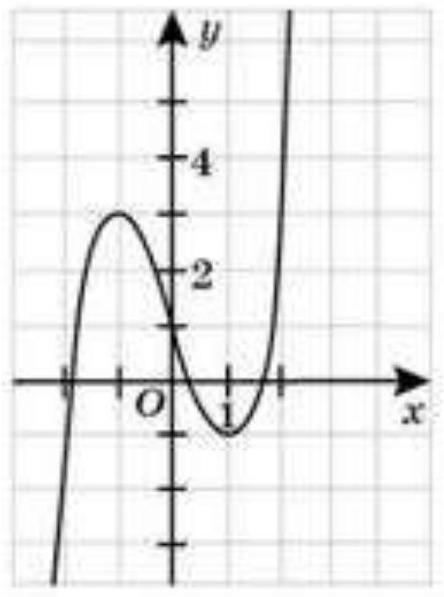
77-cyper

3) $2 f(-2)-3 f(0)+2 f(1)-2 f(2)$ ернегінін мәнін табындар; 4) $f(x)=a x^{3}-b x-c$ функциясы үшін $a c$ ернегінін танба сын аныктандар.

## Жана білімді менгеруге дайындаламыз

24.26. Тепе-тендікті дәлелдендер:

1) $\operatorname{tg} \alpha+\operatorname{ctg} \alpha=\frac{1}{\sin \alpha \cos \alpha}$;
2) $\operatorname{tg} \alpha+\operatorname{ctg} \beta=\frac{\sin (\alpha+\beta)}{\sin \beta \cos \alpha}$.
24.27. Өрнекті ыкшамдандар:
3) $1-\operatorname{tg} \alpha \cdot \operatorname{tg} \beta$;
4) $\operatorname{ctg} \alpha \cdot \operatorname{ctg} \beta-1$.
24.28. Erep $\sin \alpha=\frac{2}{5}$ және $\frac{\pi}{2}<\alpha<\pi$ болса, онда $\operatorname{tg} \alpha$ және $\operatorname{ctg} \alpha$ мәндерін табындар.

## Жана білімді менгеруге арналған тірек ұғымдар

Негізгі тригонометриялык тепе-тендіктер, бұрыитардын косындысыныи және айырымынын синусы мен косинусы.

## §25. ЕКІ БУРЫШТЫН КОСЫНДЫСЫ МЕН АЙЫРЫМЫНЫН ТАНГЕНСІ МЕН КОТАНГЕНСІНІН ФОРМУЛАЛАРЫ

## Түйінді уғымдар

Тангенс, котангенс

Бұрыштардың қосындысының және айырымының тангенсі мен котангенсінің формулаларын қорытып шығару мен қолдануды үйренесіндер.

Тангенс пен котангенстін косындысынын формулаларын корытып шығару үшін §24-тегі (5) - (8) формулаларды, сонымен катар, тангенс пен котангенстін синус пен косинус аркылы ернектелетін формулаларын колдануға болады.

Мысал ретінде тангенстін косындысынын формуласын корытып шығарайык:

$$
\operatorname{tg}(\alpha+\beta)=\frac{\sin (\alpha+\beta)}{\cos (\alpha+\beta)}=\frac{\sin \alpha \cos \beta+\cos \alpha \sin \beta}{\cos \alpha \cos \beta-\sin \alpha \sin \beta}
$$

$\cos \alpha \neq 0$ және $\cos \beta \neq 0$ деп ұйғарып, шыккан белшектін алымы мен белімін $\cos \alpha \cdot \cos \beta$ көбейтіндісіне белеміз:

$$
\frac{\frac{\sin \alpha \cos \beta}{\cos \alpha \cos \beta}+\frac{\cos \alpha \sin \beta}{\cos \alpha \cos \beta}}{\frac{\cos \alpha \cos \beta}{\cos \alpha \cos \beta}-\frac{\sin \alpha \sin \beta}{\cos \alpha \cos \beta}}=\frac{\frac{\sin \alpha}{\cos \alpha}+\frac{\sin \beta}{\cos \beta}}{1-\frac{\sin \alpha}{\cos \alpha} \cdot \frac{\sin \beta}{\cos \beta}}=\frac{\operatorname{tg} \alpha+\operatorname{tg} \beta}{1-\operatorname{tg} \alpha \operatorname{tg} \beta} .
$$

Демек,

$$
\begin{equation*}
\operatorname{tg}(\alpha+\beta)=\frac{\operatorname{tg} \alpha+\operatorname{tg} \beta}{1-\operatorname{tg} \alpha \operatorname{tg} \beta} . \tag{1}
\end{equation*}
$$

(1) формуланы косындыныи тангенсі деп атайды.

Екі бұрыитын косындысынын тангенсі осы бұрыштардын танеенстерінін косындысын бір саны мен осы бұрыштардын тангенстерінін көбейтіндісінін айырымына бөлгенге тен.
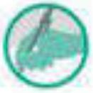

Айырымнын тангенсін, яғни

$$
\begin{equation*}
\operatorname{tg}(\alpha-\beta)=\frac{\operatorname{tg} \alpha-\operatorname{tg} \beta}{1+\operatorname{tg} \alpha \operatorname{tg} \beta} \tag{2}
\end{equation*}
$$

формуласынын акикаттығын өздерін дәлелдендер.
(1) және (2) формулаларды біріктіріп, мына формуланы аламыз:

$$
\begin{equation*}
\operatorname{tg}(\alpha \pm \beta)=\frac{\operatorname{tg} \alpha \pm \operatorname{tg} \beta}{1 \mp \operatorname{tg} \alpha \operatorname{tg} \beta} . \tag{3}
\end{equation*}
$$

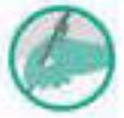

Косынды мен айырымнын котанченсін, яғни

$$
\begin{equation*}
\operatorname{ctg}(\alpha+\beta)=\frac{1-\operatorname{tg} \alpha \operatorname{tg} \beta}{\operatorname{tg} \alpha+\operatorname{tg} \beta} \text { және } \operatorname{ctg}(\alpha-\beta)=\frac{1+\operatorname{tg} \alpha \operatorname{tg} \beta}{\operatorname{tg} \alpha-\operatorname{tg} \beta}, \tag{4}
\end{equation*}
$$

немесе $\operatorname{ctg}(\alpha \pm \beta)=\frac{1 \mp \operatorname{tg} \alpha \operatorname{tg} \beta}{\operatorname{tg} \alpha \pm \operatorname{tg} \beta}$ формулаларынын акикаттығын екі тәсілмен дәледден дер.

## МЫСАЛ

Егер $\operatorname{tg} \alpha=\frac{1}{2}, \operatorname{tg} \beta=\frac{1}{3}, \alpha$ және $\beta$ сүйір бұрыштар болса, онда $\alpha$ және β бұрыштарынын косындысынын мәнін табайык.

Шешуі $\alpha+\beta$ косындысынын тангенсінін мәнін табу үшін (1) формуланы колданамыз:

$$
\begin{aligned}
& \operatorname{tg}(\alpha+\beta)=\frac{\operatorname{tg} \alpha+\operatorname{tg} \beta}{1-\operatorname{tg} \alpha \operatorname{tg} \beta}=\frac{\frac{1}{2}+\frac{1}{3}}{1-\frac{1}{2} \cdot \frac{1}{3}}=\frac{\frac{5}{6}}{1-\frac{1}{6}}=1 . \\
& \operatorname{tg}(\alpha+\beta)=1, \text { будан } \alpha+\beta=45^{\circ} \text { шығады. }
\end{aligned}
$$

Жауабы : $45^{\circ}$.

1. $\alpha$ және $\beta$ бұрыштарыныи тангенсі мен котангенсінін косындысы мен айырымынын формулалары кандай бұрыштарга кодланылады?
2. Қосынды мен айырымнын тангенсінін ± және 〒 танбалары нені білліреді? Осындай танбалары бар формулалар калай колданылалы?

## Жаттығулар

## A

25.1. $\operatorname{tg} \alpha=\frac{1}{3}$ және $\operatorname{tg} \beta=\frac{3}{5}$ екені белгілі.

1) $\operatorname{tg}(\alpha+\beta)$;
2) $\operatorname{tg}(\alpha-\beta)$;
3) $\operatorname{ctg}(\alpha+\beta)$;
4) $\operatorname{ctg}(\alpha-\beta)$ ернегінін мәнін табындар.
25.2. Erep $\operatorname{ctg}(\alpha+\beta)$ және $\operatorname{ctg}(\alpha-\beta)$ болса, онда $\operatorname{ctg} \alpha=2$ және $\operatorname{ctg} \beta=-1,6$ ернектерінін мәндерін табындар.
25.3. Тангенс пен котангенстін косу формулаларын колданып, өрнектін мәнін табындар:
5) $\operatorname{tg} 15 a ;$
6) $\operatorname{ctg} 15^{\circ}$,
7) $\operatorname{tg} 75 \quad$,
8) $\operatorname{tg} 105 ;$
9) $\operatorname{ctg} 75^{a}$
10) $\operatorname{ctg} 105^{\circ}$
25.4. α бұрышын тригонометриялык функциялар аркылы ернектендер:
11) $\operatorname{tg}\left(\frac{\pi}{4}+\alpha\right)$;
12) $\operatorname{ctg}\left(\frac{\pi}{4}-\alpha\right)$;
13) $\operatorname{tg}\left(\frac{\pi}{3}-\alpha\right)$;
14) $\operatorname{ctg}\left(\frac{\pi}{3}+\alpha\right)$;
15) $\operatorname{tg}\left(\frac{\pi}{6}+\alpha\right)$;
16) $\operatorname{ctg}\left(\frac{\pi}{6}-\alpha\right)$.
25.5. Өрнектін мәнін табындар:
17) $\frac{\operatorname{tg} 20^{\circ}+\operatorname{tg} 25^{\circ}}{1-\operatorname{tg} 20^{\circ} \operatorname{tg} 25^{\circ}}$;
18) $\frac{\operatorname{tg} 70^{\circ}-\operatorname{tg} 10^{\circ}}{1+\operatorname{tg} 70^{\circ} \operatorname{tg} 10^{\circ}}$;
19) $\frac{\operatorname{tg} \frac{7 \pi}{24}-\operatorname{tg} \frac{\pi}{8}}{1+\operatorname{tg} \frac{7 \pi}{24} \operatorname{tg} \frac{\pi}{8}}$;
20) $\frac{\operatorname{tg} \frac{\pi}{20}+\operatorname{tg} \frac{\pi}{5}}{1-\operatorname{tg} \frac{\pi}{20} \operatorname{tg} \frac{\pi}{5}}$.

## B

25.6. Өрнекті ыкшамдандар:

1) $\operatorname{tg}(\alpha+\beta)-\operatorname{tg} \alpha \cdot \operatorname{tg} \beta \operatorname{tg}(\alpha+\beta)$;
2) $\operatorname{tg}(\alpha+\beta) \cdot \operatorname{tg}(\alpha-\beta) \cdot\left(1-\operatorname{tg}^{2} \alpha \cdot \operatorname{tg}^{2} \beta\right)$.
25.7. Тепе-тендікті дәлелдендер:
3) $\frac{\operatorname{tg}(\alpha+\beta)-\operatorname{tg} \alpha-\operatorname{tg} \beta}{\operatorname{tg} \alpha \operatorname{tg}(\alpha+\beta)}=\operatorname{tg} \beta$;
4) $\operatorname{tg}(\alpha-\beta)+\operatorname{tg} \alpha \cdot \operatorname{tg} \beta \cdot \operatorname{tg}(\alpha-\beta)=\operatorname{tg} \alpha-\operatorname{tg} \beta$.
25.8. Өрнекті ыкшамдандар;
5) $\frac{\operatorname{tg}^{2} 25^{\circ}-\operatorname{tg}^{2} 15^{\circ}}{1-\operatorname{tg}^{2} 25^{\circ} \operatorname{tg}^{2} 15^{\circ}}$;
6) $\frac{\operatorname{tg}^{2} 1,8-\operatorname{tg}^{2} 1,2}{1-\operatorname{tg}^{2} 1,8 \operatorname{tg}^{2} 1,2}$.
25.9. Өрнекті түрлендіріндер:
7) $\operatorname{tg}\left(45^{\circ}+\alpha\right) \cdot \operatorname{tg}\left(45^{\circ}-\alpha\right)$;
8) $\operatorname{tg}(\alpha+609) \cdot \operatorname{tg}\left(\alpha-60^{\circ}\right)$;
з) $\frac{1-\operatorname{tg} \alpha}{1+\operatorname{tg} \alpha}-\operatorname{tg}(45 \div \alpha)$;
9) $\operatorname{tg}\left(45^{\circ}+\alpha\right)-\frac{1-\operatorname{tg} \alpha}{1+\operatorname{tg} \alpha}$.
25.10. Тепе-тендікті дәлелдендер:
10) $\frac{\operatorname{tg} \alpha+\operatorname{tg} \beta}{\operatorname{tg} \alpha-\operatorname{tg} \beta}-\frac{\sin (\alpha+\beta)}{\sin (\alpha-\beta)}+\frac{\sin (\alpha+\beta)}{\sin \alpha \sin \beta}=\operatorname{ctg} \alpha+\operatorname{ctg} \beta$;
11) $\frac{\sin (\alpha-\beta)}{\sin \alpha \sin \beta}+\frac{\sin (\beta-x)}{\sin \beta \sin x}+\frac{\sin (x-\alpha)}{\sin x \sin \alpha}=0$.

## C

25.11. Егер $\alpha$ және $\beta$ бұрыштары I ширектін бұрыштары болса, онда төмендегі тенсіздіктердін дұрыстығын далелдендер:

1) $\sin (\alpha+\beta)<\sin \alpha+\sin \beta ;$
2) $\sin (\alpha+\beta)<\cos \alpha+\cos \beta ;$
3) $\cos (\alpha-\beta)<\cos \alpha+\sin \beta$;
4) $\operatorname{tg}(\alpha+\beta)>\operatorname{tg} \alpha+\operatorname{tg} \beta$,
25.12. Өрнекті ыкшамдандар:
5) $(\operatorname{tg} \alpha-1) \cdot \operatorname{tg} \beta+(\operatorname{tg} \alpha+\operatorname{tg} \beta) \cdot \operatorname{ctg}(\alpha+\beta)$;
6) $1-\frac{\operatorname{tg}(\alpha+\beta)-\operatorname{tg} \alpha-\operatorname{tg} \beta}{\operatorname{tg} \alpha \operatorname{tg}(\alpha+\beta)}$.
25.13. $\operatorname{tg} \alpha=\frac{3}{8}, \operatorname{tg} \beta=\frac{5}{11}$ (мундағы $\alpha$ және $\beta$ - бірінші ширектін бұрыштары) екені белгілі. $\alpha+\beta=45^{\circ}$ болатынын далелдендер.
25.14. Тепе-тендікті дәлелдендер:
7) $\frac{\operatorname{tg} 4 \beta-\operatorname{tg} 3 \beta}{1+\operatorname{tg} 4 \beta \operatorname{tg} 3 \beta}=\operatorname{tg}(\beta-5 \pi) ;$
8) $\frac{\operatorname{tg}^{2} 2 \beta-\operatorname{tg}^{2} \beta}{1-\operatorname{tg}^{2} 2 \beta \operatorname{tg}^{2} \beta}=\operatorname{tg} \beta \cdot \operatorname{tg} 3$.

## ҚАЙТАЛАУ

25.15. Өрнектін мәндерінін жиынын табындар:

1) $\sin \alpha+2 \cos \alpha$;
2) $3 \sin \alpha-\cos \alpha$;
3) $\sqrt{3} \cos \gamma+\sin \gamma$;
4) $\sin \beta-\sqrt{3} \cos \beta$;
5) $5 \sin \alpha-4 \cos \alpha$;
6) $\cos \gamma+3 \sin \gamma$.
25.16. Үшбұрыштын сүйір бұрыштарынын синустары 0,6 және 0,8 -ге тен. Үшбұрыштын үшінші бұрышынын косинусын табындар.
25.17. Тенсіздікті шешіндер:
7) $x^{2}+3|x|-18 \mid 0$;
8) $x^{2}-2|x-2|-9$ mo.
25.18. Функциянын графигін салындар және мәндер жнынын табындар:
9) $y=x^{2}+3|x|$;
10) $y=-x^{2}+2|x|$;
11) $y=2 x^{2}-3|x-1|$;
12) $y=-2 x^{2}+|x+1|$.

## Жана білімді менгеруге дайындаламыз

25.19. Тепе-тендікті дәлелдендер:

1) $\sin (\alpha-\beta)+\sin (-\alpha) \cos (-\beta)=\cos \alpha \sin (-\beta) ;$
2) $\cos (\alpha-\beta)+\cos (\alpha+\beta)=2 \cos \alpha \cos (-\beta) ;$
3) $\sin (\alpha-\beta)+\sin (\alpha+\beta)=2 \sin (-\alpha) \cos (-\beta) ;$
4) $\sin (\beta-\alpha) \sin (\alpha+\beta)=\sin ^{2} \beta-\sin ^{2} \alpha$.
25.20. Өрнекті ыкшамдандар:
5) $\sin \beta+\cos \beta+\sqrt{2} \sin \left(45^{\circ}-\beta\right) ;$
6) $\sqrt{3} \cos \beta+\sin \beta-2 \cos \left(\beta-30^{\circ}\right)$.
25.21. Тепе-тендікті дәлелдендер:
7) $\frac{\operatorname{tg} 5 \beta-\operatorname{tg} 3 \beta}{1+\operatorname{tg} 5 \beta \operatorname{tg} 3 \beta}=\operatorname{tg} 2 \beta$;
8) $\frac{\operatorname{tg}^{2} 3 \beta-\operatorname{tg}^{2} \beta}{1-\operatorname{tg}^{2} 3 \beta \operatorname{tg}^{2} \beta}=\operatorname{tg} 2 \beta \cdot \operatorname{tg} 4 \beta$.

## Жана білімді менгеруге арналған тірек ұғымдар

Негізгі тригонометриялық тепе-тендіктер, тригонометриятык функцияларды косу форциалары.

## §26. ТРИГОНОМЕТРИЯЛЫК ФУНКЦИЯ.ЛАРДЫЦ   КОСБУРЫШыныи ЖӘнЕ ЖАРТЫБҰРЫШЫНЫН ФОРМУЛАЛАРЫ

## Түйінді уғымдар

Спнус, коспнус, тантенс, котантенс

Қосбұрыштың және жартыбұрыштың формулаларын қорытып шығару мен қолдануды үйренесіңдер.

Тригонометриялык өрнектерді ыкшамдау, тепе-тендіктерді дәлелдеу кезінде және баска да жағдайларда косбұрыштын тригонометриялык функцияларын сол бұрыштын тригонометрнялык функциялары аркылы өрнектеу керек болады. Баска сөзбен айтканда, 2 d бұрышының синус, косинус, тангенс және котангенсін а бұрышынын тригонометриялык функциясы аркылы өрнектеу керек болады.

Косбұрыштын формулаларын косу формулалары аркылы корытып шығаруға болады. Мысалы, косындынын синусыныи формуласын, яғни $\sin (\alpha+\beta)=\sin \alpha \cos \beta+\cos \alpha \sin \beta$ формуласын колданып және осы формуладағы $\beta$-ны $\alpha$-мен алмастырып, $\sin 2 \alpha$-ны табуға болады.

Сонда $\sin (\alpha+\alpha)=\sin \alpha \cos \alpha+\cos \alpha \sin \alpha=2 \sin \alpha \cos \alpha$, немесе косбурыштын синусынын формуласы н аламы 3:

$$
\begin{equation*}
\sin 2 \alpha=2 \sin \alpha \cos \alpha . \tag{1}
\end{equation*}
$$

Косбұрыштын синусы осы бұрыштын синусы мен осы бұрыитын косинусынын екі есетенген көбейтіндісіне тен.
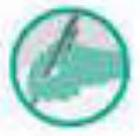

Темендеті формулалардын зұрыстығын өздерін далелдендер:

$$
\begin{gather*}
\cos 2 \alpha=\cos ^{2} \alpha-\sin ^{2} \alpha  \tag{2}\\
\operatorname{tg} 2 \alpha=\frac{2 \operatorname{tg} \alpha}{1-\operatorname{tg}^{2} \alpha}  \tag{3}\\
\operatorname{ctg} 2 \alpha=\frac{1-\operatorname{tg}^{2} \alpha}{2 \operatorname{tg} \alpha} \tag{4}
\end{gather*}
$$

(1) - (4) формулалары косбұрыштын форwугалары деп аталады.

Косбұрыштын формулалары:

$$
\begin{gathered}
\sin 2 \alpha=2 \sin \alpha \cdot \cos \alpha ; \\
\cos 2 \alpha=\cos ^{2} \alpha-\sin ^{2} \alpha=1-2 \sin ^{2} \alpha=2 \cos ^{2} \alpha-1 ; \\
\operatorname{tg} 2 \alpha=\frac{2 \operatorname{tg} \alpha}{1-\operatorname{tg}^{2} \alpha}=\frac{2}{\operatorname{ctg} \alpha-\operatorname{tg} \alpha} .
\end{gathered}
$$

## МЫСАЛ

1. $\frac{\cos 80^{\circ}}{\cos 40^{\circ}+\sin 40^{\circ}}$ ернегін ыкшамдайык.

Шешуі . $80^{\circ}$ бұрышты екі көбейткіштін көбейтіндісі түрінде жазып, (2) формуланы колданамыз: $\cos 80^{\circ}=\cos \left(2 \cdot 40^{\circ}\right)=\cos ^{2} 40^{\circ}- -\sin ^{2} 40^{\circ}=\left(\cos 40^{\circ}+\sin 40^{\circ}\right) \cdot\left(\cos 40^{\circ}-\sin 40^{\circ}\right)$. Енді
$\frac{\cos 80^{\circ}}{\cos 40^{\circ}+\sin 40^{\circ}}$ белшегіндегі $\cos 80^{\circ}$ өрнегінін орнына $\left(\cos 40^{\circ}+\right. +\sin 409 \cdot\left(\cos 40^{\circ}-\sin 40^{\circ}\right)$ ернегін коямыз:

$$
\frac{\cos 80^{\circ}}{\cos 40^{\circ}+\sin 40^{\circ}}=\frac{\left(\cos 40^{\circ}+\sin 40^{\circ}\right)\left(\cos 40^{\circ}-\sin 40^{\circ}\right)}{\cos 40^{\circ}+\sin 40^{\circ}}=\cos 40^{\circ}-\sin 40^{\circ} .
$$

Жауабы : $\cos 40^{\circ}-\sin 40^{\circ}$.

## МЫСАЛ

2. $4 \sin \alpha \cos \alpha \cdot\left(\cos ^{2} \alpha-\sin ^{2} \alpha\right)=\sin 4 \alpha$ тепе-тендігін далелдейік.

Далелдеу . Тендіктін сол жағына синустың косбұрышынын (1) және косннустың косбұрышыныи (2) формулаларын колданамыз. Сонда
$4 \sin \alpha \cos \alpha \cdot\left(\cos ^{2} \alpha-\sin ^{2} \alpha\right)=2 \cdot \sin 2 \alpha \cdot \cos 2 \alpha=\sin 4 \alpha$.

## МЫСАЛ

3. Егер $\sin \alpha=\frac{2}{3}$ және $0<\alpha<\frac{\pi}{2}$ болса, онда $\sin 2$ α-ны табайык.

Шешуі . Синустың косбұрышының, яғніи $\sin 2 \alpha=2 \sin \alpha \cos \alpha$ формуласын колданамыз. $\sin 2 \alpha$-нын мәнін есептеу үшін sin $\alpha$ мен $\cos \alpha$-нын мәндерін білу керек. $\sin \alpha$-нын мәні есептін шарты бойынша белгілі, $\cos \alpha$-нын мәні белгісіз. Бұл мәнді табу үшін негізгі тригонометриялық тепе-тендікті колданамыз және а бұрышы бірінші ширекке тисті екенін ескереміз. Сонда
$\cos \alpha=\sqrt{1-\sin ^{2} \alpha}=\sqrt{1-\left(\frac{2}{3}\right)^{2}}=\sqrt{1-\frac{4}{9}}=\frac{\sqrt{5}}{3}$.
Енді $\sin 2 \alpha$-нын мәнін есептейміз:
$\sin 2 \alpha=2 \sin \alpha \cos \alpha=2 \cdot \frac{2}{3} \cdot \frac{\sqrt{5}}{3}=\frac{4 \sqrt{5}}{9}$, немесе $\sin 2 \alpha=\frac{4 \sqrt{5}}{9}$.
Жауабы : $\frac{4 \sqrt{5}}{9}$.
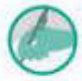

Дәрежені төмендету формулаларынын дұрыстынын ездерін далелдендер.

Дәрежені төмендету формулалары:

$$
\begin{aligned}
& \sin ^{2} \alpha=\frac{1}{2}(1-\cos 2 \alpha) ; \\
& \cos ^{2} \alpha=\frac{1}{2}(1+\cos 2 \alpha) .
\end{aligned}
$$

Тригонометриялык функциялардын жартыбұрышынын формулаларын корытып шығарайык. Ол үшін косинустын косбұрышынын, яғни $\cos 2 \alpha=\cos ^{2} \alpha-\sin ^{2} \alpha$ формуласын колданамыз. Бұл тендік кез келген бұрыш үшін, онын ішінде $\frac{\alpha}{2}$ бұрышы үшін де орындалады. Сондыктан бұл формуладағы $\alpha$ бұрышыныи орнына $\frac{\alpha}{2}$ бұрышын коямыз:

$$
\cos \alpha=\cos \left(2 \cdot \frac{\alpha}{2}\right)=\cos ^{2} \frac{\alpha}{2}-\sin ^{2} \frac{\alpha}{2},
$$

немесе

$$
\begin{equation*}
\cos \alpha=\cos ^{2} \frac{\alpha}{2}-\sin ^{2} \frac{\alpha}{2} . \tag{A}
\end{equation*}
$$

Негізгі тригонометриялык тепе-тендікті $\frac{\alpha}{2}$ бұрышы үшін жазайық:

$$
\begin{equation*}
1=\cos ^{2} \frac{\alpha}{2}+\sin ^{2} \frac{\alpha}{2} \tag{B}
\end{equation*}
$$

(A) және (B) тендіктерінін сол және он жактарын мүшелеп коссак, $1+\cos \alpha=2 \cos ^{2} \frac{\alpha}{2}$ аламыз. Бұдан $\cos \frac{\alpha}{2}= \pm \sqrt{\frac{1+\cos \alpha}{2}}$.
(B) тендігінен (A) тендігін мүшелеп азайтайык:
$1-\cos \alpha=2 \sin ^{2} \frac{\alpha}{2}$, будан $\sin \frac{\alpha}{2}= \pm \sqrt{\frac{1-\cos \alpha}{2}}$.

Жартыбұрыштын синусы мен косинусының формулалары:

$$
\begin{align*}
\cos \frac{\alpha}{2} & = \pm \sqrt{\frac{1+\cos \alpha}{2}},  \tag{5}\\
\sin \frac{\alpha}{2} & = \pm \sqrt{\frac{1-\cos \alpha}{2}} . \tag{6}
\end{align*}
$$

Жартыбұрыштың тангенсі мен котангенсінін формулаларынын акнкаттығын өздерін дәлелдендер:

$$
\operatorname{tg} \frac{\alpha}{2}= \pm \sqrt{\frac{1-\cos \alpha}{1+\cos \alpha}} ; \quad \operatorname{ctg} \frac{\alpha}{2}= \pm \sqrt{\frac{1+\cos \alpha}{1-\cos \alpha}} .
$$

## МЫСАЛ

4. $\cos \alpha=-\frac{3}{5}$ және $180^{\circ}<\alpha<270^{\circ}$ екені белгілі. $\sin \frac{\alpha}{2}, \cos \frac{\alpha}{2}$, $\operatorname{tg} \frac{\alpha}{2}$ өрнектерінін мәндерін табайык.

Шешуі, $180^{\circ}<\alpha<270^{\circ}$ болғандыктан, $\quad 90^{\circ}<\frac{\alpha}{2}<135^{\circ}$, ягни $\frac{\alpha}{2}$ бұрышы II ширекке тністі. Сондыктан бұл бұрыштын синусы он, ал косннусы теріс болады: $\sin \frac{\alpha}{2}=\sqrt{\frac{1-\cos \alpha}{2}}=\sqrt{\frac{1-\left(-\frac{3}{5}\right)}{2}}=\frac{2 \sqrt{5}}{5}$, $\cos \frac{\alpha}{2}=-\sqrt{\frac{1+\cos \alpha}{2}}=-\sqrt{\frac{1-\left(-\frac{3}{5}\right)}{2}}=-\frac{\sqrt{5}}{5}$. Ал $\operatorname{tg} \frac{\alpha}{2}$ өрнегінін мәнін екі тәсілмен табуға болады:

1-тәсіл. $\operatorname{tg} \frac{\alpha}{2}=\sqrt{\frac{1-\cos \alpha}{1+\cos \alpha}}=-\sqrt{\frac{1-\left(-\frac{3}{5}\right)}{1+\left(-\frac{3}{5}\right)}}=-2$.
2-гәсіл. $\operatorname{tg} \frac{\alpha}{2}=\frac{\sin \frac{\alpha}{2}}{\cos \frac{\alpha}{2}}=\frac{2 \sqrt{5}}{5}:\left(-\frac{\sqrt{5}}{5}\right)=-2$.
Жауабы : $\frac{2 \sqrt{5}}{5} ;-\frac{\sqrt{5}}{5} ;-2$.
$\operatorname{tg} \frac{\alpha}{2}$ ернегін $\sin \alpha$ мен $\cos \alpha$ аркылы ернектейік:
$\operatorname{tg} \frac{\alpha}{2}=\frac{\sin \frac{\alpha}{2}}{\cos \frac{\alpha}{2}}=\frac{2 \cos \frac{\alpha}{2} \sin \frac{\alpha}{2}}{2 \cos \frac{\alpha}{2} \cos \frac{\alpha}{2}}=\frac{\sin \alpha}{1+\cos \alpha}$, ейткені $2 \cos ^{2} \frac{\alpha}{2}=1+\cos \alpha$
немесе
$\operatorname{tg} \frac{\alpha}{2}=\frac{\sin \frac{\alpha}{2}}{\cos \frac{\alpha}{2}}=\frac{\sin \frac{\alpha}{2} \cdot 2 \sin \frac{\alpha}{2}}{2 \cos \frac{\alpha}{2} \sin \frac{\alpha}{2}}=\frac{1-\cos \alpha}{\sin \alpha}$, , ейткені $2 \sin 2 \frac{\alpha}{2}=1-\cos \alpha$,
Сонымен, $\operatorname{tg} \frac{\alpha}{2}=\frac{\sin \alpha}{1+\cos \alpha}=\frac{1-\cos \alpha}{\sin \alpha}$.

## МЫСАЛ

5. $\operatorname{tg} \frac{\pi}{8}$ ернегінін мәнін табайык.

Шешуі $\frac{\pi}{8}$ бұрышы I ширектін бұрышы. Демек, тангенстін жарт ыбұрышынын формуласы бойынша $\operatorname{tg} \frac{\pi}{8}=\frac{1-\cos \frac{\pi}{4}}{\sin \frac{\pi}{4}}=\frac{1-\frac{\sqrt{2}}{2}}{\frac{\sqrt{2}}{2}}=\sqrt{2}-1$.

Жауабы : $\sqrt{2}-1$.

## МЫСАЛ

6. $\frac{\cos ^{2} \alpha}{\operatorname{ctg} \frac{\alpha}{2}-\operatorname{tg} \frac{\alpha}{2}}=\frac{1}{4} \sin 2 \alpha$ тепе-тендігін дәлелдейік.

Длгетдеуі $\cdot \frac{\cos ^{2} \alpha}{\operatorname{ctg} \frac{\alpha}{2}-\operatorname{tg} \frac{\alpha}{2}}=\frac{\cos ^{2} \alpha}{\frac{1+\cos \alpha}{\sin \alpha}-\frac{1-\cos \alpha}{\sin \alpha}}=\frac{\cos ^{2} \alpha \sin \alpha}{2 \cos \alpha}=$
$=\frac{1}{2} \sin \alpha \cos \alpha=\frac{1}{4} \sin 2 \alpha$.
70

## ?

1. α және β косбұрыштарынын және жартыбұрыштарыныи коспнусы, синусы мен тангенсінін формулалары кандай бұрыштарга колданылады?
2. Дәрежені темендету формулаларын канцай a және $\beta$ бұрыштарына колдануға болады?

## Жаттығулар

## A

26.1. Өрнекті ыкшамдандар:

1) $\frac{\sin 2 x}{2 \cos x}$;
2) $\frac{2 \sin ^{2} x}{\sin 2 x}$;
3) $\sin ^{2} x-\cos ^{2} x$;
4) $\frac{\cos 2 x}{\sin x-\cos x}$;
5) $\frac{\sin 2 \alpha-2 \sin \alpha}{\cos \alpha-1}$;
6) $\frac{\cos \alpha-\sin 2 \alpha}{1-2 \sin \alpha}$;
7) $\frac{(\sin x-\cos x)^{2}}{1-\sin 2 x}$;
8) $\frac{\cos 2 \alpha \operatorname{tg} 2 \alpha}{2 \sin \alpha}$;
9) $\frac{2 \cos x \cos 2 x}{\operatorname{ctg} 2 x}$.
26.2. Өрнектін мәнін табындар:
10) $\frac{\cos ^{2} \frac{\pi}{8}}{1-\sin ^{2} \frac{\pi}{8}}$;
11) $\frac{2 \operatorname{tg} \frac{\pi}{12}}{1-\operatorname{tg}^{2} \frac{\pi}{12}}+1$;
12) $2-\frac{2 \operatorname{tg} 75^{\circ}}{1-\operatorname{tg}^{2} 75^{\circ}}$;
13) $2 \sin 15^{\circ} \cos 15^{\circ}$;
14) $4 \sin 15^{\circ} \cos 15^{\circ} \cos 30^{\circ}$;
15) $\cos ^{2} 15^{\circ} \cos ^{2} 75^{\circ}$.

Өрнекті ыкшамдандар (26.3-26.4) :
26.3.

1) $1-2 \sin ^{2} \alpha$;
2) $2 \cos ^{2} \alpha-1$;
3) $\operatorname{ctg} \alpha-\operatorname{tg} \alpha$;
4) $\frac{1-\operatorname{tg}^{2} \alpha}{1+\operatorname{tg}^{2} \alpha}$;
5) $\operatorname{tg} 2 \alpha\left(1-\operatorname{tg}^{2} \alpha\right)$.
26.4. 1) $\frac{2 \sin ^{2} \frac{\alpha}{2}}{\sin \alpha}$;
6) $\frac{\cos \beta}{\cos \frac{\beta}{2}-\sin \frac{\beta}{2}}$;
7) $\frac{\cos ^{2} 2 \alpha}{\sin 4 \alpha}$;
8) $\frac{(\sin \alpha+\cos \alpha)^{2}}{1-\sin ^{2} 2 \alpha}$.
26.5. 1) $\sin \alpha$ және $\cos \alpha$; 2) $\operatorname{tg} \alpha$; 3) $\operatorname{ctg} \alpha$-ны $\operatorname{ctg} \frac{\alpha}{2}$ аркылы ернектендер.
26.6. Erep $\frac{\pi}{2}<\alpha<\pi$ және $\sin \alpha=\frac{2}{5}$ болса, онда $\sin 2 \alpha, \cos 2 \alpha, \operatorname{ctg} 2 \alpha$ және $\operatorname{tg} 2$ α-ны табындар.
26.7. Erep $\operatorname{tg} \alpha=2,4$ және $\pi<\alpha<\frac{3 \pi}{2}$ болса, онда $\sin 2 \alpha, \cos 2 \alpha, \operatorname{ctg} 2 \alpha$ және $\operatorname{tg} 2$ α-ны есептендер.
26.8. Erep $\operatorname{tg} \frac{\alpha}{2}=0,5$ болса, онда $\sin \alpha, \cos \alpha, \operatorname{tg} \alpha$-ны табындар.
26.9. Өрнекті ыкшамдандар:
9) $\cos ^{2} \alpha-\sin ^{2} \alpha-\cos 2 \alpha$;
10) $\sin 2 \beta-\operatorname{tg} \beta-\cos 2 \beta \operatorname{tg} \beta ;$
11) $\operatorname{ctg} \phi-\sin 2 \phi-\operatorname{ctg} \phi \cos 2 \phi$;
12) $\frac{1}{1-\operatorname{tg} \alpha}-\frac{1}{1+\operatorname{tg} \alpha}$;
13) $(\sin \alpha-\sin \beta)^{2}+(\cos \alpha-\cos \beta)^{2}$;
14) $1+\frac{1-\cos 2 x+\sin 2 x}{1+\cos 2 x+\sin 2 x}$;
15) $\cos \alpha(\cos \alpha+\cos \beta)+\sin \alpha(\sin \alpha+\sin \beta) ;$
16) $1+\frac{\cos \alpha}{\sin \alpha}-\frac{\sin \alpha}{\cos \alpha}-2 \operatorname{ctg} 2 \alpha$;
17) $\cos ^{2} \alpha-4 \sin ^{2} \frac{\alpha}{2} \cos ^{2} \frac{\alpha}{2}-\cos 2 \alpha$;
18) $\operatorname{ctg} 2 \alpha-\operatorname{ctg} \alpha$.
26.10. Өрнекті ыкшамдандар:
19) $4 \sin ^{2} 1^{\circ} \cos ^{2} 1^{\circ}-\cos ^{2} 2^{\circ}$,
20) $16 \sin ^{2} 3 \cos ^{2} 3 \cos ^{2} 6^{\circ}$,
21) $\left(\sin 10^{\circ}+\sin 80^{\circ}\right)\left(\cos 80^{\circ}-\cos 10^{\circ}\right)$;
22) $\left(\cos 5^{\circ}+\cos 95^{\circ}\right)\left(\sin 85^{\circ}+\sin 175^{\circ}\right) ;$
23) $\frac{\cos 36^{\circ}+\sin ^{2} 18^{\circ}}{\cos ^{2} 18^{\circ}}-1$;
24) $\frac{\cos 56^{\circ}}{\cos 28^{\circ}+\sin 28^{\circ}}+\sin 28^{\circ}$.
26.11. Erep $\cos \alpha=\frac{1}{3}$ және $0<\alpha<\frac{\pi}{2}$ болса, онда $\sin \frac{\alpha}{2}, \cos \frac{\alpha}{2}, \operatorname{ctg} \frac{\alpha}{2}$ және $\operatorname{tg} \frac{\alpha}{2}$-ны табындар.
26.12. Erep $\sin \alpha=\frac{14}{50}$ және $\frac{\pi}{2}<\alpha<\pi$ болса, онда $\sin \frac{\alpha}{2}, \cos \frac{\alpha}{2}$ және $\operatorname{tg} \frac{\alpha}{2}$-ны табындар.
26.13. Жартыбұрыштын формуласын колданып, $\sin 229^{\prime} ; \cos 229^{\prime}$ және $\operatorname{tg} 22{ }^{\circ} 30^{\prime}$ өрнектерінің мәнін табындар.
26.14. Тепе-тендікті дәлелдендер:
25) $1+\sin \alpha=2 \cos ^{2}\left(\frac{\pi}{4}-\frac{\alpha}{2}\right)$;
26) $1-\sin \alpha=2 \sin ^{2}\left(\frac{\pi}{4}-\frac{\alpha}{2}\right)$.

B
26.15. Өрнекті ыкшамдандар:

1) $1-8 \sin 2 \beta \cdot \cos 2 \beta$;
2) $\operatorname{tg} \beta \cdot(1+\cos 2 \beta)-\sin 2 \beta$;
3) $\frac{2 \sin \beta-\sin 2 \beta}{2 \sin \beta+\sin 2 \beta}$;
4) $\frac{\operatorname{ctg}\left(45^{\circ}-\beta\right)}{1-\operatorname{ctg}^{2}\left(45^{\circ}-\beta\right)}$.
26.16. Тепе-тендікті дәлелдендер:
5) $2+\frac{\cos 3 \alpha}{\cos \alpha}-\frac{\sin 3 \alpha}{\sin \alpha}=0$;
6) $\operatorname{tg} \alpha+2 \operatorname{ctg} 2 \alpha=\operatorname{ctg} \alpha$;
7) $\operatorname{tg} 2 \alpha+2 \operatorname{ctg} 2 \alpha=\frac{2}{\sin 4 \alpha}$;
8) $\frac{1-\cos \alpha+\cos 2 \alpha}{\sin 2 \alpha-\sin \alpha}=\operatorname{ctg} \alpha$;
9) $\operatorname{ctg} \alpha-\cos 2 \alpha \cdot \operatorname{ctg} \alpha=\sin 2 \alpha$;
10) $\operatorname{ctg} 2 \alpha-\sin 4 \alpha=\cos 4 \alpha \cdot \operatorname{ctg} 2 \alpha ;$
11) $1+\cos (3 \pi+3 \alpha) \cos 2 \alpha-\cos (1,5 \pi-3 \alpha) \sin 2 \alpha=2 \sin ^{2} 2,5 \alpha$;
12) $\operatorname{tg}^{4} \alpha \cdot\left(8 \cos ^{2}(\pi-\alpha)-\cos (\pi+4 \alpha)-1\right)=8 \sin ^{4} \alpha$;
13) $\frac{1-2 \sin ^{2} \alpha}{2 \operatorname{ctg}\left(\frac{\pi}{4}-\alpha\right) \cos ^{2}\left(\frac{\pi}{4}+\alpha\right)}=1$;
14) $2 \operatorname{tg} \frac{\alpha}{2} \cdot(\operatorname{tg} \alpha+\operatorname{ctg} \alpha) \cdot\left(1-\operatorname{tg}^{2} \frac{\alpha}{2}\right)=\frac{1}{\cos ^{4} \frac{\alpha}{2}}$.
26.17. 1) Erep $\operatorname{tg} \alpha=\frac{5}{6}$ және $\pi<\alpha<1,5 \pi$ болса, онда $\sin 2 \alpha ; \cos 2 \alpha$; tg2 α өрнегінін мәнін есептендер.
15) Егер $\cos \alpha=-0,8$ және $\pi<\alpha<1,5 \pi$ болса, онда $\sin 0,5 \alpha$; $\cos 0,5 \alpha ; \operatorname{tg} 0,5 \alpha$ ернегінін мәнін есептендер.
26.18. Erep:
16) $\cos 2 \alpha=\frac{1}{3}$ және $\pi<\alpha<\frac{5 \pi}{4}$ болса, онда $\operatorname{tg}\left(\alpha+\frac{\pi}{4}\right)$;
17) $\cos 2 \beta=0,8$ және $\frac{\pi}{2}<\beta<\pi$ болса, онда $\operatorname{tg} \beta+\operatorname{ctg} \beta$;
18) $\sin 2 \alpha=-\frac{1}{3}$ болса, онда $\operatorname{tg}^{2}\left(\frac{3 \pi}{4}-\alpha\right)$;
19) $\sin 2 \beta=0,25$ болса, онда $\operatorname{ctg}^{2}\left(\frac{\pi}{4}+\beta\right)$;
20) $\frac{\cos \alpha-2 \sin \alpha}{\sin \alpha-2 \cos \alpha}=-0,5$ болса, онда $\cos 2 \alpha$;
21) $\frac{\cos \alpha+2 \sin \alpha}{2 \sin \alpha-3 \cos \alpha}=-2$ болса, онда $\sin 2 \alpha$ ернегінін мәнін табындар.
26.19. Өрнекті ыкшамдандар:
22) $\sqrt{\frac{1}{2}-\frac{1}{2} \cos \alpha}$;
23) $\sqrt{\frac{1}{2}-\frac{1}{2} \sin \alpha}$;
24) $\sqrt{\frac{1+\cos 4 \alpha}{2}}$;
25) $\sqrt{\frac{1-\cos 6 \alpha}{8}}$;
26) $\sqrt{2+\sqrt{2+2 \cos 4 \alpha}}$ мұндағы $0 \mathrm{mam} \frac{\pi}{2}$.

## C

26.20. Темендегі формулаларды корытып шығарындар:

1) $\sin 3 \alpha=3 \sin \alpha-4 \sin ^{3} \alpha$;
2) $\cos 3 \alpha=4 \cos ^{3} \alpha-3 \cos \alpha$;
3) $\operatorname{tg} 3 \alpha=\frac{3 \operatorname{tg} \alpha-\operatorname{tg}^{3} \alpha}{1-3 \operatorname{tg}^{2} \alpha}$.
26.21. Erep $\operatorname{tg} \frac{\alpha}{2}=-2$ болса, онда 1) $\left.\sin 3 \alpha ; 2\right) \cos 3 \alpha$ ернегінін мәнін табындар.
26.22. Есептендер:
4) $\cos 20^{\circ} \cdot \cos 40^{\circ} \cdot \cos 80^{\circ} ;$
5) $\sin ^{2} 10^{\circ} \cdot \sin ^{2} 50^{\circ} \cdot \sin ^{2} 70^{\circ}$;
6) $\cos 20^{\circ} \cdot \cos 40^{\circ} \cdot \cos 60^{\circ} \cdot \cos 80^{\circ}$;
7) $\cos \frac{\pi}{5} \cdot \cos \frac{2 \pi}{5}$;
8) $\sin \frac{\pi}{10} \cdot \sin \frac{3 \pi}{10}$.
26.23. Тепе-тендікті дәлелдендер:
9) $4 \sin ^{3} \alpha \cdot \cos 3 \beta+4 \cos ^{3} \beta \cdot \sin 3 \beta=3 \sin 4 \beta ;$
10) $\frac{\cos ^{3} \beta-\cos 3 \beta}{\sin ^{3} \beta+\sin 3 \beta}=\operatorname{tg} \beta$.

## ҚАЙТАЛАУ

26.24. Erep: 1) $0<x<\pi$ болса, онда $\sin 2 x<2 \sin x ; 2)-\frac{\pi}{2}<x<\frac{\pi}{2}$ болса, онда $\sin 2 x<2 \cos x$ тенсіздігін долелдендер.
26.25. Өрнектін ен үлкен және ен кіші мәндерін табындар:

1) $\cos ^{2} x+3 \sin ^{2} x$;
2) $\sin ^{4} x+\cos ^{4} x ;$
3) $\sin ^{6} x+\cos ^{6} x$.
26.26. Өрнекті ықшамдандар:
4) $\sqrt{2} \cos \left(\frac{\pi}{4}-\beta\right)-\sin \beta ;$
5) $\sqrt{2} \sin \left(\frac{\pi}{4}+\beta\right)-\cos \beta$.
26.27. 1) $y=\left\{\begin{array}{l}x^{2}-2 x, \text { мундағы } x 10, \\ 1-3 x, \text { мұндағы } x<0 ;\end{array}\right.$
6) $y=\left\{\begin{array}{l}-x^{2}-x, \text { мундағы } x \mathrm{~m} 0, \\ 2 x-3, \text { мұндағы } x>0\end{array}\right.$

функциясынын графигін салындар.
26.28. СРавырғасыныи ұзындығы 6 м және бпіктігі 80 см тіктертбұрыш пішінді белігін кыштактаймен желімдеу керек. Егер кыштақтайдын өлшемі $25 \mathrm{~cm} \cdot 30 \mathrm{~cm}$, әр жәшікте 20 данадан және кажетті кыштактайшалар санынын $5 \%$-ын шығын кұраїтын болса, онда канша жәшік кыштактай сатып алу керек?

## Жана білімді менгеруге дайындаламыз

26.29. Өрнекті көбеїтінді түрінде жазындар:

1) $\sin (\alpha+\beta)+\sin (\alpha-\beta)$;
2) $\cos (\alpha+\beta)+\cos (\alpha-\beta) ;$
3) $\quad \sin (\alpha+$
$\beta)-\sin (\alpha-\beta) ;$
4) $\cos (\alpha+\beta)-\cos (\alpha-\beta)$.

## Жана білімді менгеруте арналған тірек ұғымдар

Негізгі тригонаметриятых тепе-тендіктер, тригонометриятых функциятарды косу форцутатары, косбұрыи пен жартыбұрыштын формулалары.

## §27. ТРИГОНОМЕТРИЯ.ЛЫК ФУНКЦИЯЛАРДЫН КОСЫНДЫСЫ МЕН АЙЫРЫМЫН КӨБЕЙТІНДІГЕ ТУРЛЕНДІРУ ФОРМУЛАЛАРЫ

## Түйінді ұғымдар

Спнус, коспнус, тангенс, котангенс

Тригонометриялық функциялардын қосындысы мен айырымын көбейтіндіге түрлендіру формулаларын қорытып шығару мен қолдануды үйренесіңдер.
α бұрышын $\frac{\alpha+\beta}{2}+\frac{\alpha-\beta}{2}$ косындысы және $\beta$ бұрышын $\frac{\alpha+\beta}{2}-\frac{\alpha-\beta}{2}$ айырым ы түрінде жазайык.
$\sin \alpha+\sin \beta$ косындысын түрлендірейік:

$$
\begin{aligned}
& \sin \alpha+\sin \beta=\sin \left(\frac{\alpha+\beta}{2}+\frac{\alpha-\beta}{2}\right)+\sin \left(\frac{\alpha+\beta}{2}-\frac{\alpha-\beta}{2}\right)= \\
= & \sin \frac{\alpha+\beta}{2} \cos \frac{\alpha-\beta}{2}+\cos \frac{\alpha+\beta}{2} \sin \frac{\alpha-\beta}{2}+\sin \frac{\alpha+\beta}{2} \cos \frac{\alpha-\beta}{2}- \\
- & \cos \frac{\alpha+\beta}{2} \sin \frac{\alpha-\beta}{2}=2 \sin \frac{\alpha+\beta}{2} \cos \frac{\alpha-\beta}{2} .
\end{aligned}
$$

Түрлендіру нәтижесінде синустардын косындысынын формуласын аламыз:

$$
\begin{equation*}
\sin \alpha+\sin \beta=2 \sin \frac{\alpha+\beta}{2} \cos \frac{\alpha-\beta}{2} . \tag{1}
\end{equation*}
$$

Екі бұрыштын синустарынын косындысы осы бұрыитардын қосындысынын жартысынын синусы мен осы бұрыитарбын айырымынын жартысынын косинусынын екі еселенген көбейтіндісіне тен.
$\sin \alpha-\sin \beta$ айырымын түрлендірейік:

$$
\sin \alpha-\sin \beta=\sin \left(\frac{\alpha+\beta}{2}+\frac{\alpha-\beta}{2}\right)-\sin \left(\frac{\alpha+\beta}{2}-\frac{\alpha-\beta}{2}\right)=
$$

$=\sin \frac{\alpha+\beta}{2} \cos \frac{\alpha-\beta}{2}+\cos \frac{\alpha+\beta}{2} \sin \frac{\alpha-\beta}{2}-\sin \frac{\alpha+\beta}{2} \cos \frac{\alpha-\beta}{2}+ +\cos \frac{\alpha-\beta}{2} \sin \frac{\alpha-\beta}{2}=2 \cos \frac{\alpha+\beta}{2} \sin \frac{\alpha-\beta}{2}$.

Түрлендіру нәтижесінде синустардын айырымыныи формуласын аламыз:

$$
\begin{equation*}
\sin \alpha-\sin \beta=2 \cos \frac{\alpha+\beta}{2} \sin \frac{\alpha-\beta}{2} . \tag{2}
\end{equation*}
$$

Екі бұрыштын синустарынын айырымы осы бұрышардын косындысынын жартысынын косинусы мен осы бұрыштардын айырымының жартысынын синусынын екі есетенген көбейтндісіне тен.
$\cos \alpha+\cos \beta$ косындысын түрлендірейік:
$\cos \alpha+\cos \beta=\cos \left(\frac{\alpha+\beta}{2}+\frac{\alpha-\beta}{2}\right)+\cos \left(\frac{\alpha+\beta}{2}-\frac{\alpha-\beta}{2}\right)=$
$=\cos \frac{\alpha+\beta}{2} \cos \frac{\alpha-\beta}{2}-\sin \frac{\alpha+\beta}{2} \sin \frac{\alpha-\beta}{2}+\cos \frac{\alpha+\beta}{2} \cos \frac{\alpha-\beta}{2}+ +\sin \frac{\alpha+\beta}{2} \sin \frac{\alpha-\beta}{2}=2 \cos \frac{\alpha+\beta}{2} \cos \frac{\alpha-\beta}{2}$.

Түрлендіру нәтижесінде косинустардын косындысынын формуласын аламыз:

$$
\begin{equation*}
\cos \alpha+\cos \beta=2 \cos \frac{\alpha+\beta}{2} \cos \frac{\alpha-\beta}{2} . \tag{3}
\end{equation*}
$$

Екі бұрыитын косинустарынын косындысы осы бұрыитардын косындысынын жартысынын косинусы мен осы бұрыитардын аїырымынын жартысыныи косинусынын екі есегенген көбейтіндісіне тен.
$\cos \alpha-\cos \beta$ айырымын түрлендірейік:

$$
\begin{aligned}
& \cos \alpha-\cos \beta=\cos \left(\frac{\alpha+\beta}{2}+\frac{\alpha-\beta}{2}\right)-\cos \left(\frac{\alpha+\beta}{2}-\frac{\alpha-\beta}{2}\right)= \\
= & \cos \frac{\alpha+\beta}{2} \cos \frac{\alpha-\beta}{2}-\sin \frac{\alpha+\beta}{2} \sin \frac{\alpha-\beta}{2}-\cos \frac{\alpha+\beta}{2} \cos \frac{\alpha-\beta}{2}- \\
- & \sin \frac{\alpha+\beta}{2} \sin \frac{\alpha-\beta}{2}=-2 \sin \frac{\alpha+\beta}{2} \sin \frac{\alpha-\beta}{2} .
\end{aligned}
$$

Түрлендіру нәтижесінде косинустардын айырымыныи формуласын аламыз:

$$
\begin{equation*}
\cos \alpha-\cos \beta=-2 \sin \frac{\alpha+\beta}{2} \sin \frac{\alpha-\beta}{2} . \tag{4}
\end{equation*}
$$

Екі бұрыштын косинустарынын айырымы осы бұрыштардын росындысынын жартысынын синусы мен осы бұрыштардын айырымынын жартысынын синусынын теріс танбамен атынеан екі есетенчен көбейтіндісіне тен.
$\operatorname{tg} \alpha+\operatorname{tg} \beta$ косындысын түрлендірейік:

$$
\operatorname{tg} \alpha+\operatorname{tg} \beta=\frac{\sin \alpha}{\cos \alpha}+\frac{\sin \beta}{\cos \beta}=\frac{\sin \alpha \cos \beta+\cos \alpha \sin \beta}{\cos \alpha \cos \beta}=\frac{\sin (\alpha+\beta)}{\cos \alpha \cos \beta} .
$$

Түрлендіру нәтижесінде тангенстердін косындысынын формуласын аламыз:

$$
\begin{equation*}
\operatorname{tg} \alpha+\operatorname{tg} \beta=\frac{\sin (\alpha+\beta)}{\cos \alpha \cos \beta} \tag{5}
\end{equation*}
$$

Екі бұрыитын тангенстерінін косындысы осы бұрыштардын қосындысынын синусын осы бұрыитардын косинустарынын көбейтіндісіне бөлгенге тен.

Тангенстердін айырымыныи $\operatorname{tg} \alpha-\operatorname{tg} \beta=\frac{\sin (\alpha-\beta)}{\cos \alpha \cos \beta}$ формуласын өздерін далелдендер.

Тангенстердін айырымыныи формуласы:

$$
\begin{equation*}
\operatorname{tg} \alpha-\operatorname{tg} \beta=\frac{\sin (\alpha-\beta)}{\cos \alpha \cos \beta} . \tag{6}
\end{equation*}
$$

Екі бұрыштын тангенстерінін айырымы осы бұрыштардын айырымынын синусын осы бұрыштардын косинустарынын көбейтіндісіне балгенге тен.

## МЫСАЛ

1. $\cos 75^{\circ}+\cos 15^{\circ}$ косындысының мәнін табайык.

Шешу $i, \cos \alpha+\cos \beta=2 \cos \frac{\alpha+\beta}{2} \cos \frac{\alpha-\beta}{2}$ формуласын колданамыз:

$$
\cos 75^{\circ}+\cos 15^{\circ}=2 \cos 45^{\circ} \cos 30^{\circ}=2 \cdot \frac{\sqrt{2}}{2} \cdot \frac{\sqrt{3}}{2}=\frac{\sqrt{6}}{2} .
$$

$$
\text { Жауабы: } \frac{\sqrt{6}}{2} .
$$

## МЫСАЛ

2. $\sin \alpha+\sin 2 \alpha+\sin 3 \alpha$ косындысын көбейтіндіге түрлендірейік. Шешуi $\cdot \sin \alpha+\sin 2 \alpha+\sin 3 \alpha=(\sin \alpha+\sin 3 \alpha)+\sin 2 \alpha= =2 \sin 2 \alpha \cos \alpha+\sin 2 \alpha=2 \sin 2 \alpha\left(\cos \alpha+\frac{1}{2}\right)=2 \sin 2 \alpha(\cos \alpha+ \left.+\cos 60^{\circ}\right)=4 \sin 2 \alpha \cdot \cos \left(\frac{\alpha}{2}+\frac{\pi}{6}\right) \cdot \cos \left(\frac{\alpha}{2}-\frac{\pi}{6}\right)$.

Жауабы: $4 \sin 2 \alpha \cdot \cos \left(\frac{\alpha}{2}+\frac{\pi}{6}\right) \cdot \cos \left(\frac{\alpha}{2}-\frac{\pi}{6}\right)$.

## МЫСАЛ

3. $\sin \alpha+\cos \alpha$ косындысын көбейтіндіге түрлендірейік.

Шешуi $\sin \alpha+\cos \alpha=\sin \alpha+\sin \left(\frac{\pi}{2}-\alpha\right)=2 \sin \frac{\pi}{4} \cdot \cos \left(\frac{\pi}{4}-\alpha\right)= =\sqrt{2} \cos \left(\frac{\pi}{4}-\alpha\right)$.

Жауабы: $\sqrt{2} \cos \left(\frac{\pi}{4}-α\right)$.
?

1. α және β бұрыштарыныи тригонометриялык функшияарынын косындысы мен айырымы формулаларын кандай бұрыштар үшін колцануга болады?
2. Қандай да бір бұрыштын тантенсі мен котангенсінін косындысын (айырымын) кебейтіндіге түрлендіру үшін кандай формулалар колданылацы?

## Жаттығулар

## A

27.1. Тригонометриялык ернекті көбейтінді түрінде жазындар:

1) $\sin 3 x+\sin 5 x ;$
2) $\sin 2 \beta+\sin 6 \beta ;$
3) $\sin 15^{\circ}+\sin 15^{\circ}$;
4) $\sin 130^{\circ}+\sin 10^{\circ}$;
5) $\cos 3 x+\cos 7 x ;$
6) $\cos 13 \alpha-\cos 5 \alpha$;
7) $\cos 13^{\circ}-\cos 27^{\circ}$;
8) $\cos 78^{\circ}+\cos 18^{\circ}$.
27.2. Өрнекті кебейтіндіге түрлендіріндер:
9) $\sin \frac{\pi}{5}+\sin \frac{3 \pi}{5}$;
10) $\cos \frac{2 \pi}{3}+\cos \frac{\pi}{6}$;
11) $\sin \frac{3 \pi}{10}-\sin \frac{\pi}{10}$;
12) $\cos \frac{\pi}{4}-\cos \frac{3 \pi}{4}$;
13) $\cos \left(\frac{\pi}{3}-\alpha\right)+\cos \left(\frac{\pi}{3}+\alpha\right)$;
14) $\cos \left(\frac{\pi}{6}-x\right)-\cos \left(\frac{\pi}{6}+x\right)$;
15) $\sin x+\sin y$;
16) $\sin \left(\frac{\pi}{4}+\alpha\right)-\sin \left(\frac{\pi}{4}-\alpha\right)$;
17) $\sin \left(\frac{\pi}{3}+\alpha\right)+\sin \left(\frac{\pi}{3}-\alpha\right)$;
18) $\sin x-\cos y$;
19) $\sin 2 x+\cos 4 x ;$
20) $\cos \beta-\sin 6 \beta$.
27.3. Тригонометриялық ернекті көбейтіндіге түрлендіріндер:
21) $\sin \alpha+\frac{1}{2}$;
22) $\frac{\sqrt{2}}{2}-\sin \alpha$;
з) $\frac{1}{2}-\sin \alpha$;
23) $\sin \alpha+\frac{\sqrt{2}}{2}$;
24) $\frac{\sqrt{3}}{2}+\cos \alpha$;
25) $\cos \alpha+\frac{1}{2}$;
26) $\cos \alpha-\frac{\sqrt{3}}{2}$;
27) $\frac{1}{2}-\cos \alpha$;
28) $1+2 \cos x$;
29) $2 \cos x-\sqrt{2}$;
30) $\sqrt{3}-2 \sin 4 x$;
31) $\sqrt{3}+2 \cos 2 x$.
27.4. Өрнекті ыкшамдандар:
32) $\frac{\sin 37^{\circ}+\sin 23^{\circ}}{\sin 37^{\circ}-\sin 23^{\circ}}$;
33) $\frac{\cos 20^{\circ}-\cos 140^{\circ}}{\cos 20^{\circ}+\cos 140^{\circ}}$;
34) $\frac{\sin 55^{\circ}-\sin 35^{\circ}}{\cos 55^{\circ}-\cos 35^{\circ}}$;
35) $\frac{\cos 25^{\circ}-\cos 85^{\circ}}{\sin 25^{\circ}+\sin 85^{\circ}}$;
36) $\frac{\cos \alpha-\cos \beta}{\cos \alpha+\cos \beta}$;
37) $\frac{\sin \alpha-\sin \beta}{\sin \alpha+\sin \beta}$;
38) $\frac{\cos \alpha+\cos \beta}{\sin \beta-\sin \alpha}$;
39) $\frac{\cos \alpha-\cos \beta}{\sin \alpha+\sin \beta}$;
40) $\frac{\cos 5 x-\cos x}{\sin 5 x+\sin x}$;
41) $\frac{\sin 2 x-\sin x}{\cos 2 x+\cos x}$;
42) $\frac{\sin 2 x+\sin 6 x}{\cos 2 x-\cos 6 x}$;
43) $\frac{\cos 2 x-\cos 3 x}{\sin 2 x-\sin 3 x}$;
44) $\frac{\sin 4 \alpha-\sin 6 x}{\cos 3 \alpha+\cos 7 \alpha}$;
45) $\frac{\sin 7 \beta+\sin 11 \beta}{\cos 10 \beta-\cos 8 \beta}$;
46) $\frac{\cos \left(45^{\circ}-\alpha\right)+\cos \left(45^{\circ}+\alpha\right)}{\sin \left(45^{\circ}-\alpha\right)+\sin \left(45^{\circ}+\alpha\right)}$;
47) $\frac{\sin \left(45^{\circ}+\alpha\right)+\sin \left(45^{\circ}-\alpha\right)}{\sin \left(45^{\circ}+\alpha\right)-\sin \left(45^{\circ}-\alpha\right)}$.
27.5. Тепе-тендікті дәлелдендер:
48) $(\sin \alpha+\sin \beta)^{2}+(\cos \alpha+\cos \beta)^{2}=4 \cos ^{2} \frac{\alpha-\beta}{2}$;
49) $\sin ^{2}(x+y)-\sin ^{2}(x-y)=\sin 2 x \sin 2 y$;
50) $\cos ^{2}(\alpha+\beta)-\cos ^{2}(\alpha-\beta)=-\sin 2 \alpha \sin 2 \beta ;$
51) $(\sin x-\sin y)^{2}+(\cos x-\cos y)^{2}=4 \sin ^{2} \frac{x-y}{2}$.
27.6. Өрнекті түрлендіріндер:
52) $\operatorname{tg} 75^{\circ}-\operatorname{tg} 15^{\circ}$;
53) $\operatorname{ctg} 11^{\circ}+\operatorname{ctg} 34^{\circ}$;
54) $\operatorname{tg} 25^{\circ}+\operatorname{tg} 65^{\circ}$;
55) $\operatorname{tg} 85^{\circ}+\operatorname{ctg} 85^{\circ}$;
56) $\operatorname{ctg} 50^{\circ}-\operatorname{ctg} 20^{\circ}$;
57) $\operatorname{tg} 25^{\circ}-\operatorname{ctg} 85^{\circ}$;
58) $\operatorname{tg} 15^{\circ}+\operatorname{ctg} 75^{\circ}$;
59) $\operatorname{ctg} 15^{\circ}-\operatorname{tg} 75^{\circ}$.

## B

27.7. Тепе-тендікті дәлелдендер:

1) $\frac{\sin \alpha+\sin 3 \alpha+\sin 5 \alpha}{\cos \alpha+\cos 3 \alpha+\cos 5 \alpha}=\operatorname{tg} 3 \alpha$;
2) $\frac{\sin 4 \alpha+\sin 5 \alpha+\sin 6 \alpha}{\cos 4 \alpha+\cos 5 \alpha+\cos 6 \alpha}=\operatorname{tg} 5 \alpha$;
3) $\frac{\sin \alpha-2 \cos 3 \alpha-\sin 5 \alpha}{\cos \alpha+2 \sin 3 \alpha-\cos 5 \alpha}=-\operatorname{ctg} 3 \alpha$;
4) $\frac{\sin 6 \alpha+\sin 7 \alpha-\sin 8 \alpha-\sin 9 \alpha}{\cos 6 \alpha+\cos 7 \alpha+\cos 8 \alpha+\cos 9 \alpha}=-\operatorname{tg} \alpha$.
27.8. Өрнекті көбейтіндіге түрлендіріндер:
5) $\sin ^{2} \alpha-\sin ^{2} \beta$;
6) $\cos ^{2} \alpha-\cos ^{2} \beta$;
з) $\frac{3}{4}-\sin ^{2} x$;
7) $\cos ^{2} x-\frac{1}{2}$.
27.9. Өрнекті ыкшамдандар:
8) $\frac{2 \sin ^{2} 49^{\circ}-1}{\cos 53^{\circ}-\cos 37^{\circ}}$;
9) $\frac{\sin 11^{\circ}-\sin 49^{\circ}}{1-2 \cos ^{2} 54^{\circ} 30^{\prime}}$;
з) $\frac{3 \sin 124^{\circ}-\cos 146^{\circ}-2 \cos 34^{\circ}}{\cos 49^{\circ} \cos 15^{\circ}+\cos 41^{\circ} \cos 75^{\circ}}$;
10) $\frac{6 \sin 25^{\circ}-3 \cos 65^{\circ}+7 \sin 155^{\circ}}{\cos 53^{\circ} \cos 12^{\circ}-\cos 37^{\circ} \cos 78^{\circ}}$;
11) $\frac{4 \sin 139^{\circ}-7 \cos 131^{\circ}+2 \sin 41^{\circ}}{\cos 68^{\circ} \cos 19^{\circ}+\cos 22^{\circ} \cos 71^{\circ}}$;
12) $\frac{\cos 37^{\circ}-8 \cos 143^{\circ}+2 \sin 127^{\circ}}{\sin 42^{\circ} \sin 79^{\circ}+\sin 48^{\circ} \sin 11^{\circ}}$.
27.10. Өрнекті ыкшамдап, мәнін табындар:
13) $\frac{\sin 36^{\circ}+\sin 40^{\circ}+\sin 44^{\circ}+\sin 48^{\circ}}{2 \sin 88^{\circ} \cos 4^{\circ} \sin 42^{\circ}}$;
14) $\frac{\cos 6^{\circ}+\cos 12^{\circ}+\cos 36^{\circ}+\cos 42^{\circ}}{\sin 87^{\circ} \cos 15^{\circ} \cos 24^{\circ}}$;
15) $\frac{\cos 16^{\circ}-\cos 24^{\circ}-\cos 32^{\circ}+\cos 40^{\circ}}{\cos 86^{\circ} \sin 8^{\circ} \cos 28^{\circ}}$;
16) $\frac{\sin 48^{\circ}-\sin 60^{\circ}-\sin 72^{\circ}+\sin 84^{\circ}}{4 \cos 84^{\circ} \sin 12^{\circ} \sin 66^{\circ}}$.
27.11. Өрнекті ыкшамдандар:
17) $1-2 \sin ^{2} \alpha+\cos (4 \alpha-2 \pi)$;
18) $\sin \left(\frac{\pi}{3}+\alpha\right)+\sin \left(\frac{\pi}{3}-\alpha\right)$.

## C

27.12. Өрнекті көбеїтінді түрінде жазындар:

1) $1+\sin \beta+\cos \beta ;$
2) $1+\sin \beta-\cos \beta$;
3) $1-\sin \beta+\cos \beta$;
4) $1-\sin \beta-\cos \beta$.
27.13. Өрнекті көбейткіштерге жіктендер немесе бөлшек түрінде жазындар:
5) $3-4 \sin ^{2} 4 \alpha$;
6) $4 \cos ^{2} 4 \beta-3$;
7) $\operatorname{tg}^{2} 5 \beta-3$;
8) $1-\operatorname{ctg}^{2} 3 \alpha$.
27.14. Тепе-тендікті делелдендер:
9) $\frac{3-4 \cos 2 x+\cos 4 x}{3+4 \cos 2 x+\cos 4 x}=\operatorname{tg}^{4} x$;
10) $4 \sin (5 \pi-3 x) \cos (x-4 \pi)=\cos 2 x$.
27.15. $A, B$ және $C$ шамалары үшбұрыштын ішкі бұрыштары екені белгілі. Төмендегі тендіктердін дұрыстығын дәлелдендер:
11) $\sin A+\sin B+\sin C=4 \cos \frac{A}{2} \cdot \cos \frac{B}{2} \cdot \cos \frac{C}{2}$;
12) $\sin 2 A+\sin 2 B+\sin 2 C=4 \sin A \cdot \sin B \cdot \sin C ;$
13) $\sin 4 A+\sin 4 B+\sin 4 C=-4 \sin 2 A \cdot \sin 2 B \cdot \sin 2 C$.
27.16. Есептендер:
14) $\operatorname{tg} 9^{\circ}-\operatorname{tg} 27^{\circ}-\operatorname{tg} 63^{\circ}+\operatorname{tg} 81^{\circ}$;
15) $\operatorname{ctg} 7,5^{\circ}-\operatorname{tg} 7,5^{\circ}+\operatorname{tg} 67,5^{\circ}-\operatorname{ctg} 67,5^{\circ}$,
16) $4\left(\cos 24^{\circ}-\cos 12^{\circ}+\cos 48^{\circ}-\cos 849\right.$;
17) $\cos ^{2} 3^{\circ}+\cos ^{2} 117^{\circ}+\cos ^{2} 123^{\circ}$.

## ҚАЙТАЛАУ

27.17. Erep:

1) $\sin \beta=0,6$ және $90^{\circ}<\beta<180^{\circ}$ болса, онда $\cos \beta$-ны;
2) $\cos \beta=-0,2$ және $180^{\circ}<\beta<270^{\circ}$ болса, онда $\sin \beta$-ны;
3) $\cos \beta=-0,4$ және $90^{\circ}<\beta<180^{\circ}$ болса, онда $\operatorname{tg} \beta$-ны;
4) $\sin \beta=-0,3$ және $270^{\circ}<\beta<360^{\circ}$ болса, онда $\operatorname{ctg} \beta$-ны табындар.
27.18. 1) $\operatorname{tg} \beta=0,2$ болса, онда $\frac{5}{6+7 \sin 2 \beta}$;
5) $\operatorname{tg} \beta=0,2$ болса, онда $\frac{4}{3+4 \cos 2 \beta}$;
6) $\operatorname{tg} \beta=0,1$ болса, онда $\frac{1}{2+3 \sin 2 \beta}$;
7) $\operatorname{tg} \beta=0,3$ болса, онда $\frac{2}{5-\cos 2 \beta}$ өрнегінін мәнін есептендер.
27.19. Өрнекті ықшамдандар:
8) $\sin (\pi+x) \cdot \sin (4 \pi+x)-\cos (6 \pi-2 x) ;$
9) $\sin (2 \pi+2 x)+4 \sin x \cdot \sin \left(\frac{3 \pi}{2}+x\right)$.
27.20. Тенсіздіктер жүйесін шешіндер:
10) $\left\{\begin{array}{l}x^{2}-6 x-16 \leqslant 0, \\ \left|4 x^{2}-3\right|>1 ;\end{array}\right.$
11) $\left\{\begin{array}{l}x^{2}-x-2 \geqslant 0, \\ \left|2 x^{2}-5\right|<3 .\end{array}\right.$

## Жана білімді менгеруге дайындаламыз

27.21. Тригонометриялык өрнекті түрлендіріндер:

1) $\cos (\alpha+2 \beta)+\sin \alpha \cdot \sin 2 \beta$;
2) $\cos (3 \alpha-2 \beta)-\sin 3 \alpha \cdot \sin 2 \beta$.
27.22. Өрнекті түрлендіріндер :
3) $\sin (2 \alpha+\beta)-\sin 2 \alpha \cdot \cos \beta$;
4) $\sin (3 \alpha+2 \beta)+\cos 3 \alpha \cdot \sin 2 \beta$.

## Жана білімді менгеруге арналған тірек ұғымдар

Негізгі тригонаметриятык тепе-тендіктер, кеттіру формулатары, тригонометриятық функция.тарды косу формугатары, тригонометриятық функциятардын косындысы мен айырымын көбейтіндіге түрлендіру формулалары, косбұрыштын жане жартыбұрыитын формуалары.

## §28. ТРИГОНОМЕТРИЯЛЫК ФУНКЦИЯЛАРДЫН КӨБЕЙТІНДІСІН КОСЫНДЫ НЕМЕСЕ АЙЫРЫМҒА ТУРПЕНДІРУ ФОРМУЛАЛАРЫ

## Туйінді уғымдар

Спнус, косинус, тангенс, котангенс

Тригонометриялық функциялардың көбейтіндісін қосындыға немесе айырымға түрлендіру формулаларын қорытып шығару мен қолдануды үйренесіңдер.

Тригонометриялык функциялардын кебейтіндісін косындыға түрлендіру үшін косу формулаларын колданамыз. Расында да, екі бұрыштын косындысынын синусы және екі бұрыштын айырымынын синусынын формулаларын колданып, $\sin (\alpha+\beta)+\sin (\alpha-\beta)$ косындысын табамыз. Ол үшін аталған формулаларды мүшелеп косамыз:

$$
\begin{aligned}
& \sin (\alpha+\beta)=\sin \alpha \cos \beta+\cos \alpha \sin \beta \\
& +\sin (\alpha-\beta)=\sin \alpha \cos \beta-\cos \alpha \sin \beta
\end{aligned}
$$

Косу нәтижесінде $\sin (\alpha+\beta)+\sin (\alpha-\beta)=2 \sin \alpha \cos \beta$ тендігін аламыз. Осы тендіктен мына формула шығады:

$$
\begin{equation*}
\sin \alpha \cos \beta=\frac{1}{2}[\sin (\alpha+\beta)+\sin (\alpha-\beta)] . \tag{1}
\end{equation*}
$$

Осылайша екі бұрыштын косындысынын синусы және екі бұрыштын айырымынын сннусынын формулаларын колданып, $\sin (\alpha+\beta)-\sin (\alpha-\beta)$ аїырымын табамыз. Ол үшін аталған формулаларды мүшелеп азайтамыз:

$$
\begin{aligned}
& -\sin (\alpha+\beta)=\sin \alpha \cos \beta+\cos \alpha \sin \beta \\
& -\sin (\alpha-\beta)=\sin \alpha \cos \beta-\cos \alpha \sin \beta
\end{aligned}
$$

Азайту натижесінде

$$
\sin (\alpha+\beta)-\sin (\alpha-\beta)=2 \cos \alpha \sin \beta
$$

тендігін аламыз. Осы тендіктен мына формула шығады:

$$
\begin{equation*}
\cos \alpha \sin \beta=\frac{1}{2}[\sin (\alpha+\beta)-\sin (\alpha-\beta)] \tag{2}
\end{equation*}
$$

Тура осылай, екі бұрыштын косындысынын косинусы және екі бұрыштын айырымынын косинусынын формулаларын колданып, $\cos (\alpha+\beta)+\cos (\alpha-\beta)$ косындысын табамыз. Ол үшін аталған формулаларды мүшелеп косамыз:

$$
\begin{aligned}
+\cos (\alpha+\beta) & =\cos \alpha \cos \beta-\sin \alpha \sin \beta \\
\cos (\alpha-\beta) & =\cos \alpha \cos \beta+\sin \alpha \sin \beta
\end{aligned}
$$

Қосу нәтижесінде

$$
\cos (\alpha+\beta)+\cos (\alpha-\beta)=2 \cos \alpha \cos \beta
$$

тендігін аламыз. Осы тендіктен мына формула шығады:

$$
\begin{equation*}
\cos \alpha \cos \beta=\frac{1}{2}[\cos (\alpha+\beta)+\cos (\alpha-\beta)] \tag{3}
\end{equation*}
$$

Тура осылай, екі бұрыштын косындысыныи косинусы және екі бұрыштың айырымынын коспнусынын формулаларын колданып, $\cos (\alpha+\beta)-\cos (\alpha-\beta)$ айырымын табамыз. Ол үшін аталған формулаларды мүшелеп азайтамыз:

$$
\begin{aligned}
\cos (\alpha-\beta) & =\cos \alpha \cos \beta+\sin \alpha \sin \beta \\
-\cos (\alpha+\beta) & =\cos \alpha \cos \beta-\sin \alpha \sin \beta
\end{aligned}
$$

Азайту нәтижесінде

$$
\cos (\alpha-\beta)-\cos (\alpha+\beta)=2 \sin \alpha \sin \beta
$$

тендігін аламыз. Осы тендіктен мына формула шығады:

$$
\begin{equation*}
\sin \alpha \sin \beta=\frac{1}{2}[\cos (\alpha-\beta)-\cos (\alpha+\beta)] . \tag{4}
\end{equation*}
$$

## МЫСАЛ

1. $\cos 75^{\circ} \cos 15$ эрнегінін мәнін есептейік.

Шешуi . (3) формуланы колданамыз: $\cos 75^{\circ} \cos 15^{\circ}=\frac{1}{2}[\cos (75$ \% $\left.\left.+15^{\circ}\right)+\cos \left(75^{\circ}-15^{\circ}\right)\right]=\frac{1}{2}\left(\cos 90^{\circ}+\cos 60^{\circ}\right)=\frac{1}{2}\left(0+\frac{1}{2}\right)=\frac{1}{4}$.

Жауабы : $\frac{1}{4}$.

## МЫСАЛ

2. $\sin 3 \alpha \sin 7 \alpha \cos 4 \alpha$ көбейтіндісін косындыға түрлендірейік.

Шешуі . Алғашкы екі көбейткішке (4) формуланы колданамыз: $\sin 3 \alpha_{\sin 7} \alpha_{\cos 4} \alpha=\frac{1}{2}[\cos (3 \alpha-7 \alpha)-\cos (3 \alpha+7 \alpha)] \cos 4 \alpha=\frac{1}{2}(\cos 4 \alpha- -\cos 10 \alpha) \cos 4 \alpha=\frac{1}{2}\left(\cos ^{2} 4 \alpha-\cos 10 \alpha \cos 4 \alpha\right)$.

Енді (3) формуланы колданамыз:

$$
\frac{1}{2}\left(\cos ^{2} 4 \alpha-\cos 10 \alpha \cos 4 \alpha\right)=\frac{1}{2}\left(\cos ^{2} 4 \alpha-\frac{1}{2} \cos 14 \alpha-\frac{1}{2} \cos 6 \alpha\right) .
$$

Жакшаны ашамыз: $\frac{1}{2} \cos ^{2} 4 \alpha-\frac{1}{4} \cos 14 \alpha-\frac{1}{4} \cos 6 \alpha$.
Жауабы: $\frac{1}{2} \cos ^{2} 4 \alpha-\frac{1}{4} \cos 14 \alpha-\frac{1}{4} \cos 6 \alpha$.

1. Тригонометриялык функшяяарлын кебейтіндісін косынныта түрленгіру формулаларын кандай бұрыштар үшін колданута болады?
2. $\sin \alpha \sin \beta=\frac{1}{2}[\cos (\alpha-\beta)-\cos (\alpha+\beta)]$ формуласын неліктен григонометрнялык функшияардын көбейтіндісін айырымға емес косындыға түрлендіру формулаларына жаткызады?

## Жаттығулар

## A

28.1. Өрнекті тригонометриялык функциялардын қосындысы түрінде жазындар:

1) $\sin 5 \alpha \cdot \cos 2 \alpha$;
2) $\sin 8 \alpha \cdot \cos 12 \alpha$;
3) $\cos 5 \alpha \cdot \cos 7 \alpha$;
4) $\cos 6 \alpha \cdot \cos (-15 \alpha)$;
5) $\sin 6 \alpha \cdot \sin 14 \alpha$;
6) $\sin 3 \alpha \cdot \sin (-21 \alpha)$;
7) $\sin \left(\frac{\pi}{2}-5 \alpha\right) \cdot \cos 3 \alpha$;
8) $\sin (\pi+5 \alpha) \cdot \cos (3 \pi-3 \alpha)$;
9) $\cos 7 \alpha \cdot \cos (2 \pi+9 \alpha)$.
28.2. Өрнекті косынды немесе айырым түрінде жазындар:
10) $2 \sin 27^{\circ} \cos 9^{\circ}$,
11) $-2 \sin 25^{\circ} \sin 15^{\circ}$
12) $2 \sin \alpha \cos 3 \alpha$;
13) $2 \cos 2 \alpha \cos \alpha$;
14) $\cos (x+1) \cos (x-1) ;$
15) $2 \sin (a+b) \cos (a-b) ;$
16) $\sin (m+n) \sin (m-n)$;
17) $\sin (2 x+3) \sin (x-3) ;$
18) $\sin (1-x) \cdot \cos (1-2 x)$.
28.3. Есептендер:
19) $2 \sin 2290^{\prime} \cdot \cos 79^{\prime}$;
20) $2 \cos 730^{\prime} \cdot \sin 520^{\prime}$;
21) $\cos \frac{\pi}{4} \cdot \cos \frac{\pi}{12}$;
22) $\sin \frac{\pi}{4} \cdot \sin \frac{\pi}{12}$.
28.4. 1) $\cos 75^{\circ} \cdot \sin 345^{\circ}=-0,25 ; \quad$ 2) $\sin 105^{\circ} \cdot \sin 295^{\circ}=0,25$ тендігінін акикаттығын дәлелдендер.
28.5. 1) $\sin \alpha \sin \beta=\frac{1}{2} ; \cos \alpha \cos \beta=-\frac{1}{2}$ болса, онда $\cos (\alpha+\beta)$;
23) $\sin \alpha \sin \beta=\frac{1}{2} ; \cos \alpha \cos \beta=\frac{1}{2}$ болса, онда $\cos (\alpha-\beta)$;
з) $\cos \alpha \cos \beta=-\frac{1}{2} ; \sin \alpha \sin \beta=-\frac{1}{2}$ болса, онда $\sqrt{2} \cos (\alpha-\beta)$;
24) $\cos \alpha \cos \beta=-\frac{1}{2} ; \sin \alpha \sin \beta=\frac{1}{2}$ болса, онда $3 \cos (\alpha+\beta)$ ернегінін мәнін табындар.
28.6. 1) $2 \sin \left(\alpha+\frac{\pi}{3}\right) \cos \left(\alpha-\frac{\pi}{3}\right)$;
25) $2 \sin \left(\beta+\frac{2 \pi}{3}\right) \sin \left(\beta+\frac{\pi}{3}\right)$ өрнегін ықшамдандар.
28.7. 1) $4 \cos \left(\frac{\pi}{12}+\frac{\alpha}{2}\right) \cos \left(\frac{\pi}{12}-\frac{\alpha}{2}\right)=\sqrt{3}+2 \cos \alpha$;
26) $2 \sqrt{2} \sin \left(\frac{\pi}{8}-\frac{\alpha}{2}\right) \cos \left(\frac{\pi}{8}+\frac{\alpha}{2}\right)=1-\sqrt{2} \sin \alpha$;
27) $\cos ^{2}\left(45^{\circ}-x\right)-\cos ^{2}\left(60^{\circ}+x\right)-\cos 75^{\circ} \sin \left(75^{\circ}-2 x\right)=\sin 2 x$;
28) $\sin ^{2}\left(45^{\circ}+x\right)-\sin ^{2}\left(30^{\circ}-x\right)-\cos 75^{\circ} \cdot \cos \left(15^{\circ}+2 x\right)=\sin 2 x$ тендігінін акикаттығын дәлелдендер.
28.8. 1) $\cos 100^{\circ} \cos 110^{\circ}+\cos 20^{\circ} \cos 10^{\circ}=\cos 10^{\circ}$;
29) $2 \cos 47^{\circ} \cos 73^{\circ}-\sin 64^{\circ}=-0,5$ тендігінін акикаттығын делелдендер.

## B

28.9. Өрнекті косынды түрінде жазындар:

1) $8 \cos \beta \cdot \cos 2 \beta \cdot \cos 4 \beta ;$
2) $\cos 3 \beta \cdot \cos 5 \beta \cdot \cos 8 \beta ;$
3) $4 \sin \beta \cdot \sin 4 \beta \cdot \cos 5 \beta$;
4) $2 \cos \alpha \cdot \sin 2 \alpha \cdot \cos 6 \alpha ;$
5) $\sin \alpha \cdot \sin 3 \alpha \cdot \sin 6 \alpha ;$
6) $16 \sin \alpha \cdot \cos 2 \alpha \cdot \sin 10 \alpha$.
28.10. Eгер: 1) $\cos \alpha=-\frac{1}{\sqrt{3}}$ болса, онда $\cos 8 \alpha+\cos 6 \alpha+2 \sin 5 \alpha \cdot \sin 3 \alpha$;
7) $\cos \alpha=-\frac{1}{\sqrt{5}}$ болса, онда $\cos 12 \alpha-\cos 6 \alpha-2 \cos 5 \alpha \cdot \cos 7 \alpha$;
8) $\sin \alpha=a$ болса, онда $\sin 2 \alpha \cos 5 \alpha-\sin \alpha \cos 6 \alpha$;
9) $\cos \alpha=a$ болса, онда $\cos 7 \alpha \cos 4 \alpha-\cos 8 \alpha \cos 3 \alpha$ ернегінін мәнін табындар.
28.11. 1) $\cos 75^{\circ} \cdot \cos 15^{\circ}=\frac{1}{4} ; \quad$ 2) $\sin 105^{\circ} \cdot \sin 75^{\circ}=\frac{1}{4}$;
з) $4 \cos \left(\frac{\pi}{6}+\alpha\right) \cos \left(\frac{\pi}{6}+\alpha\right)=1-4 \sin ^{2} \alpha$;
10) $4 \sin \left(\frac{\pi}{6}-\beta\right) \cos \left(\frac{\pi}{6}-\beta\right)=3-4 \cos ^{2} \beta$ тендігінін акикатығын тексе ріндер.
28.12. Erep: 1) $\sin x=\frac{\sqrt{3}}{3}$ болса, онда $\cos 6 x+\cos 8 x+2 \sin 3 x \cdot \sin 5 x$; 2) $\cos x=-\frac{\sqrt{3}}{3}$ болса, онда $\cos 12 x-\cos 6 x-2 \cos 7 x \cdot \cos 5 x$ өрнегінін мәнін табындар.
28.13. Тепе-тендікті дәлелдендер:
11) $\sin ^{2} 2 x-\cos \left(\frac{\pi}{3}-2 x\right) \cdot \sin \left(2 x-\frac{\pi}{6}\right)=\frac{1}{4}$;
12) $1+2 \cos 2 x-4 \cos \left(\frac{\pi}{6}+x\right) \cdot \cos \left(\frac{\pi}{6}-x\right)=0$.
28.14. Тригонометриялык ернектін мәнін табындар:
13) $\sin 15^{\circ} \cos 7^{\circ}-\cos 11^{\circ} \cos 79^{\circ}-\sin 4^{\circ} \sin 86^{\circ} ;$
14) $\cos 17^{\circ} \cos 73^{\circ}-\sin 13^{\circ} \cos 21^{\circ}-\cos 4^{\circ} \cos 86^{\circ}$.
28.15. Өрнекті ыкшамдандар;
15) $\sin 5 x \cdot \sin 4 x+\sin 4 x \cdot \sin 3 x-\sin 2 x \cdot \sin x-2 \sin 3 x \cdot$ - $\sin 5 x \cdot \cos x$;
16) $1+\operatorname{tg} 3 x-\operatorname{tg}\left(60^{\circ}+x\right) \cdot \operatorname{tg} x$.
28.16. Тепе-тендікті дәлелдендер:
17) $\frac{\sin 5 \alpha-2 \sin 3 \alpha \cos 3 \alpha}{1-\cos 5 \alpha-2 \sin ^{2} 3 \alpha}=\operatorname{ctg} 5,5 \alpha$;
18) $\frac{2 \cos ^{2} 2 \beta+\cos 5 \beta-1}{\sin 5 \beta+2 \cos 2 \beta \sin 2 \beta}=\operatorname{ctg} 4,5 \quad \beta$;
19) $\frac{\sin 4 \alpha+2 \sin 2 \alpha}{2(\cos \alpha+\cos 3 \alpha)}=\cos \alpha \cdot \operatorname{tg} 2 \alpha$;
20) $\frac{2 \cos \beta+\cos 3 \beta+\cos 5 \beta}{\cos 3 \beta+\sin \beta \sin 2 \beta}=4 \cos 2 \beta$.

## C

28.17. Кебейтіндіні тригонометриялык функциялардын косындысына түрлендіріндер:

1) $4 \sin 5^{\circ} \cdot \cos 15^{\circ} \cdot \sin 25^{\circ}$;
2) $4 \sin 20^{\circ} \cdot \cos 20^{\circ} \cdot \cos 80^{\circ}$.
28.18. Тепе-тендікті дәлелдендер:
3) $4 \cos 3 \alpha \cdot \cos 5 \alpha \cdot \cos 6 \alpha=\cos 8 \alpha+\cos 4 \alpha+2 \cos 5 \alpha \cdot \cos 3 \alpha$;
4) $8 \sin ^{3} \alpha \cdot \cos ^{2} \alpha=\sin \alpha-0,5 \sin { }^{3} \alpha$.
28.19. Есептендер:
5) $\cos 5^{\circ} \cdot \cos 55^{\circ} \cdot \cos 65^{\circ} ;$
6) $\cos 12^{\circ} \cdot \cos 24^{\circ} \cdot \cos 36^{\circ} \cdot \cos 48^{\circ} \cdot \cos 72^{\circ} \cdot \cos 84^{\circ}$.

## ҚАЙТАЛАУ

28.20. Тендеулер жүйесін шешіндер:

1) $\left\{\begin{array}{l}\frac{x}{y}+\frac{y}{x}=\frac{25}{12}, \\ x^{2}-y^{2}=7 ;\end{array}\right.$
2) $\left\{\begin{array}{l}\frac{x}{y}-\frac{y}{x}=\frac{5}{6}, \\ x^{2}-y^{2}=5 ;\end{array}\right.$
3) $\left\{\begin{array}{l}\frac{3 x}{y}-\frac{y}{x}=-2, \\ x^{2}-y^{2}=-8 ;\end{array}\right.$
4) $\left\{\begin{array}{l}\frac{x}{y}+\frac{4 y}{x}=5, \\ x y=4 .\end{array}\right.$
28.21. Функциянын аныкталу облысын табындар:
5) $y=\sqrt{\frac{x^{3}-3 x^{2}-10 x}{x+4}}$;
6) $y=\sqrt{\frac{-x^{3}+4 x^{2}+12 x}{x-1}}$;
7) $y=\sqrt{\frac{x^{2}-3 x-10}{x+4}}+\sqrt{2 x+5}$;
8) $y=\sqrt{\frac{-x^{2}+2 x+15}{x+7}}-\frac{2}{5-x}$.
28.22. Өрнектін мәнін табындар:
9) $1+\sin ^{2} 68^{\circ}-\sin ^{2} 38^{\circ}-0,5 \sin 106 \quad$,
10) $\sin ^{2} 35^{\circ}+\sin ^{2} 25^{\circ}+0,5 \cos 10^{\circ}-3$,
28.23. Функшиныи ен үлкен немесе ен кіші мәнін табындар. Функция графигінін симметрия осінін тендеуін жазындар:
11) $y=2 x^{2}-4 x+5$;
12) $y=-x^{2}-6 x+3$;
з) $y=\frac{3}{4} x^{2}-x-2$;
13) $y=\frac{1}{4} x^{2}-x+1$.
28.24.

Доп жоғары лактырылған. Онын лактырылған уакытынан бастап бніктігі $h(t)=-3 t^{2}+12 t$, мұндағы $h$ - метрмен алынған биіктік, $t$ - секундпен алынған уакыт, формуласымен аныкталады. "Жанды геометрия" бағдарламасын колданып функииянын графигін салындар. Доп 9 м-ден кем емес биіктікте канша уакыт болады?

## Жана білімді менгеруге дайындаламыз

28.25. Өрнекті ыкшамдандар:

1) $2-\frac{\cos ^{2} \alpha-4 \sin ^{2} \frac{\alpha}{2} \cdot \cos ^{2} \frac{\alpha}{2}}{1-8 \sin ^{2} \frac{\alpha}{2} \cos ^{2} \frac{\alpha}{2}}$;
2) $\frac{\sin ^{4} \alpha+2 \sin \alpha \cos \alpha-\cos ^{4} \alpha}{\operatorname{tg} 2 \alpha-1}$.
28.26. Тепе-тендікті дәлелдендер:
3) $\frac{\sin \alpha+\sin 4 \alpha+\sin 7 \alpha}{\cos \alpha+\cos 4 \alpha+\cos 7 \alpha}=\operatorname{tg} 3 \alpha$;
4) $\frac{\sin (\alpha+\beta)+\sin (\alpha-\beta)}{\cos (\alpha+\beta)+\cos (\alpha-\beta)}=\operatorname{tg} \alpha$;
5) $\frac{\sin \alpha-2 \cos 4 \alpha-\sin 7 \alpha}{\cos \alpha-2 \sin 4 \alpha-\cos 7 \alpha}=\operatorname{ctg} 3 \alpha$;
6) $\frac{\sin 9 \alpha+\sin 8 \alpha-\sin 7 \alpha-\sin 6 \alpha}{\cos 6 \alpha+\cos 7 \alpha+\cos 8 \alpha+\cos 9 \alpha}=\operatorname{tg} \alpha$.

## Жана білімді менгеруге арналған тірек ұғымдар

Негізгі тригонометриятық тепе-тендіктер, кеттіру формулалары, тригонометриятык функция.тарды косу формулалары, тригонометриялы функция.тардын көбейтіндісін косындыга түртендіру форцуалары, косбұрыитын ждне жартыбұрыитын формулалары.

## §29. ТРИГОНОМЕТРИЯЛЫК ӨРНЕКТЕРДІ ТЕПЕ-ТЕН ТУРЛЕНДІРУ

## Түйінді ұғымдар

Сннус, коспнус, тангенс, котангенс

Тригонометриялық тепе-тендіктермен тепе-тең түрлендірулерді орындауды үйренесіндер.

Тригонометриялык ернектерді түрлендірулерді мысалдармен карастырайык.

## МЫСАЛ

1. $\frac{1-\cos 2 x+\sin 2 x}{\sin \left(\frac{\pi}{2}+x\right)+\sin x}=2 \sin x$ тепе-тендігін делелдейік.

Сонғы тендіктін сол жағын түрлендіреміз: $(1-\sin \alpha)(1+\sin \alpha)= =1-\sin ^{2} \alpha=\cos ^{2} \alpha$.

Тендіктін он жағы да $\cos \alpha \cdot \cos \alpha=\cos ^{2} \alpha$ береді.
Ескерту . Құрамында бөлшек өрнектер бар тепе-тендіктерді дәлелдеу кезінде айнымалының мүмкін болатын мәндер жиынын міндетті түрде ескеру кажет. Сонда 6 -мысалда $\cos \alpha \neq 0$ және $\sin \alpha \neq-1$.
?

1. Тендігін дәлелцеу үшін тепе-тендіктін қайсы жак белігін түрлендіру керек?

## Жаттығулар

## A

29.1. Тригонометриялык өрнекті ыкшамдандар:

1) $\cos \left(\alpha-\frac{\pi}{2}\right)-\sin \left(\alpha-\frac{\pi}{2}\right)$;
2) $8 \operatorname{tg} 945^{\circ}+\operatorname{tg}\left(810^{\circ}+\alpha\right)-\operatorname{ctg}\left(450^{\circ}-\alpha\right)$;
3) $\sin (2 \alpha-\pi)+2 \cos \left(\alpha+\frac{3 \pi}{2}\right) \cdot \sin \left(\alpha-\frac{3 \pi}{2}\right)$;
4) $\sin (\alpha+\pi)+\operatorname{tg}(\alpha-\pi) ;$
5) $\sin (23 \pi+2018)+\cos \left(\frac{31 \pi}{2}+2018\right)$;
6) $\sin \left(\frac{35 \pi}{2}-\alpha\right)+\cos (68 \pi-\alpha)$;
7) $\operatorname{tg}(9 \pi-\alpha)+\operatorname{ctg}\left(\frac{57 \pi}{2}+\alpha\right)$;
8) $\frac{\operatorname{tg}\left(\frac{11 \pi}{2}+\alpha\right) \cos \left(\frac{7 \pi}{2}-\alpha\right) \cos (\alpha-4 \pi)}{\operatorname{ctg}(5 \pi-\alpha) \sin \left(\frac{11 \pi}{2}+\alpha\right)}$;
9) $\sin (7 \pi-\alpha) \cdot \cos \left(\frac{15 \pi}{2}+\beta\right)-\sin \left(\frac{19 \pi}{2}-\alpha\right) \cdot \cos (6 \pi-\beta) ;$
10) $\frac{\sin (4 \pi-\alpha) \operatorname{tg}\left(\frac{25 \pi}{2}-\alpha\right)}{\cos \left(\frac{9 \pi}{2}+\alpha\right) \operatorname{ctg}(17 \pi-\alpha)}$;
11) $\operatorname{tg}^{2}\left(540^{\circ}-\alpha\right)\left(\frac{1}{\cos ^{2}\left(630^{\circ}+\alpha\right)}-1\right)$;
12) $\operatorname{tg}(13 \pi-\alpha) \cdot \operatorname{tg}\left(\frac{13 \pi}{2}+\alpha\right)-\sin (\alpha-22 \pi)$.

## Өрнекті ыкшамдап, мәнін табындар (29.2-29.3) :

29.2 1) $\sin 7{ }^{\circ} \cos 23^{\circ}+\sin 23^{\circ} \cos 7^{\circ}+1$;
2) $\frac{4 \sin 25^{\circ} \sin 65^{\circ}}{\cos 40^{\circ}}$;
3) $\frac{\operatorname{tg} 22^{\circ}+\operatorname{tg} 23^{\circ}}{1-\operatorname{tg} 22^{\circ} \operatorname{tg} 23^{\circ}}$;
4) $\sin 64^{\circ} \cos 26^{\circ}+\cos 64^{\circ} \sin 26^{\circ}-\sin 30^{\circ}$,
5) $\frac{\cos 14^{\circ}+\sin 14^{\circ}+\cos 42^{\circ}+\sin 42^{\circ}}{\sqrt{2} \cos 14^{\circ} \sin 73^{\circ}}$;
6) $\frac{\sin 36^{\circ} \sin 40^{\circ}+\cos 62^{\circ}+\cos 42^{\circ}}{4 \cos 6^{\circ} \cos 4^{\circ} \sin 38^{\circ}}$;
7) $\frac{\sin 8^{\circ}-\sin 10^{\circ}-\sin 12^{\circ}+\sin 14^{\circ}}{4 \sin 11^{\circ} \cos 1^{\circ} \sin ^{2} 1^{\circ}}$;
8) $\frac{\cos 5^{\circ}+\cos 85^{\circ}+\sin 75^{\circ}+\sin 15^{\circ}}{4 \sqrt{2} \cos 5^{\circ} \sin 55^{\circ}}$.
29.3. 1) $\frac{3 \cos 215^{\circ}-4 \cos 35^{\circ}-2 \sin 125^{\circ}}{\cos 17^{\circ} \cos 18^{\circ}-\cos 73^{\circ} \cos 72^{\circ}}$;
2) $\frac{5 \sin 211^{\circ}+8 \cos 59^{\circ}-5 \sin 31^{\circ}}{\sin 54^{\circ} \sin 67^{\circ}-\sin 36^{\circ} \sin 23^{\circ}}$;
3) $\frac{7 \cos 29^{\circ}-2 \cos 151^{\circ}+4 \sin 61^{\circ}}{\cos 67^{\circ} \cos 38^{\circ}+\cos 23^{\circ} \cos 52^{\circ}}$;
4) $\frac{2 \sin 54^{\circ}+3 \cos 36^{\circ}-2 \cos 144^{\circ}}{\sin 70^{\circ} \sin 74^{\circ}-\sin 20^{\circ} \sin 16^{\circ}}$.
29.4. Тендіктін акикаттығын тексеріндер:

1) $\sin 93^{\circ}-\sin 63^{\circ}=\sin 33^{\circ}$;
2) $\cos 14^{\circ}-\sin 16^{\circ}=\cos 46^{\circ}$.
29.5. Есептендер:
3) $\frac{4\left(\cos 20^{\circ}-\sin 20^{\circ}\right)}{\sqrt{2} \sin 25^{\circ}}$;
4) $\frac{\sqrt{2}\left(\cos 25^{\circ}-\sin 25^{\circ}\right)}{\sin 20^{\circ}}$;
5) $\frac{1-2 \cos ^{2} 13^{\circ}}{\cos 26^{\circ}}$;
6) $\frac{1-2 \sin ^{2} 46^{\circ}}{8 \cos 92^{\circ}}$.
29.6. Erep:
7) $\operatorname{tg} \beta=2$ болса, онда $\frac{\sin \beta \cos \beta+2}{5 \cos ^{2} \beta+1}$;
8) $\operatorname{tg} \beta=-2$ болса, онда $\frac{\sin \beta \cos \beta-3}{6 \cos ^{2} \beta-\sin ^{2} \beta}$;
9) $\operatorname{tg} \beta=-4$ болса, онда $\frac{2 \sin \beta \cos \beta+3}{4 \cos ^{2} \beta+\sin ^{2} \beta}$;
10) $\operatorname{tg} \beta=3$ болса, онда $\frac{\cos ^{2} \beta+2}{\cos ^{2} \beta+3 \sin \beta \cos \beta}$ ернегінін мәнін есептендер.

## B

29.7. Erep:

1) $\cos \alpha=\frac{1}{3}$ болса, онда $\frac{\cos 11 \alpha+3 \cos 9 \alpha+3 \cos 7 \alpha+\cos 5 \alpha}{\cos 8 \alpha}$;
2) $\cos \alpha=\frac{1}{\sqrt{3}}$ болса, онда $\cos 2 \alpha-\cos 6 \alpha$;
3) $\sin \alpha=\frac{2}{\sqrt{5}}$ болса, онда $\sin 5 \alpha-\sin 3 \alpha$;
4) $\cos \alpha=\frac{1}{\sqrt{3}}$ болса, онда $\cos 3 \alpha-\cos 5 \alpha$ тригонометриялык өрнегінін мәнін табындар.
29.8. Есептендер:
5) $\operatorname{tg} 1^{\circ} \cdot \operatorname{tg} 5^{\circ} \cdot \operatorname{tg} 9^{\circ} \cdot \ldots \cdot \operatorname{tg} 85^{\circ} \cdot \operatorname{tg} 89^{\circ}$;
6) $\operatorname{ctg} 2^{\circ} \cdot \operatorname{ctg} 8^{\circ} \cdot \operatorname{ctg} 14^{\circ} \cdot \ldots \cdot \operatorname{ctg} 82^{\circ} \cdot \operatorname{ctg} 88^{\circ}$.
29.9. 1) $\sin x=0,21$ болса, онда $\sin \frac{x}{2}+\cos \frac{x}{2}$;
7) $\sin \frac{x}{2}+\cos \frac{x}{2}=\sqrt{0,4}$ болса, онда $\operatorname{tg} x$;
8) $\sin \frac{x}{2}-\cos \frac{x}{2}=\sqrt{0,5}$ болса, онда $\cos x$;
9) $\sin x=-0,44$ болса, онда $\sin \frac{x}{2}-\cos \frac{x}{2}$;
10) $\sin \frac{x}{2}+\cos \frac{x}{2}=0,6$ болса, онда $\sin x$;
11) $\cos x=0,8$ болса, онда $\sqrt{10}\left(\sin \frac{x}{2}+\cos \frac{x}{2}\right)$ ернегінін мәнін табындар.
29.10. Есептендер:
12) $\cos \frac{2 \pi}{7}+\cos \frac{4 \pi}{7}+\cos \frac{6 \pi}{7}$;
13) $\cos \frac{2 \pi}{7} \cos \frac{4 \pi}{7}+\cos \frac{2 \pi}{7} \cos \frac{6 \pi}{7}+\cos \frac{4 \pi}{7} \cos \frac{6 \pi}{7}$.
29.11. 1) $\sin \alpha \cos \beta=\frac{1}{4} ; \alpha+\beta=\frac{9 \pi}{2}$ болса, онда $\sin (\alpha-\beta)$;
14) $\sin \alpha \cos \beta=-\frac{1}{4} ; \alpha-\beta=-\frac{\pi}{2}$ болса, онда $\sin (\alpha+\beta)$;
15) $\cos \alpha \cos \beta=\frac{1}{2} ; \alpha+\beta=\frac{\pi}{3}$ болса, онда $5 \cos (\alpha-\beta)$;
16) $\sin \alpha \cos \beta=\frac{1}{4} ; \alpha+\beta=-\frac{\pi}{6}$ болса, онда $4 \sin (\alpha-\beta)$ ернегінін мәнін табындар.
29.12. 1) $\sin \alpha+\cos \alpha=\frac{1}{\sqrt{2}}$ болса, онда $\sin ^{4} \alpha+\cos ^{4} \alpha$;
17) $\sin \alpha+\cos \alpha=0,8$ болса, онда $\sin ^{3} \alpha+\cos ^{3} \alpha$;
18) $\sin \alpha-\cos \alpha=1,2$ болса, онда $\sin ^{3} \alpha-\cos ^{3} \alpha$;
19) $\sin \alpha+\cos \alpha=\frac{\sqrt{3}}{\sqrt{2}}$ болса, онда $\frac{1}{\sin ^{4} \alpha}+\frac{1}{\cos ^{4} \alpha}$;
20) $\sin \alpha+\cos \alpha=\frac{1}{\sqrt{2}}$ болса, онда $\sqrt{2} \frac{1}{\sin ^{3} \alpha}+\frac{1}{\cos ^{3} \alpha}$;
21) $\sin \alpha+\cos \alpha=\frac{\sqrt{3}}{\sqrt{2}}$ болса, онда $\sin ^{6} \alpha+\cos ^{6} \alpha$ ернегінін мәнін есептендер.
29.13. 1) $2 \operatorname{tg} \alpha-\sin \alpha+5 \cos \alpha=10$ болса, онда $\operatorname{tg} \alpha$;
22) $3 \operatorname{ctg} \alpha+4 \sin \alpha-\cos \alpha=12$ болса, онда $\operatorname{ctg} \alpha$;
23) $2 \operatorname{tg} \alpha-\sin \alpha+10 \cos \alpha=20$ болса, онда $\operatorname{ctg} \alpha$;
24) $3 \operatorname{ctg} \alpha-0,1 \sin \alpha-\cos \alpha=-0,3$ болса, онда $\operatorname{tg} \alpha$ тригонометриялык функциясының мәнін табындар.
29.14. Өрнекті ыкшамдандар:
25) $\cos ^{2} \alpha+\cos ^{2} \beta-\cos (\alpha+\beta) \cos (\alpha-\beta) ;$
26) $\sin ^{2} \alpha+\sin ^{2} \beta+\cos (\alpha+\beta) \cos (\alpha-\beta) ;$
27) $\cos ^{2}\left(\alpha-\frac{5 \pi}{8}\right)-\sin ^{2}\left(\alpha-\frac{3 \pi}{8}\right)$;
28) $\sin ^{2}\left(\beta-\frac{5 \pi}{12}\right)-\cos ^{2}\left(\beta+\frac{7 \pi}{12}\right)$.
29.15. $\operatorname{tg} 30^{\circ}+\operatorname{tg} 40^{\circ}+\operatorname{tg} 50^{\circ}+\operatorname{tg} 60^{\circ}=\frac{8 \cos 20^{\circ}}{\sqrt{3}}$ тендігінін акикаттығын дәлелдендер.

## C

29.16. Тепе-тендікті дәлелдендер:

1) $\sin \alpha+\sin 2 \alpha+\sin 3 \alpha+\ldots+\sin n \alpha=\frac{\sin \frac{n \alpha}{2} \sin \frac{(n+1) \alpha}{2}}{\sin \frac{\alpha}{2}}$;
2) $\cos \alpha+\cos 2 \alpha+\cos 3 \alpha+\ldots+\cos n \alpha=\frac{\sin \frac{n \alpha}{2} \cos \frac{(n+1) \alpha}{2}}{\sin \frac{\alpha}{2}}$.
29.17. Erep $4 \sin ^{2} \alpha-9 \cos \alpha-6=0$ болса, онда $\frac{\sin 4 \alpha}{\sin \alpha}$ ернегінін мәнін табындар.
29.18. $\frac{4 \cos ^{2} 2 \alpha-4 \cos ^{2} \alpha+3 \sin ^{2} \alpha}{4 \cos ^{2}\left(\frac{5 \pi}{2}-\alpha\right)-\sin ^{2}(2 \alpha-2 \pi)}$ белшегін кыскартындар.
29.19. Өрнекті ыкшамдандар:
3) $0,125 \cos 4 \alpha+\sin ^{2} \alpha \cos ^{2} \alpha$;
4) $\sin ^{2} \beta \operatorname{tg} \beta-\cos ^{2} \beta \operatorname{ctg} \beta+2 \operatorname{ctg} 2 \beta$;
5) $\frac{1}{\operatorname{tg}^{2} \alpha}-\frac{2 \cos 2 \alpha}{1+\sin (2 \alpha+1,5 \pi)}$;
6) $\frac{1}{1-\operatorname{tg} \beta}-\frac{\sqrt{2} \sin \left(\frac{\pi}{4}+\beta\right) \sin \beta}{\cos 2 \beta}$.
29.20. $\sin x+\sin 3 x+\sin 5 x+\sin 7 x=4 \cos x \cos 2 x \sin 4 x$ тепе-тендігін далелдендер.
29.21. Өрнектін мәндер жиынын табындар:
7) $\operatorname{tg} x \cos x+\operatorname{ctg} x \sin x ;$
8) $\operatorname{tg} x \cos x-\operatorname{ctg} x \sin x$.
29.22. 1) $0 \mathrm{~m} \beta \mathrm{~m} 90^{\circ}$ болғанда, $\sqrt{2+\sqrt{2+2 \cos 4 \beta}}$;
9) $360^{\circ} \mathrm{m} \beta \mathrm{m} 720^{\circ}$ болғанда, $\sqrt{2+\sqrt{2+2 \cos \beta}}$ өрнегін ыкшамдандар.
29.23. Erep $\alpha+\beta+\gamma=\pi б о л а$, онда $\operatorname{tg} \alpha+\operatorname{tg} \beta+\operatorname{tg} \gamma=\operatorname{tg} \alpha \cdot \operatorname{tg} \beta \cdot \operatorname{tg} \gamma$ тепе-тендігін дәлелдендер.
29.24. Тепе-тендікті дәлелдендер:
10) $\frac{\sin 4 x}{1+\cos 4} \cdot \frac{\cos 2 x}{1+\cos 2 x}=\operatorname{tg} x$;
11) $\frac{\cos ^{3} x-\cos 3 x}{\sin ^{3} x+\sin 3 x}=\operatorname{tg} x$;
12) $\sin 4 x+\cos 4 x \operatorname{ctg} 2 x=\frac{1-\operatorname{tg}^{2} x}{2 \operatorname{tg} x}$;
13) $4 \sin x \sin \left(\frac{\pi}{3}+x\right) \sin \left(\frac{\pi}{3}-x\right)=\sin 3 x$.
29.25. 1) $\operatorname{tg} \beta=2$ болса, онда $\frac{1+\cos 2 \beta}{3+2 \sin 2 \beta}$ ернегінін;
14) $\operatorname{tg} \beta=-3$ болса, онда $\frac{3 \sin 4 \beta}{1+4 \cos 2 \beta}$ ернегінін мәнін табындар.
29.26. $\frac{2 \cos ^{2} \alpha+\cos 4 \alpha-1}{\cos ^{4} \frac{\alpha}{2}-\sin ^{4} \frac{\alpha}{2}}$ өрнегінін ен үлкен және ен кіші мәндерін табындар.
29.27. Қосындының мәнін табындар:
15) $\sin \frac{\pi}{6}+\sin ^{2} \frac{\pi}{6}+\sin ^{3} \frac{\pi}{6}+\ldots+\sin ^{n} \frac{\pi}{6}+\ldots$;
16) $\operatorname{ctg} \frac{\pi}{3}+\operatorname{ctg}^{2} \frac{\pi}{3}+\operatorname{ctg}^{3} \frac{\pi}{3}+\ldots+\operatorname{ctg}^{n} \frac{\pi}{3}+\ldots$.
29.28. $\cos ^{2} \alpha+\cos ^{2}(\alpha+\beta)-2 \cos \alpha \cdot \cos \beta \cdot \cos (\alpha+\beta)$ ернегінін мәні α-ға тәуелді болмайтынын дәлелдендер.

## ҚАЙТАЛАУ

29.29. Өрнектін мәнін табындар:

1) $1+\frac{P_{10}}{P_{9}}-\frac{P_{7}}{P_{6}}$;
2) $\frac{P_{7}}{P_{9}} \cdot A_{9}^{3}+2$;
3) $\frac{4 P_{7}}{P_{10}} \cdot A_{10}^{2}+0,5$;
4) $\frac{A_{6}^{4}}{P_{3}}: C_{6}^{5}$.
29.30. Цифрлар кайталанбайтын етіп, $1,3,5,0$ шифрларынан кұрастырылатын жұп терттанбалы сандардын санын табындар.
29.31. Тендеуді шешіндер:
5) $A_{x}^{2}=7 x$;
6) $A_{x}^{2}=5 x+24$.
29.32. Диаграммада фирманын 2018 жылдын әр айында өндірген өнімдерінін мын тенгемен алынған мөлшері көрсетілген (78-cypet).

Жыл бойы өндірілген өнім көрсеткіштері (мын тенге)
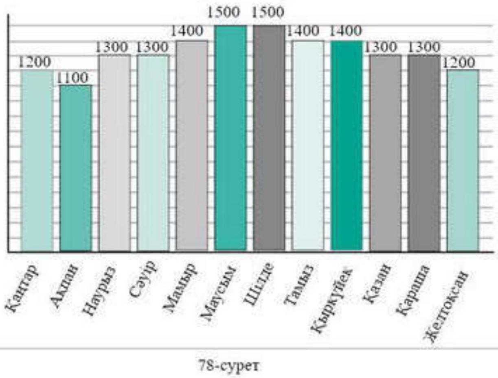

2018 жылдын III токсанында ендірілген енім I токсанмен салыстырғанда канша пайызға арткан?

## Жана білімді менгеруге дайындаламыз

29.33. Дүкенде алмұрттын 5 сұрыпы мен мандариннін 4 сұрыпы бар. 1 кт алмұрт пен 1 кг мандарин сатып алудын канша тәсілі бар?
29.34. Екі жәшікте 120 алма бар. Бірінші жәшіктен екінші жәшікке үш алма салынды. Нәтижесінде екінші жәшіктегі алма саны екі есе артык болды. Бастапкыда бірінші жәшікте канша алма болған?

## Жана білімді менгеруге арналған тірек ұғымдар

Жиын, ішкі жиын, орналастыругар, алмастыругар, теругер.

## ӨЗІНДІ ТЕКСЕР!

1. Шенбердегі нүктелердін ординатасының абсциссаға катынасын...
А) ... бұрыштын спнусы;
B) ...бұрыштын котангенсі;
C) ... бұрыштын тангенсі;
D) ... бұрыштын косннусы деп атайды.
2. $75^{\circ}$ бұрыш кай ширекте жатыр?
А) I ширек;
В) II шпрек;
C) III ширек;
D) IV ширек.
3. $\cos 30^{\circ}$-тын мәнін табындар.
A) $\frac{1}{2}$;
B) 1 ;
C) $\frac{\sqrt{3}}{2}$,
D) $\frac{1}{\sqrt{3}}$.
4. Радиусты кандай бұрышқа бұрғанда $80^{\circ}$-ка бұрған кездегі орнымен дәл келеді?
А) $180^{\circ}$;
В) $440^{\circ}$;
C) $380^{\circ}$;
D) $120^{\circ}$.
5. $4 \cos 90^{\circ}-8 \sin 60^{\circ}$ ернегінін мәнін табындар.
А) $-4 \sqrt{3}$;
В) $4-4 \sqrt{3}$;
C) 0 ;
D) -4 .
6. Сандардын кайсысы нелден кіші?
А) $\sin 140^{\circ}$;
В) $\cos 140^{\circ}$;
C) $\sin 50^{\circ}$;
D) $\cos 50^{\circ}$.
7. $\cos \left(-30^{\circ}\right)$ ернег інін мән ін табындар .
A) $\frac{\sqrt{3}}{2}$;
B) $-\frac{\sqrt{3}}{2}$,
C) $-\frac{1}{2}$;
D) $\frac{1}{2}$.
8. Erep $\sin \alpha<0, \cos \alpha>0$ болса, онда $\alpha$ бұрышы кай ширект ін бұрышы болып табылады ?
А) I ширек;
В) II ширек;
C) III ширек;
D) IV ширек.
9. $\sin 390^{\circ}-$ тын мәнін табындар.
A) $\frac{\sqrt{3}}{2}$;
B) $-\frac{\sqrt{3}}{2}$;
C) $-\frac{1}{2}$;
D) $\frac{1}{2}$.
10. Қай ернектін магынасы жок?
А) $\cos 0^{\circ}$;
B) $\operatorname{tg} 0^{\circ}$;
C) $\operatorname{ctg} 0^{\circ}$;
D) $\operatorname{ctg} 90^{\circ}$.
11. $\frac{3 \pi}{4}$ бұрышын градуспен ернектендер.
А) $30^{\circ}$;
B) $135^{\circ}$;
C) $\frac{3}{4}$;
D) $45^{\circ}$,
12. $200^{\circ}$ ернегін радианмен көрсетіндер.
А) $\frac{7 \pi}{9}$;
В) $\frac{10 \pi}{9}$;
C) $200 \pi$;
D) $2 \pi$
13. $\frac{10 \pi}{9}$ бұрышы кай ширекте орналаскан?
А) I шпректе;
B) II ширекте;
C) III ширекте;
D) IV ширекте.
14. $\sin \left(\frac{\pi}{2}+\alpha\right)$ ернегін ыкшамдандар.
A) $\sin \alpha$;
B) $\cos \alpha$;
C) $-\sin \alpha$;
D) $-\cos \alpha$.
15. $\operatorname{tg}\left(180^{\circ}-\alpha\right)$ ернегін $\alpha$ бұрышыныи тригонометриялык функциясымен ауыстырындар.
А) $\operatorname{tg} \alpha$;
B) $\operatorname{ctg} \alpha$;
C) $-\operatorname{tg} \alpha$;
D) $-\operatorname{ctg} \alpha$.
16. $\cos \frac{7 \pi}{6}$-нын мәнін есептендер.
A) $\frac{\sqrt{3}}{2}$;
B) $-\frac{\sqrt{3}}{2}$;
C) $-\frac{1}{2}$;
D) $\frac{1}{2}$.
17. $\cos 150^{\circ}$-тын мәнін есептендер.
A) $\frac{\sqrt{3}}{2}$;
B) $-\frac{\sqrt{3}}{2}$;
C) $-\frac{1}{2}$;
D) $\frac{1}{2}$.
18. $\cos ^{2}\left(360^{\circ}-x\right)+\cos ^{2}\left(270^{\circ}+x\right)$ ернегін ыкшамдандар.
A) $\frac{1}{2}$;
В) -1 ;
C) 1 ;
D) 0 .
19. Егер $\cos \alpha=\frac{4}{5}\left(0<\alpha<\frac{\pi}{2}\right)$ болса, онда $\operatorname{tg} 2$ α-ны табындар.
А) $-\frac{24}{7}$;
В) $\frac{24}{7}$;
C) $-\frac{24}{25}$;
D) $\frac{24}{25}$;
E) $\frac{25}{7}$.
20. Erep $\sin \alpha=-\frac{3}{5}$ ( $\pi<\alpha<\frac{3 \pi}{2}$ ) болса, онда $\operatorname{ctg} 2$ α-ны табындар.
A) $\frac{7}{24}$;
B) $\frac{24}{7}$;
C) $\frac{25}{24}$;
D) $\frac{24}{25}$;
E) $\frac{25}{7}$.
21. Erep $\sin \alpha=\frac{5}{13}\left(\frac{\pi}{2}<\alpha<\pi\right)$ болса, онда $\operatorname{tg} \alpha$-ны есептендер.
A) $-\frac{5}{12}$;
B) $\frac{5}{12}$,
C) $\frac{12}{13}$;
D) $-\frac{12}{13}$;
E) 5 .
22. Erep $\cos 2 \alpha=\frac{1}{4}$ болса, онда $\sin ^{2} 2 \alpha$-ны есептендер.
А) 0,75 ;
В) 0,9375 ;
C) 0,125 ;
D) 0,5 ;
E) $-0,725$.
23. Erep $\cos \alpha=\frac{1}{5}$ болса, онда $\frac{2 \sin \alpha+\sin 2 \alpha}{2 \sin \alpha-\sin 2 \alpha}$-ны есептендер.
А) 0,25 ;
В) 0,5 ;
C) 0,75 ;
D) 1,25 ;
E) 1,5 .
24. Erep $\operatorname{tg} \alpha=\frac{3}{5}$ болса, онда $\frac{\sin \alpha+\cos \alpha}{\sin \alpha-\cos \alpha}$-ны есептендер.
А) -2 ;
B) 2 ;
C) -4 ;
D) 4 ;
E) $\frac{4}{5}$.
25. $\frac{\sin 2 \alpha-\sin 3 \alpha+\sin 4 \alpha}{\cos 2 \alpha-\cos 3 \alpha+\cos 4 \alpha}$ ернегін ыкшамдандар.
A) $\operatorname{tg} \alpha$;
B) $\operatorname{ctg} \alpha$;
C) $\operatorname{tg} 2 \alpha$;
D) $\operatorname{tg} 3 \alpha$;
E) 1 .

## V тарау. ЫҚТИМАЛДЫҚТАР ТЕОРИЯСЫНЫҢ ЭЛЕМЕНТТЕРІ

## §30. ОКИҒА ЖЭНЕ ОНЫН ТУРЛЕРІ

| Түйінді ұғымдар |
| :--- |
| Окца, кездейсок окіна, аклкат оклга, мумки емес окига, этементар окита. колаїты наппжелер, тенмүмкінчікті окига, кара-ма-карсы окина |

Оқиға, кездейсоқ оқиға, ақиқат оқиға, мүмкін емес оқиға, элементар оқиға, қолайлы нәтижелер, теңмүмкіндікті және қарама-қарсы оқиғалар ұғымдарымен танысасыңдар;

элементар және элементар емес оқиғаларды ажыратуды үйренесіңдер.

Окига деп мағынасы бар, орындалатын немесе орындалмайтын кұбылысты айтады.

## МЫСАЛ

1. 2) Танертен жанбыр жауады; 2) тоғызыншы сынып окушылары алгебра пәнін окшцы; 3) шыршада алма еселі; 4) телефон соккан кезде абонемент бос болмады; 5) телефон стансысына тәулік боїы түскен конырау саны 1000 -нан асады.

Түрлі тәжірнбелер, бақылаулар және өлшемдер нәтсжелері окнғалар болып табылады.

## МЫСАЛ

2. 3) Тиынды лактырғанда "елтанба" жағымен түсуі;
2) тнынды лактырғанда "сан" жағымен түсуі.

Сына; немесе тажірибе дегеніміз карастырылатын окиғанын орындалатынын немесе орындалмайтынын білдіретін шарттар жиыны.

Шарттар жиыны кеп рет кайталанған кезде тәжірибетер жиынтыгы деп аталады.

Окиғаны белгілеу үшін $A, B, C$ және т.б. әріптері колданылады.
Окиғалар акикат окига, кездейсок окига және мумкін емес окига деп болінеді.

Окита
| Акикат окита | Кездейсок окнта | Мүмкін емес окиға |
| :--- | :--- | :--- |
| Тежірнбе барысында міндетті түрде орындалатын окнға акиқат окига деп аталады | Тәжірнбе барысында орындалатын немесе орындалмайтын окита кезоейсож окнга леп аталацы | Тәжірнбе барысында, ятнп берілген жағдайда орындалмайтын окита мумкін емес окиза деп аталады |

## МЫСАЛ

3. Кезде йсок окиғалардын, мысалы:
1) тнынды лақтыру барысында онын бір жағдайларда "елтанба" жағымен түсуі, кейбір жағдайларда "елтанба" жағымен түспеуі;
2) орындалуы ауа-райымен байланысты "танертен жанбыр жауады" окнғасы бір жағдайларда орындалады, кейбір жағдайларда орындалмайды.

Акикат окиғалардын, мысалы:

1) "тоғызыншы сынып окушылары алгебра пәнін окиды";
2) "күзден кейін кыс түседі".

Мүмкін емес окиғанын мысалы:

1) " 5 тг жазуы бар тпынды лактырғанда тнын 2 тр жазуы бар жағымен түседі";
2) "маусым айынан кейін кантар айы келеді".

Тәжірнбе нәтижесінде түрлі кездейсок окиғалар
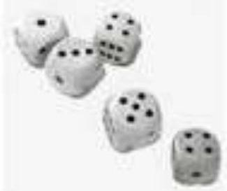
болуы мүмкін. "Ойын сүйегін лактырған кезде 4 саны түсті" кездейсок окиғасы элементар окиға болады, себебі оны бірнеше окиғаға белуге болмайды. "Ойын сүйегін лактырған кезде ұпайы так саны болды" окнғасы элементар окиға болмайды, сондыктан оны бірнеше окиғаға белуте болады. Яғни, "Ойын сүйегін лактырған кезде бір ұпай түсті", "Ойын сүйегін лактырған кезде үш ұпай түсті", "Ойын сүйегін лактырған кезде бес ұпай түсті" окнғаларына бөлуге болады.

Бірнеше жай окнгаларга белуге болмайтын окиға этементар окиза деп аталады.

Күтілетін окиғаны беретін тәжірнбе нәтижесі калайты нәтиже деп аталады.

## МЫСАЛ

4. Сыныпта 25 окушы бар. Олардын 17 -сі ер бала. $A$ окиғасы: "Кездейсок тандап алынған окушы - ер бала" болсын. Онда $A$ оқнғасының колайлы нәтижесі 17-ге тең.

Егер кандай да бір жныннан онын бір элементі тандалатын және баска элементтерімен салыстырғанда бірдей карастырылатын болса, онда жиынныи әрбір элементіне бірдей мүмкіндік туады (тен мүмкіндік принципі). Мұндай окиғалар тенмумкіндікті окигалар деп аталады.

Мүмкіндіктері бірдей болатын тәжірнбенін нәтижелері тенмумкіндікті натижетер деп аталады.

## МЫСАЛ

5. Тенмүмкіндікті нәтижелер:
$A$ : "Ойын сүйегін лактырғанда 1 цифры түсті";
$B$ : "Ойын сүйегін лактырғанда 2 шифры түсті";
$C$ : "Ойын сүйегін лактырганда 3 шфры түсті";
$D$ : "Ойын сүйегін лактырғанда 4 цифры түсті";
$E$ : "Ойын сүйегін лактырғанда 5 цифры түсті";
$F$ : "Ойын сүйегін лактырганда 6 шифры түсті".
$A$ окиғасы орындалмағанда ғана орындалатын $\bar{A}$ окиғасы $A$ ожигасына карама-карсы окига деп аталады.

## МЫСАЛ

6. Өзара карама-карсы окиғалар:
"Ату барысында нысанаға тигізу" және "Ату барысында нысанаға тпізе алмау".
"Жүйенін барлык элементтерінін жұмыс аткаруы" және "Жүйе элементтерінін ен болмағанда біреуінін жумыс жасамауы".
"Тиыннын "елтанба" жағымен түсуі" және "Тиыннын "сан" жағымен түсуі".

Тәжірнбе барысында жасыл, сары және көк шарлары бар жәшіктен "Кек шардын алынуы" окиғасы "Сары немесе жасыл шардын ен болмағанда біреуінін алынуы" окиғасына карама-карсы болады.

Акикат окнғанын белгіленуі: $U$. Мүмкін емес окиғанын белгіленуі: $V$.

$$
\bar{U}=V, \bar{V}=U .
$$

1. Кездейсок окцалардыи мысалын келтіріндер.
2. "Тиынныи "елтанба" жағымен тусуі" және "Тпыннын "сан" жағымен түсуі" окиғалары тенмүмкіндікті оклгалар бола ма?
3. "Опын сүйегін лактырған кезле ұпайы жұп саны болшы" окнғасы элементар окна бола ма?
4. "Ойын сүйегін лактырған кезле ұпайы жұп саны болжы" окиғасына карама-карсы окцины атандар.

## Жаттығулар

## A

30.1. "9-сынып окушылары арасынан кездейсок тандап алынған окушы: 1) ер бала"; 2) жасы 14-ке тен"; 3) жасы 14 айға тен"; 4) 5 жастан үлкен" окиғасы кандай окита (мүмкін емес, акикат немесе кездейсок) болады?
30.2. "Бүгін қалада барометр калыпты атмосфералык кысымды көрсетіп тұр және

1) шәйнектегі су $t=70^{\circ} \mathrm{C}$ температурасында кайнады ";
2) температура $-9^{\circ}$ С-ка темендегенде шалшыктағы су катты" окнғасы кандай окнға (мүмкін емес, акнкат немесе кездейсок) болады?
30.3 ."Үшбұрыштын кабырларының ұзындыктары өлшенді. Сонда әр кабырғасынын ұзындығы калған екі кабырғанын ұзындыктарыныи косындысының мәнінен кем болып шыкты" окиғасы кандай окиға (мүмкін емес, акикат немесе кездейсок) болады?
30.4. Екі ойын сүйегі лактырылғанда:
3) "біріншісінде 2 цифры, екіншісінде 5 цифры түсті";
4) "екі ойын сүйегінде түскен ұпайлар санынын косындысы 1-ге тен";
5) "екі ойын сүйегінде түскен ұпайлар санынын косындысы 13-ке тен";
6) "екі ойын сүйегінде түскен ұпайлар санынын косындысы 14 -тен кем" окнғасы (мүмкін емес, акикат немесе кездейсок) кандай окнға болады?
30.5. Қазак тілі окулыпынын кездейсок бір беті ашылады және сол жак бетінде екінші сөз алынады. Алынған сөз:
7) "Ә" немесе "Н";
8) "ѣ" әрпімен басталады окиғасы кандай окиға (мүмкін емес, акикат немесе кездейсок) болады?
30.6. Өзара карама-қарсы окщаларға мысалдар келтіріндер.

## B

30.7. Берілген окцға элементар окиға бола ма? Егер болмаса, онда оны жай окнғаларға жіктендер:

1) $A$ окиғасы - кездейсок кұрастырылған квадрат тендеудін накты түбірлері бар;
2) $B$ окиғасы - квадрат тендеудін дискримннанты теріс сан.
30.8. $A$ окиғасы - кездейсок алынған $y=f(x)$ функшиясы $R$ жнынында бірсарынды еседі; $B$ окиғасы - $f(56)<f(57)$. Берілген $A$ және $B$ окнғалары тенмүмкіндікті окцалар бола ма?
30.9.1) Бір тнынды лактыру;
3) ойын сүйегін лактыру;
4) екі тнынды лактыру нәтижесінде орындалатын барлык мүмкін болатын окнғаларды атандар.
30.10. Берілген окнғаға карама-карсы окнғаны атандар:
5) менін парталасымнын есімі Әлібек те емес, Азамат та емес;
6) сайлауға бару $82 \%$-дан $93 \%$-ға дейін артты;
7) бакылау жұмысында бес тапсырманын кем дегенде екеуі орындалмады.
30.11. Берілген окнғаға карама-карсы окиғаны атандар:
8) тыын лактыру барысында сан жағымен түсті;
9) ойын сүйегін лактырғанда 4 шифры түсті;
10) 3 ак және 6 кызыл шар жаткан жәшіктен кездейсок алынған шардын түсі кызыл болды;
11) ойын сүйегін лактырғанда 4 ұпайынан кем ұпай түсті;
12) кездейсок аталган сан 7 санынан кем;
13) 5 рет ату барысында ен болмағанда біреуі нысанаға тщі.

## C

30.12. Ойын сүйегін лактыру барысында так ұпай саны түсті. Осы окиға элементар окнға бола ма? Осы оқиғаны жай окиғаларға жіктендер.
30.13. $A$ окцасы - ойын сүйегін лактырғанда 2 цифры түсті,
$B$ окнғасы - ойын сүйегін лактырғанда 4 цифры түсті,
$C$ окиғасы - ойын сүйегін лактырғанда 6 цифры түсті,
$D$ окнғасы - тиынды нактырғанда сан жағымен түсті,
$E$ окнғасы - тнынды лактырғанда "елтанба" жағымен түсті.
Осы окнғалар арасынан тенмүмк індікті окиғаларды атандар.

## ҚАЙТАЛАУ

30.14. Өрнекті ыкшамдандар:

1) $\left(1+\frac{x}{\sqrt{1+x^{2}}}\right)\left(\sqrt{1+x^{2}}-x\right)$;
2) $\left(\frac{1}{a-\sqrt{x}}+\frac{1}{a+\sqrt{x}}\right): \frac{a}{a^{2}-x}$.
30.15. Тенсіздікті шешіндер:
3) $\frac{x}{x+1} \leqslant \frac{2}{x-1}$.
4) $\frac{2 x}{x+2}-1 \geqslant \frac{2}{x-2}$.
30.16. 1) Егер екі саннын бірі $30 \%$-ға, екіншісі $20 \%$-ға арттырылса, онда осы екі саннын көбейтіндісінін мәні канша пайызға артады?
5) Егер екі саннын бірі $25 \%$-ға, екіншісі $40 \%$-ға кемітілсе, онда осы екі санныи кебейтіндісінін мәні канша пайызга кемиді?
6) Егер белшектін алымы $40 \%$-ға, белімі $20 \%$-ға кемітілсе, онда бөлшек қанша пайызға кемиді?
7) Егер екі саннын бірі $50 \%$-ға кемітіліп, екіншісі $20 \%$-ға арттырылса, онда осы екі саннын көбеїтіндісінін мәні канша пайызга кемиді?
30.17. $y=x^{2}-a x+4$ функшясыныи графигі $M(-1 ; 3)$ нуктесі аркылы өтеді. Функииянын графигін салындар және ен кіші мәнін табындар.
30.18. Диаграммада дүкендегі гүлдердін саны керсетілген (79-сурет). Егер дүкенде 900 тал гүл және калампыр гүлдерінін саны кашкаргүлдін санынан бүтін санта есе артык болса, онда дүкенде калампыр гүлінін саны канша?

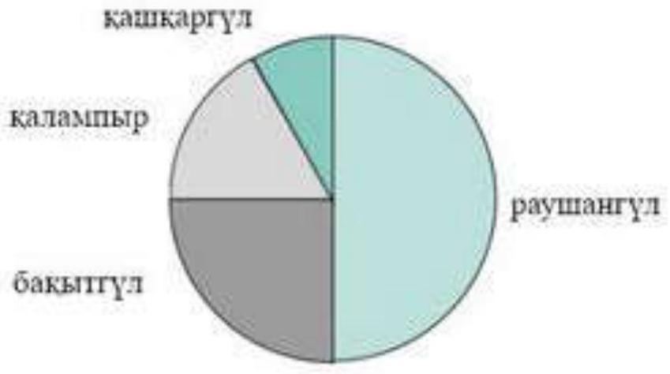
79-cyper

## Жана білімді менгеруге дайындаламыз

30.19. Ойын сүйегін лактырғанда: 1) жұп; 2) так; 3) 3-тен артык сан түссе, онда осы окнғаға кандай элементар окнғалар сәйкес болады?

## Жана білімді менгеруге дайындаламыз

30.20. Erep белшектін алымына ( $2 ; 6$ ) ннтервалына тністі натурал сандар, беліміне $(5 ; 8)$ интервалына тністі нагурал сандар алынатын болса, онда бірнеше дұрыс жай белшек кұрастырындар.

## Жана білімді менгеруге арналған тірек ұғымдар

Оқига, элементар окига, тенмумкіндікті нэпижетер, котайты нәтижетер, алмастыругар, орналастыругар, теругер,

## §31. ЫКТИМАЛДЫКТЫН КЛАССИКАЛЫК АНЫКТАМАСЫ. СТАТИСТИКАЛЫҚ ЫКТИМАЛДЫК

## Түйінді ұғымдар

Ыктималнык

Сендер ықтималдықтың классикалық анықтамасымен және статистикалық анықтамасымен танысасындар; есептерді шығару барысында ықтималдықтың классикалық анықтамасын және статистикалық анықтамасын қолдануды үйренесіңдер.

Жаппай кұбылыстарда окиғаны аныктай білуді математиканын ыктималдыктар теорнясы белімі карастырады. Ол түрлі процестер мен кұбылыстарды талдау барысында колданылады, біртекті жаппай кубылыстарға жүгінетін сандык зандылыктарды зерделейді.

Практикалык кызметте окнғаларды олардын орындалу мүмкіндігіне карай салыстыра білу керек. Мысалы, өзенде шортан мен менке балыктары жүзіп жүр. "Шортан кармакка ілінді" окцғасы мен "Менке балык қармакка ілінді" окиғасынын орындалу мүмкіндігі әргүрлі. Сондыктан окиғаларды салыстыру үшін олардын сандык шамасын аныктау керек.

Окиганын орындалу мүмкіндігінін сандык шамасы ыктималдык болып табылады. Ыктималдыктын классикалык және статистикалык аныктамалары кен таралған.

Ыктималдыктын классикалык аныктамасы тек кана тенмүмкіндікті окнғалар үшін колданы лады.

А окигасыныи ықтимальызы деп тенмүмкіндік жағдайында $m$ колайлы нәтижелер санынын $n$ жалпы нәтижелер санына катынасын айтады.

Ыктималдык $P$ әрпімен белгіленеді.
("probabilite" француз сөзінен алынған "мүмкіндік, ыктмалдык" деген мағынаны береді).
$A$ окнасынын ыктмалдығы $P(A)$ деп белгіленеді .
$A$ окиғасыныи ыктималдығы:
$P(A)=\frac{m}{n}$, мұндағы $m$ - колайлы нәпгжелер саны, $n$ - жалпы нәтижелер саны, формуласымен есептеледі.

## МЫСАЛ

1. A окиғасы - "тныннын сан жағымен түсуі" және $B$ окцасы - "тиыннын "елтанба" жағымен түсуі". Осы окнғалардын ықтимацығынын жазылуы: $P(A)=0,5, P(B)=0,5$, немесе $P(A)=50 \%$, $P(B)=50 \%$.

## ТУСІНДІРІҢДЕР

Неліктен $A$ окиғасының ыктималдығы нел мен бірдін арасында орналаскан: $0 \mathrm{~m} P(A) \mathrm{m} 1$ ?

## МЫСАЛ

2. $X$ окиғасы - "Ойын сүйегін лактырғанда жай сандардын түсуінін саны". $X$ окиғасынын ыктималдығын табайык.

Шеиці: $X$ окнғасынын ыктималдығын табу үшін $P(X)=\frac{m}{n}$ (мұндағы $m$ - колайлы нәтижелер саны, $n$ - жалпы нәтижелер саны) формуласын колданамыз.

Барлык ұпайлар $1 ; 2 ; 3 ; 4 ; 5 ; 6$. Демек, $n=6$.
$1 ; 2 ; 3 ; 4 ; 5 ; 6$ сандарынын арасынан жай сандар $2 ; 3 ; 5$, онда $m=3$. Сондыктан $P(X)=\frac{3}{6}=0,5$.

Жауабы: 0,5.

## Ыктималдыктар касиеттері

1-касиет. Егер тәжірнбенін барлык нәтижесі берілген окиғанын пайда болуына колайлы болса, онда бұл окиға міндетті түрде орындалады. Мұндай окиға акикат окига деп аталады және онын ыктималдығы 1-ге тен.

108

2-касиет. Егер тәжірибенін ешкандай нәтижесі берілген окнғанын пайда болуына колайлы болмаса, онда бұл окиға тәжірнбе нәтижесінде орындалмайлы. Мұндай окнға мумкін емес окига деп аталады және онын ыктималдығы 0-ге тен.

3-касиет. Толык топты кұрайтын оқнғаның ыктималдығы 1 -ге тең.

4-касиет. Берілген окиғаға карама-карсы окиғаның орындалу ыктималдығы берілген окиғанын ыктималдығына ұксас есептеледі. Қарама-карсы окнғанын ыктималдығы 1 мен берілген окиға ықтималдығыныи айырмасына тен.

А окигасынын статистикатык ықтиматдызы деп жүргізілген $n$ тәжірнбе барысында окиғанын орындалуынын салыстырмалы жнілігін айтады.
$A$ окиғасынын салыстырмалы ыктималығы $-P(A)=w(A)= =\frac{m}{n}$ формуласымен есептеледі. Мұнағы $w(A)-A$ окиғасынын салыстырмалы жнілігі; $m-A$ окі ғасы орындалған тәжірнбелер саны, $n$ - тәжірнбелердін жалпы саны.

## МЫСАЛ

3. Туылған 500 баланын 240 қыз бала. Қыз балалардын тууынын жнілігін табайық.

Шешуі. $w(A)=\frac{240}{500}=0,48$.
Жауабы : 0,48.

1. Окиганыи жнілігі: 1) теріс сан; 2) 2 санынан артык болуы мүмкін $б е$ ?
2. Окиганыи: 1) акикат; 2) мумкін емес; 3) екі окиғанын теимүмкіндікті болуынын ыктималдығы кандай?

## Жаттығудар

## A

31.1. Ойын сүйегін лактырған кезде 1-ден 6-га дейінгі сандар түседі.

Темендегі окиғалардын ыктималдыктарын табындар:

1) 2 саныныи түсуі; 2) 1 немесе 2 саныныи түсуі;
2) 4 немесе 6 санынын түсуі; 4) жұп саннын түсуі.
31.2. а) Қорапшада 2 ак және 5 кызыл шар бар. Корапшадан кездейсок алынған бір шардын: 1) ак; 2) кызыл; 3) жасыл болуыныи ыктималдығын табындар.
ә) Корапшада 4 кызыл және 7 кек шар бар. Корапшадан кездейсок алынған бір шардын: 1) кызыл; 2) ак емес; 3) көк болуынын ыктималдығын табындар.
31.3. Тәжірнбе: ойын сүйегі лактырылды. $A, B$, және $C$ окиғаларын карастырайык, $A=\{$ ойын сүйегінін жоғарғы жағындағы сан 12-ге белінеді $\}, B=\{$ ойын сүйегінін жоғарғы жағындағы сан 2-ге тец\}, $C=\{$ ойын сүйегінін жогарғы жағындағы сан 2-ге белінеді\}. Төмендегі тендіктердін кайсысы дұрыс? Жауаптарынды түсіндіріндер:
3) $P(A)=1$;
4) $P(A)=0$;
з) $P(C)=0,5$;
5) $P(\bar{B})=\frac{5}{6}$;
6) $P(B)=\frac{1}{6}$.
31.4 , 1) Сыныпта 25 окушы бар. Олардын ішінде 5 окушы "өте жаксы", 12 окушы "жақсы", 6 окушы "канағаттанарлык" деген бағаға окиды, ал 2 окушынын үлгерімі "темен". Сыныптан кездейсок тандап алынған окушынын үлгерімі "өте жаксы" немесе "жаксы" болуынын ыктималдығын табындар.
7) 25 емтихан билетінін ішінде 5 "женіл" билет бар. Екі окушы кезекпен бір билеттен алады. Бірінші окушының "женіл" билетті алуының ыктималдығын табындар.
31.5. Ойын сүйегі лактырылды.
8) 3 немесе 5 саныныи түсуінін; 2) 6 немесе 5 санынын түсуінін;
9) 7 санынын түсуінің ыктималдыктарын табындар.

## B

31.6. Екі ойын сүйегі лактырылды. Түскен сандардын көбейтіндісінін мәні 5 санына тен болуынын ыктималдығын табындар.
31.7. 1) Бір тнын екі рет лактырылды. Ен болмаса бір рет "елтанба" түсуінін ыктималдығын табындар.
2) Үш тиын лактырылды. Екі рет "елтанба" түсуінін ыктималдығын табындар.
31.8. Емпиханға 1-ден 25-ке дейін немірленген билеттер дайындалған. Бір окушыныи кездейсок алған билетінін немірі: 1) біртанбалы сан; 2) екітанбалы сан болуынын ыктималдығын табындар.
31.9. Кездейсок екітанбалы сан тандап алынды. Темендегі окиғалардын ыктималдыктарын табындар:

1) Алынған сан 0-мен аякталады; 2) алынған сан бірдей шифрлардан кұралған; 3) алынган сан 27 -ден артык, 46-дан кем; 4) алынған сан бүтін санныи квадраты болады.
31.10. Төменде берілген окиғалардын орындалу жніліктерін табындар:
2) сатып алынған 5 лотереялык билеттін біреуі ұтыс билеті болып табылады;
3) сатып алынған 100 лотереялык бшлеттін тертеуі ұтыс билеті болып табылады;
4) атылған 20 октын алтауы нысанаға тиді;
5) 30 күннін ішінде 12 күн ашык болды.

## C

31.11. Нысанаға 160 рет ок атылды. Октын нысанаға тимеуінін статистикалык ыктималдығы 0,3 . Нысанаға тигізу санын табындар.
31.12. $\sqrt{n-10}$ өрнегі берілген. $n$ айнымалысынын мәні 1 -ден 99 -ға дейінгі натурал сандар арасынан кездейсок тандалады. Өрнектін мәні:

1) аныкталмауынын; 2) 10 -нан кіші болуынын; 3) $[1 ; 6]$ кесіндісіне тпісті болуынын ыктималығын табындар.
31.13. 1) $(-1 ; 6)$ интервалынан бүтін сан кездейсок тандалады. Осы сан $x^{3}-5 x^{2}+6 x=0$ тендеуінін түбірі болуынын ыктималдығын табындар.
2) ( -2 ; 6) интервалынан бүтін сан кездейсок тандалады. Осы сан $x^{3}-x^{2}-6 x=0$ тендеуінін түбірі болуынын ыктималдығын табындар.
3) $[-1 ; 10]$ кесіндісінен бүтін сан кездейсок тандалады. Осы сан $x^{2}-5 x-6<0$ тенсіздігінін шешімі болуынын ыктималығын табындар.
4) $[-1 ; 10]$ кесіндісінен бүтін сан кездейсок тандалады. Осы сан $x^{2}-5 x-6$ m0 тенсіздігінін шешімі болуынын ыктималдығын табындар.
31.14. Ыктималдыктар теорнясы бойынша кыскаша хабарлама дайындандар.

## ҒАЛЫМ-МАТЕМАТИКТЕР ТУРАЛЫ ХАБАРЛАМА ДАЙЫНДАҢДАР

31.15. Ыктпмалыктар теориясын калыптастырған француз ғалымы Пьер-Симон Лаплас туралы хабарлама дайындандар. Ыктималдыктар теориясының негізгі ұғымдарын енгізген француз математигі Блез Паскаль туралы хабарлама дайындандар.

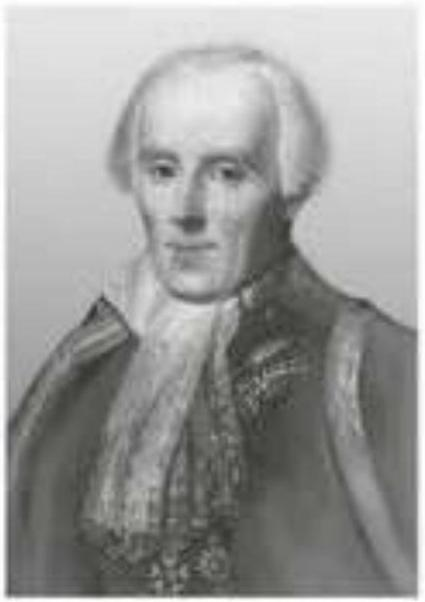
Пьер-Симон Лаплас (1749-1827)

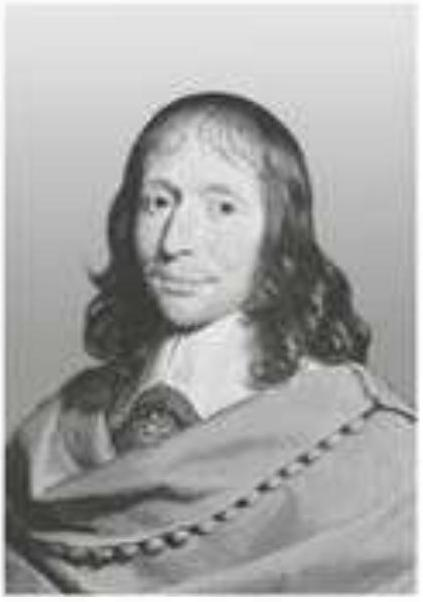
Блез Паскаль (1623-1662)

## ҚАЙТАЛАУ

31.16. Өрнектін мәнін табындар:

1) $\frac{\operatorname{tg} 30^{\circ}+\cos \frac{\pi}{6}}{\sin \frac{\pi}{2}-4 \operatorname{ctg} 135^{\circ}}$;
2) $\frac{\sqrt{2} \sin 45^{\circ}+\sqrt{2} \cos \frac{\pi}{4}}{5 \operatorname{tg} \frac{3 \pi}{4}-3 \operatorname{ctg} \frac{\pi}{4}}$.
31.17. Тендеудін графигін салындар:
3) $\frac{y-x^{2}+3 x}{x^{2}-4}=0$;
4) $\frac{y-\sqrt{x+2}}{x^{2}-1}=0$.
31.18. Сандар тізбегінін зандылығын табындар:
5) $-1 ; 2 ; 7 ; 14 ; 23 ; \ldots$;
6) $4 ; 7 ; 12 ; 19 ; 28 ; \ldots$.
31.19. 1) Ннфузорня жәндігі 2 белікке беліну аркылы көбейеді. 6 рет беліну барысында ннфузория жәндіктерінін саны 320 болды. Алғашқыда жәндіктердін саны канша болған?
7) Дене 62 м бпіктіктен кұлады. Бірінші секундта дене 2 м темен түсті, әр келесі минутта алдынғысына карағанда 2 есе артык түсе бастады. Дене канша секундта жерге түсті?

## АСПАЗ МАМАНДЫғЫНДАҒЫ МАТЕМАТИКА

31.20. $16 \%$-ды 200 г мерекелік сусын алу үшін канша майлылығы $10 \%$ сүт және майлылығы $30 \%$ пломбир алу керек?

## Жана білімді менгеруге дайындаламыз

31.21. 1) Кабырғасынын ұзындығы 6 см тенкабырғалы үшбұрышка дөнгелек іштей салынған. Денгелек ауданынын үшбұрыш ауданына катынасын табындар.
2) Қабырғасының ұзындығы 8 см шаршыға дөнгелек іштей салынған. Денгелек ауданынын шаршы ауданына катынасын табындар.
31.22. Берілген тенсіздіктін шешімі болатын сандардан тұратын интервалдын ұзындығын табындар:

1) $x^{2}+2 x-8<0$;
2) $x^{2}-3 x-10<0$;
з) $x^{2}-6 x-2<0$;
3) $x^{2}+12 x-4<0$.

## Жана білімді менгеруге арналған тірек ұғымдар

Окига, этементар окига, тенмумкіндікті натижетер, колайты натижетер, алмастыругар, орнатастыругар, теругер.

## §32. ГЕОМЕТРИЯЛЫК ЫКТИМАЛДЫК

## Түйінді уғымдар

Ыктнмаллык. геометриялык ыктимачнык

Есептерді шығару барысында теометриялық ықтималдықты қолдануды үйренесіндер.

Класспкалык және статистикалык ыктималдыктармен катар практикада геометриялык ыктималдык колданылады. Классикалык ыктимадык нәтижелер тенмүмкіндікті болғанда ғана колданылатынын және нәтижелер саны шектеулі болатынын білесіндер. Статистикалык ыктималдыкты колдану тәжірибелер жүргізуді кажет

етеді. Мүмкін нәтижелер саны шексіз болған жағдайда геометрнялык ыктималдық кодцанылады.

Геометрнялык ыктималдык -нүктенін кесіндіге, жазыктык пен кеністік фигураларынын белігіне түсу ыктималдығы.

## МЫСАЛ

1. Жазыктыкта кандай да бір $D$ фигурасы және $D$ фигурасынын бір белігі болатын $E$ геометрнялык фигурасы берілсін (80-сурет).

Тәжірибе барысында $D$ фигурасына тиісті кездейсок нүкте тандалсын. Осы нүктенін $E$ фигурасына тиісті болу ыктималдығын табу керек.

Шешуі . Тандалған нүкте $D$ фигурасынын кез келген жерінен алынуы мүмкін. Бірақ алынған нүктенін $E$ фигурасына тиісті болу ыктималдығы осы фигуранын ауданына тура пропорционал және онын пішініне тәуелді емес.
$A$ окнғасынын ыктималдығы, яғни алынған нүктенін $E$ фигурасына тністі болуы:

$$
P(A)=\frac{S(E)}{S(D)}
$$

(мұндағы $S(E)-E$ фигурасынын ауданы, $S(D)-D$ фигурасынын ауданы) формуласынан аныкталады және $E$ фигурасы толығымен $D$ фи-
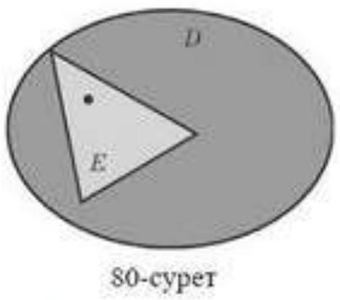 гурасында жатуы геометриялык ыктималдыкты береді.

Ауданы $S_{1}$ болатын фигура ауданы $S_{2}$-ге тен фигураныи ішкі жныны болсын. $A$ окиғасы "лактырылған дене ауданы $S_{1}$ фигураға түседі". Онда $A$ окнғасынын ыктпмалдығы:

$$
P(A)=\frac{S_{1}}{S_{2}} .
$$

## Дмсал

2. Қабырғасынын ұзындығы 4 см шаршыға раднусы 2 см денгелек іштей сызылған. Шаршыда кездейсок белгіленген нүктенін денгелекке тиісті болуынын ыктималдығын табайык.

Шешуі. Геометриялык ыктнмалдыктын аныктамасы бойынша ізделінді ыктималдык денгелектін ауданыныи шаршы ауданына катынасына тен, яғніл

$$
P(A)=\frac{S_{i}}{S_{i}}=\frac{4 \pi}{16}=\frac{\pi}{4}=\frac{3,14}{4}=0,785 .
$$

## МЫСАЛ

3. Тебелері ( $0 ; 0$ ), ( $0 ; 1$ ), ( $1 ; 1$ ), ( $1 ; 0$ ) нүктелері болатын квадраттан кездейсок ( $x ; y$ ) нүктесі алынған. Осы нүкте кооршнаталарынын $y<2 x$ тенсіздігін канағаттандыру ыктималығын табайык.

Шешу $i$. Берілген шарттарды колданып, шаршы мен $y=2 x$ түзуін саламыз (81-сурет).

Тебелері $(0 ; 0),(0 ; 1),(1 ; 1),(1 ; 0)$ нүктелері болатын квадраттан алынған нүктенін $y<2 x$ тенсіздігін канағаттандыруы үшін оны шаршыныи $y=2 x$ түзуінен темен жаткан белігінен, яғни $F$ фигурасынан алу керек (81-cyper).

$$
P(A)=\frac{S(F)}{S(E)}
$$

(мұндағы $S(F)-F$ фигурасынын ауданы, $S(E)$ - шаршынын ауданы) формуласын колданамыв:

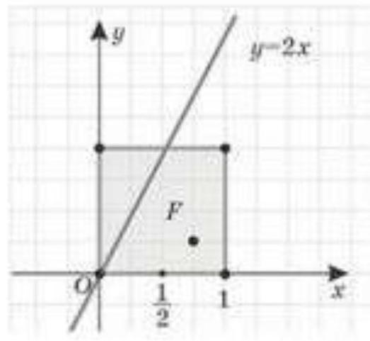
81-cyper

$S(E)=1$ және $S(F)=S(E)-\frac{1}{2} \cdot \frac{1}{2} \cdot 1= =1-\frac{1}{2}=\frac{3}{4}$. Сонда, $P(A)=\frac{3}{4}$.

Жауабы: $\frac{3}{4}$.
$A$ окиғасынын геометриялык ыктмацыны, яғни алынған нүктенін $F E$ кесіндісіне тиісті болуы

$$
P(A)=\frac{l(F E)}{l(M N)}
$$

формуласынан аныкталады (мұндағы $l(M N)$ канд ай да бір $M N$ кесіндісінін ұзындығы, $l(F E)$ - кандай да бір $F E$ кесіндісінің ұзын-

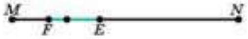
82-cyper

тністі болуы береді (82-cyper).

Ұзындығы $l$ болатын кесінді ұзындығы $L$-ге тен кесіндіге тиісті. $A$ окнғасы - "кездейсок алынған нүкте ұзындығы $l$ кесіндіде белгіленген". Онда А окиғасынын ыктмалдығы;

$$
P(A)=\frac{l}{L}
$$

## МЫСАЛ

4. Ұзындығы 15 см $A D$ кесіндісінде $X$ нүктесі белгіленген. $X$ нүктесінін $A$ нүктесінен 7 см-ден артык және D нүктесінен 11 см-ден артык емес кашыктыкта орналасуынын ыктпмалдығын табындар.

Шешуі: Есептін шартын суретпен көрсетейік (83-сурет). Шарт бойынша $A C=7 \mathrm{~cm}, B D=11 \mathrm{~cm}$.

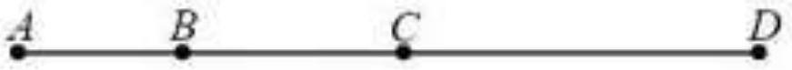
83-cyper

Онда $X$ нүктесі $B C$ кесіндісіне тиісті: $7+11-15=3$ (см).
Демек, $P(A)=\frac{B C}{A D}=\frac{3}{15}=\frac{1}{5}=0,2$.
Жауабы : 0,2.

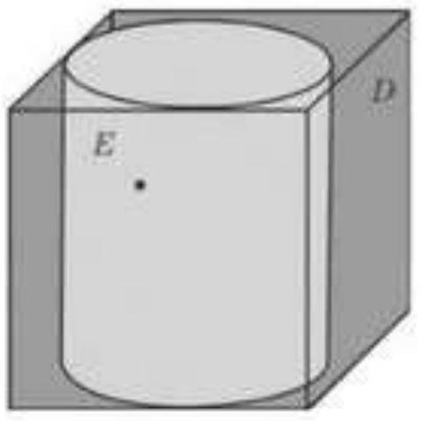
84-cyper

$A$ окнғасынын геометрнялык ыкпма лдығы, ягни алынған нүктенін $E$ денесіне тпісті болуы

$$
P(A)=\frac{V(E)}{V(D)}
$$

(мүндағы $V(E)-E$ денесінін көлемі, $V(D)-D$ денесінін көлемі) формуласынан табылады және $E$ денесінін толығымен $D$ денесіне тиісті болуы геометриялык ыкималькты береді (84-сурет).

## МЫСАЛ

5. Өлшемдері $4 \mathrm{~cm}, 8 \mathrm{~cm}, 16 \mathrm{~cm}$ тікоррышты параллелепипедке кабырғасынын ұзындығы 4 см тен куб іштей салынған. Тікбұрышты параллелепипедтен кездейсок алынған $X$ нүктесі кубтын ішінде болуыныи ыктималдығын табындар.

Шешуі: Кубтын көлемі $64 \mathrm{~cm}^{3}$, тікбұрышты параллелепипедтін келемі $512 \mathrm{~cm}^{3}$. Демек, $P(A)=\frac{V_{k}}{V_{n}}=\frac{64}{512}=\frac{1}{8}=0,125$.

Жауабы: 0.125.

## ТУСІНДІРІҢДЕР

Неліктен геометриялык ыктималдыкты табуга берілген жағдайлардын бәрін бір ғана $P(A)=\frac{m_{E}\left(F_{1}\right)}{m_{E}(F)}$, мундағы $F_{1} \subset F, m_{E}\left(F_{1}\right)$ және $m_{E}(F)$ геометриялык шамалар (ұзындык, аудан, көлем) формуласымен беруге болатынын түсіндіріндер.

1. Қандай окиғалар үйлесімді деп аталады?
2. Қандай жағдайца геометриялык ыктималык: 1) 0 ; 2) 1 санына тен болады?

## Жаттығулар

## A

32.1. Үстелге ойын сүйегі лактырыцы.

1) Ойын сүйегінде 4 ұпайдын; 2) ойын сүйегінде жұп санды ұпайдын түсу ыктималдығын табындар.
32.2. ¥зындығы 1 см болатын кесінді бойынан кездейсок алынған нүктеден кесінді ұштарына дейінгі кашыкты $\frac{1}{4}$-ден аспауынын ыктималынын табындар.
32.3. Қабыргасынын ұзындығы 2 см болатын квадраттан кездейсок A нүктесі алынды. Осы квадратка кабырғасынын ұзындығы 1 см болатын екінші квадрат іштей салынған. Алынған нүктенін екінші квадратка тиісті болуынын ыкпмалығын табындар.
32.4. Қабырғасынын ұзындығы 2 см квадраттан кездейсок $A$ нүктесі алынды. Осы квадратка кабырғасынын ұзындығы 1 см болатын екінші квадрат іштей салынған. Алынған нүктенін екінші квадратка тпісті болмауынын ыктималығын табындар.
32.5. Раднусы 2 см денгелектен кездейсок $B$ нүктесі алынды. Осы денгелекке радиусы 1 см болатын денгелек іштей салынған. $B$ нүктесінін іштей салынған денгелекке тиісті болуынын ыктималдығын табындар.
32.6. Раднусы 2 см денгелектен кездейсок $B$ нүктесі алынды. Осы денгелекке радиусы 1 см болатын денгелек іштей салынған. $B$ нүктесінін іштей салынган денгелекке тпісті болмауынын ыкпиалдығын табындар.
32.7. Раднусы 3 см шардан кездейсок $B$ нүктесі алынды. Осы шарға радпусы 2 см болатын шар іштей салынған. $B$ нүктесінін іштей салынған шарға тністі болуынын ыктималдығын табындар.
32.8. Раднусы 3 см шардан кездейсок $B$ нүктесі алынды. Осы шарға радпусы 2 см болатын шар іштей салынған. $\quad B$ нүктесінін іштей салынған шарға тністі болмауының ыктималығын табында р.

## B

32.9. Ұзындығы 12 см $A B$ кесіндісінен кездейсок $C$ нүктесі алынды. $A C$ кесіндісіне салынған шаршыныи ауданы $36 \mathrm{~cm}^{2}$ мен $81 \mathrm{~cm}^{2}$ аралығында болуынын ыктималдығын табындар.
32.10. 1) $[1 ; 10]$ кесіндісінен сан кездейсок тандалады. Осы сан $x^{2}-5 x+6<0$ тенсіздігінін шешімі болуынын ыктималығын табындар.
2) $[1 ; 10]$ кесіндісінен сан кездейсок тандалады. Осы сан $x^{2}-5 x-6$ m0 тенсіздігініи шешімі болуының ықтималығын табындар.
32.11. 1) Қабырғасының ұзындығы 1 см шаршыда $A$ нүктесі белгіленген. $A$ нүктесінен шаршынын кабыргасына дейінгі аракашыктык $\frac{1}{3}$-ден артык болмауынын ыктималдығын табындар.
2) Қабырғасынын ұзындығы 1 см шаршыда $A$ нүктесі белгіленген. А нүктесінен шаршынын центріне дейінгі аракашыктык $\frac{1}{3}$-ден артык болмауынын ыктималдығын табындар.
3) Қабырғасынын ұзындығы 1 см шаршыда $A$ нүктесі белгіленген. А нүктесінен шаршынын көрсетілген тебесіне дейінгі аракашыктыктын $\frac{1}{4}$-ден артык болмауынын ыктималдығын табындар.
32.12. Коордннаталык жазыктыкка раднустары 5 см және 10 см болатын центрі ортак екі шенбер салынған. Үлкен дентелектен кездейсок алынған нүктенін екі шенбердін кнылысуынан пайда болған сакинаға тністі болуынын ыктималдығын табындар.

## C

32.13. Кубка шар іштей салынған. Кубтан кездейсок алынған нүктенін шарға пиісті болуынын ықтпмалдығын табындар.
*32.14. Шарға куб іштей салынған. Шардан кездейсок алынған нуктенін кубка ппісті болуынын ық тпмалдығын табындар.
*32.15. Кубка шар іштей салынған. Кубтан кездейсок алынған нүктенің шарға тиісті болмауынын ыктималдығын табыцдар.

## ҒАЛЫМ-МАТЕМАТИКТЕР ТУРАЛЫ ХАБАРЛАМА ДАЙЫНДАҢДАР

32.16. ÜkòèiàëäûKỏàð òâioèyñû ғûëû dåòiiăả ìòà ғàñûðĕàdaà raéeàà åiĕäû.

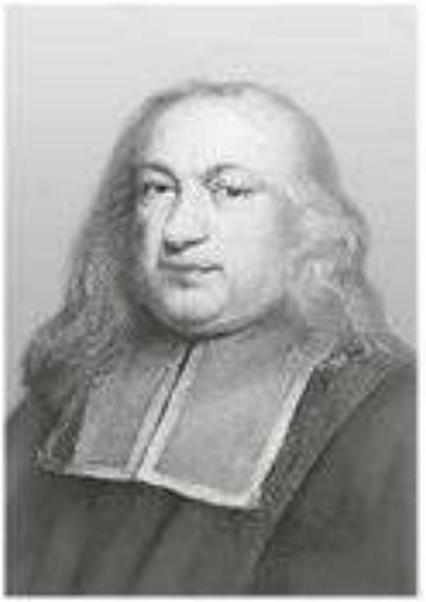
Пьер де Ферма (1601-1655)

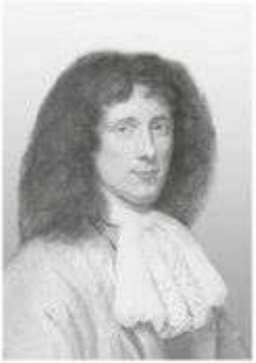
Христиан Гюйгене (1629-1695)

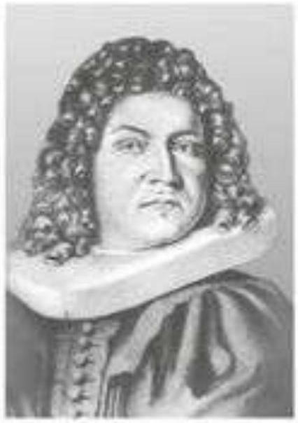
Якоб Бернулли (1654-1705)

ÜkỏèiàëäûKòàd òâioèyñûià åàéeàiûñôu ғàëûiààdăûH àH-
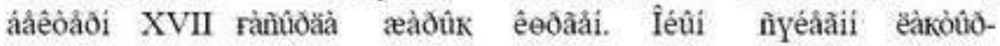 ràiăà ìaéāà áiëàõüi çàнäüëükòädäû француз математиктері Ảeąç ľanêàĕù iải Ĭuåò дe Ôãòià àokài. Înû ieñăeàảá нидерландык Oðèñòèài Ãpéāåiñ òà àeiaëûñкài. Üкòè-
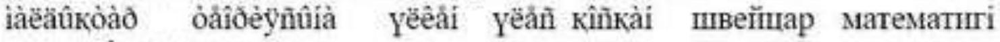 ßêiá Aảóióëëè.

## ӨЗІНДІ ТЕКСЕР!

1. Тәжірибе барысында бір мезетте орындалатын окиғалар:
A) акикат;
В) мүмкін емес;
С) кездейсок;
D) карама-карсы;
E) теңмүмкіндікті.
2. Жәшікте 9 кызыл, 5 кек, 6 сары шар бар. Жәшіктен кездейсок бір шар алынды. Алынған шардын көк болуыныи ыктималдығын табындар.
А) $\frac{2}{5}$;
В) 0,25 ;
C) $\frac{5}{16}$;
D) $\frac{3}{8}$;
Е) 0,4 .
3. Бірдей паракшаларда 1 -ден 32 санына дейін жазылып, жәшікке салынды. Жәшіктен бір паракша алынды. Алынған паракшадағы сан 4-ке еселік болуыныи ыктималдығын табындар.
А) $\frac{8}{25}$;
В) 0,5 ;
C) $\frac{7}{32}$;
D) 0,25 ;
E) 0,3 .
4. Кездейсок тандалып алынған екітанбалы саннын шифлары әртүрлі болуынын ыктпмалдығын табындар.
А) 0,5 ;
B) $\frac{8}{9}$;
C) 0,6 ;
D) 0,75 ;
E) 0,85 .
5. Жәшікте 10 кек, 6 сары, 6 ак түсті асык бар. Жәшіктен кездейсок бір асык алынды. Алынған шардың кызыл немесе ак болуынын ыктималдығын табындар.
А) 0,2 ;
В) 0,3 ;
C) 0,4 ;
D) 0,5 ;
E) 0,35 .
6. Дүкенде 40 смартфон бар, онын 20-сы шетелде шығарылған. Күні бойы сатылған 6 смартфоннын 3-еуі шетелде шығарылған болуынын ықтималығын табындар.
А) $\frac{C_{20}^{3}}{C_{40}^{3}}$;
В) $\frac{2 c_{20}^{3}}{c_{40}^{6}}$;
C) $\frac{C_{20}^{3}}{C_{40}^{6}}$;
D) $\frac{C_{20}^{2} \cdot C_{20}^{3}}{C_{40}^{6}}$;
E) $\frac{C_{20}^{2}+C_{20}^{3}}{C_{40}^{6}}$.
7. 1-ден 20-га дейінгі натурал сандардан бір сан тандалған. Тандалған санныи $\left(x^{2}-10 x+24\right)\left(x^{2}-8 x+15\right)=0$ тендеуінін түбірі болуынын ыктималдығын табындар.
А) 0,25 ;
В) 0,5 ;
C) 0,4 ;
D) 0,2 ;
E) 0,1 .
8. Қабырғасынын ұзындығы 20 см болатын шаршынын ішіне нүкте белгіленді. Нүкте шаршыға іштей сызылған шенберге тиісті болмауынын ыктималлығын табындар.
А) 0,25 ;
В) $1-\frac{\pi}{4}$;
С) 0,4 ;
D) $\frac{\pi}{4}$;
E) 0,6 .
9. 1-ден 10-га дейінгі (10-ды коса алғанда) натурал сандардан бір сан тандалған. Тандалған саннын $\left(x^{2}-2 x-24\right)\left(x^{2}-2 x-15\right)$ mo тенсіздігінін шешімі болуынын ыктималдығын табындар.
А) 0,25 ;
В) 0,3 ;
С) 0,4 ;
D) 0,1 ;
E) 0,2 .
10. -9-дан 10-ға дейінгі (10-ды коса алғанда) бүтін сандардан бір сан тандалған. Тандалған саннын $\left(x^{2}-9\right)\left(x^{2}-8 x-9\right)<0$ тенсіздігінін шешімі болуынын ыктималдығын табындар.
А) 0,25 ;
В) 0,3 ;
C) 0,4 ;
D) 0,2 ;
E) 0,5 .
11. 30 емтихан сұрактарынын 5-еуі "женіл" және 6-уы "курделі". Екі окушы бір сұрактан алды. Егер бірінші окушыға "женіл" сұрак түссе, онда екінші окушыға "күрделі" сұрак түсуінін ыктималдығын табындар.
А) 0,15 ;
B) $\frac{2}{29}$;
C) 0,14 ;
D) $\frac{6}{29}$;
E) 0,3 .
12. $\sqrt{n-6}$ ернегі берілген. $n$-нін мәні 1 -ден 100 -ге дейінгі сандар дын арасынан тандалган. Эрнектін мәні 4 -тен кем болуынын ыктималдығын табындар.
А) 0,12 ;
В) 0,16 ;
С) 0,18 ;
D) 0,2 ;
E) 0,3 .

# 9-СЫНЫПТАҒЫ АЛГЕБРА КУРСЫН КАЙТАЛАУҒА АРНАЛҒАН ЖАТТЫҒУЛАР 

## Есептендер

1. Өрнектін мәнін табындар:
1) $\cos 60^{\circ}-\sin 60^{\circ}+\operatorname{ctg} 60^{\circ}-\operatorname{tg} 60^{\circ}$;
2) $-\sin 30^{\circ}+\cos 30^{\circ}-\operatorname{ctg} 30^{\circ}+\operatorname{tg} 30^{\circ}$;
3) $\cos 45^{\circ}-\operatorname{tg} 45^{\circ}-\sin 45^{\circ}+\operatorname{ctg} 45^{\circ}$;
4) $\sin 0^{\circ}-\cos 30^{\circ}+\operatorname{tg} 45^{\circ}-\operatorname{ctg} 60^{\circ}$;
5) $-\cos 0^{\circ}+\operatorname{tg} 30^{\circ}-\operatorname{ctg} 45^{\circ}+\sin 60^{\circ}$;
6) $\operatorname{tg} 0^{\circ}-\operatorname{ctg} 90^{\circ}-\sin 0^{\circ}-\cos 90^{\circ}$.
2. Өрнектін мәнін табындар:
1) $\sin \frac{\pi}{6}-4 \cos \frac{\pi}{6}+\operatorname{tg} \frac{\pi}{6}-5 \operatorname{ctg} \frac{\pi}{3}$;
2) $\cos \frac{\pi}{2}+9 \sin \frac{\pi}{2}-\operatorname{ctg} \frac{\pi}{4}-7 \operatorname{tg} 0^{\circ}$;
3) $\sqrt{3} \cos \frac{\pi}{6}+2 \operatorname{ctg} \frac{\pi}{3}-11 \operatorname{ctg} \frac{\pi}{4}$;
4) $\operatorname{ctg} \frac{\pi}{2}-5 \sin \frac{\pi}{3}+6 \cos \frac{\pi}{3}-\operatorname{tg} \frac{\pi}{6}$.
3. Есептендер:
1) $\frac{\cos \frac{\pi}{6}-\sqrt{3} \operatorname{tg} 60^{\circ}}{\sin \frac{\pi}{6}+\cos 60^{\circ}}$;
2) $\frac{\sqrt{3} \operatorname{ctg} 30^{\circ}+\sqrt{2} \sin \frac{\pi}{4}}{2 \operatorname{tg} 45^{\circ}-\cos 0^{\circ}}$;
3) $\frac{\operatorname{tg} 30^{\circ}+\cos \frac{\pi}{6}}{\sin \frac{\pi}{2}-4 \operatorname{ctg} 45^{\circ}}$;
4) $\frac{\sqrt{2} \sin 45^{\circ}+\sqrt{2} \cos \frac{\pi}{4}}{5 \operatorname{tg} \frac{\pi}{4}-4 \operatorname{ctg} \frac{\pi}{4}}$;
5) $6 \cos 40^{\circ}-8 \cos ^{3} 40^{\circ}$;
6) $\frac{4 \sin 25^{\circ} \sin 65^{\circ}}{\cos 40^{\circ}}$.
4. Erep:
1) $\sin \alpha=0,7$ және $0^{\circ}<\alpha<90^{\circ}$ болса, онда $\cos \alpha, \sin 2 \alpha, \cos 2 \alpha$-ны;
2) $\cos \alpha=0,6$ және $270^{\circ}<\alpha<360^{\circ}$ болса, онда $\sin \alpha, \operatorname{ctg} \alpha, \operatorname{tg} 2 \alpha$-ны;
3) $\operatorname{tg} \alpha=5$ және $180^{\circ}<\alpha<270^{\circ}$ болса, онда $\cos \alpha, \sin \alpha, \cos 2 \alpha$-ны табындар.
5. Erep:
1) $\sin \alpha=\frac{1}{3}$ және $0^{\circ}<\alpha<90^{\circ}$ болса, онда $\sin 2 \alpha \cos 4 \alpha, \operatorname{ctg} 4 \alpha$-ны;
2) $\cos \alpha=-\frac{2 \sqrt{2}}{3}$ және $180^{\circ}<\alpha<270^{\circ}$ болса, онда $\cos 2 \alpha, \operatorname{tg} 2 \alpha$, $\sin 4 \alpha$-ны есептендер .
6. Erep:
1) $\cos \alpha=\frac{7}{9}$ және $0^{\circ}<\alpha<90^{\circ}$ болса, онда $\sin \frac{\alpha}{2}, \cos \frac{\alpha}{2}, \sin \alpha$-ны; 2) $\sin \alpha=\frac{4 \sqrt{2}}{9}$ және $90^{\circ}<\alpha<180^{\circ}$ болса, онда $\sin \frac{\alpha}{2}, \cos \frac{\alpha}{2}, \cos \alpha$, tg α-ны есептендер .
7. Егер $\sin \alpha=\frac{1}{6}, \cos \alpha=\frac{\sqrt{35}}{6}, \sin \beta=\frac{1}{9}, \cos \beta=\frac{4 \sqrt{5}}{9}$ және α, β бірінші ширекке тпісті болса, онда $\cos (\alpha+\beta), \sin (\alpha-\beta), \operatorname{tg}(\alpha+\beta)$-ны табындар.
8. Erep: $\sin \alpha=\frac{6}{7}, \cos \alpha=\frac{\sqrt{13}}{7}, \sin \beta=\frac{7}{8}, \cos \beta=\frac{\sqrt{15}}{8}$ және α, β бірі нші ширекке тист і болса, онда $\cos (\alpha-\beta), \sin (\alpha+\beta), \operatorname{tg}(\alpha-\beta)$-ны табындар.
9. Erep:
1) $a_{1}=8,5 ; \quad a_{2}=10,5 ; \quad n=4 ;$
2) $a_{1}=-19 ; \quad a_{2}=-16 ; \quad n=6$;
3) $a_{1}=23 ; a_{2}=19 ; n=5$;
4) $a_{1}=-1,7 ; \quad a_{2}=-3,7 ; \quad n=7$ болса, онда арифметнкалык прогрессиянын $d$ айырымы мен $a_{n}$-ші мүшесін табындар.
10. Erep:
1) $a_{1}=1,6 ; \quad d=0,2 ; \quad n=10 ;$
2) $a_{3}=27 ; d=-0,5 ; n=8$;
3) $a_{4}=4,6 ; \quad d=2,3 ; n=7$;
4) $a_{2}=0 ; d=-4,1 ; n=9$ болса, онда арифметикалык прогрессиянын $d$ айырымы мен $a_{n}$-ші мүшесін табындар.
11. Erep:
1) $a_{1}=-35 ; a_{n}=-20 ; d=5$ және $m=6$;
2) $a_{2}=30 ; a_{n}=20 ; d=-5$ және $m=5$;
3) $a_{4}=6,2 ; a_{n}=7,4 ; d=-0,4$ және $m=10$;
4) $a_{3}=-6,6 ; a_{n}=-7,3 ; d=0,7$ және $m=20$ болса, онда арифметнкалык прогрессняда $n$ мен $S_{m}$-ді табындар.
12. Erep:
1) $d=-20 ; \quad S_{4}=320 ;$
2) $d=20 ; S_{6}=60$;
3) $d=30 ; S_{7}=259$;
4) $d=-40 ; S_{9}=1350$

болса, онда арифметикалык прогрессиянын $a_{1}$-ші мүшесін табындар.

прогрессияныи $a_{1}$-ші мүшесін та-
13. Erep:

1) $b_{1}=0,7 ; \quad b_{2}=1,4 ; \quad n=5 ;$
2) $b_{1}=0,6 ; \quad b_{2}=1,8 ; n=7$;
3) $b_{1}=0,2 ; \quad b_{2}=1,4 ; \quad n=4$;
4) $b_{1}=0,3 ; b_{2}=-1,2 ; n=6$ болса,

онда геометриялык прогрессиянын $q$ еселігі мен $b_{n}$-ші мүшесін табындар.
14. Erep:

1) $b_{2}=-243 ; \quad q=-\frac{1}{3} ; n=4$;
2) $b_{3}=81 ; q=-\frac{1}{3} ; n=8$;
з) $b_{4}=128 ; q=-\frac{1}{2} ; n=10$;
3) $b_{5}=64 ; q=-\frac{1}{2} ; n=9$ бол- са, онда геометриялык прогрессиянын $b_{1}$ жән е $b_{n}$-ші мүшесін табындар.
15. Erep:
1) $b_{1}=-1000 ; \quad q=0,5 ; n=6$;
2) $b_{1}=400 ; q=0,2 ; n=7$;
3) $b_{1}=900 ; q=0,01 ; n=6$;
4) $b_{1}=-500 ; q=-0,2 ; n=8$ болса, онда геометриялык прогрессияда $S_{n}$-ді табындар.
16. Erep:
1) $b_{4}=-\frac{27}{32} ; q=-\frac{3}{4}$;
2) $b_{5}=-16 ; q=\frac{2}{3}$;
3) $b_{3}=90 ; q=\frac{3}{5}$;
4) $b_{4}=12,5 ; q=-\frac{5}{6}$ болса, онда геометрнялык прогрессияда $b_{1}$-ді табында p.

## Өрнектерді тепе-тен түрлендірулер

17. Өрнекті ыкшамдандар:
1) $\operatorname{tg}\left(\frac{\pi}{2}-\alpha\right) \cdot \operatorname{ctg}(2 \pi-\alpha) \cdot \cos \left(\frac{3 \pi}{2}+\alpha\right) \cdot \operatorname{tg}(2 \pi+\alpha) ;$
2) $\cos (2 \pi-\alpha) \cdot\left(\operatorname{tg}\left(\frac{3 \pi}{2}-\alpha\right)\right)^{2} \cdot \operatorname{tg}(\pi+\alpha) \cdot\left(\operatorname{ctg}\left(\frac{\pi}{2}+\alpha\right)\right)^{2}$.
18. $2 \sin (-\alpha) \cdot \sin \left(\frac{3 \pi}{2}-\alpha\right)+\cos \left(360^{\circ}-2 \alpha\right) \cdot \operatorname{ctg}\left(\frac{\pi}{2}-2 \alpha\right)-2 \cos \left(2 \alpha-\frac{\pi}{2}\right)$ өрнегінін мәні нелге тен болатынын дәлелдендер.
19. $0,5 \cos 8 \alpha-1,5-\cos ^{2} 4 \alpha=1$ тендігінін дурыстығын тексеріндер.
20. Өрнекті ыкшамдандар:
1) $\frac{\operatorname{ctg}^{2}\left(270^{\circ}-3 \alpha\right) \cos \left(2 \alpha+90^{\circ}\right) \cos \left(\alpha-180^{\circ}\right) \operatorname{ctg}(-\alpha)}{\sin \left(\alpha-90^{\circ}\right) \operatorname{tg}\left(270^{\circ}+\alpha\right) \cos (-\alpha) \operatorname{tg}^{2}\left(180^{\circ}+3 \alpha\right)}$;
2) $\frac{\sin \left(\beta+63^{\circ}\right)+\sin \left(\beta-57^{\circ}\right)}{2 \cos \left(\beta-87^{\circ}\right)}$.
21. $2\left(0,5-0,5 \cos 4 \alpha+\frac{1}{1+\operatorname{tg}^{2} 2 \alpha}\right)-\left(1-\sin ^{2} 2 \alpha\right) \cdot \frac{1}{\operatorname{ctg}^{2} 2 \alpha}-\cos ^{2} 2 \alpha$ өрнегінің мәні бірге тен болатынын дәлелелденде p.
22. Өрнекті ыкшамдандар:
1) $\left[\left(1-\sin ^{2} \frac{\alpha}{2}\right),\left(\frac{\sin ^{2} \frac{\alpha}{2}}{\cos \frac{\alpha}{2}}+\cos \frac{\alpha}{2}\right)\right]$;
$:\left[\left(1-\cos ^{2} \frac{\alpha}{2}\right) \cdot \frac{\operatorname{ctg}\left(90^{\circ}+\frac{\alpha}{2}\right) \cdot \operatorname{ctg}\left(180^{\circ}-\frac{\alpha}{2}\right)}{\sin \frac{\alpha}{2}}\right] ;$
2) $\frac{\sin ^{2} \alpha-\operatorname{tg}^{2} \alpha}{\cos ^{2} \alpha-\operatorname{ctg}^{2} \alpha}$;
з) $\frac{1}{8} \cos 4 \alpha+0,5 \cos 2 \alpha+\frac{3}{8}$;
3) $\frac{\sin ^{2} \alpha-\operatorname{tg}^{2} \alpha}{\cos ^{2} \alpha-\operatorname{ctg}^{2} \alpha}$.

$$
\cos ^{2}(\pi+4 \alpha)-\cos ^{2}(\alpha+\beta)+\cos ^{2}\left(4 \alpha-\frac{\pi}{2}\right)
$$

23. $\overline{\sin ^{2}(\pi-(\alpha+\beta))+\operatorname{tg}^{2}(\alpha+\beta)-\cos ^{2}\left(\frac{3 \pi}{2}-(\alpha+\beta)\right)}=\cos ^{2}(\alpha+\beta)$ тендігінін пұрыстығын тексе ріндер.
24. Өрнекті ыкшамдандар:
1) $\operatorname{tg} 7 \alpha \cdot \operatorname{ctg} 7 \alpha+\sin ^{2} \frac{\alpha}{3} \cdot \operatorname{ctg}^{2} \frac{\alpha}{3}+\sin ^{2} \frac{\alpha}{3}$;
2) $(0,5+0,5 \cos 10 \alpha):(0,5-0,5 \cos 10 \alpha) \cdot \operatorname{tg}^{2} 5 \alpha$;
3) $\frac{\cos ^{2} \alpha-4 \sin ^{2} \frac{\alpha}{2} \cos ^{2} \frac{\alpha}{2}}{1-8 \sin ^{2} \frac{\alpha}{2} \cos ^{2} \frac{\alpha}{2}}$;
4) $\frac{\sin ^{4} \alpha+2 \sin \alpha \cos \alpha-\cos ^{4} \alpha}{\operatorname{tg} 2 \alpha-1}$.
25. Тепе-тендікті далелдендер:
1) $\frac{\operatorname{tg}\left(\frac{\pi}{2}-4 \alpha\right) \sin (2 \pi-2 \alpha) \cos (-2 \alpha)}{\operatorname{ctg}(2 \pi-4 \alpha)\left(\cos ^{2} 2 \alpha-\cos ^{2}\left(\frac{\pi}{2}-2 \alpha\right)\right)}=0,5 \operatorname{tg} 4 \alpha ;$
2) $\operatorname{tg} \alpha \cdot \operatorname{tg} \beta+(\operatorname{tg} \alpha+\operatorname{tg} \beta) \operatorname{ctg}(\alpha+\beta)=1$;
3) $(\operatorname{tg} \alpha-\operatorname{tg} \beta) \cdot \operatorname{ctg}(\alpha-\beta)-\operatorname{tg} \alpha \cdot \operatorname{tg} \beta=1$;
4) $4 \sin ^{6} \alpha+4 \cos ^{6} \alpha-1=3 \cos ^{2} 2 \alpha$.

## Тендеулер және олардын жүйелері

26. Берілген тендеудін шешімі болатын үш сандар жұбын көрсетіндер:
1) $3 x-4 y=10$;
2) $5 x+0,2 y=1$.
27. $(0 ; 0,4),(0,4 ; 0),(0 ;-0,4),(-0,4 ; 0),(4 ; 6),(-4 ;-6),(0 ; 0)$ сандар жұптарынын арасынан $8 x-5 y-2=0$ тендеуінін шешімін табындар.
28. Егер арифметикалык прогрессняның бірінші және тертінші мүшелерінін косындысынын мәні 23-ке, үшінші және алтыншы мүшелерінін косындысынын мәні 31-ге тен болса, прогрессиянын бірінші мүшесі мен айырымын табындар.
29. Шексіз геометриялық прогресснянын косындысы 6-ға, алғашкы бес мүшесінін косындысы $\frac{93}{16}$-ке тен болса, прогрессиянын тертінші мүшесі мен еселігін табындар .
30. Erep:
1) $\left\{\begin{array}{l}b_{1}+b_{4}=68,4 \\ b_{2}+b_{3}=-8,4\end{array}\right.$ 2) $\left\{\begin{array}{l}b_{1}-b_{3}=384, \\ b_{1}+b_{4}=403,2\end{array}\right.$ болса, онда геометриялык прог рессиянын алғашкы бес мүшесінін косындысынын мәнін табындар.
31. Erep:
1) $\left\{\begin{array}{l}2 a_{2}-5 a_{6}=23, \\ a_{1}-9 a_{5}=86 ;\end{array}\right.$
2) $\left\{\begin{array}{l}4 a_{3}-5 a_{2}=-75, \\ 6 a_{2}+5 a_{7}=135\end{array}\right.$

геометриялык прогрессиясынын алғашкы сегіз мүшесінін косындысынын мәнін табындар.

Тендеулер жүйесін графиктік тәсілмен шешіндер (32-34):
32. 1) $\left\{\begin{array}{l}5 y^{2}-x^{2}=1, \\ 7 y^{2}+3 x y=1 ;\end{array}\right.$
2) $\left\{\begin{array}{l}4 x^{2}+x y=5 \\ x^{2}+3 x y=4\end{array}\right.$;
3) $\left\{\begin{array}{l}y^{2}-x^{2}=12, \\ y^{2}-3 x y+2 x^{2}=0 ;\end{array}\right.$
4) $\left\{\begin{array}{l}y^{2}-3 x y=2, \\ y^{2}-4 x y+x^{2}=3 .\end{array}\right.$
33. 1) $\left\{\begin{array}{l}(u+v)^{2}-4(u+v)=45, \\ (u-v)^{2}-2(u-v)=3 ;\end{array}\right.$
2) $\left\{\begin{array}{l}(u+v)^{2}-5(u+v)=-4, \\ (u-v)^{2}-5(u-v)=2 ;\end{array}\right.$
3) $\left\{\begin{array}{l}u-u v+v=1, \\ u^{2}+2 u+2 v+v^{2}=11 ;\end{array}\right.$
4) $\left\{\begin{array}{l}u+u v+v=5, \\ u^{2}+u v+v^{2}=7 .\end{array}\right.$
34. 1) $\left\{\begin{array}{l}y=x^{2}+2 x, \\ x^{2}+(y+3)^{2}=1 ;\end{array}\right.$
2) $\left\{\begin{array}{l}y-x^{2}-x=0, \\ (x-2)^{2}+y^{2}=1 ;\end{array}\right.$
3) $\left\{\begin{array}{l}(x-2)^{2}+(y-1)^{2}=4, \\ x+y=3 ;\end{array}\right.$
4) $\left\{\begin{array}{l}(x+5)^{2}+(y-3)^{2}=9, \\ x-y=-8 .\end{array}\right.$

## Тенсіздіктер және олардыи жүйелері

35. Тенсіздікті шешіндер:
1) $(x-10)(x+5)(x-6) \mid 0$;
2) $(x+2)(x-7)(x+11)$ mo;
з) $\left.\frac{x+5}{x-6} \right\rvert\, 0$;
3) $\frac{x-7}{x+2} \mathrm{~m} 0$;
4) $\left.\frac{x}{x-7} \right\rvert\, 2$;
5) $\frac{x}{6+x} \mathrm{~m}_{-1}$;
6) $(x-1)(x-2)^{2}(x-3)<0$;
7) $(x+3)^{2}(x+2)(x+1)<0$.
36. Тенсіздікті квадраттық функциянын графигінін кемегімен және ннтервалдар әдісімен шешіндер:
1) $x^{2}-2 x-5 \mid 0$;
2) $-x^{2}-2 x+15 m_{0}$.
37. Тенсіздікті шешіндер:
1) $6 x^{2}-13 x-5>0$;
2) $4 x^{2}+33 x-27<0$.
38. Тенсіздікті канағаттандыратын ен кіші натурал санды табындар:
1) $\frac{x+1}{x-5} \mathrm{mo}$;
2) $\left.\frac{10-x}{x-2} \right\rvert\, 0$.
39. Тенсіздікті канағаттандыратын ен үлкен натурал санды табындар:
1) $(2-x)(x-8)^{2} \mid 0$;
2) $(x-3)^{2}(x-9)<0$.
40. Тенсіздікті канағаттандыратын ен кіші бүтін санды табындар:
1) $\left.\frac{x^{2}-81}{x} \right\rvert\, 0$;
2) $\frac{7 x-x^{2}}{x+7} \mathrm{~m}_{0}$.
41. Тенсіздікті канағаттандыратын ен үлкен бүтін санды табындар:
1) $(x+5)(x-6)^{2}<0$;
2) $(x+6)^{2}(5-x)>0$.
42. Тенсіздіктер жүйесін шешіндер:
43. 44) $\left\{\begin{array}{l}x^{2}-4 x \geqslant 0, \\ x-12>0 ; \\ -x^{2}+6 x+16>0, \\ x^{2}-12 x+27<0\end{array}\right.$ тенсіздіктер жүйесін канағаттандыратын ен кіші және ен үлкен натурал сандарды табындар.
2) $\left\{\begin{array}{l}x^{2}+8 x+7 \geqslant 0, \\ x^{2}+15 x+36<0\end{array}\right.$ тенсіздіктер жүйесін канағаттандыратын ен кіш і және ен үлкен бүтін сандардын косындысынын мәнін табындар.
44. Тенсіздіктер жүйесін шешіндер:
1) $\left\{\begin{array}{l}|x| \geqslant 5, \\ 6+x>0 ;\end{array}\right.$
2) $\left\{\begin{array}{l}|x| \leqslant 3, \\ -9+x^{2} \leqslant 0 ;\end{array}\right.$
3) $\left\{\begin{array}{l}|x-2| \leqslant 3, \\ x^{2}-x+12<0 .\end{array}\right.$
45. 46) $\left\{\begin{array}{l}|2 x-3| \leqslant 1, \\ x^{2}+x>0\end{array}\right.$ тенсіздіктер жүйесін канагаттандыратын бүтін сандардың косынды сынын мәнін есептендер.
2) $\left\{\begin{array}{l}|2 x+5| \leqslant 3, \\ x^{2}-5 x-24 \leqslant 0\end{array}\right.$ тенсіздіктер жүйесін канағаттандыратын барл ык бүтін сандарды табындар.
46. Тендеуді шешіндер:
1) $\frac{x^{2}+4}{x}+\frac{x}{x^{2}+3 x+4}+\frac{11}{2}=0$;
2) $\frac{x^{3}+2 x}{\left(x^{2}-x+2\right)^{2}}=\frac{3}{4}$.
47. Координаталары тенсіздіктер жүйесін канағаттандыратын нүктелер жиынын координаталык жазыктықта кескіндендер:
1) $\left\{\begin{array}{l}y<x^{2} \\ x-5 \geqslant 0\end{array}\right.$
2) $\left\{\begin{array}{l}x^{2}+y^{2} \leqslant 4, \\ x-y<2 ;\end{array}\right.$
3) $\left\{\begin{array}{l}y<-x^{2}+2, \\ x^{2}+y^{2}+2 y \geqslant 3 ;\end{array}\right.$
4) $\left\{\begin{array}{l}y>x^{2}-2 x, \\ x^{2}+y^{2}-4 y \geqslant 1 .\end{array}\right.$

## Функция және оныи графигі

48. Функшяныи графигін салындар:
1) $y=2 x^{2}-4 x+3$;
2) $y=\frac{1}{2} x^{2}+2 x-2$;
3) $y=-x^{2}+3 x-1$;
4) $y=-\frac{1}{3} x^{2}-x+1$.
49. Функциянын графигін салындар және оның анықталу облысы мен мәндер жиынын керсетіндер:
1) $y=2 x^{2}+|x|$;
2) $y=-x^{2}+3|x|$;
3) $y=2 x-x \cdot|x|$;
4) $y=x \cdot|x|-3 x$.
50. Функцияныи графигін салындар және бар болса, онда оныи ен үлкен және ен кіші мәндерін табындар:
1) $y=4 x^{2}-2 x+3$;
2) $y=-x^{2}-4 x+2$;
з) $y=2-\sqrt{x-1}$;
3) $y=2+\sqrt{2-x}$.
51. Тендеуді графиктік тәсілмен шығарындар және түбірлерінін жуык мәндерін жазындар:
1) $x^{2}-4 x=\frac{1}{x+1}$;
2) $-3 x^{2}+2 x-2=\frac{x+1}{x-2}$.
52. Тендеудін графигін салындар:
1) $\frac{y-x^{2}+2}{x-1}=0$;
2) $\frac{y-x^{2}+2 x}{x+1}=0$;
з) $\frac{y^{2}-x^{2}-4}{x^{2}-1}=0$;
3) $\frac{y^{2}-x^{2}-4 x}{x^{2}-4}=0$.
53. 85-суретте квадраттык функшянын графигі берілген. Графиктін көмегімен:
1) функшиянын бірсарындылык аральктарын көрсетіндер;
2) функшияныи танбатұрактылык аралыктарын көрсетіндер;
3) графиктін симметрия осінін тендеуін жазындар;
4) функшиянын ен кіші мәнін табындар.
54. 55) 86-суретте $y=a x^{2}+b x+c$ функшиясынын графигі берілген және $D=b^{2}-4 a c, a, b, c$ сандарынын және $D$-нын танбасын табындар.
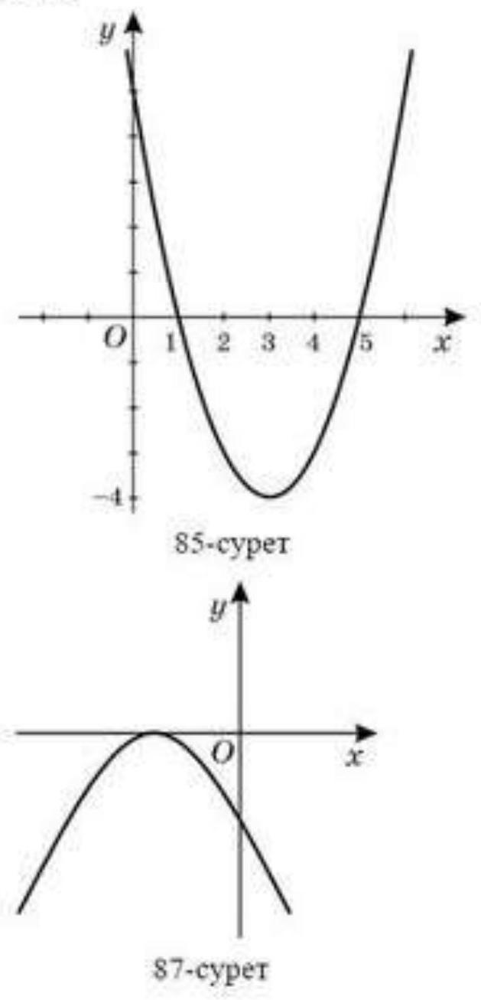
2) 87-суретте $y=a x^{2}+b x+c$ квадраттык функциясынын графигі берілген және $D=b^{2}-4 a c, a, b, c$ сандарыныи және $D$-нын танбасын табындар.
3) 88-суретте $y=a x^{2}+b x+c$ квадраттык функциясынын графигі берішен және $D=b^{2}-4 a c$. а) $a c>0$; ә) $D c>0$; б) $a b<0$; в) $b c>0$; г) $b D>0$ катынастары дурыс па?

## Практикаға бағытталған тапсырмалар

55. 10 жабык кұлып және оларды ашатын 10 кілт берілген. Әр кұлыпка бір кілттен келеді. Бірінші кұлыпты ашу үшін 10 кілт колданылады. Жаксы жағдайда кұлып бірінші кілтпен, ен нашар жағдайда оныншы кілтпен ашылады. Барлык кұлыпты ашу үшін ен көп дегенде канша рет әрекет жасау керек?
56. Бір кешеде 100 үй бар және әр үйге немір берілген. Так нөмірлі үйлер көшенін сол жағында, жұп немірлі үйлер он жағында орналаскан. 90-шы немірлі үй кай жерде орналаскан?
57. Әлия тұратын үйде бір ғана кіреберіс бар. Әр кабатта 10 пәтерден. Әлия 88-ші пәтерде тұрады. Әлия үйдін нешінші кабатында тұратынын табындар.
58. Станок алты метрлік 300 тактайдын әркайсысын бір сағатта 2 метрден беледі. Тура осындай сегіз метрлік 400 тактайды 2 метрден белу үшін канша уакыт керек?
59. Тіктертбұрыштын периметрі 36 cm . Онын кабырғаларынын ұзындығы бүтін сандармен өрнектеледі. Есептін шарты бойынша канша тіктертбұрыш салута болады?
60. Жанұяда 9 бала бар және олардын жастарынын косындысы 119-ға тен. Егер олар әр үш жылда туылған болса, онда олардын жастарын табындар.
61. Сыныпта 28 окушы бар. Олардын 12-сі вокалмен, 19-ы бимен, 5-еуі вокал және бимен айналысады. Сыныптыи канша окушысы осы үйірмелерге катыспайды?
62. Арман мен Нұржан келге жағалай отырғызылған талдарды санады. Олар әртүрлі талдан бастап бір бағытта жылжыды. Арманнын санауында жнырмысыншы болған тал Нұржанда тертінші, Нұржанда кырык алтыншы болған тал Арманда оныншы болды. Көлдін жағалауына қанша тал отырғызылған?
63. $1,2,6,24,120, \ldots$ тізбектегі зандылыкты табындар.

## ҚҰРЫЛЫСТАҒЫ МАТЕМАТИКА

64. 65) 56 т жүкті 300 км кашыктыкка тасымалдау үшін бір кәсіпорынныи мәшинелері колданылады және мәшинелердін жүк көтергіштіктері әртүрлі. Мәліметтер кестеде кел тірілген.

10- кесте

| Кәсіпорын | Машинелердін жүк   кетергішті | Бір машиненін 100 км   кашыктыка тасу куны (II) |
| :--- | :---: | :---: |
| I | 3 T | 6000 |
| II | 5 T | 8000 |
| III | 6 T | 10000 |

Қай кәсіпорынныи мәшинелерін алған тнімді?
2) Ғимаратты бір кабатқа көтергенде онын бшіктігі 3,5 метрге артады. Шағын ауданда 5 кабатты, 4 кабатты үйлер, 2 кабатты балалар бакшасы және 3 кабатты мектеп салынған. Шағын аудандағы барлык ғимараттардын бніктіктерінін косындысынын мәнін табындар.

## БИЗНЕСТЕГІ МАТЕМАТИКА

65. Диаграммада $X$ және $Y$ банктеріндегі алғашкы салым мен жылдык өсіме сәйкес салым көрсетілген (89-сурет).
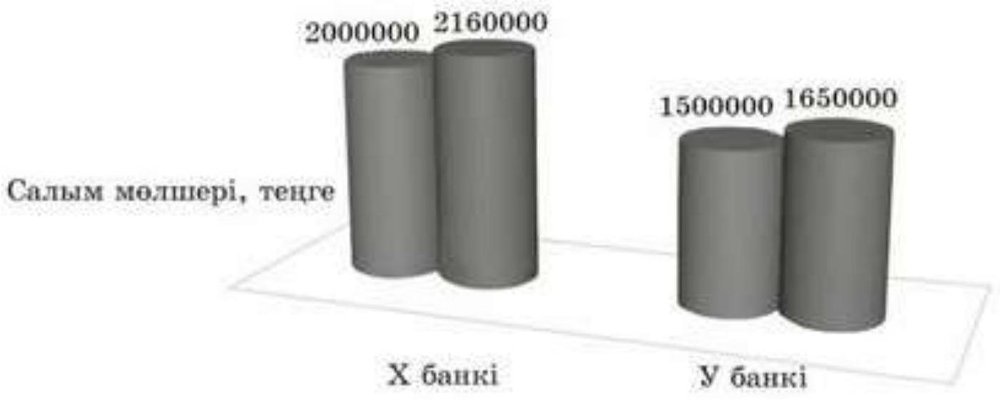

## 89-cyper

1) $X$ және $Y$ банктеріндегі салымнын жылдық пайызынын есімін табындар;
2) $X$ және $Y$ банктердегі салымнын жылдык пайызы есімінін айырмашылығын табындар.

## ЖYPгІЗУШі МАМАНДЫғЫНДАҒЫ МАТЕМАТИКА

66. Кәсіпорында 54 жүргізуші бар. Егер барлык 60 мәшиненін $25 \%$-ы күнделікті жендеу жұмыстары үшін кәсіпорында калатын болса, онда әр жүргізушіде бір айда (30 күн) канша күн демалыс болатынын табындар.

## Ыктималдыктар теориясынын элементтері

67. а) Жәшікте 4 ак және 8 кызыл шар бар. Кездейсок алынған шардын: 1) ак; 2) кызыл болуының ыктималдығын табындар. ә) Жәшікте 6 кызыл, 4 ак және 10 кек шар бар. Кездеїсок алынған шардын: 1) кызыл; 2) ак емес; 3) көк болуынын ыктималдығын табындар.
68. Ойын сүйегі лактырылған. 1) 2 немесе 3 цифрыныи; 2) 4 немесе
5 цифрынын; 3) так ұпайдын түсуінін ыктималығын табындар.
69. Емтиханға 30 билет дайындалған. Окушынын алған билеті: 1) біртанбалы сан; 2) так сан болуынын ыктималдығын табындар.
70. 71) Қабырғасыныи ұзындығы 4 см шаршыға кабырғасынын ұзындығы 2 см екінші шаршы іштей сызылган. Кездейсок белгіленген нүкте екінші шаршыта тпісті болмауынын ыктималдығын табындар.
2) Кабырғасыныи ұзындығы 4 см шаршыға радиусы 2 см денгелек іштей сызылған. Кездейсок белгіленген нүкте денгелекке тпісті болуынын ыктималдығын табындар.
3) $[-2 ; 8]$ кесіндісінен сан кездейсок тандалады. Осы сан $x^{2}-2 x+ +8<80$ тенсіздігінін шешімі болуының ыктималдығын табындар .
4) $[-3 ; 7]$ кесіндісінен сан кездейсок тандалады. Осы сан $x^{2}-2 x+$ +9 m 0 тенсіздігінін шешімі болуынын ықтпалдығын табындар.

## Олимпиадалык тапсырмалар

71. $(3 x-1)(\sqrt{x}+3 x-1)=2 x$ тендеуін шешіндер.
72. $x^{3}-2 x-4 \sqrt{6}=0$ тендеуін шешіндер.
73. а тендеуінін түбірлері геометриялық прогрессняны кұрайды. $x^{3}-12 x^{2}+a x-28=0$ тендеуінін түбірлері арифметикалык прогрессияны кұрайды. Осы түбірлерді табындар.
74. a параметрінін кандай мәндерінде $x^{3}+a x^{2}+48 x-27=0$ тендеуінін түбірлері геометриялык прогрессияны кұрайды?
75. $a$ және $b$ параметрлерінің кандай мәндерінде $x^{3}+7 x^{2}+a x+b$ кепмүшесі $x^{2}+x+2019$ кепмүшесіне белінеді?
76. $\left(x^{2}-5 x-8\right)^{3}=x^{2}\left(x^{2}+x-8\right)$ тендеуінін түбірлерін табындар.
77. $x^{12}-x^{9}+x^{4}-x+1>0$ тенсіздігі $x$-тін кез келген накты мәнінде акикат болатынын дәлелдендер.
78. $x^{8}+x^{6}-4 x^{4}+x^{2}+1 \mid 0$ тенсіздігі $x$-тін кез келген мәнінде акикат болатынын делелдендер.
79. Егер $\frac{1}{a}+\frac{1}{c}=\frac{2}{b}$ және $a c>0$ болса, онда $\frac{a+b}{2 a-b}+\frac{c+b}{2 c-b}$ । 4 тенс іздігін дәлелд ендер.
80. Erep $a, b, c \in R_{+}$және $a b c=1$ болса, онда $a b+b c+c a+a+b+ +c-610$ тенсіздігін далелдендер.
81. $1 \cdot 3 \cdot 5 \cdot \ldots \cdot(2 n-1)<n^{n}$ тенсіздігін дәлелдендер.
82. $2^{n} \mid 2 n+1$, мұндағы $n \in N$ және $n \mid 3$, тенсіздігін математикалык индукция әдісімен дәлелдендер.
83. Erep $n$ । 2 болса. онда $1+\frac{1}{2}+\frac{1}{3}+\ldots+\frac{1}{2^{n}-1}<n$ тенсіздігін далелдендер.
84. $5^{\circ} ; 10^{\circ} ; 15^{\circ} ; \ldots$ арифметикалык прогрессия. Осы бұрыштардын косинустарынын косындысынын мәні нелге тен болатындай прогрессияныи бірінші мүшесінен бастап алынатын мүшелердін ен кіші санын табындар.
85. $\sin \alpha+\sin (\alpha+\phi)+\sin (\alpha+2 \phi)+\ldots+\sin (\alpha+n)$ ернегін ыкшамдандар.

## Комбинаторика элементтері

86.1) Бір цифр екі рет кайталанбайтындай 2, 4, 7, 8 цифрларынан тұратын төрттанбалы сандардын санын табындар.
2) Тіктертбұрыш, ромб және шаршыны көк, кызыл, жасыл әртүрлі түстермен бояудын канша тәсілі бар?
87. 52 окушы математикадан, 33 окушы информатикадан, 11 окушы екі пәннен де олимпиадаға катысты. Олимпиадаға барлығы канша окушы катыскан?
88. 70 желім кағаздын 47 -сіне түймедак, 30-ына нәркес, 10-ына жұпаргүл мен түймедак, 6 -уына жұпаргүл мен нәркес, 5 -еуіне жұпаргүл мен түймедақ, 4-еуіне нәркес, жұпаргүл, түймедак салынған. Нәркес салынған желім кағаздын санын табындар.
89. Тендеуді шешіндер:

1) $A_{x}^{3}=8 x-3 x^{2}$;
2) $A_{x}^{3}=2 x^{3}-3 x^{2}-14 x$;
з) $C_{x}^{2}=x+5$.
90. Асхана мәзірінде 4 салат, 3 бірінші, 5 екінші және 3 үшінші тамак бар. Терт тамактан (салаттан, біріншіден, екіншіден, үшіншіден) тұратын түскі асты канша тәсілмен тандауға болады?
91. 92) Абонент телефон немірінін сонғы екі цифрын ұмытып калған. Егер ол сонғы екі шифрдың әртүрлі және так сандар екенін білетін болса, онда телефон немірін аныктау тәсілінін ен үлкен саны канша?
2) Окушы емтиханға берілген 30 сұрактын 22-сін окыган, 4-еуін окымаған, ал калғанына орташа дайындалған. Емтихан билетінде үш сұрак бар. Окушы сұрактарына жауап бере алатын билеттер саны канша?
92. $\left(2 x+\frac{1}{x}\right)^{4}$ биномыныи жіктелуіндегі $x$-тін дәрежесі бойынша кұрамында: 1) $x^{2}$ болат ын; 2) $x$ болмайтын бірмүшені табындар.

## ГЛОССАРИЙ

| $A_{n}^{k}$ | $A_{n}^{k}-n$ элементтен алынған $k$-дан кұралган кайталанбайтын орналастырулар саны |
| :--- | :--- |
| Акикат окига | Тжжірнбе барысында міндетті түрде орындалатын окца ақиқат ожиеа деп аталады |
| Алгоритм | Алгоритм - кандай да бір максатка жету үшін орындалатын карапайым іс-әрекеттер тізбегі |
| Арифметикалык прогресспя | Екінші мүшесінен бастап, әрбір мүшесі алдынғы мүшесіне кандай да бір тұракты $d$ санын косканда шығатын сандар тізбегін арифметикалык прогрессия деп атайлы. $d$ саны арифметикатық прогрессиянын айырымы деп аталады |
| Арифмепикалык прогресспянын бежісі | $a_{n}=\frac{a_{n-1}+a_{n+1}}{2}$ формуласымен берілген арпфметикалык прогрессия мүше лерінін каснеті арифметикалы прогрессиянын белгісі деп аталады |
| Арифметнкалык прогрессияныи анашкы л мүшесінін косындысыныи формуласы | $S_{n}=\frac{a_{1}+a_{n}}{2} \cdot n ; S_{n}=\frac{2 a_{1}+d(n-1)}{2} \cdot n$ - арпфметнкатык прогрессняныи алғашкы $n$ мүше сінін косындыс ынын формуласы |
| Арифметикалык прогресспянын $n$-ші мүшесінін формуласы | $a_{n}=a_{1}+(n-1) \cdot d$ формуласы арифметикалы прогрессиянын $n$-ии мушесінну формуасы деп аталады |
| α бұрышыныи синусы | Шенберге тпісті $B$ нүктесінін оршнатасынын шенбер радпусына катынасы а бұрышынын синусы деп аталады |
| а бұрышынын косинусы | Шенберге тисті $B$ нүктесініи абсшиссасынын шенбер радпусына катынасы а бұрышынын косинусы деп аталады |
| а бұрышыныи тангенсі | Шенберге тпісті $B$ нуктесінін оршинатасыныи нүктенін абсшнесасына қатынасы а бұрышыныи тангенсі деп аталады |
| а бұрышынын котангенсі | Шенберге тисті $B$ нүктесінін абсшиссасынын нуктенін оршнатасына қатынасы а бұрышынын котангенсі деп аталады |
| Бином | Бином сезі франиуз тілінен аударғанда "алгебралық екімуше" деген сезді білліреді |
| Биномналды коэффишенттер | Ньютон биномынын формуласындағы $C_{n}^{k}$ коэффиппенттері биношиалоы коэффициенттер деп аталады |

| Жатгасы |  |
| :--- | :--- |
| Бірсарынды тізбек | Өспелі, кемімелі, өспейтін және кемімейтін тізбектерді бірсарыном тізбектер деп атайцы |
| Геометрнялык прогрессня | Екіншісінен бастап кез келген мүшесі алдынғы мушесін нелден езгеше кандай да бір тұракты санга кебейткенде шығатын сандар тізбегі геометриялық прогрессия деп аталалы |
| Геометриялык прогресспяныи белгісі | $b=\sqrt{b_{n-1} \cdot b_{n+1}}$ формуласьмен берілген теометриялык прогресспя мүшелерінін каснеті геометриялық прогрессияныи бетгісі леп аталады |
| Геометриялык прогресспянын eceлігі | Келесі мүшесін ату ушін аліынғы мушесіне көбейтілетін сан геометриялы прогрессиянын еселіа деп аталады және $q$ әрпімен белгіленеді |
| Теометриялык прогресспянын алғашкы n мүшесінін косындысынын формуласы | $S_{n}=\frac{b_{1}\left(1-q^{n}\right)}{1-q}, q \neq 1$ - геометриялык прогресснянын алғ ашкы $n$ мүшесінін косынд ысынын формуласы |
| Теометриялык прогрессиянын $n$-ші мүшесінін формуласы | $b_{\kappa}=b_{1} q^{\kappa-1}$ формуласы геометриялы прогрессиянын п-ші мушесінія формуласы деп аталады |
| Геометриялык ыктималдык | Геометриятық ықтиматым - нүктенін. кесіндінін, жазыктыктын, кеністік фигурасына түсу ыктималдығы |
| Екі айнымалысы бар сызыктык емес тендеупер жүйесі | Кұрамында ен болмағанда бір тендеуі сызыктык тендеу болмайтын екі айнымалысы бар тендеулер жүйесі екі айнымачысы бар сызымтық емес теңдеутер жүйесі деп аталады |
| Екі айнымалысы бар сызыктык емес тендеулер жүйесінін шешімі | Жүйенін эрбір тендеуін тура санды тендікке айналдыратын ( $x_{0}: y_{0}$ ) сандар жұбы екі айныматысы бар сызыктых емес тендеугер жүйесінін шешімі деп аталады |
| Екі айнымаласы бар сызыктык емес тендеудін шешімі | Екі айнымалысы бар $F(x ; y)=0$ сызыктық емес тендеуін $F\left(x_{0} ; y_{0}\right)=0$ тура санды тендігіне айналдыратын ( $x_{0} ; y_{0}$ ) сандар жұбы екі айныматысы бар сызықтық емес теңдеудін шешімі деп аталады |
| Екі айнымалысы бар тендеу | $f(x ; y)=q(x ; y)$ түрінде берілаен тендеулер екі айнымалысы бар ( $x$ пен $y$ ) тендеулер деп аталады, мұндағы $f(x ; y)$ және $q(x ; y)-x$ пен $y$ айнымалылары бар өрнектер |
| Екі айнымалысы бар тенсіздік | $f(x ; y)>g(x ; y) ; f(x ; y)<g(x ; y) ; f(x ; y) \quad \mid \quad g(x ; y)$, $f(x ; y)^{\mathrm{m}} g(x ; y)$ түріндегі тенсіздіктер (мұндағы $f(x ; y)$ және $g(x ; y)$ - екі айнымалысы бар ернектер) екі айнымалысы бар тенсізоік деп аталады |

|  | Жалассы |
| :--- | :--- |
| Екі айнымалысы бар тенсіздіктін шешімі | Екі айнымаласы бар тенсіздіктін шешімі деп тенсіздікті тура санды тенсіздікке айналдыратын айнымалылардын мендер жұбын айталы |
| Жоғарыдан шектелген тізбек | Егер ( $a_{n}$ ) тізбегінін әрбір мушесінен улкен $A$ саны бар болса, онда ( $a_{n}$ ) тізбегі жогарысан шектелген тізбек деп аталады |
| Заттын концентрашясы | Массасы $m$ болатын коспадағы (корыппадағы, ерітінлідеті) массасы $m_{1}$ заттын концентрациясы деп $\frac{m_{1}}{m}$ шамасын айтады |
| Заттын проценттік кұрамы | Массасы $m$ болатын коспадағы (корытпадағы, ерітіндідегі) массасы $m_{1}$ заттыи проценттік курамы деп $\frac{m_{1}}{m} \cdot 100 \%$ шамасын айтады |
| Кайталанбайтын алмастырулар | $A=\left\{x_{1}, x_{2}, \ldots, x_{n}\right\}$ жпыныныи барлық $n$ элементін камитын реттелген жнындар $n$ эпементтен тұратын қайтаганбайтын агмастыругар деп аталады |
| Қайталанбайтын алмастырулар санын есептеуге арналған формула | $P_{n}=n!$ |
| Қайталанбайтын орналастырутар | $n$ элементтен тұратыи жлыннын $k$ элементінен реттелтен жнынцарды $n$ эзементтен алынған $k$-дан кұралған кайталанбайтын орналастыругар деп айтады |
| Қайталанбайтын орналастырулар санын есептеуге арналған формула | $A_{n}^{k}=\frac{n!}{(n-k)!}$ |
| Қайталанбайтын терулер | $n$ элементтен гұратын жиынныи $k$ элементінен реттелген ішкі жнындарлы $n$ элементтен алынған $k$-дан кұралған қайталанбайтын теругер деп айтады |
| Қайталанбайтын терулер санын есептеуте арналған формула | $C_{n}^{k}=\frac{n!}{k!(n-k)!}$ |
| Қарама-карсы окита | A окитасы орындалмаганда ғана орындалатын $\bar{A}$ окнасы $A$ окнасына карама-карсы окнға деп аталады |
| Кездейсок окна | Тәжірпбе барысында орындалатын немесе орындалмайтын окца кездейсож окига деп аталады |
| Кемімейтін тізбек | Егер ( $a_{n}$ ) тізбегінде эрбір $a_{n}$ мушесі алдынғы $a_{n-1}$ мүшесінен үлкен немесе оған тен болса, онда тізбек кемімейтім тізбек деп аталады |

|  | Жалгасы |
| :--- | :--- |
| Кемімелі тізбек | Егер ( $a_{n}$ ) тізбетінде әрбір $a_{n}$ мушесі алдынты $a_{n-1}$ мушесінен кіші болса, онда тізбек кемімелі тізбек деп аталады |
| Келтіру формулалары | $\frac{\pi}{2} k \pm \alpha$ (мұндағы $k$ - кез келтен бүтін сан, $\alpha$ - сүйір бұры ш) бұрышын ын тригонометриялык функшялары берілсе, онца оларлы а бұрышынын тригонометриялык функшяяарына келтірген ынгайлы. Ол үшін арнайы келтіру формулалары колданылады |
| Комобннаторика | Комбинаторикалык есептерлі карастыратын математиканын белігі комовнаторика деп аталады |
| Комбинаторикалык есеп | Шектелген жнынныи элементтерінен кандай да бір ережелер бойынша әртурлі комбинациялар кұрастырылатын жоне олардын саны табылатын есептерді комбинаторикалых есептер деп атайды |
| Қолайлы нәпиже | Тәжірибе нәпижеснце күтілетін окита шығатын болса, онда колайлы натиже деп аталады |
| Косу формулалары | Екі бұрыштын косындысы мен айырымынын тригонометриялык функипяларын сол бұрыштардын тригонометриятык функшялары аркылы өрнектейтін формулаларды қосу формуалары деп атайды |
| Қосынлы ережесі | Егер $X$ және $Y$ жнынарынын ортак элементі болмаса және $X$ жнынында $a$ элемент $Y$ жнынында $b$ элемент болса, онда $X$ және $Y$ жнындарыныи бірігуі ( $a+b$ ) элементтен тұралы |
| Матемапикалык пндукция | Матечатикагых шнужция - дгаетнеу эдістерінін бірі. Оны кандай да бір гұжырымнын бартык натурал санцар үшін акикат болатынын дгледлеу үшін колданады. Алдымен, тұжырымныи $n=1$ үшін акикаттығы тексеріледі. Одан кейін кез келген натурал $k$ ушін $n=k$ тендігінін акиқатығынан $n=k+1$ тендігінін акикаттыты шығатыны дателденеді. Онца барлык $n$ үшін тұжырым дәлелденді деп саналады |
| Мандес тендеулер | Шешімдер жныны бірдей болатын екі тендеу мәндес тендеутер деп аталады |
| Мүмкін емес окита | Тәжірнбе барысында міндетті түрде орындалмайтын окига мумхін емес окнға деп аталады |
| Ньютон биномы | $(x+a)^{n}=\sum_{k=0}^{n} C_{k}^{k}{ }_{k} \cdot a^{k} \cdot x^{*-k}$, мұндағы $\quad \sum$ косу белгісі. формуласы Ньютоя бином ы деп аталады |

Жатасы

| $n$ ! | $n!=1 \cdot 2 \cdot 3 \cdot \ldots \cdot n$ |
| :--- | :--- |
| n-ші мүшенін формуласы | п-ші мушенін (жалпы мүшенін) формугасы деп тізбектін немірі белгілі кез келген мүшесін есептеу формуласын айтады |
| Окина | Окига деп мағынасы бар, орындалатын немесе орындалмайтын кубылыс айтылады.   Оқига деп түрлі тәжірнбелер, бакылаулар және өлшемдердін нәтижелерін де айталы |
| Окиғанын ыктималдығы | А окизасынын ықтималдыгы деп тенмүмкіндік жағдайынца $m$ колайлы нәпжелер санынын $n$ жалпы нәпижелер санына катынасын айтады |
| Өспейтін тізбек | Erep ( $a_{n}$ ) тізбегінде эрбір $a_{n}$ мүшесі аллынғы $a_{n-1}$ мүшесінен кіші немесе оган тен болса, онда тізбек өспейтін тізбек деп аталады |
| Өспелі тізбек | Erep ( $a_{n}$ ) тізбегінде эрбір $a_{n}$ мушесі алдынғы $a_{n-1}$ мүшесінен үлкен болса, онда тізбек өспелі тізбек деп аталады |
| Пернолты функшия | Erep $y=f(x)$ аныкталу облысынан алынған кез келтен $x$ үшін $f(x+T)=f(x)$ тендігі орындалатынцай нелге тен емес $T$ саны бар болеа, онда $y=f(x)$ функниясы периодты функция , ен кіші $T$ саны функциянын периоды деп аталады |
| $P_{\mathrm{k}}$ | $n$ злементен тұратын кайталанбайтын алмастырулар саны |
| Рашандық бұрыш | Ұзындығы шенбер рашусыныи ұзындығына тен доғаға сәйкес келетін центрлік бұрыш 1 радиандық бұрыи деп аталады |
| $C_{n}^{k}$ | $C_{n}^{k}-n$ элементтен алынған $k$-дан кұралган кайталанбайтын терулер саны |
| Сандар тізбегінін аналитикалык тәсілмен берілуі | Егер тізбек $n$-ші мүшенін (жалпы мүшесінін) формуласымен берілее, онда сандар тізбегі анапитикалы тәсігмен берілген дейці |
| Санцар тізбегінін графиктік тасілмен берілуі | Сандар тізбегінін графигі абсшиссасы нагурая сан, оршнатасы тізбектіи мүшесі болатын нүктелер жнынынан гұрады |
| Санды шенбер | Бастапкы нүкте, бірлік доға, он багыт керсетілген шенбер санды шенбер леп аталады |
| Статистикалык ыктималдык | A окигасынын статистикалык ықтималдыгы деп жүргізілген $n$ тэжірнбе барысында окнғанын орындалуынын салыстырмалы жнілігін айтады |

Жатеасы
| Тенгеудін графигі | Екі айнымалысы бар тендеубін графие деп координаталары осы тендеудін шешіммері болатын кооршнаталык жазыктыктын нүктелер жнынын айтажы |
| :--- | :--- |
| Тенгеулін дережесі | $F(x ; y)=0$ гүрінде берілтен екі айнымалысы бар тендеудін оэрежесі деп $F(x ; y)$ кепмүшесінін дарежесін айтады (мұндағы $F(x ; y)$ - стандарт түрде берілген кепмуше) |
| Тізбекті баяндау тәсілімен беру | Бұл тасілдін кемегімен тізбектін орналасу зандылығы сезбен түсіндіріледі |
| Тізбектін мүшелері | Тізбекті кұрайтын сандар тізбектін мучиетері деп аталады |
| Тізбекті рекурренттік тәсілмен беру | Тізбекті рекурренттік тасілмен беру дегеніміз кандай да бір мүшесінен бастап кез келген мүшесін алдынғы (бір немесе бірнеше) мүшесі аркылы ернектеу болып табылады. Бұл жагдайда тізбектін бір немесе бірнеше мушесі жане алдынғы белгілі мүшелері бойынша баска мүшелерін табуға болатын формула берілелі |
| Теменнен шектелген тізбек | Erep ( $a_{n}$ ) тізбегінін эрбір мушесінен кіші $A$ саны бар болса, онда ( $a_{\kappa}$ ) тізбегі теменнен шектелген тізбек деп аталады |
| Тұрақты тізбек | Егер ( $a_{n}$ ) тізбегінін эрбір $a_{n}$ мушесі алдынғы $a_{n-1}$ мушесіне тен болса, онда тұразты (сташнонар) тізбек деп аталады |
| Тригонометриялык тепе-тенліктер | Кұрамында тригонометриялык функшиялары бар және бұрыптыи кез келӑен мүмкін мәнінде тура, функшяны кез келген шамамен алмастырганда тура емес болатын тендік тригонометрияты тепе-тендиктер деп аталады |
| Тригонометриялык функшияар | Синус, косинус, тангенс және котангенстін а бұрышыныи шамасына тәуелшілігі пригонометриялық функцияар деп аталады |
| Шексіз кемімелі геометрнялык прогрессия | Еселігі $\|q\|<1$ болатын геометриялык прогрессия шексіз кенімей геометриятык прогрессия деп аталалы |
| Шексіз кемімелі геометриялык прогрессиянын косынцысынын формуласы | $S=\frac{b_{1}}{1-q}$ - шексіз кемімелі геометриялык прогресснянын косы ндысыныи формуласы, мундағы $\|q\|<1$ |
| Шексіз сандар τізбегі | Егер барлык нагурал сандар жнынында берілсе, онца тізбек шексіз саноар тізбегі деп аталады |

Жатасы
| Шектелген сандар тізбегі |  | Егер сандар тізбегі (функшя) алғашкы $n$ нагурал сандар жнынында берілсе, онда тізбек шектелген саноср тізбегі деп аталады |
| :--- | :--- | :--- |
| Шектелген | τізбек | Егер тізбек жотарыдан да, төменнен де шектелген болса, онда ( $a_{n}$ ) тізбегі шектелген тізбек деп аталады |
| Факторнал |  | Эн факториал 1 -ден $n$-ге дейінгі ( $n$-ді коса алғанца) барлык нагурал сандарлын көбейтіндісі |
| Элементар | окита | Бірнеше жай окиталарға белуте болатын окша элементар ожиеа деп аталады |

## ЖАУАПТАРЫ

## IV тарау. ТРИГОНОМЕТРИЯ

19.6. 1) IV ширек; 2) I ширек; 3) III ширек; 4) II шпрек. 19.7. 1) $0,2 \pi ; 0.8 \pi$; $0.2 \pi ; 0.8 \pi ; 2) 0.7 \pi ; 0.3 \pi ; 0.7 \pi ; 0.3 \pi, 19.8$. 1) $\left.\frac{\pi}{6} ; \frac{5 \pi}{6} ; \frac{5 \pi}{6} ; \frac{\pi}{6} ; 2\right) \frac{2 \pi}{3} ; \frac{\pi}{3} ; \frac{\pi}{3} ; \frac{2 \pi}{3}$. 19.10.1) $\left.\left.\alpha=\frac{\pi}{2}+2 \pi \cdot 1 ; 2\right) \alpha=0,3 \pi+2 \pi \cdot 7 ; 4\right) \alpha=0,3 \pi+2 \pi \cdot(-10)$.19.11. 1) IV ширек; 2) 1 ширек; 3) II ширек; 4) I ширек. 19.14. 1) $\left.\frac{\pi}{3} ; \frac{2 \pi}{3} ; \frac{2 \pi}{3} ; \frac{\pi}{3} ; 2\right) \frac{7 \pi}{18}$; $\frac{11 \pi}{18} ; \frac{11 \pi}{18} ; \frac{7 \pi}{18}, 19.15 .1$ ) На; 2) жок. ер уақыта емес: 3) па; 4) ар уақыта емес. 19.16. 219 айналым . 19.17. 1) $1080^{\circ}$ немесе $6 \pi$ рад: 4) $8640^{\circ}$ немесе $48 \pi$ рад. 19.20. 1) $\left.\left(-\infty ; \frac{3-\sqrt{33}}{2}\right] \cup\left[\frac{3+\sqrt{33}}{2} ;+\infty\right) ; 4\right)[-1,5 ; 2]$. $\left.\left.19.24,1\right) \sqrt{3}-3 ; 2\right)-2$; 3) $\sqrt{2}-\sqrt{3} ;$ 4) $2-\sqrt{3}$, 19.25. 1) $3 ;$ 2) $\frac{1}{3}, \mathbf{2 0 . 4}$. 1) $1+\sqrt{2} ;$ 2) $\frac{3 \sqrt{3}-2}{2} ;$ 3) -2.5 ; 4) $\frac{3 \sqrt{2}+4 \sqrt{3}}{6} \cdot 20.5$. 1) $3 \sqrt{3} ;$ 3) $1.5+\sqrt{2} ;$ 4) -3. 20.6. 1) $\mathrm{a}_{1}=180^{\circ} ; \mathrm{a}_{2}=360^{\circ}$ : $\left.\alpha_{3}=720^{\circ} ; 2\right) \alpha_{1}=30^{\circ} ; \alpha_{2}=150^{\circ} ; \alpha_{3}=390^{\circ} ;$ 5) $\alpha_{1}=90^{\circ} ; \alpha_{2}=-90^{\circ} ; \alpha_{3}=450^{\circ}$. 20.8. 1) $\left.5-\frac{\sqrt{3}}{2} ; 2\right)-1 ;$ 3) 0 . 20.9. 1) $\beta=\frac{\pi}{2} ; \beta=\frac{3 \pi}{2} ; \beta=\pi$; 2) $\beta=\frac{\pi}{2} ; \beta=\pi ; \beta=\frac{3 \pi}{2}$. 20.10. 1) Жок; 2) жок; 3) жок; 4) жок. 20.11. 1) Ha; 2) жок; 3) не; 4) жок. 20.12. 1) 0,$75 ;$ 3) $\frac{2 \sqrt{2}+\sqrt{6}}{4}$, 20.14. 1) $\left.\sin 60^{\circ}+\sin 30^{\circ} ; 2\right) \cos 30^{\circ}+ +\cos 60^{\circ}$, 20.15. 1) $\left.\sin 60^{\circ}-\sin 45^{\circ} ; 2\right) \cos 30^{\circ}-\cos 45^{\circ}, 20.16$. 1) $\operatorname{tg} 30^{\circ}-\operatorname{tg} 45^{\circ} ;$ 2) $\operatorname{ctg} 60^{\circ}-\operatorname{ctg} 45^{\circ}$. 20.17. 2) $\frac{\sqrt{3}-1}{2}$; 3) $\frac{\sqrt{3}+1}{2}$; 4) $-\sqrt{2}$. 20.18 . 1) $\left.-(2+\sqrt{3}) ; 2\right)-14$; 3) $-1 ;$ 4) $\frac{\sqrt{3}}{2}, 20.19$. 1) $\left.\left.\pi ; 3 \pi ; 4 \pi ; 2\right) \frac{\pi}{2} ; \frac{3 \pi}{2} ; 3\right) \frac{3 \pi}{4} ; \frac{11 \pi}{4}, 20.20$. Болады. 20.23. 1) $3+\frac{\sqrt{3}}{2}$; 2) $2-\sqrt{3}$. 20.24. 1) 2 ; 2) $\frac{1-2 \sqrt{2}}{2}, \mathbf{2 0 . 2 5}$. 1) Әр уакыта емес; 2) $\alpha=150^{\circ} ; \alpha=390^{\circ} ;$ 3) $\alpha=(-1)^{\circ} \cdot 30^{\circ}+180^{\circ} \cdot$ n, n $\in$ Z. 20.26. 1) Эр уакыта емес; 2) $\alpha=-45^{\circ} ; \alpha=315^{\circ} ;$ 3) $\alpha= \pm 45^{\circ}+360^{\circ}, n, n \in Z .20 .27 .1$ ) жок; 2) жок; 3) жок; 4) па. 20.29. 1) III ширек; 2) II ширек. 20.30. 1) IIa; 2) па; 3) жок; 4) па. 20.33. 1) $\left.x_{1}+x_{2}=\frac{5}{3} ; x_{1} \cdot x_{2}=-9 ; 2\right) x_{1}+x_{2}=1.4 ; x_{1} \cdot x_{2}=-\frac{6}{25} \cdot$ 20.34. 1) $\left.0 ; 2\right) 4 ;$ 3) 0 . 20.36. 1) $2 ; 3 ; 2) 4 ; 5 ; 6 ; \ldots, 20.38$. 10 car. 15 car. 20.39. 1) $[-3 ;+\infty) ; 2)(-\infty ; 4]$; 3) $[-1 ;+\infty) ; 4)(-\infty ; 2], 21.3$. 1) II ширек; 2) III шпрек; 3) IV шпрек; 5) II ширек; 6) III ширек. 21.4. 1) -; 2) -; 6) -; 8) ; ; 9) 0 ; 10) -; 12) -. 21.7. Болмайды. 21.8. 1) - 2) + ; 3) - ; 4) + 21.9. 1) + ; 2) + ; 3) + ; 4) - 21.11. 1) I және II шпректер: 2) III және IV ширектер; 4) II және III ширектер; 6) II және IV ширектер: 8) II және IV ширектер. 21.12. 1) На, 2; 2) на, 1; 3) Жок, 21.13. 1) +: 2) -. 21.14. 1) - 4) $T=3$, 21.15. 1) $30 \% 150 \% 30 \% 150 \%$ 3) $60 \% 120 \% 60 \% 120 \%$ 21.16. 3) $45 \% 135 \% 45 \% 135 \%$ 4) $30 \% 150 \% 30 \% 150 \%$ 21.17. 3) $60 \% 120 \% 120 \% 60 \%$;
4) $30 ; 150 ; 150 ; 30 ; \mathbf{2 1 . 2 1}$. 1) 4; -2; 2) 5;1; 3) 7; 1. 21.23. 1) 2 және 1; 2) 4 және 3; 3) 4 және 1; 4) 2.4 және 1.9. 21.24. 1) $1 ; 2) 2 ; 3) 0.5 ; 4) 1.21 .26$. 1) ( $\pm 2 ; \pm 1$ ); 2) $(3 ; 3) ;(-3 ;-3) .21 .27$. 1) $a$; 2) $\frac{5 b-2 a}{8 b-2 a} .21 .28 .16$ см және 63 см. 21.31. 1) 1 және III ширектер; 2) II және IV ширектер. 22.1. 1) $\frac{\sqrt{3}}{2}$; 2) $\frac{\sqrt{3}}{2}$; 3) $\frac{\sqrt{3}}{2}$; 4) $-\frac{\sqrt{3}}{2}$. 22.2. 1) $\cos \alpha$; 2) $-\sin \alpha$; 3) $-\cos ^{2} \alpha$; 4) 1. 22.3. 1) $\frac{1}{3}$; 4) $1.2 ;$ 6) -8 . 22.4. 9) $\frac{1}{\sin \alpha}$; 10) $\frac{1}{\cos \alpha}$; 11) $\frac{2}{\sin \beta}$; 12) $\frac{2}{\cos \beta}$. 22.6. 1) $\sin ^{2} \alpha$; 2) $\cos ^{2} \phi$; 4) $-\cos ^{2} x$. 22.7. 1) $\operatorname{tg} \alpha \cdot \operatorname{tg} \beta$; 2) $\sin \alpha-\cos \alpha$; 4) $\frac{1}{\sin \beta}$. 22.11. 1) $9 \frac{1}{9}$; 2) $2 \frac{1}{9}$. 22.12. 1) $\frac{2}{|\sin \alpha|}$; 2) $2(\cos \alpha$. 22.14. 1) 0.64 ; 2) 0,1 ; 3) $6 \frac{2}{3}$; 4) 5.22 .16 . 3) $-\frac{25}{41}$; 4) $-\frac{15}{29} .22 .17$. 1) $\frac{11}{5}$; 2) -6 ; 3) $\frac{15}{34}$; 4) 0 . 22.18. 1) $\left.x^{2}+y^{2}=16 ; 2\right) \frac{x^{2}}{16}+\frac{y^{2}}{36}=1$; 3) $x^{2}-2 y=1$; 4) $x-y^{2}=-2$. мұндагы $x>0$, $y>0$ 22.19. 1) $\left.\alpha=90^{\circ}+180^{\circ} n-(-2), n \in Z ; 2\right) \alpha=180^{\circ} n$ болганда ен үлкен мәні -0 ; 3) ернектін мәндер жиыны (3; 7), ен үлкен және ен кіші мәндерін керсету мүмкін емес; 4) әрнектін мәндер жныны ( -1 ; 4), ен улкен және ен кіші мәндерін керсету мүмкін емес. 22.21. 1) $\sin \beta+\cos \beta+1$; 2 ) 2 . 22.22. 1) На; 2) жок; 3) жок; 4) па; 5) жок; 6) жок. 22.23. 18. Нұскау: $\frac{1}{\sin \alpha \cos \alpha}=\frac{\sin ^{2} \alpha+\cos ^{2} \alpha}{\sin \alpha \cos \alpha}=\operatorname{tg} \alpha+\operatorname{ctg} \alpha$. 22.24. 1) $\left.\left.\left.0 ; 2\right) 1 ; 3\right) 1 ; 4\right) 0,25 \sin ^{2} 2 \alpha$, 22.25. $\pm \sqrt{\mathbf{1 , 6 4}}$; 2) 1.176 ; 3) 0,7952 . 22.27. 1) 3150 ; 2) 3105 . $\mathbf{2 2 . 2 9}$. 1) $1: 2) 1$. 22.30. 1) $[-1 ; 3) \cup[8 ;+\infty)$ : 4) $\{-3\} \cup(-2 ; 1) \cup[5 ;+\infty)$. 22.32. 1) $\frac{1}{2}-\frac{4 \sqrt{3}}{3}$; 2) $\frac{1}{2}+\frac{2 \sqrt{3}}{3}$. 23.4. 1) $\cos ^{2} \alpha$; 2) $\sin ^{2} \alpha$; 3) $\cos ^{2} \alpha$; 4) $\sin ^{2} \alpha$; 5) $\frac{1}{\cos ^{2} \alpha}$; 6) $\frac{1}{\cos ^{2} \alpha}$. 23.5. 3) $2 \sin \alpha$; 4) 0 . 23.6. 1) $-\sin 5^{\circ}$; 2) $-\cos 45^{\circ}$; 3) $-\operatorname{ctg} 15^{\circ}$; 5) $\sin 45^{\circ}$; 7) $-\operatorname{tg} \frac{\pi}{3}$; 9) $-\sin \frac{\pi}{4}$; 10) $\cos \frac{\pi}{5}$; 11) $\sin 31^{\circ}$; 12) $\operatorname{ctg} 19^{\circ}$. 23.7. 1) $\frac{\sqrt{2}}{4}$; 2) $-\frac{1}{4}$; 3) $\frac{3}{4}$; 4) $-\frac{1}{4}, \mathbf{2 3 . 9}$. 1) - ; 2) ; 3) - : 4) 23.10. 1) $\operatorname{ctg} \alpha ; 2) \operatorname{ctg} \alpha ; 3) \operatorname{tg} \alpha, 23.11$. 1) $\left.-\frac{3 \sqrt{2}}{4} ; 2\right)-\frac{\sqrt{2}}{4}, 23.13$. 1) $\left.0 ; 2\right) 0$. 23.14. 1) $-\sqrt{3}$; 2) $-\sqrt{3}$; 3) $\sqrt{2}$; 4) $-\frac{2 \sqrt{2}}{3}$. 23. 15. 1) $\frac{1}{\cos \alpha}$; 2) $-\frac{1}{\sin \alpha}$; 3) $-\sin ^{2} \alpha$; 4) $\left.\left.\left.\left.-\sin ^{2} \alpha .23 .16 .1\right) 2 ; 2\right) 0 ; 3\right) 0 ; 4\right) 0.23 .19$. 1) $\left.\left.\left.-1 ; 2\right) \sqrt{3} ; 3\right)-\frac{5 \sqrt{2}}{2} ; 4\right)-\frac{3+\sqrt{3}}{2}$. 23.20. 1) $\sin \alpha$; 2) $-\cos \alpha$; 3) $\operatorname{tg} \alpha$; 4) 1. 23.22. 1) $\frac{3 \sqrt{2}}{4}$; 2) $-\frac{\sqrt{6}}{4}$; 3) 0,75 ; 4) $-\frac{\sqrt{3}}{4}$. 23.25. 1) $1 ; 2) 1 ; 3) 1 ; 4) 1.23 .27 .1)-1 ; 2) 0 ; 3) 0.23 .28 .1) \sin \alpha=0.6 ; \operatorname{ctg} \alpha=\frac{4}{3}$. 23.30. $60 \mathrm{kM} / \mathrm{caf}$ және $90 \mathrm{kM} / \mathrm{caf} .23 .31$. 1) $[-3 ; 2) \cup(4 ; 6] ; 2)[-4 ; 1]$. 23.32. 1) $\sin \alpha$; 2) $2 \sin \alpha+1$. 24.1. 1) $\sin \alpha$; 5) $\cos \phi$; 6) $-\sin Y$; 7) $\cos \alpha$; 8) $\sin 2 Y$. 24.2. 1) $0.5 ;$ 2) $\frac{\sqrt{2}}{2}$; 3) $\frac{\sqrt{3}}{2}$; 4) 0.24 .3 . 1) $\left.0.5 ; 2\right) 0 ;$ 3) $\frac{\sqrt{2}}{2}$; 4) $-\frac{\sqrt{3}}{2} \cdot 24.4$. 1) $\frac{3+8 \sqrt{2}}{15}$;

1) $-\frac{\sqrt{2}+\sqrt{6}}{4}$;
2) $\frac{3-8 \sqrt{2}}{15}$;
3) $\frac{\sqrt{2}-\sqrt{6}}{4}$.
4) $\frac{4-6 \sqrt{2}}{15}$;
5) $\frac{\sqrt{6}-\sqrt{2}}{4}$.
6) $\frac{4+6 \sqrt{2}}{15}, 24.5$.
7) $\frac{\sqrt{2}+\sqrt{6}}{4}, 24.8$ 6) $\left.2+\sqrt{3} ; 7\right) 2+\sqrt{3} \cdot 24.9$ 1) $\frac{\sqrt{2}}{2} \cdot(\sqrt{0,91}-0,3)$; 4) $\frac{\sqrt{3}-10 \sqrt{91}}{20}$, 24.10. 1) $\left.\left.\cos \alpha ; 2) \frac{\sqrt{3}}{2} \cdot \sin \alpha ; 3\right) \sqrt{2} \cos \alpha ; 4\right) 0.5 \sin \alpha$. 24.11. 1) $\left.\sin \alpha \cdot \cos \beta ; 2\right) \cos \alpha \times { }^{\mathrm{x}} \cos \beta ;$ 3) $\sin \alpha \cdot \sin \beta ;$ 4) $\sin \alpha \cdot \cos \beta$. 24.13. 1) $\left.\frac{\sqrt{6}}{3} ; 2\right)-\frac{\sqrt{2}}{2}, 24.14$ 1) $\left.\left.\left.0 ; 2\right) 0 ; 3\right) 0 ; 4\right) 0$. 24.16. 1) $\operatorname{ctg} \alpha \cdot \operatorname{tg} \beta ; 2)-\operatorname{ctg} \alpha \cdot \operatorname{ctg} \beta ; 4)-\operatorname{tg} \alpha, 24.19$. 1. 24.20. $\frac{2 \sqrt{10}-2}{9}, 24.21$. 1) $\sqrt{2}$; $-\sqrt{2} ; 2) \sqrt{2} ;-\sqrt{2} ;$ 3) $2 ;-2 ;$ 5) $\sqrt{13} ;-\sqrt{13} ; 6) \sqrt{41} ;-\sqrt{41} .24 .22$. 1) $\{(0 ; 0)$; $\left.\left.\left.\left.\left.\left(\frac{1}{2} ; \frac{1}{3}\right) ; 2\right)\{(1 ; 1)\} .24 .23 .1\right) 53 \% ; 2\right) \geq \frac{3}{11} \kappa r .24 .25 .1\right)(0 ; 1) ; 2\right) f(x) \in[-1 ; 3] ;$ 4) $a c>0$. 24.27. 1) $\frac{\cos (\alpha+\beta)}{\cos \alpha \cdot \cos \beta}$; 2) $\frac{\cos (\alpha+\beta)}{\sin \alpha \cdot \sin \beta}$, 24.28. $\operatorname{tg} \alpha=-\frac{2}{\sqrt{21}}$, $\operatorname{ctg} \alpha=-\frac{\sqrt{21}}{2}$. 25.1. 1) $\left.1 \frac{1}{6} ; 2\right)-\frac{2}{9} ;$ 3) $\left.\frac{6}{7} ; 4\right)-4,5.25 .2 .-10.5 ; \frac{11}{18} .25 .3$. 1) $\left.\frac{\sqrt{3}-1}{\sqrt{3}+1} ; 6\right) \frac{1-\sqrt{3}}{1+\sqrt{3}}$. 25.5. 1) 1 ; 2) $\sqrt{3}$; 3) $\frac{\sqrt{3}}{3}$; 4) 1 . 25.6. 1) $\left.\operatorname{tg} \alpha+\operatorname{tg} \beta ; 2\right) \operatorname{tg}^{2} \alpha-\operatorname{tg}^{2} \beta .25 .8$. 1) $\operatorname{tg} 40^{\circ} \cdot \operatorname{tg} 10^{\circ}$; 2) $\operatorname{tg} 3^{\circ} \cdot \operatorname{tg} 0.6^{\circ} \cdot 25.9$. 1) 1 ; 2) $\frac{\operatorname{tg}^{2} \alpha-3}{1-3 \operatorname{tg}^{2} \alpha}$; 3) 0 ; 4) $\frac{4 \operatorname{tg} \alpha}{1-\operatorname{tg}^{2} \alpha}$. 25.12. 1) $\left.1-\operatorname{tg} \beta ; 2\right) 1-\operatorname{tg} \beta$. 25.15. 1) $[-\sqrt{5} ; \sqrt{5}] ; 2)[-\sqrt{10} ; \sqrt{10}] ; 3)[-2 ; 2]$; 4) $[-2 ; 2]$; 5) $[-\sqrt{41} ; \sqrt{41}]$; 6) $[-3 \sqrt{5} ; 3 \sqrt{5}]$. 25.16. $0,25.17$. 1) $(-\infty ;-3] \cup[3 ;+\infty) ; 2)[-1-\sqrt{14} ; 1+\sqrt{6}]$. 25.20. 1) $2 \sin \beta ; 2) 2 \sin (\beta$ 26.1. 2) $\operatorname{tg} x$; 3) $-\cos 2 x$; 4) $-(\sin x+\cos x) ; 5) 2 \sin \alpha$; 6) $\cos \alpha$; 7) 1 ; 9) $4 \sin x \cdot \cos ^{2} x \cdot 26.2$. 1) $\left.1 ; 2\right) \frac{\sqrt{3}}{3}+1 ;$ 3) $\left.\frac{\sqrt{3}}{3}+2 ; 4\right) 0,5 ;$ 5) $\frac{\sqrt{3}}{2}$; 6) $\frac{1}{16}$. 26.3. 1) $\cos 2 \alpha$; 2) $\cos 2 \alpha$; 3) 2ctg $\alpha$; 4) $\cos 2 \alpha$; 5) 2tg $\alpha$. 26.4. 1) $\operatorname{tg} \frac{\alpha}{2}$; 2) $\cos \frac{\beta}{2}+\sin \frac{\beta}{2}$;
8) $0.5 \operatorname{ctg} 2 \alpha$;
9) $\frac{1}{1-\sin 2 \alpha}, 26.9$.
10) 0 ;
11) 0 ;
12) 0 ;
13) $\operatorname{tg} 2 \alpha$; 5) $4 \sin ^{2} \frac{\alpha-\beta}{2}$;
14) $2 \cos ^{2} \frac{\alpha-\beta}{2}$ :
15) 1 ;
16) 0 ;
17) $-\frac{1}{\sin 2 \alpha}, 26.10$.
18) $-\cos 4^{\circ}$; 2) $\sin ^{2} 12^{\circ}$;
19) $-\cos 20^{\circ}$;
20) 0 ;
21) $\cos 28$
? 26.15.
22) $\cos 4 \beta ; 2) 0 ;$ 3) $\operatorname{tg}^{2} \frac{\beta}{2}$;
23) $-0,5 \operatorname{ctg} 2$
B. 26.17.
24) $\frac{60}{61}$; $\frac{11}{61} ; \frac{60}{11}$;
25) $\sqrt{0,9} ;-\sqrt{0,1} ;-3$.
26.18.
26) $-3 \frac{1}{3}$;
27) 1 ;
28) $\frac{60}{61} \cdot 26.19$.
29) $\left|\sin \frac{\alpha}{2}\right|$ : 2) $\sin \left(\frac{\pi}{4}-\frac{\alpha}{2}\right) ;$ 3) $\cos 2 \alpha ;$ 4) $0.5 \mid \sin 3 \alpha ;$ 5) $\left\{\begin{array}{l}2 \cos \alpha, 0 m \alpha m \frac{\pi}{4}, \\ 2 \sin \alpha, \frac{\pi}{4}<\alpha m \frac{\pi}{2} .\end{array}\right.$ 26.22. 1) $\left.\frac{1}{8} ; 2\right) \frac{1}{64}$;
30) $\frac{1}{16}$ :
31) $\frac{1}{4}$ :
32) $\frac{1}{4}$.
26.25.
33) 2; 1; 2) 1; 0.5 ;
34) $1 ; 0,25$.
26.26. 1) $\cos \beta$;
35) $\sin \beta$. 26.28. 4 корап
27.1. 1) $2 \sin 4 x \cdot \cos x$;
36) $2 \sin 4 \beta \cdot \cos 2 \beta$;
37) $2 \cos 10 \cdot \sin 5 ; 4) \sqrt{3} \cdot \cos 70^{\circ}$ :
38) $-2 \sin 9 \alpha-\sin 4 \alpha, 27.2$.
39) $\sqrt{2} \cos \frac{5 \pi}{12}$;
40) $2 \cos \frac{\pi}{5} \cdot \sin \frac{\pi}{10} ; 6 \sin x$;
41) $\sqrt{3} \cos \alpha$;
42) $\left.\left.2 \cos \left(\frac{\pi}{4}+\frac{5 \beta}{2}\right) \cdot \sin \left(\frac{\pi}{4}-\frac{7 \beta}{2}\right) 273 \cdot 9\right) 4 \cos \left(\frac{\pi}{6}+\frac{x}{2}\right) \cos \left(\frac{\pi}{6}-\frac{x}{2}\right) ; 11\right) 4 \cos \left(\frac{\pi}{6}+2 x\right) \sin \left(\frac{\pi}{6}-2 x\right\}$
43) $4 \cos \left(\frac{\pi}{12}+x\right) \cos \left(\frac{\pi}{12}-x\right)$,
27.4.1) $\frac{\sqrt{3}}{3} \operatorname{ctg} 7^{\circ}$;
44) $\sqrt{3} \operatorname{tg} 80^{\circ}$; 3) $\left.\left.\operatorname{tg} 10^{\circ} ; 9\right)-\operatorname{tg} 2 x ; 11\right) \operatorname{ctg} 2 x$;
45) $-\operatorname{tg} \frac{5 x}{2}$;
46) $-\frac{\cos 2 \beta}{\sin \beta}$ :
47) $1 ; 16) \operatorname{ctg} \alpha .27 .6$.
48) $2 \sqrt{3}$;
49) $\frac{\sqrt{2}}{2 \sin 11^{\circ} \cdot \sin 34^{\circ}}$ :
50) $\frac{2}{\sin 10^{\circ}}$ :

## МАЗМУНЫ

IV тарау. ТРИГОНОМЕТРИЯ
§ 19. Бұрыш пен доғаныи градустык және раднандык өлшемдері ..... 3
§ 20. Кез келген бұрыштын спнусы, коспнусы, тангенсі, котантенсі. Бұрыштын спиусынын, коспнусынын, тантенсінін, котантенсінін мәндері ..... 12
§21. Тригонометриялык функиияларлын каснеттері ..... 24
§ 22. Тригонометриялык тепе-тендіктер ..... 34
§23. Келтіру формулалары ..... 44
§24. Екі бұрыштын косындысы мен айырымынын спнусы және косннусынын формулалары ..... 55
§25. Екі бұрыштын косындысы мен айырымынын тангенсі мен котантенсінін формулалары ..... 62
§ 26. Тригонометриялык функшялардын косбұрышыныи және жартыбұрышынын формулалары ..... 66
§ 27. Тритонометриялык функшиялардын косындысы мен айырымын көбейтіндіге түрлендіру формулалары ..... 75
§ 28. Тригонометрнялык функшияарлын көбейтіндісін косынды немесе айырымға түрлендіру формулалары ..... 83
§ 29. Тригонометриялык ернектерді тепе-тен түрлендіру ..... 89
Өзінці тексер! ..... 99
V Tapay. ЫҚТИМАЛДЫКТАР ТЕОРИЯСЫНЫИ ЭЛЕМЕНТТЕРІ
§30. Окина және онын турлері ..... 101
§ 31. Ыктпмалыктын ктасснкалык аныктамасы. Статистикалык Ықтпмалдык ..... 107
§32. Геометрнятык ыктпалдык ..... 113
Өзінці тексер! ..... 120
9-сыныптагы алгебра курсын каїталауга арналган жаттыгулар ..... 122
Глоссарий ..... 136
Жауаптары ..... 143

Учебное изовние

## Абылкасымова Алма Еснмбековна Кучер Татьяна Павловиа   Корчевский Влалимир Евгеньевич Жумагулова Зауре Абдыкеновна

## А.ПГЕБРА

## Часть 2

Учебник лля 9 классов общеобразовательных школ
(на казахском языке)

Релакторы ж. Өмржанова
Керкемдеуші редакторы Ә Сланова
Техникалық редакторы M. Тараужец
Корректоры С. Дәугркан
Компьютерде беттеген Г. Әлімшеева

## 号絽回

ИБ № 5827
Басута 21．05．19 кол койылды．Пішімі 70х100 $\frac{1}{14}$－Офсеттік кағаз Kapin түрі＂SchoolBook Kza＂．Офсеттік басылыс．Шартты баспа табағы 12，26＋0，32 косарбет．Шартты бояулы беттанбасы 25，81， Есептік баспа табагы $6,90+0,54$ косарбег．

Таралымы 100000 дана．Тапеырыс №

[^0]
[^0]:    ＂Мектеп＂баспасы，050009，Алматы каласы，Абай данғылы，143－үй
    Факс： 8 （727）394－37－58，394－42－30．
    Тел．：8（727）394－41－76，394－42－34．
    E－mail：mektep＠mail．ru
    Web－site：www．mektep．kz

