\title{
АЛГЕБРА және АНАЛИЗ БАСТАМАЛАРЫ
}

\section*{1-бөлім}

\author{
Жалпы білім беретін мектептін жаратылыстану-математика бағытындағы 10-сыныбына арналған окулык \\ Казажтан Рестубликасынын Білім және зылым министртігі бекіткен
}

ᲔОЖ 373,167,1
КБЖ 22.14g72
A39

\section*{ШАРТТЫ БЕЛГІЛЕР:}
(7) - жана такжрыпты игеру барысында койытатын окыту максаттары
(1) - ездігінен орындаута арналтан тапсырмалар

Д - теореманын немесе касиеттін дляедеуінін соны
AB.. - косымша мағлуматтар

\section*{(?) - езіндік тексеру сұрактары}

А - барлык окушылардын орындауы міндеті жаттычар
В - орта денгейдегі жаттыгулар
C - жогары денгейдегі жаттыгудар
КАЯТЛЛУ - еткенді қайталауга арналган жаттығулар

\section*{Әїтласьпкеа А.Е. т.б.}

А39 Алгебра және анализ бастамалары : Жалпы білім беретін мектептін жаратылыстану-математика бағытындағы 10-сыныбына арналтан окулык. 1-белім / А.Е. Обжасьма Т.П. Кучер, В.Е. Корчевский, З.Ө. Жұмағчлова. - Алматы: Мектеп, 2019 - 240 б., сур.

ISBN 978-601-07-1148-8
A $\frac{4306020503-081}{404(05)-19} 42(1)-19$
ᲓOÆ 373.167.1
КБЖ 22.14s72

с Θбілкасымова А.Е. Kyчер ТП.
Корчевский В.Е, Жумагұлова З.Ө., 2019
© "Мектеп" баспасм, хермем безендірітуі, 2019
Барлык кукыктары коркалган
Басытымнын муліктік кұкықтары
ISBN 978-601-07-1148-8 "Мектеп" баспасмна тиесілі

\section*{АЛҒЫ СӨ3}

Сендер 10 -сынып "Алгебра және анализ бастамалары" окулығында тригонометриялык функциялардын графиктері және касиеттерімен танысасындар. Функциянын графипіне түрлендірулер колдана отырып, функшинын графигін салуды, график бойынша функшияға зерттеу жүргізуді, кұрамында арксинус, арккосинус, арктангенс, арккотангенсі бар ернектерді түрлендіруді. тригонометриялык тендеулер мен олардын жүйелерін және тригонометриялык тенсіздіктерді. Горнер схемасын колданып жоғары дәрежелі тендеулерді шығаруды үйренесіндер. Стохастика элементтері туралы мағлұматтар бойынша білімдерінді кенейтесіндер.

Осы курста математикалык анализді колданып математика есептерін шығарудын жана жолдарын, курстын әртүрлі бөлімдеріндегі есептерді шешу үшін кажет тендеулер мен тенсіздіктерді, пәнаралык байланыска кажетті математикалык білімдерді менгересіндер.

Окулық он тараудан және оку жылынын басында 7 -9-сыныптардағы алгебра, оку жылынын сонында 10 -сыныпағы алгебра және анализ бастамалары курсын кайталаута арналған жаттығулардан тұрады. Тараулар параграфтарға белінген. Әр параграфта өздігінен орындауға арналған тапсырмалар; параграфтағы негізгі ұғымдарды, теория мен онда карастырылған мысалдарды игеруді кажет ететін өзіндік тексеру сұрактары берілген.

Окулыктын әрбір параграфында A, B және C әріптерімен белгіленген үш денгейлі жаттығулар ұсынылып отыр. Бірінші денгейдегі жаттығуларды (A) барлык окушылардын орындауы міндетті деп саналады. Екінші денгейдегі жаттығулар (B) - орта денгейдегі жатығулар. Үшінші денгейдегі жаттығулар (C), онын ішінде (*) белгісімен берілген жаттығулар дайындығы жоғары және математикаға кызығушылык таныткан окушыларға арналған. А тобынын жаттығуларындағы есептерді шығару дағдысын менгеріп алған сон, В тобынын жаттығуларын орындауға кірісу керек, С тобынын жаттығулары окушынын калауы боїынша орындалады. А, В, С топтарынын жаттығуларынан кейін шешуі келесі параграфтын материалын менгеруге септігін тигізетін кайталау жаттығулары ұсынылған.

Жаттығулардын дұрыс орындалғанын тексеру максатында окулыктын сонында жауаптар берілген.

Окулык сендерге математиканы әрі карай окуда практикалык дағды мен дәлелдеулер жүргізу біліктілігін жетіліруте, абстракшилык және логикалык ойлауды, пнтушшяны дамытута кемектеседі.

\section*{7-9-СЫНЫПТАРДАҒЫ АЛГЕБРА КУРСЫН КАЙТАЛАУҒА АРНАЛҒАН ЖАТТЫҒУЛАР}
1. Өрнекті ыкшамдандар :
1) $\frac{14 p^{4}}{5 q^{3}} \cdot \frac{15 q^{2}(p-5)^{2}}{21 p^{2}}: \frac{3 p^{2}}{2 q^{6}}$;
2) $\frac{25 a^{2}(b-1)}{3^{2} d}: \frac{5 c d^{3}}{27 a b}: \frac{a^{3}(b-1)}{c^{3} d}$;
3) $\frac{24 x^{5} y^{4}}{13 a b^{2}}: \frac{4 x y^{2}}{13 a^{2} b}: \frac{3 x^{2}(y-2)}{a^{2} b}$;
4) $a^{4} \cdot\left(\frac{3 a+b}{a}-3\right)^{2}+b^{4} \cdot\left(\frac{a-2 b}{b}+2\right)^{2}-2(a b)^{2}$;
5) $3+\left(\frac{28 c}{c^{2}-49}+\frac{c-7}{c+7}\right) \cdot \frac{c}{c+7}-\frac{c}{c-7}$;
6) $4,5+\frac{25 x^{2}-4^{-1}}{5 x+2^{-1}}-3 x$;
7) $3,5+\frac{9 x^{2}-4^{-1}}{3 x-2^{-1}}-2(x-1)$;
8) $\frac{2 a-2}{a-2}+1-\left(\frac{8 a}{a^{2}-4}+\frac{a-2}{a+2}\right) \cdot \frac{a}{a+2}$.
2. Тендеуді шешіндер:
1) $x^{2}-3(x-2)+2 x-12=0$;
2) $3 x^{2}-2\left(x^{2}-2 x\right)+2 x-11=5$;
3) $5 x^{2}-3\left(x^{2}+2 x\right)+3 x-13=4$;
4) $x^{2}-4|x|+2 x-7=1$;
5) $2 x^{2}-3|x+3|+5 x-8=0$;
6) $4 x^{2}+5|x-1|+4 x+11=1$.
3. Тендеудін түбірлерін табындар :
1) $1-\frac{x}{x+2}=\frac{x}{x-3}$;
2) $x^{2}+\frac{1-3 x}{x+4}=16-\frac{3 x-1}{x+4}$;
3) $\frac{36}{x^{2}-12 x}-\frac{3}{x-12}=3$;
4) $\frac{5}{2 x+3}+\frac{3-2 x}{x+2}=10$;
5) $\frac{12}{x^{2}+2 x}-\frac{3}{x^{2}+2 x-2}=1$;
6) $\frac{16}{x^{2}+5 x-6}-\frac{20}{x^{2}+5 x+6}=1$.
4. Тенсіздікті шешіндер :
1) $(x-2)(x+3)(x-1)^{2} \mid 0$;
2) $(2 x-3)(x+5)(3 x-1)^{3}$ mo;
3) $|x-2|(x+4)(x-5)^{2}$ mo;
4) $\frac{2}{a+3}+\frac{1}{a+1}<\frac{3}{a+2}$;
5) $\frac{2}{a-2}-\frac{1}{a+2}>2$;
6) $\frac{2}{x-3}-\frac{1}{x+3} \leqslant \frac{1}{x+1}$.
5. Тенсіздікті квадраттык функциянын графигі аркылы және интервалдар әдісімен шығарындар :
1) $x^{2}-3 x-18$
I
0; 2)
$-5 x^{2}-12 x+17$ m $0 ;$
3) $6 x^{2}-13 x-5>0$.
6. Берілтен тенсіздікті канағаттандыратын ен үлкен нагурал санды табындар :
1) $(3-x)(x-8)^{2}>0$;
2) $(x-3)^{2}(x-11)$ mo;
з) $(2 x-2.5)^{2}(3 x-13)^{3}<0$;
4) $\frac{x^{2}-81}{x+5}<0$;
5) $\frac{15 x-x^{2}}{x-5,5} \geqslant 0$;
6) $\frac{11 x-x^{2}}{x+6}>0$.
7. Берілген тенсіздікті канағаттандыратын ен кіші бүтін санды табындар :
1) $\frac{x+3}{x-7} \leqslant 0$;
2) $\frac{12-3 x}{x-2} \geqslant 0$;
з) $\frac{5-2 x}{3 x+13}>0$;
4) $\frac{x^{2}-121}{x+1} \geqslant 0$;
5) $\frac{x^{2}-12 x}{x-2,5} \geqslant 0$;
6) $\frac{8 x-x^{2}}{x+6} \leq 0$.
8. Тендеулер жүйесін алмастыру тәсілімен шешіндер :
1) $\left\{\begin{array}{l}x+y=7, \\ x^{2}-y=13 ;\end{array}\right.$
2) $\left\{\begin{array}{l}3 x-y=4, \\ x^{2}+y=14 ;\end{array}\right.$
3) $\left\{\begin{array}{l}x-y=7, \\ x^{2}-2 y=13 ;\end{array}\right.$
4) $\left\{\begin{array}{l}3 x+0,5 y=1,5, \\ x^{2}-y=-12 ;\end{array}\right.$
5) $\left\{\begin{array}{l}x-y^{2}=1, \\ x-y=3 ;\end{array}\right.$
6) $\left\{\begin{array}{l}x y+7=0, \\ x-y+8=0 .\end{array}\right.$
9. Тендеулер жүйесін алгебралык косу тәсілімен шешіндер :
1) $\left\{\begin{array}{l}x^{2}+y^{2}=7, \\ 3 x^{2}-y^{2}=9 ;\end{array}\right.$
2) $\left\{\begin{array}{l}2 x^{2}-1=y^{2}, \\ 3 y^{2}=2 x^{2}-1 ;\end{array}\right.$
3) $\left\{\begin{array}{l}x^{2}+y^{2}-10=0 \\ x y-3=0\end{array}\right.$
4) $\left\{\begin{array}{l}x y=\frac{1}{8}, \\ 2 x^{2}+2 y^{2}=\frac{5}{8}\end{array}\right.$
5) $\left\{\begin{array}{l}x^{2}+2 y^{2}+1=27, \\ 3 x^{2}-y^{2}=1 ;\end{array}\right.$
6) $\left\{\begin{array}{l}x^{2}+y^{2}=2 x, \\ x^{2}-2 x y+1=0 .\end{array}\right.$
10. Тендеулер жүйесін графиктік тәсілмен шешіндер (жауабын ондык үлеске дейін дөнгелектендер) :
1) $\left\{\begin{array}{l}x y=1, \\ y=2 x^{2} ;\end{array}\right.$
2) $\left\{\begin{array}{l}x-y=-2, \\ y=2 x^{2}-3 ;\end{array}\right.$
3) $\left\{\begin{array}{l}x^{2}+y^{2}=4 \\ y=2-x^{2}\end{array}\right.$;
4) $\left\{\begin{array}{l}x^{2}+y^{2}=9, \\ x y=2 .\end{array}\right.$
11. Берілген жүйенін шешімін табындар :
1) $\left\{\begin{array}{l}x^{2}+y^{2}=25, \\ x+y=7 ;\end{array}\right.$
2) $\left\{\begin{array}{l}x^{2}+3 x y+y^{2}=-1, \\ x^{3}+y^{3}=7 ;\end{array}\right.$
3) $\left\{\begin{array}{l}x^{2}-2 x y+y^{2}=25, \\ 2 x^{2}-2 x y-y^{2}=11 .\end{array}\right.$
12. Тендеулер жүйесін шешіндер :
1) $\left\{\begin{array}{l}x^{2}-3 x y+2 y^{2}=0, \\ x^{2}+y^{2}=20 ;\end{array}\right.$
2) $\left\{\begin{array}{l}x^{2}-5 y^{2}+1=0, \\ 3 x y+7 y^{2}=1 ;\end{array}\right.$
3) $\left\{\begin{array}{l}x^{2}-4 x y+y^{2}-6=0, \\ 4+3 x y-y^{2}=0 .\end{array}\right.$
*13. Тендеулер жүйесін шешіндер :
1) $\left\{\begin{array}{l}x^{2}+y^{2}=5, \\ |x|+y=1 ;\end{array}\right.$
2) $\left\{\begin{array}{l}|x|+|y|=3, \\ |x|+y^{2}=5 ;\end{array}\right.$
3) $\left\{\begin{array}{l}|x|+|y|=2, \\ x y-1=0 ;\end{array}\right.$
4) $\left\{\begin{array}{l}|x|+|y|=5, \\ x^{2}+y^{2}=13 .\end{array}\right.$
14. Тенсіздіктер жүйесін шешіндер :
1) $\left\{\begin{array}{l}-x^{2}+2 x+15>0, \\ x^{2}-12 x+27<0 ;\end{array}\right.$
2) $\left\{\begin{array}{l}x^{2}+6 x+16 \leqslant 0, \\ x^{2}+x+20>0 ;\end{array}\right.$
3) $\left\{\begin{array}{l}-x^{2}+x+12 \geqslant 0, \\ x^{2}-3 x-10<0 .\end{array}\right.$
15. Тенсіздіктер жүйесімен берілген нүктелер жнынын координаталык жазыктыкта кескіндендер :
1) $\left\{\begin{array}{l}x^{2}-7 x \geqslant 0, \\ x+4>0 ;\end{array}\right.$
2) $\left\{\begin{array}{l}7 x-x^{2}<0, \\ 4-3 x \leq 0 ;\end{array}\right.$
3) $\left\{\begin{array}{l}y^{2}+x^{2} \leq 4, \\ 2-x \leq 0 ;\end{array}\right.$
4) $\left\{\begin{array}{l}y-0,5 x^{2} \geqslant 0, \\ y^{2}+x^{2} \leqslant 16 .\end{array}\right.$
*16. Тенсіздіктер жүйесімен берілген нүктелер жнынын координаталык жазыктыкта кескіндендер :
1) $\left\{\begin{array}{l}|x| \geqslant 5, \\ y+2 x>4 ;\end{array}\right.$
2) $\left\{\begin{array}{l}y^{2}+x^{2}-16<0, \\ y-|x|<0 ;\end{array}\right.$
3) $\left\{\begin{array}{l}|x| \leqslant 1, \\ x^{2}+y^{2}-9 \leqslant 0 .\end{array}\right.$
17. Тенсіздіктер жүйесін канағаттандыратын бүтін сандардын косындысынын мәнін табындар :
1) $\left\{\begin{array}{l}|2 x-5| \leqslant 1, \\ x^{2}+2 x>0 ;\end{array}\right.$
2) $\left\{\begin{array}{l}|x-4| \leqslant 2, \\ -x^{2}+5 x>0 .\end{array}\right.$
18. 1) Пойыз белгілі бір уакытта 220 км жол жүруі керек. Екі сағаттан кейін ол 10 мин аялдады. Бекетке белгіленген уакытта жету үшін машинист пойыздын жылдамдығын $5 \mathrm{kM} / \mathrm{caf}$ арттырды. Пойыздын алғашкы жылдамдығын табындар .
2) Аралығы 240 км болатын $A$ және $B$ пункттерінін арасындағы жолды автокөлік тұрақты жыдамдыкпен жүріп өтті. Автокөлік кейін кайтканда жолдың бірінші жартысын бастапкы жылдамдыктен жүріп, екінші жартысында жылдамдығын $10 \mathrm{kM} / \mathrm{caf}$ арттырды. Нәтижесінде кайтар жолға 24 мин кем уакыт жұмсады. Автокелік $A$ пунктінен $B$ пунктіне дейін кандай жылдамдыкпен жүрді ?
3) Пойыз $40 \mathrm{kM} / \mathrm{car}$ жылдамдыкпен жүріп келеді. Жолаушы карсы келе жаткан поїыздын жанынан 3 с жүріп еткенін байкады. Егер поїыздын ұзындығы 75 м болса, онын жылдамдығы неге тен?
19. 1) Аралығы 50 км болатын $A$ және $B$ пункттерінен бір мезетте бір-біріне карама-карсы бағытта екі турнст жолға шыкты. Олар 5 сағаттан кейін кездесті. Кездескеннен кейін $A$ пунктінен $B$ пунктіне бара жаткан турист жылдамдығын $1 \mathrm{kM} / \mathrm{caf}$ кемітіп, екінші турист жылдамдығын $1 \mathrm{kM} / \mathrm{car}$ арттырды. Екінші туристін $A$ пунктіне жеткен уакытына карағанда бірінші турист $B$ пунктіне 2 саг бұрын жетті. Әр турнстін бастапкы жылдамдығын табындар 2) Екі жұмысшы тапсырманы 12 сағ-та орындайды. Erep тапсырманын жартысын алдымен бірінші жұмысшы, екінші жартысын екінші жұмысшы орындаса, онда тапсырманы 25 сағ-та орындаута болады. Әр жұмысшы тапсырманы канша уакытта орындайды?
3) ¥зындығы 60 м шенбер боїымен бір бағыта екі нукте козғалады. Бірінші нүкте екіншіге карағанда 5 с бұрын толык айналым жасайды және әрбір 60 с сайын екінші нүктені басып озып отырады. Әр нүктенін жылдамдығын табындар .
20. 1) Мыс пен калайынын екі корыппасы берілген. Біріншінін кұрамында $40 \%$ мыс, екіншісінде $68 \%$ калайы бар. Осы корыппалары косканда кұрамында $35 \%$ мыс болатын 8 кт корытпа шығу үшін әр корытпанын массасы кандай болуы керек?
2) Массасы 18 кт коспа екі заттан тұрады. Бірінші заттан $40 \%$ және екінші заттан $25 \%$ алғаннан кейін екі заттын коспадағы мелшері бірдей болды. Қоспадағы әрбір заттын бастапкы мелшерін табындар .
21. 1) Он екітанбалы саннын шифрларыныи квадраттарынын косындысыныи мәні 13-ке тен. Егер берілген саннан 9 санын азайтса, онда осы саннын кері ретпен жазылган цифрларынан тұратын сан шығады. Шыккан санды табындар .
2) Он екітанбалы сан осы саннын цифрларынын косындысынын мәнінен 9-ға артык. Квадраты осы саннын бірлігіндегі цифрдын квадратынан 180 -ге артык болса, берілген санды табындар.
22. Берілген функшялардын графитін салындар және мәндер жынын керсетіндер :
1) $y=\left\{\begin{array}{l}x+3, \text { мұндағы } x<-2, \\ x^{2}-3, \text { мундағы } x \mid-2 ;\end{array}\right.$
2) $y=\left\{\begin{array}{l}2 x-2, \text { мундағы } x<-1, \\ x^{2}-1, \text { мұндағы } x 1-1 ;\end{array}\right.$
3) $y=3 \sqrt{x}-2$;
4) $y=3-\sqrt{x}$;
5) $y=x^{2}+2|x|$;
6) $y=-x^{2}+4|x|$;
7) $y=3 x-x \cdot|x|$;
8) $y=x \cdot|x|-2 x$.
23. Функциянын графигін салындар және бар болған жағдайда онын ен үлкен немесе ен кіші мәнін көрсетіндер :
1) $y=2 x^{2}-2 x+3$;
2) $y=-2 x^{2}-4 x+5$;
3) $y=4-\sqrt{x-2}$;
4) $y=-2+\sqrt{3-x}$.
24. Тендеуді графиктік тәсілмен шешіндер және түбірлерінін жуык мәндерін жазындар :
1) $x^{2}-6 x=\frac{1}{x+1}$;
2) $-3 x^{2}+2 x=\frac{x+1}{x-2}$.
*25. Тендеудін графигін салындар :
1) $\frac{y-x^{2}+3}{x+1}=0$;
2) $\frac{y-x^{2}+4 x}{x-2}=0$;
3) $\frac{y^{2}+x^{2}-25}{x^{2}-1}=0$.
26. 1) $y=2 x^{2}$ функциясыныи графигі : а) $O x$ осі бойымен онға 3 бірлікке ; ә) $O y$ осі бойымен темен 2 бірлікке ; б) $O x$ осі бойымен солға 4 бірлікке және $O y$ осі боїымен төмен 3 бірлікке ;
2) $y=\frac{1}{x}$ функшясынын графигі : а) $O x$ осі бойымен онға 3 бірлікке ; 2) $O y$ осі бойымен төмен 2 бірлікке ; б) $O x$ осі бойымен солға 4 бірлікке және $O y$ осі бойымен жоғары 3 бірлікке ;
3) $y=3 \sqrt{x}$ функшиясыныи графші : а) $O x$ осі боїымен онға 3 бірлікке ; ә) $O y$ осі боїымен темен 2 бірлікке ; б) $O x$ осі бойымен солға 4 бірлікке және $O y$ осі бойымен темен 3 бірлікке жылжыту аркылы алынған графнкке сәйкес функшиныи аналитикалык формуласын жазынир
27, $y=f(x)$ функциясынын графигі бойынша онын аналипиалык формуласын жазындар (1-сурет) :

\begin{figure}
\includegraphics[alt={},max width=\textwidth]{https://cdn.mathpix.com/cropped/b3f159e3-70ef-4ad9-b9e9-0ac5b230efd7-008.jpg?height=487&width=394&top_left_y=1777&top_left_x=280}
\captionsetup{labelformat=empty}
\caption{1)}
\end{figure}

\begin{figure}
\includegraphics[alt={},max width=\textwidth]{https://cdn.mathpix.com/cropped/b3f159e3-70ef-4ad9-b9e9-0ac5b230efd7-008.jpg?height=506&width=515&top_left_y=1758&top_left_x=785}
\captionsetup{labelformat=empty}
\caption{2)}
\end{figure}

\begin{figure}
\includegraphics[alt={},max width=\textwidth]{https://cdn.mathpix.com/cropped/b3f159e3-70ef-4ad9-b9e9-0ac5b230efd7-008.jpg?height=435&width=478&top_left_y=1834&top_left_x=1398}
\captionsetup{labelformat=empty}
\caption{3)}
\end{figure}

1-cyper
28. $y=f(x)$ функинсынын графигі бойынша онын аналпикалык формуласын жазындар және аныкталу облысын, мәндер жиынын, өсу аралыктарын, кему аралыктарын көрсетіндер (2-сурет) :
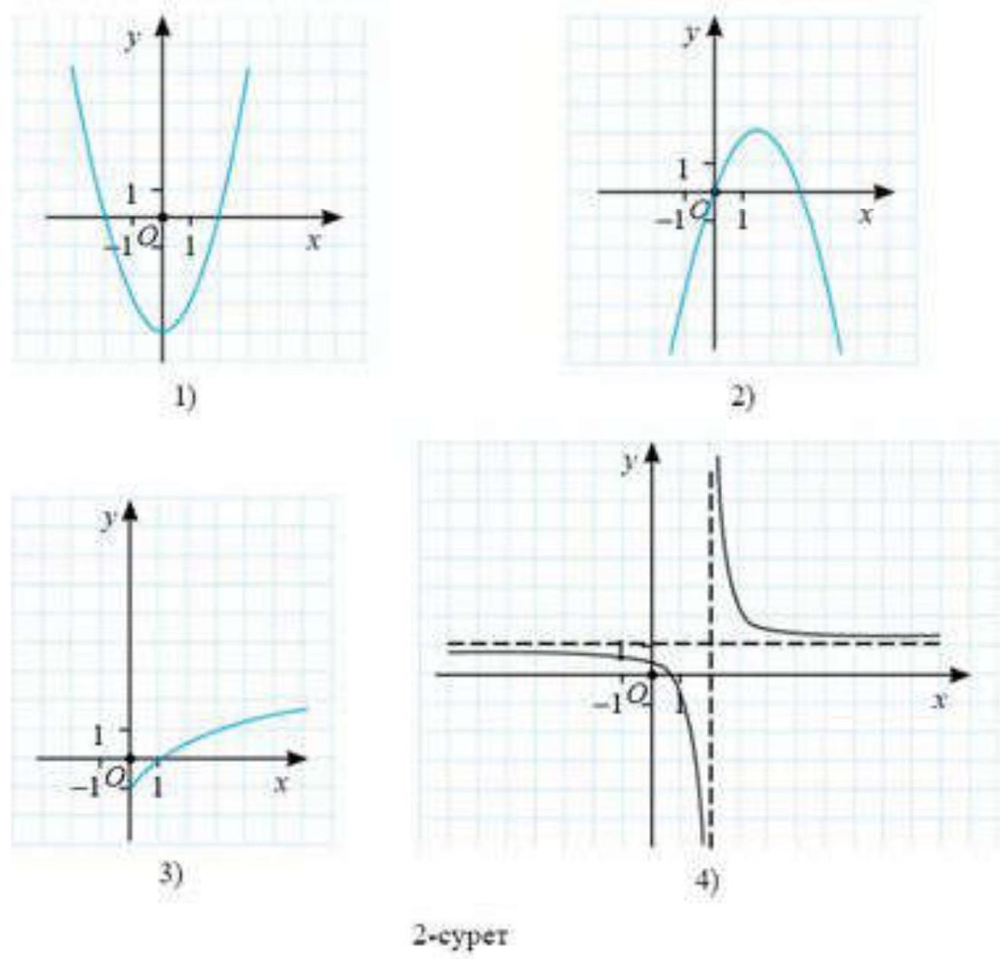
29. 3-суретте квадраттык функциянын графигі кескінделтен. Функшянын:
1) нелдері мен бірсарындылык аралыктарын;
2) танбатұрактылык аралыктарын;
3) мәндер жнынын көрсетіндер.

Симметрия осінін тендеуін жазындар.
30. 4-cypetre $y=a x^{2}+b x+c$ квадраттык функциясының графигі кескінделген және $D=b^{2}-4 a c$. $a$, $b$, с және $D$ сандарынын

\begin{figure}
\includegraphics[alt={},max width=\textwidth]{https://cdn.mathpix.com/cropped/b3f159e3-70ef-4ad9-b9e9-0ac5b230efd7-009.jpg?height=478&width=478&top_left_y=1505&top_left_x=1336}
\captionsetup{labelformat=empty}
\caption{3-cypet}
\end{figure} танбаларын аныктандар .
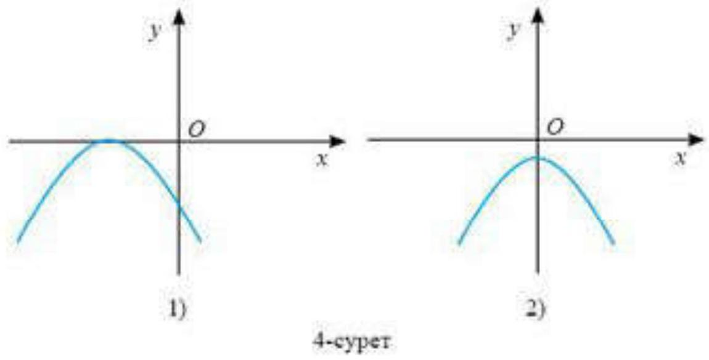
31. 5-суретте $y=a x^{2}+b x+c$ квадраттык функциясынын графигі кескінделген және $D=b^{2}-4 a c$. Акикат тенсіздіктерді көрсетіндер .

\begin{figure}
\includegraphics[alt={},max width=\textwidth]{https://cdn.mathpix.com/cropped/b3f159e3-70ef-4ad9-b9e9-0ac5b230efd7-010.jpg?height=439&width=508&top_left_y=370&top_left_x=285}
\captionsetup{labelformat=empty}
\caption{1)}
\end{figure}

a) $a c>0$;
э) $D c>0$;
б) $D b>0$;
в) $b c>0$;
г) $a D>0$.

\begin{figure}
\includegraphics[alt={},max width=\textwidth]{https://cdn.mathpix.com/cropped/b3f159e3-70ef-4ad9-b9e9-0ac5b230efd7-010.jpg?height=394&width=476&top_left_y=408&top_left_x=1142}
\captionsetup{labelformat=empty}
\caption{2)}
\end{figure}
а) $a b>0$;
ә) $D_{c}>0$;
б) $D b>0$;
в) $b c>0$;
r) $a D>0$.

5-cyper
32. Егер $\left\{a_{n}\right\}$ арифметикалык прогрессиясында :
1) $a_{1}=9,5 ; a_{2}=11,5 ; n=4 ;$
2) $a_{1}=-21 ; a_{2}=-16 ; n=6$;
3) $a_{1}=23 ; a_{2}=19 ; n=5$;
4) $a_{1}=-2,9 ; \quad a_{2}=-4,9 ; \quad n=7$

болса, онда $d$ және $a_{n}$-ді табындар .
33. 1) Егер арифметикалык прогрессиянын бірінші және тертінші мүшелерінін косындысыныи мәні 23-ке, үшінші және алтыншы мүшелерініи косындысыныи мәні 31-ге тен болса, онда онын бірінші мүшесі мен айырымын табындар.
2) Егер геометриялык прогрессиянын бірінші және үшінші мүшелерінін косындысынын мәні 49,2-ге, бірінші және үшінші мүшелерінін айырымынын мәні -15,6-ға тен болса, онда онын бірінші мүшесі мен еселігін табындар.
3) $a_{2}+a_{4}=3,4$ болса, онда арифметикалык прогрессиянын алғашкы бес мүшесінін косындысынын мәнін табындар.
34. 1) $a_{1}=-35 ; a_{n}=-15 ; d=5 ; m=6 ;$
2) $a_{3}=-6,6 ; a_{n}=-7,3 ; \quad d=0,7 ; m=20$ болса, арифмепикалык прогрессиядағы $n$ мен $S_{m}$-ді табындар .
35. 1) $d=-20 ; S_{4}=300 ;$ 2) $d=20 ; S_{6}=60 ;$ 3) $d=25 ; S_{7}=224$ болса, онда арифметнкалык прогресспядағы $a_{1}$-ді табындар .
36. 1) $b_{1}=0,7 ; b_{3}=2,8 ; n=6 ;$ 2) $b_{1}=0,6 ; b_{2}=1,8 ; n=5$;
3) $b_{1}=-0,2 ; b_{2}=1,4 ; n=4$ болса, онда геометриялык прогрессияда $q$, $b_{n}$ және $S_{n}$-ді табындар .
37. 1) $b_{3}=\frac{9}{8} ; q=-\frac{3}{4} ; \quad$ 2) $b_{5}=-16 ; q=\frac{2}{3} ; \quad$ 3) $b_{4}=12,5 ; q=-\frac{5}{6}$ болса, онда теометриялык прогресспядағы $b_{1}$ мен $S_{5}$-ті табындар.
38. 1) $\sqrt{3} ;-1 ; \frac{1}{\sqrt{3}} ; \ldots$;
2) $\sqrt{2}+\sqrt{2}(\sqrt{2}-1)+\ldots$ шексіз геометриялык прогрессиясы мүшелерінін косьндысынын мәнін табындар .
39. Темендегі шексіз перподты бөлшекті жай бөлшек түрінде жазындар:
1) 2 ,(31);
2) 0 ,(103);
3) $2,3(41)$;
4) $45,0(23)$.
40. Санды өрнектін мәнін табындар :
1) $\cos 30^{\circ}-\sin 60^{\circ}+\operatorname{ctg} 45^{\circ}-\operatorname{tg} 60^{\circ} ;$
2) $\sin 210^{\circ}-\cos 240^{\circ}-\operatorname{ctg} 30^{\circ}-\operatorname{tg} 135^{\circ}$;
3) $\cos 45^{\circ}-\operatorname{tg} 45^{\circ}-\sin 135^{\circ}-\operatorname{ctg} 135^{\circ}$;
4) $\sin 360^{\circ}-\cos 30^{\circ}+\operatorname{tg} 210^{\circ}-\operatorname{ctg} 60^{\circ}$;
5) $-2 \cos 720^{\circ}+\operatorname{tg} 30^{\circ}-\operatorname{ctg} 210^{\circ}+\sin 120^{\circ}$;
6) $\operatorname{tg} 0^{\circ}-2 \operatorname{ctg} 90^{\circ}-\sin 0^{\circ}-3 \cos 90^{\circ}$.
41. Есептендер :
1) $2 \sin \frac{\pi}{6}-4 \cos \frac{\pi}{6}+\operatorname{tg} \frac{\pi}{6}-4 \operatorname{ctg} \frac{4 \pi}{3}$;
2) $-3 \cos \frac{\pi}{2}+7 \sin \frac{\pi}{2}-3 \operatorname{ctg} \frac{5 \pi}{4}-5 \operatorname{tg} 0^{\circ}$;
3) $\sqrt{3} \cos \frac{\pi}{6}+\sqrt{3} \operatorname{ctg} \frac{\pi}{3}-11 \operatorname{ctg} \frac{9 \pi}{4}$;
4) $\operatorname{ctg} \frac{\pi}{2}-5 \sin \frac{\pi}{3}+6 \cos \frac{\pi}{3}-\operatorname{tg} \frac{\pi}{6}$.
42. Erep: 1) $\sin \mathrm{a}=0,4$ және $90^{\circ}<\mathrm{a}<180^{\circ}$ болса, онда $\cos \mathrm{a}, \sin 2 \mathrm{a}, \cos 2 \mathrm{a}$;
2) $\cos \mathrm{a}=-0,6$ және $180^{\circ}<\mathrm{a}<270^{\circ}$ болса, онда $\sin \mathrm{a}$, ctg a , tg2 a ;
3) $\operatorname{tg} \mathrm{a}=\sqrt{8}$ және $180^{\circ}<\mathrm{a}<270^{\circ}$ болса, онда $\cos \mathrm{a}, \sin \mathrm{a}, \cos 2 \mathrm{a}$-ны табындар .
43. Erep: 1) $\cos \mathrm{a}=\frac{7}{9}$ және $0^{\circ}<\mathrm{a}<90^{\circ}$ болса, онда $\sin \frac{\alpha}{2}, \cos \frac{\alpha}{2}, \sin \mathrm{a}$; 2) $\sin \mathrm{a}=\frac{\sqrt{2}}{3}$ және $90^{\circ}<\mathrm{a}<180^{\circ}$ болса, онда $\sin \frac{\alpha}{2}, \cos \frac{\alpha}{2}, \operatorname{tg} \mathrm{a}$, $\cos \mathrm{a}$-ны табындар .
44. Erep $\cos \alpha=\frac{\sqrt{15}}{4}, \sin \beta=\frac{1}{8}$ және $\alpha, \beta$ бұрыштары I шпрекке тпісті болса, онда $\cos (\alpha+\beta), \sin (\alpha-\beta), \operatorname{tg}(\alpha+\beta)$-ны табындар.
45. Erep $\sin \alpha=\frac{6}{7}, \sin \beta=\frac{7}{8}$ және $\alpha, \beta$ бұрыштары I шрекке тисті болса, онда $\cos (\alpha-\beta), \sin (\alpha+\beta), \operatorname{tg}(\alpha-\beta)$-ны табындар .
46. Есептендер :
1) $\frac{2 \cos \frac{\pi}{6}-\sqrt{3} \operatorname{tg} 60^{\circ}}{2 \sin \frac{\pi}{6}+\cos 60^{\circ}}$;
2) $\frac{\sqrt{3} \operatorname{ctg} 30^{\circ}-\sqrt{2} \sin \frac{\pi}{4}}{3 \operatorname{tg} 45^{\circ}-2 \cos 0^{\circ}}$ :
3) $\frac{\operatorname{tg} 30^{\circ}+\cos \frac{\pi}{6}}{\sin \frac{\pi}{2}-4 \operatorname{ctg} 45^{\circ}}$;
4) $\frac{\sqrt{2} \sin 45^{\circ}+\sqrt{2} \cos \frac{\pi}{4}}{5 \operatorname{tg} \frac{\pi}{4}-4 \operatorname{ctg} \frac{\pi}{4}}$.
47. Өрнекті ықшамдандар :
1) $\operatorname{tg}\left(\frac{\pi}{2}-\alpha\right) \cdot \operatorname{ctg}(2 p-a) \cdot \cos \left(\frac{\pi}{2}-\alpha\right) \cdot \operatorname{tg}(2 p+a) ;$
2) $\frac{\sin \alpha-\sin 3 \alpha}{\cos \alpha-\cos 3 \alpha}$.
3) $\cos (2 \mathrm{p}-\mathrm{a}) \cdot\left(\operatorname{tg}\left(\frac{3 \pi}{2}-\alpha\right)\right)^{2} \cdot \operatorname{tg}(2 \mathrm{p}+\mathrm{a}) \cdot\left(\operatorname{ctg}\left(\frac{\pi}{2}+\alpha\right)\right)^{2}$;
4) $\frac{\sin ^{2} \alpha-\operatorname{tg}^{2} \alpha}{\cos ^{2} \alpha-\operatorname{ctg}^{2} \alpha}$.
48. α-нын кез келген мүмкін мәнінде берілген өрнектін мәні 2-ге тен болатынын дәлелдендер :
1) $2 \operatorname{tg} a \cdot \operatorname{ctg}(p+a)-2 \sin (-a) \cdot \sin \left(\frac{\pi}{2}-\alpha\right)+\cos \left(360^{\circ}-2 a\right) \cdot \operatorname{ctg}\left(\frac{\pi}{2}-2 \alpha\right)- -2 \cos \left(2 \alpha-\frac{\pi}{2}\right) ;$
2) $2 \cdot\left(0,5-0,5 \cos 4 \alpha+\frac{1}{1+\operatorname{tg}^{2} 2 \alpha}\right)-\left(1-\sin ^{2} 2 \mathrm{a}\right) \cdot \frac{1}{\cos ^{2} 2 \alpha}+$
$$
+\operatorname{ctg} 3 \text { a } \operatorname{ctg}\left(90^{\circ}-3 \text { a }\right) .
$$
49. Өрнекті ыкшамдандар :
1) $2 \operatorname{tg} 9 a \cdot \operatorname{ctg}(p-9 a)+\sin ^{2} \frac{\alpha}{3} \cdot \operatorname{ctg}^{2} \frac{\alpha}{3}+\sin ^{2} \frac{\alpha}{3}$;
2) $2+\left(0,5+0,5 \cos 10\right.$ a): $\left(0,5-0,5 \cos 10\right.$ a) $\cdot \operatorname{tg}^{2}(p-5$ a):
3) $3+\frac{\cos ^{2} \alpha-4 \sin ^{2} \frac{\alpha}{2} \cos ^{2} \frac{\alpha}{2}}{1-8 \sin ^{2} \frac{\alpha}{2} \cos ^{2} \frac{\alpha}{2}}$;
4) $\frac{\sin ^{4} \alpha+2 \sin \alpha \cos \alpha-\cos ^{4} \alpha}{\operatorname{tg} 2 \alpha-1}-1$.
50. Тепе-тендікті дәлелдендер :
1) $\frac{\operatorname{tg}\left(\frac{3 \pi}{2}-4 \alpha\right) \sin (4 \pi-2 \alpha) \cos (-2 \alpha)}{\operatorname{ctg}(-4 \alpha)\left(\cos ^{2} 2 \alpha-\cos ^{2}\left(\frac{\pi}{2}-2 \alpha\right)\right)}=\frac{1}{2} \operatorname{tg} 4 \alpha$;
2) $\frac{\sin \alpha+\sin 3 \alpha+\sin 5 \alpha}{\cos \alpha+\cos 3 \alpha+\cos 5 \alpha}=\operatorname{tg} 3$ a;
3) $\operatorname{tg} a \cdot \operatorname{tg} b+(\operatorname{tg} a+\operatorname{tg} b) \cdot \operatorname{ctg}(a+b)-1=0$;
4) $\frac{\sin (\alpha+\beta)+\sin (\alpha-\beta)}{\cos (\alpha+\beta)+\cos (\alpha-\beta)}=\operatorname{tg} a$;
5) $(\operatorname{tg} a-\operatorname{tg} b) \cdot \operatorname{ctg}(a-b)-\operatorname{tg} a \cdot \operatorname{tg} b=1$;
6) $\frac{\sin \alpha-2 \cos 3 \alpha-\sin 5 \alpha}{\cos \alpha+2 \sin 3 \alpha-\cos 5 \alpha}=-\operatorname{ctg} 3$ a;
7) $\frac{\sin 9 \alpha+\sin 8 \alpha-\sin 7 \alpha-\sin 6 \alpha}{\cos 6 \alpha+\cos 7 \alpha+\cos 8 \alpha+\cos 9 \alpha}=\operatorname{tg} \mathrm{a}$;
8) $\frac{2 \cos \beta+\cos 3 \beta+\cos 5 \beta}{\sin \beta \sin 2 \beta+\cos 3 \beta}=4 \cos 2 \beta$.

\section*{Практикаға бағытталған тапсырмалар}
51. Олжас мектептен 1 км кашактыкта, Айгүл 400 м кашыктыкта тұрады. Айгүлдін бір қадамыныи ұзындығы 60 cm . Олжастын бір кадамынын ұзындығы 75 cm . Олжас 10 с-та 12 кадам. Айгүл 10 кадам жасайды. Келесі сұрактарға жауап беріндер:
1) Айгүл, Олжас мектепке дейін кандай жылдамдыкпен жүреді? Жылдамдыкты м/мин-пен беріндер.
2) Айгүл мен Олжас бір-бірінен кандай кашыктықта тұрады?
3) Айгүл мен Олжастын жакындау жылдамдығын табындар.
4) Егер Олжас пен Айгул уйлерінен бір мезетте шытатын болса, онда канша уакыттан кейін кездеседі? Жауапты бүтінге дейін денгелектендер және түсіндіріндер.
5) Егер Олжас пен Айгүл үйлерінен бір мезетте шығатын болса, онда Олжас мектепке Айгүлден бұрын келуі үшін 10 с-та канша кадам жасауы керек? Жауапты бүтінге дейін денгелектендер және түсіндіріндер.
52. Жолаушы $M$ пунктінен $N$ пунктіне дейін барып, кейін кайтты. 6-суретте жолаушынын козғалыс графигі берілген. Абсшисса осі бойымен козғалыс уақыты, ордината осі бойымен жолдын ұзындығы көрсетілген. Жолаушының қозғалыс графигін кодданьш, келесі сұрактарға жауап беріндер:

\begin{figure}
\includegraphics[alt={},max width=\textwidth]{https://cdn.mathpix.com/cropped/b3f159e3-70ef-4ad9-b9e9-0ac5b230efd7-013.jpg?height=513&width=776&top_left_y=2108&top_left_x=1043}
\captionsetup{labelformat=empty}
\caption{6-сурет}
\end{figure}
1) Жолаушы козғалысынын ен үлкен жыддамдығы неге тен?
2) Жолаушы ен үлкен жылдамдыкпен $M$ пунктінен $N$ пунктіне барып қайтуға канша уакыт жіберген?
3) Жолаушынын $M$ пунктінен $N$ пунктіне дейінгі козғалысынын орташа жьцамдығы неге тен?
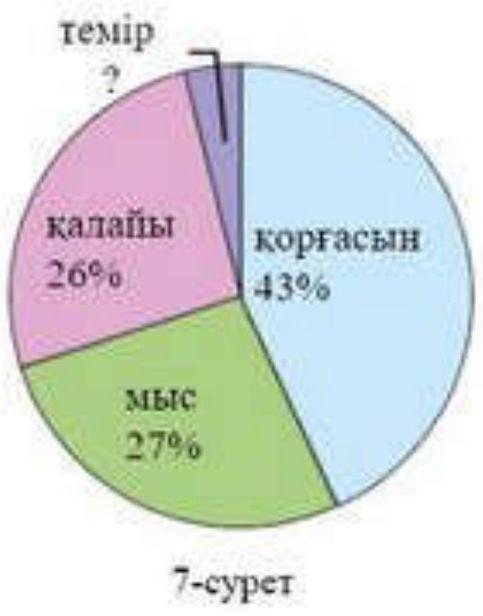
53. Массасы 75 кт коспанын кұрамы 7 -суретте берілген.
1) Коспада канша кнлограмм мыс пен корғасын бар?
2) Коспада канша килограмм темір бар?
3) Қоспа кұрамында темірдін пайыздык шамасы $10 \%$ болуы үшін осы коспаға канша килограмм темір косу керек?
4) Қоспа кұрамында темірдін пайыздык шамасы $10 \%$ болса, онда осы коспа кұрамында калайының пайыздық шамасы кандай болады?
54. Марат әкесімен метро эскалаторымен түсті. Erep Марат козгалыстағы эскалатордын баспалдағында тұратын болса, онда теменге 56 с-та, ал токтап тұрған эскалатормен түсетін болса, онда 42 с-та түсетінін байкады.
1) Қозғалыстағы эскалатордың жылдамдығы токтап тұрған эскалатормен жүріп келе жаткан әкесі мен баласынын жылдамдығынан қанша кем?
2) Егер экесі мен баласы токтап тұрған эскалаторда жүрген жылдамдығымен козғалыстағы эскалатормен жүретін болса, онда олар канша уакытта тементе түседі?
3) Эскалатор жүріп тұрганда Марат жоғарыға 56 с-та кетерілгісі келсе, онда онын жылдамдығы кандай болуы керек?

\begin{figure}
\includegraphics[alt={},max width=\textwidth]{https://cdn.mathpix.com/cropped/b3f159e3-70ef-4ad9-b9e9-0ac5b230efd7-014.jpg?height=542&width=784&top_left_y=2097&top_left_x=1133}
\captionsetup{labelformat=empty}
\caption{Алматы метросы}
\end{figure}
55. 1-кестеде окушылардын килограммен алынған массалары жазылған.

1-кесте

\begin{tabular}{|l|l|l|l|l|}
\hline 57 & 56 & 56 & 58 & 55 \\
\hline 59 & 57 & 58 & 56 & 58 \\
\hline 56 & 58 & 59 & 55 & 59 \\
\hline 57 & 56 & 59 & 57 & 57 \\
\hline 58 & 59 & 56 & 59 & 56 \\
\hline
\end{tabular}

Кестені колданып:
1) вариациялық катарды жазындар;
2) абсолюттік жнілік кестесін және салыстырмалы жнілік кестесін кұрындар;
3) тандау келемі мен арифметикалык ортаны табындар;
4) дисперсияны есептендер.
56. 8-суретте берілген жнілік полигонымен колледж студенттерінін жасына карай топтары керсетілген.
20 жастан кіші студентер тобынын салыстырмалы жнілігін пайыз аркылы көрсетіндер.
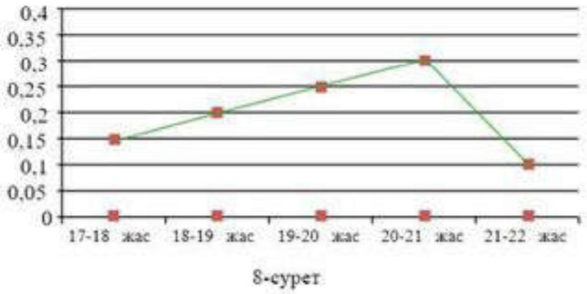

\section*{ФУНКЦИЯ, ОНЫҢ ҚАСИЕТТЕРІ ЖӘНЕ ГРАФИГІ}

\section*{§1. ФУНКЦИЯ}

Функция бойынша білімдерінді терендетесіндер.

> 3
> ТУЙІНДІ ¥ғымдАР
> Функция, аргумент, жиын, аныкталу облысы, мәндер жиыны

\section*{СЕНДЕР БЫПСІНДЕР:}

Сендер функция деп $x$ айнымалысыныи эрбір моніне $y$ айнымалысынын бір ғана мәні сойкес келетін $y$ айнымалысынын $x$ айнымалысына тәуелаіліи айтатыныи білесіндер.
$x$ тәуелсіз айнымалыемныи барлык мәндері функцияныи аныктату облысыи кұрайды. Аныктату облысын $D$ эрпімен белгілейді.
y тәуелді айныматысынын барлык мәндері функцияныи мәндер жнынын кұрайды. Мэндер жныныи $E$ әрпімен белгілейді.

Сандык функция дегеніміз - аныкталу облысы мен мәндер жныны, сандар жныны, әдетте, накты сандар жныны болатын функция.

Анықтама Анықталу облысы $D$ болатын саноык функция деп $D$ жиыныны кез кетген $x$ санына кандай да бір ереже бойыниа $x$-тен тәуелді бір гана у саны койылатын сдйкестікті айтады .

Функцияны латын және грек әріптерімен белгілеу калыптаскан.
Қандай да бір $f$ функциясын карастырайык. Бұл функциянын мәні қайсыбір $x$ санына тәуелді болғандыктан, $f(x)$ деп те жазуға болады .

\section*{СЕНДЕР БІЛЕСІНДЕР:}

Erep $y=f(x)$ болеа, онда $x$ саны - функиянын аргументі, $y$ саны функшияныи $\quad x$ нүктесіндегі мэні деп аталатынын білесіндер.
$f$ функшиясынын аныкталу облысы $D(f)$ деп белгіленеді.
$y=f(x)$ функциясынын аныкталу облысы көрсетілмесе, онда функцияның анықталу облысы ретінде $f(x)$ ернегінін аныкталу облысы алынады.

\section*{МЫСАЛ}
1. $y=\frac{1}{x+2}-\sqrt{2 x-x^{2}+8}$ функииямныи аныкталу облысыи табайык.
Шешуі. Функцияныи аныкталу облысы керсетілмеген, сондыктан ол $\frac{1}{x+2}-\sqrt{2 x-x^{2}+8}$ ернегініи анықталу облысымен бірдей болады. Өрнектіи аныкталу облысы $x$ айнымалысыныи барлык мүмкін болатыи мәндер жнынынан тұралы. Белшектіи белімі нелден езгеше болганда гана $\frac{1}{x+2}$ ернегінин

магынасы болады жэие түбір ішіндегі ернек теріс емес болганда арифметикалык квадрат түбірдіи магынасы бар. Сондыктан $y=\frac{1}{x+2}-\sqrt{2 x-x^{2}+8}$ функциясыныи аныктату облысын табу ушін $\left\{\begin{array}{l}x+2 \neq 0, \\ 2 x-x^{2}+8 \geqslant 0\end{array}\right.$ тенсіздіктер жуйесін шытару керек. Бүдан $\left\{\begin{array}{l}x \neq-2, \\ (x+2)(x-4) \leqslant 0 .\end{array}\right.$
Сонда $D(J)=(-2 ; 4]$ (1.1-сурет).

\begin{figure}
\includegraphics[alt={},max width=\textwidth]{https://cdn.mathpix.com/cropped/b3f159e3-70ef-4ad9-b9e9-0ac5b230efd7-017.jpg?height=100&width=440&top_left_y=497&top_left_x=1356}
\captionsetup{labelformat=empty}
\caption{1.1-cyper}
\end{figure}

Жауабы : $D(f)=(-2 ; 4]$.

CEHAEP БІЛЕСІН,АЕР:
$y$-тін кабылдайтын бартык санчар жиыны $y=f(x)$ функциясыныи мандер жиыны (облысы) деп аталатыныи бітесіндер.
$f$ функциясының мәндер жиыны $E(f)$ деп белгіленеді.
МЫСАЛ
2. $y=f(x)$ функцияеы берілген.
$$
f(x)=\left\{\begin{array}{l}
-\frac{2}{x}, \text { мұндагы }-4 m_{x} m_{-1} \\
x+3, \text { мундағы }-1<x<2, \text { функиижы үшін: } \\
4 x-x^{2}, \text { мұндағы } 2 m_{x} m_{4}
\end{array}\right.
$$
1) $f(-2), f(1), f(2)$ мәндерін есептейік;
2) $D(f)$ және $E(f)$-ні табайык.

Шешуі. 1) -2 саны [-4; -1] сан аралығына тиісті болгандыхтан. $f(-2)$ мәнін табу ушіи $f(x)=-\frac{2}{x}$ формуласыи колданамыз. Сонда $f(-2)=1$. Тура осылай $f(1)=4, f(2)=4$ аламыз. Оны графиктен де керуге болады (1.2-сурет).
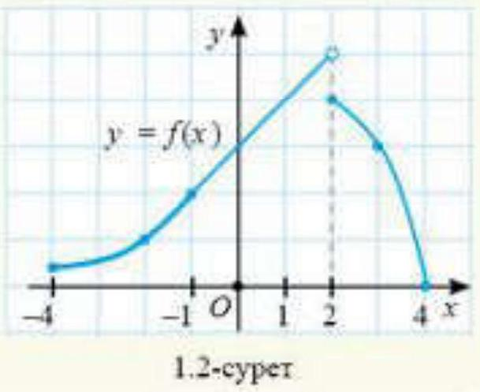

\section*{ТЧСІНДІРІНДЕР}
$y=f(x)$ функциясынын графигі калай салынганын түсіндірінчер. мұндағы $f(x)=\left\{\begin{array}{l}-\frac{2}{x}, \text { мундагы }-4 \mathrm{~m}_{x} \mathrm{~m}_{-1}, \\ x+3, \text { мұндагы }-1<x<2, \\ 4 x-x^{2}, \text { мұндағы } 2 \mathrm{~m}_{x} \mathrm{~m}_{4} .\end{array}\right.$
$D(f)$ аныкталу облысы $[-4 ;-1],(-1 ; 2)$ және $[2 ; 4]$ сан аралыктарынан тұралы. Оларды біріктіріп. [-4; 4] сан аралығыи аламыз. Демек. $D(f)=[-4: 4]$.
$E(f)$ мэндер жныныи табу ушін $y=f(x)$ функциясыныи графичіи кодданамыз (1.2-cypet), Сонда $E(\mathcal{N})=[0 ; 5)$.

Жауабы: 1) $f(-2)=1, f(1)=4, f(2)=4$;
2) $D(f)=[-4 ; 4] . E(f)=[0 ; 5)$.
1. Кандай сандык функшяларды білесіндер? Ол функцияларды атандар және олардын эрқайсысы үшін аныкталу облысы мен мэндер жнынын керсетіндер.
2. Сандык функциянын аныкталу облысы бірнеше саннан тұруы мүмкін бе?
3. Сандык функшиянын мәндер жныны: 1) сан түзуі: 2) сан сәулесі болуы мүмкін бе? Мүмкін болса, осындай функцияларға мысал келтіріндер.

\section*{Жаттығулар}

A
Темендегі функииялардын аныкталу облысын табындар (1.1-1.5) :
1.1. 1) $y=3 x+7$;
2) $y=5 x-0,9$;
з) $y=8-2 x$;
4) $y=-1,4 x+13$.
1.2. 1) $y=5 x^{2}$;
2) $y=-7 x^{2}$;
3) $y=x^{2}-9$;
4) $y=-x^{2}+4,2$.
1.3.
1) $y=x^{2}+\frac{1}{x}$;
2) $y=x-\frac{3}{x+2}$;
3) $y=\frac{5}{x}+\frac{7}{x+2}$;
4) $y=\frac{x}{2 x-3}+x^{2}$.
1.4.
1) $y=\frac{1}{x^{2}+2 x}$;
2) $y=\frac{1}{7-x^{2}}$;
3) $y=\frac{4}{5 x^{2}+0,6}$;
4) $y=-\frac{8}{9 x-4,5}$.
1.5.
1) $y=\sqrt{x+11}$;
2) $y=\sqrt{x-23}$;
3) $y=\sqrt{19+x}$;
4) $y=\sqrt{10-x}$.
1.6. Анықталу облысы: 1) $(-\infty ;+\infty) ;$ 2) $(-\infty ; 0]$; 3) $[-2 ;+\infty)$;
4) $(-\infty ;-6) \cup(-6 ;+\infty)$ жныны болатын $y=f(x)$ функиясынын формуласын жазындар .

Темендегі функциялардын
мәндер жнынын табындар (1.7-1.10):
1.7
1) $y=7-1.4 x$;
2) $y=-9+3 x$;
3) $y=\frac{7}{1,2 x-6}$;
4) $y=-\frac{1}{4,8-4 x}$.
1.8
1) $y=x^{2}-9 x$;
2) $y=3 x-2 x^{2}$;
3) $y=x^{2}-7 x+12$;
4) $y=30-11 x-x^{2}$.
1.9. 1) $y=2+\sqrt{x}$;
2) $y=-\sqrt{x}$;
3) $y=-\sqrt{x}+10$;
4) $y=-2,3-\sqrt{x}$.
1.10.
1) $y=|x|+4$;
2) $y=|x|-11$;
3) $y=6-|x|$;
4) $y=-|x|-2$.
1.11. 1.3-суреттегі графикті колданып функциянын аныкталу облысы мен мәндер жнынын табындар:
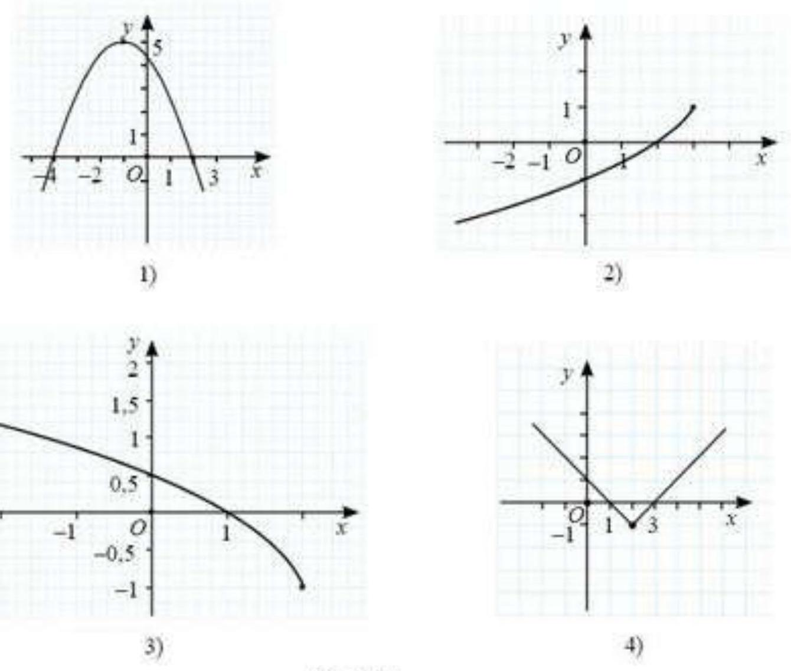
1.3-cypet

Темендегі функшилардын
аныкталу облысын табындар
(1.121.13):
1.12.
1) $y=\frac{15}{\sqrt{19+x}}$;
2) $y=-\frac{21}{\sqrt{x-17}}$;
3) $y=\frac{22}{\sqrt{9 x-12}}$;
4) $y=-\frac{x}{\sqrt{36-1,8 x}}$.
1.13. 1) $y=\frac{\sqrt{x+11}}{\sqrt{18+x}}$;
2) $y=\frac{\sqrt{x-1,3}}{\sqrt{1,2+x}}$;
3) $y=\frac{\sqrt{25-2 x}}{\sqrt{1,6+0,4 x}}$;
4) $y=\frac{\sqrt{4,2-0,7 x}}{\sqrt{9 x-2,7}}$.

\section*{B}

Төмендегі функциялардын 1.18):
1.14.
1) $y=\frac{3}{(x+4)(x-5)}$;
2) $y=\frac{5}{(3 x+1)(7 x-2)}$;
3) $y=\frac{10}{(6-5 x)(9 x-2)}$;
4) $y=\frac{8}{(11 x+2)(10 x+7)}$;
5) $y=\frac{x}{x^{2}+0,7 x-0,3}$;
6) $y=\frac{3 x}{x^{2}-0,3 x-0,7}$;
7) $y=\frac{x-2}{1,56+2,5 x+x^{2}}$;
8) $y=\frac{3-x}{-1+12 x-27 x^{2}}$.
1.15.
1) $y=\frac{2}{(x-4)\left(x^{2}-8 x+12\right)}$;
2) $y=\frac{4}{(x+0,2)\left(x^{2}+0,4 x+0,03\right)}$;
3) $y=\frac{1}{(3 x-1)\left(20 x^{2}-23 x+6\right)}$;
4) $y=\frac{2}{(6 x+1)\left(20 x^{2}-7 x-3\right)}$.
1.16.
1) $y=\frac{\sqrt{x-9}}{x^{2}-7 x+10}$;
2) $y=\frac{\sqrt{11+x}}{x^{2}-3 x-10}$;
3) $y=\frac{\sqrt{1-x}}{6+6,2 x+x^{2}}$ :
4) $y=\frac{\sqrt{x+4}}{3-14 x-5 x^{2}}$.
1.17.
1) $y=\sqrt{\frac{5 x+4}{7-8 x}}$;
2) $y=\sqrt{\frac{9 x-1}{16-6 x}}$;
3) $y=\sqrt{\frac{x+1}{x^{2}-4}}$;
4) $y=\sqrt{\frac{9-x^{2}}{2-x}}$.
1.18.
1) $y=\frac{\sqrt{2 x-13}}{\sqrt{x^{2}-12 x+20}}$;
2) $y=\frac{\sqrt{4-8 x}}{\sqrt{x^{2}-4,5 x-9}}$;
3) $y=\frac{\sqrt{22-11 x}}{\sqrt{-21+4 x+x^{2}}}$;
4) $y=\frac{\sqrt{18+6 x}}{\sqrt{40-3 x-x^{2}}}$.
1.19. Берілген функциялардын мәндер жнынын табындар:
1) $y=|x+10|+5$;
2) $y=4-|x-4|$;
з) $y=|x-1|+2$;
4) $y=3-|x+3|$;
5) $y=|x+9|+x$;
6) $y=|x-9|+x$;
7) $y=|x-7|+6 x$;
8) $y=|x-4|+3 x$.
1.20. 1.4-суретте аныкталу облысы $[a ; b]$ сандық кесінді болатын функциялардын графиктері берілген. Графикті колданып функшиянын мәндер жиынын табындар.

\begin{figure}
\includegraphics[alt={},max width=\textwidth]{https://cdn.mathpix.com/cropped/b3f159e3-70ef-4ad9-b9e9-0ac5b230efd7-021.jpg?height=520&width=743&top_left_y=447&top_left_x=242}
\captionsetup{labelformat=empty}
\caption{1)}
\end{figure}

\begin{figure}
\includegraphics[alt={},max width=\textwidth]{https://cdn.mathpix.com/cropped/b3f159e3-70ef-4ad9-b9e9-0ac5b230efd7-021.jpg?height=525&width=725&top_left_y=1107&top_left_x=246}
\captionsetup{labelformat=empty}
\caption{3)}
\end{figure}

\begin{figure}
\includegraphics[alt={},max width=\textwidth]{https://cdn.mathpix.com/cropped/b3f159e3-70ef-4ad9-b9e9-0ac5b230efd7-021.jpg?height=506&width=665&top_left_y=459&top_left_x=1101}
\captionsetup{labelformat=empty}
\caption{2)}
\end{figure}

\begin{figure}
\includegraphics[alt={},max width=\textwidth]{https://cdn.mathpix.com/cropped/b3f159e3-70ef-4ad9-b9e9-0ac5b230efd7-021.jpg?height=519&width=659&top_left_y=1110&top_left_x=1107}
\captionsetup{labelformat=empty}
\caption{4)}
\end{figure}
1.4-cyper

\section*{C}
1.21. Функииянын мәндер жнынын табындар:
1) $y=x^{2}-9|x|+x+7$;
2) $y=x^{2}+11 x-|x|+16$.
1.22. Функцияныи аныкталу облысын табындар:
1) $y=\sqrt{\frac{x^{2}-25}{x^{2}-4 x+12}}$;
2) $y=\sqrt{\frac{36-x^{2}}{x^{2}-4 x-32}}$.
1.23. а параметрінін әрбір мәні үшін:
1) $y=a x^{2}-7 x$;
2) $y=4 x-a x^{2}$;
3) $y=|x+15|+a x$;
4) $y=|x-21|+a x$

функциясынын мәндер жиынын табындар.
1.24. $y=\sqrt{x-5}+\sqrt{a x+9}$ функциясынын аныкталу облысы: 1) сандык сәуле; 2) сандык кесінді: 3) барлык накты сандар жныны; 4) бір ғана сан; 5) бос жнын болатындай а параметрінін барлык мәндерін табындар.

\section*{ХАБАРЛАМА ДАЙЫНДАНДАР}
1.25. Функция ұғымы математиканың баска да ұғымдары сияқты бірден қалыптасқан жок, ұзак даму жолынан өті.
"Функция" термині алғашкы рет 1692 жылы
Г. Лейбниц еңбегінде кездеседі
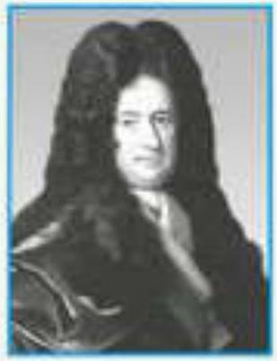

Готфрид Вильгельм Лейбниц (1646-1716)

Функцияның ен алғашқы жалпы анықтамасы
1718 жылы И. Бернулли енбегінде кездеседі
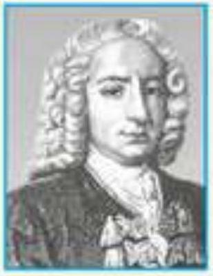

Иоганн Бернулли (1667-1748)

Қазірrі кездегі колданыстағы функциянын анықтамасын 1837 жылы
П. Дирихле берген
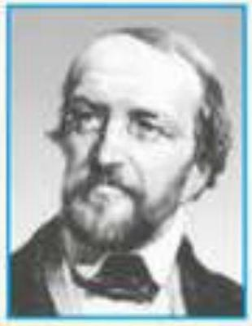

Дирихле Петер Густав Лежен (1805-1859)

\section*{КАИТАЛАУ}
1.26. $\left(\frac{3 b}{a^{2}-a b}+\frac{4 a}{b^{2}-a b}\right) \cdot\left(\frac{a b}{\sqrt{3} b-2 a}+\frac{b^{2}}{2 a-\sqrt{3} b}\right): \frac{\sqrt{3} b+2 a}{a}=1$ тепе-тендігін дәлелдендер.
1.27. Қыскартылмайтын белшектін алымы белімінен 1-ге кем. Егер берілген белшекке езара кері белшекті косса, онда олардын косындысынын мәні $\frac{113}{56}$ болады. Бастапкы белшекті табындар.
1.28. $\frac{x^{2}-4}{x^{2}-5 x+6} \mathrm{~m} 0$ тенсіздігін канағаттандыратын ен кіші және ен үлкен бүтін сандарды табындар.

\section*{ЖАНА БІЛІМДІ МЕңГЕРУГЕ АРНАЛҒАН ТІРЕК ҰҒЫМДАР}

Функция, ареумент, функцияныи анықтату облысы, функциянын мәндер жныны, функциянын графигі, кесте.

\section*{§2. ФУНКЦИЯНЫН БЕРІЛУ ТӘСІЛДЕРІ}

Функцияны беру тәсілдері туралы білімдерінаі терендетесіндер.

\section*{ТУЙІНДІ ҰғымдАР}

Функция, тәсіл, аналитикалык тәсіл, баяндау тәсілі, графиклен беру, кестемен беру

\section*{СЕНДЕР БІЛЕСІН,АЕР:}

Функцияны беру дегеніміз аргументтін берілген мэндері үшін функцияныи сәйкес мәндерін катай табуга болатынын керсету екеніи бллесіндер.
Функцияныи формуламен берілу тосілі анатитикатык тасіт деп аталады.

Аналитикалык тәсіл $x$ аргументінін әрбір сандык мәні бойынша оған сәйкес $y$ функшясынын сандык мәнін (дәл немесе кандай да бір дәлдікпен алынған) табуға мүмкіндік береді.

\section*{ТЧСІНДІРІНДЕР}
$y^{2}+x^{2}=9$ және $|y|=x$ формулалары неліктен функцияны бермейлі?
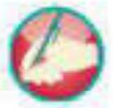

Аналитикалық тәсілмен берілген $y=k x+b ; y=\frac{k}{x}, k \neq 0 ; y=x^{2}$ функциялары калай аталатынын еске түсіріндер.

Егер $x$ пен $y$-тін арасындағы тәуелділік формуламен, яғни $y=f(x)$ түрінде берілсе, онда функция х-ке катысты айкындагасн турде берілген дейді.

Егер $x$ және $y$ арасындағы тәуелділік $F(x ; y)=0$ түріндегі тендеумен берілсе, яғні формула $y$ аркылы өрнектелмесе, онда $y=f(x)$ функциясы ай⿻心ндагмаган турде берілген деїді.

Функция езінін аныкталу облысынын эртүрлі белігінде әртүрлі формулалармен берілуі мүмкін.

Мысалы, $y=\left\{\begin{array}{l}3 x, \text { мұндағы } x \mathrm{~m} 0, \\ 1, \text { мұндағы } x>0 .\end{array}\right.$
Аналитикалык тәсілмен берілген функция параметрмен ( $x$ және $y$ айнымалылары $t$ параметрімен өрнектелген) берілуі мүмкін. Мысалы.
$$
\left\{\begin{array}{l}
x=t, \\
y=t^{2} .
\end{array}\right.
$$

Аналитикалык тәсіл - функцияны берудін ен кен тараған түрінін $б а р і$.

Аныкталу облысынан алынған кез келген $x$ үшін функциянын мәнін есептеу мүмкіндігінін болуы функциянын аналитикалык тәсілмен берілуінін негізгі артыкшылығы болып табылады.

\section*{СЕНДЕР БІЛЕСІНДЕР:}

Кесте аркылы берілгеи аргументтіи мәніие сәйкес функиияныи мәнін табуга болатындыктан. функцияны кестемен берузе болатынын білесіндер.

Кестемен беру тәсілінде аргументін кейбір мәндеріне сәйкес функщияныи мәндері табылады. Бұл тәсіл функцияныи аныкталу облысы шектелген жнын болғанда ғана колданылады.

Функцияны кесте аркылы беру тәсілі косымша елшемдер мен есептеулер жүргізбей, бірден накты мәндерді аныктауға мүмкіндік береді. Кейбір жағдайларда кесте функцияны толык аныктамайды, оны аргументтін кейбір мәндері үшін ғана аныктайды және аргументтін өзгеруіне карай функциянын өзгеруін көрнекі етпейді.

\section*{ТУСІНДІРІНДЕР}

Темендегі кестелердін кайсысы функцияны береді, кайсысы функцияны бермейді?

\begin{table}
\captionsetup{labelformat=empty}
\caption{2-secme}
\begin{tabular}{|c|c|c|c|}
\hline$x$ & 1 & 2 & 3 \\
\hline$y$ & 0.5 & 1 & 0.5 \\
\hline
\end{tabular}
\end{table}

\begin{table}
\captionsetup{labelformat=empty}
\caption{3-xecme}
\begin{tabular}{|c|c|c|c}
\hline$x$ & -1 & -2 & -1 \\
\hline$y$ & -1 & 2 & 1 \\
\hline
\end{tabular}
\end{table}

Функцияны графпктік тәсілмен беру ен көрнекі тәсіл болып табылады.

\section*{СЕНДЕР БЫАЕСІЯДЕР:}
$y=f(x)$ функциасынын дікті канагаттандыратын айтатынын білесіндер.

графиеі деп коордннаталары берілген тенжазыктыктыи барлык нүктелер жнынын

\section*{ТҮСІНДІРІНДЕР}
1) 2.1-суретте кандай функциятардыи графиктері кескіиделген?

\begin{figure}
\includegraphics[alt={},max width=\textwidth]{https://cdn.mathpix.com/cropped/b3f159e3-70ef-4ad9-b9e9-0ac5b230efd7-024.jpg?height=563&width=1064&top_left_y=2003&top_left_x=552}
\captionsetup{labelformat=empty}
\caption{2.1-cyper}
\end{figure}
2) Темендегі графиктер неліктен функшияны бермейді (2.2-сурет)?

\begin{figure}
\includegraphics[alt={},max width=\textwidth]{https://cdn.mathpix.com/cropped/b3f159e3-70ef-4ad9-b9e9-0ac5b230efd7-025.jpg?height=387&width=1093&top_left_y=365&top_left_x=436}
\captionsetup{labelformat=empty}
\caption{2.2-cyper}
\end{figure}

Функцияны берудін графиктік тәсілі аргументтін барлык мәндерін табуға мүмкіндік бермейді. Бірак баска тәсілдерге карағанда артыкшылығы - ол онын көрнекілігінде.

Функшины берудін графиктік тәсілі техникада және физнкада жні кодданылады.

\section*{ТЧСІНДІРІНДЕР}

График бойынша функцияныи анықталу облысын калай табуга болады?

Функциянын тұжырым аркылы берілуін баяндау maciti деп атайды.
1. Бұл тәсілге Дирихле функциясы класснкалык мысал болып табыталы: "Егер $x$ - рацнонал сан болса, онда функцияныи мәні 1-ге тен: егер $x$ - пррацнонал сан болса, онда функцияныи мәиі 0-re тен".
2. Біркалыпты козгалыс кезінде козалыс басталтан уакытан бастап жүріп откен жол уакытқа тура пропоршонал болатыны физика курсынан белгілі. Бұл сейлем жолды уакытка тәуелді сывыктык функиия ретінде сипаттайды.

Функцияныи баяндау тәсілінін артықшылығы аналитикалык тәсілмен беруге болмайтын функцияларды беру мүмкіндігі болып табылады.
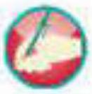

Функция баяндау тәсілімен берілген: түзу координаталар осін (0; 3) және (-1,5; 0) нүктелерінде киып өтеді. Осы функцияны графиктік тәсілмен көрсетіндер.
1. Кандай жагдайда функцияны кесте аркылы берген ынгайлы?
2. Квадраттык функцинны аналитикатык, графиктік, баяндау тосілдерімен жэне кесте аркылы беріндер.

\section*{Жаттығулар \\ A}
2.1. 2.3-суреттегі графиктердін кайсысы функцияныи графигі болады?

\begin{figure}
\includegraphics[alt={},max width=\textwidth]{https://cdn.mathpix.com/cropped/b3f159e3-70ef-4ad9-b9e9-0ac5b230efd7-026.jpg?height=440&width=649&top_left_y=479&top_left_x=386}
\captionsetup{labelformat=empty}
\caption{1)}
\end{figure}

\begin{figure}
\includegraphics[alt={},max width=\textwidth]{https://cdn.mathpix.com/cropped/b3f159e3-70ef-4ad9-b9e9-0ac5b230efd7-026.jpg?height=424&width=659&top_left_y=488&top_left_x=1119}
\captionsetup{labelformat=empty}
\caption{2)}
\end{figure}

\begin{figure}
\includegraphics[alt={},max width=\textwidth]{https://cdn.mathpix.com/cropped/b3f159e3-70ef-4ad9-b9e9-0ac5b230efd7-026.jpg?height=369&width=645&top_left_y=991&top_left_x=388}
\captionsetup{labelformat=empty}
\caption{3)}
\end{figure}

\begin{figure}
\includegraphics[alt={},max width=\textwidth]{https://cdn.mathpix.com/cropped/b3f159e3-70ef-4ad9-b9e9-0ac5b230efd7-026.jpg?height=364&width=643&top_left_y=991&top_left_x=1121}
\captionsetup{labelformat=empty}
\caption{4)}
\end{figure}

2.3-cyper
2.2. Графигі 2,4-суретте кескінделген функцияныи формуласын жазындар.

\begin{figure}
\includegraphics[alt={},max width=\textwidth]{https://cdn.mathpix.com/cropped/b3f159e3-70ef-4ad9-b9e9-0ac5b230efd7-026.jpg?height=442&width=547&top_left_y=1562&top_left_x=443}
\captionsetup{labelformat=empty}
\caption{1)}
\end{figure}

\begin{figure}
\includegraphics[alt={},max width=\textwidth]{https://cdn.mathpix.com/cropped/b3f159e3-70ef-4ad9-b9e9-0ac5b230efd7-026.jpg?height=437&width=559&top_left_y=1567&top_left_x=1155}
\captionsetup{labelformat=empty}
\caption{2)}
\end{figure}

\begin{figure}
\includegraphics[alt={},max width=\textwidth]{https://cdn.mathpix.com/cropped/b3f159e3-70ef-4ad9-b9e9-0ac5b230efd7-026.jpg?height=490&width=533&top_left_y=2103&top_left_x=452}
\captionsetup{labelformat=empty}
\caption{3)}
\end{figure}

\begin{figure}
\includegraphics[alt={},max width=\textwidth]{https://cdn.mathpix.com/cropped/b3f159e3-70ef-4ad9-b9e9-0ac5b230efd7-026.jpg?height=380&width=642&top_left_y=2213&top_left_x=1133}
\captionsetup{labelformat=empty}
\caption{4)}
\end{figure}
2.3. Функция $s=3 t^{2}+9 t$ формуласымен берілген.
1) $s(1) ; s(2) ; s(3,5) ; s(5)$-ті табындар;
2) erep $s=210 ; s=120$ болса. онда $t$-ны табындар.
2.4. Функция $s=1,5 t^{2}+6 t$ формуласымен берілген.
1) $s(0,4) ; s(1,6) ; s(4) ; s(6)$-ны табындар:
2) егер $s=18 ; s=72$ болса, онда $t$-ны табындар.
2.5. 2.5-суретте кескінделген функциянын графигін колданып, оның: 1) аныкталу облысын; 2) мәндер жнынын: 3) ордината осімен киылысу нүктесін; танбатұрактылык аралыктарын табындар.

\begin{figure}
\includegraphics[alt={},max width=\textwidth]{https://cdn.mathpix.com/cropped/b3f159e3-70ef-4ad9-b9e9-0ac5b230efd7-027.jpg?height=373&width=380&top_left_y=863&top_left_x=434}
\captionsetup{labelformat=empty}
\caption{1)}
\end{figure}

\begin{figure}
\includegraphics[alt={},max width=\textwidth]{https://cdn.mathpix.com/cropped/b3f159e3-70ef-4ad9-b9e9-0ac5b230efd7-027.jpg?height=396&width=593&top_left_y=840&top_left_x=1009}
\captionsetup{labelformat=empty}
\caption{2)}
\end{figure}

\begin{figure}
\includegraphics[alt={},max width=\textwidth]{https://cdn.mathpix.com/cropped/b3f159e3-70ef-4ad9-b9e9-0ac5b230efd7-027.jpg?height=390&width=579&top_left_y=1427&top_left_x=319}
\captionsetup{labelformat=empty}
\caption{3)}
\end{figure}

\begin{figure}
\includegraphics[alt={},max width=\textwidth]{https://cdn.mathpix.com/cropped/b3f159e3-70ef-4ad9-b9e9-0ac5b230efd7-027.jpg?height=471&width=567&top_left_y=1343&top_left_x=1030}
\captionsetup{labelformat=empty}
\caption{4)}
\end{figure}

2.5-cyper
2.6. $y=f(x)$ функциясы $[a ; b]$ кесіндісінде аныкталған және кестемен берілген. 4-7-кестелерді колданып функциянын формуласын жазындар. Онын графигін салындар.

4-кесте
1)

\begin{tabular}{|c|r|r|l|l|l|l|l}
\hline$x$ & 0 & 1 & 2 & 3 & 4 & 5 & 6 \\
\hline$y$ & -2 & -1 & 0 & 1 & 2 & 3 & 4 \\
\hline
\end{tabular}

5-кесте

2) \begin{tabular}{|c|c|c|c|c|c|c|c}
\hline$x$ & -2 & -1 & 0 & 1 & 2 & 3 & 4 \\
\hline$y$ & -1 & $-0,5$ & 0 & 0,5 & 1 & 1,5 & 2 \\
\hline
\end{tabular}

6-кесте
3)

\begin{tabular}{|c|c|c|c|c|c|c|c}
\hline$x$ & -4 & -3 & -2 & -1 & 0 & 1 & 2 \\
\hline$y$ & 9 & 2 & -3 & -6 & -7 & -6 & -3 \\
\hline
\end{tabular}

7-кесте
4)

\begin{tabular}{|c|c|c|c|c|c|c|c}
\hline$x$ & -3 & -2 & -1 & 0 & 1 & 2 & 3 \\
\hline$y$ & 10 & 5 & 2 & 1 & 2 & 5 & 10 \\
\hline
\end{tabular}

\section*{B}
2.7. $f(x)=x^{2}-4 x+3$ болсын, $y=f(-x), y=f(x+2), y=f(1-x)$ функцияларын аналитикалык тәсілмен беріндер. Әр функшянын: 1) мәндер жиынын; 2) ордината осімен кнылысу нүктесінін координаталарын: 3) нелдерін табындар.
2.8. $f(x)=-x^{2}+x+2$ болсын. $y=f(x+2), y=f(x)-3, y=5-f(x)$ функцияларын аналитикалык тәсілмен беріндер. Әр функциянын: 1) мәндер жиынын; 2) ордината осімен кнылысу нүктесінін координаталарын; 3) недерін табындар.
2.9. Графигі 2.6-суретте кескінделген функциянын формуласын жазындар.

\begin{figure}
\includegraphics[alt={},max width=\textwidth]{https://cdn.mathpix.com/cropped/b3f159e3-70ef-4ad9-b9e9-0ac5b230efd7-028.jpg?height=1079&width=1272&top_left_y=1555&top_left_x=424}
\captionsetup{labelformat=empty}
\caption{2.6-сурет}
\end{figure}

Төмендегі функциялардын графигін салындар (2.10-2.11) :
2.10. 1) $y=\left\{\begin{array}{l}x+6, \text { мұндағы } x<-3, \\ -x, \text { мундағы } x \mid-3 ;\end{array}\right.$
2) $y=\left\{\begin{array}{l}2 x, \text { мұндағы } x>4, \\ 2+x, \text { мундағы } x \mathrm{~m}_{4} ;\end{array}\right.$
3) $y=\left\{\begin{array}{l}3 x-1, \text { мұндағы } x \mathrm{~m} 0, \\ -4 x-1, \text { мұндағы } x<0 ;\end{array}\right.$
4) $y=\left\{\begin{array}{l}12-x, \text { мұндағы } x>3, \\ x^{2}, \text { мүндағы } x \mathrm{~m} 3 .\end{array}\right.$
2.11. 1) $y=\left\{\begin{array}{l}x+4, \text { мұндағы } x<-1, \\ 3 x^{2}, \text { мұндағы } x \mid-1 ;\end{array}\right.$
2) $y=\left\{\begin{array}{l}5 x^{2}, \text { мундағы } x>1, \\ 6-x, \text { мундағы } x \mathrm{~m}_{1} \text {; }\end{array}\right.$
3) $y=\left\{\begin{array}{l}\frac{2}{x}, \text { мундағы } x \text { m }-2, \\ 0,5 x, \text { мундағы } x>-2 ;\end{array}\right.$
4) $y=\left\{\begin{array}{l}-\frac{4}{x}, \text { мүндағы } x>4, \\ (0,25 x)^{2}, \text { мұндағы } x \mathrm{~m}_{4} .\end{array}\right.$
2.12. 1) Абсщисса мен ординатанын косындысынын мәні екі еселенген абсциссаға тен: 2) оршната мен абсциссаныи айырымынын мәні екі еселенген ординатаға тен; 3) абсцисса мен үш еселенген ординатанын косындысынын мәні үш еселенген абсшиссаға тен: 4) ордината мен абсшиссаныи айырымынын мәні үш еселентен ординатаға тен болатын координаталык жазыктыктын нүктелер жнынын тендеумен жазындар.
2.13. 1) Абсцисса мен екі еселенген ординатанын косындысынын мәні 8-re; 2) ордината мен екі еселенген абсшиссанын айырымынын мәні 6-ға: 3) ордината мен абсциссаныи косындысынын мәні абсциссанын квадратына; 4) ордината мен үш еселенген абсциссанын айырымынын мәні абсциссанын екі еселенген квадратына тен болатын коорднаталық жазыктыктын нүктелер жнынын тендеумен жазындар.

\section*{C}
2.14. Графигі 2.7-суретте кескінделген функцияныи формуласын жазындар:

\begin{figure}
\includegraphics[alt={},max width=\textwidth]{https://cdn.mathpix.com/cropped/b3f159e3-70ef-4ad9-b9e9-0ac5b230efd7-029.jpg?height=492&width=1216&top_left_y=2165&top_left_x=390}
\captionsetup{labelformat=empty}
\caption{2.7-cyper}
\end{figure}
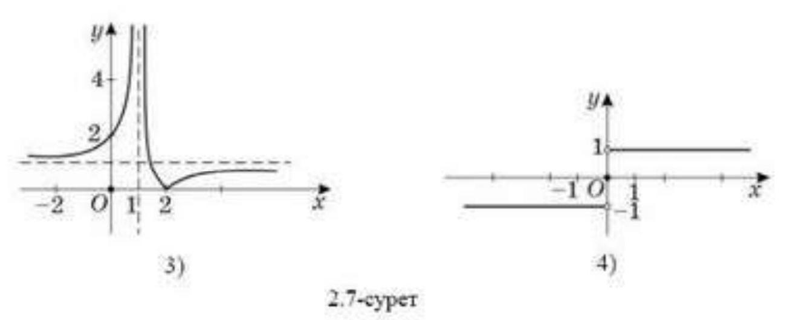
$x$ саныным бүтіи белігі, ягин $x$-тен артык болмайтыи ен улкен бүтіи сан $[x]$ символымен белгіленеді.
$x$ санынын белшек белігі $\{x\}$ символымен белгіленелі.
$$
\{x\}=x-[x]
$$
2.15. Функцияныи графитін салындар:
1) $y=[x+5]$;
2) $y=[x-7]$;
3) $y=2+[x+4]$;
4) $y=\{x\}+1$;
5) $y=4-\{x\}$;
6) $y=6+\{-x\}$;
7) $y=[2 x]+1$;
8) $y=\{2 x\}$;
9) $y=\{0,5 x\}+1$.
2.16. $x$-тін $5 ; 7.5 ;-44 ; 1,9(3) ; \sqrt{10}: 5 \sqrt{5}-\sqrt{3}: \frac{\sqrt{180}-\sqrt{20}}{\sqrt{125}}$ мәндері үшін Дирихле функциясыныи мәндерін табындар:
$d(x)=\left\{\begin{array}{l}0, \text { мүндағы } x \text { пррацнонал сан; } \\ 1, \text { мүндағы } x \text { рационал сан. }\end{array}\right.$
2.17. $x$-тін $0.7 ; 0 .(5): 0 .(63) ; 0.2(3): \frac{1}{\pi} ; \frac{\sqrt{50}+\sqrt{2}}{\sqrt{200}}$ мәндері үшін берілген функшиянын мәндерін табындар:
$R(x)=\left\{\begin{array}{l}\frac{1}{n}, \text { мундағы } x \text { рашионал сан және кыскартылмайтын } \frac{m}{n} \\ \text { бөлшегімен ернектелген; } \\ 0, \text { мундағы } x \text { прращинал сан. }\end{array}\right.$

\section*{KARTANAY}
2.18. $\left(\frac{x-3}{x^{2}-2 x-8}-\frac{x-4}{x^{2}-x-6}\right) \cdot\left(\frac{12-x^{2}}{2 x-7}+x\right)$ ернегін ыкшамданцар.
2.19. Моторлы кайык өзен ағысы бойымен 24 kM және өзен ағысына карсы 32 км жол жүріп, барлык жолға 6 сағ жіберді. Егер өзен ағысынын жылдамдығы $2 \mathrm{kM} / \mathrm{car}$ болса, моторлы кайыктын жылдамдығын табындар.
2.20. 1) $y=x^{2}-x-12$; 2) $y=-18+11 x-x^{2}$ функциясынын графигін салындар. Салынған графикті колданып, параболанын төбесінін координаталарын; өсу және кему аралыктарын; функшинын нелдерін; танбатұрактылык аралыктарын табындар.
2.21. $\frac{x^{3}+x^{2}-30 x}{x^{3}-x^{2}-42 x}$ m 0 тенсіздігін канағаттандыратын бүтін сандарды табындар.

\section*{ЖАНА БІЛІМДІ МЕҢГЕРУГЕ АРНАЛҒАН ТІРЕК ҰҒЫМДАР}

Сызыктык функция, кеадраттык функция және олардын графиктері, кері пропорционалдык, координаталых жазыктых, нуктенін координаталары, фигураны түртендіру түртері, нуктеге және тузуге қатысты симметрия, параллель көшіру:
§3. $y=f(x+n)$ ЖӘНЕ $y=f(x)+n(n \in R)$ ТУРІНДЕГІ ФУНКЦИЯНЫН ГРАФИГІН САЛУ

Параллель кешіру аркылы функциялардын графиктерін түрлендіруді орындауды үйренесіндер.

\section*{ТУЙюндІ ¥ғымдАР}

График, функция, параллель кешіру, абсцисса осі, ордината осі

СЕНДЕР $y=f(x)$ функциясыныи графигі дегеніміз корднаталары БЛЛЕСІНАЕР: берілген тендікті канағаттандыратын жазыктыктым барлык нуктелерініи жныны, янни $A(x ; f(x))$ нуктелер жныны екені белгілі.
$y=a(x+n)^{2}$ функциясынын графигін $y=a x^{2}$ функшисынын графигінен $n$ он сан болғанда $O x$ осі боїымен $n \mid$ бірлік солға, $n$ теріс сан болғанда $n \mid$ бірлік онға орын ауыстыру (жылжыту, параллель кешіру) аркылы алуға болады.

\section*{ТУСІНДІРІНДЕР}
$y=x^{2}$ функциясынын графигін колданып, $y=(x-2)^{2}$ және $y=(x+2)^{2}$ функциялары графнктерінии қалай салынғаныи гүсіндіріндер (3.1-сурет).
$x O_{1} y_{1}$ координаталар жүйесінде $y=x^{2}$ функциясынын графигі

\begin{figure}
\includegraphics[alt={},max width=\textwidth]{https://cdn.mathpix.com/cropped/b3f159e3-70ef-4ad9-b9e9-0ac5b230efd7-031.jpg?height=495&width=835&top_left_y=2142&top_left_x=986}
\captionsetup{labelformat=empty}
\caption{3.1-cypet}
\end{figure}

\begin{figure}
\includegraphics[alt={},max width=\textwidth]{https://cdn.mathpix.com/cropped/b3f159e3-70ef-4ad9-b9e9-0ac5b230efd7-032.jpg?height=565&width=355&top_left_y=235&top_left_x=242}
\captionsetup{labelformat=empty}
\caption{3.2-cyper}
\end{figure}

салынған. $O_{1} y_{1}$ ордината осі 2 бірлікке онға жылжыту аркылы алынған (3.2-сурет).

\section*{ТЧСІНДІРІНДЕР}

Нетіктен $y=(x-2)^{2}$ формуласы 3.2-суреттегі $x O y$ координаталар жүйесіндегі графиктін формуласы болатынын түсіндіріндер. $y=x^{2}$ функциясыныи графигін жылжытпай. $y=(x+2)^{2}$ функшисынын графигін калай салуға болалы?

Функииянын графигін $O x$ осі бойымен онға (солға) $|n|$ бірлікке жылжытканда алынған график $O y$ осін сонша бірлікке солга (онға) кешіргенде алынған графикпен бірдей.
Функциялардын графиктеріне жүргізілен түрлендірулердін акикаттығын делелдейік.

Дәлелдеу . Алдымен хOy координаталар жүйесінен кез келген $A_{0}\left(x_{0} ; y_{0}\right)$ нүктесін алайык (3.3-сурет).

Алынған нүктені $O x$ осі бойымен онға карай $n(n>0)$ бірлікке жылжытайык. Сонда $A$ нуктесі $A_{1}\left(x_{1}, y_{1}\right)$ нүктесіне кешеді және $x_{1}=x_{0}+n$, $y_{1}=y_{0}$ болады.

Керісінше, егер $A_{0}\left(x_{0} ; y_{0}\right)$ және $A_{1}\left(x_{1} ; y_{1}\right)$ нүктелері $x_{1}=x_{0}+n(n>0)$. $y_{1}=y_{0}$ катынастарымен байланысты болса, онда $A_{0}\left(x_{0} ; y_{0}\right)$ нүктесін $O x$ осі бойымен $n$ бірлікке онга жылжыту аркылы $A_{1}\left(x_{1} ; y_{1}\right)$ нүктесін алуға болады.
$y=f(x)$ және $y=f(x-n)(n>0)$ функцияларын карастырайык. $x O y$ координаталар жүйесінде функшялардын графиктерін салыстырайык. Ол үшін $y=f(x)$ функциясынын графигінін бойынан кез келген $A_{0}\left(x_{0} ; y_{0}\right)$ нүктесін аламыз. Ол $y_{0}=f\left(x_{0}\right)$ тендігі тура санды тендік болатынын білдіреді.

Онда
$$
\begin{equation*}
y_{0}=f\left(x_{0}\right)=f\left(\left(x_{0}+n\right)-n\right) \tag{1}
\end{equation*}
$$

санды тендігі де тура болады.
$y_{1}=y_{0}$ және $x_{1}=x_{0}+n$ алмастыруларын енгізсек, (1) тендік $y_{1}=f\left(x_{1}\right)= =f\left(x_{1}-n\right)$ түріне келеді. Демек, $A_{1}\left(x_{1} ; y_{1}\right)$ нүктесі $y=f(x-n)(n>0)$ функциясынын графигіне тиісті болады.
$A_{0}\left(x_{0} ; y_{0}\right)$ және $A_{1}\left(x_{1} ; y_{1}\right)$ нуктелерінін коорднаталары $\quad x_{1}=x_{0}+n (n>0)$ және $y_{1}=y_{0}$ катынасымен байланысты болғандыктан, $A_{0}\left(x_{0} ; y_{0}\right)$ нүктесін $O x$ осі бойымен $n$ бірлікке онта жылжыту аркылы $A_{1}\left(x_{1} ; y_{1}\right)$ нүктесін атуға болады.
$A_{0}\left(x_{0} ; y_{0}\right)$ нүктесі кез келген нүкте болғандыктан, $y=f(x)$ функщисынын графигіндегі барлык нуктелерді $O x$ осі бойымен $n$ бірлікке онға жылжыту аркылы $y=f(x-n)(n>0)$ функшясынын графигін алуға болады (3.4-сурет).

\begin{figure}
\includegraphics[alt={},max width=\textwidth]{https://cdn.mathpix.com/cropped/b3f159e3-70ef-4ad9-b9e9-0ac5b230efd7-033.jpg?height=483&width=653&top_left_y=301&top_left_x=248}
\captionsetup{labelformat=empty}
\caption{Онга жышыту
(ығысу, параллель кешіру)
3.3-cyper}
\end{figure}
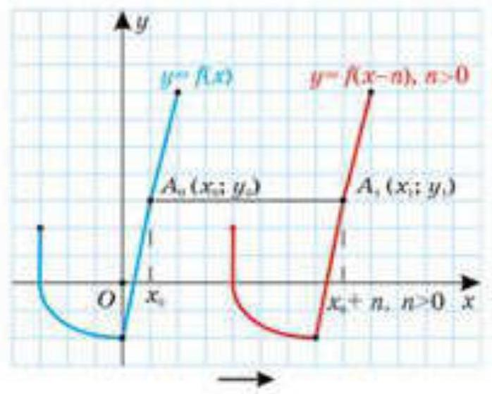

Онга жылжыту
(ығысу, параллель кешіру)
3.4-cyper

\section*{ТУСІНДІРІҢАЕР}

Erep $A_{2}\left(x_{2} ; y_{2}\right)$ нуктесі $A_{0}\left(x_{0} ; y_{0}\right)$ нуктесінен $O x$ осі бойымен $n(n>0)$ бірдікке солга жылжыту аркылы алынса, онда $A_{0}\left(x_{0} ; y_{0}\right)$ жые $A_{2}\left(x_{2} ; y_{2}\right)$ нуктелері кандий формуламен байланысканыи түсіндіріндер (3.5-еурет).
$y=f(x+n)(n>0)$ функциясынын графигін $y=f(x)$ функциясынын графигінен $O x$ осі бойымен и бірлікке солға жылжыту арқылы алуға болатынын дәлелдендер (3.6-сурет).

\begin{figure}
\includegraphics[alt={},max width=\textwidth]{https://cdn.mathpix.com/cropped/b3f159e3-70ef-4ad9-b9e9-0ac5b230efd7-033.jpg?height=348&width=615&top_left_y=1631&top_left_x=276}
\captionsetup{labelformat=empty}
\caption{Солка жыжыту
(ыпысу, параллель кешіру)
3.5-cyper}
\end{figure}

\begin{figure}
\includegraphics[alt={},max width=\textwidth]{https://cdn.mathpix.com/cropped/b3f159e3-70ef-4ad9-b9e9-0ac5b230efd7-033.jpg?height=559&width=684&top_left_y=1427&top_left_x=1005}
\captionsetup{labelformat=empty}
\caption{Солға жыжыту
(ығысу, параллель кешіру)
3,6-eypet}
\end{figure}

Сонымен. мына ережені аламыз:
$y=f(x+n)$, мұидағы $n \in R$, функциясынын графигіи алу үшіи $y=f(x)$ функциясыныи графигін $O x$ осі бойымен $n$ он сан болганда солта, $n$ теріс сан болганда онта карай $n$ ! біряікке жылжыту керек.

\section*{ТНСІНДІРІҢДЕР}
$y=x^{2}$ функинясынын графигін колданып $y=x^{2}-3$ және $y=x^{2}+3$ функциялары графиктерініи калай салынганыи тусіндіріндер (3.7-сурет).

\begin{figure}
\includegraphics[alt={},max width=\textwidth]{https://cdn.mathpix.com/cropped/b3f159e3-70ef-4ad9-b9e9-0ac5b230efd7-034.jpg?height=729&width=444&top_left_y=233&top_left_x=383}
\captionsetup{labelformat=empty}
\caption{Oy осі бойымен жылжыту (ығысу, параллель кешіру)}
\end{figure}
3.7-cypet

\begin{figure}
\includegraphics[alt={},max width=\textwidth]{https://cdn.mathpix.com/cropped/b3f159e3-70ef-4ad9-b9e9-0ac5b230efd7-034.jpg?height=675&width=556&top_left_y=287&top_left_x=1169}
\captionsetup{labelformat=empty}
\caption{Oy oci бойымен $n(n>0)$ бірлікке жоғары жылжыту (ығысу, параллель кешіру)
3.8-сурет}
\end{figure}
xOy координаталар жүйесінде кез келтен $B_{0}\left(x_{0}: y_{0}\right)$ нуктесін карастырайык (3.8-cyper).

Осы нүктені $O y$ осі боїымен жоғары $n(n>0)$ бірлікке жылжытамыз. Сонда $B_{1}\left(x_{1} ; y_{1}\right)$ нүктесін аламыз және $x_{1}=x_{0}, y_{1}=y_{0}+n$ болады.

Керісінше, егер $B_{0}\left(x_{0} ; y_{0}\right)$ және $B_{1}\left(x_{1} ; y_{1}\right)$ нүктелері $x_{1}=x_{0}$ және $y_{1}=y_{0}+n(n>0)$ катынасымен байланысты болса. онда $B_{1}\left(x_{1} ; y_{1}\right)$ нүктесін $B_{0}\left(x_{0} ; y_{0}\right)$ нүктесінен $O y$ осі бойымен жоғары $n$ бірлікке жылжыту аркылы алуға болады.
$y=f(x)$ және $y=f(x)+n(n>0)$ функцияларын карастырайык. Осы функциялардын графиктерін $x O y$ координаталар жүйесінде салыстырайык. Ол үшін $y=f(x)$ функшясынын графигінен кез келген $B_{0}\left(x_{0} ; y_{0}\right)$ нүктесін аламыз. Онда $y_{0}=f\left(x_{0}\right)$ тендігі тура болады. Демек,
$$
\begin{equation*}
y_{0}=f\left(x_{0}\right)=\left(f\left(x_{0}\right)+n\right)-n \text { немесе } y_{0}+n=f\left(x_{0}\right)+n \tag{2}
\end{equation*}
$$

санды тендігі де тура.
$y_{0}+n=y_{1}$ және $x_{0}=x_{1}$ алмастыруларын енгізейік. Сонда (2)-тендік $y_{1}=f\left(x_{1}\right)+n$ түріне келеді. Олай болса, $B_{1}\left(x_{1} ; y_{1}\right)$ нүктесі $y=f(x)+n (n>0)$ функциясынын графигіне тпісті.
$B_{0}\left(x_{0} ; y_{0}\right)$ және $B_{1}\left(x_{1} ; y_{1}\right)$ нүктелерінін координаталары $x_{1}=x_{0}$ және $y_{1}=y_{0}+n$ катынасымен байланысты болгандыктан, $B_{0}\left(x_{0} ; y_{0}\right)$ нүктесін $O y$ осі бойымен жоғары карай $n$ бірлікке жылжыту аркылы $B_{1}\left(x_{1} ; y_{1}\right)$ нүктесін алуға болады.
$B_{0}\left(x_{0} ; y_{0}\right)$ нүктесі кез келген нүкте болғандыктан, барлык нүктелерді, ягни $y=f(x)$ функшясынын графигін $O y$ осі бойымен жогары карай $n$ бірлікке жылжыту аркылы $y=f(x)+n(n>0)$ функциясынын графигін алуға болады (3,9-сурет).
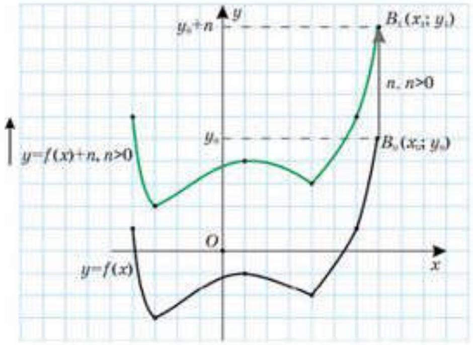

Oy осі бойымен $n(n>0)$ бірлікке жоғары жылжыту (ыгысу, параллель кешіру)
3.9-сурет

\section*{ТУСІНДІРІҢДЕР}

Егер $B_{2}\left(x_{2} ; y_{2}\right)$ нуктесі $B_{0}\left(x_{6} ; y_{0}\right)$ нуктесінен Оу осі бойымен темен карай $n(n>0)$ бірлікке жылжыту аркылы алынса, онда $B_{3}\left(x_{0} ; y_{0}\right)$ және $B_{2}\left(x_{2} ; y_{2}\right)$ нуктелері кандай формуламен байтанысатынын тусіндіріндер (3.10-сурет).
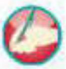
$y=f(x)-n(n>0)$ функциясынын графигін $y=f(x)$ функциясынын графигінен $O y$ осі бойымен төмен қарай $n$ бірлікке жылжыту аркылы алуға болатынын дәлелдендер (3.11-cypet).
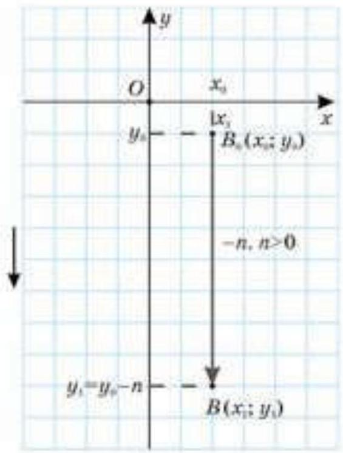

Oy oci бойымен $n(n>0)$ бірлікке жыжыту
(ығысу, параллель кешіру) 3.10-cyper
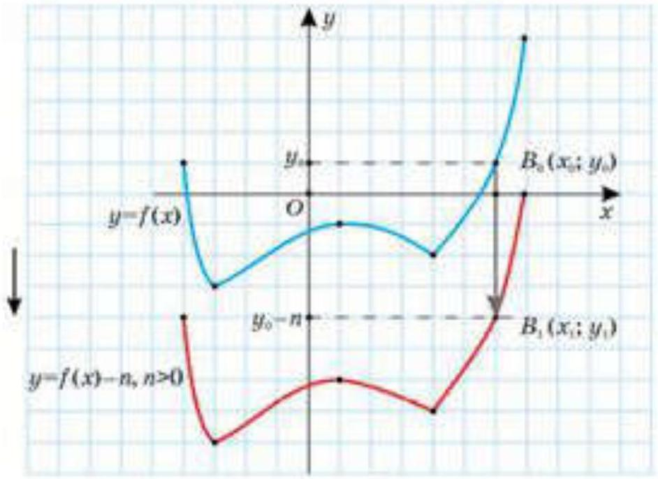

Oy oci бойымен $n(n>0)$ бірлікке жылжыту
(ығысу, параплеть кешіру)
3.11-cyper

Сонымен, мына ережені аламыз:
$y=f(x)+n$, мұндағы $n \in R$, функциясынын графигін алу үшін $y=f(x)$ функшиясынын графигін $O y$ осі бойымен $n$ он сан болғанда жогары, $n$ теріс сан болғанда темен карай |n| бірлікке жылжыгу керек.

МЫСАЛ $y=\sqrt{x}$ функииясынын графигін колданып, $y=\sqrt{x+3}+2$ функциясынын графигін салайык.
Шешуі - 1) $y=\sqrt{x}$ функциясынын графигін саламыз. Ол үшін кесте курамыз:
8-кесте

\begin{tabular}{|c|l|l|l|l|}
\hline$x$ & 0 & 1 & 4 & 9 \\
\hline$y=\sqrt{x}$ & 0 & 1 & 2 & 3 \\
\hline
\end{tabular}
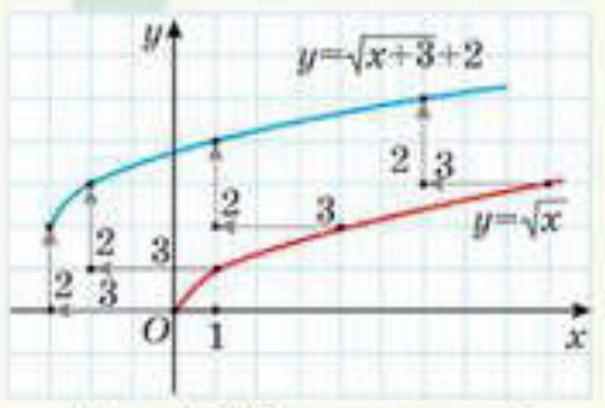

Ох осі бойымен солға 3 бірлікке, Оу осі бойымен жоғары 2 бірлікке жыжыту (ыгысу, параллель кешіру) 3.12-cyper
2) 8-кестеде берілген нүктелерді коордниаталык жазыктыкта белгілейміз және $y=\sqrt{x}$ функциясыныи еспелі грі шектелмейтініи ескеріп, нуктелерді кисык сызымен косамыз (3.12-сурет).
3) Шыккан графикті $O x$ осі бойымен солға 3 бірлікке. одан кейін $O y$ осі бойымен жогары 2 бірлікке жылжытамыз. Ол үшін алдымен жогарыдағы кестенін кемегімен салынған нуктелерді жыткытып алып, оларлы кисық сызымен косамыз.

Жүргізілген түрлендірулерді сызба түрінде керсегуге болады: $y=\sqrt{x} \quad \underline{3} \uparrow^{2}$.

АЛГОРИТМ $\quad y=f(x+n)+m$ функциясыныи графитін салу алгоритмі:
1) $y=f(x)$ функииясынын графигін саламыз.
2) $y=f(x)$ функциясынын графигін $n$ он сан болғанда $O x$ осі бойымен солға, $n$ теріс сан болтанда онға карай $n \mid$ бірлікке жылжытып, $y=f(x+n)$ функшисынын графигін аламыз.
3) $y=f(x+n)$ функциясыныи графигін $m$ он сан болганда $O y$ осі бойымен жогары, $m$ теріс сан болганда темен $|m|$ бірлікке жыжытып, $y=f(x \div n)+m$ функциясынын графигін аламыз.
1. $n$ және $m$-нін кандай мәндерінде $y=f(x)$ функциясыныи графигін: а) темен және солға; э) жоғары және онға; б) жогары және солға; в) темен және онға карай жытжыту аркылы $y=f(x+n)+m$ функшисынын графигін алуға болады? Мысал келтіріндер.
2. $y=f(x)$ функциясынын графигін жытжытпий, $\quad y=f(x)+m$ функциясынын графигін калай салуга болады?
3. $y=f(x)$ функциясыныи графигін жытжыпай, $\quad y=f(x+n)+m$ функциясыныи графиги калай салуга болады?

\section*{Жаттығулар \\ A}
3.1. Erep $A_{1}$ нүктесі $A(2 ; 3)$ нүктесін:
1) онға карай 4 бірлікке:
2) солға карай 2 бірлікке;
3) солға карай 1,2 бірлікке;
4) онға карай 3,7 бірлікке
жылжыту аркылы алынса, онда $A_{1}$ нүктесінін коорднаталарын табындар.
3.2. Erep $A_{2}$ нүктесі $A(-2 ; 4)$ нүктесін:
1) онға карай 3 бірлікке;
2) солға карай 3 бірлікке;
3) солға карай 2,3 бірлікке;
4) онға карай 4,5 бірлікке жытжыту
аркылы алынса, онда $A_{2}$ нүктесінін кооршнаталарын табындар.
3.3. Erep $B_{1}$ нүктесі $B(1 ;-4)$ нүктесін:
1) жоғары карай 3 бірлікке;
2) төмен карай 2 бірлікке:
3) төмен карай 3,2 бірлікке;
4) жоғары карай 5,4 бірлікке жыл-
жыту аркылы алынса, онда $B_{1}$ нүктесінін коорднаталарын табындар.
3.4. Erep $B_{2}$ нүктесі $B(-2 ;-1)$ нүктесін:
1) темен карай 3 бірлікке:
2) жоғары карай 3 бірлікке;
3) жоғары карай 4,3 бірлікке:
4) темен карай 7,5 бірлікке жылжыту аркылы алынса, онда $B_{2}$ нүктесінін координаталарын табындар.
3.5. $y=x$ функциясынын графигін салындар. $y=x$ функшясынын графигін колданып бір координаталык жазыктыка $y=x$ функциясынын графигін:
1) 2 бірлік онға;
2) 3 бірлік солға;
3) 2 бірлік жоғары;
4) 3 бірлік төмен карай жылжытканда шыккан функшиньн графигін салындар.
3.6. $y=x^{2}$ функциясыныи графигін колданып бір координаталык жазыктыкка:
1) $y=x^{2}-2$;
2) $y=x^{2}+2$;
3) $y=(x-3)^{2}$;
4) $y=(x+3)^{2}$

функщияарынын графиктерін салындар.
3.7. $y=x^{3}$ функциясынын графигін колданып бір координаталык жазыктыкка:
1) $y=x^{3}-3$;
2) $y=x^{3}+3$;
3) $y=(x-4)^{3}$;
4) $y=(x+4)^{3}$

функцияларыныи графиктерін салындар.
3.8. $y=\frac{1}{x}$ функциясыныи графигін колданып бір координаталык жазықтыкка:
1) $y=\frac{1}{x}-2$;
2) $y=\frac{1}{x}+2$;
3) $y=\frac{1}{x+2}$;
4) $y=\frac{1}{x-3}$

функцияларыны н графиктерін салындар.
3.9. $y=\sqrt{x}$ функциясынын графигін колданып бір координаталык жазыктыкка:
1) $y=\sqrt{x+2}$;
2) $y=\sqrt{x-3}$;
3) $y=\sqrt{x}+3$;
4) $y=\sqrt{x}-3$ функцияларынын графиктерін салындар.

\section*{B}
3.10.
1) $y=x^{2}-3,5 x$;
2) $y=-x^{2}+5 x$;
3) $y=\frac{1}{x+5}$;
4) $y=\frac{1}{4-x}$ функциясынын графигі кандай сызык бола ды? Функия графигін жылжытуды (ығысуды, параллель кешіруді) колдану аркылы салындар.
3.11. Екімүшенін квадратын айырып квадраттык функшянын графигін салындар:
1) $y=x^{2}-3 x+1$;
2) $y=-x^{2}+4 x+2$;
3) $y=-2 x^{2}+6 x-1$;
4) $y=4 x^{2}-8 x+1$.
3.12. Бүтін белігін айырып белшек-сызыктык функцияныи графигін салындар:
1) $y=\frac{2 x-3}{x}$;
2) $y=\frac{x-3}{x+1}$;
3) $y=\frac{3 x-2}{x-1}$;
4) $y=\frac{-2 x+3}{x+2}$.
3.13. $y=\sqrt{x}$ функциясынын графигін колданып берілген функциялардын графигін салындар:
1) $y=\sqrt{x-2}$;
2) $y=\sqrt{x+3}$;
3) $y=\sqrt{x-1,2}$;
4) $y=\sqrt{x+2,5}$.

\section*{C}
3.14. Берілген функшяяардын графиктерін бір кооршнататык жазыктыкка салып, графиктердін кнылысу нүктелерінін санын табындар:
1) $y=x^{2}+2 x-3$ және $y=\frac{2 x-5}{x-3}$ :
2) $y=-x^{2}+4 x-2$ және $y=\frac{-2 x+3}{x-3}$.
3.15. Берілген функциялардын графиктерін бір кооршнаталык жазыктыкка салып, графиктердін кнылысу нүктелерінін санын керсетіндер:
1) $y=x^{2}+3 x-2$ және $y=\sqrt{x+2}$;
2) $y=x^{2}-4 x+2$ және $y=\sqrt{x-3}$;
3) $y=x^{2}+2 x-3$ және $y=|x-2|$;
4) $y=|x+4|$ және $y=\frac{-2 x+3}{x-3}$.
3.16. $y=\sqrt{x}$ функциясынын графигіне түрлендірулер коланып темендегі функциялардын графигін салындар:
1) $y=\sqrt{x-3}-3$;
2) $y=\sqrt{x+1}-1,5$;
3) $y=\sqrt{x+1,5}+1$;
4) $y=\sqrt{x-2}+2$.

\section*{КАЙТАЛАУ}
3.17.
1) $y=x^{2}-3|x|$;
2) $y=x^{2}+4|x|$;
3) $y=2 x^{2}+5|x+3|$;
4) $y=2 x^{2}-4|x-1|$

функциясынын графигін салындар.
3.18. Темендегі функциялардын аныкталу облысын табындар:
1) $y=\sqrt{\frac{x-2}{x+3}}$;
2) $y=\sqrt{\frac{-2 x+3}{x-2}}$;
3) $y=\sqrt{\frac{3 x-4}{2-x}}$.
3.19. 1) $\left\{\begin{array}{l}x^{2}+y^{2}=16, \\ y=2 x^{3} ;\end{array}\right.$
2) $\left\{\begin{array}{l}x^{2}+3 x-y=0, \\ y=5-x^{2}\end{array}\right.$ тенд еулер жүйесін графиктік тәсілмен шешіндер.

\section*{ЖАНА БІЛІМДІ МЕҢГЕРУТЕ АРНАЛҒАН ТІРЕК ҰҒЫМДАР}

Сызыктык функция, кеадраттык функция және олардын графиктері, кері пропорционалдых; коороинаталых жазыктык; нүктенін коороцнаталары, фигураны туртендіру туртері, нуктеге және тузуче караганда симметрия.
§4. $y=a f(x), y=|f(x)|, a \in R$, ТУРІНДЕГІ

\section*{ФУНКЦИЯЛАРДЫН ГРАФИКТЕРІН САЛУ}
(2)

Oy осі бойымен функция графигін сығу мен созуды орындауды; аналитикалык жазуында модуль танбасы бар функциялардын графиктерін салуды үйренесіндер.

3

\section*{ТУЙІндІ ¥ғымдАР}

Графикті сығу, трафикті созу, модуль, ордината осі
$a>1,0<a<1, a=-1$ жағдайлары үшін $y=a f(x)$ функциясыныи графигін салуды карастырайык.
4.1-суретте $A\left(x_{0} ; y_{0}\right), B\left(x_{1} ; y_{1}\right), C\left(x_{2} ; y_{2}\right)$ нуктелері және оларға сәйкес абсциссалары езара тен, ординаталары $a(a>1)$ есе үлкен болатын $A_{1}\left(x_{0} ; a y_{0}\right), B_{1}\left(x_{1} ; a y_{1}\right), C_{1}\left(x_{2} ; a y_{2}\right)$ нүктелері белгіленген.

\section*{МЫСАЛ}
1. 4.2-суретте $A(4 ; 2), B(-1 ; 1), C(-5 ;-2.5)$ нуктетері және оларка сэйкес абециесалары езара тен, оршнататары 3 есе артык $A_{1}(4: 6)$, $B_{1}(-1 ; 3), C_{1}(-5 ;-7,5)$ нүктетері берілген.

\begin{figure}
\includegraphics[alt={},max width=\textwidth]{https://cdn.mathpix.com/cropped/b3f159e3-70ef-4ad9-b9e9-0ac5b230efd7-040.jpg?height=702&width=639&top_left_y=233&top_left_x=392}
\captionsetup{labelformat=empty}
\caption{Oy oci бойымен $a(a>1)$ ece cosy 4.1-cyper}
\end{figure}

\begin{figure}
\includegraphics[alt={},max width=\textwidth]{https://cdn.mathpix.com/cropped/b3f159e3-70ef-4ad9-b9e9-0ac5b230efd7-040.jpg?height=757&width=672&top_left_y=278&top_left_x=1119}
\captionsetup{labelformat=empty}
\caption{4.2-cyper}
\end{figure}

Мұндай жағдайда $A\left(x_{0} ; y_{0}\right), B\left(x_{1} ; y_{1}\right), C\left(x_{2} ; y_{2}\right)$ нүктелері $O y$ осі бойымен $a(a>1)$ есе созу нәтижесінде сэйкесінше $A_{1}\left(x_{0} ; a y_{0}\right), B_{2}\left(x_{1} ; a y_{1}\right)$, $C_{1}\left(x_{2} ; a y_{2}\right)$ нүктелеріне кешеді.
$y=f(x)$ және $y=a f(x)$ функцияларын карастырайык, $y=f(x)$ функщиясынын графигі берілсін (4.3.1-сурет), $y=a f(x)(a>1)$ функшиясынын графигін салу керек. Аргументтін бірдей мендерінде $y=f(x)$ функциясынын сәйкес мәндерін $a$-ға көбейтіп, $y=a f(x)$ функциясынын мәндері алынатынын байкаута болады (4.3.2-сурет).

Баскаша айтканда, кез кепен $A\left(x_{0} ; y_{0}\right)$ нүктесі $y=f(x)$ функщиясынын графигіне тисті болса, онда $A_{1}\left(x_{0} ; a y_{0}\right)$ нүктесі $y=a f(x)$ функщиясыныи графшіне тпісті. Демек, $y=a f(x)(a>1)$ функшясынын графигі

\begin{figure}
\includegraphics[alt={},max width=\textwidth]{https://cdn.mathpix.com/cropped/b3f159e3-70ef-4ad9-b9e9-0ac5b230efd7-040.jpg?height=728&width=732&top_left_y=1861&top_left_x=269}
\captionsetup{labelformat=empty}
\caption{4.3.1-cyper}
\end{figure}

\begin{figure}
\includegraphics[alt={},max width=\textwidth]{https://cdn.mathpix.com/cropped/b3f159e3-70ef-4ad9-b9e9-0ac5b230efd7-040.jpg?height=826&width=821&top_left_y=1758&top_left_x=1069}
\captionsetup{labelformat=empty}
\caption{Oy oci бойымен $a(a>1)$ ece cosy}
\end{figure}
4.3.2-cyper

\begin{figure}
\includegraphics[alt={},max width=\textwidth]{https://cdn.mathpix.com/cropped/b3f159e3-70ef-4ad9-b9e9-0ac5b230efd7-041.jpg?height=674&width=634&top_left_y=233&top_left_x=283}
\captionsetup{labelformat=empty}
\caption{4.3.3-cyper}
\end{figure}
$y=f(x)$ функциясыныи графигін $O y$ осі бойымен a есе созу аркылы алынады (4.3.3-сурет).

\begin{figure}
\includegraphics[alt={},max width=\textwidth]{https://cdn.mathpix.com/cropped/b3f159e3-70ef-4ad9-b9e9-0ac5b230efd7-041.jpg?height=672&width=636&top_left_y=233&top_left_x=1041}
\captionsetup{labelformat=empty}
\caption{4.4-cypeτ}
\end{figure}

\section*{МЫСАЛ}
2. 4.4-сурете $y=f(x)$ функшисьным графигін $O y$ осі бойымен 3 есе созу аркылы алынтан $y=3 f(x)$ функшясьным графигіи салу жолы керсетілен.
$0<a<1$ болғанда, $y=a f(x)$ функииясынын графигін сатущы карастырайык.
4.5-суретте $E\left(x_{0} ; y_{0}\right), L\left(x_{1} ; y_{1}\right), S\left(x_{2} ; y_{2}\right)$ нуктелері және оларға сәйкес абсшиссалары тен, ординаталары $a$-ға $(0<a<1)$ еселенген $E_{1}\left(x_{0} ; a y_{0}\right)$, $L_{1}\left(x_{1} ; a y_{1}\right), S_{1}\left(x_{2} ; a y_{2}\right)$ нүктетері көрсетілген.

\section*{МЫСАЛ 3. 4.6 -суретт $E(-7 ;-8), L(-4 ; 2), S(5 ; 4)$ нуктелері және олар-}
га слйкес абсциесалары өзара чен, оршижалары $\frac{1}{4}$-ге кебейтілген $E_{1}(-7 ;-2), \quad L_{1}\left(-4 ; \frac{1}{2}\right), S_{1}(5 ; 1)$ нүктелері беліленген.
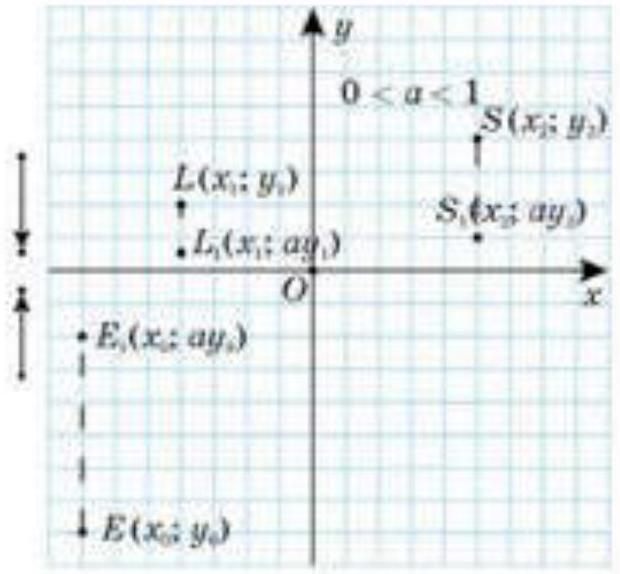

Oy oci бойымен $\frac{1}{a}(0<a<1)$ ece сығу
4.5-сурет
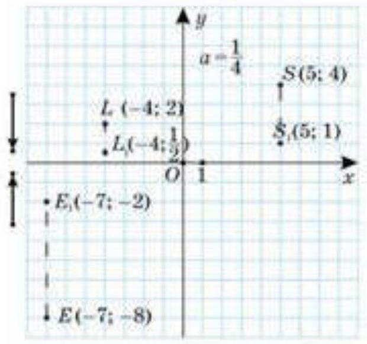

Oy oci бойымен 4 есе сығу
4.6-сурет

\begin{figure}
\includegraphics[alt={},max width=\textwidth]{https://cdn.mathpix.com/cropped/b3f159e3-70ef-4ad9-b9e9-0ac5b230efd7-042.jpg?height=696&width=627&top_left_y=246&top_left_x=356}
\captionsetup{labelformat=empty}
\caption{4.7.1-cyper}
\end{figure}
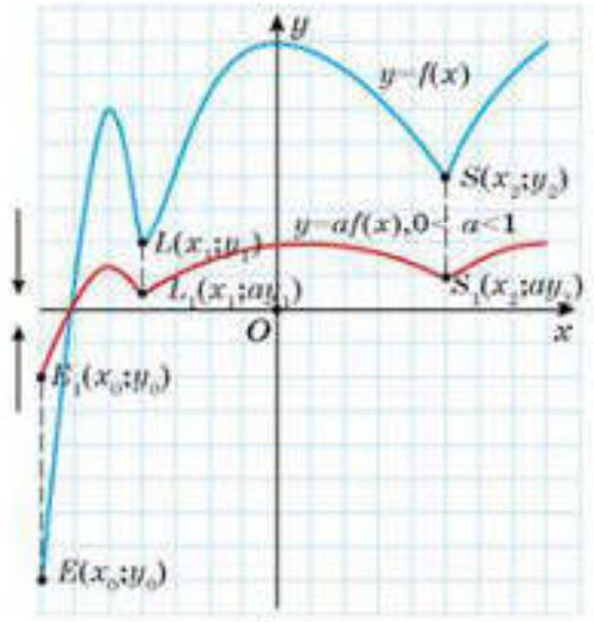
$O y$ осі бойымен $\frac{1}{a}(0<a<1)$ есе сығу
4.7.2-cyper

Мұндай жағдайда $E\left(x_{0} ; y_{0}\right), L\left(x_{1} ; y_{1}\right), S\left(x_{2} ; y_{2}\right)$ нүктелері $O y$ oci бойымен $\frac{1}{a}(0<a<1)$ есе сығу нәтижесінде сәйкесіние $E_{1}\left(x_{0} ; a y_{0}\right)$, $L_{1}\left(x_{1} ; a y_{1}\right), S_{1}\left(x_{2} ; a y_{2}\right)$ нүктелеріне кешеді.
$y=f(x)$ және $y=a f(x)$ функцияларын карастырайық, $y=f(x)$ функциясынын графигі берілсін (4.7.1-сурет). $y=a f(x)$, мүндағы $0<a<1$, функшисынын графигін сату керек. Аргументін бірдей мәндерінде $y=f(x)$ функиисынын сәйкес мәндерін $a$-ға $(0<a<1)$ көбейтпі $y=a f(x)$ функцисынын мәндерін атамв (4.7.2-сурет).

Баскаша айтканда, кез кежен $A\left(x_{0} ; y_{0}\right)$ нүктесі $y=f(x)$ функциясынын графигіне тисті болса, онда $A_{1}\left(x_{0} ; a y_{0}\right)$ нүктесі $y=a f(x)$, мүндағы $0<a<1$, функциясынын графигіне тисті. Демек, $y=a f(x)$, мұндағы $0<a<1$, функшисынын графигі $y=f(x)$ функшясынын графигін $O y$ осі бойымен $\frac{1}{a}$ есе сығу аркылы алынады (4.7.3-сурет).
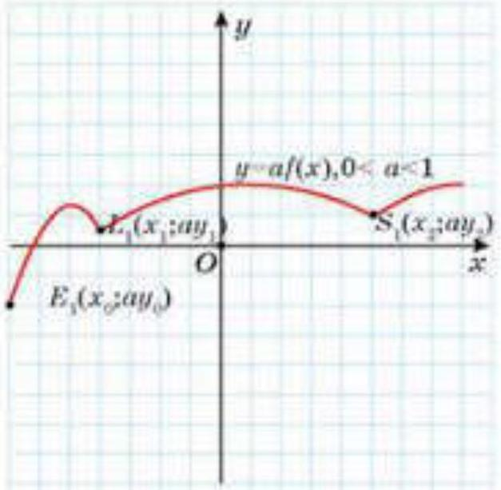
4.7.3-cyper
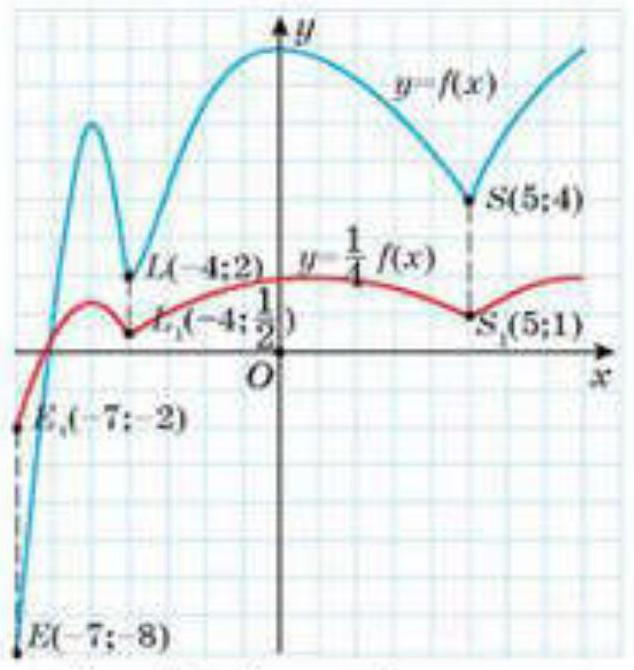

Oy oci бойымен 4 есе сығу
4.8-сурет

Ох осіне караганда симметриялы
4.9-cypet
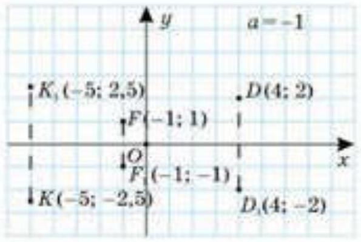
4.10-cyper

\section*{МЫСАЛ}
4. 4.8-суретте $y=f(x)$ функциясыныи графигіи Оу осі бойымен 4 есе сығу аркылы алынған $y=\frac{1}{4} f(x)$ функиясыныи графигін калай сагута болатыны керестітен.
$a=-1$ болғанда, $y=a f(x)$, яғни $y=-f(x)$ функшисынын графигін салайык.
4.9-суретте $D\left(x_{0} ; y_{0}\right), F\left(x_{1} ; y_{1}\right), K\left(x_{2} ; y_{2}\right)$ нүктелері және оларға сәйкес абсциссалары бірдей, ординаталары -1 -ге көбейтілген $\quad D_{1}\left(x_{0} ;-y_{0}\right)$. $F_{1}\left(x_{1} ;-y_{1}\right), K_{1}\left(x_{2} ;-y_{2}\right)$ нүктелері белгіленген.

\section*{МЫСАЛ}
5. 4.10-суретте $D(4 ; 2), F(-1 ; 1), K(-5 ;-2,5)$ нуктелері және оларға сэйкес абсциссалары бірдей, оржнаталары -1-ге кебсйтілген $D_{1}(4 ;-2), F_{1}(-1 ;-1), K_{1}(-5 ; 2,5)$ нүктелері белгіленген.
$D_{1}\left(x_{0} ;-y_{0}\right), F_{1}\left(x_{1} ;-y_{1}\right), K_{1}\left(x_{2} ;-y_{2}\right)$ нүктелері $O x$ осіне карағанда $D\left(x_{0} ; y_{0}\right), F\left(x_{1} ; y_{1}\right), K\left(x_{2} ; y_{2}\right)$ нүктелеріне спмметрнялы. Демек. нүктелердін абсциссалары бірдей, ординаталары карама-карсы сандар болса, ондай нүктелер $O x$ осіне карағанда спмметриялы болады.
$y=f(x)$ және $y=-f(x)$ функшяларын карастырайык. $y=f(x)$ функциясынын графигі берілсін (4.11.1-сурет), $y=-f(x)$ функциясынын графигін салу керек. Аргументтін бірдей мәндерінде $y=f(x)$ және $y=-f(x)$ функшяларынын сойкес мәндері карама-карсы болады (4.11.2-cypet).

\begin{figure}
\includegraphics[alt={},max width=\textwidth]{https://cdn.mathpix.com/cropped/b3f159e3-70ef-4ad9-b9e9-0ac5b230efd7-043.jpg?height=442&width=595&top_left_y=2142&top_left_x=285}
\captionsetup{labelformat=empty}
\caption{4.11.1-cyper}
\end{figure}

\begin{figure}
\includegraphics[alt={},max width=\textwidth]{https://cdn.mathpix.com/cropped/b3f159e3-70ef-4ad9-b9e9-0ac5b230efd7-043.jpg?height=439&width=593&top_left_y=2145&top_left_x=1027}
\captionsetup{labelformat=empty}
\caption{Ох осіне карағанда симметрияты}
\end{figure}
4.11.2-cyper

\begin{figure}
\includegraphics[alt={},max width=\textwidth]{https://cdn.mathpix.com/cropped/b3f159e3-70ef-4ad9-b9e9-0ac5b230efd7-044.jpg?height=444&width=604&top_left_y=230&top_left_x=422}
\captionsetup{labelformat=empty}
\caption{4.11.3-cyper}
\end{figure}

\begin{figure}
\includegraphics[alt={},max width=\textwidth]{https://cdn.mathpix.com/cropped/b3f159e3-70ef-4ad9-b9e9-0ac5b230efd7-044.jpg?height=437&width=595&top_left_y=237&top_left_x=1139}
\captionsetup{labelformat=empty}
\caption{4.12-cyper}
\end{figure}

Баскаша айтканда, кез кетен $A\left(x_{0} ; y_{0}\right)$ нүктесі $y=f(x)$ функииясынын графигіне тністі болса, онда $A\left(x_{0} ; y_{0}\right)$ нүктесіне $O x$ осіне карағанда спмметриялы нүкте $y=-f(x)$ функшиясынын графигіне тпісті. Демек, $y=-f(x)$ функшясынын графигі $y=f(x)$ функциясынын графигін $O x$ осіне карағанда спмметриялы бейнелеу аркылы алынады (4.11.3-сурет).

МЫСАЛ 6. 4.12-сурете $y=f(x)$ функииясыныи графитіне Ох осіне караганда снмметрияны коддану аркылы алынған $y=-f(x)$ функциясыныи графигін калай салута болатыны керсетілген.

АЛГОРИТМ $\quad y=f(x)$ функциясыныи графигіи колланып, $y=a f(x)$ функциясыныи графигін сату алгоритмі:
1) $y=f(x)$ функнясьныи графигін саламыт:
2) егер $|a|<1$ болса, онда $y=f(x)$ функиияыныи графиги $O y$ осі бойымен $\left|\frac{\mid}{a}\right|$ есе сығамыз: егер $|a|>1$ батса, онда $y=f(x)$ фуняция сынын графи гін $O y$ осі бойымен $|a|$ есе созамыз;
3) егер $a<0$ болеа, онда салынған графикті $O x$ осіне карағанда симметрияты етіп бейнелейміз.
4.13-4.16-суреттерде $y=|f(x)|$ функциясынын графигін салу жолдары көрсетілген.

\begin{figure}
\includegraphics[alt={},max width=\textwidth]{https://cdn.mathpix.com/cropped/b3f159e3-70ef-4ad9-b9e9-0ac5b230efd7-044.jpg?height=666&width=595&top_left_y=1978&top_left_x=370}
\captionsetup{labelformat=empty}
\caption{4.13-cyper}
\end{figure}

\begin{figure}
\includegraphics[alt={},max width=\textwidth]{https://cdn.mathpix.com/cropped/b3f159e3-70ef-4ad9-b9e9-0ac5b230efd7-044.jpg?height=670&width=598&top_left_y=1978&top_left_x=1219}
\captionsetup{labelformat=empty}
\caption{4.14-cyper}
\end{figure}

\begin{figure}
\includegraphics[alt={},max width=\textwidth]{https://cdn.mathpix.com/cropped/b3f159e3-70ef-4ad9-b9e9-0ac5b230efd7-045.jpg?height=601&width=606&top_left_y=306&top_left_x=285}
\captionsetup{labelformat=empty}
\caption{4.15-cyper}
\end{figure}

\begin{figure}
\includegraphics[alt={},max width=\textwidth]{https://cdn.mathpix.com/cropped/b3f159e3-70ef-4ad9-b9e9-0ac5b230efd7-045.jpg?height=674&width=602&top_left_y=233&top_left_x=1059}
\captionsetup{labelformat=empty}
\caption{Графиктін $O x$ осінен темен орналаскан белігінін $O x$ осіне карагантағы симметриясы 4.16-cypet}
\end{figure}
1. $a$-нын кандай мандерінде $y=f(x)$ функшиясынын графигіне: а) Oy осі бойымен созу; ә) Oy осі бойымен сыгу; б) Ox осіне карағанда снмметрияны коллану аркыты $y=a f(x)$ функинясынын графитін алуға болады? Мысад келтіріндер.
2. $y=f(x)$ функциясыныи графигін колданып, а) $y=-2 f(x)$; э) $y=-0.5 f(x)$ функциясынын графигін калай салуға болады?
3. Erep: a) $a>1$; ɔ) $0<a<1$; б) $a=-1$ болеа, онда $y=f(x)$ және $y=a f(x)$ функииялары графиктерінін нуктетері калай байланыскан? Мысал келтіріндер.

\section*{Жаттығулар}

\section*{A}
4.1. Нүктелерді координаталык жазыктыкка салындар:
1) $A(2 ; 3)$ және $A_{1}(2 ; 6)$;
2) $B(1 ;-2)$ және $B_{1}(1 ;-6)$;
3) $P(-2 ;-1,5)$ және $P_{1}(-2 ;-3)$ :
4) $C(-3 ; 2,4)$ және $C_{1}(-3 ; 7,2)$;
5) $K(2 ;-1,4)$ және $K_{1}(2 ;-4,2)$;
6) $M(4 ;-3)$ және $M_{1}(4 ;-6)$.
$O y$ осі бойымен созу аркылы $A, B, P, C, K, M$ нуктелерінін сәйкесінше $A_{1}, B_{1}, P_{1}, C_{1}, K_{1}, M_{1}$ нүктелеріне кешуін беретін созу коэффишентін керсетіндер.
4.2. Нүктелерді координаталык жазыктыкка салындар:
1) $A(-1 ; 3)$ және $A_{1}(-1 ; 1)$;
2) $B(1 ; 4)$ және $B_{1}(1 ; 2)$;
3) $P(-2 ; 4,5)$ және $P_{1}(-2 ; 3)$;
4) $C(2 ;-2,4)$ және $C_{1}(2 ;-0,8)$;
5) $K(-3 ;-4,4)$ және $K_{1}(-3 ;-1,1)$;
6) $M(4 ; 9)$ және $M_{1}(4 ; 1,5)$.
$O y$ осі бойымен сығу аркылы $A, B, P, C, K, M$ нүктелеріне көшуді беретін сығу коэффициентін көрсетіндер.
4.3. Функциялардын графиктерін бір координаталык жазыктыкка сальндар:
1) $y=x ; y=2 x$ және $y=0,5 x$;
2) $y=x^{2} ; y=3 x^{2}$ және $y=0,5 x^{2}$;
з) $y=\frac{1}{x} ; y=\frac{3}{x}$ және $y=\frac{0,5}{x}$.
4.4. Функциялардын графиктерін бір координаталык жазыктыкка салындар:
1) $y=x^{2} ; y=-1,5 x^{2} ; y=x^{2}-2 ; y=(x-2)^{2} ; y=-2 x^{2}+3 ;$
2) $y=\sqrt{x} ; y=\sqrt{x-2} ; y=\sqrt{x+3} ; y=2 \sqrt{x} ; y=-3 \sqrt{x}$. $y=x^{2}$ және $y=\sqrt{x}$ функииларынын графиктеріне кандай түрлендірулер колданылған?

\section*{B}
4.5. Түрлендірулер колданып функшияны графигін салындар:
1) $y=2 x^{2}-3$;
2) $y=0,5 x^{2}+2$;
з) $y=2(x-2)^{2}$;
4) $y=-2 x^{2}-1,5$.
4.6. Түрлендірулер колданып функшянын графигін сатындар:
1) $y=2 \sqrt{x}-3$;
2) $y=\sqrt{x+1}-2$;
з) $y=-\sqrt{x+3}+2$;
4) $y=2 \sqrt{4-x}$.
4.7. Функциялардын графиктерін бір координаталык жазыктыкка салындар:
1) $y=\frac{1}{x^{2}}$ және $y=\frac{2}{x^{2}}$;
2) $y=\frac{1}{(x-1)^{2}}$ және $y=\frac{1}{(x+3)^{2}}$.
4.8. 1) $y=2+\frac{3}{x-2} ; \quad$ 2) $y=3-\frac{1}{x+1} ; \quad$ 3) $y=\frac{3 x-1}{x}$ функциясынын графи гін салу үшін кандай түртендірулер жасау керек? Функиинын графигін салындар.

\section*{C}
4.9. Бір координаталык жазыктыкка темендегі функшялардын графиктерін салындар және графиктердін ортақ нүктелерінін санын көрсетіндер:
1) $y=\frac{3 x+2}{x-1}$ және $y=\frac{1}{x^{2}}$;
2) $y=\frac{2 x-3}{x+2}$ және $y=\sqrt{x+3}$.
4.10. Графнктік тәсілмен тендеудін канша түбірі болатынын табындар:
1) $x^{2}+3 x=\frac{1}{x}$;
2) $x^{2}-4 x=\frac{1}{x^{2}}$;
3) $\sqrt{x+3}=\frac{1}{x+1}$;
4) $\sqrt{2-x}=\frac{2}{x+2}$.
4.11. $y=\sqrt{x}$ функциясынын графигіне түрлендірулер колданылып координаталык жазыктыкта функщинын графиті салынған (4.17-сурет). Осы функшяныи аналипикалык формуласын жазынар.

\begin{figure}
\includegraphics[alt={},max width=\textwidth]{https://cdn.mathpix.com/cropped/b3f159e3-70ef-4ad9-b9e9-0ac5b230efd7-047.jpg?height=313&width=463&top_left_y=466&top_left_x=383}
\captionsetup{labelformat=empty}
\caption{1)}
\end{figure}

\begin{figure}
\includegraphics[alt={},max width=\textwidth]{https://cdn.mathpix.com/cropped/b3f159e3-70ef-4ad9-b9e9-0ac5b230efd7-047.jpg?height=312&width=467&top_left_y=463&top_left_x=1114}
\captionsetup{labelformat=empty}
\caption{2)}
\end{figure}

4.17-cyper

Төмендегі функциялардын графиктерін салындар (4.12-4.13):
2) $y=\left|\frac{1}{1-x}\right|$;
2) $y=|1-\sqrt{x-2}|$;
3) $y=\left|\frac{-3}{x+2}\right|$.
3) $y=|2-\sqrt{1-x}|$.
4.12. 1) $y=\left|\frac{2}{x-1}\right|$;
4.13. 1) $y=|\sqrt{x+3}-2|$;

\section*{КАЙТЛАУ}
4.14. Функциянын аныкталу облысын табындар:
1) $y=\sqrt{\frac{x-2}{x^{2}-9}}$;
2) $y=\sqrt{\frac{2-3 x}{x^{2}-1}}$;
3) $y=\frac{1}{x-2}+\sqrt{\frac{x-2}{x^{2}-9}}$;
4) $y=\frac{1}{x^{2}-4}+\sqrt{\frac{x^{2}-16}{x+3}}$.
4.15. Тепе-тендікті дәлелдендер:
1) $\cos ^{2}\left(180^{\circ}-x\right)+\cos ^{2}\left(270^{\circ}+x\right)-\operatorname{tg} x \cdot \operatorname{ctg}\left(180^{\circ}+x\right)=0 ;$
2) $\frac{\cos ^{2}(\pi+\alpha)}{1-\sin \alpha}-\cos \left(\frac{\pi}{2}-\alpha\right)+\operatorname{tg}^{2} \alpha=\frac{1}{\cos ^{2} \alpha}$.
4.16. Тендеудін түбірін табындар:
1) $|x+3|=|2-x|$;
2) $|x-4|-|x-2|=-2$;
3) $|x-3|+2|x+1|=4$.

\section*{ЖАңА БІЛІМДІ МЕҢГЕРУГЕ АРНАЛҒАН ТІРЕК ҰғЫМДАР}

Сызықтык функция, кеадраттык функция және олардын графиктері, кері пропорционалдых, коороцнаталых жазыктых, нуктенін коороцнаталары, фигураны түртендіру түртері, нуктеге караганда ждне тузуге караганда снмметрия.

\section*{§5. $y=f(a x), y=f(|x|), a \in R$, ТУРІНДЕГІ ФУНКЦИЯ.ЛАРДЫН ГРАФИКТЕРІН САЛУ}

(7)Ох осі бойымен функция графигін сығу мен созуды орындауды; аналитикалык жазуында модуль танбасы бар функциялардың графиктерін салуды үйренесіндер.

3
ТУЙІНДІ ¥ғымдАР
Графикті сығу, графикті созу, абсцисса осі
$a>1,0<a<1, a=-1$ жағдайлары үшін $y=f(a x)$ функциясынын графигін салайык.
5.1-суретте $A\left(x_{0} ; y_{0}\right), B\left(x_{1} ; y_{1}\right), C\left(x_{2} ; y_{2}\right)$ нүктелері және оларға сәйкес ординаталары бірдей, абсциссалары $a$-ға $(a>1)$ еселентен $A_{1}\left(a x_{0} ; y_{0}\right)$. $B_{1}\left(a x_{1} ; y_{1}\right), C_{1}\left(a x_{2} ; y_{2}\right)$ нүктелері берілген.

\section*{МЫСАЛ 1. 5.2 -суретте $A(2 ; 6), B(-1,5 ; 3), C(-3 ;-2)$ нуктелері және оларға сәйкес ординаталары бірдей, абсииссагары 3-ке көбейтілген $A_{1}(6 ; 6)$, $B_{1}(-4,5 ; 3), C_{1}(-9 ;-2)$ нуктелері белгіленген.}

Мұндай жағдайда $A\left(x_{0} ; y_{0}\right), B\left(x_{1} ; y_{1}\right), C\left(x_{2} ; y_{2}\right)$ нүктелері $O x$ осі бойымен $a(a>1)$ есе созу нәтижесінде сэйкесінше $A_{1}\left(a x_{0} ; y_{0}\right), B_{1}\left(a x_{1} ; y_{1}\right)$, $C_{1}\left(a x_{2} ; y_{2}\right)$ нүктелеріне кешеді және керісінше $A_{1}\left(a x_{0} ; y_{0}\right), B_{1}\left(a x_{1} ; y_{1}\right)$, $C_{1}\left(a x_{2} ; y_{2}\right)$ нүктелері $O x$ осі бойымен $a(a>1)$ есе сығу нәтижесінде сәйкесінше $A\left(x_{0} ; y_{0}\right), B\left(x_{1} ; y_{1}\right), C\left(x_{2} ; y_{2}\right)$ нүктелеріне кошеді.

Аныктама. $A_{0}\left(x_{0} ; y_{0}\right)$ және $A_{1}\left(x_{1} ; y_{1}\right)$ нуктелерінін координапатары $y_{1}=y_{0}$ және $x_{1}=a x_{0}(a>1)$ катынасымен байланысты болса, онда Ох осі бойымен а ( $a>1$ ) есе созу натижесінде $A_{0}\left(x_{0} ; y_{0}\right)$ нуктесі $A_{1}\left(x_{1} ; y_{1}\right)$ нуктесіне жане керісіние Ох осі бойымен $a(a>1)$ есе сыеу натижесінде $A_{1}\left(x_{1} ; y_{1}\right)$ нуктесі $A_{0}\left(x_{0} ; y_{0}\right)$ нуктесіне кешеді деп айтады.
$y=f(x)$ және $y=f(a x)$ функцияларын қарастырайык, $y=f(x)$ функциясыныи графигі берілсін (5.3.1-сурет). $y=f(a x)(a>1)$ функциясынын графигін салу керек.

\begin{figure}
\includegraphics[alt={},max width=\textwidth]{https://cdn.mathpix.com/cropped/b3f159e3-70ef-4ad9-b9e9-0ac5b230efd7-048.jpg?height=460&width=639&top_left_y=2035&top_left_x=319}
\captionsetup{labelformat=empty}
\caption{Ox oci бойымен $a(a>1)$ ece cosy
Ox oci бойымен $a(a>1)$ есе сығу
5.1-сурет}
\end{figure}
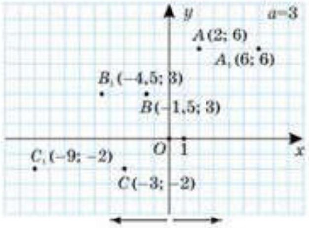

5.2-cyper

\begin{figure}
\includegraphics[alt={},max width=\textwidth]{https://cdn.mathpix.com/cropped/b3f159e3-70ef-4ad9-b9e9-0ac5b230efd7-049.jpg?height=438&width=588&top_left_y=246&top_left_x=285}
\captionsetup{labelformat=empty}
\caption{5.3.1-cypet}
\end{figure}
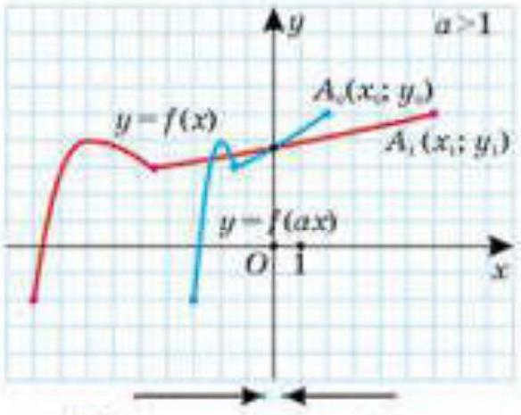

Ox oci бойымен a ( $a>1$ ) есе сығу
5.3.2-cypet
$y=f(x)$ және $y=f(a x)(a>1)$ функшиларын карастырайык. $x О y$ коордннаталар жүйесіндегі осы функшяларды графиктерін салыстырайык (5.3.2-сурет). Ол үшін $y=f(a x)(a>1)$ функшясынын графшінен кез келген $A_{0}\left(x_{0} ; y_{0}\right)$ нүктесін аламыз. Бұл $y_{0}=f\left(\alpha x_{0}\right)$ (1) тендігінін дурыстығын көрсетеді. $y_{1}=y_{0}$ және $x_{1}=a x_{0}$ алмастыруларын енгізсек, (1)-тендік $y_{1}=f\left(x_{1}\right)$ түріне келеді. Демек, $A_{1}\left(x_{1} ; y_{1}\right)$ нүктесі $y=f(x)$ функшясынын графигіне тиісті.
$A_{0}\left(x_{0} ; y_{0}\right)$ және $A_{1}\left(x_{1} ; y_{1}\right)$ нуктелерінін координаталары $y_{1}=y_{0}$ және $x_{1}=a x_{0}$ катынасымен байланысты болғандыктан, $O x$ осі бойымен $a(a>1)$ есе сығу нәтижесінде $A_{1}\left(x_{1} ; y_{1}\right)$ нүктесі $A_{0}\left(x_{0} ; y_{0}\right)$ нүктесіне кешеді (5.3.3-сурет).

МЫСАЛ 2. 5.4 -суретте $y=f(x)$ функшясынын графигін Ох осі бойымен 3 есе сығу аркылы алынған $y=f(3 x)$ функииясынын графигін салу жочлары керсетілген.
$0<a<1$ болғандағы $y=f(a x)$ функциясының графигін салайык.
5.5-суретте $E\left(x_{0} ; y_{0}\right), L\left(x_{1} ; y_{1}\right), S\left(x_{2} ; y_{2}\right)$ нуктелері және отарга сәйкес ординаталары тен, абсциссалары $a$-ға $(0<a<1)$ еселентен $E_{1}\left(a x_{0} ; y_{0}\right)$, $L_{1}\left(a x_{1} ; y_{1}\right), S_{1}\left(a x_{2} ; y_{2}\right)$ нүктелері белгіленген.

МЫСАЛ
3. 5.6 -суретте $E(-6 ;-2) . \quad L(-4 ; 2), S(5 ; 4)$ нуктелері жоне оларға сэйкес ординаталары бірдей. абсшиесалары $\frac{1}{2}$-ге көбейтілген $E_{1}(-3 ;-2), \quad L_{1}(-2 ; 2), \quad S_{1}(2,5 ; 4)$ нуктелері белгітенген.

\begin{figure}
\includegraphics[alt={},max width=\textwidth]{https://cdn.mathpix.com/cropped/b3f159e3-70ef-4ad9-b9e9-0ac5b230efd7-049.jpg?height=435&width=588&top_left_y=2177&top_left_x=319}
\captionsetup{labelformat=empty}
\caption{5.3.3-cypet}
\end{figure}

\begin{figure}
\includegraphics[alt={},max width=\textwidth]{https://cdn.mathpix.com/cropped/b3f159e3-70ef-4ad9-b9e9-0ac5b230efd7-049.jpg?height=455&width=588&top_left_y=2177&top_left_x=1055}
\captionsetup{labelformat=empty}
\caption{5.4-cyper}
\end{figure}
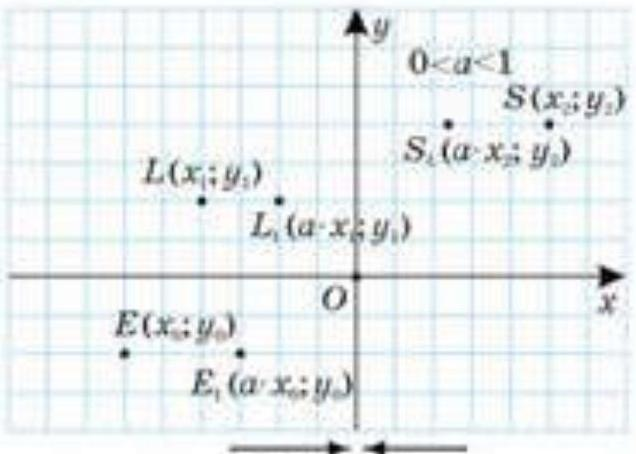

Ox oci бойымен $\frac{1}{a}(0<a<1)$ ece cыry
Ox oci бойымен $\frac{1}{a}(0<a<1)$ ece cosy 5.5-cypet

\begin{figure}
\includegraphics[alt={},max width=\textwidth]{https://cdn.mathpix.com/cropped/b3f159e3-70ef-4ad9-b9e9-0ac5b230efd7-050.jpg?height=631&width=641&top_left_y=242&top_left_x=1210}
\captionsetup{labelformat=empty}
\caption{5.6-cyper}
\end{figure}

Мұндай жағдайда $E_{1}\left(a x_{0} ; y_{0}\right), L_{1}\left(a x_{1} ; y_{1}\right), S_{1}\left(a x_{2} ; y_{2}\right)$ нүктелері $O x$ осі бойымен $\frac{1}{a}(0<a<1)$ есе созу нәтижесінде сэікесінше $E\left(x_{0} ; y_{0}\right)$, $L\left(x_{1} ; y_{1}\right), S\left(x_{2} ; y_{2}\right)$ нүктелеріне кешеді және керісінше $E\left(x_{0} ; y_{0}\right), L\left(x_{1} ; y_{1}\right)$, $S\left(x_{2} ; y_{2}\right)$ нүктелері $O x$ осі бойыме н $\frac{1}{a}(0<a<1)$ есе сығу нәтижесінде сәйкесінше $E_{1}\left(a x_{0} ; y_{0}\right), L_{1}\left(a x_{1} ; y_{1}\right), S_{1}\left(a x_{2} ; y_{2}\right)$ нүктелеріне кешеді.

Аныктама. $A_{0}\left(x_{0} ; y_{0}\right)$ және $A_{1}\left(x_{1} ; y_{1}\right)$ нуктелерінін координапатары $y_{1}=y_{0}$ ждне $x_{1}=a x_{0}(0<a<1)$ катынасымен байганысты болса, онда Ох осі бойыме н $\frac{1}{a}$ есе сыгу натижесінде $A_{0}\left(x_{0} ; y_{0}\right)$ нуктесі $A_{1}\left(x_{1} ; y_{1}\right)$ нуктесіне ждне керісіние $O$ х осі бойымен $\frac{1}{a}(0<a<1)$ есе созу натижесінде $A_{1}\left(x_{1} ; y_{1}\right)$ нуктесі $A_{0}\left(x_{0} ; y_{0}\right)$ нуктесін е көшеді деп айтады.
$y=f(x)$ және $y=f(a x)$ функшиларын карастырайык, $y=f(x)$ функциясынын графигі берілсін (5.7.1-сурет). $y=f(a x)$, мундағы $0<a<1$. функциясынын графигін салу керек.
$x O y$ координаталар жүйесінде осы функииялардын графиктерін салыстырайык. Ол үшін $y=f(a x)$, мұндағы $0<a<1$, функциясынын

\begin{figure}
\includegraphics[alt={},max width=\textwidth]{https://cdn.mathpix.com/cropped/b3f159e3-70ef-4ad9-b9e9-0ac5b230efd7-050.jpg?height=440&width=629&top_left_y=2078&top_left_x=388}
\captionsetup{labelformat=empty}
\caption{5.7.1-cyper}
\end{figure}

\begin{figure}
\includegraphics[alt={},max width=\textwidth]{https://cdn.mathpix.com/cropped/b3f159e3-70ef-4ad9-b9e9-0ac5b230efd7-050.jpg?height=561&width=696&top_left_y=2078&top_left_x=1137}
\captionsetup{labelformat=empty}
\caption{5.7.2-cyper}
\end{figure}

графигінен кез келген $A_{0}\left(x_{0} ; y_{0}\right)$ нүктесін аламыз (5.7.2-сурет). Бұл $y_{0}=f\left(a x_{0}\right)(1)$ тениінін дурыстығын керсетеді.
$y_{1}=y_{0}$ және $x_{1}=a x_{0}$ алмастыруларын енгізсек, (1) тенцик $y_{1}=f\left(x_{1}\right)$ түріне келеді. Демек, $A_{1}\left(x_{1} ; y_{1}\right)$ нүктесі $y=f(x)$ функциясынын графигіне тністі.
$A_{0}\left(x_{0} ; y_{0}\right)$ және $A_{1}\left(x_{1} ; y_{1}\right)$ нүктелерініи кооршнаталары $y_{1}=y_{0}$ және $x_{1}=a x_{0}$ катынасымен байланысты болгандыктан, Ox осі бойымен $\frac{1}{a} (0<a<1)$ есе созу нәтижесінде $A_{1}\left(x_{1} ; y_{1}\right)$ нүктесі $A_{0}\left(x_{0} ; y_{0}\right)$ нүктесіне көшеді (5.7.3-сурет).

МЫСАЛ 4. 5.8-суретте $y=f(x)$ функшисынын графитін $O x$ осі бойымен 2 есе созу аркылы алынған $y=f\left(\frac{1}{2} x\right)$ функциясынын графигін салу жолы керсетілген.
$a=-1$ болгандағы $y=f(a x)$, ягни $y=f(-x)$ функшясынын графитн салайык.
5.9 -суретте $D\left(x_{0} ; y_{0}\right), F\left(x_{1} ; y_{1}\right), K\left(-x_{2} ;-y_{2}\right)$ нүктелері және оларға сәйкес ординаталары бірдей, ал абсшиссалары -1 -ге кебейпіпен $D_{1}\left(-x_{0} ; y_{0}\right), F_{1}\left(-x_{1} ; y_{1}\right), K_{1}\left(x_{2} ;-y_{2}\right)$ нүктелері белгілентен.

МЫСАЛ 5. 5.10 -суретте $D(4 ; 2), F(-1 ; 1), K(-5 ;-2,5)$ нуктелері және оларға сойкес ординаталары бірдей, абсциссалары -1-ге кебейтітен $D_{1}(-4 ; 2), F_{1}(1 ; 1), K_{1}(5 ;-2,5)$ нүктелері бежілентен.
$D_{1}\left(-x_{0} ; y_{0}\right), F_{1}\left(-x_{1} ; y_{1}\right), K_{1}\left(x_{2} ;-y_{2}\right)$ нүктелері $O y$ осіне караганда $D\left(x_{0} ; y_{0}\right), F\left(x_{1} ; y_{1}\right), K\left(-x_{2} ;-y_{2}\right)$ нүктелеріне спмметрияц. Демек, ордингапры бірдей, абсциссалары карама-карсы сандар болатын нүктелер Оу осіне карағанда симметриялы.
$y=f(x)$ және $y=f(-x)$ функцияларын карастырайык. $y=f(x)$ функциясыныи графигі берілсін (5.11.1-сурет). $y=f(-x)$ функииясынын графигін салу керек. Суреттен функшияны бірдей мендерінде аргументтердін мондері карама-карсы болатынын көреміз (5.11.2-сурет). Баскаша айтканда, кез келген $A\left(x_{0} ; y_{0}\right)$ нүктесі $y=f(x)$ функиясынын
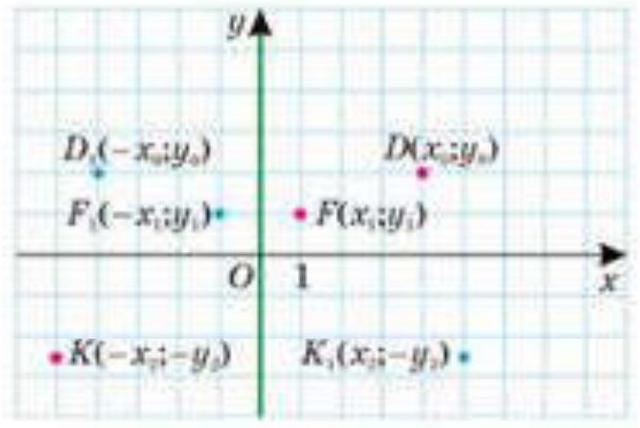

Оу осіне карағанда снмметрияты
5.9-cyper
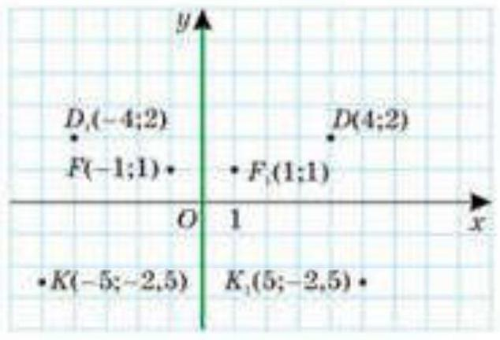
5.10-cyper

\begin{figure}
\includegraphics[alt={},max width=\textwidth]{https://cdn.mathpix.com/cropped/b3f159e3-70ef-4ad9-b9e9-0ac5b230efd7-052.jpg?height=429&width=633&top_left_y=287&top_left_x=379}
\captionsetup{labelformat=empty}
\caption{5.11.1-cyper}
\end{figure}

\begin{figure}
\includegraphics[alt={},max width=\textwidth]{https://cdn.mathpix.com/cropped/b3f159e3-70ef-4ad9-b9e9-0ac5b230efd7-052.jpg?height=423&width=627&top_left_y=242&top_left_x=1123}
\captionsetup{labelformat=empty}
\caption{Oy осіне карағанда симметриялы}
\end{figure}
5.11.2-сурет

графигіне тністі болса, осы нүктеге $O y$ осіне карағанда симметриялы нүкте $y=f(-x)$ функщисыныи графигіне тністі. Демек, $y=f(-x)$ функциясынын графигін $y=f(x)$ функииясынын графигінен $O y$ осіне карағандағы спмметрня аркылы алуға болады (5.11.3-сурет).

\begin{figure}
\includegraphics[alt={},max width=\textwidth]{https://cdn.mathpix.com/cropped/b3f159e3-70ef-4ad9-b9e9-0ac5b230efd7-052.jpg?height=433&width=645&top_left_y=1098&top_left_x=365}
\captionsetup{labelformat=empty}
\caption{5.11.3-cyper}
\end{figure}

\begin{figure}
\includegraphics[alt={},max width=\textwidth]{https://cdn.mathpix.com/cropped/b3f159e3-70ef-4ad9-b9e9-0ac5b230efd7-052.jpg?height=423&width=629&top_left_y=1101&top_left_x=1146}
\captionsetup{labelformat=empty}
\caption{Oy осіне караганда симметрияты}
\end{figure}
5.12-cypet

\section*{МЫСАЛ}
6. 5.12-суретте $y=f(x)$ функшясынын графнгіне $O y$ осіне карағанда снмметрнялы $y=f(-x)$ функциясыныи графигін сату жолы керсетілген.

АлгоРИТМ $y=f(x)$ функиясыныи графигін колданып. $y=f(-x)$ функциясыныи графигін салу алгоритмі:
1) $y=f(x)$ функииясынын графигін саламыз:
2) сатынған графикті $O y$ осіне карағанда симметриялы стіп бейнелейміз.

АЛГОРИТМ $\quad y=f(x)$ функциясыныи графигіи кодданып, $y=f(a x)$, мұнагы $a \in R$, функшисынын графигін салу алгоритмі:
1) $y=f(x)$ функшиясынын графигін сатамыз;
2) егер $|a|>1$ болеа, онда графикті $O x$ осі бойымен $|a|$ есе созамыз;
3) стер $|a|<1$ болеа, онда графикті $O x$ осі бойымен $\left|\frac{1}{a}\right|$ есе сығамыз. Сонда $y=f(a \mid x)$ функциясыныи графигі шыгады:
4) erep $a<0$ болса, онда $y=f(|a| x)$ функшясынын графигін $O y$ осіне карағанда симметриялы етіп саламыз.
$y=f(\lfloor x\rfloor)$ функциясын карастырайык.
5.13-суретте $P\left(x_{0} ; y_{0}\right), T\left(x_{1} ; y_{1}\right), L\left(x_{2} ; y_{2}\right)$. $M\left(x_{3} ; y_{3}\right)$ нүктелері және оларға сэйкес ординаталары бірдей, абсциссалары модульдері бойынша тен $P_{1}\left(\left|x_{0}\right| ; y_{0}\right)$. $T_{1}\left(\left|x_{1}\right|: y_{1}\right), L_{1}\left(\left|x_{2}\right|: y_{2}\right), M_{1}\left(\left|x_{3}\right|: y_{3}\right)$ нүктелері белгілентен.

\section*{МЫСАЛ}
7. 5.14-cyperre $\quad P(-4 ; 2)$,
$$
T(-1 ; 1), \quad L(-5 ;-2,5), \quad M(-3 ;-7)
$$

нуктелері жоне оларға сэйкес ординагалары бірдей, абсциссалары мадуждрі бойыниа тен $P_{1}(4 ; 2), T_{1}(1 ; 1), L_{1}(5 ;-2,5), M_{1}(3 ;-7)$ нүктелері белгілентен.

Демек, сәйкес ординаталары бірдей. абсциссалары карама-карсы болатын нүктелер $O y$ осіне карағанда спмметриялы болады.
$y=f(|x|)$ функшясын карастырайык.
$$
y=f(|x|)=\left\{\begin{array}{l}
f(x), \text { мүндағы } x \mid 0 ; \\
f(-x), \text { мундағы } x<0 .
\end{array}\right.
$$

\section*{АЛГОРИТМ}

Сондыктан $y=f(|x|)$ функциясыньм графигіи салу ушін мына алгоритм кодданылады:
1) $y=f(x)$ функциясыныи графигін саламыз (5.15.1-сурет). одан кейін салынтан графиктін $x \mid \quad 0$ жағдайындағы белігін калдырамыз (5.15.2-cyper);
2) осы болікті Оу осіне караганда снмметриялы етіп бейнетейміз (5.15.3-сурет).
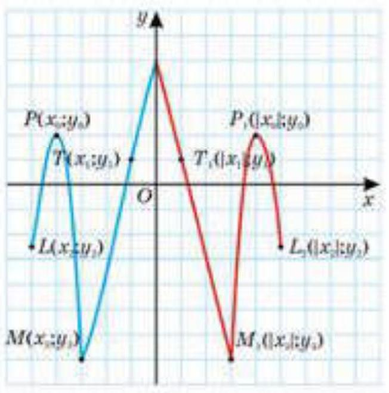

Графиктін Ох осінін сол жағында орналаскан белігінін Оу осіне карагандагы симметриясы

\begin{figure}
\captionsetup{labelformat=empty}
\caption{5.13-cyper}
\includegraphics[alt={},max width=\textwidth]{https://cdn.mathpix.com/cropped/b3f159e3-70ef-4ad9-b9e9-0ac5b230efd7-053.jpg?height=648&width=647&top_left_y=1226&top_left_x=1174}
\end{figure}

5.14-cypet
5.15.1, 5.15.2, 5.15.3-суреттерде $y=f(|x|)$ функциясынын графигін салу жолы керсетітен.

\begin{figure}
\includegraphics[alt={},max width=\textwidth]{https://cdn.mathpix.com/cropped/b3f159e3-70ef-4ad9-b9e9-0ac5b230efd7-053.jpg?height=352&width=515&top_left_y=2218&top_left_x=146}
\captionsetup{labelformat=empty}
\caption{5.15.1-cyper}
\end{figure}

\begin{figure}
\includegraphics[alt={},max width=\textwidth]{https://cdn.mathpix.com/cropped/b3f159e3-70ef-4ad9-b9e9-0ac5b230efd7-053.jpg?height=391&width=469&top_left_y=2179&top_left_x=726}
\captionsetup{labelformat=empty}
\caption{5.15.2-cyper}
\end{figure}

\begin{figure}
\includegraphics[alt={},max width=\textwidth]{https://cdn.mathpix.com/cropped/b3f159e3-70ef-4ad9-b9e9-0ac5b230efd7-053.jpg?height=357&width=557&top_left_y=2213&top_left_x=1260}
\captionsetup{labelformat=empty}
\caption{5.15.3-cyper}
\end{figure}
1. $a$-нын мандай мәндерінде $y=f(a x)$ функииясынын графигіне а) $O x$ осі бойымен созуды; г) $O x$ бойымен сыгуды: б) $O y$ осіне қарағанда снмметрияны колану аркылы $y=f(x)$ функщиясынын графигін алуга болады? Мысал келтіріндер.
2. $y=f(x)$ функшиясыныи графигін колланып, а) $y=f(-2 x)$; ә) $y=f(-0.5-x)$ функциясынын графигін калай салуга болады?
3. Erep; a) $a>1$; г) $0<a<1$; б) $a=-1$ болеа, онда $y=f(x)$ және $y=f(a x)$ функциялары графиктерінін нуктелері калай байланыскан? Мысал келтіріндер.

\section*{Жаттығулар}

\section*{A}
5.1. Erep $a$-нын мәні: 1) 2; 2) 1,5; 3) 4-ке тен болса, онда $O x$ осі бойымен $a$ есе сығуды орындағанда $A(4 ; 5)$ нүктесі кешетін нүктенін координаталарын табындар. Осы нүктелерді координаталык жазыктыкка салындар.
5.2. Erep $a$-нын мәні: 1) $-0,5 ; 2)-\frac{2}{5} ;$ 3) $\frac{3}{4}$-ке тен болса, онда $O x$ осі бойымен $a$ есе сығуды орынд ағанда $C(-2 ; 3)$ нүктесі көшетін нүктенін координаталарын табындар. Осы нүктелерді координаталык жазыктыкка салындар.
5.3. Erep $a$-нын мәні: 1) 0,$5 ; 2$ ) $\frac{2}{3}$; 3) $\frac{4}{5}$-ке тен болса, онда $O x$ осі бойымен $a$ есе сығуды орындағанда $M(-4 ; 6)$ нүктесі көшетін нүктенін координаталарын табындар. Осы нүктелерді координаталык жазыктыкка салындар.
5.4. $y=x^{2}-2$ функшиясынын графигіне $O x$ осі бойымен 3 есе сығуды орындандар. Шыккан функциянын формуласын жазындар.
5.5. $y=x^{2}+3 x$ функциясынын графигіне $O x$ осі бойымен 0,4 есе созуды орындандар. Шыккан функшиныи формуласын жазындар.
5.6. $A B C K$ тіктертбұрышы тебелерінін кооршнаталары берітен: $A(0 ; 0)$, $B(0 ; 4), C(6 ; 4), K(6 ; 0)$. Тіктертбұрыштан шаршы алу үшін онымен $O x$ немесе $O y$ осі бойымен созуды немесе сығуды орындандар.

\section*{B}
5.7. $y=\sqrt{x}$ функшисынын графигін колданып берілген функциялардын графигін салындар:
1) $y=\sqrt{2 x}$;
2) $y=\sqrt{0,5 x}$;
3) $y=\sqrt{-4 x}$;
4) $y=\sqrt{-0,2 x}$.
5.8. Берілген функциялар графиктерінін ортак нүктеперінін санын табындар:
1) $y=(2-x)^{2}$ және $y=\sqrt{0,4 x}$;
2) $y=-(2 x-3)^{2}$ және $y=\sqrt{-0,6 x}$.

\section*{C}
5.9. $y=\sqrt{x}$ функшисынын графигін колданып мына функиялардын графигін салындар:
1) $y=\sqrt{2|x|}$;
2) $y=\sqrt{0,5|x|}$;
3) $y=-\sqrt{-4 x}$;
4) $y=2 \sqrt{0,3 x}$.
*5.10. Графиктік тәсілді колданып тендеудін түбірлерінін санын табындар:
1) $x^{2}-2|x|=\frac{1}{|x|}$;
2) $-x^{2}+4|x|=-\sqrt{2|x|}$.
5.11. Функшияныи графигін салындар:
1) $y=\left|x^{2}-4\right| x|+1|$;
2) $y=\left|-x^{2}+2\right| x|-2|$;
3) $y=|\sqrt{|x|}-2|$.

\section*{KARTANAY}
5.12. 1) $y=\left\{\begin{array}{l}x^{2}-3, \text { мүндағы } x \mid 0, \\ 3-2 x, \text { мундағы } x<0 ;\end{array}\right.$ 2) $y=\left\{\begin{array}{l}x^{2}+3 x, \text { мұндағы } x \mid 0, \\ \sqrt{-x}, \text { мундағы } x<0\end{array}\right.$ функциясынын грефипн салындар.
5.13. 1) $|x-2|-2|x+1|=4$; 2) $2|x-1|-|x+3|=-3$ тендеуінін түбірлерін табындар.
5.14.
1) $\left\{\begin{array}{l}x^{2}-x-3>0, \\ 3 x+5 \leq-1 ;\end{array}\right.$
2) $\left\{\begin{array}{l}3 x^{2}+3<10 x, \\ x^{2}+2<3 x\end{array}\right.$ тенсіздіктер жүйесін шешіндер .

\section*{ЖАНА БІЛІМДІ МЕҢГЕРУГЕ АРНАЛҒАН ТІРЕК ҰҒЫМДАР}

Сызыктык функция, квадраттых функция және олардын графиктері, кері пропорционалдық, координататык жазыктык, нуктенін координаталары, фигураны тургендіру түргері, нүктеге караганда және тузуге каразанда симметрия, паралтель көшіру, гоможетия.

\section*{§6. ФУНКЦИЯНЫИ ГРАФИГІН ТҮРЛЕНДІРУ}

Функция графигін түрлендіруді (параллель кешіру, сығу, созу) орындауды үйренесіндер.

\section*{ТЧЙІнДІ ұғымдАР}

График, функция, параллель көшіру, сығу, созу

АЛГОРИТМ $\quad y=f(x)$ функциясыныи графигін колданып $y=k f(a(x+n))+m$ функшиясынын графигін салу алгоритмі:
1) $y=f(x)$ функциясыныи графигін саламыз;
2) $y=f(x)$ функинсынын графигін $O x$ осі бойымен $|a|$ есе сыгу аркылы. $y=f(a x)$ функциясынын графигін аламыз. Erep $a<0$ болса, онда салынған графикті Оу осіне карағанда симметриялы етіп бейнелейміз:
3) шыкқан графнкті $O y$ осі бойымен $k$ есе созу аркылы, $y=k f(a x)$ функшиясынын графигіи аламыз. Erep $k<0$ болса, онда салынгаи графикті $O x$ осіне карағанда симметриялы етіп бейнелейміз;
4) алынган графикті $O x$ осі бойымен $n$ біртікке жытжыту аркылы (созу, сыгу. солка карай жылжыту, онға карай жытжыту, параллель кешіру), $y=k f(a(x+n))$ функциясыныи графигіи аламыз:
5) сонғы графикті $O y$ осі бойымен m бірлікке жычажу аркыты (созу, сығу. солга карай жылжыту, онта қарай жылжыту, параллель кешіру). берілген $y=k f(a(x+n))+m$ функциясыныи графигін аламыз.
$y=\frac{2}{0,25(x+1)}-3$ функциясынын графигін салайык. Берілген функщия $y=k f(a(x+n))+m$ түріне сайкес келеді, мүндағы $k=2, a=0,25$, $m=-3, \quad n=1$. Түрлендіру жасалатын бастапкы функиня $y=\frac{1}{x}$.

\section*{ТЧСІНДІРІҢДЕР}
$y=\frac{1}{x}$ функциясыныи графигіне кандай түрлендіру колдану аркылы. $y=\frac{2}{0,25(x+1)}-3$ функиизсынын графигі алынғаныи гүсіндіріндер (6.1-сурет).

\begin{figure}
\includegraphics[alt={},max width=\textwidth]{https://cdn.mathpix.com/cropped/b3f159e3-70ef-4ad9-b9e9-0ac5b230efd7-056.jpg?height=458&width=414&top_left_y=2126&top_left_x=242}
\captionsetup{labelformat=empty}
\caption{1)}
\end{figure}

\begin{figure}
\includegraphics[alt={},max width=\textwidth]{https://cdn.mathpix.com/cropped/b3f159e3-70ef-4ad9-b9e9-0ac5b230efd7-056.jpg?height=630&width=624&top_left_y=1959&top_left_x=699}
\captionsetup{labelformat=empty}
\caption{$O x$ oci бойымен 4 ece cosy
2)}
\end{figure}

\begin{figure}
\includegraphics[alt={},max width=\textwidth]{https://cdn.mathpix.com/cropped/b3f159e3-70ef-4ad9-b9e9-0ac5b230efd7-056.jpg?height=624&width=563&top_left_y=1962&top_left_x=1352}
\captionsetup{labelformat=empty}
\caption{Ox oci бойымен 2 ece cosy
3)}
\end{figure}
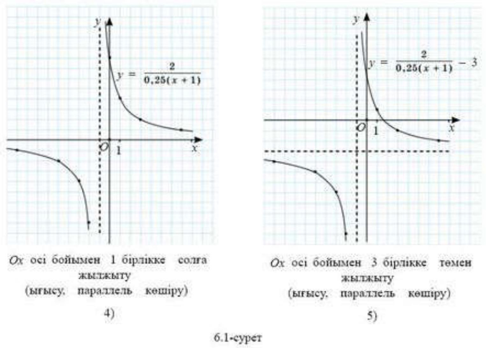
1. $y=f(x)$ функшясынын графигін колланып,
1) $y=3 f(x+2)+1$;
2) $y=3 f(x-2)-1$;
3) $y=-f(-x+1)$ :
4) $y=2 f(2 x+2)$ функшиясыныи графигін салу аторитмін беріндер.
2. $y=f(x)$ функщиясынын графитінен:
1) $O x$ oci бойымен созу және $O y$ осi бойымен сыгу:
2) $O x$ осі бойымен онга және $O y$ осі бойымен жогары жытжыту:
3) Ox oci бойымен алдымен сығу, одан кейін солга жытжыту;
4) $O y$ oci бойымен алдымен созу, одан кейін темен жытжыту аркылы алынған функцията мысал келтіріндер.

\section*{Жаттығулар}

\section*{A}
6.1. Функциянын графигін салу алгоритмін және $y=\frac{1}{x}$ функшясынын графигін колданып $y=f(x)$ функшис ы графигін салындар:
1) $f(x)=2+\frac{1}{x-1}$;
2) $f(x)=3-\frac{1}{x+2}$;
3) $f(x)=\frac{1}{x-3}-2$.
6.2. Функциянын графигін салындар:
1) $y=(x-2)^{2}-3$;
2) $y=4-\sqrt{2 x}$;
3) $y=\sqrt{2-x}-3$.

\section*{B}
$y=f(x)$ функциясы мен $y=k f(a(x+n))+m$ функциясынын графигін салу алгоритмін колданып, берілген функшияардын графитін салындар (6.3-6.4):
6.3. 1) $y=2(x-1)^{2}-4$;
2) $y=3-2 \sqrt{-x}$;
3) $y=3 \sqrt{2-x}-1$.
6.4. 1) $y=-2(x+1)^{2}+3$;
2) $y=4-\sqrt{2-x}$;
3) $y=-3 \sqrt{2-x}+2$.
6.5. $y=f(x)$ функциясы мен $y=k f(a(x+n))+m$ функшиясы графигін салу алгоритмін колданып, функшялардын графигін салындар:
1) $y=2-\frac{3}{x-2}$;
2) $y=2+\frac{1}{x+3}$;
3) $y=-2-\frac{1}{x+4}$.

\section*{C}
6.6. $y=\sqrt{x}$ функциясы мен $y=k f(a(x+n))+m$ функщиясынын графигін салу алгоритмін колданып. функиялардын графигін салындар:
1) $y=2 \sqrt{2 x-4}-1$;
2) $y=1+2 \sqrt{3-2 x}$;
3) $y=-2 \sqrt{6+3 x}+4$.
6.7. $y=\frac{1}{x}$ функшясы мен $y=k f(a(x+n))+m$ функшясыныи графигін салу алгоритмі н колданып, функциятардын графигін салындар:
1) $y=\frac{3 x}{x-2}$;
2) $y=\frac{2 x+1}{x+3}$ :
3) $y=\frac{3 x-2}{2 x+4}$.
6.8. $y=\frac{1}{|x|}$ функинясы мен $y=k f(a(x+n))+m$ функшиясынын графигін салу алго ритмін колданып, функшялардын графигін салындар:
1) $y=2+\frac{1}{|x-2|}$;
2) $y=-3+\frac{1}{|x+3|}$;
3) $y=-2-\frac{2}{|x+4|}$.
6.9. $y=k f(a(x+n))+m$ функщиясынын графигін салу алгоритмін колданып, функциялардын графигін салындар:
1) $y=\left|\frac{3 x+1}{x-1}\right|$;
2) $y=\left|\frac{2-x}{x+3}\right|$;
3) $y=\left|\frac{3 x+4}{x-2}\right|$.
6.10. $y=k f(a(x+n))+m$ функциясынын графитін салу алгоритмін коданып, функшияардын графигін салындар:
1) $y=|\sqrt{x-1}-2|$;
2) $y=|2 \sqrt{2-x}-4|$;
3) $y=|3-\sqrt{2 x-3}|$.

\section*{КАЙТАЛАУ}
6.11. Функциянын аныкталу облысын табындар:
1) $y=\frac{3}{x-3}+\sqrt{\frac{2 x-3}{x^{2}-4}}$;
2) $y=\frac{5 x}{2 x-3}+\sqrt{\frac{1-2 x}{2 x^{2}-18}}$.
6.12. $y=f(x)$ функциясыныи берілген аралыкта өсетінін депешендер:
1) $f(x)=x^{2}-2 x,[1 ;+\infty)$;
2) $f(x)=x^{2}+4 x$, $[-2 ;+\infty)$;
3) $f(x)=-x^{2}+2 x+4, \quad(-\infty ; 1]$.

\section*{ЖАҢА БІЛІМДІ МЕҢГЕРУГЕ АРНАЛҒАН ТІРЕК ҰҒЫМДАР}

Функция, аныхталу облысы, мәндер жныны, функциянын графигі, функцияны беру тәсілдері, функция графигін карапайым түртендіру:

\section*{§7. ФУНКЦИЯНЫИ КАСИЕТТЕРІ}

Функциянын қасиеттерімен (функциянын нөлдері, периодтылығы, бірсарындылық аралықтары, танбатұрактылык аралыктары, функциянын ен улкен және ен кіші мәндері, жұп функция, так функция, шектеулік, экстремум) танысасындар және оларды аныктауды үйренесіндер.

Аныктама . Егер $D$ жиынында $x_{1}<x_{2}$ болатындай кез кетген $x_{1}$ мен $x_{2}$ ушін $f\left(x_{1}\right)<f\left(x_{2}\right)$ тенсіздігі орындатса, онда осы жиында $f(x)$ функииясы өспелі деп аталады .
7.1-суретте өспелі функция кескінделген. 3

\section*{ТУЙІНДІ ¥ғымдАР}

Функцияның нөлдері, периодтылығы, бірсарынды аралыктары, танбатұрақтылык аралыктары, ен кіші және ен үлкен мәндері, жұптылық, тақтылык, шектеулік, экстремум нүктелері, функция зкстремумы
Практикада еспелі функциянын мына аныктамасы колданылады: егер аргументпін кез келеен уткен маніне функциянын учкен мәні сайкес кетсе, онда функция өспелі деп ататабы .

Аныктама .Егер $D$ жнынында $x_{1}<x_{2}$ болатындай кез келген $x_{1}$ мен $x_{2}$ ушін $f\left(x_{1}\right)>f\left(x_{2}\right)$ тенсіздігі орындалса, онда осы $f(x)$ функциясы кемімелі деп ататады .
7.2-суретте кемімелі функция кескінделген.

\begin{figure}
\includegraphics[alt={},max width=\textwidth]{https://cdn.mathpix.com/cropped/b3f159e3-70ef-4ad9-b9e9-0ac5b230efd7-059.jpg?height=372&width=552&top_left_y=2272&top_left_x=376}
\captionsetup{labelformat=empty}
\caption{7.1-cyper}
\end{figure}

\begin{figure}
\includegraphics[alt={},max width=\textwidth]{https://cdn.mathpix.com/cropped/b3f159e3-70ef-4ad9-b9e9-0ac5b230efd7-059.jpg?height=325&width=493&top_left_y=2298&top_left_x=1091}
\captionsetup{labelformat=empty}
\caption{7.2-eyper}
\end{figure}

Практикада кемімелі функцияныи мына аныктамасы колданьлады: егер аргументпін кез келген рлкен мәніне функциянын кіші мані сайкес келсе, онда функция кемімелі деп аталады.

\section*{ТУСІНДІРІНДЕР}

Егер аргументтін кіші меніне функцияныи: 1) кіші; 2) үлкен мәні сәйкес келсе, онда функиия еспелі ме, элде кемімелі ме?

\section*{МЫСАЛ \\ 1. $y=-3 x$ функшиясынын кемімелі екенін делелдейік. Расында}
да, аныктама бойынша аргументтін кез келген үлкен мәніне функциянын үлкен мәні сәйкес келсе, онда функция еспелі болады.
$x_{1}>x_{2}$ болсын. $y_{1}$ және $y_{2}$-нін мәндерін табайык. Сонда $y_{1}=-3 x_{1}$ және $y_{2}=-3 x_{2}$. $y_{1}-y_{2}$ айырымыи карастырайык. $\quad y_{1}-y_{2}$ ернегіндегі $y_{1}$-дин орнына $-3 x_{1}$ және $y_{2}$-ніи орнына $-3 x_{2}$-ні коямыз. Сонда $y_{1}-y_{2}=-3 x_{1}-\left(-3 x_{2}\right)$.

Сонты тендіктегі жакшаны ашып, ортак кебейткішті жакшаныи аллына шытарамыз: $-3 x_{1}+3 x_{2}=-3\left(x_{1}-x_{2}\right) \cdot x_{1}>x_{2}$ болғандыктан, $x_{1}-x_{2}$ айырымынын моні он болады. Сондыктан $y_{1}-y_{2}<0$, онда $y_{1}<y_{2}$.

\section*{ТЧСІНДІРІНДЕР}

Егер функшия кесте түрінде берілее, онда кесте бойынша функинянын еспелі немесе кемімелі болатынын: еспелі де, кемімелі де болмайтыныи калай аныктауға болады?

Өспелі және кемімелі функциялар бірсарынды функциялар деп аталады.

Функцияны бірсарындытыкда зерттеу - функциянын өспелі немесе кемімелі болатынын аныктау.

Аныктама Функцияныи өспелі (кемімелі) болатын аратықтары функцияның өсу (кему) аралықтары деп апалады .

Аныктама. Егер $x$-тін бартык мәні ушін $|f(x)| \mathrm{m} M$ болатындай кандай да бір $M$ саны бар болса, онда $f(x)$ функциясы шектеулі деп аталады. Егер ондай сан болмаса, онда функция шектеусіз деп аталады -

\section*{МЫСАЛ}
2. 7.3-суретте шектеуді функция, 7.4-суретте шектеусіз функция кескінделген.

Аныктама Егер $x$-тін бартык мәні үинін $f(x) \mathrm{m} M$ болатындай қандай да бір $M$ саны бар болса, онда $f(x)$ функциясы жогарыон шектелген деп атагады .

Егер $x$-тін бартых мәні угнін $f(x) \mid M$ болатындай жандай да бір $M$ саны бар болса, онда $f(x)$ функциясы теменнен шектелген деп ататады .

\section*{МЫСАЛ}
3. 7.5-суретте жогарыдан шектелтен функиия, 7.6-суретте теменнен шектелген функция кескіндетген.

\begin{figure}
\includegraphics[alt={},max width=\textwidth]{https://cdn.mathpix.com/cropped/b3f159e3-70ef-4ad9-b9e9-0ac5b230efd7-061.jpg?height=504&width=666&top_left_y=239&top_left_x=301}
\captionsetup{labelformat=empty}
\caption{7.3-cyper}
\end{figure}

\begin{figure}
\includegraphics[alt={},max width=\textwidth]{https://cdn.mathpix.com/cropped/b3f159e3-70ef-4ad9-b9e9-0ac5b230efd7-061.jpg?height=455&width=629&top_left_y=886&top_left_x=269}
\captionsetup{labelformat=empty}
\caption{7.5-cyper}
\end{figure}

\begin{figure}
\includegraphics[alt={},max width=\textwidth]{https://cdn.mathpix.com/cropped/b3f159e3-70ef-4ad9-b9e9-0ac5b230efd7-061.jpg?height=510&width=556&top_left_y=233&top_left_x=1105}
\captionsetup{labelformat=empty}
\caption{7.4-cyper}
\end{figure}

\begin{figure}
\includegraphics[alt={},max width=\textwidth]{https://cdn.mathpix.com/cropped/b3f159e3-70ef-4ad9-b9e9-0ac5b230efd7-061.jpg?height=488&width=659&top_left_y=849&top_left_x=1034}
\captionsetup{labelformat=empty}
\caption{7.6-cyper}
\end{figure}

\section*{ТЧСІНДІРІҢДЕР}
1) $y=f(x)$ функшиясынын графиті $O x$ осіне параллель кандай да бір түзуте қатысты калай орналаскан?
2) $y=k x$ (мұндағы $k \neq 0$ ); $y=x^{2} ; y=-x^{2} ; y=x^{3} ; y=\sqrt{x} ; y=|x|$ функиняларынын кайсысы шектеулі. теменнен шектелген, жогарыдан шектелген?

Аныктама Функциянын мәнін 0-ге айнатдыратын ареументпін мәні функцияныи нелі (myбірі) деп ататады .

Функциянын бірнеше нелі болуы мүмкін.
Мысалы, $y=x(x+1)(x-3)$ функшясыныи үш нелі бар: $x=0$, $x=-1, x=3$.

Функцияныи нелінін геометриялык мағынасы функция графигінін Ox осімен киылысу нүктелерінін абсциссасы болып табылады.

Мысалы, 7.7-суретте нелдері $a, b$ және $c$ болатын функциянын графигі кескінделген.

\begin{figure}
\includegraphics[alt={},max width=\textwidth]{https://cdn.mathpix.com/cropped/b3f159e3-70ef-4ad9-b9e9-0ac5b230efd7-061.jpg?height=284&width=691&top_left_y=2346&top_left_x=212}
\captionsetup{labelformat=empty}
\caption{7.7-cyper}
\end{figure}

\begin{figure}
\includegraphics[alt={},max width=\textwidth]{https://cdn.mathpix.com/cropped/b3f159e3-70ef-4ad9-b9e9-0ac5b230efd7-061.jpg?height=282&width=689&top_left_y=2348&top_left_x=1059}
\captionsetup{labelformat=empty}
\caption{7,8-cyper}
\end{figure}

\section*{МЫСАЛ}
4. $y=-5 x+10$ функциясыныи неллерін, ягни $y=-5 x+10$ функшиемнын графигінін абецисеа осімен киытысу нуктелерін табайык.
Шешуі - Абсцисса осінде жататын нүктелердін ординаталары нелге тен болкандыктан, $\quad y=-5 x+10$ формуласында $y$ орнына 0 санын койып. одан шыккан $0=-5 x+10$ тендеуінен $x$-ті табамыз: $x=2$.

Демек, функшияныи графигі абсцисса осімен координатасы (2: 0) болатын бір нуктеде кнылысады берілген функшияныи нелі 2 саны болады.

\section*{ТУСІНДІРІҢДЕР}
$y=k x$ (мұнтағы $k \neq 0$ ): $y=x^{2}: y=-x^{2}: y=x^{3}: y=\sqrt{x+2}: y=|x|$ функшиятарынын кайсысы үшін 0 саны сол функциянын нелі болып табылалы?

Анықтама Функциянын мәндерін он немесе теріске айналдыратын ареументтердін мәндерінен тұратын сан аралыктары функциянын танбатұрактылық аралықтары деп ататады .

\section*{МЫСАЛ 5. $y=-5 x+10$ функшисыныи мәні он ботатындай $x$ аргументінін}
мәндерін табайык.
Шешуі. Ол үшін $-5 x+10>0$ тенсіздігін шычарамыз. Сонда $-5 x>-10$ немесе $x<2$, яғни, ( $-\infty ; 2$ ) сан аралыгын аламыз.

Жауабы: : (- $\infty$; 2).
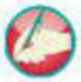
7.8-сурете кескінделген функциянын танбатұрақтылық аралықтарын табындар.

\section*{Функцияныи ен үлкен және ен кіші мәндері.}

Аныктама . Егер: 1) $X$ жиынында $f\left(x_{0}\right)=k$ ботатындай $x_{0}$ саны табытса ; 2) $X$ жиынында кез келген $x$ ушін $f(x) \mathrm{m} k$ тенсіздігі орындатса, онда $k$ саны $x$ жиынындаё $y=f(x)$ функциясынын ен рлкен мәні деп апатады .

Анықтама . Егер: 1) $X$ жиынында $f\left(x_{\theta}\right)=k$ ботатындай $x_{0}$ саны табылса; 2) $X$ жиынында кез кетген $x$ ушін $f(x) \mid k$ тенсіздігі орындатса,

\begin{figure}
\includegraphics[alt={},max width=\textwidth]{https://cdn.mathpix.com/cropped/b3f159e3-70ef-4ad9-b9e9-0ac5b230efd7-062.jpg?height=502&width=458&top_left_y=2110&top_left_x=242}
\captionsetup{labelformat=empty}
\caption{7.9-cypet}
\end{figure} онда $k$ саны $x$ жиынындагы $y=f(x)$ функциясынын ен кіші мәні деп аталады

Ескерту . Егер $X$ жиыны көрсетілмесе, онда функциянын ен үлкен немесе ен кіші мәнін функциянын аныкталу облысында табу керек.

\section*{ТУСІНДІРІҢДЕР}
$y=x^{2}$ функцияеы үшіи [-2: 3] кесіндісінде $y_{\text {ели }}=0$, $y_{\text {ск уман }}=9$ болатынын 7.9 -суретте берілген графикті колданып түсіидіріндер.

Аныктама Есер функциянын:
1) аныжтату обтысы Оу осіне караганда симметрияты болса :
2) анымтату обтысынан атынган кез кепеен $x$ ушін $f(-x)=f(x)$ орындалса, онда функция жұп функция деп аталады .

Мысалы, $y=x^{2}$ функшисы жұп функция. Расында да, 1) аныкталу облысы, яғни ( $-\infty ;+\infty$ ) аралығы $O y$ осіне караганда снмметриялы; 2) аныкталу облысынан алынган кез келген $x$ ушін $f(-x)=(-x)^{2}=x^{2}$ және $f(x)=x^{2}$. Демек, $f(-x)=f(x)$.

\section*{ТУСІНДІРІҢАЕР}
1) $y=x^{4}: y=x^{6}: y=x^{2}: y=x^{10}: y=x^{2 n}$ (мұндагы $n-$ нагурал сан) функциятарынын жұл функция болатынын дәлелдендер.
2) 7.10-суретті колданып, жұп функцияныи графигі неліктен Оу осіне караганда симметриялы (осьтік симметрия) болатынын түсіндіріндер.

\begin{figure}
\includegraphics[alt={},max width=\textwidth]{https://cdn.mathpix.com/cropped/b3f159e3-70ef-4ad9-b9e9-0ac5b230efd7-063.jpg?height=257&width=499&top_left_y=797&top_left_x=1299}
\captionsetup{labelformat=empty}
\caption{7.10-cyper}
\end{figure}

\section*{Аныктама . Егер функцияныи:}
1) аныктату обтысы координаталар басына каразанда симметриялы болса ;
2) анықтату обтысынан атынган кез кетген $x$ ушін $f(-x)=-f(x)$ орындагса, онда функция так функция деп атагады -

Мысалы, $y=x^{3}$ функциясы так функция. Расында да, функшянын 1) аныкталу облысы, яғни ( $-\infty ;+\infty$ ) аралығы координаталар басына карағанда снмметрнялы: 2) аныкталу облысынан алынған кез келген $x$ үшін $f(-x)=(-x)^{3}=-x^{3}$ орындалады. Демек, $f(-x)=-f(x)$.

\section*{ТУСІНДІРІҢДЕР}
1) $y=x^{5} ; y=x^{7} ; y=x^{9} ; y=x^{11} ; y=x^{2 \pi+1}$ (мүндағы $n$ - нагурал сан) функшилары так функшия болатыныи дәлелдендер.
2) 7.11-суретті колданып, так функцияныи графигі неліктен координаталар басына карағанда симметриялы (центрлік свыметрия) болатыныи түсіндіріндер.
3) 7.12, 7.13-суреттераегі графиктердін кайсысы жұп. кайсысы так функцияныи графигі?
4) $A(-3 ;-2), B(1 ; 5), C(3 ; 2), D(-1 ;-5)$ нүктелері бір ғана функцияныи графигіне тністі скені белгілі. Бұл функшия жуп функиия немесе так функиия бола ма?

\begin{figure}
\includegraphics[alt={},max width=\textwidth]{https://cdn.mathpix.com/cropped/b3f159e3-70ef-4ad9-b9e9-0ac5b230efd7-063.jpg?height=593&width=483&top_left_y=1813&top_left_x=1315}
\captionsetup{labelformat=empty}
\caption{7.11-cypet}
\end{figure}

Аныктама Жұп та, так та болмайтын функцнялар жалпы тррегі функциялар дет аталады.

\begin{figure}
\includegraphics[alt={},max width=\textwidth]{https://cdn.mathpix.com/cropped/b3f159e3-70ef-4ad9-b9e9-0ac5b230efd7-064.jpg?height=455&width=533&top_left_y=233&top_left_x=447}
\captionsetup{labelformat=empty}
\caption{7.12-cyper}
\end{figure}

\begin{figure}
\includegraphics[alt={},max width=\textwidth]{https://cdn.mathpix.com/cropped/b3f159e3-70ef-4ad9-b9e9-0ac5b230efd7-064.jpg?height=442&width=588&top_left_y=237&top_left_x=1128}
\captionsetup{labelformat=empty}
\caption{7.13-cyper}
\end{figure}

Аныктама Нукте тиісті балатын кез кетген интерваг нүктенін аймагы деп аталады .

Аныктама а нуктесінін кандай да бір аймагында эрбір $x(x \neq a)$ үинін $f(x)<f(a)$ тенсіздігі орындалган жаздайда гана а нуктесі $y=f(x)$ функциясынын максимум нуктесі деп аталады .

Максимум нүктесінін белгіленуі: $x_{\text {max }}$.
МЫСАЛ 6. Графиті 7.14-суретте кескінделген функциянын максимум нүктесі ушеу: $x_{\max }=-4, x_{\max }=3, x_{\max }=6$.

Аныктама Функциянын максимум нуктесіндегі мәні функцияныи максимумы деп аталады .

МЫСАЛ 7. Графигі 7.14-суретте кескінделген функшижын үш максимумы бар: 5: 4 және -2 . Расында, $5=f(-4) ; 4=f(3) ;-2=f(6)$.

Аныктама a нуктесінін кандай да бір аймаеында эрбір $x(x \neq a)$ үиїн $f(x)>f(a)$ тенсіздігі орындатеан жагдайда гана а нуктесі $y=f(x)$ функциясынын минимум нүктесі деп аталады .

Минимум нүктесінін белгіленуі: $x_{\text {min }}$.

\begin{figure}
\includegraphics[alt={},max width=\textwidth]{https://cdn.mathpix.com/cropped/b3f159e3-70ef-4ad9-b9e9-0ac5b230efd7-064.jpg?height=716&width=1177&top_left_y=1909&top_left_x=493}
\captionsetup{labelformat=empty}
\caption{7.14-cyper}
\end{figure}

МЫСАЛ
8. Графигі 7.14 -суретте кескінделген функциянын минимум нуктесі ушеу: $x_{\text {min }}=-7, x_{\text {min }}=-2, x_{\text {min }}=5$.

Аныктама Функцияныи минимум нуктесіндегі мані функцияныи минимумы деп апалады .

МЫСАЛ
9. Графигі 7.14-суретте кескінделген функциянын үш минимумы бар: -2; 1 жоне -4. Расында, -2 $=f(-7) ; 1=f(-2) ;-4=f(5)$.

Аныктама Макспмум және минимум нуктелері функринын экстремум нуктелері, ат экстремум нуктесіндегі функциянын мәні функциянын экстремумы деп аталады .

МЫСАЛ 10. Графигі 7.14-суретте кескінде.тен функциянын алты экстремум нүктесі бар.

\section*{ТУСІНДІРІНДЕР}

Аныктаманы колданып.
1) 7,15 -суреттегі $x=-1$ және $x=4$ нуктелері максимум, $x=2$ нүктесі мннимум нуктесі болатыныи: 2) 7.16-суреттегі функиняныи максимумы мен минимумыныи тен екеніи түсіндиріндер.

\begin{figure}
\includegraphics[alt={},max width=\textwidth]{https://cdn.mathpix.com/cropped/b3f159e3-70ef-4ad9-b9e9-0ac5b230efd7-065.jpg?height=542&width=549&top_left_y=1640&top_left_x=324}
\captionsetup{labelformat=empty}
\caption{7.15-cyper}
\end{figure}

\begin{figure}
\includegraphics[alt={},max width=\textwidth]{https://cdn.mathpix.com/cropped/b3f159e3-70ef-4ad9-b9e9-0ac5b230efd7-065.jpg?height=542&width=611&top_left_y=1640&top_left_x=1023}
\captionsetup{labelformat=empty}
\caption{7.16-cyper}
\end{figure}

Функшияныи жнындағы ен үлкен мәні функшя максимумынын біреуімен, ен кіші мәні функция минимумынын біреуімен бірдей болуы мүмкін.

МЫСАЛ
11. 7.17-суретте функшияныи максимумы мен функшияныи сн үлкен мәні 5-ке, функцизныи минимумы мен функцияныи ен кіші мәні - 3 -ке тен.

\begin{figure}
\includegraphics[alt={},max width=\textwidth]{https://cdn.mathpix.com/cropped/b3f159e3-70ef-4ad9-b9e9-0ac5b230efd7-066.jpg?height=643&width=711&top_left_y=274&top_left_x=365}
\captionsetup{labelformat=empty}
\caption{7.17-cyper}
\end{figure}

\begin{figure}
\includegraphics[alt={},max width=\textwidth]{https://cdn.mathpix.com/cropped/b3f159e3-70ef-4ad9-b9e9-0ac5b230efd7-066.jpg?height=678&width=572&top_left_y=239&top_left_x=1226}
\captionsetup{labelformat=empty}
\caption{7.18-cyper}
\end{figure}

Функцияныи ен үлкен және ен кіші мәндері функцияныи максимумы және минимумымен бірдей ботмуы да мүмкін.

\section*{МЫСАЛ}
12. 7.18-суретте функцияныи максимумы -2-ге, функциянын ен үлкен мәні 3-ке тен: фунлииныи мннимумы -4-ке, функиияныи ен кіші мәні -б-ға тен.
1. Функшияны: 1) бірсарындылыкка: 2) шектеулілікке зерттеу деген не?
2. Қандай да бір $y=f(x)$ функииясынын графигі ( $-\infty$; 7) ашык сәудесіндегі

барлық $x$ үшін $O x$ осінен жоғары орналасканы және ( $7 ;+\infty$ ) ашык сан аралығы мен $x=7$ болганда $O x$ осін княтыны белгілі. Осы функшиянын нелдері мен танбатұрактылык аралыктарыи атандар.
3. Функшияныи ен улкен немесе ен кіші мані мен функцияныи шектеулілігініи арасыида кандай байланыс бар?
4. Егер функция тек қана жогарыдан немесе тек кана теменнен шектелген болса, онда функция шектеулі бола ма?
5. Функцияны жұптылыка зерттеу деген не?
6. Функцияныи аныкталу облысы координаталар басына караганда симметриялы емес екені белгілі. Функшиныи жұп немесе так болуы мумкін $б е$ ?
7. Функциянын жұп (так) скені белгілі. Осы маліметті функциянын графигін салу барысында калай колдануға болады?
8. Функциянын минимумы осы функшияны максимумынан үлкен болуы мүмкін бе? Мысал келтіріндер.
9. Функииянын максимумы осы функцияныи минимумына тен болуы мүмкін бе? Мысал келтіріндер.
10. Функцияныи макснмумы неліктен функциянын ен кіші мәні болмайды?
11. Функцияныи мннимумы неліктен функцияныи ен үлкен мәні болмайды?

\section*{Жаттығулар}

\section*{A}
7.1. 7.19-суретте $\quad y=f(x)$ функциясынын графигі кескінделген. Графикті колданып функцияныи каснеттерін атандар.

Тура санды тенсіздіктердін каспеттерін колланып, берілген функшянын өспелі болатынын дәлелдендер (7.2-7.3):
7.2.
1) $y=9+2 x$;
2) $y=6 x+1$;
з) $y=-8+4 x$;
4) $y=0.5 x-3$;
5) $y=x^{3}+3$;
6) $y=0,2 x^{3}$ :
7) $y=-5+x^{3}$;
8) $y=x^{3}-1$.

\begin{figure}
\includegraphics[alt={},max width=\textwidth]{https://cdn.mathpix.com/cropped/b3f159e3-70ef-4ad9-b9e9-0ac5b230efd7-067.jpg?height=431&width=577&top_left_y=406&top_left_x=1244}
\captionsetup{labelformat=empty}
\caption{7.19-cyper}
\end{figure}
7.3. 1) $y=x^{2}-4$, мұндағы $x \mid 2$;
2) $y=-x^{2}+2$, мүндағы $x$ m -3 ;
3) $y=-\frac{4}{x}$. мундағы $x \mathrm{~m}-4$;
4) $y=-\frac{3}{x}$, мұндағы $x \mid 3$.

Тура санды тенсіздіктердін каснеттерін колданып берілген функщияныи кемімелі болатынын долелдендер (7.4-7.5) :
7.4.
1) $y=2,5-4 x$;
2) $y=-3 x+2$;
3) $y=-7-x$;
4) $y=-3,5 x+8$;
5) $y=-x^{3}+2$;
6) $y=-2 x^{3}$;
7) $y=-6-x^{3}$;
8) $y=-x^{3}-4$.
7.5. 1) $y=x^{2}-9$, мүндағы $x \mathrm{~m}-2$;
2) $y=-x^{2}+4$, мұндағы $x \mid 3$;
3) $y=\frac{5}{x}$, мундағы $x \mid 5$ :
4) $y=\frac{2}{x}$, мұндағы $x \mathrm{~m}-4$.

Темендегі функшялардын теменнен шектелтен немесе жогарыдан шектелген, немесе шектеулі болатынын аныктандар (7.6-7.7):
7.6.
1) $y=5+x$;
2) $y=-x+9$;
3) $y=-1-x^{2}$;
4) $y=x^{2}+3$;
5) $y=\sqrt{x}-2$;
6) $y=-\sqrt{x}+1$;
7) $y=\frac{2}{x}, x$ m 0 ;
8) $y=-\frac{3}{x}, x \neq 0$;
9) $y=|x|-5$;
10) $y=-|x|+2$;
11) $y=-|x|+6$, мұндағы $-1 \mathrm{~m}_{x} \mathrm{~m} 6$;
12) $y=|x|-7$, мундағы $-3 \mathrm{~m}_{x} \mathrm{~m} 2$.
7.7. 1) $y=x^{2}-4 x+5.25$. мұндағы $-1 \mathrm{~m}_{x} \mathrm{~m} 4$;
2) $y=-x^{2}-x+3.75$, мұндағы $-5 \mathrm{~m}_{x} \mathrm{~m} 1$;
3) $y=x^{2}+6 x+6$, мұндағы $-6 \mathrm{~m}_{x} \mathrm{~m} 0$;
4) $y=-x^{2}-8 x-18,5$, мұндағы $1 \mathrm{~m}_{x} \mathrm{~m} 3$.
7.8. Функцияныи ен улкен және ен кіші мәндерін табындар:
1) $y=1,5+6 x$, мұндағы $-2 \mathrm{~m}_{x} \mathrm{~m} 1$;
2) $y=-0,8 x+10$, мүндағы $-5 \mathrm{~m}_{x}<4$;
3) $y=11-x^{2}$, мұндағы $2<x$ m 7 ;
4) $y=x^{2}+5,4$, мүндағы $-3 \mathrm{~m}_{x} \mathrm{~m}-2$;
5) $y=\sqrt{x}+5$, мұндағы $9 \mathrm{~m}_{x} \mathrm{~m}_{16}$;
6) $y=-\sqrt{x}+4$, мұндағы $0<x \mathrm{~m} 4$;
7) $y=\frac{6}{x}$, мундағы $0,5 \mathrm{~m}_{x}<3$;
8) $y=\frac{4}{x}$, мундағы $-8 m_{x} m-5$;
9) $y=-|x|-8,5$, мұндағы $-7 \mathrm{~m}_{x} \mathrm{~m}-3$;
10) $y=|x|+1,6$, мұндағы $2<x \mathrm{~m} 9$.
7.9. Функцияныи графигін салындар және каснеттерін атандар:
1) $y=\left\{\begin{array}{l}x^{2}+2, \text { мундағы }-2 \mathrm{~m}_{x}<1, \\ -x+3, \text { мүндағы } 1 \mathrm{~m}_{x} \mathrm{~m}_{8} ;\end{array}\right.$
2) $y=\left\{\begin{array}{l}4 x+5, \text { мұндағы }-3 \mathrm{~m}_{x} \mathrm{~m} 0, \\ -x^{3}+1, \text { мұндағы } 0<x \mathrm{~m} 2 .\end{array}\right.$
7.10. Берілген графиктердін кайсысы:
1) жұп функциянын;
2) так функцияныи;
3) жұп та, так та болмайтын функциянын графигі болады (7.20-сурет)?

\begin{figure}
\includegraphics[alt={},max width=\textwidth]{https://cdn.mathpix.com/cropped/b3f159e3-70ef-4ad9-b9e9-0ac5b230efd7-068.jpg?height=451&width=618&top_left_y=1557&top_left_x=383}
\captionsetup{labelformat=empty}
\caption{1)}
\end{figure}

\begin{figure}
\includegraphics[alt={},max width=\textwidth]{https://cdn.mathpix.com/cropped/b3f159e3-70ef-4ad9-b9e9-0ac5b230efd7-068.jpg?height=437&width=488&top_left_y=1562&top_left_x=1210}
\captionsetup{labelformat=empty}
\caption{2)}
\end{figure}

\begin{figure}
\includegraphics[alt={},max width=\textwidth]{https://cdn.mathpix.com/cropped/b3f159e3-70ef-4ad9-b9e9-0ac5b230efd7-068.jpg?height=533&width=597&top_left_y=2060&top_left_x=383}
\captionsetup{labelformat=empty}
\caption{3)}
\end{figure}

4)
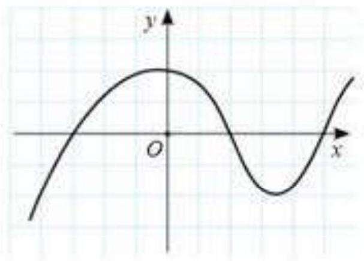

7.20-сурет

Функциялардын жұп болатынын дәлелдендер (7.11-7.13):
7.11.
1) $y=19 x^{2}$;
2) $y=x^{2}-34$;
3) $y=x^{4}-7 x^{2}$;
4) $y=-x^{2}-x^{4}$;
5) $y=\frac{10}{x^{2}}$;
6) $y=-\frac{8}{3+x^{2}}$.
7.12. 1) $y=\sqrt{x^{2}+1}-15$;
2) $y=\sqrt{x^{4}-6}+22$;
3) $y=|x|+54$;
4) $y=31-|x|$.
7.13.
1) $y=|x|+x^{2}$;
2) $y=x^{4}-|x|$;
3) $y=\sqrt{x^{2}+9}-x^{2}$;
4) $y=\sqrt{x+9}+\sqrt{9-x}$.

Функциялардын так болатынын дәлелдендер
(7.14-7.16) :
7.14.
1) $y=23 x$;
2) $y=5 x^{3}$;
3) $y=-9 x^{3}$;
4) $y=-x^{3}+2 x$;
5) $y=\frac{7}{x}+x$;
6) $y=-\frac{16}{x}-x$.
7.15.
1) $y=x \sqrt{x^{4}+1}$;
2) $y=x \sqrt{x^{2}-2}+44 x$;
3) $y=x^{3}|x|$ :
4) $y=-\frac{1}{x}|x|$.
7.16.
1) $y=-x|x|+x^{3}$;
2) $y=-x\left|x^{3}\right|$;
3) $y=\frac{x}{x^{2}+4}-x$;
4) $y=\sqrt{x+8}-\sqrt{8-x}$.
7.17. 7.21-суретте $y=f(x)$ функциясы графигінін бір белігі берілген. Егер берілген функцияныи: 1) жұп; 2) так; 3) жұп та, так та емес екені белгілі болса, онда функциянын $\quad R$ жиынындағы графигін салындар.

\begin{figure}
\includegraphics[alt={},max width=\textwidth]{https://cdn.mathpix.com/cropped/b3f159e3-70ef-4ad9-b9e9-0ac5b230efd7-069.jpg?height=314&width=698&top_left_y=1589&top_left_x=1114}
\captionsetup{labelformat=empty}
\caption{7.21-cyper}
\end{figure}
7.18. Функшяны жұптылыкка зерттендер:
1) $y=-6 x+x^{2}$;
2) $y=|x|-x^{3}$;
3) $y=\sqrt{x^{4}+1}+12|x|$;
4) $y=0,7 x^{3}-x|x|$;
5) $y=-\frac{1}{x^{2}-5}+x$;
6) $y=x-\frac{x}{x^{3}+1}$;
7) $y=\frac{4 x}{x^{4}-2}$;
8) $y=\frac{9+x^{2}}{x^{3}}$.
7.19. Функциянын экстремум нүктелері мен функция экстремумынын аныктамаларын колданып, графигі 7,22-суретте кескінделтен $y=f(x)$ функшясы үшін: 1) макспмум нүктелерін; 2) минимум нүктелерін: 3) функшянын экстремумдарын жазындар.

\begin{figure}
\includegraphics[alt={},max width=\textwidth]{https://cdn.mathpix.com/cropped/b3f159e3-70ef-4ad9-b9e9-0ac5b230efd7-070.jpg?height=919&width=1134&top_left_y=237&top_left_x=516}
\captionsetup{labelformat=empty}
\caption{7.22-cypet}
\end{figure}

\begin{figure}
\includegraphics[alt={},max width=\textwidth]{https://cdn.mathpix.com/cropped/b3f159e3-70ef-4ad9-b9e9-0ac5b230efd7-070.jpg?height=620&width=634&top_left_y=1251&top_left_x=367}
\captionsetup{labelformat=empty}
\caption{\\ 1)}
\end{figure}

\begin{figure}
\includegraphics[alt={},max width=\textwidth]{https://cdn.mathpix.com/cropped/b3f159e3-70ef-4ad9-b9e9-0ac5b230efd7-070.jpg?height=604&width=602&top_left_y=1254&top_left_x=1162}
\captionsetup{labelformat=empty}
\caption{\\ 2)}
\end{figure}

\begin{figure}
\includegraphics[alt={},max width=\textwidth]{https://cdn.mathpix.com/cropped/b3f159e3-70ef-4ad9-b9e9-0ac5b230efd7-070.jpg?height=631&width=691&top_left_y=1939&top_left_x=356}
\captionsetup{labelformat=empty}
\caption{\\ 3)}
\end{figure}

\begin{figure}
\includegraphics[alt={},max width=\textwidth]{https://cdn.mathpix.com/cropped/b3f159e3-70ef-4ad9-b9e9-0ac5b230efd7-070.jpg?height=622&width=682&top_left_y=1944&top_left_x=1123}
\captionsetup{labelformat=empty}
\caption{\\ 4)}}
\end{figure}
7.20. 7.23-суретте кескінделген сызыктардын кайсылары функциянын графигі болады? Функция үшін онын экстремум нүктелері мен экстремумдарын жазындар.
7.21. Функшиныи графигін салындар және экстремум нүктелерін жазындар:
1) $y=2 x^{2}-4 x+3$;
2) $y=-x^{2}-2 x+5$;
3) $y=-2 x^{2}+3 x-4$.

\section*{B}

Тура санды тенсіздіктердін каспеттерін колданып берілген функцияның еспелі болатынын дәлелдендер (7.22-7.23) :
7.22. 1) $y=x^{3}+x$;
2) $y=x^{2}+5 x$, мундағы $x \mid-1$;
3) $y=x^{4}+4$. мундағы $x \mid 2$;
4) $y=-x^{4}+6$, мұндағы $x m-1$.
7.23. 1) $y=\frac{3 x+7}{x+2}$;
2) $y=\frac{6-x}{4-x}$;
3) $y=\{4 x\}$.

Тура санды тенсіздіктердін каспеттерін колданып берілген функшиянын кемімелі болатынын долелдендер (7.24-7.25) :
7.24.
1) $y=-x^{3}-x$;
2) $y=-x^{2}+3 x$. мұндағы $x \mathrm{~m} 1$;
3) $y=x^{4}+3$, мұндағы $x \mathrm{~m}-3$;
4) $y=-x^{4}+8$, мұндағы $x \mid 2$.
7.25.
1) $y=\frac{5-3 x}{x+2}$;
2) $y=\frac{3-2 x}{x-2}$.
7.26. Функшянын ен үлкен және ен кіші мәндерін табындар:
1) $y=x^{2}-x+3,75$;
2) $y=-x^{2}-3 x-6,25$;
3) $y=2 x^{2}-4 x-3$;
4) $y=-3 x^{2}-6 x+4$.
7.27. 7.24-суретте $y=f(x)$ функииясынын графигі кескінделген. $\quad y=(f(x))^{2}$ функциясынын өсу және кему аралыктарын табындар.
7.28. Темендегі функциялардын графигін салындар және каснеттерін атандар:
1) $y=\left\{\begin{array}{l}x+7, \text { мундағы } x<-2, \\ x^{2}-3, \text { мундағы }-2 \mathrm{~m}_{x}<1, \\ \sqrt{x+4}, \text { мундағы } x 11 ;\end{array}\right.$

\begin{figure}
\includegraphics[alt={},max width=\textwidth]{https://cdn.mathpix.com/cropped/b3f159e3-70ef-4ad9-b9e9-0ac5b230efd7-071.jpg?height=556&width=487&top_left_y=1795&top_left_x=1327}
\captionsetup{labelformat=empty}
\caption{7.24-cyper}
\end{figure}
2) $y=\left\{\begin{array}{l}-\frac{6}{x}, \text { мундағы } x<-3, \\ 5 x+14, \text { мундағы }-3 \mathrm{~m}_{x}<0, \\ \sqrt{x+14}, \text { мундағы } x \mid 0 .\end{array}\right.$
7.29. Erep:
1) $f(x)=-11 x+x^{2}$ және $g(x)=-11 x-19$;
2) $f(x)=x^{2}+x^{3}$ және $g(x)=-x^{2}+43 x$;
3) $f(x)=|x|-x^{3}$ және $g(x)=x^{3}-x^{2}$;
4) $f(x)=\frac{6}{x^{4}+1}-15$ және $g(x)=\frac{x-6}{x^{4}+1}+15$ болса, онда $f(x)+g(x)$ функииясы жұп па, элде так па?
7.30. Функцияныи графигін салындар және оны жұптылыкка зерттендер:
1) $y=\left\{\begin{array}{l}-x, \text { мұндағы }-4 \mathrm{~m}_{x}<-2, \\ 6-x^{2}, \text { мүндағы }-2 \mathrm{~m}_{x} \mathrm{~m}_{2}, \\ x, \text { мұндағы } 2<x \mathrm{~m}_{4} ;\end{array}\right.$
2) $y=\left\{\begin{array}{l}x-2, \text { мүндағы }-5 \mathrm{~m}_{x} \mathrm{~m}-1, \\ -4+x^{2}, \text { мундағы }-1<x<1, \\ -x-2, \text { мундағы } 1 \mathrm{~m}_{x} \mathrm{~m} 5 .\end{array}\right.$
7.31. Функцияны жұптылыкка зерттендер:
1) $y=-8 x+x^{2}+x^{3}$;
2) $y=0,2 x^{2}|x|-x^{3}|x|$;
3) $y=\sqrt{x^{3}+x^{2}}-31\left|x^{3}\right|$;
4) $y=-x^{4} \sqrt{x-x^{2}}-x^{2}\left|x^{2}\right|$;
5) $y=-\frac{1}{x^{2}-5}+\sqrt{x^{3}-1}$;
6) $y=\sqrt{x^{2}-1}-\frac{x^{3}}{x^{4}-3}$;
7) $y=x+|x|-\frac{1-x^{2}}{\sqrt{5+x^{3}}}$;
8) $y=\frac{\sqrt{4-x^{2}}}{x^{3}-x}+x^{2}|x|$.
7.32. Функциянын графигін салындар және экстремум нүктелерін жазындар:
1) $y=\left|x^{2}-4\right|$;
2) $y=\left|-x^{2}-2 x\right|$;
3) $y=\left|2 x^{2}-4\right|$;
4) $y=\left|3 x^{2}-6 x\right|$.
7.33. Функцияныи графигін салындар және экстремум нүктелерін жазындар:
1) $y=\left|x^{2}-4 x-1\right|$;
2) $y=\left|x^{2}-2 x+3\right|$;
3) $y=\left|2 x^{2}-6 x+3\right|$;
4) $y=\left|3 x^{2}-6 x-1\right|$.
7.34. Функцияныи графигін салындар және макспмум мен минимум нүктелерін жазындар:
1) $y=|\sqrt{x-2}-1|$;
2) $y=|\sqrt{3-x}-2|$;
3) $y=|4-\sqrt{2 x-3}|$.

\section*{C}
7.35. Функшяны шектеулікке зерттендер:
1) $y=\sqrt{x^{2}-9 x+8}$;
2) $y=\sqrt{8-2 x-x^{2}}$;
3) $y=\frac{1}{\sqrt{x^{2}-9 x+9}}$;
4) $y=\frac{1}{\sqrt{8-2 x-x^{2}}}$.
7.36. Функшияныи есу және кему аралыктарын табындар:
1) $y=\frac{x+3}{x+2}+\sqrt{2+x}$;
2) $y=\frac{x+2}{x-2}+\sqrt{-2+x}$.
7.37. а параметрімен берілген функциянын көрсетілен санды кесіндіге тпісті ен улкен және ен кіші мәндерін табындар:
1) $y=x^{2}+5 x+6 a$; $[-3 ;-1]$;
2) $y=-x^{2}+5 x+8 a$; [-1; 5];
3) $y=x^{2}-a x+7 ;[0 ; 4]$.
7.38. $y=f(x)$ функциясын жұп және так функциялардын косындысы түрінде жазындар:
1) $f(x)=5 x^{4}+7 x^{3}-4 x^{2}-11 x+30$;
2) $f(x)=-x^{4}+x^{3}-11|x|+30 x$;
3) $f(x)=x^{3}-27 x^{2}+x^{2}|x|-x \sqrt{x}$.
7.39. 1) $y=\left\{\begin{array}{l}x^{2}-9, \text { мундағы }-5 \mathrm{~m}_{x}<-3, \\ 3+x, \text { мұндағы }-3 \mathrm{~m}_{x}<0, \\ 3-x, \text { мұндағы } 0 \mathrm{~m}_{x} \mathrm{~m}_{3}, \\ x^{2}-9, \text { мундағы } 3<x \mathrm{~m}_{5},\end{array}\right.$
2) $y=\left\{\begin{array}{l}-x^{2}-2 x-2, \text { мундағы }-4 \mathrm{~m}_{x}<-1, \\ x, \text { мұндағы }-1 \mathrm{~m}_{x} \mathrm{~m}_{1}, \\ -x^{2}-2 x+2, \text { мундағы } 1<x \mathrm{~m}_{4}\end{array}\right.$

функциясынын графигін салындар және каспеттерін атандар.
7.40. $y=f(x)$ функшясы берілген:
1) $f(x)=\left\{\begin{array}{l}4+x^{2}, \text { мундағы } x<0, \\ g(x), \text { мундағы } x \mid 0 .\end{array}\right.$
$y=f(x)$ функщиясы жуп болатындай, $g(x)$ ернегін жазындар;
2) $f(x)=\left\{\begin{array}{l}5-x^{2}, \text { мұндағы } x>0, \\ g(x), \text { мундағы } x<0 .\end{array}\right.$
$y=f(x)$ функциясы так болатындай $g(x)$ өрнегін жазындар.
*7.41. $y=f(x)$ функциясы - так функция.
1) $x>0$ болғанда, $f(x)=\sqrt{x}$; 2) $x \mid 0$ болғанда, $f(x)=x^{2}-4 x$; 3) $x$ mo болғанда, $f(x)=x^{2}+2 x$ екені белгілі. Әрбір жағдай үшін функшинын графигін салындар және формуласын жазындар.
7.42. Функинянын графигін салындар және максимум мен минимум нүктелерін табындар:
1) $f(x)=||x-2|-2|$;
2) $f(x)=|x+1|-3 \mid$;
3) $f(x)=|x+2|-4 \mid$.
7.43. $x_{1}=2$ нүктесінде минимумы және $x_{2}=4$ нүктесінде макспмумы болатын $y=f(x)$ жұп функшисы графигініи кескінін салындар. Осы функшяныи экстремум нүктелерінін санын табындар.
7.44. $x_{1}=1$ нүктесінде минимумы және $x_{2}=3$ нүктесінде макспмумы болатын $y=f(x)$ так функциясы графигінін кескінін салындар. Осы функциянын экстремум нүктелерінін санын табындар.

\section*{КАЯТАЛАУ}
7.45. $\frac{x+11}{x}+\frac{11}{x^{2}}=-\frac{1}{x}$ тендеуінін ен үлкен түбірін табындар.
7.46. Өрнекті ыкшамдандар: $\left(\frac{7-x}{5 x+x^{2}}-\frac{x+6}{5 x-x^{2}}\right)\left(\frac{20 x+23 x^{2}-x^{3}}{23 x-5}-x\right)$.
7.47. $\frac{20+x-x^{2}}{-40+13 x-x^{2}}$ mo тенсіздігін канағаттандыратын барлык бүтін сандардын косындысынын мәнін табындар.
7.48. Тригонометрнялык ернектін мәнін табындар:
1) $\cos 60^{\circ}-\sin 225^{\circ}+\operatorname{tg} 150^{\circ}-\cos ^{2} 300^{\circ}$;
2) $\sin ^{2} 160^{\circ}+\cos ^{2} 160^{\circ}-\sin 135^{\circ}+\operatorname{tg} 240^{\circ}-\sin ^{2} 300^{\circ}$.
7.49. Функциянын мәндер жиынын көрсетіндер:
1) $y=2 x^{2}-4|x|$;
2) $y=x^{2}-3|x|$;
3) $y=2 x^{2}-|x|+2$.

\section*{ЖАҢА БІЛІМДІ МЕҢГЕРУТЕ АРНАЛҒАН ТІРЕК ҰҒЫМДАР}

Сызызты⿱ функция, квадраттык функция, болшек, бутін бөлік, бөлиек-рационат өрнек.

\section*{§ 8. БӨлШЕК-СЫЗЫКТЫК ФУНКЦИЯ}
$y=\frac{a x+b}{c x+d}, c \neq 0, a d \neq b c$, белшек-сызыктык функциясының қасиеттерін анықтауды және графигін салуды үйренесіндер.

\section*{ТЧЙІНДІ ҰғымдАР}

Белшек-сызыктык функция, график

Аныктама $y=\frac{a x+b}{c x+d}, c \neq 0, a d \neq b c$, туріндегі функция болшексызыктык функция дет аталады .
$\frac{a x+b}{c x+d}$ ернегін $\frac{h}{x+n}+m$ туріне келтіруте болатынын дәлелдейік.
Дателдеуі :
$$
\begin{aligned}
\frac{a x+b}{c x+d} & =\frac{a\left(x+\frac{d}{c}-\frac{d}{c}\right)+b}{c\left(x+\frac{d}{c}\right)}=\frac{a\left(x+\frac{d}{c}\right)+\left(b-\frac{a d}{c}\right)}{c\left(x+\frac{d}{c}\right)}= \\
& =\frac{a\left(x+\frac{d}{c}\right)}{c\left(x+\frac{d}{c}\right)}+\frac{b-\frac{a d}{c}}{c\left(x+\frac{d}{c}\right)}=\frac{a}{c}+\frac{\frac{b c-a d}{c^{2}}}{x+\frac{d}{c}} .
\end{aligned}
$$

Егер: $k=\frac{b c-a d}{c^{2}}, n=\frac{d}{c}, m=\frac{a}{c}$ белілеулерін енгізсек, онда $\frac{a x+b}{c x+d}= =\frac{k}{x+n}+m$.

Бұл түрлендіру $y=\frac{a x+b}{c x+d}, c \neq 0, a d \neq b c$, белшек-сызыктык функциясынын графигі пппербола беретінін көрсетеді. Ол $y=\frac{k}{x}$ гиперболасынан $O x$ осі бойымен $|n|$ бірлікке, $O y$ осі бойымен $|m|$ бірлікке параллель кешіру аркылы алынады. Параллель көшірудін бағыты $n$ және $m$ танобаларына байланысты болады.
1. $c=0$ болғанда $y=\frac{a x+b}{c x+d}$ функциясынын графигі не болады?
2. $a d=b c$ болғанда $y=\frac{a x+b}{c x+d}$ функциясынын графигі не болады?
3. Неліктен белшек-сызықтык функциянын аныктамасында $c=0$ және $a d=b c$ жағдайлары қарастырылмаған?

\section*{МЫСАЛ $y=\frac{2 x+1}{x-1}$ белшек-сызыктык функцияеыныи графигіи тұр-}

ғызайык.
Шешу,$y=\frac{2 x+1}{x-1}=\frac{2(x-1)+3}{x-1}=2+\frac{3}{x-1}$ гуріне келтіреміз, онда $y=\frac{2 x+1}{x-1}$ функшияныи графигін $y=\frac{3}{x}$ функиияеыныи графигін $O x$ бойымен 1 біртікке онга және Оу бойымен 2 бірлікке жогары параллель кешіру аркылы алуға болады (8.1-сурет).

\begin{figure}
\includegraphics[alt={},max width=\textwidth]{https://cdn.mathpix.com/cropped/b3f159e3-70ef-4ad9-b9e9-0ac5b230efd7-076.jpg?height=737&width=899&top_left_y=228&top_left_x=625}
\captionsetup{labelformat=empty}
\caption{8.1-cypet}
\end{figure}
(?)
1. $y=\frac{a x+b}{c x+d}$ белшек-сызыктык функшисынын формуласы калай атын ган?
2. Неліктен $y=\frac{a x+b}{c x+d}$ функциясы белшек-сызыктык функиия деп аталады?

\section*{Жаттығулар}

\section*{A}
8.1. $O x$ осі бойымен параллель кешіруді колданып функциянын графигін салындар:
1) $y=\frac{1}{x-2}$;
2) $y=-\frac{1}{x-3}$;
3) $y=\frac{1}{x+2}$;
4) $y=-\frac{1}{x+3}$.
8.2. Функииянын графигін салындар:
1) $y=-\frac{2}{x-2}$;
2) $y=\frac{2}{x-3}$;
3) $y=-\frac{3}{x+2}$;
4) $y=\frac{0,5}{x+3}$.
8.3. $O y$ осі бойымен параллель кешіруді колданып функциянын графигін салындар:
1) $y=1+\frac{1}{x}$;
2) $y=2+\frac{1}{x}$;
3) $y=1-\frac{1}{x}$;
4) $y=2-\frac{1}{x}$.
8.4. Функцияның графигін салындар:
1) $y=2+\frac{3}{x}$;
2) $y=1+\frac{2}{x}$;
3) $y=1-\frac{2}{x}$;
4) $y=2-\frac{1}{2 x}$.
8.5. Функциянын графигін салындар:
1) $y=2+\frac{1}{x-2}$;
2) $y=2+\frac{1}{x-3}$;
3) $y=1-\frac{1}{x+2}$;
4) $y=1-\frac{1}{x+3}$.
8.6. Функшяныи графигін салындар:
1) $y=1-\frac{1}{x-2}$;
2) $y=3-\frac{2}{x-3}$;
3) $y=3-\frac{2}{x+2}$;
4) $y=3-\frac{1}{2 x+4}$

\section*{B}
8.7. $f(x)$ функшясынын графигі бойынша онын аналитикалык формуласын жазындар (8.2-сурет).

\begin{figure}
\includegraphics[alt={},max width=\textwidth]{https://cdn.mathpix.com/cropped/b3f159e3-70ef-4ad9-b9e9-0ac5b230efd7-077.jpg?height=565&width=675&top_left_y=854&top_left_x=269}
\captionsetup{labelformat=empty}
\caption{1)}
\end{figure}

\begin{figure}
\includegraphics[alt={},max width=\textwidth]{https://cdn.mathpix.com/cropped/b3f159e3-70ef-4ad9-b9e9-0ac5b230efd7-077.jpg?height=572&width=615&top_left_y=849&top_left_x=1096}
\captionsetup{labelformat=empty}
\caption{2)}
\end{figure}
8.2-cyper
8.8. Функииянын графигін салындар:
1) $y=\frac{1}{|x-2|}$;
2) $y=\frac{1}{|x-3|}$;
3) $y=\left|\frac{1}{|x+2|}\right|$ :
4) $y=\left|\frac{1}{2 x-3}\right|$.
8.9. Функциянын графигін салындар:
1) $y=\frac{1}{|2 x-1|}$;
2) $y=\frac{1}{|2 x+3|}$;
3) $y=\left|1+\frac{1}{x+2}\right|$;
4) $y=\left|1+\frac{1}{2 x-3}\right|$.

\section*{C}
8.10. Функшяныи графигін салындар:
1) $y=\frac{2 x}{x-2}$;
2) $y=\frac{3 x-1}{x-3}$;
3) $y=\left|\frac{4 x}{x+2}\right|$;
4) $y=\left|\frac{-2 x}{2 x-3}\right|$.
8.11. 8.3-суретте $f(x)$ функциясынын графигі берілген. Егер функшянын графигі $A(2 ; 1)$ нүктесі аркылы өтетін болса, онда функшияныи аналитикалык формуласын жазындар.

\begin{figure}
\includegraphics[alt={},max width=\textwidth]{https://cdn.mathpix.com/cropped/b3f159e3-70ef-4ad9-b9e9-0ac5b230efd7-077.jpg?height=474&width=563&top_left_y=2147&top_left_x=1263}
\captionsetup{labelformat=empty}
\caption{8.3-eyper}
\end{figure}

Функцияныи графигін салындар (8.12-8.14) :
8.12.
1) $y=\left|\frac{2 x}{x-2}\right|$;
2) $y=\left|\frac{3 x-1}{x-1}\right|$;
3) $y=\left|\frac{4 x+2}{x+2}\right|$;
4) $y=\left|\frac{2 x-1}{2 x-3}\right|$.
8.13. 1) $y=\left|\frac{2 x+5}{2 x-2}\right|$;
2) $y=\left|\frac{4 x-1}{2 x-1}\right|$;
3) $y=\left|\frac{4 x-3}{2 x+1}\right|$;
4) $y=\left|\frac{2 x-5}{2 x+3}\right|$.
8.14. 1) $y=\left|\frac{1-2 x}{2 x-2}\right|$;
2) $y=\left|\frac{4 x+1}{1-2 x}\right|$;
3) $y=\left|\frac{3-4 x}{2 x+1}\right|$;
4) $y=\left|\frac{2 x-5}{3-2 x}\right|$.

\section*{КАИТАЛАУ}
8.15. Өрнекті ыкшамдандар:
1) $2 \sin \left(\frac{\pi}{6}+\alpha\right)-\sqrt{3} \sin \alpha$;
2) $\frac{1}{2} \cos \alpha-\cos \left(\frac{\pi}{3}+\alpha\right)$;
3) $\sqrt{2} \sin \alpha-2 \sin \left(\alpha-\frac{\pi}{4}\right)$;
4) $\cos \left(\alpha-\frac{\pi}{6}\right)-\frac{\sqrt{3}}{2} \cos \alpha$.
8.16. Өрнектін мәнін табындар:
1) $\frac{\cos ^{2} \frac{3 \pi}{8}}{1-\sin ^{2} \frac{3 \pi}{8}}$;
2) $\frac{6 \operatorname{tg} \frac{\pi}{12}}{1-\operatorname{tg}^{2} \frac{\pi}{12}}-1$;
3) $4 \sin 15^{\circ} \cos 15^{\circ}$;
4) $8 \sin 15^{\circ} \cos 15^{\circ} \cos 30^{\circ}$;
5) $\cos ^{2} 15^{\circ}-\cos ^{2} 75^{\circ}$;
6) $\sin ^{2} 15^{\circ}-\sin ^{2} 75^{\circ}$.

\section*{ЖАҢА БІЛІМДІ МЕҢГЕРУГЕ АРНАЛҒАН ТІРЕК ҰҒЫМДАР}

Функция, функциянын графигі, аныктату облысы, мәндер жиыны, функциянын нелдері, периодтылыгы, бірсарындылык аралықтары, танбатцрақтылык аралықтары, функциянын ен үлкен және ен кіші мәндері, ждп функция, так функция, шектетген, экстремум.

\section*{§9. ФУНКЦИЯНЫ ЗЕРТТЕУ ЖЭНЕ ОНЫН ГРАФИГІН САЛУ}

Функцияны зерттеу алгоритмімен танысасындар; функциянын берілген графигі бойынша онын қасиеттерін:
1) аныкталу облысын;
2) мәндер жиынын;
3) функцияныи нелдерін;
4) периодтылығын;
5) бірсарынды аралыктарын;
6) танбатұрақтылык аралықтарын;
7) функциянын ең үлкен және ен кіші мәндерін;
8) жұптылығы мен тақтылығын;
9) шектеулігін;
10) экстремумдарын анықтауды үйренесіндер.

\section*{ТУЙІНДІ ¥ғыМДАР}

Аныкталу облысы, мәндер жиыны, функциянын нелдері, шектеулік периодтылык, бірсарынды, танбагурақтылык аралыктары, ен үлкен мәні; ең кіші мәні, жұл; так: үзіліссіздік, экстремум

\section*{СЕНДЕР Б1ЛЕСІНАЕР:}

Координаталары $y=f(x)$ тендігін канагаттандыратын жазыктыктыи барлык нүктелер жиыны функцияны графиаі деп аталады.

Функцияныи графигін салу үшін координаталары $y=f(x)$ тендігін канағаттандыратын нүктелерді мүмкіндігінше көбірек салу керек. Графикті осылайша салу әдісі, біріншіден, көп уакыпы кажет етеді, екіншіден, графиктін барлык нүктелерін салу мүмкін емес және онын нәтижесінде графиктін дррыс салынбауы да мүмкін. Функциянын графигін делірек салу ршін функцияга зерттеу жасалады.

\section*{АЛГОРИТМ Функшиянын графигін сату алгоритмі:}
1) $f$ функциясыныи $D(f)$ аныктату облысы мен $E(f)$ мәнер жнынын табу:
2) функцияныи жұп немесе так және периодты скенін анықтау:
3) функция графигінін координаталык осьтермен кнытысу нуктелерініи координаталарын табу:
4) функшияныи танбатурактылык аралыктарын табу;
5) функциянын бірсарындылық (есу жэне кему) аралыктарын табу;
6) функцижыи экстремум (макснмум мен миннмум) нуктелеріи табу және осы пуктелердегі функцияныи момаерін есептеу;
7) функциянын ен үлкен және ен кіші мәндерін табу:
8) функшиныи шектеулі болуын аныктау;
9) егер функииянын аныкталу облысына кірмейтіи нуктелері болеа, онда осындай нуктелердін аймағында функцияны зергтеу, яғни аргументтін мэні осы нүктеге жакындаған сайын функциянын мәні неге ұмтылатынын аныктау.

Бул алгорнтм үлгі ретінде берілген, сондыктан онын әрбір пунктін орындау тпімді емес. Мысалы, тендеу аналитикалык тәсілмен шығарылмаған жагдайда және т.б.

\section*{МЫСАЛ}
$y=\frac{2}{0,5 x+2,5}-3$ функшисыи зерттеп. трафигін салайык.
Шеиці . Алымен $\frac{2}{0.5 x+2.5}-3$ ернегін турлендіреміз. Белыдегі 0.5 санын жакшанын алдына жэне модуль танбасынын сыртына шытарып. $\frac{2}{0,5|x+5|}-3$ ернегін аламыз. Одан кейін белиектін алымы мен белімін 0,5 санына кы картсак, $\frac{4}{|x+5|}-3$ ернегі шытады. Сонда берілген функиия $y=\frac{4}{|x+5|}-3$ туріне келеді.
1. $y=f(x)$ функниясынын $D(f)$ аныктату облысы мен $E(f)$ мәндер жиынын табайык.

Функииянын аныктаду обдысы көрсетіммегендіктен, онын аныктату облысы $\frac{4}{|x+5|}-3$ ернегініи аныктату облысымен сойкес келеді.

Белімі нелден езгеше болганда ғана белшектін мағынасы болатыны белгілі. Сондыктан $D(f)=(-\infty ;-5) \cup(-5 ;+\infty)$.
$$
\frac{4}{|x+5|}>0 \text { болгандыктан, } \quad \frac{4}{|x+5|}-3>-3 . \text { Демек, } E(f)=(-3 ;+\infty) .
$$
2. Функциянын ждп немесе так және периодты болатынын аныктайык.

Функшиныи аныктату облысы $D(f)=(-\infty ;-5) \cup(-5 ;+\infty)$ нелге карағанда симметриялы бовмагандыктан. $\quad y=\frac{4}{|x+5|}-3$ функциясы жұп та. так та болмайды.

Функиия пернодты смес. Аныкталу облысынан алынган барлык $x$ ушін $\frac{4}{|x+T+5|}- -3=\frac{4}{|x+5|}-3$ тенчі орыналапындй $\quad T \neq 0$ саны болмайды. Расымда, $T$-га катысты $\frac{4}{|x+T+5|}-3=\frac{4}{|x+5|}-3$ тендеуіи шешейі. Сонда $\frac{4}{|x+T+5|}=\frac{4}{|x+5|}$ немесе $x+T+5 \mid= =|x+5|$. Сонты тендік $T=0$ болганда гана тура.
3. Функция графигіни координаталык осьтермен кныпысу нуктелерінии координаталарын табайык.

Егер $y=0$ болса. онда $\frac{4}{|x+5|}-3=0$ немесе $|x+5|=1 \frac{1}{3}$. Ендеше $x_{1}=-3 \frac{2}{3}$ және $x_{2}=-6 \frac{1}{3}$, Демек, функциянын екі нелі (гүбірі) бар, ал функшиянын графигі $O x$ осін екі нуктеде, ягни $A\left(-3 \frac{2}{3} ; 0\right)$ және $B\left(-6 \frac{1}{3} ; 0\right)$ нүктелерінде княлы.
$x=0$. онда $f(0)=\frac{4}{|0+5|}-3=0.8-3=-2.2$. Демек, функиияныи графигі $O y$ осін $C(0:-2.2)$ нуктесінде кияды.
4. Функцияныи танбатұрактылык аралықтарыи табайык.
$f(x)>0$ болатындай $x$-тін барлык мондерін табайык. Ол үшін $\frac{4}{|x+5|}-3>0$ тенсіздігін шешеміз.
$x>-5$ болтанда $\frac{4}{|x+5|}-3>0$ тенсізді ${ }^{\text {п }}$ мына турге келеді: $\frac{4}{|x+5|}-3>0$ немесе $\frac{4-3 x-15}{x+5}>0$, немесе $\frac{-3 x-11}{x+5}>0$. Сонғы тенсіздіктін шешім $\left(-5 ;-3 \frac{2}{3}\right)$ санды интервалы ботады (9.1-сурет).
$x<-5$ болтанда $\frac{4}{|x+5|}-3>0$ тенсіздігі мына турге кетелі: $\frac{4}{-x-5}-3>0$ немесе $\frac{4+3 x+15}{x+5}<0$, немесе $\frac{3 x+19}{x+5}<0$. Сонғы тенсіздіктін шешімі $\left(-6 \frac{1}{3} ;-5\right)$ ннтервалы болады (9.2-сурет).

\begin{figure}
\includegraphics[alt={},max width=\textwidth]{https://cdn.mathpix.com/cropped/b3f159e3-70ef-4ad9-b9e9-0ac5b230efd7-080.jpg?height=204&width=519&top_left_y=1978&top_left_x=461}
\captionsetup{labelformat=empty}
\caption{9.1-cyper}
\end{figure}

\begin{figure}
\includegraphics[alt={},max width=\textwidth]{https://cdn.mathpix.com/cropped/b3f159e3-70ef-4ad9-b9e9-0ac5b230efd7-080.jpg?height=198&width=483&top_left_y=1980&top_left_x=1219}
\captionsetup{labelformat=empty}
\caption{9.2-cyper}
\end{figure}

Сонымен. $\left(-6 \frac{1}{3} ;-5\right) \cup\left(-5 ;-3 \frac{2}{3}\right)$ жиынына тиісті барлык $x$ ушін $f(x)>0$. Тура осылай $f(x)<0$ болатындай $x$-тін барлык мондерін табута болады. Ол үшіи $\frac{4}{|x+5|}- -3<0$ тенсіздігін шешеміз.
$\frac{4}{|x+5|}-3<0$ тенсіздігінін шешімі $\left(-\infty ;-6 \frac{1}{3}\right) \cup\left(-3 \frac{2}{3} ;+\infty\right)$ жиыны болатынын ездерің қарастырындар.

Демек, $\left(-\infty ;-6 \frac{1}{3}\right) \cup\left(-3 \frac{2}{3} ;+\infty\right)$ жнынына тністі бартык $x$ үшін функция теріс мәндерді каобылаийды
5. Функцияныи есу жэне кему аралыктарыи табайык.
$x_{1}<x_{2}<-5$ болеын. $f\left(x_{1}\right)$ және $f\left(x_{2}\right)$ мәндерін сатыстырайык. Ол ушін $f\left(x_{1}\right)-f\left(x_{2}\right)$ айырымын карастырамыз:
$$
f\left(x_{1}\right)-f\left(x_{2}\right)=\frac{4}{-x_{1}-5}-3-\frac{4}{-x_{2}-5}+3=-\frac{4}{x_{1}+5}+\frac{4}{x_{2}+5}=\frac{-4\left(x_{2}-x_{1}\right)}{\left(x_{1}+5\right)\left(x_{2}+5\right)}<0
$$

Демек, $f\left(x_{1}\right)<f\left(x_{2}\right)$. Онда $(-\infty ;-5)$ жнынынан алынган бартык $x$ үшін де функция еспелі болады.
$-5<x_{1}<x_{2}$ болсын. $f\left(x_{1}\right)$ және $f\left(x_{2}\right)$ мәндерін сатыстырайык. Ол үшіи $f\left(x_{1}\right)-f\left(x_{2}\right)$ айырымын карастырамыз:
$$
f\left(x_{1}\right)-f\left(x_{2}\right)=\frac{4}{x_{1}+5}-3-\frac{4}{x_{2}+5}+3=\frac{4\left(x_{2}-x_{1}\right)}{\left(x_{1}+5\right)\left(x_{2}+5\right)}>0
$$

Демек, $f\left(x_{1}\right)>f\left(x_{2}\right)$. Онда $(-5 ;+\infty)$ жнынынан алынған барлык $x$ үшін де функция кемімелі болады.
6. Функцияныи экстремум (макснмум мен минимум) нуктетерін табамыз және осы нүктелердегі функциянын мәндерін есептейік.

Функцияныи экстремумдары болмайды.
7. Фукшиныи сн үлкен жэне сн кіші мәндерін табайык.

Функцияныи сн үлкен мәні де, сн кіші мәні де болыайды.
8. Функциянын шектеулі болуын аныктайык.
$E(f)=(-3 ;+\infty)$ болғандыктан, барлык $x$ үшін $f(x) \mid-3$ тенсіздігі орындалатын $M=-3$ саны бар. Демек. $f(x)$ фунашисы томеннен шектегеен .
9. $y=\frac{4}{|x+5|}-3$ функшисыныи аныкталу облысыи -5 саны тністі болмағандыктан, аргументіи моні -5 саньна ұмпытанда $|x+5|$ белімі 0 -ге ұмтылады, $\frac{4}{|x+5|}$ белшегінін мәні артады. Сондыктан функциянын мәні плюс шексіздікке ұмтытады $(+\infty)$.
$y=\frac{1}{x}$ функциясынын графигіне туртендірулер колданып, $y=\frac{4}{|x+5|}-3$ функциясынын графигін салайык.

Графикті делірек салу үшін тағы бірнеше нүктенін координаталарын табайык:

\begin{table}
\captionsetup{labelformat=empty}
\caption{9-secme}
\begin{tabular}{|c|c|c|c|c|c|c|c|}
\hline$x$ & -10 & -9 & -1 & -6 & -4 & -5.5 & -4.5 \\
\hline$y$ & -2.2 & -2 & -2 & 1 & 1 & 5 & 5 \\
\hline
\end{tabular}
\end{table}

Осы мәліметтерді колданып, $y=\frac{4}{|x+5|}-3$ функциясы графигін саламыз (9.3-сурет).

\begin{figure}
\includegraphics[alt={},max width=\textwidth]{https://cdn.mathpix.com/cropped/b3f159e3-70ef-4ad9-b9e9-0ac5b230efd7-081.jpg?height=545&width=613&top_left_y=2092&top_left_x=1210}
\captionsetup{labelformat=empty}
\caption{9,3-cypet}
\end{figure}
1. 1) Аналитикалык (формуламен): 2) графиктік госілмен берілген функшияныи аныктату обтысы мен мондер жиынын калай табуға болады? Мысад келтіріндер.
2. 1) Аналитнкалык; 2) графиктік тесілмен берілген функцияныи танбатұрактылык жэне бірсарындылык аралыктарыи калай табуга болады?
3. Егер функшиныи графигі коорлинаталар басына карағанда снмметриялы болса, онда функцияны кандай касиеттері бар?
4. 1) Ен кіші (ен улкен) мәні: 2) максимумы (минимумы) бар функшижарға мысал кеттіріндер.

\section*{Жаттығулар}

\section*{A}
9.1. $y=f(x)$ функшисын жұптылыка тексеріндер:
1) $f(x)=(1-2 x)^{3}+(1+2 x)^{3}$;
2) $f(x)=(3 x-2)^{4}-(3 x+2)^{4}$;
3) $f(x)=|2 x-1|(x+2)+|2 x+1|(x-2)$;
4) $f(x)=|x-1|(x+3)-|x+1|(x-3)$.
9.2. Функциянын аныкталу облысы мен мәндер жнынын табындар:
1) $f(x)=|x-1| \cdot \frac{1}{x-1}$;
2) $f(x)=|x+2| \cdot \frac{1}{2+x}$;
3) $f(x)=\frac{1}{\sqrt{x}-2}$;
4) $f(x)=\frac{2}{\sqrt{x-2}-1}$.
9.3. 1) $f(x)=3 x-5$ функшисынын $\quad R$ жиынында өсетінін:
2) $f(x)=4-2 x$ функииясынын $\quad R$ жнынында кемитінін:
3) $f(x)=3 x^{2}-5$ функциясынын $[0 ;+\infty)$ жнынында өсетінін;
4) $f(x)=1-x^{2}$ функциясынын $[0 ;+\infty)$ жнынында кемитінін дәлелдендер.
9.4. Функшияныи жнында есу және кему анықтамасын колданып,
1) $y=\frac{3}{x-2}$ функциясыныи $(-\infty ; 2)$ жнынында кемитінін;
2) $y=-\frac{1}{x+3}$ функциясыныи ( $-3 ;+\infty$ ) жиынында есетінін;
3) $y=\frac{2 x}{x-1}$ функииясынын $(-\infty ; 1)$ жнынында кемпінін;
4) $y=\frac{3 x}{3-x}$ функциясыныи ( $3 ;+\infty$ )жнынында өсетінін дәлелдендер. Осы функипянын графигін салындар.
9.5. Берілген функцияныи ен үлкен мәнін және осы үлкен мәнді кабылдайтын аргументтін мәнін табындар:
1) $y=3-|x+5|$;
2) $y=4-|x-2|$;
3) $y=3-\sqrt{x-2}$;
4) $y=1-\sqrt{x+1}$.
9.6. 9.4-суретте берілген график бойынша функциянын [-5; 5] кесіндісіндегі есу және кему аралықтарын, экстремум нүктелері мен экстремумдарын, ен үлкен және ен кіші мәндерін көрсетіндер.

\begin{figure}
\includegraphics[alt={},max width=\textwidth]{https://cdn.mathpix.com/cropped/b3f159e3-70ef-4ad9-b9e9-0ac5b230efd7-083.jpg?height=528&width=1031&top_left_y=596&top_left_x=466}
\captionsetup{labelformat=empty}
\caption{9.4-сурет}
\end{figure}
9.7. Берілген функциянын ен кіші мәнін және осы кіші мәнді кабылдайтын сэйкес аргументтін мәнін табындар:
1) $y=3+\sqrt{x+2}$;
2) $y=\sqrt{x^{2}-1}-2$;
3) $y=3+\sqrt{x^{2}-2 x-3}$.

\section*{B}
9.8. Берілген кесіндіте тпісті функцияныи ен үлкен және ен кіші мәндерін табындар:
1) $y=x^{2}-5 x+2$. [1; 4];
2) $y=-x^{2}+2 x+1,[-1 ; 5]$;
3) $y=2 x^{2}+4 x-3,[-3 ; 1]$.
9.9. Функиияны алгоритм бойынша зерттеп графигін салындар:
1) $y=-x^{2}+3 x+2$;
2) $y=3 x^{2}+6 x-4$;
3) $y=2+\frac{2}{x-1}$ :
4) $y=3-\frac{2}{x-1}$;
5) $y=-3+\frac{1}{x+2}$;
6) $y=-2-\frac{2}{2 x-5}$.
9.10. 1) $(-\infty ;-1]$ мен [1; 4] сан аралыктарында есетін және [-1; 1] мен [4; $+\infty$ ) сан аралыктарында кемитін:
2) $(-\infty ; 2]$ мен $[4 ; 6]$ сан аралыктарында есетін және $[2 ; 4]$ пен $[6 ;+\infty)$ сан аралыктарында кемитін:
3) $(-\infty ; 1]$ мен [2; 5] сан аралыктарында кемитін және [1;2] мен $[5 ;+\infty)$ сан аралыктарында есетін;
4) $(-\infty ;-2]$ мен $[3 ; 6]$ сан аралыктарында кемитін және $[-2 ; 3]$ пен $[6:+\infty)$ сан аралыктарында есетін $y=f(x)$ функшясынын графигін салындар.
9.11. 1) $x_{\min }=-3$, $x_{\max }=2$, $f(-3)=-2, f(2)=5$ және $f(-1)=0$;
2) $x_{\text {min }}=-4, x_{\text {max }}=3, f(-4)=-4, f(3)=6$ және $f(-2)=0$;
3) $x_{\text {min }}=-2, x_{\text {max }}=4, f(-2)=-5, f(4)=7$ және $f(1)=1$;
4) $x_{\max }=-3,5, x_{\max }=5, f(-3,5)=-6, f(5)=6$ және $f(-1)=0, f(2)=3$ болса, онда $y=f(x)$ функшиясыныи графигін салындар.

\section*{C}
9.12. 1) $y=f(x)-$ жұп функипя, $x_{\min }=1, x_{\max }=-3, f(-3)=6, f(1)=-2$; 2) $y=f(x)$ - так функшия, $x_{\min }=-3, x_{\max }=-1, f(-3)=-2, f(-1)=3$ болса, онда $y=f(x)$ функшисыныи графигін салындар.
9.13. Функциянын есу және кему аралыктарын, макспмум және минимум нүктелерін, экстремумдарын табындар:
1) $y=(x+1)^{4}+1$;
2) $y=2-(x-1)^{4}$;
3) $y=(x+1)^{3}-2$.
9.14. $f(x)=x^{2}-2$ және $g(x)=\frac{1}{x+2}$ функциялары берілген. Темендегі функциялардыи формуласын жазындар:
1) $y=f(2 x)$;
2) $y=g\left(x^{2}\right)$;
3) $y=g(3 x)$;
4) $y=f(x-2)$.
9.15. 1) $f(x)=x^{4}+4 x$ функшиясыныи $[0 ;+\infty)$ жиынында есетінін;
2) $f(x)=-x^{3}-3 x$ функциясыныи ( $-\infty ;+\infty$ ) жиынында кемитінін;
3) $f(x)=x^{5}+2 x$ функциясынын $R$ жиынында есетінін далелдендер.

\section*{КАЯТАЛАУ}
9.16. Өрнекті ыкшамдандар:
1) $\frac{(1-\cos (2 \pi-\alpha))(1+\cos (2 \pi+\alpha))}{\sin \alpha}$;
2) $\frac{(1-\sin \alpha)(1+\sin (2 \pi+\alpha))}{\cos (\pi-\alpha)}$;
3) $\frac{\operatorname{tg}(\pi-\alpha) \cos (\pi+\alpha)}{\sin \left(\frac{\pi}{2}-\alpha\right)}$;
4) $\frac{\operatorname{ctg}(\pi+\alpha) \sin (\pi+\alpha)}{\sin \left(\frac{3 \pi}{2}-\alpha\right)}$.
9.17.
1) $|\sin \alpha|>\sin \alpha$;
2) $|\cos \alpha|=\cos \alpha$;
3) $|\cos \alpha|>\cos \alpha$;
4) $|\operatorname{tg} \alpha|>\operatorname{tg} \alpha$;
5) $|\operatorname{ctg} \alpha|=\operatorname{ctg} \alpha$;
6) $|\operatorname{ctg} \alpha|<\operatorname{ctg} \alpha$ болса, онда $\alpha$ бұрышы кай координаталык ширекте орналаскан?

\section*{ЖАҢА БІЛІМДІ МЕҢГЕРУГЕ АРНАЛҒАН ТІРЕК ҰҒЫМДАР}

Функция, аргумент, туртендіругер, функцияныи графигі.

\section*{§10. КУРДЕЛІ ФУНКЦИЯ. КЕРІ ФУНКЦИЯ}

Күрделі функция, кері функция ұғымдарымен танысасындар; күрделі функцияны ажыратуды, функциялардын композициясын курастыруды, кері функцияны табуды үйренесіндер; өзара кері функциялардын графиктерінін орналасуынын касиетін білетін боласындар.
$y=f(u)$ функциясын карастырайык. Аргументі баска бір функиня болатын жана

\section*{ТУЙІндІ ұғымдАР}

Курделі функция, кері функция, функциялардын композициялары, өзара кері функциялар $u=g(x)$ функциясын кұрастырайык.

\section*{МЫСАЛ}

ясынан алынған $f(x)=\left(\frac{a x+b}{c x+d}\right)^{2}$.
1. $f(u)=u^{2}, u=k x+b ; u=a x^{2}+b x+c ; u=\frac{a x+b}{c x+d}$ болеын.

Аргументі $u=g(x)$ функциясы болатын $y=f(u)$ функи нфункциянын түрі: $f(x)=(k x+b)^{2} ; f(x)=\left(a x^{2}+b x+c\right)^{2}$;

\section*{ТУСІНДІРІҢАЕР}
$$
f(u)=\sqrt{u} \text { және } u=k x+b: u=a x^{2}+b x+c: u=\frac{a x+b}{c x+d} \text { функциятарынан кетесі }
$$
функшилар калай алынганын гүсінаіріндер: $f(x)=\sqrt{k x+b} ; f(x)=\sqrt{a x^{2}+b x+c}$; $f(x)=\sqrt{\frac{a x+b}{c x+d}}$.

Аныктама : $y=f(x)$ функциясынын $\quad x$ ареументінін орнына $\phi=g(x)$ функциясы атынган $y=f(g(x))$ туріндезі функциясы күрделі функиия деп аталады .
$y=f(g(x))$ күрделі функциясы $\phi=g(x)$ функциясынын мәндері $y=f(x)$ функшясынын аныкталу облысына кіретін $x$ тәуелсіз айнымалысы үшін аныкталған.

\section*{МЫСАЛ}
2. $f(x)=\sqrt{\frac{2 x+1}{x-1}}-$ курделі функция. Бұл функция $f(u)=\sqrt{u}$ функ циясыныи аргументіи $u=\frac{2 x+1}{x-1}$ функииясымен алмастыру аркыты алынаи.
$\left.\frac{2 x+1}{x-1} \right\rvert\, 0$, себебі $f(x)=\sqrt{x}$ функцияеыныи моні теріс емес. Онда $f(x)=\sqrt{\frac{2 x+1}{x-1}}$ функциясыныи аныктату облысы $\left(-\infty ;-\frac{1}{2}\right] \cup(1 ;+\infty)$ аралыктары болады.

Күрделі функцияны бірнеше элементар функциялардан кұрастыруға болады.

\section*{СЕНДЕР БЫЛЕСІНДЕР:}
$D$ жиынынын эрбір $x$ санына кандай да бір ереже аркылы х-ке тәуелді бір ғана $y$ саны табылатын сойкестік $D$ жиынында анымначан санды фупкция деп аталалы.

Кері сәйкестікте керісінше, әрбір $y$ санына $x$ саны сәйкес коїылады.

\section*{МЫСАЛ}
3. Erep 2 санына 4 саны съйкес келсе. онда керісінше 4 санына 2 саны сәйкес келеді.
$y=f(x)$ тендігінен $x$-ті $y$ аркылы өрнектесе, онда $x$-тін $y$-ке тәуелділігін аламыз. Ол тәуелділікті $x=\phi(y)$ деп белгілейік. Сонда $x=\phi(y)$ функциясы $y=f(x)$ функциясына кері функция деп аталады. Функцияны $y$, аргументті $x$ аркылы белгілеу кабылданғандыктан кері функция былайша жазылады: $y=\phi(x)$.
$y=f(x)$ функциясы $D$ жиынында аныкталған, мәндер жныны $E$ болсын.

Аныктама $y=f(x)$ функциясына катысты кері функция ден $E$ жиынында анызталган және әрбір $y \in E$ мәніне $f(x)=y$ болатындай $x \in D$ мәні сәйкес койытатын $x=g(y)$ функциясын айтады .
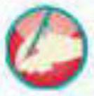

Берілген функция мен оған кері функциянын анықталу облысы мен мәндер жиыны қалай байланыскан?

АЛГОРИТМ Кері функияны кұрастыру алгоритмі:
1) $y=f(x)$ форыутасынан $x \cdot$ ті $y$ аркыты ернектеу:
2) шыкази $x=\phi(y)$ тендікте тәуелді айнымалыны $y$, аргументі $x$ аркылы алмастыру.

МЫСАЛ 4, $y=x^{2}$, мұндагы $x$ I 0 , функшисына кері функцияны курастырайык.
Алгоритм бойынша:
1) $x$-ті $y$ аркылы ернектейміз, сонда $x=\sqrt{y}$;
2) шыкан $x=\sqrt{y}$ тендігінде тәуелді айнымалыны $y$, аргументі $x$ аркылы алмастырамы3: $y=\sqrt{x}$.

Кез келген функцияға кері функция табуға бола ма?

Егер $y=\phi(x)$ - берілген функция, $y=f(x)$ - берілген функцияға кері функши болса, онда $y=f(x)$ және $y=\phi(x)$ функшилары өзара кері функциялар деп аталады.
$y=x^{2}$, мүндағы $x \mid 0$, функциясын және $y=\sqrt{x}$ кері функциясыныи мысалы ретінде алып, өзара кері функщилардын графиктерінін орналасуын қарастырайык.

Өзара кері функциялардын графиктері $y=x$ түзуіне карағанда снмметрнялы болады.
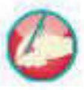
$y=x^{2}$, мұндағы $x \mid 0$ және $y=\sqrt{x}$ функцияларынын графиктері өспелі ме, әлде кемімелі ме (10.1-сурет)?
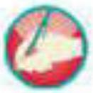
$y=4-2 x$ функциясынын графигін және оған кері функциянын графигін салындар.
Осы функциялар кемімелі бола ма?
Етер $y=f(x)$ функциясы аралыкта өспелі (кемімелі) болса, онда оған кері функция да осы аралыкта өспелі (кемімелі) болады.

Өзара кері функшиялардын графиктері 1 және 3 координаталык ширек-

\begin{figure}
\includegraphics[alt={},max width=\textwidth]{https://cdn.mathpix.com/cropped/b3f159e3-70ef-4ad9-b9e9-0ac5b230efd7-087.jpg?height=652&width=686&top_left_y=230&top_left_x=1133}
\captionsetup{labelformat=empty}
\caption{10.1-cypet}
\end{figure} тердін биссектрисаларына карағанда снмметриялы болады.
1. Аныкталу облысы ( $-\infty ; 5$ ] $\cup(6 ;+\infty)$ аралыктары. мәндер жныны ( $-\infty ;+\infty$ ) аралығы болатын функшяна кері функциянын аныктату облысы мен мәндер жныныи табындар.
2. $y=0,5 x+2$ және $y=2 x-4$ функциялары өзара кері функинжар бола ма?
3. Erep функция бірсарынды болмаса, онда онан кері функция курастыруға бола ма?
4. Неліктен бірсарынды функцияныи эр уакытта кері функциясы болады (10.2-cyper)?

\begin{figure}
\includegraphics[alt={},max width=\textwidth]{https://cdn.mathpix.com/cropped/b3f159e3-70ef-4ad9-b9e9-0ac5b230efd7-087.jpg?height=407&width=666&top_left_y=1215&top_left_x=1123}
\captionsetup{labelformat=empty}
\caption{10.2-cyper}
\end{figure}

\section*{Жаттығулар}

\section*{A}
10.1. $f(x)$ функциясына кері функшияны табындар және бір координаталык жазыктыкта олардын графнктерін салындар:
1) $y=3 x-7$;
2) $y=2-3 x$;
3) $y=2 x+1$;
4) $y=3-2 x$.
10.2. 1) $f(x)=x-1$; 2) $f(x)=3-2 x^{2}$; 3) $f(x)=3 x-x^{2}$ болса, онда $f(3 x), f(2 x-1), f\left(2 x^{2}-1\right)$ курделі функшяларын кұрастырындар.
10.3. $y=\frac{x^{2}}{1+x^{2}}$ тендігі берілген. 1) $x \mid 0$; 2) $x$ mo болганда $x$-ті $y$ аркылы ернектендер.
10.4. 10.1-, 10.2-кестелер аркылы берілген функшянын аныкталу облысын табындар және аныкталу облысында оған кері функцияны аныктандар. Егер кері функциясы бар болса, онда онын графигін салындар:

\begin{table}
\captionsetup{labelformat=empty}
\caption{10.1- necme}
\begin{tabular}{|c|c|c|c|c|c|c|}
\hline$x$ & 1 & 2 & 3 & 5 & 8 & 9 \\
\hline$y$ & 3 & 4 & 5 & 7 & 10 & 11 \\
\hline
\end{tabular}
\end{table}

10.2- secme

\begin{table}
\captionsetup{labelformat=empty}
\caption{10.1- necme}
\begin{tabular}{|l|l|l|l|l|l|l|}
\hline$x$ & 1 & 2 & 3 & 5 & 8 & 9 \\
\hline$y$ & 4 & 5 & 6 & 7 & 5 & 7 \\
\hline
\end{tabular}
\end{table}
10.5. Erep:
1) $f(x)=3 x+5, g(x)=\frac{1}{3} x-\frac{5}{3}$;
2) $f(x)=\frac{3}{5}-6 x, g(x)=0,1-\frac{1}{6} x$;
3) $f(x)=\frac{1}{7} x-3, g(x)=7 x+3$ болса, онда $y=f(x)$ және $y=g(x)$ функциялары өзара кері функциялар бола ма?
10.6. Берілген функцияға кері функцияны табындар және өзара кері функшиятардын графиктерін бір координаталык жазыктыкта салындар:
1) $y=5 x+2$;
2) $y=\frac{1}{3} x-4$;
3) $y=\frac{3}{x-1}$;
4) $y=\frac{2}{x+4}$.

\section*{B}
10.7. Erep:
1) $f(x)=x-1, g(x)=\sqrt{3 x-2}$;
2) $f(x)=3-2 x^{3}, g(x)=\frac{1}{x-2}$;
3) $f(x)=\frac{2 x}{3 x-1}, g(x)=\frac{1}{x^{2}+2}$;
4) $f(x)=\sqrt{x^{3}-2 x}, g(x)=\frac{1}{x^{3}}$;
5) $f(x)=\sin 3 x+5 x, g(x)=x^{2}-1$;
6) $f(x)=\cos 5 x-6, g(x)=\operatorname{tg} 7 x$ болса, онда $f(g(x)), f(f(x)), g(g(x))$ курделі функшияларын кұрастырындар.
10.8. 1) $y=x$; 2) $y=-x$; 3) $y=2 x$; 4) $y=1-x$ функциясы өзіне кері функция бола ма?
10.9.
1) $y=\frac{7}{x}$;
2) $y=-\frac{5}{x}$;
3) $y=\frac{7}{x-2}$;
4) $y=5-\frac{8}{x}$ функциясынын гра фигі оған кері функциянын графигімен беттесе ме?
1) сызыктык:
2) квадраттык;
3) белшек-сызык-
10.10. Егер функшия: тык; 4) $y=\sqrt{x+a}$ түріндегі функшя болса, онда функциянын кері функциясы бола ма?
10.11. 10.3-суретте берілген функцияныи графигін колданып, кері функциясы болатын бірнеше аралыктарды, кері функциясы болмайтын бірнеше аралыктарды жазындар.

\begin{figure}
\includegraphics[alt={},max width=\textwidth]{https://cdn.mathpix.com/cropped/b3f159e3-70ef-4ad9-b9e9-0ac5b230efd7-089.jpg?height=664&width=1356&top_left_y=440&top_left_x=312}
\captionsetup{labelformat=empty}
\caption{10.3-cyper}
\end{figure}

\section*{C}
10.12. Егер функция: 1) жұп; 2) так; 3) пернодты; 4) кемімелі болса, онда онын кері функциясы бола ма?
10.13. Erep: 1) $f(x)=x^{2}, g(x)=\sqrt{x}$; 2) $f(x)=x^{2}, g(x)=\sqrt{-x}$ болса, онда $y=f(g(x))$ функшиясынын графигін салындар.
10.14. Берілген функцияга кері функцияны табындар және олардын графиктерін бір координаталык жазыктыкка салындар:
1) $y=x^{2}+1$, мұндағы $\left.x \mid 0 ; 2\right) y=(x+1)^{2}$, мұндағы $x m-1$;
3) $y=x^{2}-2 x+1$. мұндағы $x \mid 1$;
4) $y=x^{2}-4 x+4$, мұндағы $x \mathrm{~m} 2$.
10.15. Берілген функцияға кері функцияны табындар және олардын графиктерін бір координаталык жазыктыкка салындар:
1) $y=x^{2}-2 x$, мұндағы $x \geq 1$; 2) $y=x^{2}+2 x$, мұндағы $x \leq-1$;
3) $y=x^{2}-3 x$, мундағы $x \leq 1,5$;
4) $y=2+\sqrt{x-2}$, мұндағы $x \geq 2$.

\section*{КАЯТАЛАУ}
10.16. Тепе-тендікті дәлелдендер:
1) $\operatorname{ctg} \alpha-\cos 2 \alpha \cdot \operatorname{ctg} \alpha=\sin 2 \alpha$;
2) $\frac{1-2 \sin ^{2} \alpha}{2 \operatorname{ctg}\left(\frac{\pi}{4}-\alpha\right) \cos ^{2}\left(\frac{\pi}{4}+\alpha\right)}=1$;
3) $\left.\operatorname{tg}^{4} \alpha \cdot\left(8 \cos ^{2}(\pi-\alpha)\right)-\cos (\pi+4 \alpha)-1\right)=8 \sin ^{4} \alpha$;
4) $\operatorname{ctg} 2 \alpha-\sin 4 \alpha=\cos 4 \alpha \cdot \operatorname{ctg} 2 \alpha$.
10.17. Erep:
1) $\sin \alpha \sin \beta=\frac{1}{2}$ және $\alpha-\beta=\frac{7 \pi}{2}$ болса, онда $\cos (\alpha+\beta)$;
2) $\sin \alpha \sin \beta=\frac{1}{4}$ және $\alpha+\beta=\frac{5 \pi}{2}$ болса, онда $\cos (\alpha-\beta)$;
3) $\cos \alpha \cos \beta=\frac{1}{3}$ және $\alpha+\beta=\frac{\pi}{2}$ болса, онда $\sqrt{2} \cos (\alpha+\beta)$ ернегінін мәнін табындар.

\section*{ӨЗІНДІ ТЕКСЕР!}
1. Графигі бойынша функцияныи канша экстремум нүктесі бар (10.4-cyper):
A) 3 ;
B) 4;
C) 2 ;
D) 1 ?
2. Графигі 10.4 -суретте берілген функциянын экстремумдарын табындар:
A) $y_{\text {max }}=1, y_{\text {min }}=3$;
B) $y_{\text {max }}=3, y_{\text {min }}=-1$;
C) $y_{\text {max }}=1, y_{\text {min }}=-1$ және $y_{\text {mag }}=3$;
D) $y_{\text {max }}=1, y_{\text {min }}=3$.
3. Графигі 10.4 -суретте берілген функциянын есу аралыктарын табындар:
А) $[-1 ; 1],[3 ;+\infty)$ :
В) $[-1 ; 0],[3 ;+\infty)$;
C) $(-\infty ;-1]$, $[0 ; 3]$;
D) $(-\infty ;-1]$, $[1 ; 3]$.
4. Графигі 10.4 -суретте берілген функциянын кему аралыктарын табындар:
А) $[-5 ;-3],[-1 ; 1],[3 ; 5]$;

\begin{figure}
\includegraphics[alt={},max width=\textwidth]{https://cdn.mathpix.com/cropped/b3f159e3-70ef-4ad9-b9e9-0ac5b230efd7-090.jpg?height=460&width=550&top_left_y=1489&top_left_x=1372}
\captionsetup{labelformat=empty}
\caption{10.4-cypex}
\end{figure}
В) $[-1 ; 0]$, $[3 ;+\infty)$;
C) $(-\infty ;-1]$, $[0 ; 3]$;
D) $(-\infty ;-1],[1 ; 3]$.
5. Егер $f(x)=x^{2}-3 x, g(x)=2 x-3$ болса, онда $f(g(x))$ күрделі функшиясын кұрастырындар:
А) $f(g(x))=(2 x-3)^{2}-3(2 x-3)$;
B) $f(g(x))=(2 x-3)^{2}+3(2 x-3)$;
C) $f(g(x))=(2 x-3)^{2}-(2 x-3)$;
D) $f(g(x))=(2 x-3)^{2}+(2 x-3)$.
6. Жұп функцияны керсетіндер:
A) $f(x)=3 x^{8}-2 x$;
B) $f(x)=2-x \sqrt{x}$;
C) $f(x)=x^{4}+x^{2}+x$;
D) $f(x)=x^{6}+2 x^{4}$.
7. Жалпы түрде берілген функцияны аныктандар:
А) $f(x)=x^{7}-5 x^{3}+x$;
В) $f(x)=x^{3}-4 x^{3}+x$;
C) $f(x)=x^{6}-5 x^{3}+\frac{1}{x-1}$;
D) $f(x)=x^{4}-2 x^{2}+\sqrt{|x|}$.
8. $y=-\sqrt{x}$ функиисынын графигін $O x$ осі бойымен 3 бірлік солға және $O y$ осі бойымен 3 бірлік жогары жылжытканда шығатын функшиянын графигін көрсетіндер:
А) $y=-\sqrt{x-3}-3$;
B) $y=\sqrt{x-3}+3$;
C) $y=3-\sqrt{x+3}$;
D) $y=\sqrt{x+3}-3$.
9. $f(x)=2(x-1)^{2}-2$ функциясынын графигін алу үшін $y=x^{2}$ функциясыныи графитіне канша түрлендіру колданылады:
А) 2 :
В) 3 ;
C) 4 ;
D) 5 ?
10. $f(x)=\frac{1}{\sqrt{9-x^{2}}}+\frac{2}{x-1}+\sqrt{x+3}$ функциясынын аныкталу облысын табындар :
А) (1; 3);
В) (-3; 3);
C) $[-3 ; 3)$;
D) (-3;
1) $U(1 ; 3)$.

\section*{ЖАҢА БІЛІМДІ МЕҢГЕРУТЕ АРНАЛҒАН ТІРЕК ҰҒЫМДАР}

Функция, функциянын касиеттері және графигі, $y=\sin x$ тригонометриятых функциясынын анықтамасы, $y=\sin x$ тригонаметриялык функциясынын анықтату облысы және мәндер жиыны, тригонометриялых функциятардын мәндері, тригонометриялы тепе-тендіктер.

\section*{ТРИГОНОМЕТРИЯЛЫҚ ФУНКЦИЯЛАР, \\ 2 ОЛАРДЫҢ ҚАСИЕТТЕРІ ЖЭНЕ ГРАФИКТЕРІ}

\section*{§11. $y=\sin x$ ФУНКЦИЯСЫНЫН ГРАФИГI ЖӘНЕ КАСИЕТТЕРІ}
(2)

Синусоида ұғымымен, $y=\sin x$ функциясынын қасиеттерімен танысасындар; синусоиданы салуды үйренесіндер.

\section*{ТЧЙІНДІ ҰҒЫМДАР}

Функция, график, синусоида, синус, периодтылық

\section*{СЕНДЕР БИАЕСІНДЕР:}

Сендер а бұрышыным синусы деп бірлік шенбердіи $P_{\mathrm{o}}$ нуктесінін ордннатасын айтатынын білесіндер.
Синустыи G бурышыныи шамасына тәуелділігі $y=\sin x$ деп белгіленетіи тригонометриялык функция екенін білесіндер. Бұл функшины аныктату облысы $(-\infty ;+\infty), y=\sin x$ функшиям периолты функия және перноды 2 П-ге тен.
$y=\sin x$ функшясынын графигін салу үшін алдымен онын $[0 ; 2 \pi]$ кесіндісіне тністі белігін саламыз. Ол үшін абсщисса осінде абсциссасы $2 \pi(\pi \approx 3,14)$ болатын нүктені белгілейміз және синустын аныктамасын колданамыз. Оу осінін сол жағына центрі Оx осінде жататын бірлік шенбер саламыз және ордината осіне $(0 ;-1)$ және $(0 ; 1)$ нүктелерін белгілейміз. Бірлік шенбер мен $[0 ; 2 \pi]$ кесіндісін тен 16 бөлікке белеміз (11.1-cyper).

\begin{figure}
\includegraphics[alt={},max width=\textwidth]{https://cdn.mathpix.com/cropped/b3f159e3-70ef-4ad9-b9e9-0ac5b230efd7-092.jpg?height=424&width=1196&top_left_y=1685&top_left_x=479}
\captionsetup{labelformat=empty}
\caption{11.1-cypet}
\end{figure}

Бірлік шенберде $P_{\mathrm{G}}$ нүктесін белгілейміз және осы нүкте аркылы абсшисса осіне параллель түзу жүргіземіз. Осы түзу мен $x=\alpha$ түзуінін кнылысу нүктесі $y=\sin x$ функциясы графигінін нүктесі болып табылады. Нүктенін ординатасы $P_{\alpha}$ нүктесінін ординатасымен бірдей, аныктама бойынша $\sin \alpha-P_{\alpha}$ нүктесінін ординатасы.
$y=\sin x$ функшясынын графигін барлык сан түзуінде салу үшін онын $[0 ; 2 \pi]$ кесіндісінде салынған белігін $O x$ осі бойымен $2 \pi n$-ге (мұндағы $n$ - бүтін сан) параллель жыжытамыз.
$y=\sin x$ функциясынын графигі синусопда деп аталады (11.2-сурет).

\begin{figure}
\includegraphics[alt={},max width=\textwidth]{https://cdn.mathpix.com/cropped/b3f159e3-70ef-4ad9-b9e9-0ac5b230efd7-093.jpg?height=287&width=1319&top_left_y=333&top_left_x=322}
\captionsetup{labelformat=empty}
\caption{11.2-cypet}
\end{figure}
$y=\sin x$ функшясынын каспеттері:
1. Аныкталу облысы $-(-\infty ;+\infty)$ сан аралығы.
2. Мандер жиыны - $[-1 ; 1]$ кесіндісі.
3. $y=\sin x$ функциясы шектелтен: $\quad|\sin x| \mathrm{m}_{1}$.
4. $y=\sin x$ функшисы перподты, онын ен кіші периоды 2 п-ге тен. $\sin (x+2 \pi n)=\sin x+$ мундағы $n$ - бүтін сан.
5. $y=\sin x$ функциясы так функция: $\sin (-x)=-\sin x$. Онын графигі координаталар басына карағанда спмметриялы.
6. $y=\sin x$ функшясы ( $2 \pi k ; \pi+2 \pi k$ ) аралығында он мәндерді және $\left(\pi+2 \pi_{k}: 2 \pi+2 \pi k\right)$, мүндағы $k$ - бүтін сан, аралығында теріс мәндерді кабылдайды.
7. $y=\sin x$ функшисы $\left[-\frac{\pi}{2}+2 \pi k ; \frac{\pi}{2}+2 \pi k\right]$ аралығында еседі және $\left[\frac{\pi}{2}+2 \pi k ; \frac{3 \pi}{2}+2 \pi k\right]$ аралығында кемшді, мұндағы $k$ - бүтін сан.

Дагелдеуі. $y=\sin x$ функинясы $\left[-\frac{\pi}{2}+2 \pi k ; \frac{\pi}{2}+2 \pi k\right]$ (мұндағы $k-$ бүтін сан) аралығында өсетінін дәлелд ейік. $y=\sin x$ функшиясы пернодты болғандыктан, дәлелдеуді $\left[-\frac{\pi}{2} ; \frac{\pi}{2}\right]$ кесіндісінде жүргізген жеткілкті.
$x_{2}>x_{1}$ болсын. Спнустардын айырымыныи формуласын колданып, мынаны табамыз:
$\sin \left(x_{2}\right)-\sin \left(x_{1}\right)=2 \cos \frac{x_{1}+x_{2}}{2} \sin \frac{x_{2}-x_{1}}{2}$.
$-\frac{\pi}{2} \mathrm{~m}_{x_{1}}<x_{2} \mathrm{~m} \frac{\pi}{2}$ тенсіздігінен $0<\frac{x_{2}-x_{1}}{2} \mathrm{~m} \frac{\pi}{2}$ және $-\frac{\pi}{2}<\frac{x_{2}+x_{1}}{2}<\frac{\pi}{2}$ шығады. Сондыктан $\cos \left(\frac{x_{1}+x_{2}}{2}\right)>0$ және $\sin \left(\frac{x_{2}-x_{1}}{2}\right)>0$. Демек, $\sin \left(x_{2}\right)-\sin \left(x_{1}\right)>0$ және $\sin \left(x_{2}\right)>\sin \left(x_{1}\right)$. Бұл долелдеу $y=\sin x$ функциясынын берілген аралыкта өсетінін көрсетеді.
$\left[\frac{\pi}{2}+2 \pi n ; \frac{3 \pi}{2}+2 \pi n\right]$, мундағы $n-$ бутін сан, аралықтары $y=\sin x$ функциясынын кему аралықтары болатынын дәлелдендер.

Қарастырылған касиеті бірлік шенбердін көмегімен көрсетуге болады (11.3-сурет).

Егер $-\frac{\pi}{2} m a_{1}<a_{2} m \frac{\pi}{2}$ болса, онда $P_{a_{1}}$ нүктесінін ординатасына карағанда $P_{a_{2}}$ нүктесінін ординатасы үлкен болады (11.3.1-сурет). Егер $\frac{\pi}{2} m \alpha_{1}<\alpha_{2} m \frac{3 \pi}{2}$ болса, онда $P_{a_{1}}$ нүктесінін ординатасына карағанда $P_{\mathrm{o}_{2}}$ нүктесініи ординатасы кіші болады (11.3.2-сурет).

\begin{figure}
\includegraphics[alt={},max width=\textwidth]{https://cdn.mathpix.com/cropped/b3f159e3-70ef-4ad9-b9e9-0ac5b230efd7-094.jpg?height=490&width=533&top_left_y=712&top_left_x=450}
\captionsetup{labelformat=empty}
\caption{1) Бурый (сая) $-\frac{\pi}{2}$-лен $\frac{\pi}{2}$-ге дейти артканда ордината арталы}
\end{figure}

\begin{figure}
\includegraphics[alt={},max width=\textwidth]{https://cdn.mathpix.com/cropped/b3f159e3-70ef-4ad9-b9e9-0ac5b230efd7-094.jpg?height=492&width=533&top_left_y=712&top_left_x=1197}
\captionsetup{labelformat=empty}
\caption{2) Бұрым (сая) $\frac{\pi}{2}$-лен $\frac{3 \pi}{2}$-re артканая ордината кемили}
\end{figure}

11.3-cyper
8. $y=\sin x$ функциясынын экстремумдары: $\quad x_{\min }=-\frac{\pi}{2}+2 \pi k$ (мундағы $k$ - бүтін сан), $x_{\text {max }}=\frac{\pi}{2}+2 \pi k$ (мундағы $k$ - бүтін сан): функциянын ен үлкен және ен кі ші мәндері: $y_{\text {ек умев }}=1, y_{\text {ек кім }}=-1$.

\section*{МЫСАЛ $y=\sin x+2$ функциясынын графигін салайык.}

Шегиу ${ }^{2}$. Алдымен $y=\sin x$ функиисынын графигін саламыз. Ол үшін $A, B, C, D, O, E, F, K, L, M, N$ нүктелерін белгілейміз және оларды кисык сызыкпен косамыз (11.4-сурет). Одан кейін эрбір нүктені ордината (Oy) осі бойымен жоғары 2 бірлікке жытжытамыз. Сонда $A_{1}, B_{1}, C_{1}, D_{1}, O_{1}, E_{1}, F_{1}, K_{1}, L_{1}$, $M_{1,} N_{1}$ нуктелерін аламыз және оларлы қнсык сызықпен косамыз.

\begin{figure}
\includegraphics[alt={},max width=\textwidth]{https://cdn.mathpix.com/cropped/b3f159e3-70ef-4ad9-b9e9-0ac5b230efd7-094.jpg?height=401&width=1322&top_left_y=2101&top_left_x=424}
\captionsetup{labelformat=empty}
\caption{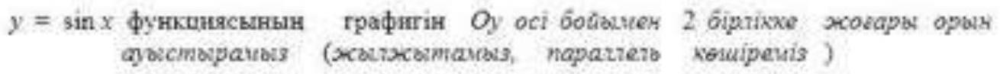
11.4-cypet}
\end{figure}

\section*{$y=A f(k x+b)$ түріндегі функцияныи периодтылығы}

CEHAEP БНПЕСІНДЕР:
$y=f(x)$ функциясыныи аныктату облысынан алыитан кез келтен $x$ үшіи $f(x-T)=f(x+T)=f(x)$ тенаі ${ }_{\text {п }}$ орындалатындай нелге тен емее $T$ саны бар болеа, онда $y=f(x)$ функциясы пернодты болатынын білесіндер. $T$ он санарыныи сн кішісі $y=f(x)$ функииясыныи сн кіші перноды немесс перноды деп аталады.

Егер $y=f(x)$ функциясы периодты жане периоды T-га тен болса, онда $y=A f(k x+b)$, мундагы $A, k, b$ - надты сандар ждне $k \neq 0$, функциясы да пернодты батады және онын периоды $\frac{T}{|k|}$-га тен болады .

Мысалы, $y=\sin 3 x$ функциясыныи перподы $\frac{2 \pi}{3}$-ге, $y=\sin \frac{x}{2}$ функшясынын перноды $4 \pi$-ге тен.
1. $y=\sin x$ функциясынын графигін $O y$ осі бойымен: 1) 4 есе созғанда: 2) 3 есе сыканда алынтан $F(\Pi ; 0)$ нүктесіне сэйкес $F_{1}$ нуктесінін коордниаталары кандай болады?
2. Өздерінін аныкталу облысында берілтен $y=\sin x+2$ жэне $y=\sin x$ функциятарынын пернодтарын салыстырындар (11.4-сурет).

\section*{Жаттығулар}

\section*{A}
11.1. $y=f(x)$ функциясынын жұп болатынын дәлелдендер:
1) $f(x)=x^{2}+\sin ^{2} x$;
2) $f(x)=x^{4} \sin ^{2} x$;
3) $f(x)=\left(2-x^{2}\right) \sin ^{2} x-5$;
4) $f(x)=x \sin ^{3} x$;
5) $f(x)=\frac{\sin x}{x^{3}-4 x}$;
6) $f(x)=\frac{\sin 3 x}{x^{5}-9 x}$.
11.2. $y=f(x)$ функшясынын так болатынын дәлелдендер:
1) $f(x)=x^{3}+\sin x$;
2) $f(x)=x^{5} \sin ^{2} x$;
3) $f(x)=\left(2-x^{2}\right) \sin ^{3} x$;
4) $f(x)=x-\sin ^{3} x$;
5) $f(x)=\frac{\sin x}{x^{4}-4}$;
6) $f(x)=\frac{\sin 6 x}{x^{2}-9}$.
11.3.
1) $\left[-\frac{\pi}{4}+\pi k ; \frac{\pi}{4}+\pi k\right], k \in Z$;

ғында $y=\sin 2 x$ функциясынын
2) $\left[\frac{3 \pi}{4} \pi k ; \frac{5 \pi}{4}+\pi k\right], k \in Z$ аралыөспелі болатынын дәледендер.
11.4. Берілген функциянын ен кіші он пернодын табындар:
1) $y=2 \sin 2 x$;
2) $y=\sin 4 x \cos x+\sin x \cos 4 x ;$
3) $y=\frac{2}{3} \sin 3 x+1$;
4) $y=\sin x \cos x$;
5) $y=\sin 4 x \cos 3 x-\sin 3 x \cos 4 x ;$
6) $y=\sin 3 x \cos 3 x$.
11.5. Функшяныи ен кіші он пернодын табындар және графигін салындар:
1) $y=\sin 3 x$;
2) $y=\sin 3 x \cos 2 x+\sin 2 x \cos 3 x$;
3) $y=\sin \frac{1}{3} x+1$.
11.6. Берілген функциянын ен кіші он периодын табындар:
1) $y=\sin 2 x-\sin x$;
2) $y=\sin 5 x \cos x-\sin x \cos 5 x$;
3) $y=\frac{2}{3} \sin 4 x+\sin 2 x$;
4) $y=2-\sin x \cos x$;
5) $y=\sin 4 x \cos 4 x ;$
6) $y=\sin \frac{x}{3} \cos \frac{x}{3}$.
11.7. $f(x)$ функциясы үшін берілген екі тендіктін ақикаттығын тексеріндер және $T$ саны онын периоды бола ма екенін аныктандар:
1) $f(x)=\sin x, \sin \frac{\pi}{6}=0,5$ және $\sin \left(\frac{\pi}{6}+\frac{2 \pi}{3}\right)=0,5, \quad T=\frac{2 \pi}{3}$;
2) $f(x)=\left\{\begin{array}{l}x+2, \text { мұндағы } x \mathrm{~m} 1, \\ 3-x, \text { мүндағы } x>1 ;\end{array} \quad f(-1)=1\right.$ және $f(-1+3)= =f(2)=1, \quad T=3$ ?
11.8. Функцияныи графигін салындар және кему аралыктарын жазындар:
1) $y=2-\sin 0,5 x$;
2) $y=1+\sin 1,5 x$;
3) $y=2 \sin 2 x$;
4) $y=-\sin 3 x$.
11.9. Өрнектердін мәндерін салыстырындар:
1) $\sin \frac{5 \pi}{7}$ және $\sin \frac{7 \pi}{8}$;
2) $\sin \frac{4 \pi}{9}$ және $\sin \frac{3 \pi}{8}$;
3) $\sin \frac{3 \pi}{11}$ және $\sin \frac{5 \pi}{13}$.

\section*{B}
11.10. "Жанды геометрия" немесе Geogebra бағдарламасын колданып, функшя графигін салындар. График бойынша функшиянын өсу және кему аралыктарын жазындар:
1) $y=1+2 \sin \left(x-\frac{\pi}{3}\right)$;
2) $y=2-\sin \left(x+\frac{\pi}{3}\right)$;
3) $y=1-\sin \left(x-\frac{3 \pi}{4}\right)$.
11.11. Берілген сандарды өсу ретімен орналастырындар:
1) $\sin 1,3, \quad \sin (-1,3), \quad \sin 0,3, \quad \sin 0,9 ;$
2) $\sin 0,3 \quad \sin (-0,3), \quad \sin 0,7, \quad \sin 1,4$.
11.12. Алгоритмді колданып функцияның графигін салындар:
1) $y=2 \sin \left(x-\frac{\pi}{4}\right)$;
2) $y=2+\sin \left(x+\frac{\pi}{4}\right)$;
3) $y=\sin \left(2 x-\frac{\pi}{3}\right)$.
11.13. Алгоритмді колданыи функциянын графигін салындар:
1) $y=\sin \left(2 x+\frac{2 \pi}{3}\right)$;
2) $y=\sin (3 x-\pi)$;
3) $y=\sin \left(4 x+\frac{4 \pi}{3}\right)$.

\section*{C}
11.14. Түрлендірулерді колданып функшинын графигін салындар және өсу аралыктарын табындар:
1) $y=3+\sin \left(2 x+\frac{2 \pi}{3}\right)$;
2) $y=2 \sin (3 x-4)-1$;
3) $y=-2 \sin \left(4 x+\frac{4 \pi}{3}\right)$.
11.15. Функцияны жұптылыкка тексеріндер және кему аралыктары мен мәндер жнынын табындар:
1) $y=3+2 \sin 2 x$;
2) $y=-2 \sin (3 x-2)$;
3) $y=4-2 \sin (2 x+4)$.
*11.16. Функциянын графигін салып бірсарындылыкка зерттендер:
1) $y=x+\sin x$;
2) $y=x-\sin x$.

\section*{Клйталау}
11.17. Функиняныи периодын табындар және графигін салындар:
1) $y=\{x\}$;
2) $y=3-\{x\}$;
3) $y=2\{2 x\}$;
4) $y=\left\{\frac{x}{3}\right\}+2$, мұндағы $\{x\}-x$ саныныи белшек белігі.
11.18. Тригонометриялық өрнектін мәнін табындар:
1) $\frac{\operatorname{ctg} 30^{\circ}+\cos \frac{\pi}{6}}{\sin \frac{\pi}{2}-2 \cos 45^{\circ}}$;
2) $\frac{\sqrt{2} \sin 135^{\circ}+\sqrt{2} \cos \left(-\frac{\pi}{4}\right)}{6 \operatorname{tg} \frac{\pi}{4}-4 \operatorname{ctg} \frac{\pi}{4}}$.
11.19. Өрнекті ыкшамдандар:
1) $\operatorname{tg}\left(\frac{3 \pi}{2}-\alpha\right) \cdot \operatorname{ctg}(4 \pi-\alpha) \cdot \cos \left(\frac{3 \pi}{2}+\alpha\right) \cdot \operatorname{tg}(4 \pi+\alpha) ;$
2) $\frac{\sin 5 \alpha-\sin 3 \alpha}{\cos 5 \alpha-\cos 3 \alpha}$.

\section*{ЖАНА БІЛІМДІ МЕҢГЕРУГЕ АРНАЛҒАН ТІРЕК ҰҒЫМДАР}

Фун кция, функушянын каснеттері және графигі, $y=\cos x$ тригонаметриятык функциясынын аныктамасы, $y=\cos x$ тригонометриятых функциясынын аныктазу облысы жане мандер жиыны, тригонометриялык функцияларыын мәндері, тригонометриялык тете-т ендіктер.

\section*{§12. $\delta=\cos x$ ФУНКЦИЯСЫНЫН ГРАФИГІ ЖЭНЕ ОНЫН КАСИЕТТЕРІ}
$y=\cos x$ функциясынын касиеттерімен танысасындар; $y=\cos x$ функциясынын графигін салуды үйренесіндер.

\section*{ТЧЙІНДІ ҰғыМДАР}

Функция, график, косинусоида. косинус, периодтылык

СЕНДЕР БМЕСІНАЕР:

а бұрышыныи косннусы деп бірлік шенбердін $P_{\mathrm{a}}$ нүктесінін абсциссасын айтатынын, косинустын а бұрышыныи шамасына тәуелділігі $y=\cos x$ түрінде беліленетін тригонометрнятык функиия екенін білесіндер. Бұл функшияныи анықтату облысы ( $-\infty ;+\infty$ ).
$y=\cos x$ функциясынын графигін салу ушін $\cos x=\sin \left(x+\frac{\pi}{2}\right)$ келтіру формуласын колданамыз. Сондыктан $y=\cos x$ функииясынын графигі $y=\sin x$ функшясынын графигін $O x$ осі бойымен солға карай $\frac{\pi}{2}$ бірлікке параллель көшіру аркылы алынады (12.1-сурет).

\begin{figure}
\includegraphics[alt={},max width=\textwidth]{https://cdn.mathpix.com/cropped/b3f159e3-70ef-4ad9-b9e9-0ac5b230efd7-098.jpg?height=410&width=1323&top_left_y=1778&top_left_x=421}
\captionsetup{labelformat=empty}
\caption{12.1-cyper}
\end{figure}
$y=\cos x$ функщисыныи графигі косинусоида деп аталады (12.2-сурет).
$y=\cos x$ функинасынын каспеттері:
1. Аныкталу облысы ( $-\infty ;+\infty$ ) аралығы.
2. Мәндер жпыны [-1; 1] сандык кесінді.
3. $y=\cos x$ функциясы шектелген: $\quad|\cos x| \mathrm{m} 1$.

\begin{figure}
\includegraphics[alt={},max width=\textwidth]{https://cdn.mathpix.com/cropped/b3f159e3-70ef-4ad9-b9e9-0ac5b230efd7-099.jpg?height=406&width=1319&top_left_y=230&top_left_x=319}
\captionsetup{labelformat=empty}
\caption{12.2-cyper}
\end{figure}
4. $y=\cos x$ функциясы пернодты, онын ен кіші перноды $2 \pi$-ге тен. $\cos (x+2 \pi n)=\cos x$. мундағы $n$ - бүтін сан.
5. $y=\cos x$ функииясы жұп функии: $\cos (-x)=\cos x$, графигі ордината осіне карағанда симметриялы.
6. $y=\cos x$ функциясы $\left(-\frac{\pi}{2}+2 \pi k ; \frac{\pi}{2}+2 \pi k\right)$ аралығында он мәндерді және $\left(\frac{\pi}{2}+2 \pi k ; \frac{3 \pi}{2}+2 \pi k\right)$ (мүндағы $k$ - бүтін сан) аралығында теріс мәндерді кабылдайды.
7. $y=\cos x$ функциясы $[-\pi+2 \pi k ; 2 \pi k]$ аралығында еседі және $[2 \pi k ; \pi+2 \pi k](k-б ү$ тін сан $)$ аралығында кемші.

Дәлелдеуi , $y=\cos x$ функциясы $[-\pi+2 \pi k ; 2 \pi k]$ (мұндағы $k$ - бүтін сан) аралығында өсетінін дәлелдейік. $y=\cos x$ функциясы пернодты болғандыктан, дәлелдеуді $[-\pi ; 0]$ кесіндісінде жүргізген жеткілікті.
$x_{2}>x_{1}$ болсын. Косинустардын айырымынын формуласын колданып, мынаны табамыз: $\cos x_{2}-\cos x_{1}=-2 \sin \frac{x_{1}+x_{2}}{2} \sin \frac{x_{2}-x_{1}}{2}$,
$-\pi \mathrm{m}_{x_{1}}<x_{2} \mathrm{~m} 0$ тенсіздігінен $0<\frac{x_{2}-x_{1}}{2} \mathrm{~m} \frac{\pi}{2}$ және $-\pi<\frac{x_{2}+x_{1}}{2}<0$ шығады. Расында, $x_{1}<x_{2}$ болғандыктан $\quad x_{2}-x_{1}>0$ және $\frac{x_{2}-x_{1}}{2}>0$. Ал $x_{2} \mathrm{~m} 0$ және $-x_{1} \mathrm{~m} \pi$ болғандыктан $\quad x_{2}-x_{1} \mathrm{~m} \pi$ және $\frac{x_{2}-x_{1}}{2}=\frac{\pi}{2}$. Демек, $0<\frac{x_{2}-x_{1}}{2}=\frac{\pi}{2}$. Ал $-\pi \mathrm{m}_{x_{1}}<0$ және $-\pi<x_{2} \mathrm{~m} 0$ тенсіздіктерін мүшелеп коссак, $-2 \pi<x_{1}+x_{2}<0$ немесе $-\pi<\frac{x_{1}+x_{2}}{2}<0$ аламыз. Сондыктан $\sin \frac{x_{1}+x_{2}}{2}<0$ және $\sin \frac{x_{2}-x_{1}}{2}>0$. Демек, $\cos x_{2}-\cos x_{1}>0$ және $\cos x_{2}>\cos x_{1}$. Бұл дәлелдеу $y=\cos x$ функциясынын берілген аралықта өсетінін көрсетеді.
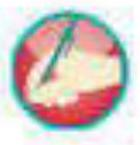
$\left[2 \Pi_{r}: \pi+2 \Pi_{r}\right]$ (мұндағы $n-6 \gamma$ тін сан) аралықтары $y=\cos x$ функциясынын кему аралыктары болатынын дәлелдендер.

\begin{figure}
\includegraphics[alt={},max width=\textwidth]{https://cdn.mathpix.com/cropped/b3f159e3-70ef-4ad9-b9e9-0ac5b230efd7-100.jpg?height=366&width=419&top_left_y=242&top_left_x=287}
\captionsetup{labelformat=empty}
\caption{1)}
\end{figure}

Бурыш ( $\cos x$ ) 0-ден П-ге дейін артканда. абсцисса кемиді

\begin{figure}
\includegraphics[alt={},max width=\textwidth]{https://cdn.mathpix.com/cropped/b3f159e3-70ef-4ad9-b9e9-0ac5b230efd7-100.jpg?height=364&width=419&top_left_y=242&top_left_x=858}
\captionsetup{labelformat=empty}
\caption{2)}
\end{figure}

Бұрыш ( $\cos x$ ) П-ден 2 Пге дейін артканда. абсцисса артады
12.3-cyper

\begin{figure}
\includegraphics[alt={},max width=\textwidth]{https://cdn.mathpix.com/cropped/b3f159e3-70ef-4ad9-b9e9-0ac5b230efd7-100.jpg?height=369&width=421&top_left_y=237&top_left_x=1446}
\captionsetup{labelformat=empty}
\caption{3)}
\end{figure}

Ох осі бойымен косннустар сызығындагы [-1:1] аралығы

Қарастырылған каспетті бірлік шенбердін көмегімен көрсетуте болады (12.3.1, 12.3.2-сурет).

Косижстар сызывы дегеніміз - Ох осінін [-1; 1] кесіндісі (12.3.3-сурет).

Erep $0 m \alpha_{1}<\alpha_{2} m \pi$ болса, онда $P_{\alpha_{1}}$ нүктесінін абщиссасына карағанда $P_{\alpha_{2}}$ нүктесінін абсциссасы кіші болады (12.3.1-сурет). Eгер $-\pi \mathrm{m} \alpha_{1}<\alpha_{2} \mathrm{mo}$ болса, онда $P_{\alpha_{1}}$ нүктесінін абсциссасына карағанда $P_{\alpha_{2}}$ нүктесінін абсшиссасы үлкен болады (12.3.2-сурет).
8. $y=\cos x$ функциясынын экстремумдары: $\quad x_{\text {min }}=-\pi+2 \pi k$, ( $k-$ бүтін сан), $x_{\max }=2 \pi k$ ( $k$ - бүтін сан): функшянын ен үлкен және ен
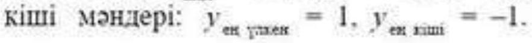

\section*{МЫСАЛ}
[-π; П] кесіндісіне $y=\cos 2 x$ функшисыныи графигін салайык.
Шешуі . Алдымен $y=\cos x$ функшиясынын графигін [-2П. 2П]
кесіндісіне саламыз. Ол үшін T, A, B, C, M, K, P, H, D нүктелерін белгілейміз және оларды кисык сызыкпен косамыз (12,4-сурет). Одан кейн эрбір нуктені абсцисса осі бойымен 2 есе сығамыз. Сонда ординаталары $T, A, B, C, M$, $K, P, H, D$ нүктелерінін ординаталарымен бірдей, абсциссатары 2 есе кем $T_{1}, A_{1}$, $B_{1}, C_{1}, M_{1}, K_{1}, P_{1}, H_{1}, D_{1}$ нуктелерін кисык сызыкпен косып, керсегілгеи аралыкта берілген функциянын графигін аламыз.

\begin{figure}
\includegraphics[alt={},max width=\textwidth]{https://cdn.mathpix.com/cropped/b3f159e3-70ef-4ad9-b9e9-0ac5b230efd7-100.jpg?height=439&width=1323&top_left_y=2195&top_left_x=420}
\captionsetup{labelformat=empty}
\caption{12.4-cyper}
\end{figure}

Графиктен $y=\cos 2 x$ функшиясынын периоды п-ге тен екенін көреміз. Расында да, $T=\frac{2 \pi}{2}=\pi$.

\section*{ТУСІНДІРІҢДЕР}
$y=\cos \left(x-\frac{\pi}{4}\right)$ функиятсы графигінін калай салынғанын түсіндіріндер (12.5-cypet).

\begin{figure}
\includegraphics[alt={},max width=\textwidth]{https://cdn.mathpix.com/cropped/b3f159e3-70ef-4ad9-b9e9-0ac5b230efd7-101.jpg?height=254&width=1360&top_left_y=740&top_left_x=299}
\captionsetup{labelformat=empty}
\caption{12.5-cyper}
\end{figure}

Абсцисеа осі боивмен $\frac{\pi}{4}$ біртікке онта орын аумстыру (жылжыту, паралтель кешіру)
1. $y=\cos x$ функциясыныи графичін Оу осі бойымен: 1) 4 есе созганда: 2) 3 есе кысканда алыитан $F\left(\pi_{3}-1\right)$ нуктесіне сәйкее $F_{1}$ нуктесінін координаталары кандай болалы?
2. Өздерінін аныктату облысында берілген $y=\cos \left(x-\frac{\pi}{4}\right), y=\cos 2 x$ және $y=\cos x$ функшиларыныи пернодтарын салыстырындар ( 12.4 және 12.5-суреттер).

\section*{Жаттығулар}

\section*{A}
12.1. $y=f(x)$ функшиясыныи жұп болатынын дәлелдендер:
1) $f(x)=x^{2}+\cos ^{2} x$;
2) $f(x)=x^{4} \cos x$;
3) $f(x)=\left(2-x^{2}\right) \cos ^{2} x$;
4) $f(x)=x \sin ^{3} x+\cos x$;
5) $f(x)=\frac{\sin x}{x^{3}-4 x}+\cos 2 x$;
6) $f(x)=\cos x-\frac{\sin 3 x}{x^{5}-9 x}$.
12.2. $y=f(x)$ функииясыныи жұп та, так та болмайтынын долелдендер:
1) $f(x)=x^{3}+\cos x$;
2) $f(x)=x^{3}-\cos ^{2} x$;
3) $f(x)=(2-x) \cos ^{3} x$.
12.3. $y=f(x)$ функшисынын так болатынын дәлелдендер:
1) $f(x)=x^{3} \cos x$;
2) $f(x)=x^{3} \cos ^{2} x$;
3) $f(x)=x \cos ^{3} x+x$;
4) $f(x)=\cos x \sin 3 x$;
5) $f(x)=\frac{\sin x \cos x}{x^{4}-4}$;
6) $f(x)=\frac{\sin 6 x}{\cos x^{2}-9}$.
12.4. $y=\cos 2 x$ функциясынын берілген аралыкта өспелі болатынын дәлелдендер:
1) $\left[-\frac{\pi}{4}+\pi k ; \pi k\right], k \in Z ;$
2) $\left[\frac{3 \pi}{4}+\pi k ; \pi+\pi k\right], k \in Z$.
12.5. Берілген функшяныи ен кіші он периодын табындар:
1) $y=2 \cos 2 x$;
2) $y=\cos 4 x \cos x+\sin x \sin 4 x ;$
3) $y=\frac{2}{3} \cos 2 x+1$;
4) $y=2-\cos 4 x$;
5) $y=\cos 4 x \cos 3 x-\sin 3 x \sin 4 x ;$
6) $y=\sin x-\cos 3 x$.
12.6. Функцияныи ен кіші он перподын табындар және графигін салындар:
1) $y=\cos 3 x$;
2) $y=\cos 3 x \cos 2 x+\sin 2 x \sin 3 x$;
3) $y=\cos \frac{1}{3} x+1$.
12.7. Берілген функциянын периодын табындар:
1) $y=\cos 2 x-\sin x ;$
2) $y=\cos 5 x \cos x+\sin x \sin 5 x ;$
3) $y=\frac{2}{3} \cos 4 x+\sin 2 x$;
4) $y=\cos ^{2} x-\sin ^{2} x$;
5) $y=\sin 4 x-\cos 4 x ;$
6) $y=3 \sin \frac{x}{3}+2 \cos \frac{x}{3}$.
12.8. $y=f(x)$ функциясы үшін берілген екі тендіктін акикаттығын тексеріндер және $T$ саны онын перноды бола ма екенін аныктандар: $f(x)=\cos x, \cos \frac{\pi}{3}=0,5$ және $\cos \left(\frac{\pi}{3}+\frac{4 \pi}{3}\right)=0,5, \quad T=\frac{4 \pi}{3}$.
12.9. Функшияныи графшін салындар және кему аральктарын жазындар:
1) $y=2-\cos 0,5 x$;
2) $y=1+\cos 1,5 x$;
3) $y=\cos x+|\cos x|$;
4) $y=\cos x-|\cos x|$.
12.10. Өрнектердін мәндерін салыстырындар:
1) $\cos \frac{5 \pi}{7}$ және $-\cos \frac{7 \pi}{8}$;
2) $\cos \frac{4 \pi}{9}$ және $\cos \frac{3 \pi}{8}$;
3) $\cos \frac{3 \pi}{11}$ және $\cos \frac{5 \pi}{13}$.
12.11. Функщинын өсу және кему аралыктарын табындар:
1) $y=1+2 \cos \left(x-\frac{\pi}{3}\right)$;
2) $y=3-2 \cos \left(x+\frac{\pi}{3}\right)$;
3) $y=1-\cos \left(x-\frac{3 \pi}{4}\right)$.
12.12. Бірлік шенбер салындар. Синустар сызығында ординатасынан алынған синустын мәні $a$-ға тен және $-1 \mathrm{~m} a$ m 1 болатын нүктені белгілендер. Осы нүкте аркылы $O x$ осіне параллель түзу жүргізіндер. Осы түзу мен бірлік шенбердін кнылысу нүктелерін табындар. Erep:
1) $a=\frac{1}{4}$;
2) $a=\frac{1}{3}$;
3) $a=-\frac{1}{4}$;
4) $a=-\frac{3}{4}$ болса, онда суретте синусы $a$-ға тен бұрышты көрсетіндер.
12.13. Бірлік шенбер салындар. Коспнустар сызығында абсшюсасынан алынған косинустын мәні $a$-ға тен және -1 m $a \mathrm{ml}$ болатын нүктені белгілендер. Осы нүкте аркылы $O y$ осіне параллель түзу жүргізіндер. Осы түзу мен бірлік шенбердін кнылысу нүктелерін табындар. Erep:
1) $a=\frac{3}{4}$;
2) $a=\frac{2}{3}$ :
3) $a=-\frac{1}{4}$;
4) $a=-\frac{3}{4}$ болса, онда суретте косинусы $a$-ға тен бұрышты көрсетіндер.

\section*{B}
12.14. Берілген өрнектерді өсу ретімен орналастырындар:
1) $\cos 1,9, \cos (-0,3)$.
$\cos 1,3$;
2) $\cos \frac{25 \pi}{9}, \cos \frac{-5 \pi}{9}, \cos \frac{4 \pi}{9}$.
12.15. Алгоритмді колданып функцияныи графигін салындар:
1) $y=2 \cos \left(x-\frac{\pi}{4}\right)$;
2) $y=2+\cos \left(x+\frac{\pi}{4}\right)$;
3) $y=\cos \left(2 x-\frac{\pi}{3}\right)$.
12.16. Алгоритмді колданып функииянын графигін салындар:
1) $y=\cos \left(2 x+\frac{2 \pi}{3}\right)$;
2) $y=\cos (3 x-4)$;
3) $y=\cos \left(4 x+\frac{4 \pi}{3}\right)$.
12.17. Түрлендірулерді колданып функцияныи графигін салындар және есу аралыктарын табындар:
1) $y=4+\cos \left(2 x+\frac{2 \pi}{3}\right)$;
2) $y=2 \cos (3 x-4)-3 ;$
3) $y=-2 \cos \left(4 x+\frac{4 \pi}{3}\right)$.

\section*{C}
12.18. Функшяны жұптылыкка тексеріндер және кему аралыктары мен мәндер жнынын табындар:
1) $y=3+2 \cos 2 x$;
2) $y=-2 \cos (3 x-2)$;
3) $y=1-2 \cos ^{2} x$.
*12.19. Функциянын графигін салындар және бірсарындылыкка зерттендер:
1) $y=x+\cos x$;
2) $y=x-\cos x$.
*12.20. Графиктік тәсілмен тендеудін түбірлерінін санын табындар:
1) $2-x^{2}=\cos x$;
2) $2 x^{2}-4 x=2 \cos x$.

\section*{КАЙТАЛАУ}
12.21. Функшяныи периодын табындар және графитін салындар:
1) $y=\{x\}-2$;
2) $y=2\{x\} ;$
3) $y=2\{4 x\}$;
4) $y=\left\{\frac{x}{4}\right\}+2,\{x\}-x$ санынын белшек белігі.
12.22. Өрнекті ыкшамдандар:
1) $\frac{\operatorname{ctg} \alpha+\operatorname{ctg} \beta}{\operatorname{tg} \alpha+\operatorname{tg} \beta}$;
2) $\frac{\cos ^{2} \alpha-\operatorname{ctg}^{2} \alpha}{\sin ^{2} \alpha-\operatorname{tg}^{2} \alpha}$;
3) $\operatorname{ctg} b+\frac{\sin \beta}{1+\cos \beta}$.
12.23. Тепе-тендікті дәлелдендер:
1) $\sin ^{2} x-\cos ^{2} x-\sin ^{4} x+\cos ^{4} x=0 ;$
2) $(1+\cos \alpha)(1+\operatorname{tg} \alpha)-1-\sin \alpha-\cos \alpha=\operatorname{tg} \alpha$;
3) $(\operatorname{tg} x+2 \operatorname{ctg} x)^{2}-(\operatorname{tg} x-2 \operatorname{ctg} x)^{2}=8$.

\section*{ЖАҢА БІЛІМДІ МЕҢГЕРУГЕ АРНАЛҒАН ТІРЕК ҰҒЫМДАР}

Функция, функциянын касшеттері және графигі, $y=\operatorname{tg} x, y=\operatorname{ctg} x$ тригонометриялык функцияларынын аныктамасы, $y=\operatorname{tg} x$, $y=\operatorname{ctg} x$ тригонометриялы функцияларынын аныхталу облысы және мәндер жиыны, пригонометриятык функциялардын мандері, тригонометриятык тепе-тендіктер.
§13. $y=\operatorname{tg} x, y=\operatorname{ctg} x$ ФУНКЦИЯЛАРЫНЫН ГРАФИКТЕРІ ЖӘНЕ КАСИЕТТЕРІ
(2)
$y=\operatorname{tg} x, y=\operatorname{ctg} x$ функцияларынын қасиеттерімен танысасындар; $y=\operatorname{tg} x, y=\operatorname{ctg} x$ функцияларынын графиктерін салуды үйренесіндер.

\section*{ТУЙІНДІ ұғымдАР}

Функция, график, тангенс сызығы, котангенс сызығы, тангенсоида, периодтылык

СЕНДЕР а бұрышыныя тангенсі деп бірлік шенбердін $P_{G}$ нуктесінін БMIECIHAEP: ординатасынын абсциссаға катынасын зйтатынын, тангенстін С бұрышыныи шамасына тәуеллілігі $y=\operatorname{tg} x$ гүрінде белгіленетін тригонометриялық функиия екенін білеміз. Бұл функциянын аныкталу облысы $x=\frac{\pi}{2}+\pi k$ ( $k$ - кез келген бүтін сан) сандарынан баска барлык накты сандар жныны. мәндер жиыны ( $-\infty ;+\infty$ ) аралығы.

Бірлік шенберге $P_{0}$ нүктесі аркылы $l$ жанамасын жүргіземіз (13.1-сурет).

\begin{figure}
\includegraphics[alt={},max width=\textwidth]{https://cdn.mathpix.com/cropped/b3f159e3-70ef-4ad9-b9e9-0ac5b230efd7-105.jpg?height=645&width=584&top_left_y=230&top_left_x=333}
\captionsetup{labelformat=empty}
\caption{13.1-cypet}
\end{figure}

\begin{figure}
\includegraphics[alt={},max width=\textwidth]{https://cdn.mathpix.com/cropped/b3f159e3-70ef-4ad9-b9e9-0ac5b230efd7-105.jpg?height=656&width=586&top_left_y=233&top_left_x=1043}
\captionsetup{labelformat=empty}
\caption{13,2-cyper}
\end{figure}
α саны $\cos \alpha \neq 0$ орындалатындай кез келген сан болсын. Онда $P_{\alpha}(\cos \alpha ; \sin \alpha)$ нүктесі ордината осіне тністі емес, сондыктан $O P_{\alpha}$ түзуі $l$ жанамасын абсщиссасы 1 -ге тен болатын $T_{\mathrm{a}}$ нүктесінде кияды.

Осы нүктенін ординатасын табайык. Аныктама бойынша $\operatorname{tg} \alpha=\frac{\sin \alpha}{\cos \alpha}= =\frac{T_{\alpha} P_{0}}{1}$, онда $T_{\alpha} P_{0}=\operatorname{tg} \alpha$. Сонымен, $O P_{\alpha}$ және $/$ тузулерінін киылысу нүктелерінін ординаталары tg $\alpha$-ға тен.

I тузуін тангенстер сызызы деп атайды (13.2-сурет).
$y=\operatorname{tg} x$ функинясы перподты және периоды п-ге тен. Расында, $\alpha+\pi k$, ( $k$ - кез келген бүтін сан) бұрыштарына сәйкес тангенстер сызығындағы барлык нуктелердін ординаталары $\alpha$, мундағы $-\frac{\pi}{2}<\alpha<\frac{\pi}{2}$ бұрышына сәйкес нүктелердін ординаталарына тен болады. Демек, $\operatorname{tg}(x+\pi k)=\operatorname{tg} x$ ( $k$ - кез келген бүтін сан).
$y=\operatorname{tg} x$ функшясынын графигін салу үшін алдымен онын $\left[-\frac{\pi}{2} ; \frac{\pi}{2}\right]$ аралығына писті белігін саламыз. Ол үшін абсцисса осінде абсциссасы $-\frac{\pi}{2}$ және $\frac{\pi}{2}(\pi \approx 3,14)$ болатын нүктелерді белгілейміз және тангенстер осін колданамыз. Оу осінін сол жағынан центрі Ox осінде жататын бірлік шенбер сызамыз. Бірлік шенбер мен $\left[-\frac{\pi}{2} ; \frac{\pi}{2}\right]$ кесіндісін тен 8 белікке белеміз (13.3-cyper).

\begin{figure}
\includegraphics[alt={},max width=\textwidth]{https://cdn.mathpix.com/cropped/b3f159e3-70ef-4ad9-b9e9-0ac5b230efd7-105.jpg?height=723&width=668&top_left_y=1889&top_left_x=1153}
\captionsetup{labelformat=empty}
\caption{13.3-cyper}
\end{figure}

\begin{figure}
\includegraphics[alt={},max width=\textwidth]{https://cdn.mathpix.com/cropped/b3f159e3-70ef-4ad9-b9e9-0ac5b230efd7-106.jpg?height=648&width=1339&top_left_y=237&top_left_x=411}
\captionsetup{labelformat=empty}
\caption{13.4-cyper}
\end{figure}
$-\frac{3 \pi}{8} ;-\frac{\pi}{4} ;-\frac{\pi}{8} ; 0 ; \frac{\pi}{8} ; \frac{\pi}{4} ; \frac{3 \pi}{8}$ бұрыштарына сэйкес нүктелерді бірлік шенберде белгілейміз. Осы бұрыштар үшін $y=\operatorname{tg} x$ функиясынын мәндерін тангенстер сызығы аркылы табамыз. Ол үшін координаталар басы және әрбір белгіленген нүкте аркылы тангенстер осіне дейін түзу жүргіземіз. Тангенстер осімен кнылысу нүктесі $y=\operatorname{tg} x$ функциясы графитінін нүктесінін орднатасы болып табылады (13.3-сурет).
$y=\operatorname{tg} x$ функинясыныи графигін бартык сан түзуінде салу үшін онын $\left[-\frac{\pi}{2} ; \frac{\pi}{2}\right]$ кесіндісінде салынған белігін $O x$ осі боїымен $\pi_{n}$-ге (мундағы $n$ - бүтін сан) параллель жылжытамыз (13.4-сурет).
$y=\operatorname{tg} x$ функциясыныи графигі тангенсоида деп аталалы (13.4-сурет).
$y=\operatorname{tg} x$ функциясынын каснеттері:
1. Аныкталу облысы $\frac{\pi}{2}+\pi k(k-к е 3$

\begin{figure}
\includegraphics[alt={},max width=\textwidth]{https://cdn.mathpix.com/cropped/b3f159e3-70ef-4ad9-b9e9-0ac5b230efd7-106.jpg?height=643&width=666&top_left_y=1957&top_left_x=244}
\captionsetup{labelformat=empty}
\caption{13.5-cyper}
\end{figure} келген бүтін сан) сандарынан басқа $\alpha$-нын барлык мәндері.
2. Мәндер жиыны ( $-\infty ;+\infty$ ) сан аралығы.

Дателдеуі. $y_{0}$ - кез келген накты сан болсын. $A\left(1 ; y_{0}\right)$ нүктесін карастырайык. Тангенстер сызығы түзу болғандыктан. кез келген $y_{0}$ накты саны үшін $A\left(1 ; y_{0}\right)$ нүктесі тангенстер сызығына тпісті болады және $y_{0}=\operatorname{tg} \angle A O X$ (13.5-cypet). Демек. $y=\operatorname{tg} x$ функциясы кез келте н накты санды қабылдайды.
3. $y=\operatorname{tg} x$ функииясы шектелмеген.
4. $y=\operatorname{tg} x$ функциясы пернодты. онын перноды П-ге тен. $y=\operatorname{tg}(x+\pi n)=\operatorname{tg} x$, мұндағы $n$ - бүтін сан.
5. $y=\operatorname{tg} x$ функциясы тақ функиия: $\operatorname{tg}(-x)=-\operatorname{tg} x$. Онын графигі координаталар басына карағанда снмметриялы.
6. $y=\operatorname{tg} x$ функциясы $\left(\pi k ; \frac{\pi}{2}+\pi k\right)$ аралығында он мәндерді және $\left(-\frac{\pi}{2}+\pi k ; \pi k\right)$ ( $k$ - бүтін сан) аралығында теріс мәндерді кабылдайды.
7. $y=\operatorname{tg} x$ функшясы $\left(-\frac{\pi}{2}+\pi k ; \frac{\pi}{2}+\pi k\right)$ аралығында еседі, мүндағы $k$ - бүтін сан.

Дәлелдеу $i \cdot y=\operatorname{tg} x$ функциясы $\quad\left(-\frac{\pi}{2}+\pi k ; \frac{\pi}{2}+\pi k\right),(k-б$ утін сан) аралығында өсетінін дәлелдейік. $y=\operatorname{tg} x$ функщиясы пернодты болғандыктан, дәлелдеуді $\left(-\frac{\pi}{2} ; \frac{\pi}{2}\right)$ интервалында жүргізген жеткілікті.
$x_{2}>x_{1}$ орындалатындай етіп керсетілген интервалдан кез келген $x_{1}$ және $x_{2}$ мәндерін алайык. $\operatorname{tg} x_{2}>\operatorname{tg} x_{1}$ тенсіздігін дәлелдейік. Ол үшін $\operatorname{tg} x_{2}-\operatorname{tg} x_{1}=\frac{\sin \left(x_{2}-x_{1}\right)}{\cos x_{2} \cos x_{1}}$ айырымын карастырамыз:
$-\frac{\pi}{2}<x_{1}<x_{2}<\frac{\pi}{2}$ болгандыктан, $\quad \cos x_{1}>0$ және $\cos x_{2}>0$. $0<x_{2}-x_{\mathrm{t}}<\pi$ болғандыктан, $\quad \sin \left(x_{2}-x_{1}\right)>0$. Демек, $\operatorname{tg} x_{2}-\operatorname{tg} x_{1}>0$ немесе $\operatorname{tg} x_{2}>\operatorname{tg} x_{1}$.
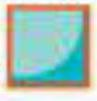

8. $y=\operatorname{tg} x$ функшясынын экстремумдары мен ен үлкен және ен кіші мондері болмайды.

СЕНДЕР БЛЕСІНДЕР:

а бұрышыныя котангенсі деп бірлік шенбердін $P_{\mathrm{a}}$ нуктесінін абсциссасынын ординатага катынасын айтады, котангенстін а бұрышыныи шамасына тәуелділігі тригонометриятық функция деп аталалы және $y=\operatorname{ctg} x$ деп бежіленеді.

Бұл функцияныи аныктату облысы $x=\Pi k$ ( $k$ - кез келген бүтін сан) сандарынан баска барлык накты сандар жныны, мондер жныны ( $-\infty ;+\infty$ ) болалы.
$y=\operatorname{ctg} x$ функии ясынын графигін салу ушін $\operatorname{ctg} x=-\operatorname{tg}\left(x+\frac{\pi}{2}\right)$ келтіру формуласын колданамыз. Сондықтан $y=\operatorname{ctg} x$ функииясынын графигі $y=\operatorname{tg} x$ функциясынын графигін $O x$ осі боїымен солға карай $\frac{\pi}{2}$ бірлікке параллель кешіру және $O x$ осіне карағанда спмметрияны колдану аркылы алынады (13.6-сурет).

\begin{figure}
\includegraphics[alt={},max width=\textwidth]{https://cdn.mathpix.com/cropped/b3f159e3-70ef-4ad9-b9e9-0ac5b230efd7-108.jpg?height=606&width=1089&top_left_y=233&top_left_x=536}
\captionsetup{labelformat=empty}
\caption{13.6-cyper}
\end{figure}
$y=\operatorname{ctg} x$ функциясынын каснеттері:
1. Функшиянын аныкталу облысы пk-дан ( $k$ - кез келген бүтін сан) баска α-нын барлык мәндері.
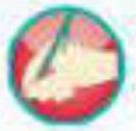
$P_{\frac{\pi}{2}}$ нуктесі аркылы бірлік шенберге жүргізіл ген $t$ жанамасы мен $O P_{\alpha}$ түзуінін $B_{0}$ нүктесінін абсциссасы сtgа-ға тен екенін дәлелдендер (13.7-сурет).

□ тузуі котангенс сызыеы деп аталады ( 13.7 -сурет).

\begin{figure}
\includegraphics[alt={},max width=\textwidth]{https://cdn.mathpix.com/cropped/b3f159e3-70ef-4ad9-b9e9-0ac5b230efd7-108.jpg?height=403&width=574&top_left_y=1427&top_left_x=242}
\captionsetup{labelformat=empty}
\caption{13.7-cyper}
\end{figure}
2. Мәндер жныны $(-\infty ;+\infty)$ сан аралығы.

Дәлелдеуі . $x_{0}$ - кез келген накты сан болсын. $\quad B_{\mathrm{a}}\left(x_{0} ; 1\right)$ нүктесін карастырайык. Котангенстер сызығы түзу болғандыктан, кез келген $x_{0}$ накты саны үшін $B_{a}\left(x_{0} ; 1\right)$ нүктесі котангенстер сызығына тпісті болады және $x_{0}=\operatorname{ctg} \mathrm{a}(13.7$-cypet). Демек, $y=\operatorname{ctg} x$ функииясы кез келтен накты санды кабылдайды.
3. $y=\operatorname{ctg} x$ функипясы шектелмеген.
4. $y=\operatorname{ctg} x$ функциясы периодты, онын периоды п-ге тен. $y=\operatorname{ctg}(x+ +\pi n)=\operatorname{ctg} x$, мундағы $n$ - бүтін сан.
5. $y=\operatorname{ctg} x$ функциясы так функция: $\operatorname{ctg}(-x)=-\operatorname{ctg} x$. Функииянын графигі координаталар басына карағанда снмметриялы.
6. $y=\operatorname{ctg} x$ функшясы $\left(\pi k ; \frac{\pi}{2}+\pi k\right)$ аралығында он мәнерді және $\left(\frac{\pi}{2}+\pi k ; \pi+\pi k\right)$ ( $k$ - бүтін сан) аралығында теріс мәндерді кабылайды.
7. $y=\operatorname{ctg} x$ функциясы ( $\pi k ; \pi+\pi k$ ) аралығында кемиді, мүндағы $k$ - бүтін сан.

Дәлелдеуi , $y=\operatorname{ctg} x$ функциясы ( $\pi k ; \pi+\pi k$ ) ( $k-$ бүтін сан) аралығында кемитінін дәлелдейік. $y=\operatorname{ctg} x$ функциясы периодты болғандыктан, дәлелдеуді ( $0 ; \pi$ ) интервалында жүргізген жеткілікті.
$x_{2}>x_{1}$ орындалатындай етіп көрсетілген интервалдан кез келген $x_{1}$ және $x_{2}$ мәндерін алайык. $\operatorname{ctg} x_{2}<\operatorname{ctg} x_{1}$ екенін дәлелдейік. $\operatorname{ctg} x_{2}-\operatorname{ctg} x_{1}$ айырымын карастырып, мына түрге келтіреміз:
$$
\operatorname{ctg} x_{2}-\operatorname{ctg} x_{1}=-\frac{\sin \left(x_{2}-x_{1}\right)}{\cos x_{2} \cos x_{1}} .
$$

Ұйғарым бойынша $0<x_{1}<x_{2}<\Pi$. Сондыктан $\sin x_{1}>0$ және $\sin x_{2}>0$.
$0<x_{2}-x_{1}<\pi$ болғандыктан $\sin \left(x_{2}-x_{1}\right)>0$. Демек, $\operatorname{ctg} x_{2}-\operatorname{ctg} x_{1}<0$ немесе $\operatorname{ctg} x_{2}<\operatorname{ctg} x_{1}$.
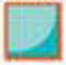
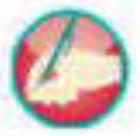

Осы қасиетті котангенстер сызығын қолданып дәлелдендер (13.7-сурет).
8. $y=\operatorname{ctg} x$ функшисынын экстремумдары мен ен үлкен және ен кіші мәндері болмайды.

\section*{МЫСАЛ}
(0: TI) интервалында $y=2 \operatorname{ctg} x$ функшиясынын графигін салайык.
Шешуі Алдымен $y=\operatorname{ctg} x$ функциясыныи графигін (0; II) интервалына саламыз. Ол үшін A, B, C нүктелерін белтілейміз және оларды кисык сызыкпен косамыз (13.8-сурет). Одан кейін ордината осі (Оу) бойымен 2 есе созамыз. Енді абсциссалары A, B, C нуктелерінін абсциссаларымен бірдей, ординаталары 2 ссе артык $A_{1}, B_{1}, C_{1}$ нуктелерін аламыз және оларды кноық сызыкпен косамыз. Сонда керсетілен аралыкта берілген функшияны графигі шығалы.

\begin{figure}
\includegraphics[alt={},max width=\textwidth]{https://cdn.mathpix.com/cropped/b3f159e3-70ef-4ad9-b9e9-0ac5b230efd7-109.jpg?height=542&width=501&top_left_y=1117&top_left_x=1297}
\captionsetup{labelformat=empty}
\caption{Ордината осі бойымен 2 eec cosy}
\end{figure}
13.8-cyper
1. Erep $y=\operatorname{tg} x$ функциясыныи графигін: 1) $O x$ осі бойымен 4 есе созганда; 2) $O y$ осі бойымен 3 есе сыкканда алынған $F\left(\frac{\pi}{4} ; 1\right)$ нуктесіне сойкес $F_{1}$ нуктесінін координаталары кандай болалы?
2. Өзаерінін аныктату обтысында берілген $y=2 \operatorname{ctg} x$ және $y=\operatorname{ctg} x$ функиняларынын периодтарын сатыстырынар.

\section*{Жаттығулар}

\section*{A}
13.1. $y=f(x)$ функшясынын жұп болатынын долелдендер;
1) $f(x)=x^{2} \operatorname{tg}^{2} x$;
2) $f(x)=x^{4} \operatorname{ctg}^{2} x$;
3) $f(x)=-\operatorname{ctg}(-x)^{2}-5$;
4) $f(x)=x \operatorname{tg}^{3} x$;
5) $f(x)=\frac{\operatorname{ctg} 5 x}{x^{3}-4 x}-\cos 3 x$;
6) $f(x)=\frac{\operatorname{tg} 3 x}{x^{5}-9 x}+\cos x$.
13.2. $y=f(x)$ функциясынын так болатынын дәлелдендер:
1) $f(x)=x^{3}+\operatorname{ctg} 2 x$;
2) $f(x)=x^{5} \operatorname{tg}^{2} x$;
3) $f(x)=\left(2-x^{2}\right) \operatorname{tg}^{3} x$;
4) $f(x)=2 x-\operatorname{tg}^{3} x$;
5) $f(x)=\frac{\operatorname{ctg} 5 x}{x^{4}-4}-x$;
6) $f(x)=\frac{\operatorname{tg} 6 x}{x^{2}-9}+\sin ^{3} x$.
13.3. Берілген аралыкта $y=\operatorname{tg} 2 x$ функциясынын өспелі болатынын далелдендер:
1) $\left(-\frac{\pi}{4}+0,5 \pi k ; \frac{\pi}{4}+0,5 \pi k\right), k \in Z ;$
2) $\left(\frac{3 \pi}{4}+\frac{1}{2} \pi k ; \frac{5 \pi}{4}+\frac{1}{2} \pi k\right), k \in Z$.
13.4. Функциянын ен кіші он периодын табындар:
1) $y=2 \operatorname{tg} 2 x$;
2) $y=\operatorname{ctg} 4 x$;
3) $y=\frac{2}{3} \operatorname{ctg} 3 x+1$.
13.5. Функщиныи ен кіші он периодын табындар:
1) $y=\operatorname{tg} x+\sin 3 x$;
2) $y=\operatorname{ctg} 2 x-2 \cos x$;
3) $y=\operatorname{tg} \frac{1}{3} x+1$.
13.6. Функцияныи ен кіші он периодын табындар:
1) $y=\sin 2 x-\operatorname{ctg} 0,5 x$;
2) $y=\operatorname{tg} 5 x-\operatorname{tg} x$;
3) $y=\frac{2}{3} \operatorname{tg} 4 x+\cos 2 x$;
4) $y=2-5 \operatorname{ctg} 2 x$;
5) $y=\operatorname{tg} 4 x-\cos 4 x$;
6) $y=\operatorname{tg} \frac{x}{3}+\operatorname{ctg} \frac{x}{3}$.
13.7. $f(x)$ функшиясы үшін берілген екі тендіктін акикаттығын тексеріндер және $T$ саны онын перноды бола ма екенін аныктандар: $f(x)=\operatorname{tg} x, \operatorname{tg} \frac{\pi}{4}=1$ және $\operatorname{tg}\left(\frac{5 \pi}{4}\right)=1, T=\pi$.
13.8. Функшяныи графшін салындар және кему аралыктарын жазындар:
1) $y=2-\operatorname{tg} 0.5 x$;
2) $y=1+\operatorname{ctg} 1,5 x$;
3) $y=2 \operatorname{tg} 2 x$;
4) $y=-\operatorname{ctg} 3 x$.
13.9. Өрнектердін мәндерін салыстырындар:
1) $\operatorname{tg}\left(-\frac{5 \pi}{7}\right)$ және $\operatorname{tg} \frac{7 \pi}{8}$ :
2) $\operatorname{ctg} \frac{4 \pi}{9}$ және $\operatorname{ctg} \frac{3 \pi}{8}$ :
3) $\operatorname{tg} \frac{3 \pi}{11}$ және $\operatorname{tg} \frac{5 \pi}{13}$.
13.10. Бірлік шенбер салындар. Котангенстер сызығында абсциссасынан алынған котангенсінін мәні p-ға тен $P$ нүктесін белгілендер. Осы нүкте және координаталар басы аркылы $O P$ сәулесін жүргізіндер. OP сәулесі мен котангенстер сызығынын киылысу нүктелерін табындар. Егер :
1) $p=\frac{3}{4}$;
2) $p=2$;
3) $p=-1$;
4) $p=-2 \frac{3}{4}$ болса, онда суреттен котангенсі $p$-ға тен бұрышты көрсетіндер.
13.11. Бірлік шенбер салындар. Тантенстер сызығында оршнатадан алынған тангенсінін мәні $p$-ға тен $M$ нүктесін белгілендер. Осы нүкте және координаталар басы аркылы $O M$ сәулесін жүргізіндер. $O M$ сәулесі мен тангенстер сызығынын кнылысу нүктелерін табындар. Erep:
1) $p=3 \frac{3}{4}$;
2) $p=2,5$;
3) $p=-1$;
4) $p=-\frac{3}{4}$ болса, онда сурет- тен тангенсі $p$-та тен бұрышты керсетіндер.

\section*{B}
13.12. Функшиныи есу және кему аралыктарын табындар:
1) $y=1+2 \operatorname{tg}\left(x-\frac{\pi}{3}\right)$;
2) $y=2-\operatorname{ctg}\left(x+\frac{\pi}{3}\right)$;
3) $y=1-\operatorname{tg}\left(x-\frac{\pi}{4}\right)$.
13.13. Берілген өрнектердін мәндерін өсу ретімен орналастырындар:
1) $\operatorname{tg}\left(-\frac{6 \pi}{13}\right), \operatorname{tg}\left(-\frac{\pi}{8}\right), \operatorname{tg} \frac{3 \pi}{8}$ және $\operatorname{tg} \frac{9 \pi}{20}$;
2) $\operatorname{ctg} \frac{9 \pi}{10}, \operatorname{ctg} \frac{7 \pi}{15}, \operatorname{ctg} \frac{3 \pi}{11}$ және $\operatorname{ctg} \frac{5 \pi}{13}$.
13.14. Алгоритмді колданып функциянын графигін салындар:
1) $y=2 \operatorname{tg}\left(x-\frac{\pi}{4}\right)$;
2) $y=2+\operatorname{ctg}\left(x+\frac{\pi}{4}\right)$;
3) $y=\operatorname{tg}\left(2 x-\frac{\pi}{3}\right)$.
13.15. Алгоритмді колданып функциянын графигін салындар:
1) $y=\operatorname{ctg}\left(2 x+\frac{2 \pi}{3}\right)$;
2) $y=\operatorname{tg}(3 x-4)$;
3) $y=-\operatorname{tg}\left(4 x+\frac{4 \pi}{3}\right)$.

\section*{C}
13.16. Түрлендірулерді колданып, функциянын графигін салындар және өсу аралыктарын табындар:
1) $y=1+\operatorname{tg}\left(2 x+\frac{2 \pi}{3}\right)$;
2) $y=2 \operatorname{ctg}(3 x-4)-1$;
3) $y=-2 \operatorname{tg}\left(4 x+\frac{4 \pi}{3}\right)$.
13.17. Функцияны жұптылыкқа тексеріндер және перподын табындар:
1) $y=3 \operatorname{tg} x+2 \sin 2 x$;
2) $y=-2 \operatorname{ctg}(3 x-2)+x$;
3) $y=-5 \operatorname{tg}(0,2 x+4)$.
*13.18. Тендеудін түбірлерінін санын табындар:
1) $2 x-3=\operatorname{ctg} 0,4 x$;
2) $x^{2}-2 x=\operatorname{tg} 0,2 x$.
13.19. Функцияныи периодын табындар:
1) $y=\{x\}+\operatorname{tg} \pi x$;
2) $y=\operatorname{ctg} 4 x-\sin 2 x$;
3) $y=2\{2 x\}+\cos 4 \pi x$;
4) $y=\left\{\frac{x}{3}\right\}+2 \operatorname{tg} \frac{\pi x}{3}$.

\section*{КАЙТАЛАУ}
13.20. Тригонометриялык өрнектін мәнін табындар:
1) $\frac{-\sin \frac{3 \pi}{20} \cos \frac{21 \pi}{10}-\cos \frac{3 \pi}{20} \sin \frac{\pi}{10}}{\cos \frac{7 \pi}{24} \cos \frac{\pi}{8}+\sin \frac{7 \pi}{8} \sin \frac{7 \pi}{24}}$;
2) $\frac{3 \sin \frac{15 \pi}{7} \sin \frac{4 \pi}{21}+3 \cos \frac{4 \pi}{21} \cos \frac{6 \pi}{7}}{-\sin \frac{7 \pi}{24} \cos \frac{\pi}{24}+\cos \frac{7 \pi}{24} \sin \frac{23 \pi}{24}}$.
13.21. Өрнекті ыкшамдандар:
1) $\cos \mathrm{b}-\sin \mathrm{b}-\sqrt{2} \sin \left(45^{\circ}-\mathrm{b}\right) ;$
2) $\sqrt{3} \cos b+\sin b-2 \cos \left(30^{\circ}-b\right)$.
13.22. Тепе-тендікті дәлелдендер:
1) $\cos (\alpha+\beta)+\cos (\alpha-\beta)-2 \cos \alpha \cos \beta=0 ;$
2) $\sin (\alpha+\beta)+\sin (\alpha-\beta)-2 \sin \alpha \cos \beta=0 ;$
3) $\sin (\alpha+\beta) \sin (\alpha-\beta)=\sin ^{2} \alpha-\sin ^{2} \beta$;
4) $\cos (\alpha+\beta) \cos (\alpha-\beta)=\cos ^{2} \alpha-\sin ^{2} \beta$.

\section*{ЖАНА БІЛІМДІ МЕҢГЕРУГЕ АРНАЛҒАН ТІРЕК ҰҒЫМДАР}

Функция, функциянын касиеттері және графигі, тригонометриялық функциялардын аныжтамалары, координаталық жазықтық, нужтенін координаталары, модугь, кері пропорционалдых, фиураны түртендірудін тургері, нуктеге және тузуге қараганда симметрияты.

\section*{§14. ТРИГОНОМЕТРИЯЛЫК ФУНКЦИЯ.ЛАРДЫН ГРАФИКТЕРІН ТУРЛЕНДІРУЛЕР КӨМЕГIMEH САЛУ}

Түрлендірулерді колдану арқылы тригонометриялық функциялардын графиктерін салуды үйренесіндер.

\section*{ТУЙІНДІ ұғымдАР}

График, түрлендірулер, тригонометриялык функциялар

МЫСАЛ
$[0 ; 4 \pi]$ кесіндісіне $y=2 \sin 0,5\left(x-\frac{\pi}{3}\right)-2,5$ функинясынын графигін салан̆ык.
Шешуі Графнкті салу үшін алдымен $y=\sin x$ функшиясыныи графигін [ $0 ; 2$ T] кесіндісіне саламыз. Одан кейіи оны абсинса осі ( $O x$ ) бойымен 2 есе созамыз. Сонда [0: 4m] кесінсісіние $y=\sin (0.5 x)$ функииясыныи графиги аламыз.
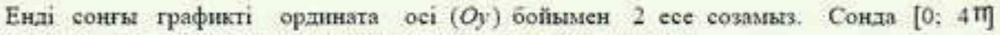 кесіндісінде $y=2 \sin (0.5 x)$ функциясыныи графигі шығады.

Шыкқан графикті $x$ осі бойымен $\frac{\pi}{3}$ бірлікке онға жылжыта, $y=2 \sin 0.5\left(x-\frac{\pi}{3}\right)$ функшиеыныи графигі шыталы. Енді сонгы графикті Оу осі бойымен темен карай 2,5 бірныке жылжытамыз және ол графикті $\left[0 ; \frac{\pi}{3}\right]$ кесіндісінде жалғастырып, $\left[4 \pi ; \frac{4 \pi}{3}\right]$ кесіндісіндегі белігін алып тастаймы.

Сонда $[0 ; 4 \pi]$ кесіндісінде салынған $y=2 \sin 0.5\left(x-\frac{\pi}{3}\right)-2.5$ функциясынын графигі шығады (14.1-сурет).

\begin{figure}
\includegraphics[alt={},max width=\textwidth]{https://cdn.mathpix.com/cropped/b3f159e3-70ef-4ad9-b9e9-0ac5b230efd7-113.jpg?height=573&width=1186&top_left_y=778&top_left_x=388}
\captionsetup{labelformat=empty}
\caption{14.1-cyper}
\end{figure}
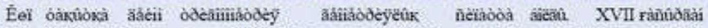
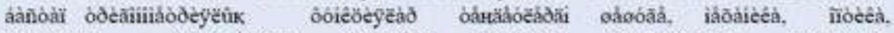

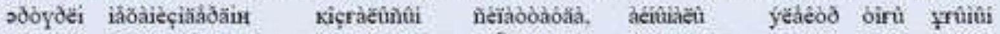
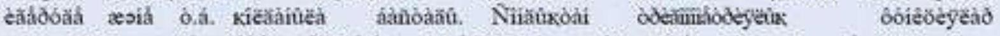
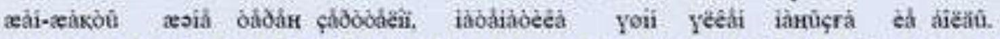

Тербетіс деп белгілі бір уакыт аралығында дәлме-дәл немесе жуыктап кайталанатын козғалысты айтамыз.

Тербелмелі козғалыстар табиғат пен техникада кен таралған Мысалы, сағат маятнигінін козғалысы, айнымалы электр тогы және т.б.

Физнкада маятниктердін тербелмелі козғалысын, сәуленін кеністікте таралуын және т.с.с. тербелмелі козғалыстарды $f(t)=A \cos (\omega t+\phi)$ немесе $f(t)=A \sin \left(\omega_{t}+\phi\right)$ заны бойынша сппаттайды.

Осындай зандармен сппатталатын козғалыстарды афмонылаты тербетістер деп атайды. A - тербегістін амнипуасы , ω - тербеліс жиілізі, ф - тербелістім бастапхы фазасы деп аталады. $f(t)=A \cos (\omega t+\phi)$ және $f(t)=A \sin (\omega t+\phi)$ функщияларынын $\quad \frac{2 \pi}{\omega}$-ка тен перноды сармоникатык тербелістін першоды деп аталады.

Екі функция да әртүрлі бастапкы фазамен бір тербелісті сипатауы мүмкін екенін айта кеткен жен. Расында, кеттіру формуласын колданғанда мына тендік шығады: $f(t)=A \sin \left(\omega_{t}+\phi\right)=A \cos \left(\omega t+\varphi-\frac{\pi}{2}\right)$.
1. $y=\cos x$ функциясыныи графигіи $O x$ осі бойымен 4 есе созганда. $O y$ осі бойымен 3 есе сыканда және $O x$ осі бойымен онга карай $\frac{\pi}{3}$, $O y$ осі бойымен темен карай $\frac{1}{2}$ бірлікке жылжытканда алыиган $F\left(\frac{\pi}{3} ; \frac{1}{2}\right)$ нүктесіне сойкес $F_{1}$ нүктесініи коордннаталары кандай болады?
2. Өздерінін аныкталу облысында берілген $y=2 \operatorname{tg} \frac{1}{2} x$ және $y=\operatorname{tg}\left(x-\frac{1}{2}\right)$ функшиларыныи пернодтарыи салыстырындар.
3. $y=2 \sin 0.5\left(x-\frac{\pi}{6}\right)$ формуласымен берілген гармоннкалык тербелістін ампиитудасыи, жнілігін, бастапкы фазасыи және пернодын атандар.

\section*{Жаттығулар}

\section*{A}
14.1. Функцияныи графигін салындар:
1) $y=\cos \left(x-\frac{2 \pi}{3}\right)+2$;
2) $y=\sin \left(x-\frac{\pi}{4}\right)-1$;
3) $y=\operatorname{ctg}\left(x+\frac{\pi}{3}\right)+3$.
14.2. Тригонометриялык функциялардын периодтылығын колданып берілген тригонометриялык өрнекті оған сәйкес он аргументі ен кіші тригонометриялык функшямен алмастырындар:
1) $\cos \frac{20 \pi}{9}, \operatorname{tg} \frac{21 \pi}{5}, \sin \frac{23 \pi}{7}$;
2) $\operatorname{ctg} \frac{23 \pi}{9}, \operatorname{tg} \frac{41 \pi}{5}, \sin \frac{16 \pi}{7}$.
14.3. Функцияныи графигін салындар:
1) $y=2 \cos \left(x+\frac{\pi}{3}\right)-3$;
2) $y=-\sin \left(x-\frac{\pi}{4}\right)+2$;
3) $y=2 \operatorname{ctg}\left(x+\frac{\pi}{4}\right)$.
14.4. Функцияныи аныкталу облысы мен мәндер жнынын табындар:
1) $f(x)=2 \sin 3 x-1$;
2) $f(x)=3-2 \cos 2 x$;
3) $f(x)=2-\sin (x-\pi)$.
14.5. Функшянын графигін салындар, нелдері мен танбатұрактылык аралыктарын жазындар:
1) $f(x)=-\sin 2 x$;
2) $f(x)=2 \cos \frac{x}{4}$;
3) $f(x)=2 \operatorname{tg} \frac{x}{3}$;
4) $f(x)=-\operatorname{ctg} \frac{x}{2}$.
14.6. Функцияныи графигін салындар, функцияныи теріс емес мәндер кабылдайтын аралыктарын жазындар:
1) $f(x)=2-\sin x$;
2) $f(x)=\cos \frac{x}{3}-3$;
3) $f(x)=2 \operatorname{tg} \frac{x}{2}$;
4) $f(x)=-\operatorname{ctg} 2 x$.

\section*{B}

Функиияны зерттеп графигін салындар (14.7-14.10) :
14.7.
1) $f(x)=2 \sin \left(x-\frac{\pi}{4}\right)$;
2) $f(x)=2 \cos \left(x+\frac{\pi}{4}\right)$;
3) $f(x)=-\cos \left(x+\frac{2 \pi}{5}\right)$.
14.8.
1) $f(x)=2 \operatorname{tg}\left(x-\frac{\pi}{3}\right)$;
2) $f(x)=-3 \operatorname{ctg} 0,5 x$;
3) $f(x)=\operatorname{ctg}\left(\frac{\pi}{3}-x\right)$.
14.9.
1) $f(x)=\sin \left(2 x-\frac{\pi}{4}\right)$;
2) $f(x)=\cos \left(3 x-\frac{3 \pi}{4}\right)$;
3) $f(x)=\operatorname{tg}\left(\frac{x}{2}+\frac{\pi}{5}\right)$.
14.10.
1) $f(x)=4 \cos \left(\frac{x}{2}-\frac{\pi}{4}\right)$;
2) $f(x)=-\cos \left(2 x-\frac{2 \pi}{3}\right)$;
3) $f(x)=0,5 \operatorname{tg}\left(\frac{x}{2}-\frac{2 \pi}{5}\right)$.
14.11. Функцияныи мәндер жнынын табындар:
1) $f(x)=\cos 3 x \sin 3 x$;
2) $f(x)=\cos ^{2} 2 x-\sin ^{2} 2 x$;
3) $f(x)=\frac{4}{1+\operatorname{tg}^{2} x}$;
4) $f(x)=\cos ^{4} 3 x-\sin ^{4} 3 x$;
5) $f(x)=\frac{3}{1+\operatorname{ctg}^{2} x}$;
6) $f(x)=2-\frac{1}{1+\operatorname{tg}^{2} x}$.
14.12. Функцияныи периодын табындар:
1) $f(x)=2+\cos 3 x \cdot \sin 3 x$;
2) $f(x)=\cos ^{2} 3 x-\sin ^{2} 3 x$;
3) $f(x)=\operatorname{tg} 3 x+\sin x+3$;
4) $f(x)=\cos ^{4} x-\sin ^{4} x+\operatorname{ctg} 0,2 x$.
14.13. Функшяныи графигін салып, оныи пернодын, максимум және минимум нүктелерін көрсетіндер:
1) $f(x)=0,5 \sin 2 x$;
2) $f(x)=-2 \cos \frac{x}{3}$;
3) $f(x)=1,5 \sin 0,2 x$;
4) $f(x)=\cos x \cdot \operatorname{tg} x$;
5) $f(x)=\sin x \cdot \operatorname{ctg} x$;
6) $f(x)=|\operatorname{ctg} x|$.

\section*{C}
14.14. Дене $x(t)$ занымен козғалады. Тербелістін ампипудасын, перподын, жилігін және $t_{0}$ уакыт мезетіндегі кооршнатасьн табыцар:
1) $x(t)=2,5 \cos 2$
$\pi t, t_{0}=6,5$
c;
2) $x(t)=5 \cos$
$\left(3 \pi t+\frac{\pi}{3}\right), t_{0}=10.5$ c.
14.15. Егер ток кернеуі:
1) $U(t)=220 \cos 20 \pi_{t}$;
2) $U(t)=360 \cos 10 \pi_{t}$;
3) $U(t)=110 \cos 30 \pi_{r}$;
4) $U(t)=180 \cos 60 \pi t$ занымен езгерсе, онда онын амплитудасын, перподын және жнілігін табындар (кернеу вольтпен, уакыт секундпен өлшенеді).
14.16. Erep ток күші :
1) $I(t)=5 \sin 20 \pi t$;
2) $I(t)=0,25 \sin 10 \quad \pi t$;
3) $I(t)=10 \sin 30 \pi t$;
4) $I(t)=0,8 \sin 60 \pi t$ занымен езгерсе. онда онын амплигудасын, периодын және жиілігін табындар (ток күші ампермен, уакыт секундпен елшенеді).
14.17. 14.2-суретте $y=A \cos (b x+c)$ функциясынын графигі кескінделген. $A, b$ және $c$ сандарынын мәндерін табындар.

\begin{figure}
\includegraphics[alt={},max width=\textwidth]{https://cdn.mathpix.com/cropped/b3f159e3-70ef-4ad9-b9e9-0ac5b230efd7-116.jpg?height=563&width=855&top_left_y=1078&top_left_x=653}
\captionsetup{labelformat=empty}
\caption{1)}
\end{figure}

\begin{figure}
\includegraphics[alt={},max width=\textwidth]{https://cdn.mathpix.com/cropped/b3f159e3-70ef-4ad9-b9e9-0ac5b230efd7-116.jpg?height=479&width=960&top_left_y=1726&top_left_x=605}
\captionsetup{labelformat=empty}
\caption{2)
14.2-cyper}
\end{figure}
14.18. Берілген аралыкта $y=3 \cos \left(2 x+\frac{2 \pi}{3}\right)$ функциясын бірсарындылыкка зерттендер:
1) $\left[0 ; \frac{2 \pi}{3}\right]$;
2) (1; 2);
3) $(-1 ; 1)$;
4) $\left[-\frac{7 \pi}{12} ; 0\right]$.
*14.19. $p$ параметрінін кандай мәндерінде $y=-3 \cos \left(3 x-\frac{\pi}{2}\right)$ функииясы :
1) ( $p: 2 p$ ) аралығында еседі; 2) $\left[p ; p+\frac{\pi}{3}\right]$ аралығында кемнді?
*14.20. $p$ параметрінін кандай мәндерінде $y=2 \sin \left(0,5 x+\frac{\pi}{6}\right)$ функшясы :
1) $\left(p-\frac{2 \pi}{3} ; p+\frac{2 \pi}{3}\right)$ аралығында еседі:
2) $\left[p ; p+\frac{\pi}{2}\right]$ аралығында кемшді?
14.21. Берілген өрнектердін мәндерін өсу ретімен орналастырындар:
1) $\sin 2, \sin 3, \cos 4, \cos 5 ;$
2) $\sin 3, \sin 4, \sin 6, \sin 7$.

\section*{ХАБАРЛАМА ДАЙЫНДАНДАР}
14.22. 1) Ежелгі гректердін тригонометриялык функцияларды қолдануы.
2) Үндістанда тригонометриялык функциялардын колданылуы.
3) Орта Азия мен Кавказ халыктарынын тригонометриялык функциялар туралы ілімі.
4) Еуропада тригонометриялык функциялар туралы білімнін дамуы.
5) Түрлі білім салаларында және кунделікті өмірде тригонометриялық функциялардын қолданылуынын мысалдары.

\section*{КАИТАЛАУ}
14.23. Тенсіздікті шешіндер:
1) $\cos 2 \cdot(2 x-1)<0$;
2) $\cos 3 \cdot \cos 5 \cdot\left(x^{2}-1\right)<0$.
14.24. Өрнектін мәнін табындар:
1) $\operatorname{tg} 2 \cdot \operatorname{ctg} 2+\cos ^{2} \pi-\sin ^{2} 15-\cos ^{2} 15$;
2) $\cos 1+\cos (1+\pi)+\sin 60^{\circ}-\cos 30^{\circ}$.
14.25. Өрнектін танбасын аныктандар:
1) $\sin 1 \cdot \cos 2 ;$
2) $\sin (-3) \cdot \cos 2 ;$
3) $\sin 2 \cdot \cos 6$;
4) $\sin (-4) \cdot \cos (-3)$.
14.26. Тепе-тендікті дәлелдендер:
1) $\frac{(\sin x+\cos x)^{2}-1}{\operatorname{ctg} x-\sin x \cos x}=2 \operatorname{tg}^{2} x$;
2) $\frac{(\sin x+\cos x)^{2}-1}{\operatorname{tg} x-\sin x \cos x}=2 \operatorname{ctg}^{2} x$.

\section*{ӨЗІНДІ ТЕКСЕР!}
1. Жұп функцияны керсетіндер:
A) $f(x)=5 x^{4}-\sin ^{3} x$;
B) $f(x)=x^{2}+x \sin ^{3} x$;
C) $f(x)=2+x \cos ^{4} x$;
D) $f(x)=\frac{\sin ^{3} x}{\sin x^{2}}$.
2. Так функцияны көрсетіндер:
А) $f(x)=-\cos ^{3} x$;
B) $f(x)=x^{3}+\frac{\cos ^{3} x}{\operatorname{tg}^{2} x}$;
C) $f(x)=2 x+\frac{\cos ^{3} x}{\operatorname{tg} x^{3}}$;
D) $f(x)=\frac{2 \sin ^{3} x}{\operatorname{ctg} x^{3}}$.
3. $y=\sin 0,2 x \cos 0,2 x$ функииясынын ен кіші он периоды:
A) $\frac{2}{5} \pi$;
В) $2,5 \pi$;
C) $4 \pi$;
D) $5 \pi$
4. $f(x)=4-\sin 7 x$ функциясынын мәндер жныны:
A) $[3 ; 7)$;
В) $[3 ; 5]$;
C) (3; 7];
D) $(2 ; 7]$.
5. $f^{\prime}(x)=3 \sin \left(2 x-\frac{\pi}{3}\right)-2$ функциясынын графигін алу үшін $y=\cos x$ функциясынын графигіне канша түрлендіру колданылады:
А) 2 ;
В) 3 ;
C) 4;
D) 5 ?
6. $f(x)=\frac{x^{2}-3 x+2}{\cos x}$ функшиясыныи аныкталу облысы:
A) $R$;
В) $x \neq \frac{\pi}{2}+\pi n, n \in Z$ нүктелерінен баска барлык накты сандар;
C) $x \neq \Pi n, n \in Z$ нүктелерінен баска барлык накты сандар;
D) $x \neq 2 \pi n, n \in Z$ нүктелерінен баска барлык накты сандар.
7. $f(x)=|3-4 \cos 2 x|$ функциясыныи мәндер жиыны:
А) $[0 ; 7]$;
В) $[-1 ; 7]$;
C) $[1 ; 7)$;
D) $[1 ; 7]$.
8. $f(x)=\operatorname{tg} \frac{x}{4}$ функциясынын ен кіші он периоды:
A) $\frac{1}{4} \pi$;
B) $2 \pi$;
C) $\pi$,
D) $4 \pi$,
9. $f(x)=2 \cos x+5$ функииясынын кему аралыктары:
А) $\left(-\frac{\pi}{2}+2 \pi n ; \frac{\pi}{2}+2 \pi n\right), n \in Z$;
B) $[2 \pi n ; \pi+2 \pi n], n \in Z$;
C) $\left[-\frac{\pi}{2}+2 \pi n ; \frac{\pi}{2}+2 \pi n\right], n \in Z$;
D) $\left[-\frac{\pi}{2}+\pi_{n}: \frac{\pi}{2}+\pi_{n}\right], n \in Z$.
10. $y=\operatorname{tg} \frac{x}{2}$ функциясынын есу аралыктары:
A) $(\pi k: \pi+\pi k), k \in Z$;
B) $(2 \pi k ; 2 \pi+2 \pi k), k \in Z ;$
C) $(-\pi+2 \pi k ; \pi+2 \pi k), k \in Z$;
D) $(-2 \pi+\pi k ; 2 \pi+2 \pi k), k \in Z$.

\section*{ЖАНА БІЛІМДІ МЕНГЕРУГЕ АРНАЛҒАН ТІРЕК ҰҒЫМДАР}

Функция, функциянын графигі, тендеу, тендеудін тубірі, координататыж жазыжтыж.

\section*{3 КЕРІ ТРИГОНОМЕТРИЯЛЫҚ ФУНКЦИЯЛАР}

\section*{§ 15. АРКСИНУС, АРККОСИНУС, АРКТАНГЕНС, АРККОТАНГЕНС}

Арксинус, арккосинус, арктангенс, арккотангенс ұғымдарымен танысасындар; арксинус, арккосинус, арктангенс, арккотангенс мәндерін табуды үйренесіндер.

\section*{ТЧЙІНДІ ұғЫМДАР}

Арксинус, арккосинус, арктангенс, арккотангенс

СЕНДЕР БЫДЕСІНДЕР:
$f(x)=$ а түріндегі тендеуді графиктік тосілмен шығару үшін бір координаталык жазыктыкка $y=f(x)$ және $y=a$ функцияларыныи графиктері салынады сосыи графиктердіи кнылысу нуктелерініи абсциссалары табытады.

\section*{МЫСАЛ \\ 1. $f(x)=a$ тендеуіни шешімі $b$ саны болады (15,1-сурет).}
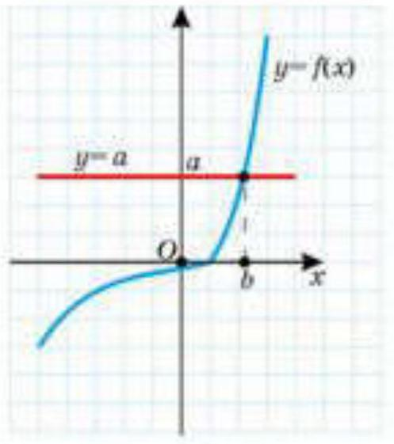
1)
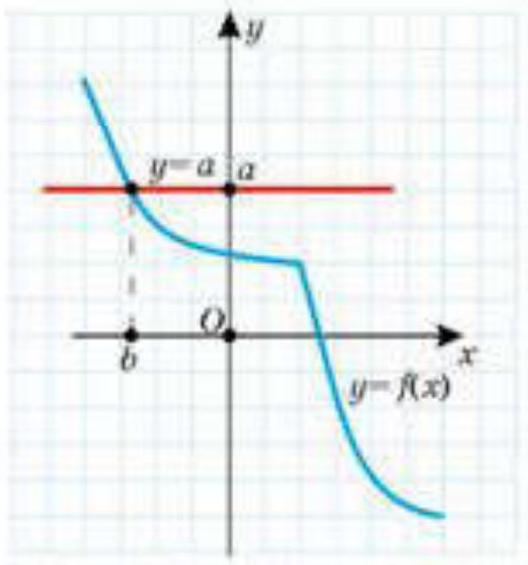
2)
15.1-cyper

Теорема (түбір туралы). Егер $y=f(x)$ функиясы кандай да бір санды аратықта өспеті немесе кехіметі және а саны берілген функциянын осы аратықта кабылоайтын кез келген мәні болса, онда осы аратызта $f(x)=$ а тендеуінін бір гана тубірі болады .

Далелдеуі $\cdot y=f(x)$ еспелі функциясын карастырайык $(y=f(x)$ функшисынын кемімелі жағдайы тура осытай карастырылады).

Шарт бойынша берілген сан аралығында $f(b)=a$ тендігі орындалатындай $b$ саны бар болады. Осы $b$ саны $f(b)=a$ тендеуінін бір ғана түбірі болатынын керсетейік.

Дәлелдеуді кері жору аркылы жүргіземіз, яғни берілген сан аратығында $f(c)=a$ болатындай тағы бір $c \neq b$ саны бар деп жорамалдаймыз.
$c \neq b$ болғандыктан, $c<b$ немесе $c>b$. Шарт бойынша функшия берілген аралыкта еседі, сондыктан еспелі функцинын аныктамасы бойынша $f(c)<f(b)$ немесе $f(c)>f(b)$. Бұл тұжырым $f(c)=f(b)=a$ тендігіне карама-кайшы. Демек, жасалған тұжырым жалған және берілген аралыкта $f(x)=a$ тендеуінін $b$ санынан баска түбірі болмайды.

Түбір туралы теореманы $y=f(x)$ функциясынын кемімелі жағдайы үшін өздерін дәлелдендер.
$\left[-\frac{\pi}{2} ; \frac{\pi}{2}\right]$ ке сіндісінде берілген $y=\sin x$ функциясын карастырайык (15.2-сурет). Осы аралықта берілген функцияныи есетінін және -1-ден 1-ге дейінгі, 1-ді коса алғандағы мәндерді қабылдайтынын білесіндер. Сондыктан түбір туралы теорема бойынш а $\left[-\frac{\pi}{2} ; \frac{\pi}{2}\right]$ ке сіндісінде $-1 \mathrm{~m}_{a} \mathrm{~m}_{1}$ тенс іздігін канағаттандыратын $\quad \sin x=a$ тендеуінін бір ғана түбірі болады. Ол түбір а санынын арксинусы деп аталады және $\arcsin$ а деп белгіленеді (15.3-сурет).

\begin{figure}
\includegraphics[alt={},max width=\textwidth]{https://cdn.mathpix.com/cropped/b3f159e3-70ef-4ad9-b9e9-0ac5b230efd7-120.jpg?height=422&width=600&top_left_y=1372&top_left_x=349}
\captionsetup{labelformat=empty}
\caption{15.2-cyper}
\end{figure}

\begin{figure}
\includegraphics[alt={},max width=\textwidth]{https://cdn.mathpix.com/cropped/b3f159e3-70ef-4ad9-b9e9-0ac5b230efd7-120.jpg?height=419&width=599&top_left_y=1370&top_left_x=1215}
\captionsetup{labelformat=empty}
\caption{15.3-cypet}
\end{figure}

Аныктама $a(|a| \mathrm{m} 1)$ саныныи аркси нусы деп синусы а-га тен $\left[-\frac{\pi}{2} ; \frac{\pi}{2}\right]$ аратыгындагы санды айтады.

\section*{МЫСАЛ}
2. $\arcsin 0=0, \arcsin 1=\frac{\pi}{2}, \arcsin (-1)=-\frac{\pi}{2}, \arcsin \frac{1}{2}=\frac{\pi}{6}$, $\arcsin \left(-\frac{1}{2}\right)=-\frac{\pi}{6}$.

Аныктама бойынша $\sin (\arcsin a)=a$ тендігі орындалады, мұндағы $|a| \mathrm{m}_{1}$ және $-\frac{\pi}{2} \mathrm{~m} \arcsin a \mathrm{~m} \frac{\pi}{2}$.

\section*{ТЧСІНДІРІҢДЕР}
aresin a opheriндегi а саны кандай мәндерді кабыдлауы мумкін? Неліктен?
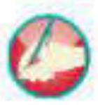
$\arcsin (-1)$ және $\arcsin 1$; $\arcsin \left(-\frac{1}{2}\right)$ және $\arcsin \frac{1}{2} ; \arcsin \left(-\frac{\sqrt{2}}{2}\right)$ және $\arcsin \frac{\sqrt{2}}{2} ; \arcsin (-a)$ және arcsin a өрнектерінін мәндері арасындағы тәуелділікті анықтандар (15.4-сурет).
[0; П] кесіндісінде берілген $y=\cos x$ функциясын карастырайык (15.5-сурет). Осы сан аралығында берілген функцинын кемитінін және -1-ден 1-ге дейінгі, 1-ді
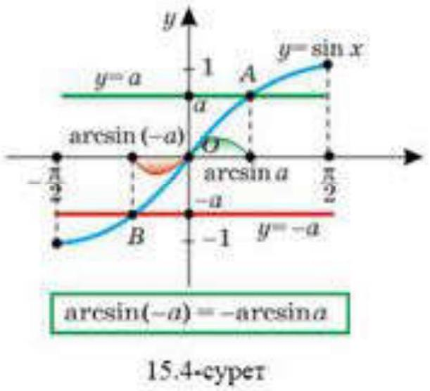 коса алғандағы мәндерді кабылдайтынын білесіндер. Сондыктан түбір туралы теорема бойынша $[0 ; \pi]$ кесіндісінде -1 m a m 1 тенсіздігін канағаттандыратын $\quad \cos x=a$ тендеуінін бір ғана түбірі болады. Ол түбір $|a| \mathrm{m} 1$ болғанда а санынын аркжосшусы деп аталады және $\arccos a$ деп белгіленеді (15.6-сурет).

\begin{figure}
\includegraphics[alt={},max width=\textwidth]{https://cdn.mathpix.com/cropped/b3f159e3-70ef-4ad9-b9e9-0ac5b230efd7-121.jpg?height=357&width=552&top_left_y=1119&top_left_x=301}
\captionsetup{labelformat=empty}
\caption{15.5-eypet}
\end{figure}

\begin{figure}
\includegraphics[alt={},max width=\textwidth]{https://cdn.mathpix.com/cropped/b3f159e3-70ef-4ad9-b9e9-0ac5b230efd7-121.jpg?height=355&width=543&top_left_y=1114&top_left_x=1114}
\captionsetup{labelformat=empty}
\caption{15.6-eyper}
\end{figure}

Аныктама $\boldsymbol{a}\left(|\boldsymbol{a}|^{\mathrm{m}} \mathbf{1}\right)$ саныныи арккосинусы деп косипсы $a$-га тен [0; 0] аратыеындагы санды айтады .

МЫСАЛ
3. $\arccos \theta=\frac{\pi}{2}, \arccos 1=0, \arccos (-1)=\pi, \arccos \frac{1}{2}=\frac{\pi}{3}$, $\operatorname{arcos}\left(-\frac{1}{2}\right)=\frac{2 \pi}{3}$.

Аныктама бойынша $\cos (\arccos a)=a$, мүндағы $|a| \mathrm{m} \arccos a \mathrm{~m} \pi$, тендігі орындалады.

\section*{ТЧСІНДІРІНДЕР}
arccos $a$ ернегіндегі а саны кандай мондерді кабылдауы мүмкін? Неліктен?
ar ccos(-1) және $\arccos 1: \arccos \left(-\frac{1}{2}\right)$ және $\arccos \frac{1}{2} ; \arccos \left(-\frac{\sqrt{2}}{2}\right)$ және $\arccos \frac{\sqrt{2}}{2} ;$ агссов(- $a$ ) және агссов $a$ ернектерінің мәндері арасындағы тәуелділікті анықтандар (15.7-cyper).
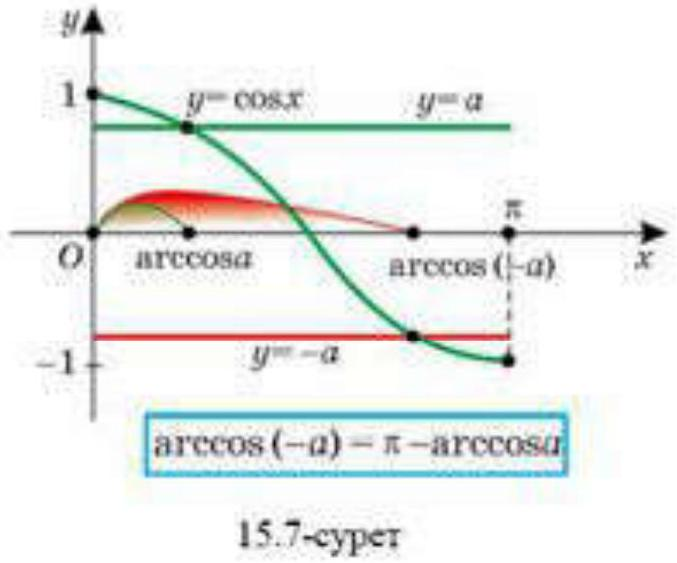
$\left(-\frac{\pi}{2} ; \frac{\pi}{2}\right)$ интервалында берілген $y=\operatorname{tg} x$ функшисын карастырайык (15.8-сурет). Осы сан аралығында берілген функшянын есетінін және $-^{\infty}$-тен $+\infty$-ке дейінгі мондерді кабылдайтынын білесіндер. Сондыктан түбір туралы теорема бойынша кез келген $a$ нақты саны үшін $\left(-\frac{\pi}{2} ; \frac{\pi}{2}\right)$ ннтервалында $\operatorname{tg} x=a$ тендеуінін бір ғана түбірі болады. Ол түбір $|a| \mathrm{m}_{1}$ болғанда а саныныи арктангенсі деп аталады жене arctg $a$ деп белгіленеді (15.9-сурет).

\begin{figure}
\includegraphics[alt={},max width=\textwidth]{https://cdn.mathpix.com/cropped/b3f159e3-70ef-4ad9-b9e9-0ac5b230efd7-122.jpg?height=685&width=522&top_left_y=762&top_left_x=440}
\captionsetup{labelformat=empty}
\caption{15.8-cyper}
\end{figure}

\begin{figure}
\includegraphics[alt={},max width=\textwidth]{https://cdn.mathpix.com/cropped/b3f159e3-70ef-4ad9-b9e9-0ac5b230efd7-122.jpg?height=685&width=481&top_left_y=762&top_left_x=1242}
\captionsetup{labelformat=empty}
\caption{15.9-cypet}
\end{figure}

Аныктама a саныныи арктангенсі интереатындагы санды айтады .

деп тангенсі $a$-га тен $\left(-\frac{\pi}{2} ; \frac{\pi}{2}\right)$

\section*{МЫСАЛ}
4. $\operatorname{arctg} 0=0, \operatorname{arctg} 1=\frac{\pi}{4}, \operatorname{arctg}(-1)=-\frac{\pi}{4}$.

Аныктама бойынша $\operatorname{tg}(\operatorname{arctg} a)=a$, мүндағы $-\frac{\pi}{2}<\operatorname{arctg} a<\frac{\pi}{2}$, тендігі орындалады.

\section*{ТЧСІНДІРІҢДЕР}
arctg $a$ epheringeri $a$ саны каидай мэидерді кабылдауы мүмкін? Неліктен?
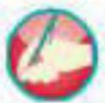
$\operatorname{arctg}(-1)$ және $\operatorname{arctg} 1$; $\operatorname{arctg}(-a)$ және $\operatorname{arctg} a$ өрнектерінін мәндерін салыстырындар (15.10-сурет).
(0; T) интервалында берілген $y=\operatorname{ctg} x$ функшясын карастырайык (15.11-сурет). Осы сан аралығында берілген функцияныи кемитінін және $+^{\infty}$-тен $-^{\infty}$-ке дейінгі мәндерді кабыдайтынын білесіндер. Сондыктан түбір туралы теорема бойынша кез кепен а накты саны үшін ( 0 ; т) ингервалында $\operatorname{ctg} x=a$ тендеуінін бір ғана түбірі болады. Ол түбір а санынын арккотангенсі деп аталды және arcctg a деп белгіленеді (15.12-сурет).
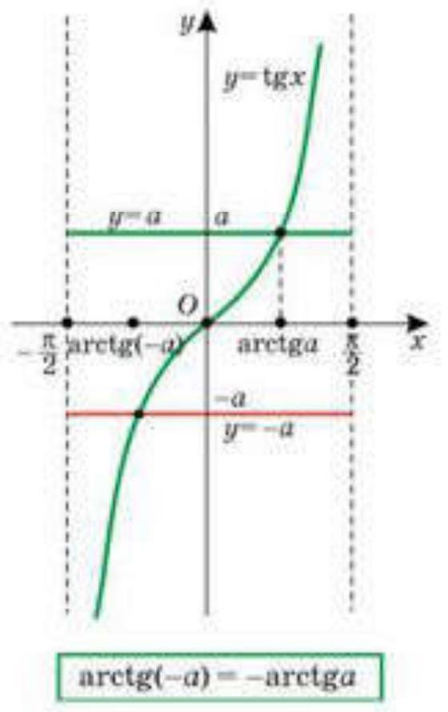
15.10-cyper
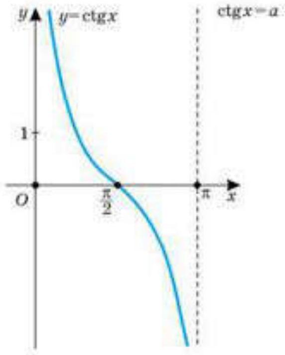
15.11-cyper
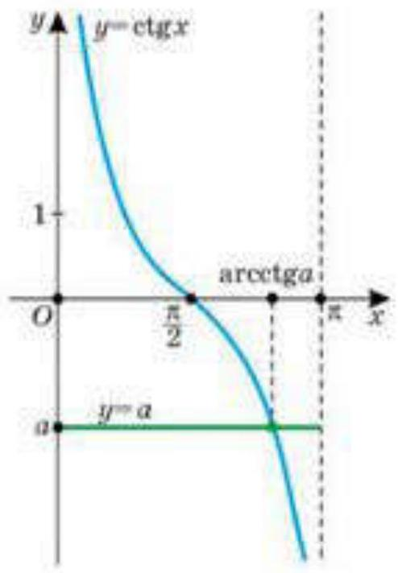
15.12-cypet

Аныктама a саныныи арккотангенсі деп котангенсі а-га тен ( 0 ; T) интерватындагы санды айтады .

\section*{МЫСАЛ}
5. $\operatorname{arcctg} 0=\frac{\pi}{2}, \operatorname{arcctg} 1=\frac{\pi}{4}, \operatorname{arcctg}(-1)= =\frac{3 \pi}{4}$.

Аныктама боїынша $\operatorname{ctg}(\operatorname{arcctg} a)=a$ тендігі, мұндағы $0<\operatorname{arcctg} a<\pi$, орындалады.

\section*{ТЧСІНДІРІНДЕР}
arectg $a$ epнeriндегі $a$ саны кандай мэндерді кабыдлауы мүмкін? Неліктен?
$\operatorname{arcctg}(-1)$ және $\operatorname{arcctg} 1 ; \operatorname{arcctg}(-a)$ және $\operatorname{arcctg} a$
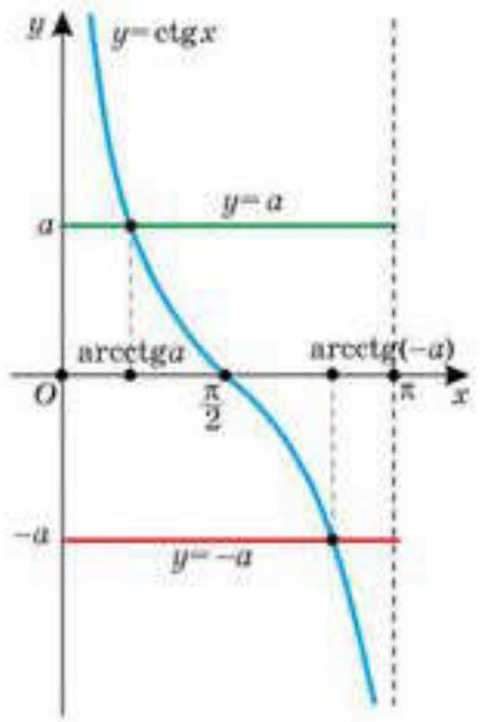
$\operatorname{arcctg}(-a)=\pi-\operatorname{arcctg} a$ өрнектерінін мәндерін салыстырындар (15.13-сурет).
1. $f(x)=a$ тендеуініи канша түбірі болуы мумки? Кандай жағдайда осы тендеудіи бір ғана түбірі болады?
2. [-Пе T] аралыгындагы: 1) $\sin x=a ; 2) \cos x=a ; 3) \operatorname{tg} x=a ; 4) \operatorname{ctg} x=a$ тендеуінін канша түбірі бар?
3. 1) $\arcsin (\sin$ ɑ); 2) $\arccos (\cos$ ɑ): 3) $\operatorname{arctg}(\operatorname{tg}$ ɑ); 4) $\operatorname{arcctg}(\operatorname{ctg}$ ɑ) мәні неге тен?
4. 1) $\arcsin (\sin \alpha) ;$ 2) $\arccos (\cos \alpha) ;$ 3) $\operatorname{arctg}(\operatorname{tg} \alpha) ;$ 4) $\operatorname{arcetg}(\operatorname{ctg} \alpha)$ epherinzeri С саны кандай мәидерді кабылдайды? Неліктен?

\section*{Жаттығулар}

\section*{A}
15.1. Erep:
1) $x \in(-\infty$; $+\infty)$ болса, онда $x^{5}=6$;
2) $x \in(-\infty ; 2)$ болса, онда $\frac{5}{x-2}=-1$;
3) $x \in(-10 ;+\infty)$ болса, онда $x^{8}=1$;
4) $x \in(-\infty ;-3) \cup(-3 ;+\infty)$ болса. онда $\frac{-3}{x+3}=2$;
5) $x \in[-\pi ; \pi]$ болса, онда $\cos x=-0,4$;
6) $x \in(-\pi ; 0]$ болса, онда $\sin x=0,6$ тендеуінін түбірлер санын табындар.
Бірлік шенбер салындар және $t$-нын мәні берілген тендікті канағаттандыратындай $\quad P$, нүктелерін белгілендер. Берілген аралыкқа тпісті $t$-нын мәндерін табындар (15.2-15.5):
15.2.
1) $\cos t=-\frac{\sqrt{3}}{2}, t \in[0 ; \pi]$;
2) $\cos t=0,5, \quad t \in\left[0 ; \frac{\pi}{2}\right]$;
3) $\cos t=\frac{\sqrt{2}}{2}, t \in[0 ;$ T]:
4) $\cos t=-1, t \in[-0,3 \pi ; \pi]$.
15.3. 1) $\sin t=-\frac{\sqrt{3}}{2}, t \in[-0,5 \pi ; 0]$;
2) $\sin t=0,5, t \in\left[\mathbf{0} ; \frac{\pi}{2}\right]$;
3) $\sin t=\frac{\sqrt{2}}{2}, t \in[0 ;$ m $]$;
4) $\sin t=1, t \in[0 ;$ M].
15.4. 1) $\operatorname{tg} t=-\frac{\sqrt{3}}{3}, t \in[-0.5 \pi ; 0]$;
2) $\operatorname{tg} t=\sqrt{3}, t \in\left[0 ; \frac{\pi}{2}\right]$;
3) $\operatorname{tg} t=1, t \in[0 ; 0,5 \pi]$;
4) $\operatorname{tg} t=-1, t \in[0 ; \pi]$.
15.5. 1) $\operatorname{ctg} t=-\frac{\sqrt{3}}{3}, t \in[-0,5 \pi ; 0]$;
2) $\operatorname{ctg} t=\sqrt{3}, t \in\left[0 ; \frac{\pi}{2}\right]$;
3) $\operatorname{ctg} t=1, t \in[0 ; 0,5 \pi]$;
4) $\operatorname{ctg} t=-1, t \in[0 ;$ T].

Өрнектін мәнін табындар (15.6-15.8):
15.6 .
1) $\arcsin (-1)$;
2) $\arcsin 0 ;$
3) $\arcsin \left(-\frac{1}{2}\right)$;
4) $\arcsin \left(-\frac{\sqrt{3}}{2}\right)$.
15.7.
1) $\arccos 0$;
2) $\arccos 1$;
$3) \arccos \left(-\frac{\sqrt{2}}{2}\right)$;
4) $\arccos \left(-\frac{\sqrt{3}}{2}\right)$.
15.8 .
1) $\operatorname{arctg} 1$;
2) $\operatorname{arctg} 0$;
$3) \operatorname{arctg}(-1)$;
4) $\operatorname{arctg}\left(-\frac{\sqrt{3}}{3}\right)$.

Берілген өрнектердін мағынасы бар ма (15.9-15.12):
15.9.
1) $\arcsin (-3)$;
2) $\arcsin 0,7$;
3) $\arcsin \left(-\frac{3}{5}\right)$ :
4) $\arcsin \left(-\frac{3 \sqrt{3}}{4}\right)$ ?
15.10.
1) $\arccos 1,2$;
$2) \arccos (-1)$;
3) $\arccos \left(-\frac{\sqrt{2}}{5}\right)$ :
4) $\arccos \left(-\frac{3 \sqrt{3}}{2}\right)$ ?
15.11.
$1) \operatorname{arcctg}(-1)$;
2) $\operatorname{arctg} 0,12$;
$3) \operatorname{arctg} 21$;
4) $\operatorname{arctg}\left(-\frac{5 \sqrt{3}}{3}\right)$ ?
15.12.
1) $\arcsin \left(-\frac{3 \sqrt{3}}{2}\right)$;
2) $\arccos \left(-3 \frac{1}{5}\right)$ :
з) $2 \operatorname{arcctg}(-\sqrt{3})$;
4) $\arcsin 5$;
5) $\operatorname{arctg} 17$;
6) $\arccos \left(-\frac{\sqrt{2}}{3}\right)$ ?
15.13. Өрнектердін мәндерін салыстырындар:
1) $\arccos \left(-\frac{\sqrt{2}}{2}\right)$ және $\arcsin (-1)$;
2) $\arccos \left(-\frac{\sqrt{3}}{2}\right)$ және $\arcsin \frac{\sqrt{3}}{2}$;
3) $\operatorname{arctg}\left(-\frac{\sqrt{2}}{2}\right)$ және $\arcsin 0.6$;
4) $\operatorname{arcctg}\left(-\frac{\sqrt{3}}{2}\right)$ және $\arccos (-0,5)$.
B

Өрнектін мәнін табындар (15.14-15.16):
15.14.
1) $\arccos \left(-\frac{\sqrt{2}}{2}\right)+\arcsin (-0,5)$;
2) $\arccos \left(-\frac{\sqrt{3}}{2}\right)-\arcsin \frac{\sqrt{3}}{2}$;
3) $\arccos 0,5+\arcsin (-1) ;$
4) $\arccos \frac{\sqrt{3}}{2}-\arcsin \left(-\frac{\sqrt{2}}{2}\right)$.
15.15.
1) $\operatorname{arcctg}(-1)-\operatorname{arctg} \sqrt{3}$;
$2) \operatorname{arctg}(-1)+\operatorname{arctg}(-\sqrt{3})$;
3) $\operatorname{arcctg}\left(-\frac{\sqrt{3}}{3}\right)+\operatorname{arcctg}(-\sqrt{3})$;
4) $\operatorname{arctg}\left(-\frac{\sqrt{3}}{3}\right)+\operatorname{arcctg}(-\sqrt{3})$.
15.16.
1) $\arccos (-1)-\operatorname{arctg} \sqrt{3}$;
2) $\arcsin (-1)+\operatorname{arctg}(-\sqrt{3})$ :
3) $\arcsin \left(-\frac{\sqrt{3}}{2}\right)+\operatorname{arcctg}(-\sqrt{3})$;
4) $\arccos \left(-\frac{\sqrt{3}}{2}\right)+\operatorname{arcctg}(-1)$.
15.17. Есептендер:
1) $2 \arcsin \left(-\frac{\sqrt{3}}{2}\right)-3 \operatorname{arctg}\left(-\frac{\sqrt{3}}{3}\right)+\arccos \left(-\frac{\sqrt{3}}{2}\right)-2 \operatorname{arcctg}(-1)$;
2) $\arccos \left(-\frac{\sqrt{2}}{2}\right)+2 \operatorname{arcctg}(-\sqrt{3})+\arcsin \left(-\frac{\sqrt{3}}{2}\right)+\operatorname{arctg} 1$;
3) $3 \arcsin \frac{\sqrt{3}}{2}-\operatorname{arctg}(-1)+\arccos \left(-\frac{\sqrt{2}}{2}\right)+\operatorname{arcctg}(-\sqrt{3})$;
4) $\arccos \left(-\frac{\sqrt{3}}{2}\right)+\operatorname{arctg}(-\sqrt{3})-\arcsin (-1)-2 \operatorname{arctg} \sqrt{3}$.

\section*{C}
15.18. Бірлік шенберді, тангенс пен котантенстін сызыктарын колданып. кез келген $t_{1}$ және $t_{2}$ сандары үшін $t_{1}<t_{2}$ тенсіздігінен:
1) $\operatorname{arctg} t_{1}<\operatorname{arctg} t_{2}$;
2) $\operatorname{arcctg} t_{1}>\operatorname{arcctg} t_{2}$ тенсіздігі шығатынын дәлелдендер.
15.19. [-1; 1] сан аралығына пісті кез келген $x_{1}$ және $x_{2}$ сандары үшін $x_{1}<x_{2}$ тенсіздігінен:
1) $\arcsin x_{1}<\arcsin x_{2}$;
2) $\arccos x_{1}>\arccos x_{2}$ тенсіздігі шығапынын дәлелдендер.
15.20. 1) $\arcsin (-0,3) ; \quad \arcsin (-0,1) ; \quad \arcsin \frac{\pi}{9} ; \arcsin \frac{\pi}{6} ;$
2) $\arccos (-1) ; \quad \arccos (-0,2) ; \quad \arccos \frac{\pi}{5} ; \arccos \frac{\pi}{9}$ ернектерінін мәндерін кему ретімен орналастыр ындар.
15.21. 1) $\operatorname{arctg}(-7,3) ; \quad \operatorname{arctg}(-0,3) ; \quad \operatorname{arctg} \frac{5 \pi}{9} ; \operatorname{arctg} \frac{\pi}{6} ;$
2) $\operatorname{arcctg}(-111) ; \quad \operatorname{arcctg}(-2,2) ; \quad \operatorname{arcctg} \frac{2 \pi}{5} ; \operatorname{arcctg} \frac{5 \pi}{9}$ өрнектерінін мәндерін есу ретімен орналастырындар.

\section*{КАЯТАЛАУ}
15.22.
1) $\sin 75^{\circ}+\sin 15^{\circ}$;
2) $\cos 152^{\circ}+\cos 28^{\circ}$
тригонометриялык функиияларынын алгебралык косындысын көбейтіндіге түрлендіріндер және ымшамдандар.
15.23. Өрнекті ыкшамдандар:
1) $\sin 5 \alpha \cdot \sin 3 \alpha+\cos 5 \alpha \cdot \cos 3 \alpha ;$
2) $\cos 2 \alpha \cdot \sin 3 \alpha-\sin 2 \alpha \cdot \cos 3 \alpha$.
15.24. 1) $y=\sin \left(x-\frac{\pi}{3}\right)$;
2) $y=\sin \left(2 x+\frac{2 \pi}{3}\right)$;
3) $y=2 \cos \left(x-\frac{\pi}{4}\right)$ функция сынын графигін салындар.

\section*{ЖАНА БІЛІМДІ МЕҢГЕРУГЕ АРНАЛҒАН ТІРЕК ҰҒЫМДАР}

Функция, анықтату обтысы, мәндер жиыны, функциянын касиеттері, кері функция ұгымы жане оны курастыру алгоритмі, тригонометриялык функция.тар, тригонометриялык функциялардын жасиеттері мен графиктері.

\section*{§16. КЕРІ ТРИГОНОМЕТРИЯЛЫК ФУНКЦИЯЛАР, ОЛАРДЫЦ ҚАСИЕТТЕРІ ЖӘНЕ ГРАФИГІ}

Кері тригонометриялық функциялар ұғымымен, олардын қасиеттерімен танысасындар; кері тригонометриялық функциялардын графиктерін салуды үйренесіндер.

\section*{ТУЙІНДІ ΨғыМДАР}

Кері тригонометриялық функциялар

Тригонометриялык функшияларға кері функциялар кері тригонометриятык функциятар немесе аркфункциязар деп аталады.

Аныктама $y=\sin x$ функцисына кері функция арксинус деп аталады және $y=\arcsin x$ деп белгіленеді.
$y=\cos x$ функшисына кері функин арккосинус деп аталады және $y=\arccos x$ деп белгіленеді.
$y=\operatorname{tg} x$ функшясына кері функция арктангенс деп аталады және $y=\operatorname{arctg} x$ деп белгіленеді.
$y=\operatorname{ctg} x$ функциясына кері функция арккотангенс деп аталады және $y=\operatorname{arcctg} x$ деп бетіленеді.

СЕНДЕР БИЯЕСТДЕР:

Берілген функшияныя аныктату облысы оған кері функшиянын мәндер жныны, ал мэндер жныны кері функшияныи аныкталу облысы болады.
Өзара кері функциятардын графиктері 1 және 3 координаталык ширектердін биссектрисаларына карағанда симметриялы.

Егер функиня бірсарынды ботмаса, онда онын кері функшияеы болмайды.

\section*{ТЧСІНДІРІНДЕР}

Неліктен $y=\arcsin x$ функииясынын графигін салу үшін $y=\sin x$ функшиясынын графигі (16.1-сурет) колданылып, синусонданын бір белігі (16.2-сурет) ғана карастырытады?

\begin{figure}
\includegraphics[alt={},max width=\textwidth]{https://cdn.mathpix.com/cropped/b3f159e3-70ef-4ad9-b9e9-0ac5b230efd7-127.jpg?height=314&width=1322&top_left_y=1923&top_left_x=328}
\captionsetup{labelformat=empty}
\caption{16.1-cyper}
\end{figure}

\begin{figure}
\includegraphics[alt={},max width=\textwidth]{https://cdn.mathpix.com/cropped/b3f159e3-70ef-4ad9-b9e9-0ac5b230efd7-127.jpg?height=277&width=1328&top_left_y=2348&top_left_x=315}
\captionsetup{labelformat=empty}
\caption{16.2-cyper}
\end{figure}

\section*{ТЧСІНДІРІНДЕР}
$y=\arcsin x$ функшисыныи графигі калай салынган (16.3-сурет)?

\begin{figure}
\includegraphics[alt={},max width=\textwidth]{https://cdn.mathpix.com/cropped/b3f159e3-70ef-4ad9-b9e9-0ac5b230efd7-128.jpg?height=553&width=526&top_left_y=539&top_left_x=468}
\captionsetup{labelformat=empty}
\caption{16.3-cyper}
\end{figure}

\begin{figure}
\includegraphics[alt={},max width=\textwidth]{https://cdn.mathpix.com/cropped/b3f159e3-70ef-4ad9-b9e9-0ac5b230efd7-128.jpg?height=645&width=598&top_left_y=463&top_left_x=1098}
\captionsetup{labelformat=empty}
\caption{16.4-cypet}
\end{figure}
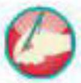
$y=\arcsin x$ функциясының графигін колданып кестені толтырындар (16.4-сурет).

\begin{tabular}{|l|l|}
\hline Аныктату облысы & \\
\hline Мәндер жныны & \\
\hline Жұптылык (тактылык) & \\
\hline Бірсарындылык & \\
\hline Ен үлкен мәні & \\
\hline Ен кіші мәні & \\
\hline Функцияныи нелдері & \\
\hline
\end{tabular}

\section*{ТЧСІНДІРІНДЕР}

Неліктен $y=\operatorname{arc} \cos x$ функциясынын графигін салу ушін $y=\cos x$ функшиясынын графигі (16.5-сурет) колданылып, синусонданын бір белігі (16.6-сурет) ғана карастырылады?

\begin{figure}
\includegraphics[alt={},max width=\textwidth]{https://cdn.mathpix.com/cropped/b3f159e3-70ef-4ad9-b9e9-0ac5b230efd7-128.jpg?height=415&width=1438&top_left_y=2213&top_left_x=365}
\captionsetup{labelformat=empty}
\caption{16.5-cyper}
\end{figure}

\begin{figure}
\includegraphics[alt={},max width=\textwidth]{https://cdn.mathpix.com/cropped/b3f159e3-70ef-4ad9-b9e9-0ac5b230efd7-129.jpg?height=391&width=1262&top_left_y=226&top_left_x=351}
\captionsetup{labelformat=empty}
\caption{16.6-cyper}
\end{figure}

\section*{ТЧСІНДІРІҢАЕР}
$y=\arccos x$ функиизсынын графигі калай салынған (16.7-сурет)?

\begin{figure}
\includegraphics[alt={},max width=\textwidth]{https://cdn.mathpix.com/cropped/b3f159e3-70ef-4ad9-b9e9-0ac5b230efd7-129.jpg?height=492&width=1102&top_left_y=975&top_left_x=429}
\captionsetup{labelformat=empty}
\caption{16.7-cyper}
\end{figure}
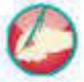
$y=\arccos x$ функциясынын графигін колданып кестені толтырындар (16.8-сурет).

\begin{tabular}{|l|l|}
\hline Аныкталу облысы & \\
\hline Мәндер жныны & \\
\hline Жұптылык (тактылық) & \\
\hline Бірсарындылык & \\
\hline Ен үлкен мәні & \\
\hline Ен кіші мәні & \\
\hline Функииянын нелдері & \\
\hline
\end{tabular}

\begin{figure}
\includegraphics[alt={},max width=\textwidth]{https://cdn.mathpix.com/cropped/b3f159e3-70ef-4ad9-b9e9-0ac5b230efd7-129.jpg?height=519&width=519&top_left_y=1754&top_left_x=1247}
\captionsetup{labelformat=empty}
\caption{16.8-cypet}
\end{figure}

\section*{ТУСІНДІРІНДЕР}

Неліктен $y=\operatorname{arctg} x$ функшиямнын графигін салу yшін $y=\operatorname{tg} x$ функинясыныи графигі (16.9-сурет) колданылып. тангенсоиданыи бір белігі (16.10-сурет) ғана карастырылады?
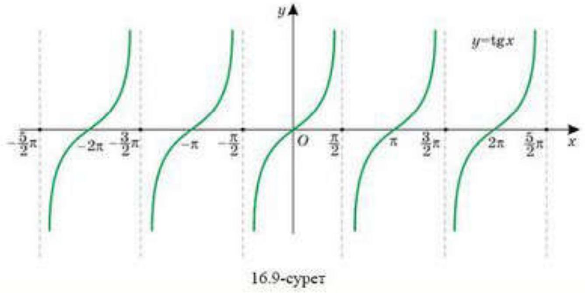

\section*{ТУСІНДІРІНДЕР}
$y=\operatorname{arctg} x$ функциясынын графигі калай салынған (16.11-сурет)?

\begin{figure}
\includegraphics[alt={},max width=\textwidth]{https://cdn.mathpix.com/cropped/b3f159e3-70ef-4ad9-b9e9-0ac5b230efd7-130.jpg?height=478&width=291&top_left_y=1133&top_left_x=575}
\captionsetup{labelformat=empty}
\caption{16.10-cyper}
\end{figure}

\begin{figure}
\includegraphics[alt={},max width=\textwidth]{https://cdn.mathpix.com/cropped/b3f159e3-70ef-4ad9-b9e9-0ac5b230efd7-130.jpg?height=487&width=545&top_left_y=1117&top_left_x=1050}
\captionsetup{labelformat=empty}
\caption{16.11-cypet}
\end{figure}
$y=\operatorname{arctg} x$ функциясынын графигін колданып кестені толтырындар (16.12-сурет).

\begin{figure}
\includegraphics[alt={},max width=\textwidth]{https://cdn.mathpix.com/cropped/b3f159e3-70ef-4ad9-b9e9-0ac5b230efd7-130.jpg?height=509&width=869&top_left_y=1861&top_left_x=245}
\captionsetup{labelformat=empty}
\caption{16.12-cyper}
\end{figure}

\begin{tabular}{|l|l|}
\hline Аныкталу облысы & \\
\hline Мондер жныны & \\
\hline Жұптылык (тактытык) & \\
\hline Бірсарындылык & \\
\hline Еи улкен мәні & \\
\hline Ен кіші мәні & \\
\hline Функцияныи нелдері & \\
\hline
\end{tabular}

\section*{ТНСІНДІРІНДЕР}

Неліктен $y=\operatorname{arcctg} x$ функциясыныи графигін салу үшін $y=\operatorname{ctg} x$ функциясыныи графигі (16.13-сурет) колданылып, котангенсоиданын бір белігі (16.14-сурет) ғана қарастырылады?

\begin{figure}
\includegraphics[alt={},max width=\textwidth]{https://cdn.mathpix.com/cropped/b3f159e3-70ef-4ad9-b9e9-0ac5b230efd7-131.jpg?height=693&width=1120&top_left_y=226&top_left_x=427}
\captionsetup{labelformat=empty}
\caption{16.13-cyper}
\end{figure}

\begin{figure}
\includegraphics[alt={},max width=\textwidth]{https://cdn.mathpix.com/cropped/b3f159e3-70ef-4ad9-b9e9-0ac5b230efd7-131.jpg?height=591&width=970&top_left_y=1041&top_left_x=497}
\captionsetup{labelformat=empty}
\caption{16,14-cyper}
\end{figure}

\section*{ТЧСІНДІРІНДЕР}
$y=\operatorname{arcctg} x$ функциасыныи графигі калай салынтан (16.15-суpet)?

\begin{figure}
\includegraphics[alt={},max width=\textwidth]{https://cdn.mathpix.com/cropped/b3f159e3-70ef-4ad9-b9e9-0ac5b230efd7-131.jpg?height=574&width=920&top_left_y=1786&top_left_x=874}
\captionsetup{labelformat=empty}
\caption{16.15-cyper}
\end{figure}
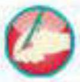
$y=\operatorname{arcetg} x$ функциясының графигін колданып, кестені толтырындар (16.16-сурет).

\begin{figure}
\includegraphics[alt={},max width=\textwidth]{https://cdn.mathpix.com/cropped/b3f159e3-70ef-4ad9-b9e9-0ac5b230efd7-132.jpg?height=408&width=839&top_left_y=481&top_left_x=243}
\captionsetup{labelformat=empty}
\caption{16.16-cyper}
\end{figure}

\begin{tabular}{|l|l|}
\hline Аныкталу облысы & \\
\hline Мәндер жиыны & \\
\hline Жұптылык (тактылык) & \\
\hline Бірсарындылык & \\
\hline Еи үлкен мәні & \\
\hline Ен кіші мәні & \\
\hline Функциянын нелдері & \\
\hline
\end{tabular}
1. Неліктен кері тригонометриялык функциянын графигін салу барысында сәйкес тригонометриялык функиия графигінін бір белігі ғана карастырылады?
2. Кері тригонометриялык функциятар периодты функция бола ма?

\section*{Жаттығулар}

\section*{A}

Функцияныи аныкталу облысын табындар (16.1-16.3) :
16.1 - 1) $y=\arcsin 2 x ;$
3) $y=2 \arcsin (2 x+1)$;
2) $y=\arcsin (2 x-1)$;
4) $y=2-\arcsin (x+2)$.
16.2. 1) $y=\arccos 3 x$;
3) $y=2 \arccos (2 x+3)$;
2) $y=2 \arccos (2 x-1)$;
4) $y=2-\arccos (x-3)$.
16.3.
1) $y=\operatorname{arctg} 2 x$;
2) $y=\operatorname{arctg}(2 x-1)$;
3) $y=2 \operatorname{arctg}(2 x-1)$;
4) $y=2-\operatorname{arcctg}(x-2)$.
16.4. Тепе-тендікті дәлелдендер:
1) $\arcsin 1+\arccos 1=\frac{\pi}{2}$;
2) $\arcsin 1+\arccos 0=\pi$;
3) $\arcsin \frac{\sqrt{3}}{2}+\arccos \frac{\sqrt{3}}{2}=\frac{\pi}{2}$;
4) $\arcsin \frac{1}{2}+\arccos \frac{1}{2}=\frac{\pi}{2}$.
16.5. Функциянын мәндер жиынын табындар:
1) $y=-1+\arccos (3 x-1)$;
2) $y=\arcsin (2 x-1)+1$;
з) $y=2-\arccos (2 x+3)$;
4) $y=2-2 \arcsin (x-3)$.

\section*{B}
16.6. Функшиянын аныкталу облысын табындар:
1) $y=\arcsin \frac{1}{x}$;
2) $y=\arcsin \frac{1}{x-2}$;
3) $y=2 \arccos \frac{2}{x+2}$;
4) $y=2-\arccos \frac{1}{x-1}$.
16.7. $y=\arcsin x$ функциясынын графигін колданып, ернектердін мәндерін өсу ретімен орналастырындар:
1) $\arcsin \frac{\pi}{6} ; \arcsin 0,8 ; \quad \arcsin (-0,2)$;
2) $\arcsin \left(-\frac{\pi}{3}\right) ; \arcsin 0,9 ; \quad \arcsin (-0,1) ;$
3) $\arcsin \frac{\pi}{18} ; \arcsin 0,3 ; \quad \arcsin (-0,8)$.
16.8. $y=\arccos x$ функциясыныи графигін колданып, ернектердін мәндерін есу ретімен орналастырындар:
1) $\arccos \frac{\pi}{6} ; \arccos 0,8 ; \quad \arccos (-0,2) ;$
2) $\arccos \left(-\frac{\pi}{3}\right): \arccos 0,9 ; \quad \arccos (-0,1)$;
3) $\arccos 0 ; \quad \arccos 0,3 ; \quad \arccos (-0,7)$.
16.9. Функшины жұптылыкка зерттендер:
1) $y=2-\arcsin \frac{1}{x}$;
2) $y=2 x^{2}-\arcsin x^{2}$;
3) $y=2 \arccos \frac{2}{x^{2}+1}$;
4) $y=2 \arccos \frac{1}{x+1}$.
16.10. Функшяныи графигін салындар:
1) $y=-\arcsin x$;
2) $y=2-\arcsin x$;
3) $y=2 \arccos x$;
4) $y=-\arccos (-x)$.

\section*{C}
16.11. Функиняныи графигін салындар және бірсарындылыкка зерттендер:
1) $y=\arcsin (x-1)+2$;
2) $y=\pi-\arcsin x$;
3) $y=\pi+\arccos x$;
4) $y=-\arccos \frac{x}{2}$.
16.12. Функциянын графигін салындар:
1) $y=\mid \arcsin x-\pi ;$
2) $y=2 \arcsin |x|$;
3) $y=-2 \arccos |x|$;
4) $y=\arccos [x-2]$.
16.13. Функциянын аныкталу облысын табындар:
1) $y=2 \operatorname{arctg} x$;
2) $y=-\operatorname{arcctg} x$;
3) $y=2-\operatorname{arctg}(-x)$;
4) $y=-\operatorname{arcctg}(-x)$.
16.14. Функшянын графигін салындар:
1) $f(x)=\left\{\begin{array}{l}\operatorname{arctg} x, x \mathrm{~m} 0 \\ \sqrt{x}, x>0 ;\end{array}\right.$
2) $f(x)=\left\{\begin{array}{l}\operatorname{arcctg} x, x \mathrm{~m} 1, \\ \sqrt{x-1}, x>1 .\end{array}\right.$
16.15. Функциянын графигін салындар:
1) $f(x)=\left\{\begin{array}{l}\arccos x,|x| \mathrm{m} 0, \\ \sqrt{|x|},|x|>0 ;\end{array}\right.$
2) $f(x)=\left\{\begin{array}{l}\operatorname{arctg} x, x \mathrm{~m} 0, \\ \sqrt{x-1}, x>0 .\end{array}\right.$
16.16. Функцияныи графигін салындар және бірсарындылыкка зерттендер:
1) $y=|\operatorname{arctg} x|$;
2) $y=|2-\operatorname{arcctg} x|$;
3) $y=-2 \operatorname{arcctg}|-x|$;
4) $y=\left|\operatorname{arctg} x+\frac{\pi}{2}\right|$.

\section*{KARTAMAY}
16.17. Тепе-тендікті дәлелдендер:
1) $2 \operatorname{ctg} \alpha \cdot \operatorname{tg}(3 \pi+\alpha)-2 \sin (-\alpha) \cdot \cos \alpha+\cos \left(270^{\circ}-2 \alpha\right) \times \times \operatorname{tg}\left(\frac{\pi}{2}-2 \alpha\right)-2 \cos \left(2 \alpha-\frac{\pi}{2}\right)=2 ;$
2) $1-\cos 4 \alpha+\frac{1}{1+\operatorname{tg}^{2} 2 \alpha}-\left(1-\cos ^{2} 2 \alpha\right) \cdot \frac{1}{\sin ^{2} 2 \alpha}+\operatorname{tg} 3 \alpha \times \times \operatorname{tg}\left(90^{\circ}-3 \alpha\right)=2$.
16.18. Өрнекті ықшамдандар:
1) $1+2 \operatorname{tg} 3 \alpha \cdot \operatorname{ctg}(\pi-3 \alpha)+\sin ^{2} \frac{2 \alpha}{3} \cdot \operatorname{ctg}^{2} \frac{2 \alpha}{3}+\sin ^{2} \frac{2 \alpha}{3}$;
2) $\operatorname{tg}\left(\frac{3 \pi}{2}-\alpha\right) \cdot \operatorname{tg}(\pi+\alpha)+\frac{\sin ^{4} \alpha+2 \sin \alpha \cos \alpha-\cos ^{4} \alpha}{\operatorname{ctg}\left(\frac{\pi}{2}-2 \alpha\right)-1}$.
16.19. Функцияныи графигін салындар:
1) $y=[\sin x]$;
2) $y=[\cos x] ;$
3) $y=[\sqrt{x}]$.

\section*{ЖАҢА БІЛІМДІ МЕҢГЕРУГЕ АРНАЛҒАН ТІРЕК ҰҒЫМДАР}

Өрнек, тепе-тендік, тригонометрия формулалары, тригонометриялык функциялар, кері тригонометриялык функциялар, тригонометриялых функцияларыын касиеттері, кері тригонометриялық функциятардын касиеттері.

\section*{§17. КУРАМЫНДА АРКСИНУС, АРККОСИНУС, АРКТАНГЕНС, АРККОТАНГЕНСІ БАР ОРНЕКТЕРДІ ТЕПЕ-ТЕН ТУРТЕНДІРУ}

Құрамында кері тригонометриялық функциялары бар өрнектерді тепе-тен түрлендіруді уйренесіндер.

Арксинус, арккоспнус, арктантенс. арккотангенспен ернектелген санныи синусы.

3
ТУЙІНДІ ҰҒЫМДАР
Түрлендіру, өрнек, арксинус, арккосинус, арктангенс, арккотангенс коспнусы, тангенсі және котангенсін табайык
$\cos (\arcsin a)$ ернегін түрлендірейік. Ол үшін $\cos ^{2} \alpha+\sin ^{2} \alpha=1$ формуласынан $\cos \alpha$-ны ернектейік:
$$
\begin{equation*}
\cos \alpha= \pm \sqrt{1-\sin ^{2} \alpha} . \tag{1}
\end{equation*}
$$

Енді (1)-формуладағы $\alpha$-нын орнына $\arcsin a$-ны коямыз, яғни $\alpha=\arcsin \quad a$ алмастыруын жасаймыз.

Сонда (1)-формула мына түрге келеді:
$$
\cos (\arcsin a)= \pm \sqrt{1-(\sin (\arcsin a))^{2}}= \pm \sqrt{1-a^{2}} .
$$

Аныктама бойынша $\arcsin a$ дегенім із $\left[-\frac{\pi}{2} ; \frac{\pi}{2}\right]$ кесіндісіне тисті сан және осы аралыктағы сандар үшін $\cos \alpha$ тек теріс емес сандарды кабылдайды. Демек.
$$
\cos (\arcsin a)=\sqrt{1-a^{2}} .
$$

\section*{ТУСІНДІРІҢАЕР}
$\sin (\arccos a)=\sqrt{1-(\cos (\arccos a))^{2}}=\sqrt{1-a^{2}}$ тендігінде кандай түрлендірулер жасалған?
tg(arcsin a) өрнегін түрлендірейік:
$$
\operatorname{tg}(\arcsin a)=\frac{\sin (\arcsin a)}{\cos (\arcsin a)}-\frac{a}{\sqrt{1-a^{2}}} .
$$

\section*{ТУСІНДІРІНДЕР}

Теменде орындалған түрленаірулерді түсіндіріндер:
1) $\operatorname{ctg}(\arcsin a)=\frac{\cos (\arcsin a)}{\sin (\arcsin a)}=\frac{\sqrt{1-a^{2}}}{a}$;
2) $\operatorname{tg}(\arccos a)=\frac{\sin (\arccos a)}{\cos (\arccos a)}=\frac{\sqrt{1-a^{2}}}{a}$;
3) $\operatorname{ctg}(\arccos a)=\frac{\cos (\arccos a)}{\sin (\arccos a)}=\frac{d}{\sqrt{1-a^{2}}}$.
$\operatorname{tg}(\operatorname{arcctg} a)$ ернегін түрлендірейік. Ол үшін
$$
\operatorname{tg} \alpha=\frac{1}{\operatorname{ctg} \alpha}
$$

формуласын колданамыз. Бұл формуладағы $\alpha$-нын орнына $\operatorname{arcctg} a$-ны коямыз, яғни $\alpha=\operatorname{arcctg} a$ алмастыруын колданамыз:
$$
\operatorname{tg}(\operatorname{arcctg} a)=\frac{1}{\operatorname{ctg}(\operatorname{arcctg} a)}=\frac{1}{a} .
$$

\section*{ТЧСІНДІРІҢДЕР}

Теменде орыидалган гүрлендіруді түсіндіріндер:
$$
\operatorname{ctg}(\operatorname{arctg} a)=\frac{1}{\operatorname{tg}(\operatorname{arctg} a)}=\frac{1}{a} .
$$
$\cos (\operatorname{arctg} a)$ ернегін түрлендірейік. Ол ушін $1+\operatorname{tg}^{2} \alpha=\frac{1}{\cos ^{2} \alpha}$ формуласын колданып, $\cos \alpha$-ны ернектейміз:
$$
\cos \alpha= \pm \sqrt{\frac{1}{1+\operatorname{tg}^{2} \alpha}} .
$$

Аныктама бойынша $\operatorname{arctg} a$ деге німіз $\left(-\frac{\pi}{2} ; \frac{\pi}{2}\right)$ пнтервалына тністі сан және осы аралыктағы сандар үшін $\cos \alpha$ тек он сандарды кабылдайды. Демек.
$$
\cos \alpha=\sqrt{\frac{1}{1+\operatorname{tg}^{2} \alpha}} .
$$

Бұл формуладағы $\alpha$-ның орнына $\operatorname{arctg} a$-ны коямыз, яғни $\alpha=\operatorname{arctg} a$ алмастыруын жасаймыз. Сонда:
$$
\cos (\operatorname{arctg} a)=\frac{1}{\sqrt{1+\operatorname{tg}^{2}(\operatorname{arctg} a)}}, \text { немесе } \cos (\operatorname{arctg} a)=\frac{1}{\sqrt{1+a^{2}}} .
$$

Төмендегі формулалардын дұрыстығын дәлелдендер:
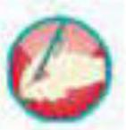
$$
\text { 1) } \left.\left.\sin (\operatorname{arcctg} a)=\frac{1}{\sqrt{1+a^{2}}} ; 2\right) \sin (\operatorname{arctg} a)=\frac{a}{\sqrt{1+a^{2}}} ; 3\right) \cos (\operatorname{arcctg} a)=\frac{a}{\sqrt{1+a^{2}}} \text {. }
$$

Шыккан формулалар 11-кестеде берілген:
11-кесте

\begin{tabular}{|l|l|l|l|l|}
\hline ɑ & $\arcsin a$ & $\arccos a$ & arctg $a$ & $\operatorname{arcctg} a$ \\
\hline 1 & 2 & 3 & 4 & 5 \\
\hline $\sin \alpha$ & $a,|a| \mathrm{m}_{1}$ & $\sqrt{1-a^{2}}$ & $\frac{a}{\sqrt{1+a^{2}}}$ & $\frac{1}{\sqrt{1+a^{2}}}$ \\
\hline $\cos \alpha$ & $\sqrt{1-a^{2}}$ & a. $|a| \mathrm{m}_{1}$ & $\frac{1}{\sqrt{1+a^{2}}}$ & $\frac{a}{\sqrt{1+a^{2}}}$ \\
\hline
\end{tabular}

Жатеасы

\begin{tabular}{|l|l|l|l|l|}
\hline 1 & 2 & 3 & 4 & 5 \\
\hline $\operatorname{tg} \alpha$ & $\frac{a}{\sqrt{1-a^{2}}}$ & $\frac{\sqrt{1-a^{2}}}{a}$ & $а$ & $\frac{1}{a}$ \\
\hline etg $\alpha$ & $\frac{\sqrt{1-a^{2}}}{a}$ & $\frac{a}{\sqrt{1-a^{2}}}$ & $\frac{1}{a}$ & $a$ \\
\hline
\end{tabular}

Шыкқан формулаларды колданып ернектерді түртенцруте мысалдар карастырайык.

МЫСАЛ
1. $\sin (2 \arcsin a)$ ернегін түрлендірейік.

Шешуі . Синустын $\sin 2 \mathrm{a}=2 \sin \mathrm{G} \cos \mathrm{G}$ косбурышынын формуласын және $\mathrm{G}=\arcsin a$ алмастыруын колланамыз:
$\sin (2 \arcsin a)=2 \sin (\arcsin a) \cos (\arcsin a)$.
Тендіктін он жак белігіне 11-кестедегі берілгендерді кодланып $2 a \sqrt{1-a^{2}}$ ернегін аламыз.

Демек. $\sin (2 \arcsin a)=2 a \sqrt{1-a^{2}}$.
Жауабы : $2 a \sqrt{1-a^{2}}$.

МЫСАЛ
2. $\sin \left(\operatorname{arctg} \frac{2}{7}\right)$ орнегініи мэнін аныктайык.

Шешуи . 1-macit . Арктангенстен сннусты ату формуласын кодланамыя:
$\sin (\operatorname{arctg} a)=\frac{a}{\sqrt{1+a^{2}}}$ және $a=\frac{2}{7}$ коямыз. Нотижестие $\sin \left(\operatorname{arctg} \frac{2}{7}\right)=\frac{\frac{2}{7}}{\sqrt{1+\left(\frac{2}{7}\right)^{2}}}= =\frac{2}{\sqrt{53}}$ аламыз.

2-macin . Karetrepi 2 және 7, сұйір бұрышы $\mathrm{a}=\operatorname{arctg} \frac{2}{7}$ берілген $A B C$ тікбурышты үшбұрышын қарастырамыз. Онда $A B=\sqrt{53}$. Демек. $\sin \left(\operatorname{arctg} \frac{2}{7}\right)=\sin \alpha=\frac{B C}{A B}=\frac{2}{\sqrt{53}}$.

\section*{ТУСІНДІРІҢДЕР}

Теменде орындалган түрлендірулерді түсіндіріндер:
1) $\cos (2 \arccos a)=2 \cos ^{2}(\arccos a)-1=2 a^{2}-1$;
2) $\operatorname{tg}(2 \operatorname{arctg} a)=\frac{2 \operatorname{tg}(\operatorname{arctg} a)}{1-\operatorname{tg}^{2}(\operatorname{arctg} a)}=\frac{2 a}{1-a^{2}}$.
1. Кұрамында арксннус, аркжосннус, арктангене немесе арккотангенсі бар ернектер комегімен тригонометриялык түрлендірулер жасаганда неге алгебралык ернек шыталы?
2. 1) $\operatorname{tg}(\operatorname{arcctg} a)$; 2) $\operatorname{ctg}(\arccos a)$; 3) $\operatorname{tg}(\arccos a)$; 4) $\cos (\operatorname{arcctg} a)$ epherincteri a саны кандай мэнді кабылдайды?

\section*{Жаттығулар}

\section*{A}
17.1. Өрнектін мәнін табындар:
1) $\sin (\arcsin 0,2)$;
2) $\sin (\arcsin (-0,3))$;
3) $\sin \left(-\arcsin \frac{\sqrt{5}}{4}\right)$ :
4) $\cos (\arccos 0,6) ;$
5) $\cos (\arccos (-0,4)) ;$
6) $\cos \left(-\arccos \frac{\sqrt{3}}{2}\right)$.
17.2. В.М.Брадис кестесін колданып ернектін мәнін табындар:
1) $\arcsin 0,2354$;
2) $\arcsin 0,7386$;
$3) \arccos 0,8351$;
4) $\arccos 0,3259$.
17.3. Есептендер:
1) $\arcsin \left(-\frac{\sqrt{2}}{2}\right)-2 \operatorname{arctg}\left(-\frac{\sqrt{3}}{3}\right)+3 \arccos \left(-\frac{\sqrt{3}}{2}\right)-4 \operatorname{arcctg}(-1)$;
2) $\arccos \left(-\frac{\sqrt{3}}{2}\right)+4 \operatorname{arctg}(-\sqrt{3})-\arcsin \left(-\frac{1}{2}\right)+\operatorname{arcctg} 1$;
3) $2 \arcsin \frac{\sqrt{3}}{2}-2 \operatorname{arctg}(-1)+\arccos \left(-\frac{\sqrt{2}}{2}\right)-\operatorname{arcctg}\left(-\frac{\sqrt{3}}{3}\right)$;
4) $2 \arccos \left(-\frac{\sqrt{3}}{2}\right)+2 \operatorname{arctg}(-\sqrt{3})-\arccos (-1)-2 \operatorname{arctg} \sqrt{3}$.
17.4. Темендегі ернектін мағынасы бар ма:
1) $\sin (\arcsin 2) ;$
2) $\sin (\arcsin (-1,3))$;
3) $\sin \left(-\arcsin \frac{\sqrt{15}}{4}\right)$;
4) $\cos (\arccos 1,6):$
5) $\cos (\arccos (\sqrt{3}-2))$;
6) $\cos (-\arccos 7) ?$

Есептендер (17.5-17.9):
17.5.
1) $\sin \left(\arccos \frac{1}{3}\right)$;
2) $\sin \left(\arccos \frac{2}{7}\right)$;
3) $\sin \left(2 \arccos \frac{1}{4}\right)$;
4) $\sin \left(2 \arcsin \frac{2}{3}\right)$.
17.6. 1) $\cos \left(\arccos \frac{1}{5}\right)$;
2) $\cos \left(\arccos \left(-\frac{1}{6}\right)\right)$;
3) $\cos \left(2 \arccos \frac{1}{4}\right)$ :
4) $\sin \left(2 \arccos \frac{1}{3}\right)$.
17.7. 1) $\operatorname{tg}\left(\operatorname{arcctg} \frac{2}{3}\right)$;
2) $\operatorname{ctg}\left(\operatorname{arctg}\left(-\frac{2}{3}\right)\right)$;
3) $\cos \left(\operatorname{arctg} \frac{1}{6}\right)$;
4) $\sin \left(\operatorname{arcctg}\left(-\frac{2}{3}\right)\right)$.
17.8. 1) $\operatorname{tg}\left(\arccos \frac{2}{7}\right)$;
2) $\operatorname{ctg}\left(\arcsin \frac{2}{5}\right)$;
3) $\operatorname{tg}\left(\arcsin \frac{1}{4}\right)$;
4) $\operatorname{tg}\left(\arccos \left(-\frac{2}{3}\right)\right)$.
17.9. 1) $\arcsin \left(\sin 20^{\circ}\right)$;
2) $\arcsin \left(\sin \left(-40^{\circ}\right)\right)$;
3) $\arccos \left(\cos 10^{\circ}\right):$
4) $\arccos \left(\cos \left(-70^{\circ}\right)\right)$.
17.10. $\arcsin x$ келесі мәнді кабылдай ма:
1) 0 ;
2) 1 ;
3) $-\frac{\pi}{4}$;
4) $-\frac{3 \pi}{4}$;
5) 1,7 ;
6) $-1,4$ ?
17.11. $\arccos x$ келесі мәнді кабылдай ма:
1) -1 ;
2) 0 ;
3) $-\frac{2 \pi}{5}$;
4) $-\frac{\pi}{4}$;
5) 1,9 ;
6) 1,3 ?
17.12. $\operatorname{arctg} x$ келесі мәнді кабылдай ма:
1) 0 ;
2) 1,4 ;
3) $-\frac{\pi}{3}$;
4) $-\frac{\pi}{2}$;
5) $-1,7$;
6) -12 ?
17.13. $\operatorname{arcctg} x$ келесі мәнді кабылдай ма:
1) 0 ;
2) 1,4 ;
3) $-\frac{\pi}{3}$ :
4) $-\frac{\pi}{2}$ :
5) $-1,7$;
6) 1,2 ?

\section*{B}
17.14. а параметрінін кандай мәндерінде:
1) $\arcsin (2-a) ;$
2) $\arcsin (2 a-3) ;$
3) $\arcsin \left(a^{2}-3\right)$;
4) $\arccos (2 a+4) ;$
5) $\arccos (2 a-7)$;
6) $\arccos \left(2 a^{2}-5\right)$ өрнегінін мағынасы болады?

Өрнектін мәнін табындар (17.15-17.17):
17.15.
1) $\arcsin (\sin 1,2)$;
2) $\arcsin (\sin 2) ;$
3) $\arcsin (\sin 6)$;
4) $\arcsin (\sin 20)$.
17.16.
1) $\arccos (\cos 1.1)$;
2) $\arccos (\cos 2) ;$
3) $\arccos (\cos 6) ;$
4) $\arccos (\cos 20)$.
17.17.
1) $\operatorname{arctg}(\operatorname{tg} 1,2)$;
2) $\operatorname{arctg}(\operatorname{tg} 5)$;
$3) \operatorname{arcctg}(\operatorname{ctg} 6)$;
$4) \operatorname{arcctg}(\operatorname{ctg} 10)$.

\section*{C}
17.18. Өрнектін мәнін есептендер:
1) $\sin \left(\arcsin \frac{1}{3}+\arccos \frac{1}{5}\right)$;
2) $\cos \left(\arcsin \frac{1}{4}-\arccos \frac{1}{5}\right)$;
3) $\operatorname{tg}(\operatorname{arctg} 2 \quad+\operatorname{arctg} 4) ;$
4) $\operatorname{ctg}(\operatorname{arcctg} 4+\operatorname{arcctg} 5)$.
17.19. Есептендер:
1) $\operatorname{tg}\left(2 \arccos \frac{12}{13}\right)$;
2) $\operatorname{tg}\left(\arcsin \frac{4}{5}+\frac{3 \pi}{2}\right)$;
3) $\sin \left(2,5 \pi+\operatorname{arctg} \frac{3}{4}\right)$.
17.20. Төменде берілген өрнектін аныкталу облысын табындар:
1) $\arccos (x+2)-\arcsin 2 x$;
2) $\arccos (2 x-1)-\arcsin (3 x+1) ;$
3) $\operatorname{arctg}(x+2)-\arcsin 3 x$;
4) $\operatorname{arcctg}(2 x-1)-\operatorname{arctg}(-3 x)$.
17.21. Өрнектін мәнін табындар:
1) $\sin \left(\operatorname{arctg} \frac{1}{3}+\operatorname{arctg} \frac{1}{4}\right)$;
2) $\cos \left(\operatorname{arctg} 2-\arccos \frac{1}{5}\right)$;
3) $\operatorname{tg}(\arcsin 0,2+\operatorname{arctg} 4) ;$
4) $\operatorname{ctg}(\arccos 0,4 \quad-\operatorname{arcctg} 5)$.

\section*{КАИТАЛАУ}
17.22. Функщинын графигін салындар:
1) $y=2 \sin \frac{x}{2}$;
2) $y=2 \cos \left(\frac{x}{2}-\pi\right)$;
3) $y=\operatorname{tg} \frac{x}{2}$;
4) $y=\operatorname{ctg} \frac{3 x}{2}$.
17.23. Бір координаталык жазыктыкка функциялардын графиктерін салынцар және графиктердін киылысу нүктелерінін абсциссаларын табындар:
1) $y=2 \sin \frac{5 x}{2}$ және $y=3 x$;
2) $y=\cos \frac{x}{2}$ және $y=2-3 x$;
3) $y=\operatorname{tg} \frac{x}{2}$ және $y=x+2$;
4) $y=\operatorname{ctg}(x-2)$ және $y=4-x^{2}$.
17.24. Тендеуді шешіндер:
1) $x^{4}+2 x^{2}-8=0$;
2) $x^{4}-2 x^{2}-8=0$;
3) $x^{4}+6 x^{2}-16=0$;
4) $x^{4}-7 x^{2}-18=0$.
17.25. Жана айнымалы енгізу тәсілін колданып тендеудін түбірлерін табындар:
1) $\left(x^{2}-2 x\right)^{2}-2\left(x^{2}-2 x\right)-8=0$;
2) $\left(x^{2}+x\right)^{2}-3\left(x^{2}+x\right)-10=0$;
3) $x^{2}+6|x|-16=0$;
4) $x+7 \sqrt{x}-18=0$.

\section*{ЖАНА БІЛІМДІ МЕҢГЕРУГЕ АРНАЛҒАН ТІРЕК ҰҒЫМДАР}

Тендеу, тендеудін туртері, тендеудін түбірі, тригонаметрия формухалары, тригонометриятых функциялар, кері тригонометрыятык функциялар, тригонометриялык функциялардын каснеттері, кері тригонометриятык функция.тардын қаснеттері.

\section*{§18. КҰРАМЫНДА КЕРІ ТРИГОНОМЕТРИЯЛЫК ФУНКЦИЯЛАРЫ БАР КАРАПАЙЫМ ТЕНДЕУЛЕР}

Құрамында кері тригонометриялық функциялары бар қарапайым тендеулерді шығаруды үйренесіндер.

Кұрамында кері тригонометриятык функциялары бар карапайым тендеулерді шешу үшін кері тригонометриялык функшялардын каснеттерін еске түсірейік.

\section*{ТУЙІНДІ ұғыМДАР}

Бірсарындылык. шектеулік, мәндер жиыны, тендеу, теңсіздік

12-xecme

\begin{table}
\captionsetup{labelformat=empty}
\caption{ΕCKE TYCIPIHZEP}
\begin{tabular}{|l|l|l|l|}
\hline Функция & Аныкталган және бірсарындылык аралыктары & Herisri тепе-тендік & Мәнлер жныны \\
\hline $y=\arcsin x$ & & & \\
\hline $y=\arccos x$ & & & \\
\hline $y=\operatorname{arctg} x$ & & & \\
\hline $y=\operatorname{arcctg} x$ & & & \\
\hline
\end{tabular}
\end{table}

\section*{ЕСКЕ ТУСІРІНДЕР \\ х-тін кандай мәндерінде тендік орындалады:}
1) $\arcsin x+\arccos x=\frac{\pi}{2}$;
2) $\operatorname{arctg} x+\operatorname{arcctg} x=\frac{\pi}{2}$ ?

Құрамында кері тригонометриялык функциялары бар карапайым тендеулерді шешу барысында бірсарындылык пен шектеулік каспеттері өте манызды.

Кұрамында кері тригонометрнялык функциялары бар карапайым тендеулерді шешуді карастырайык.

\section*{I. Теноеухін он жак бөлігіное ждне сол жак бөлігінде аттас кері тригонометриялык функциялар берілген .}

Екі жак бөлігінде аттас кері тригонометриялык функциялар берілетін тендеулерді шешу барысында басты назар бірсарындылык каспетіне аударылады. $y=\arcsin t$ және $y=\operatorname{arctg} t$ функциялары өзцерінін аныкталу облысында бірсарынды өсетіні, $y=\arccos t$ және $y=\operatorname{arcctg} t$ функциялары бірсарынды кемитіні белгілі.

Курамында кері тригонометрнялык функциялары бар карапайым тендеулерді шешу жолы келтірілген:
1) $\arcsin f(x)=\arcsin g(x) \Leftrightarrow\left\{\begin{array}{l}f(x)=g(x), \\ \mid f(x) \leqslant 1 ;\end{array} \Leftrightarrow\left\{\begin{array}{l}f(x)=g(x), \\ \mid g(x) \leqslant 1 ;\end{array}\right.\right.$
2) $\arccos f(x)=\arccos g(x) \Leftrightarrow\left\{\begin{array}{l}f(x)=g(x), \\ |f(x)| \leqslant 1 ;\end{array} \Leftrightarrow\left\{\begin{array}{l}f(x)=g(x), \\ |g(x)| \leqslant 1 ;\end{array}\right.\right.$
3) $\operatorname{arctg} f(x)=\operatorname{arctg} g(x) \Leftrightarrow f(x)=g(x)$;
4) $\operatorname{arcctg} f(x)=\operatorname{arcctg} g(x) \Leftrightarrow f(x)=g(x)$.

\section*{ЕСТЕ САҚТАНДАР}

1 жәие 2 тендеуперді шығару барысыида жүйені тандау тенсіздікке байланысты.

МЫСАЛ 1. $\arcsin \left(x^{2}-2 x-7\right)=\arcsin (x-3)$ тендеуін шешіндер. Шешуі. Берілтен тендеу келесі жүйеге мондее болады:
$\left\{\begin{array}{l}x^{2}-2 x-7=x-3, \\ |x-3| \leqslant 1\end{array}\right.$ немесе $\left\{\begin{array}{l}x^{2}-3 x-4=0, \\ -1<x-3 \leqslant 1\end{array}\right.$ немесе $\left\{\begin{array}{l}x=4, \\ x=-1, \\ 2<x<4 .\end{array}\right.$ Бұдан $x=4$. Тексеру жүргізу аркылы $x=4$ мәні тендеудін түбірі болатынына кез жеткіземіз.

Жауабы: 4.

\section*{ТУСІНДІРІҢДЕР}
$\arccos \left(x^{2}-1\right)=\arccos \left(x-x^{2}\right)$ тендеуінін түбірлері -0.5 және 1 сандары болатынын керсетіилер.
II. Тендеудін он жақ бөлігінде және сол жақ бөлігінде атаулары артүрлі кері тригонометриялық функциялар берілген.

Он жак белігінде және сол жак белігінде атаулары әртүрлі кері тригонометриялык функциялар берілген тендеулерді шығару барысында белгілі тригонометриялык тепе-тендіктер колданылады. Ондай тендеулерді шығару үшін бірден тендеу-салдарға көшіп, одан кейін тексеру жүргізуге болады.
$\arcsin f(x)=\arccos g(x)$ тендеуін шығару керек болсын.
$x_{0}$ саны осы тендеудін шешімі болсын. Онда $\arcsin f\left(x_{0}\right)=a$ және $\arccos g\left(x_{0}\right)=a$ белгілеулерін енгізейік. Онда $\sin a=f\left(x_{0}\right)$ және $\cos a=g\left(x_{0}\right)$, будан $f^{2}\left(x_{0}\right)+g^{2}\left(x_{0}\right)=1$.

Демек, $\arcsin f(x)=\arccos g(x)$ және $f^{2}(x)+g^{2}(x)=1$.

\section*{ТУСІНДІРІНДЕР}
$\operatorname{tg} \alpha \operatorname{ctg} \alpha=1, \sin ^{2} \alpha=\frac{1}{\operatorname{ctg}^{2} \alpha+1}, \cos ^{2} \alpha=\frac{1}{\operatorname{tg}^{2} \alpha+1}, \sin ^{2} \alpha=\frac{\operatorname{tg}^{2} \alpha}{\operatorname{tg}^{2} \alpha+1}, \cos ^{2} \alpha=\frac{\operatorname{ctg}^{2} \alpha}{\operatorname{ctg}^{2} \alpha+1}$ формулаларын колданып.
$\operatorname{arctg} f^{\prime}(x)=\operatorname{arcctg} g(x) \Rightarrow f(x) g(x)=1$.
$\arcsin f(x)=\operatorname{arcetg} g(x)=f^{2}(x)=\frac{1}{g^{2}(x)+1}$,
$\operatorname{arctg} f(x)=\arccos g(x) \Rightarrow \frac{1}{f^{2}(x)+1}=g^{2}(x)$.
$\arcsin f(x)=\operatorname{arctg} g(x)=f^{2}(x)=\frac{g^{2}(x)}{g^{2}(x)+1}$,
$\arccos f(x)=\operatorname{arcctg} g(x) \Rightarrow f^{2}(x)=\frac{\xi^{2}(x)}{\xi^{2}(x)+1}$ тенгеу-салдардын шыгатынын керсетіндер.

\section*{ЕСТЕ САҚТАҢДАР}
$f\left(x_{0}\right) \mid 0$ және $g\left(x_{0}\right) \mid 0$ жагдайында гана $x_{0}$ саны $\arcsin f(x)=\arccos g(x)$, arctg $f(x)= =\operatorname{arcctg} g(x), \arcsin f(x)=\operatorname{arcctg} g(x), \operatorname{arctg} f(x)=\arccos g(x)$ тендеулерінін түо̆ірі болалы. Ал кері жағдайда тендеудін шешімі болмайлы.

\section*{МЫСАЛ}
2. $\arcsin (3 x+4)=\arccos (2+x)$ тенлеуін шешейік. IIIeucyi.
Тендеу-салдарды колданып $(3 x+4)^{2}+(2+x)^{2}=1$ немесе $9 x^{2}+24 x+16+4+4 x+x^{2}-1=0$, немесе $10 x^{2}+28 x+19=0$ тендеуін аламыз. Сонғы теняеудій түбіртері $x_{1}=\frac{-14-\sqrt{6}}{10}$ және $x_{2}=\frac{-14+\sqrt{6}}{10}$.

Енді $\left\{\left.\begin{array}{l}3 x+4 \\ 2+x\end{array} \right\rvert\, \leqslant 1\right.$, екенін ескереміз. Яғни $x_{1}$ және $x_{2}$ мэндерініи $\left[-1 \frac{2}{3} ;-1\right]$ кесіндісіне тністілін тексереміз: $x_{1}=\frac{-14-\sqrt{6}}{10}=-1.4-0.1 \sqrt{6}=-1.4-0.1: 2.4=-1.64$; бұлан $-1,64 \in\left[-1 \frac{2}{3} ;-1\right]: x_{2}=\frac{-14+\sqrt{6}}{10}=-1,4+0,1 \sqrt{6}=-1,4+0,1 \cdot 2,4=-1,16 ;$ будан $-1,16 \in\left[-1 \frac{2}{3} ;-1\right]$.

Демек, екі түбір де $(3 x+4)^{2}+(2+x)^{2}=1$ тендеу-салларыныи губірі болады. Берілген тендеу екінші дорежее шытарыдандыктан богде тубіртер пайда болуы мүмкін. Сондықтан берілген тендеу үшін тексеру жасаймыз. Аныктама бойынша $\arcsin (3 x+4)$ ернегінін мәндер жныны $\left[-\frac{\pi}{2} ; \frac{\pi}{2}\right]$, ал $\arccos (2+x)$ ернегінін мондер жиыны [0; т].

Сондыктан арксинус арккосинуска тен болеа. онда олар $\left[0 ; \frac{\pi}{2}\right]$ аралыгымдагы мәндерді кабылдайды Сонда $\arcsin \left(3 x_{1}+4\right)=\arcsin \frac{-2-3 \sqrt{6}}{10} \rightleftarrows\left[0 ; \frac{\pi}{2}\right], \arccos \left(2+x_{1}\right)=$
$=\arccos \frac{6-\sqrt{6}}{10} \in\left[0 ; \frac{\pi}{2}\right]$. Демек, $\quad x_{1}=\frac{-14-\sqrt{6}}{10}$ бегде тубір.
$\arcsin \left(3 x_{2}+4\right)=\arcsin \frac{-2+3 \sqrt{6}}{10} \in\left[0 ; \frac{\pi}{2}\right], \arccos \left(2+x_{2}\right)=\arccos \frac{6+\sqrt{6}}{10} \in\left[0 ; \frac{\pi}{2}\right]$.
Демек, $x_{2}=\frac{-14+\sqrt{6}}{10}$ берілген тендеудін тубірі болады.
Жауабы: $\frac{-14+\sqrt{6}}{10}$.
1. Неліктен курамында кері тригонометриялык функциялары бар карапайым тендеулерді шешу барасында айнымалынын мумкін болатын мәндер жнынын ескеру кажет?
2. Тендеуді шешу барысында міндетті турде тексеру жүргізу керек пе?

\section*{Жаттығулар}

\section*{A}

Тендеуді шешіндер (18.1-18.6) :
18.1.
1) $\arcsin 2 x=\frac{\pi}{3}$;
2) $\arcsin 3 x=\frac{\pi}{4}$;
3) $\arcsin 2 x=1$;
4) $\arcsin 2 x=0$.
18.2.
1) $\arccos 2 x=\frac{\pi}{6}$;
2) $\arccos 3 x=\frac{\pi}{3}$;
3) $\arccos 4 x=\frac{\pi}{2}$;
4) $\arccos 2 x=0$.
18.3.
1) $\operatorname{arctg} 4 x=\frac{\pi}{4}$;
2) $\operatorname{arctg} 3 x=-\frac{\pi}{3}$;
3) $\operatorname{arcctg} 2 x=\frac{\pi}{6}$;
4) $\operatorname{arcctg} 3 x=\frac{\pi}{2}$.
18.4. 1) $\arccos (3 x-3,5)=\frac{2 \pi}{3}$;
2) $\arcsin (x-2)=-\frac{\pi}{4}$;
$3) \arccos (4-x)=\frac{\pi}{2}$;
4) $\arcsin (2 x+1)=\frac{\pi}{3}$.
18.5
$1) \operatorname{arctg}(4 x+1)=\frac{7 \pi}{12}$;
2) $\operatorname{arcctg}(4 x+1)=\frac{3 \pi}{4}$;
3) $\operatorname{arcctg}(4-x)=\frac{\pi}{2}$;
4) $\operatorname{arctg}(2 x+1)=-\frac{\pi}{4}$.
18.6.
1) $\operatorname{arctg}(3-4 x)=\frac{\pi}{6}$;
2) $\operatorname{arcctg}(4 x+1)=\frac{5 \pi}{4}$;
3) $\arccos (4-3 x)=\frac{\pi}{3}$;
4) $\arcsin (2 x-1)=-\frac{\pi}{6}$.

\section*{B}

Тендеудін түбірлерін табындар (18.7-18.8) :
18.7. 1) $\arccos \left(3 x^{2}-10 x+2,5\right)=\frac{2 \pi}{3}$; 2) $\arcsin \left(3 x^{2}-5 x+1\right)=\frac{\pi}{2}$;
3) $\arccos \left(3-x^{2}\right)=\pi$;
4) $\arcsin \left(2,5-x^{2}\right)=-\frac{\pi}{6}$.
18.8. 1) $\operatorname{arctg}\left(x^{3}-27 x-\sqrt{3}\right)=-\frac{\pi}{3}$;
2) $\operatorname{arctg}\left(3 x^{2}-12 x-\frac{\sqrt{3}}{3}\right)=-\frac{\pi}{6}$;
3) $\operatorname{arcctg}\left(3 x-x^{2}+1\right)=\frac{\pi}{4}$;
4) $\operatorname{arcctg}\left(x^{3}-8 x^{2}+15 x+1\right)=\frac{\pi}{4}$.
18.9. Тендеуді шешіндер:
1) $18 \operatorname{arctg}{ }^{2} x-3 \pi \operatorname{arctg} x-\pi^{2}=0$;
2) $16 \operatorname{arcctg}{ }^{2} x-16 \pi \operatorname{arcctg} x+3 \pi^{2}=0$;
3) $\operatorname{arctg}\left(x^{2}-9\right)=\operatorname{arctg} 8 x$;
4) $\operatorname{arcctg}\left(x^{2}-x\right)=\operatorname{arcctg}(4 x-6)$.
18.10. Тендеудін түбірлерін табындар:
1) $8 \arccos ^{2} x+2 \pi \arccos x-\pi=0$;
2) $3 \arcsin { }^{2} x+2 \pi \arcsin x-\pi=0$;
3) $18 \arccos { }^{2} x=3 \pi \arccos x+\pi$;
4) $\arcsin { }^{2} x-2 \pi \arcsin x-3 \pi^{2}=0$.

\section*{C}
18.11. Тендеуді графнктік тәсілмен шешіндер:
1) $\operatorname{arctg} x=\frac{\pi}{2}-\frac{\pi}{4} x$;
2) $\operatorname{arcctg} x=\frac{\pi}{4} x$;
3) $\operatorname{arcctg} x=\frac{\pi}{2}-x$;
4) $\operatorname{arctg} x=-\frac{\pi}{2}-\frac{\pi}{4} x$.

Тендеуді шешіндер (18.12-18.13) :
18.12.
1) $\arccos x=\operatorname{arctg} x$;
2) $\operatorname{arcctg} x=\operatorname{arctg} x$;
3) $\arccos x=\arcsin x$;
4) $\operatorname{arcctg} x=\arcsin x$.
18.13. 1) $\arccos \frac{x \sqrt{3}}{3}=\frac{\pi}{2}-\arcsin x$;
2) $\arcsin 2 x-3 \arcsin x=0$.
18.14. Тендеудін түбірлерін табындар:
1) $9 \arccos 22 x-3 \pi \cdot \arccos 2 x-2 \pi^{2}=0 ;$
2) $2 \arcsin 2 x=\arccos 7 x$;
3) $2 \arccos x-\arccos \left(2 x^{2}-1\right)=0$;
4) $\arcsin \frac{2 x}{x^{2}+1}-2 \operatorname{arctg} x=0$.
18.15. Erep $x \in(-1 ; 1)$ болса, онда $\arcsin x-\operatorname{arctg} \frac{x}{\sqrt{1-x^{2}}}=0$ тендігін долелденд ер.
18.16. $2 \arccos \sqrt{\frac{x+1}{2}}=\arccos x$ тендігін дәлелдендер.
18.17. Тендеуді шешіндер:
1) $4 \operatorname{arctg} x-6 \operatorname{arcctg} x=\pi$;
2) $\operatorname{arcctg} 3 x=\operatorname{arctg} 3 x-\frac{\pi}{4}$.

\section*{KARTAMAY}
18.18. Erep:
1) $\sin \alpha=0,4$ және $90^{\circ}<\alpha<180^{\circ}$ болса, онда $\sin 2 \alpha, \cos 2 \alpha$;
2) $\cos \alpha=-0,6$ және $180^{\circ}<\alpha<270^{\circ}$ болса, онда $\operatorname{ctg} \alpha$, $\operatorname{tg} 2 \alpha$;
3) tg $\alpha=\sqrt{8}$ және $180^{\circ}<\alpha<270^{\circ}$ болса, онда $\cos \alpha, \sin \alpha$ мәндерін табындар.
18.19. Erep:
1) $\cos \alpha=\frac{7}{9}$ және $0^{\circ}<\alpha<90^{\circ}$ болса, онда $\sin \frac{\alpha}{2}, \cos \frac{\alpha}{2}, \sin \alpha$;
2) $\sin \alpha=\frac{\sqrt{2}}{3}$ және $90^{\circ}<\alpha<180^{\circ}$ болса, онда $\cos \alpha$, tg $\alpha$ мәндерін табындар.
18.20. Erep: $\cos \alpha=\frac{\sqrt{15}}{4}, \sin \beta=\frac{1}{8}$ және $\alpha, \beta$ мәндері бірінші ширекке тністі болса, онда $\cos (\alpha+\beta), \sin (\alpha-\beta)$ мәндерін табындар.

\section*{ӨЗІНДІ ТЕКСЕР!}
1. $2 \arcsin (-0,5)-2 \arccos 2 \pi+\operatorname{arctg} \sqrt{3}$ ернегінін мәні:
A) $-\frac{3 \pi}{4}$ :
B) $2 \pi$;
C) $\pi$;
D) $-2 \pi$
2. $\arccos \left(-\frac{\sqrt{3}}{2}\right)-3 \operatorname{arcctg}\left(-\frac{\sqrt{3}}{3}\right)-\arcsin \left(-\frac{1}{2}\right)$ өрнегінін мәні:
A) $\frac{\pi}{2}$ :
B) $\frac{2 \pi}{3}$ :
C) $-0.5 \pi$
D) $-\pi$.
3. $\cos \left(\operatorname{arctg}\left(\frac{\sqrt{3}}{3}\right)\right)$ ернегінін мәні:
A) $\frac{\pi}{3}$;
B) 0,5 :
C) $-0,5$;
D) $\frac{\sqrt{3}}{2}$.
4. $x$-тін кандаї мәндерінде $3 x-3 \arccos (2-x)$ ернегінін мағынасы болады:
А) $[-2 ; 5]$;
В) $[-1 ; 1]$;
C) $[1 ; 3]$;
D) $[-2 ; 2]$ ?
5. $\cos \left(2 \arcsin \frac{1}{2}\right)$ ернегінін мәні:
A) $\frac{\sqrt{3}}{2}$ :
В) $-0,5$;
C) 0.5 ;
D) $\frac{\pi}{3}$.
6. 5-3arcctg $x$ ернегінін мәндер жпыны:
А) $[5-3 \pi ; 5+3 \pi]$;
В) $(5-3 \pi ; 5)$;
C) $[3 ; 3+3 \pi]$;
D) $(5-3 \pi ; 5]$.
7. $\arcsin \left(x^{2}-3\right)=\frac{\pi}{2}$ тендеуінін түбірлері:
A) 2 ;
В) -2 ;
C) $-2: 2$;
D) $\pi$.
8. $2 \operatorname{arcctg}(-\operatorname{ctg} 5)$ ернегінін мәні:
A) $2 \pi-5$;
B) $10-\pi$;
C) $2(2 \pi-5)$;
D) -5 .
9. $y=3 \arcsin \frac{1}{x-2}$ функциясыныи аныкталу облысы болатын жнын:
А) $(-\infty ; 1] \cup[3 ;+\infty)$;
B) $[1 ; 3]$;
C) $(-\infty ; 0] \cup[3 ;+\infty)$;
D) $[3 ;+\infty)$.
10. $\arccos (\cos 4)$ ернегінін мәні:
A) 4;
B) $2 \pi+4$ :
C) $2 \pi-4$;
D) $4-\pi$.

\section*{ЖАНА БІЛІМДІ МЕҢГЕРУГЕ АРНАЛҒАН ТІРЕК ҰҒЫМДАР}

Тендеу, тендеудін түрлері, тендеудін түбірі, тригонометрия формугалары, тригонометриятык функциялар, кері тригонометрия.тык функция.лар, тригонометрия.тық функция.зардын каснеттері, кері тригонанетриялык функияятарбын касиеттері.

\section*{4}

\section*{ТРИГОНОМЕТРИЯЛЫҚ ТЕҢДЕУЛЕР ЖӘНЕ ТЕҢСІЗДІКТЕР}

\section*{§19. КАРАПАЙЫМ ТРИГОНОМЕТРИЯЛЫК ТЕНДЕУЛЕР}

Қарапайым тригонометриялык тендеулерді шешуді үйренесіндер.

Аныктама . Беггісізі (айнымалысы ) тригонометриятык функциянын аргументі тррінде берілген тендеубі пригонометриялық тендеу ден атайды .

\section*{ТУЙІНДІ ұғымдАР}

Тригонометриялык тендеу

\section*{МЫСАЛ}
1. $2 \sin ^{2} 3 x=\sin ^{3} x$ тендеуі тригонометриялык тендеу болады, $2 \sin 3 x=3 x$ тендеуі тригонометриялык тендеу болмайды. Бұл тендеу графиктік тәсілмен шыгарылады.
$2(3 x-1) \sin 3 x=3 x-1$ тендеуі тригонометриятык тендеу болмайлы. бірак бұл тендеуді тригонометриялык тентеуте келтіруге болады. Расында да, атебралык түрлендірулер жасап, берілген тендеуден $(3 x-1)(2 \sin 3 x-1)=0$ тендеуін аламыз. Сонғы тендеу біреуі тригонометриятык тендеу болып табылатын екі тендеуді шешуте экелінді.

Қарапайым тригонометрнялык тендеулер:
$$
\begin{gathered}
\cos x=a, \sin x=a, \operatorname{tg} x=a, \operatorname{ctg} x=a . \\
\cos x=a \text { тригонометриялык тендеуі }
\end{gathered}
$$
$\cos x=a$ тендеуін карастырайык.
Егер $|a|>1$ болса, онда $\cos x=a$ тендеуінін шешімі болмайды. Себебі $y=\cos x$ функшясыныи мәндер жныны [-1; 1] кесіндісі.

Егер $|a| \mathrm{m} 1$ болса, онда $\cos x=a$ тендеуінін шешімі болады. Арккосинустын аныктамасы бойынша берілген тендеудін [ 0 ; П] кесіндісінде бір ғана шешімі бар және ол шешім $\arccos a$ (19.1.1-cypet).

\begin{figure}
\includegraphics[alt={},max width=\textwidth]{https://cdn.mathpix.com/cropped/b3f159e3-70ef-4ad9-b9e9-0ac5b230efd7-148.jpg?height=355&width=1463&top_left_y=2035&top_left_x=354}
\captionsetup{labelformat=empty}
\caption{19.1-cyper}
\end{figure}

Косинус функциясы жди функшия болғандыктан, [ $-\pi, 0$ ] кесіндісінде $\cos x=a$ тендеуінін -arccos $a$-га тен бір ғана шешімі бар (19.1.2-сурет).

Демек, $[-\pi ;$ т] кесіндісінде $\cos x=a$ тендеуінін екі шешмі бар: $\arccos a$ мен $-\arccos a$ және ол шешімдер $a=1$ болғанда бірдей.

\begin{figure}
\includegraphics[alt={},max width=\textwidth]{https://cdn.mathpix.com/cropped/b3f159e3-70ef-4ad9-b9e9-0ac5b230efd7-149.jpg?height=464&width=1438&top_left_y=233&top_left_x=260}
\captionsetup{labelformat=empty}
\caption{19.2-cypet}
\end{figure}
$y=\cos x$ функциясы перподты болғандыктан, тендеудін калған шешімдері табылған шешімдерден $2 \pi n$-ге ( $n$ - бүтін сан) ерекшеленеді (19.2-сурет).
$\cos x=a$ тендеуінін түбірлерін табудын жалпы формуласы:
$x= \pm \arccos a+2 \pi h$, мундағы $n$ - бүтін сан және $|a| \mathrm{m} 1$.
$a=1$ болганда, $\arccos a$ мен $-\arccos a$ сандары бірдей. Сондыктан $\cos x=1$ тендеуінін шешімін табу үшін $x=2 \pi n$ ( $n$ - бүтін сан немесе $n \in Z)$ формуласы кодданылады.
$\cos x=-1$ тендеуінін шешімдер жнынын ( $\pi+2 \pi n, n \in Z$ ) түрінде жазады. $\cos x=0$ тендеуінін шешімдер жиыны: $\left\{\frac{\pi}{2}+\pi n, n \in Z\right\}$.

\begin{table}
\captionsetup{labelformat=empty}
\caption{13-кесте}
\begin{tabular}{|l|l|}
\hline Тендеу & Шешімаі табу формуласы \\
\hline $\cos x=a_{+}|a|>1$ & $\varnothing$ \\
\hline $\cos x=a,|a| \mathrm{m}_{1}$ & $x= \pm \arccos a+2 p_{n}, n \in Z$ \\
\hline $\cos x=1$ & $x=2 \mathrm{p} n, n \in Z$ \\
\hline $\cos x=-1$ & $x=\mathrm{p}+2 \mathrm{p} n, n \in Z$ \\
\hline $\cos x=0$ & $x=\frac{\pi}{2}+\mathrm{p}_{n}, n \in Z$ \\
\hline
\end{tabular}
\end{table}

\section*{МЫСАЛ \\ 1. $\cos x=\frac{\sqrt{2}}{2}$ тендеуінін шешімін табайык.}

Шешуі . Мұнда $a=\frac{\sqrt{2}}{2}$, якни $|a| \mathrm{m}_{1}$ болгандыктан, 13 -кесте бойынша $x= \pm \arccos \frac{\sqrt{2}}{2}+2 \pi t, n \in Z$. Енді $\arccos \frac{\sqrt{2}}{2}=\frac{\pi}{4}$ болатынын ескеріп, $x= \pm \frac{\pi}{4}+2 \pi n$. $n \in Z$, аламыз.
$$
\text { Жауабы }: \pm \frac{\pi}{4}+2 \pi_{2}, n \in Z .
$$
МЫСАЛ
2. $\cos \left(2 x-\frac{\pi}{5}\right)=-\frac{\sqrt{3}}{2}$ тенчеуінін шешімін табайык.

Шешуi . Мұнда $a=-\frac{\sqrt{3}}{2}$, ягии $|a| \mathrm{m}_{1}$ болгандыктаи 13-кесте бойынша $2 x-\frac{\pi}{5}= = \pm \arccos \left(-\frac{\sqrt{3}}{2}\right)+2 \Pi_{r}, n \in Z$. Енді $\arccos \left(-\frac{\sqrt{3}}{2}\right)=\Pi-\arccos \frac{\sqrt{3}}{2}=\Pi-\frac{\pi}{6}=\frac{5 \pi}{6}$ екенін

ескерсек, $2 x-\frac{\pi}{5}= \pm \frac{5 \pi}{6}+2 \Pi_{2}, n \in Z$ аламыз. Сонгы тендеуде $-\frac{\pi}{5}$ косыпышын тендеудін екінші жагына шытарып, екі белігін де 2 санына белеміз, сонда $2 x= \pm \frac{5 \pi}{6}+\frac{\pi}{5}+2 \pi_{n}, n \in Z, x= \pm \frac{5 \pi}{12}+\frac{\pi}{10}+\pi_{n}, n \in Z$ шыгады.
$$
\text { Жауабы : } \pm \frac{5 \pi}{12}+\frac{\pi}{10}+\Pi_{n}, n \in Z .
$$

\section*{$\sin \delta=a$ тригонометриялык тендеуі}

Erep $|a|>1$ болса, онда $\sin x=a$ тендеуінін шешімі болмайды. Себебі $y=\sin x$ функциясыныи мәндер жныны $[-1 ; 1]$ кесіндісі.

Егер $|a| \mathrm{m} 1$ болса, онда $\sin x=a$ тендеуінін шешімі болады. Арксинустын аныктамасы бойынша $\left[-\frac{\pi}{2} ; \frac{\pi}{2}\right]$ кесіндісінде берілген тендеудін бір ғана шешімі бар және ол шешім arcsin $a$-ға тен (19.3.1-сурет).
$\left[\frac{\pi}{2} ; \frac{3 \pi}{2}\right]$ аралығында $y=\sin x$ функциясы кемиді және -1-ден 1-ге дейінгі, 1-ді коса алғандағы, мәндерді кабыдлайды. Сондыктан түбір туралы теорема бойынша осы аралыкта $\sin x=a$ тендеуінін бір ғана түбірі бар және ол түбір $\pi-\arcsin a$-ға тен (19.3.2-сурет).

Деме к, $\left[-\frac{\pi}{2} ; \frac{3 \pi}{2}\right]$ кесіндісінде $\sin x=a$ тендеуінін екі шешімі бар: $x_{1}=\arcsin \quad a$ мен $x_{2}=\pi-\arcsin a$ және олар $a=1$ болганда бірдей (19.3-сурет).

\begin{figure}
\includegraphics[alt={},max width=\textwidth]{https://cdn.mathpix.com/cropped/b3f159e3-70ef-4ad9-b9e9-0ac5b230efd7-150.jpg?height=345&width=1374&top_left_y=1462&top_left_x=395}
\captionsetup{labelformat=empty}
\caption{19.3-cyper}
\end{figure}
$y=\sin x$ функ циясынын пернодтылығын (перноды 2 П-ге тен) ескерсек, тендеудін барлык шешімдерін жазудын формулаларын аламыз: $x=\arcsin a+2 \pi n, x=\pi-\arcsin a+2 \pi n$ ( $n-$ бүтін сан) (19.4-cypet).

\begin{figure}
\includegraphics[alt={},max width=\textwidth]{https://cdn.mathpix.com/cropped/b3f159e3-70ef-4ad9-b9e9-0ac5b230efd7-150.jpg?height=332&width=1212&top_left_y=2065&top_left_x=477}
\captionsetup{labelformat=empty}
\caption{19.4-cypet}
\end{figure}

Осы екі формуланы біріктірсек,
$$
x=(-1)^{k} \operatorname{arcsina}+\pi k(k-б ү \text { тін сан немесе } k \in Z)
$$

формуласы шығады.
$\sin x=1$ тендеуінін шешімдер жнынынын жазылу түрі:
$$
\begin{aligned}
& \left\{\frac{\pi}{2}+2 \pi n, n \in Z\right\} . \\
& \quad \sin x=-1 \text { тендеуінін шешімдер жныныныи жазылу түрі: }
\end{aligned}
$$
$$
\left\{-\frac{\pi}{2}+2 \pi n, n \in Z\right\} .
$$
$$
\sin x=0 \text { тендеуінін шешімдер жиынының жазылу түрі: }\left\{\mathrm{p}_{n}, n \in Z\right\} \text {. }
$$

14-кесте

\begin{tabular}{|l|l|}
\hline Тендеу & Шешімді табу формуласы \\
\hline $\sin x=a,|a|>1$ & 0 \\
\hline $\sin x=a .|a| \mathrm{m}_{1}$ & $x=(-1)^{n} \arcsin a+\mathrm{p}_{n}, n \in Z$ \\
\hline $\sin x=1$ & $x=\frac{\pi}{2}+2 p_{n}, n \in Z$ \\
\hline $\sin x=-1$ & $x=-\frac{\pi}{2}+2 p n, n \in Z$ \\
\hline $\sin x=0$ & $x=\mathrm{p}_{n}, n \in Z$ \\
\hline
\end{tabular}

МЫСАЛ 3. $\sin x=\frac{1}{2}$ тендеуінін шешімин табайык.
Шеиуі - Мунда $a=\frac{1}{2}$, ягни $|a| \mathrm{m}_{1}$ болғандыктан, 14 -кесте бойынша $x=(-1)^{k}$ arcsin $\frac{1}{2}+\pi k, k \in Z$. Енді arcsin $\frac{1}{2}=\frac{\pi}{6}$ екенін ескеріп, $x=(-1)^{k} \frac{\pi}{6}+\pi k$, $k \in Z$ аламыз.
$$
\text { Жарабы: }(-1)^{k} \frac{\pi}{6}+\pi k, k \in Z .
$$

\section*{$\operatorname{tg} x=a$ тригонометриялык тендеуі}
$\operatorname{tg} x=a$ тендігі орындалатындай $a$-нын кез келген мәнінде $\left(-\frac{\pi}{2} ; \frac{\pi}{2}\right)$ интервалына тиісті бір ғана $x$ саны бар, ол сан $\operatorname{arctg} a$. Сондыктан $\operatorname{tg} x=a$ тендеуінін $\left(-\frac{\pi}{2} ; \frac{\pi}{2}\right)$ интервалында бір ғана түбірі бар. Бұл интервалдын ұзындығы π-ге тен, $y=\operatorname{tg} x$ функшясынын периоды да осы санға тен. Сондыктан $\operatorname{tg} x=a$ тендеуінін калған түбірлері табылған түбірден $\pi_{n}$ ге, мұндағы $n$ - бүтін сан ( $n \in Z$ ), айырмашылығы бар.

Демек, $\operatorname{tg} x=a$ тендеуінін шешімі $x=\operatorname{arctg} a+\pi n$, мұндағы $n$ - бүтін сан ( $n \in Z$ ), формуласы бойынша табылады, шешімдер жныны ( $\operatorname{arctg} a+\pi_{n}$, $n \in Z$; түрінде жазылады.

\section*{МЫСАЛ}
4. $\operatorname{tg} x=-\sqrt{3}$ тендеуін шешейік.

Шенуг $x=\operatorname{arctg}(-\sqrt{3})+\Pi_{b} z, n \in Z$ немесе $x=-\frac{\pi}{3}+\Pi_{b}, n \in Z$.
$$
\text { Жауабы: }-\frac{\pi}{3}+\Pi_{n}, n \in Z .
$$

\section*{$\operatorname{ctg} x=a$ тригонометриялык тендеуі}
$\operatorname{ctg} x=a$ тендігі орындалатындай $a$-ның кез келген мәнінде ( 0 ; TI) интервалына тністі бір ғана $x$ саны бар, ол сан $\operatorname{arcctg} a$. Сондыктан $\operatorname{ctg} x=a$ тендеуінін ( 0 ; T) пнтервалында бір ғана түбірі болады. Бұл интервалдын ұзындығы п-ге тен, $y=\operatorname{ctg} x$ функшиясынын периоды да осы санға тен. Сондыктан $\operatorname{ctg} x=a$ тендеуінін калған түбірлері табылған түбрден $П n$-ге, мұндағы $n$ - бүтін сан ( $n \in Z$ ), ерекшеленеді.

Демек, $\operatorname{ctg} x=a$ тендеуінін шешімі $x=\operatorname{arcctg} a+\pi n$, мүндағы $n$ бүтін сан ( $n \in Z$ ), формуласы бойынша табылады, шешімдер жныны $\left\{\operatorname{arcctg} a+\pi_{n}, n \in Z\right\}$ түрінде жазылады.

\section*{МЫСАЛ}
5. ctg $\left(x+\frac{\pi}{4}\right)=\sqrt{3}$ гентеуін шешейік.

Шешуi $, x+\frac{\pi}{4}=\operatorname{arcetg} \sqrt{3}+\pi k, k \in Z ; x+\frac{\pi}{4}=\frac{\pi}{6}+\pi k, k \in Z ; x=-\frac{\pi}{4}+\frac{\pi}{6}+\pi k, k \in Z ; x=-\frac{\pi}{12}+\pi k, k \in Z$.

Жауабы: $-\frac{\pi}{12}+\pi k, k \in Z$.
1. Неліктен $|a|>1$ болганда $\cos x=a$ және $\sin x=a$ гүріндегі тендеулердіи түбірлері болмайды?
2. Қарапайым тригонометриялык тендеулерді бірлік шенбер аркылы калай шығаруға болалы?

\section*{Жаттығулар}

\section*{A}

Тендеуді шешіндер (19.1-19.11):
19.1.
1) $\cos x=\frac{\sqrt{3}}{2}$;
2) $\cos x=\frac{\sqrt{2}}{2}$;
3) $\cos x=\frac{1}{2}$;
4) $\cos x=\frac{\sqrt{3}}{2}$ :
5) $\cos x=0$;
6) $\cos x=1$.
19.2.
1) $\sin x=\frac{\sqrt{3}}{2}$;
2) $\sin x=\frac{\sqrt{2}}{2}$ :
3) $\sin x=-\frac{1}{2}$;
4) $\sin x=-\frac{\sqrt{3}}{2}$;
5) $\sin x=0$;
6) $\sin x=-\frac{\sqrt{2}}{2}$.
19.3.
1) $\operatorname{tg} x=3$;
2) $\operatorname{tg} x=-2$;
3) $\operatorname{tg} x=-\frac{\sqrt{3}}{3}$;
4) $\operatorname{ctg} x=-\frac{\sqrt{3}}{3}$;
5) $\operatorname{ctg} x=0$;
6) $\operatorname{ctg} x=-3$.
19.4.
1) $\cos x=-0,7$;
2) $\sin x=-\frac{\sqrt{5}}{4}$ :
3) $\cos x=0,3$;
4) $\operatorname{ctg} x=-5$;
5) $\operatorname{tg} x=0$;
6) $\sin x=-1$.
19.5.
1) $\sin 2 x=\frac{\sqrt{3}}{2}$;
2) $\cos 3 x=\frac{\sqrt{2}}{2}$;
3) $\sin 2 x=-\frac{1}{2}$;
4) $\operatorname{tg} 0.5 x=-\frac{\sqrt{3}}{3}$;
5) $\sin 4 x=0$;
6) $\operatorname{ctg} 3 x=-1$.
19.6.
1) $\sin 2 x=1,2$;
2) $\cos 3 x=\sqrt{2}$;
3) $\sin \frac{x}{3}=-\frac{1}{2}$;
4) $\operatorname{tg} 5 x=-\frac{\sqrt{3}}{3}$ :
5) $\cos 4 x=0$;
6) $\operatorname{ctg}(-3 x)=-1$.
19.7.
1) $\sin \left(2 x-\frac{\pi}{3}\right)=\frac{\sqrt{3}}{2}$;
2) $\cos (-3 x)=\frac{\sqrt{2}}{2}$;
3) $\sin (2(x-2))=-\frac{1}{2}$;
4) $\operatorname{tg}(0,5 x+2)=-\frac{\sqrt{3}}{3}$ :
5) $\cos (4 x-1)=0$;
6) $\operatorname{ctg}\left(\frac{\pi}{4}-2 x\right)=1$.
19.8.
1) $\sin \left(2 x+\frac{\pi}{6}\right)=-\frac{\sqrt{3}}{2}$;
2) $\cos (2-3 x)=-\frac{\sqrt{2}}{2}$;
3) $\sin (3(x+3))=\frac{1}{2}$;
4) $\operatorname{tg}(5 x-2)=-\sqrt{3}$;
5) $\sin (4 x-3)=-1$;
6) $\operatorname{ctg}\left(\frac{\pi}{3}+3 x\right)=1$.
19.9. 1) $\sin 3 x \cdot \cos 4 x+\cos 3 x \cdot \sin 4 x=\frac{\sqrt{3}}{2}$ :
2) $\sin 5 x \cdot \cos 3 x-\cos 5 x \cdot \sin 3 x=-0,5$;
3) $\cos 8 x \cdot \cos 4 x+\sin 8 x \cdot \sin 4 x=-\frac{1}{2}$;
4) $\cos 3 x+\cos 4 x-\sin 3 x \cdot \sin 4 x=\frac{1}{2}$.
19.10.
1) $\sin x+\sin 3 x=0$;
2) $\sin 7 x-\sin 3 x=0$;
3) $\cos 3 x+\cos x=0$;
4) $\cos 3 x-\cos x=0$.
19.11.
1) $\sin 3 x+\cos 3 x=0,5$;
2) $\cos ^{2} 2 x-\sin ^{2} 2 x=-\frac{\sqrt{3}}{2}$;
3) $\sin 2 x \cdot \cos 2 x=-\frac{1}{2}$;
4) $\sin ^{2} 3 x-\cos ^{2} 3 x=-\frac{1}{2}$,

\section*{B}
19.12. Берілген пнтервалға тпісті тендеудін шешімдерін табындар:
1) $\cos 4 x+\sin 2 x=0, \quad 90^{\circ}<x<180^{\circ} ;$
2) $\sin 5 x+\cos 4 x=0, \quad 270^{\circ}<x<360^{\circ}$;
3) $\sin 5 x-\cos 4 x=0, \quad 360^{\circ}<x<450^{\circ}$;
4) $\cos 6 x-\sin 3 x=0, \quad 90^{\circ}<x<180^{\circ}$.
19.13. Берілген интервалда жататын тендеудін түбірлерін табындар:
1) $\sin \left(x-450^{\circ}\right)-\cos \left(3 x-180^{\circ}\right)=0, \quad 0^{\circ}<x<180^{\circ} ;$
2) $\sin \left(x+270^{\circ}\right)-\cos \left(3 x+720^{\circ}\right)=0, \quad 40^{\circ}<x<90^{\circ}$;
3) $\cos \left(-5 x-180^{\circ}\right)-\sin \left(4 x+630^{\circ}\right)=0, \quad 0^{\circ}<x<90^{\circ}$;
4) $\cos \left(4 x-180^{\circ}\right)-\sin \left(2 x+90^{\circ}\right)=0, \quad 180^{\circ}<x<270^{\circ}$.
19.14. Дәрежені төмендету тәсілі мен келтіру формулаларын колданып тендеуді шешіндер:
1) $\cos ^{2}(7 \pi+x)=\frac{1}{2}$;
2) $\sin ^{2}(4,5 \pi-x)=\frac{3}{4}$;
3) $\operatorname{tg}^{2}(5 \pi+3 x)=3$ :
4) $\cos ^{2}(7,5 \pi-2 x)-\frac{3}{4}=0$.

\section*{C}
19.15. Тендеуді керсетілген интервалда шығарындар:
1) $\frac{\cos 7 x}{\sin 2 x}-1=0, \quad 70^{\circ}<x<150^{\circ}$;
2) $\frac{\sin 2 x}{\cos 3 x}-1=0, \quad 0^{\circ}<x<180^{\circ}$;
з) $\frac{\sin 24 x}{\cos 6 x}-1=0, \quad 10^{\circ}<x<30^{\circ}$;
4) $\frac{\cos 3 x}{\sin 2 x}-1=0, \quad 180^{\circ}<x<270^{\circ}$,
19.16. Тендеудін түбірлерінін санын графиктік тәсілмен табындар:
1) $\cos (2 x-1)=x^{2}-2 x+5 ;$
2) $\cos (2 x+1)=3-x^{2}-3 x$;
3) $\sin (x+2)=3-x^{2}-2 x$;
4) $\operatorname{tg}(x+2)=3-2 x$.
19.17. Тендеудін түбірлерін табындар:
1) $\cos \frac{3 \pi}{x^{2}}=0$;
2) $\sin ^{2} \frac{\pi x}{2}=\frac{1}{2}$;
3) $\sin 2 x \cdot \operatorname{tg} x=0,90^{\circ}<x \mathrm{~m} 180^{\circ}$.
19.18. Тендеуді графиктік тәсілмен шешіндер:
1) $\arccos x=-\frac{x^{2}}{2}+\frac{\pi}{2}$;
$2) \operatorname{arctg} x=\frac{\pi}{2}-\frac{\pi}{4} x$;
3) $2 \arcsin x=\pi+1-x$.
19.19. Тендеудін түбірлерінін санын аныктандар:
1) $3 x-1=\operatorname{ctg} 0,2 x$;
2) $x^{2}-4 x=\operatorname{tg} 0,4 x$;
3) $x^{2}-2=\sin \frac{x}{2}$;
4) $1-x^{2}=\cos \frac{x}{2}$.

\section*{КАИТАЛАУ}
19.20. Функцияныи аныкталу облысын табындар:
1) $y=\sqrt{6 x-x^{2}}+\frac{1}{\sin x-\frac{1}{2}}$;
2) $y=\sqrt{9 x-14-x^{2}}+\frac{1}{\sin x}$.
19.21. Функщияныи графигін салындар:
1) $y=\cos \left(\frac{\pi}{3}+x\right)+2$;
2) $y=\sin \left(x-\frac{\pi}{3}\right)-2$;
з) $y=\operatorname{tg} \frac{x}{3}+3$;
4) $y=3+\operatorname{ctg} \frac{x}{3}$.
19.22. Берілген функциянын графигі мен түзудін кнылысу нүктелерінін абсциссасын табындар:
1) $y=2 \sin (x \div \pi)$ және $y=-0,5$;
2) $y=2 \cos \left(x+\frac{\pi}{3}\right)$ және $y=\sqrt{3}$.

\section*{ЖАНА БІЛІМДІ МЕҢГЕРУГЕ АРНАЛҒАН ТІРЕК ҰҒЫМДАР}

Тендеугер мен тендецгер жуйесін шешухін тәсілдері, өрнехтерді туртендирухң тәсілдері, тригонометриятых тепе-тендіктер, қарапайым пригонометриятық тендеугердін тубіртерінін форуутатары.

\section*{§20. ТРИГОНОМЕТРИЯЛЫК ТЕНДЕУЛЕР ЖЭНЕ \\ ОЛАРДЫН ЖУЙЕЛЕРІН ШЕШУ}

\section*{Тригонометриялык тендеулерді көбейткіштерге жіктеу аркылы шешу}

Тригонометриялық тендеулерді көбейткіштерге жіктеу арқылы шешуді үйренесіндер.

\section*{ТЧЙІНДІ ¥ғымдАР}

Тригонометриялық тендеулер, көбейткіштерге жіктеу

\section*{МЫСАЛ 1. $2 \sin ^{2} 3 x=\sin 3 x$ тендеуін шешейік.}

Шешуі . Тендеудін он жак белігіндегі мүшені сол жак белігіне кешіреміз және ортак көбейткішті жакшанын сыртына шытарамыз: $\sin 3 x(2 \sin 3 x-1)=0$. $\left[\begin{array}{l}\sin 3 x=0, \\ \sin 3 x=\frac{1}{2} ;\end{array} \quad\left[\begin{array}{l}3 x=\pi n, n \in Z, \\ 3 x=(-1)^{k} \frac{\pi}{6}+\pi k, k \in Z ;\end{array} \quad\left[\begin{array}{l}x=\frac{\pi n}{3}, n \in Z, \\ x=(-1)^{k} \frac{\pi}{18}+\frac{\pi k}{3}, k \in Z .\end{array}\right.\right.\right.$

Жауабы: $\left\{\frac{\pi n}{3}, n \in Z:(-1)^{*} \frac{\pi}{18}+\frac{\pi k}{3}, k \in Z\right\}$.

Ескерту . Егер тендеуді шешу барысында бірнеше шешімдердін живны шыкеа. онда оларды біріктіріп. бір формуламен беруге болатынын тексерезіз. Ол ушін біртік шенберді колданамыз.

\section*{МЫСАЛ}
2. $\left[\begin{array}{l}x=\frac{\pi}{2}+\pi n, n \in Z ; \\ x=\pi k, k \in Z\end{array}\right.$ тендеулерініи шешімер жныныи $x=\frac{\pi}{2} t, t \in Z$ бір формуласы аркылы жаза аламыз, ейткені бірінші жэие екінші тендеуди шешімаеріи біріктіруге болады (20.1-сурет).

\begin{figure}
\includegraphics[alt={},max width=\textwidth]{https://cdn.mathpix.com/cropped/b3f159e3-70ef-4ad9-b9e9-0ac5b230efd7-155.jpg?height=321&width=423&top_left_y=2279&top_left_x=1375}
\captionsetup{labelformat=empty}
\caption{20.1-cyper}
\end{figure}

\section*{Алмастыру тәсілі. Квадраттык тендеуге келтірілген тригонометриялық тенцеулер}

Тригонометриялык тендеулерді косымша аргумент енгізу аркылы шешуді үйренесіндер.

\section*{ТУЙІНДІ ¥ғыМДАР}

Тригонометриялық тендеу, алмастыру, квадрат тендеу

\section*{МЫСАЛ З. $6 \sin ^{2} x+5 \cos x-7=0$ тендеуіи шешейік.}
Шешуі . $6 \sin ^{2} x+5 \cos x-7=0$ тендеуін $y=\cos x$ тригонометриялык функциясына байланысты алгеоралык гүрге келтіруге болады. Ол үшін $\sin ^{2} x+\cos ^{2} x=1$ негізгі тригонометриялык тепе-тендігін колданамыз.
$\sin ^{2} x=1-\cos ^{2} x$ болгандыктан. $6 \sin ^{2} x+5 \cos x-7=0$ тендеуі мына гүрге келеді: $6\left(1-\cos ^{2} x\right)+5 \cos x-7=0$ немеее $6 \cos ^{2} x-5 \cos x+1=0$.
$\cos x-\mathrm{ti} t$ эрпімен алмастырып ( $\cos x=t$, мұндағы $|t| \mathrm{m} \mid$ ), $6 t^{2}-5 t+1=0$ алгебралык тенлеуін аламыз. Тендеудін шешімаері $\frac{1}{2}$ және $\frac{1}{3}$ сандары болалы. Енді алмастыруды ескереміз: $\left[\begin{array}{l}\cos x=\frac{1}{2}, \\ \cos x=\frac{1}{3},\end{array} \cdot\left[\begin{array}{l}x= \pm \frac{\pi}{3}+2 \pi k, k \in Z, \\ x= \pm \arccos \frac{1}{3}+2 \pi n, n \in Z .\end{array}\right.\right.$
$$
\text { Жауабы: }\left\{ \pm \frac{\pi}{3}+2 \pi k, k \in Z: \pm \arccos \frac{1}{3}+2 \pi n, n \in Z\right\} .
$$

\section*{Біртекті тендеулер}

Біртекті тригонометриялық тендеулерді шешуді үйренесіндер.
$$
a \cos x+b \sin x=0 ;
$$
$a \sin ^{2} x+b \cos ^{2} x+d \sin x \cos x=0 ; a \sin ^{3} x+ +b \sin x \cos ^{2} x+d \sin ^{2} x \cos x=0$ және т.б. түріндегі тенцеулерді карастырайык.

3

\section*{ТЧЙІНДІ ¥ғымдАР}

Біртекті тригонометриялық тендеулер
$a \cos x+b \sin x=0$ тендеуінін сол жак белігіндегі эрбір косылғыш $\sin x$ пен $\cos x$-ке катысты бірінші дәрежелі, он жак белігі 0-ге тен. Мүндай тендеулерді $\sin x$ пен $\cos x$-ке катысты біріниі дәрежелі біртекті тендеугер дейді.
$a \sin ^{2} x+b \cos ^{2} x+d \sin x \cos x=0$ тендеуінін сол жак белігіндегі әрбір косылғыш $\sin x$ пен $\cos x$-ке катысты екінші дәрежелі, он жак белігі 0 -ге тен. Мұндай тендеулерді $\sin x$ пен $\cos x$-ке қатысты екіниі дәрежелі біртекті тендеугер деїді.
$a \sin ^{3} x+b \sin x \cos ^{2} x+d \sin ^{2} x \cos x=0$ тендеунін сол жак белігіндегі әрбір косылғыш $\sin x$ пен $\cos x$-ке қатысты үшінші дәрежелі, он жак бөлігі 0-ге тен. Мұндай тендеулерді $\sin x$ пен $\cos x$-ке катысты yuіниі дәрежелі біртекті тендеугер дейді.
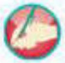

Тендеудің сол жақ белігінде $\sin x$ пен $\cos x$-ке қатысты екі қосылғышы бар және олардын әрқайсысы $\sin x$ пен $\cos x$-ке қатысты тертінші дәрежелі, он жак белігі 0-ге тен тендеуге мысал келтіріндер.

Аныктама Сол жаж бөлігіндегі $\sin x$ пен $\cos x$-ке катысты бартык мүиетерінін дәреже көрсеткіштерінін косындысы бірдей, он жак балізі 0 -ге тен болатын тендеу $\sin x$ пен $\cos x$-ке катысты біртекті тригонометриялық теңдеу деп аталады .

\section*{ТУСІНДІРІҢДЕР}
$a \sin ^{2} x+b \cos ^{2} x+d \sin x \cos x=1$ тендеуі неліктен біртекті тендеу болмайды? Тендеуді екінші дәрежелі біртекті тендеуге калай келтіруте болады? Неліктен $\sin x$ пен $\cos x$ бір мезете нелге тен ботмайды?

Кез келген біртекті тригонометриялык тендеуді алгебралык тендеуте келтіру үшін мына түрлендірулер колданылады:

АЛГОРИТМ 1) Тендеудін екі жақ белігін $\cos ^{k} x \neq 0$-ге ( $\sin ^{k} x \neq 0$-ге), мұндағы $k$ тендеудін дәрежесі, беліп, сол жак белігінде $\operatorname{tg} x$-ке (etg $x$-ке) катысты берішен тендеуте мәндес тендеу алу;
2) атмастыру жасап, мысалы, $\operatorname{tg} x$-ті (etg $x$-ті) $y$ аркылы белілеп, алгебралық тендеу ату.

\section*{МЫСАЛ}
4. Біртекті $\sin ^{2} x+2 \cos ^{2} x+3 \sin x \cos x=0$ тенгеуін шешейік.

Шешуі . Тендеудін екі жак белігіи $\cos ^{2} x \neq 0$-ге белеміз. Сонда
берілген тендеуге мэндес $\operatorname{tg}^{2} x+3 \operatorname{tg} x+2=0$ тендеуін атамыз. Расында, $\cos x \neq 0$, мұндай болмаган жагдайда $\sin x=0$ және $\cos x=0$ болады, бұл мумкій емес, себебі $\sin ^{2} x+\cos ^{2} x=1$.
$\operatorname{tg} x-\mathrm{ti} y$ аркылы әрнектесек, $y^{2}+3 y+2=0$ алгебралык тендеуі шыталы. Сонғы тендеудін шешімі -1 және -2 сандары болады.
$\operatorname{tg} x=y$ алмастыруын колданып $x$-тіи мэндерін табайык: $\left[\begin{array}{l}\operatorname{tg} x=-1, \\ \operatorname{tg} x=-2 .\end{array}\right.$
Сонда $\left[\begin{array}{l}x=-\frac{\pi}{4}+\pi n, n \in Z, \\ x=-\operatorname{arctg} 2+\pi k, k \in Z .\end{array}\right.$
$$
\text { Жауабы: }\left\{-\frac{\pi}{4}+\pi n, n \in Z:-\operatorname{arctg} 2+\pi k, k \in Z\right\} \text {. }
$$

\section*{Алмастыру тәсілі аркылы тендеулерді шешу}

Тригонометриялық тендеулерді алмастыру тәсілі арқылы шешуді үйренесіндер.

\section*{ТУЙІНДІ ҰғымдАР}

Тригонометриялык тендеулер, алмастыру
$\sin \alpha=\frac{2 \operatorname{tg} \frac{\alpha}{2}}{1+\operatorname{tg}^{2} \frac{\alpha}{2}}$ мен $\cos \alpha=\frac{1-\operatorname{tg}^{2} \frac{\alpha}{2}}{1+\operatorname{tg}^{2} \frac{\alpha}{2}}$ формулаларын және $\operatorname{tg} \frac{\alpha}{2}=y$ алмастыруын колданып, алгебралык тендеуге келтіруге болады.

\section*{МЫСАЛ}
5. $\sin x+\cos x=-1$ тендеуін шешейік.

Шешуі. Синус пен косинусты бір тана тангенспен ернектеп мына тендеуді аламыз $\frac{2 \operatorname{tg} \frac{x}{2}}{1+\operatorname{tg}^{2} \frac{x}{2}}+\frac{1-\operatorname{tg}^{2} \frac{x}{2}}{1+\operatorname{tg}^{2} \frac{x}{2}}=-1$.
$\operatorname{tg} \frac{x}{2}=y$ алмастыруын коллансак; $\frac{2 y}{1+y^{2}}+\frac{1-y^{2}}{1+y^{2}}=-1$, немесе $\frac{2 y+1-y^{2}}{1+y^{2}}+\frac{1+y^{2}}{1+y^{2}}=0$, немесе $\frac{2 y+1-y^{2}+1+y^{2}}{1+y^{2}}=0$, немесе $\frac{2 y+2}{1+y^{2}}=0$. Бұлан $y=-1$.

Енді атмастьруды ескерсек, $\operatorname{tg} \frac{x}{2}=-1$ тендеуі шығады. Сонда $\frac{x}{2}=-\frac{\pi}{4}+\pi_{k}$, $k \in Z$, демек $x=-\frac{\pi}{2}+2 \pi k, k \in Z$.
$\operatorname{tg} \frac{x}{2}$ ернегі $x=\pi+2 \pi_{n}, n \in Z$, сандары үшін аныкталмаған, $\sin x$ және $\cos x$ ернегі кез келтен накты $x$ үшін аныкталған, сондыктан $x=\Pi+2 \Pi_{1}, n \in Z$ шешімі жоғалып кетпес үшін тексеру жүргізу кажет.

Тексеру: $\sin \left(\pi+2 \Pi_{n}\right)+\cos \left(\pi+2 \Pi_{n}\right)=\sin \Pi+\cos \Pi=0+(-1)=-1$. Демек, $\sin x+ +\cos x=-1$ тендеуініи шешімі $x=-\frac{\pi}{2}+2 \pi k, k \in Z$ және $x=\pi+2 \pi n, n \in Z$.

Жауабы: $x=-\frac{\pi}{2}+2 \pi k, k \in Z$ және $x=\pi+2 \pi n, n \in Z$.
$a \sin x+b \cos x=c$ тендеуі косымиа бұрыи енгізу тәсілімен шығарылады.

Тригонометриялык тендеулерді косымша аргумент енгізу аркылы шешуді үйренесінаер.

Бұл тәсіл $\sin ^{2} \alpha+\cos ^{2} \alpha=1$ теңсіздігін колдануға негізделген.
$$
\begin{align*}
\left(\frac{a}{\sqrt{a^{2}+b^{2}}}\right)^{2}+\left(\frac{b}{\sqrt{a^{2}+b^{2}}}\right)^{2} & =1 \text { боландыктан. } \\
\frac{a}{\sqrt{a^{2}+b^{2}}} & =\cos \mathrm{a}, \frac{b}{\sqrt{a^{2}+b^{2}}}=\sin \mathrm{a} \tag{1}
\end{align*}
$$

алмастыруларын колданамыз.
$a \sin x+b \cos x=c$ тендігінін сол жақ бөлігіндегі $\sqrt{a^{2}+b^{2}}$ ернегін жакшанын алдына шығарамыз:

Егер $a^{2}+b^{2} \mid c^{2}$ болса, онда (2) тендеудін шешімі бар.
Демек, $x=(-1)^{k} \arcsin \frac{c}{\sqrt{a^{2}+b^{2}}}+\Pi_{k}-\mathbf{a}, k \in Z$.

\section*{ТУЙІНДІ ұғымдАР}

Тригонометриялык тендеулер, косымша аргумент
$\begin{aligned}\left(\frac{a}{\sqrt{a^{2}+b^{2}}}\right)^{2}+\left(\frac{b}{\sqrt{a^{2}+b^{2}}}\right)^{2} & =1 \text { боландыктан, } \\ \frac{a}{\sqrt{a^{2}+b^{2}}} & =\cos \mathrm{a}, \frac{b}{\sqrt{a^{2}+b^{2}}}=\sin \mathrm{a}\end{aligned}$
$a \sin x+b \cos x=c$ тендігінін сол жақ бөлігіндегі $\sqrt{a^{2}+b^{2}}$ ернегін
кшанын алдына шығарамыз:
$$
\begin{align*}
& \sqrt{a^{2}+b^{2}}\left(\frac{a}{\sqrt{a^{2}+b^{2}}} \sin x+\frac{b}{\sqrt{a^{2}+b^{2}}} \cos x\right)=c  \tag{2}\\
& \sqrt{a^{2}+b^{2}} \sin (x+\mathrm{a})=c \text { Hemece } \sin (x+\mathrm{a})=\frac{c}{\sqrt{a^{2}+b^{2}}}
\end{align*}
$$

Егер $a^{2}+b^{-} c^{-}$болса, онда (2) тендеудин шешмі оар.
Демек, $x=(-1)^{k} \arcsin \frac{}{\sqrt{a^{2}+b^{2}}}+\Pi_{k}-\mathrm{a}, k \in Z$.
$\operatorname{tg} \alpha=\frac{\sin \alpha}{\cos \alpha}$ формуласын және (1) алмастыруды колданып $\operatorname{tg} \mathrm{a}=\frac{b}{a}$ аламыз. Ендеше, $\mathrm{a}=\operatorname{arctg} \frac{b}{a}$.

\section*{МЫСАЛ \\ 6. $\sin x+\cos x=-1$ тендсуін косымша аргумент енгізу тәсітімен}
шешейік.
Шешуі . Берілен тендеуде $a=b=1$. Сондыктан $\sqrt{a^{2}+b^{2}}=\sqrt{2}$.
Онда $\sqrt{2}\left(\frac{1}{\sqrt{2}} \sin x+\frac{1}{\sqrt{2}} \cos x\right)=-1$ немесе $\frac{1}{\sqrt{2}} \sin x+\frac{1}{\sqrt{2}} \cos x=-\frac{1}{\sqrt{2}}$.
$\frac{1}{\sqrt{2}}=\sin \frac{\pi}{4}=\cos \frac{\pi}{4}$ болкандыктан, $\quad \sin \left(x+\frac{\pi}{4}\right)=-\frac{1}{\sqrt{2}}$.
Conta $x=(-1)^{k} \arcsin \left(-\frac{1}{\sqrt{2}}\right)+\pi k-\frac{\pi}{4}, k \in Z$ немесе $x=(-1)^{k-1} \frac{\pi}{4}+\pi k-\frac{\pi}{4}, k \in Z$ Жауабы: $\left\{(-1)^{k+1} \frac{\pi}{4}+\Gamma_{k}-\frac{\pi}{4}, k \in Z\right\}$.

\section*{ТЧСІНДІРІНДЕР}
$x=-\frac{\pi}{2}+2 \Pi n, m \in Z, x=-\pi+2 \Pi_{2}, n \in Z$ және $x=(-1)^{k+1} \frac{\pi}{4}+\pi k-\frac{\pi}{4}, k \in Z$ формулаларыныи

бір шешімді беретінін бірлік шенбердіи кометімен кереетімдер (20.2-cyper).

\begin{figure}
\includegraphics[alt={},max width=\textwidth]{https://cdn.mathpix.com/cropped/b3f159e3-70ef-4ad9-b9e9-0ac5b230efd7-159.jpg?height=451&width=1057&top_left_y=1455&top_left_x=456}
\captionsetup{labelformat=empty}
\caption{20.2-cyper}
\end{figure}

\section*{МЫСАЛ}
7. $\left(90^{\circ} ; 270^{\circ}\right)$ интервальна тністі $\sin 3 x+\cos 3 x=\sqrt{2}$ тендеуі түбіртерініи косындысыныи мәніи табайык.
Шешуі . Келтіру формуласы бойынша $\cos 3 x=\sin \left(90^{\circ}-3 x\right)$. Сондыктан $\sin 3 x+ +\cos 3 x=\sqrt{2}$ тендеуі $\sin 3 x+\sin \left(90^{\circ}-3 x\right)=\sqrt{2}$ туріне кешеді.

Синустардын қосындысын кебейтіндімен алмастырамыз:
$2 \sin 45^{\circ} \cos \left(3 x-45^{\circ}\right)=\sqrt{2}$ немесе $\cos \left(3 x-45^{\circ}\right)=1$.
Будан $3 x-45^{\circ}=360^{\circ} n, n \in Z$ немесе $x=15^{\circ}+120^{\circ} n, n \in Z$.
$\left(90^{\circ}: 270^{\circ}\right)$ ннтервалыма $135^{\circ}(n=1)$ жоне $255^{\circ}(n=2)$ шешімдері тністі. Олай болеа, берілген тендеу гүбірлерінін косындысыныи мэні 390\% ботады.

Жауабы : 390*.

\section*{Тригонометриялык функция бөлшектін бөлімінде берілген тендеулер}

Тригонометриялық тендеулерді тригонометрия формулаларын колданып шешуді үйренесіндер.

\section*{ТЧЙІНДІ ұғымдАР}

Тригонометриялык тендеулер, тригонометриялық формулалар

\section*{МЫСАЛ 8. $\frac{1}{\sin x}+\frac{1}{\cos x}=2 \sqrt{2}$ тендеуін шығарайык.}

Ueuyi $\frac{1}{\sin x}+\frac{1}{\cos x}=2 \sqrt{2}$ тендеуініи барлык мушелерін сол жакка жинап, ортак беліме келтіреміз: $\frac{\cos x+\sin x-2 \sqrt{2} \sin x \cos x}{\sin x \cos x}=0$ немесе $\frac{\sqrt{2} \sin \left(x+\frac{\pi}{4}\right)-\sqrt{2} \sin 2 x}{\sin x \cos x}=0$ (алдынғы есепте жүргізілген түрлендірулер мен синустын косбұрышыныи формуласы колданылады).

Енді атымымда $\sqrt{2}$ кебейткіши жакшаныи алдына шытарып. синустардын айыры мын кебейтіндіге түрлендіреміз: $\frac{\sin \left(-\frac{x}{2}+\frac{\pi}{8}\right) \cos \left(\frac{3 x}{2}+\frac{\pi}{8}\right)}{\sin x \cos x}=0$. Осы тендеу келесі жүйете мондес: $\left\{\begin{array}{l}\sin \left(-\frac{x}{2}+\frac{\pi}{8}\right)=0, \\ \cos \left(\frac{3 x}{2}+\frac{\pi}{8}\right)=0, \text { немесе } \\ \sin x \cos x \neq 0\end{array}\left\{\begin{array}{l}-\frac{x}{2}+\frac{\pi}{8}=\pi k, k \in Z, \\ \frac{3 x}{2}+\frac{\pi}{8}=\frac{\pi}{2}+\pi n, n \in Z, \text { немесе } \\ x \neq \frac{\pi}{2} m, m \in Z .\end{array}\right.\right.$
$$
\left\{\begin{array}{l}
x=\frac{\pi}{4}+2 \pi k, k \in Z, \\
x=\frac{\pi}{4}+\frac{2}{3} \pi n, n \in Z, \\
x=\frac{\pi}{2} m, m \in Z .
\end{array}\right.
$$

Жауабы: $\left\{\frac{\pi}{4}+2 \pi k, k \in Z: \frac{\pi}{4}+\frac{2}{3} \pi, n \in Z\right\}$.

\section*{Тригонометриялык тендеулерді тригонометриялык функциялардын дәрежесін төмендету аркылы шешу}

Тригонометриялық тендеулерді тригонометриялық функциялардын дәреже көрсеткішін төмендету аркылы шешуді үйренесіндер.

\section*{ТУЙІНДІ ΨғымдАР}

Тригонометриялық тендеулер, дәрежені төмендету формулалары

СЕНДЕР БМЕСІНДЕР:

Дэрежені темендету формулалары: $\sin ^{2} x=0,5(1-\cos 2 x), \cos ^{2} x=0,5(1+\cos 2 x)$

\section*{МЫСАЛ \\ 9. $\sin ^{2} 2 x+\sin ^{2} 3 x=\sin ^{2} 4 x+\sin ^{2} 5 x$ тендеуінін түбіртерін}
табайык.

Шешуі . Дэрежені темендету формулаларын колланамыз:
$0,5(1-\cos 4 x)+0,5(1-\cos 6 x)=0,5(1-\cos 8 x)+0,5(1-\cos 10 x)$ немесе $\cos 4 x+\cos 6 x=\cos 8 x+\cos 10 x$.

Косниустардын косындысыныи формуласын колданамыз: $\cos \mathrm{a}+\cos \mathrm{b}=2 \cos \frac{\alpha+\beta}{2} \cos \frac{\alpha-\beta}{2}$.

Сонда $2 \cos 5 x \cdot \cos x=2 \cos 9 x \cdot \cos x$ немесе $(\cos 5 x-\cos 9 x) \cdot \cos x=0$.
Косинустардыи айырымыныи формуласыи колданамыз: $\cos \mathrm{a}-\cos \mathrm{b}=2 \sin \frac{\alpha+\beta}{2} \sin \frac{\alpha-\beta}{2}$. Coнда $2 \sin 7 x \sin 2 x+\cos x=0$. Онда $\left[\begin{array}{l}\sin 7 x=0, \\ \sin 2 x=0, \\ \cos x=0,\end{array}\right.$
$7 x=\pi k, k \in Z$ немесе $x_{1}=\frac{\pi}{7} k, k \in Z$; немесе $2 x=\pi n, n \in Z$, немесе $x_{2}=\frac{\pi}{3} n$, $k \in Z$, немесе $x_{1}=\frac{\pi}{2}+\pi m, m \in Z$.

Жауабы : $x_{1}=\frac{\pi}{7} k, k \in Z$ және $x_{2}=\frac{\pi}{2} m, m \in Z$.

\section*{ТУСІНДІРІҢДЕР}
20.3-суреті колданып тендеудін тубірлерін $x_{1}=\frac{\pi}{7} k, k \in Z$ және $x_{2}=\frac{\pi}{3} k, k \in Z$ екі формуласына біріктіруге болатынын түсіндіріндер.

\section*{Аттас тригонометриялык функциялардын тендігініи әдісі}

Аттас тригонометриялык функциязардын тендігінін әдісімен танысасындар; тригонометриялык тендеулерді аттас тригонометриялық функциялардын тендігінің әдісі көмегімен шешуді үйренесіндер.

\section*{ТЧйІндІ ұғымдАР}

Тригонометриялык тендеу, аттас функциялар

\section*{CEHAPEP Б) ДЕСІН.AEP:}

Аттас тригонометриялык функциятардыи тендігініи шарты $\sin x=\sin y-x=(-1)^{2} y+\pi k, k \in Z, \cos x=\cos y-x= \pm y+2 \pi k$. $k \in Z, \operatorname{tg} x=\operatorname{tg} y-x=y+\Pi k, k \in Z$.

\begin{figure}
\includegraphics[alt={},max width=\textwidth]{https://cdn.mathpix.com/cropped/b3f159e3-70ef-4ad9-b9e9-0ac5b230efd7-161.jpg?height=435&width=1333&top_left_y=2193&top_left_x=315}
\captionsetup{labelformat=empty}
\caption{20.3-cypet}
\end{figure}

\section*{МЫСАЛ}
10. $(\sin x+\cos x)^{4}+(\sin x-\cos x)^{4}=3-\sin 4 x$ тендеунін түбрлеріи табайык.
Шешуі , Берілен тендеудіи сол жак белігіи түрлендіріп, $2+2 \sin ^{2} 2 x=3-\sin 4 x$ тендеуіи аламыз.
$(\sin x+\cos x)^{2}+(\sin x-\cos x)^{2}$ ернегін турлендіргеннен кейін $2+2 \sin ^{2} 2 x$ өрнегі қалай алынған?

Дәрежені темендету формулаларын колданамыз: $3-\cos 4 x=3-\sin 4 x$. $\cos 4 x=\sin 4 x$.

Аттас тригонометриятык функшиялардын тендігінін шартын колданамыз:
$\cos x=\cos y \Leftrightarrow x= \pm y+2 \pi k, \quad k \in Z$, сонда $\cos 4 x=\cos \left(\frac{\pi}{2}-4 x\right)=4 x= = \pm\left(\frac{\pi}{2}-4 x\right)+2 \pi k, k \in Z$. Бұлан екі жағдай карастырамыз.

1-жагдай. $4 x=\frac{\pi}{2}-4 x+2 \pi k, k \in Z .8 x=\frac{\pi}{2}+2 \pi k, k \in Z . x=\frac{\pi}{16}+\frac{\pi}{4} k . k \in Z$.
2-жағдай. $\quad 4 x=-\frac{\pi}{2}+4 x+2 \pi k, k \in Z .0 \cdot x=-\frac{\pi}{2}+2 \pi k, k \in Z$, яғни $\emptyset$. Жауабы: $\frac{\pi}{16}+\frac{\pi}{4} k, k \in Z$.

\section*{Құрамында тригонометриялык тендеулері бар жүйелер}

Тригонометриялық тендеулер жүйесін шешуді үйренесіндер.

\section*{ТЧЙІНДІ ҰғЫМДАР}

Тригонометриялык тендеулер жүйесі

\section*{МЫСАЛ}
11. $\left\{\begin{array}{l}\sqrt{\sin x-\cos y}=\cos x, \\ \sin x+\cos y=\sin ^{2} x\end{array}\right.$ тенлеуін шығарайык.

Шешуі. Жүйснін бірінші тендеуінін екі жақ белігін екінші дәрежеге шытарамыз. сонда $\cos x \mid 0$ және $\sin x-\cos y \mid 0$ шарты бойыиша берілен тендеуте мондес $\sin x-\cos y=\cos ^{2} x$ тендеуін аламыз.

\section*{ТЧСІНДІРІНДЕР}
$\sin x-\cos y=\cos ^{2} x$ тендеуіндегі $\sin x-\cos y$ айырымыныи нелден үлкен не нелте тен болуы себебін түсіндіріндер.

Жуйенін шешімін табу ушін алгебралык косу тосілін колданамыз:
$$
\left\{\begin{array} { l } 
{ \operatorname { s i n } x - \operatorname { c o s } y = \operatorname { c o s } ^ { 2 } x , } \\
{ \operatorname { s i n } x + \operatorname { c o s } y = \operatorname { s i n } ^ { 2 } x . }
\end{array} \Rightarrow \left\{\begin{array} { l } 
{ 2 \operatorname { s i n } x = 1 , } \\
{ \operatorname { s i n } x + \operatorname { c o s } y = \operatorname { s i n } ^ { 2 } x }
\end{array} \Rightarrow \left\{\begin{array} { l } 
{ \operatorname { s i n } x = \frac { 1 } { 2 } , } \\
{ \frac { 1 } { 2 } + \operatorname { c o s } y = \frac { 1 } { 4 } }
\end{array} \Rightarrow \left\{\begin{array}{l}
\sin x=\frac{1}{2}, \\
\cos y=-\frac{1}{4},
\end{array}\right.\right.\right.\right.
$$
$\sin x$ және $\cos y$ ернектерінін мәндері үшін $\sin x-\cos y 10$ болады. Расында. $\frac{1}{2}-\left(-\frac{1}{4}\right)= =\frac{3}{4}$ । 0 . Мәндее тендеулер жүйесіне кешудін екінші шарты, яғни $\cos x 10$ тенсіздігі $\left(-\frac{\pi}{2}+2 \pi k, \frac{\pi}{2}+2 \pi k\right), k \in Z$, кесіндісінде орындалады.

Сондыктан $\sin x=\frac{1}{2}$ тендеуінін шешімі $\frac{\pi}{6}+2 \pi k, k \in Z$.
$\cos y=-\frac{1}{4}$ тендеуініи шешімі ±arccos $\left(-\frac{1}{4}\right) \div 2 \pi n, n \in Z$ немесе $\pm\left(\pi-\arccos \frac{1}{4}\right)+ +2 \pi n, n \in Z$.
$$
\text { Жауабы: }\left(\frac{\pi}{6}+2 \pi k, k \in Z ;=\left(\pi-\arccos \frac{1}{4}\right)+2 \pi n, n \in Z\right) .
$$
1. Тригонометрнялық ернектерге кандай түрлендірулер жүргізгенде:
1) бегде түбрлердіи пайда болуы мумкін:
2) түбірлердін жоғалуы мумкін?
2. Синус, косинус, тангене және котангенсті тангенстіи жартыбрышымен алмастыру ынғайлы болатын тендеулерге мысал кеттіріндер.

\section*{Жаттығулар}

\section*{A}
20.1. Тендеуді шешіндер:
1) $\sin x+\sin 5 x-2 \cos 2 x=0 ;$
2) $\cos 5 x+\cos x+2 \cos 3 x=0$;
3) $\sin x-\sqrt{2} \sin 3 x=-\sin 5 x$;
4) $\cos x-\cos 3 x-2 \sin 2 x=0$.
20.2. Тендеуді шешіндер:
1) $\cos \left(70^{\circ}+x\right) \cos \left(x-20^{\circ}\right)=\frac{1}{2}$;
2) $\sin \left(40^{\circ}+x\right) \sin \left(x-50^{\circ}\right)=1$.
20.3. Тендеудін түбірлерін табындар:
1) $\cos 5 x-\sin 5 x-\sin 7 x+\cos 7 x=0 ;$
2) $\cos 10 x \cos 6 x-\cos ^{2} 8 x=0$;
3) $\sin x \cos 5 x-\sin 9 x \cos 3 x=0$;
4) $\sin x \sin 3 x+\sin 4 x \sin 8 x=0$.
20.4 . Біртекті тригонометриялык тендеуді шешіндер:
1) $4 \cos ^{2} x+\sin x \cos x+3 \sin ^{2} x-3=0$;
2) $\cos ^{2} x-3 \sin x \cos x=-1$;
3) $5 \sin ^{2} x-3 \sin x \cos x=2 \cos ^{2} x$;
4) $2 \sin ^{2} x-5 \sin x \cos x=\cos ^{2} x-2$.
20.5. Тендеуді косымша аргумент енгізу тәсілімен шешіндер:
1) $\sin x-\cos x=\sqrt{\frac{3}{2}}$;
2) $\sin 2 x-\cos 2 x+1=0$;
3) $\sqrt{2} \sin x=2-\sqrt{2} \cos x$;
4) $\sqrt{3} \sin 2 x+\cos 2 x=\sqrt{3}$.
20.6. Тендеудін түбірлерінін косындысынын мәнін табындар:
1) $\sin ^{2} x-3 \sin x+2=0$, мұндағы $x \in\left[0^{\circ} ; 360^{\circ}\right]$;
2) $5 \cos ^{2} x+5 \cos x=1-3 \sin ^{2} x$, мұндағы $x \in\left[270^{\circ} ; 450^{\circ}\right]$;
3) $\sin x+\sin 2 x+\sin 3 x+\sin 4 x=0$, мундағы $x \in\left[0^{\circ} ; 180^{\circ}\right]$;
4) $\sin x+\sqrt{3} \cos x=1$, мұндағы $x \in\left[270^{\circ} ; 450^{\circ}\right]$.
20.7. Тригонометриялык
1) $\frac{\sin 3 x}{\sin x}=0$;
2) $\frac{\cos x}{\cos 3 x}=0$.
20.8. Дәрежені төмендету әдісімен шығарындар:
1) $\sin ^{2} x+\sin ^{2} 2 x-\sin ^{2} 3 x=\sin ^{2} 4 x$;
2) $\cos \frac{4 x}{3}+\sin ^{2} \frac{3 x}{2}+2 \sin ^{2} \frac{5 x}{4}-\cos ^{2} \frac{3 x}{2}=0$;
3) $\sin ^{4} x+\cos ^{4} x-\frac{5}{8}=0$;
4) $\cos ^{2} x+\cos ^{2} 2 x-\cos ^{2} 3 x-\cos ^{2} 4 x=0$;
5) $\cos ^{2} \frac{3 x}{4}+\cos ^{2} x+\cos ^{2} \frac{5 x}{4}=\frac{3}{2}$;
6) $\sin ^{2} \frac{x}{3}+\sin ^{2} \frac{4 x}{9}=\sin ^{2} \frac{5 x}{9}+\sin ^{2} \frac{2 x}{3}$.
20.9. Кебейтіндіні тригонометрнялык функциялардын косындысы аркылы түрлендіруді колданып тендеуді шытарындар:
1) $\sin x \cos x \cos 2 x \cos 8 x-\frac{1}{4} \sin 12 x=0$;
2) $4 \cos x \cos 2 x \cos 3 x-\cos 6 x=0$;
3) $\sin x \sin 2 x \sin 3 x-\frac{1}{4} \sin 4 x=0$;
4) $\cos x \cos 2 x \cos 4 x \cos 8 x-\frac{1}{8} \cos 15 x=0$;
5) $\cos x \cos \frac{7 x}{2} \sin \frac{9 x}{2}=\frac{1}{4} \sin 7 x$;
6) $\cos x \cos 2 x \cos 4 x \cos 8 x-\frac{1}{16}=0$.
20.10. Тендеуді шешіндер:
1) $\sqrt{3} \cos 3 x+\sin 3 x-\cos x=\sqrt{3} \sin x$;
2) $2 \sin 3 x+\cos 5 x-\sqrt{3} \sin 5 x=0$;
3) $2 \cos 4 x=\sqrt{2}(\cos x-\sin x)$;
4) $\cos 2 x=\cos 4 x+2 \sqrt{3} \sin x \cos 3 x$.

\section*{B}
20.11 Тендеуді көбейткіштерге жіктеу аркылы шешіндер:
1) $\sin ^{3} x(1+\operatorname{ctg} x)+\cos ^{3} x(1+\operatorname{tg} x)=2 \sqrt{\sin x \cos x}$;
2) $\sin 2 x+5(\sin x+\cos x)=-1$;
3) $\cos x+\sin x-\sqrt{1-2 \cos ^{2} x}=0$;
4) $1+\sin 2 x=7(\cos x+\sin x)$.
20.12. Алмастыру тәсілін колданып тендеулер жүйесін шешіндер:
1) $\left\{\begin{array}{l}\sin x \sin y=\frac{1}{2 \sqrt{2}}, \\ x-y=-\frac{\pi}{4} ;\end{array}\right.$
2) $\left\{\begin{array}{l}\cos x+\cos y=0, \\ x-y=\frac{4 \pi}{3} ;\end{array}\right.$
3) $\left\{\begin{array}{l}\sin x \cos y=-\frac{1}{2}, \\ x+y=-\frac{\pi}{6} .\end{array}\right.$

\section*{C}
20.13 Тендеуді дәрежені төмендету тәсілі және түрлендірулер колдану аркылы шешіндер:
1) $\sin x+\sin 2 x-\cos x=2 \cos ^{2} x$;
2) $\sin 4 x-\cos ^{4} x=-\sin ^{4} x$;
3) $\sin \left(x-45^{\circ}\right) \sin \left(x-15^{\circ}\right)=0,5$;
4) $\sin 2 x-2 \sin ^{2} x-4 \sin x=-4 \cos x$.
20.14. Тендеудін түбірлерін табындар:
1) $\sqrt{5-2 \sin x}+1=6 \sin x$;
2) $\sqrt{7-18 \operatorname{tg} x}-11=6 \operatorname{tg} x$;
3) $\sqrt{10-18 \cos x}+2=6 \cos x$;
4) $\sqrt{4-2 \sin ^{2} x}-\sin x=2$.
20.15. Тендеуді дәрежені төмендету тәсілімен шешіндер:
1) $\cos ^{2} x+\cos ^{2} 2 x=\sin ^{2} 3 x+\sin ^{2} 4 x$;
2) $\sin ^{4} 2 x+\cos ^{4} 2 x-\frac{5}{8}=0$;
3) $\sin ^{2} \frac{3 x}{4}+\sin ^{2}\left(\frac{\pi}{2}-x\right)+\cos ^{2} \frac{5 x}{4}=\frac{3}{2}$;
4) $\cos ^{2} \frac{x}{3}+\cos ^{2} \frac{4 x}{9}=\cos ^{2} \frac{5 x}{9}+\cos ^{2} \frac{2 x}{3}$.
20.16. Тендеуді көбейткіштерте жіктеу аркылы шешіндер:
1) $\cos \left(2\left(x+60^{\circ}\right)\right)+4 \sin \left(x+60^{\circ}\right)=2,5$;
2) $8 \cos ^{4} x=11 \cos 2 x-1$;
3) $9 \operatorname{ctg}^{2} x+4 \sin ^{2} x=6$;
4) $2 \cos ^{2}\left(2 x+60^{\circ}\right)-3 \sin ^{2}\left(x+30^{\circ}\right)=2$.
20.17. Тендеулер жүйесін шешіндер:
1) $\left\{\begin{array}{l}\cos x \cos y=0,5, \\ \sin (x+y) \cdot \sin (x-y)=0,75 ;\end{array}\right.$
2) $\left\{\begin{array}{l}\sin ^{2} x+\cos y=1, \\ \cos ^{2} x+\cos y=1 ;\end{array}\right.$
3) $\left\{\begin{array}{l}\sin x+\cos y=-0,5, \\ \cos x \cdot \sin y=0,5 .\end{array}\right.$

\section*{КАЙТАЛАУ}
20.18. Тенсіздікті $x$ айнымалысына байланысты шешіндер:
1) $\cos 4 \cdot(2 x-1)<0$;
2) $\cos 3 \cdot \cos 5 \cdot\left(x^{2}-1\right)<0$.
20.19. Өрнектін танбасын аныктандар:
1) $\operatorname{tg} 2 \cdot \operatorname{ctg} 2+\cos ^{2} \pi-\sin ^{2} 35-\cos ^{2} 35 ;$
2) $\cos 1 \cdot \cos (1+\pi)+\sin 60^{\circ}-\cos 30^{\circ}$;
3) $\sin 1 \cdot \cos 2$;
4) $\sin (-3) \cdot \sin 4 \cdot \cos 5$.
20.20. Тенсіздікті графиктік тәсілмен шешіндер:
1) $(x-4)(x+3)(x-2)^{2} 10$;
2) $(2 x-3)(x+6)(3 x-2)^{3}$ mo;
3) $\frac{2}{x-3}-\frac{1}{x+3} m \frac{1}{x+1}$.
20.21. Тенсіздікті квадраттык функцияныи графигі және интервалдар әдісімен шешіндер:
1) $x^{2}+3 x-18 \mid 0$;
2) $-5 x^{2}-12 x+17 \mathrm{~m} 0$;
3) $6 x^{2}-13 x-5>0$.
20.22. Өрнектін мәндерін өсу ретімен жазындар:
1) $\sin 2, \sin 3, \cos 4, \cos 5 ;$
2) $\sin 3, \sin 4, \sin 6, \sin 7$.

\section*{ЖАҢА БІЛІМДІ МЕңГЕРУГЕ АРНАЛҒАН ТІРЕК ҰҒЫМДАР}

Тенсіздік, өрнектерді түрлендіру, тригонометриялых тепетендіктер.

\section*{§21. ТРИГОНОМЕТРИЯЛЫК ТЕНСЗДИКТЕРД ШЕШУ}

Тригонометриялык тенсіздік ұғымымен танысасындар; қарапайым тригонометриялық тенсіздіктерді шешуді үйренесіндер.

Аныктама Бетгісізі (айныматысы ) тригонаvетриятык функциянын аргументі турінде берілген тенсіздікті тригонометриялық теңсізоік деп атайды .

\section*{ТЧЙІндІ ұғымдАР}

Тригонометриялык тенсіздік

МЫСАЛ
1. $2 \operatorname{tg}^{2} x-\operatorname{tg} x<0$ тенсізлігі тригонометриятык тенсіздік болады. $2 \operatorname{tg} x-x<0$ тенсіздігі тригонометриялык тенсіздік болмайды
және ол жуыктау немесе графнктік тәсіммен шытарылады.
$2(x+1) \sin 3 x \cos 3 x m_{x}+1$ тенсізді тригонометриялык тенсіздік болмайды, бірак бұл тенсіздікті тригонометриятык тенсіздікке келтіруте болады. Расында да, алгебралык турлендірулер жасап, берілген тенеіздіктен $(x+1)(\sin 6 x-1)$ mo тенсіздігін аламыз. Сонғы тенсіздікті шешу барысында тригонометриятык тенсіздік шығарылады.

\section*{$\sin x \mid a$ тригонометриялык тенсіздігі}

Тригонометрнялык тенсіздікті графиктік тәсілмен шешудін мысалы ретінде $\sin x 1-\frac{1}{2}$ тенсіздігін карастырайык. Алдымен $y=\sin x$ функ-

циясынын графигі мен $y=-\frac{1}{2}$ түзуінде бір координаталык жазыктыка саламыз (21.1, $a$-сурет).
$y=\sin x$ функциясынын перподы $2 \pi$-ге тен болғандыктан, берілген тенсіздіктін $\left[-\frac{\pi}{2} ; \frac{3 \pi}{2}\right]$ кесіндісіне тисті барлык шешімдерін табамыз, одан кейін $y=\sin x$ функшисынын перподтылығын ескереміз.

\begin{figure}
\includegraphics[alt={},max width=\textwidth]{https://cdn.mathpix.com/cropped/b3f159e3-70ef-4ad9-b9e9-0ac5b230efd7-167.jpg?height=474&width=1755&top_left_y=639&top_left_x=100}
\captionsetup{labelformat=empty}
\caption{21.1-cyper}
\end{figure}
$\sin x \left\lvert\,-\frac{1}{2}\right.$ тенсіздігінін шешімі $\left[-\frac{\pi}{2} ; \frac{3 \pi}{2}\right]$ кесіндісіндегі $y=\sin x$ функциясынын графигі $y=-\frac{1}{2}$ түзуінін графигінен жоғары орналаскан немесе ол графикті киятын $x$ айнымалысынын барлык мәндері, яғни $\left[-\frac{\pi}{6} ; \frac{7 \pi}{6}\right]$ кесіндісі.
$y=\sin x$ функциясынын перноды $2 \pi$-ге тен болғандыктан, табылған шешімдерге $2 \pi_{n}(n \in Z)$ сандарын коссак, берілген тенсіздіктін калған шешімдері табылады.

Демек, $\sin x \left\lvert\,-\frac{1}{2}\right.$ тенсіздігінін шешімі $\left[-\frac{\pi}{6}+2 \pi n ; \frac{7 \pi}{6}+2 \pi n\right], n \in Z$.
Тригонометрнялык тенсіздіктерді бірлік шенбердін кемегімен шығаруға болады.
$\sin x \left\lvert\,-\frac{1}{2}\right.$ тенсіздігін бірлік шенбердін көмегімен шығарайык.
Алдымен координаталык жазыктыкта бірлік шенбер саламыз және $y=-\frac{1}{2}$ түзуін жүргіземіз (21.1, ә-сурет) $\sin x$-тін мәні $-\frac{1}{2}$-ден үлкен немесе тен болғандыктан шенбердін $y=-\frac{1}{2}$ түзуінен жоғары жаткан белігін аламыз. Енді бірлік шенбердін $y=-\frac{1}{2}$ түзуімен кнылысу нүктелеріне сәїкес бұрыштарды анықтаймыз. $x_{1}=\arcsin \left(-\frac{1}{2}\right)=-\frac{\pi}{6}$ және $x_{2}=\pi+\frac{\pi}{6}=\frac{7 \pi}{6}$.

Демек, $-\frac{\pi}{6} \mathrm{~m} x \mathrm{~m} \frac{7 \pi}{6}, y=\sin x$ функшясынын перподын ескеріп $\left[-\frac{\pi}{6}+2 \pi n ; \frac{7 \pi}{6}+2 \pi n\right], n \in Z$, аламыз.
21.1-суретті колданып $\sin x<-\frac{1}{2}$ тенсіздігін шешіндер.

\section*{$\cos x<a$ тригонометриялык тенсіздігі}

Тригонометриялык тенсіздікті графиктік тәсімен шешуді $\cos x<\frac{1}{2}$ тенсіздігін шешу мысалы аркылы карастырайык. Алдымен $y=\cos x$ функиясынын графигі мен $y=\frac{1}{2}$ түзуін бір координаталык жазыктыкка саламыз (21.2, $a$-сурет).
$y=\cos x$ функциясыныи периоды $2 \pi$-ге тен болғандыктан, берілген тенсіздіктін $[0 ; 2 \pi]$ кесіндісіне тпісті барлык шешімдерін тауып, $y=\cos x$ функциясыныи перподтылынын ескереміз .

$\cos x<\frac{1}{2}$ тенсіздігінін $[0 ; 2 \pi]$ кесіндісіндегі шешімі $y=\frac{1}{2}$ түзуінін графигінен темен орналаскан $y=\cos x$ функшисынын графигіне тисті $x$ айнымалысыныи барлык мәндері, яғни $\left[\frac{\pi}{3} ; \frac{5 \pi}{3}\right]$ аралығы .
$y=\cos x$ функциясының перноды $2 \pi$-ге тен болғандыктан, табылған шешімдерге $2 \pi n(n \in Z)$ сандарын коссак, берілген тецсіздіктін қалған шешімдері табылады.

Демек, $\cos x<\frac{1}{2}$ тенсіздігінін шешімі $\left[\frac{\pi}{3}+2 \pi n ; \frac{5 \pi}{3}+2 \pi n\right], n \in Z$.
$\cos x<\frac{1}{2}$ тенсіздігін бірлік шенбердін кемегімен шешуді карастырайық.

Координаталык жазыктыкта бірлік шенбер салып, $x=\frac{1}{2}$ түзуін жүргіземіз. $\cos x$-тін мәні $\frac{1}{2}$-ден кем болғандыктан шенбердін $x=\frac{1}{2}$ түзуінен сол жакта орналаскан белігін аламыз (21.2, ә-сурет).

Енді шенбер мен түзудін кнылысу нүктелеріне сәїкес бұрыштарды аныктаймыз.
$$
x_{1}=\arccos \frac{1}{2}=\frac{\pi}{3} ; x_{2}=2 \pi-\arccos \frac{1}{2}=2 \pi-\frac{\pi}{3}=\frac{5 \pi}{3} . \text { Сонда } \frac{\pi}{3}<x<\frac{5 \pi}{3} .
$$

Енді $y=\cos x$ функииясынын перподын ескеріп, $\frac{\pi}{3}+2 \pi n<x<\frac{5 \pi}{3}+2 \pi n$, $n \in Z$, аламыз.
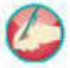
21. 2-суреті колданып $\cos x$ । $\frac{1}{2}$ тенсіздігін шешінаер.

\section*{$\operatorname{tg} x$ т $a$ тригонометриялык тенсіздігі}

Тригонометриялык тенсіздікті графиктік тәсілмен шешудін мысалы ретінде $\operatorname{tg} x$ m1 тенсіздігін карастырайык. Алдымен $y=\operatorname{tg} x$ функциясынын графигі мен $y=1$ түзуін бір координаталык жазыктыкка саламыз.
$y=\operatorname{tg} x$ функциясынын перподы П-ге тен болғандыктан, берілген тенсіздіктін $\left(-\frac{\pi}{2} ; \frac{\pi}{2}\right)$ интервалына тисті барлык шешімдерін табамыз. одан кейін $y=\operatorname{tg} x$ функцисыныи периодтылығын ескереміз (21.3-сурет).
$\operatorname{tg} x$ m 1 тенсіздігінін $\left(-\frac{\pi}{2} ; \frac{\pi}{2}\right)$ пнтервалы ндағы шешімі $y=1$ түзуінін графигінен төмен орналаскан немесе осы түзуді княтын $y=\operatorname{tg} x$ функциясынын графигіне тністі $x$ айнымал ысынын барлык мәндері, яғни $\left(-\frac{\pi}{2} ; \frac{\pi}{4}\right]$ жарты пнтервалы.
$y=\operatorname{tg} x$ функциясынын периоды П-ге тен болгандыктан, табылған шешімдерге $T_{n}(n \in Z)$ сандарын коссак, берілген тенсіздіктін калған шешімдері табыла ды.

Демек, $\operatorname{tg} x$ ml тенсіздігініи шешімі $\left(-\frac{\pi}{2}+\pi n ; \frac{\pi}{4}+\pi n\right], n \in Z$, жныны болады.
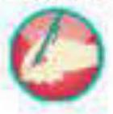
21. 3-суреті қолданыn, $\operatorname{tg} x \mid 1$ теңсіздігін екі тәсілмен шешіндер.
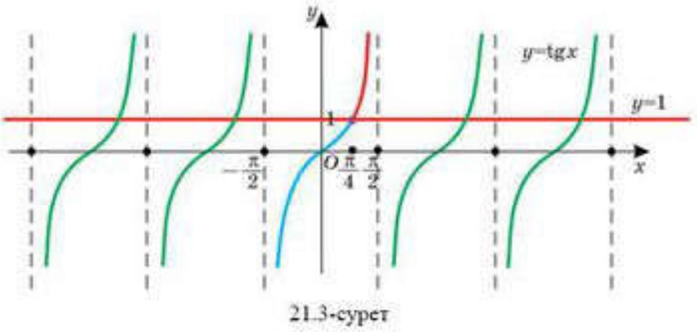

\section*{$\operatorname{ctg} \tilde{o}$ m $a$ тригонометриялық тенсіздігі}

Тригонометриялык теңсіздікті графиктік тәсілмен шешудін мысалы ретінде $\operatorname{ctg} x>-1$ тенсіздігін карастырайык. Алдымен $y=\operatorname{ctg} x$ функшисынын графигі мен $y=-1$ түзуін бір координаталык жазыктыкка саламыз.
$y=\operatorname{ctg} x$ функциясынын перноды П-ге тен болгандыктан, алдымен берілген тенсіздіктін ( 0 ; П) интервалына тпісті барлык шешімдерін табамыз, одан кейін $y=\operatorname{ctg} x$ функшясынын пернодтылығын ескереміз (21.4-сурет).
$\operatorname{ctg} x>-1$ тенсіздігінін ( $0 ;$ T) интервалындағы шешімі $y=-1$ функщясыныи графигінен жоғары орналаскан $y=\operatorname{ctg} x$ функциясынын графитене тиісті $x$ айнымалысынын барлык мәндері, яғни $\left(0 ; \frac{3 \pi}{4}\right)$ аралығы.
$y=\operatorname{ctg} x$ функциясынын периоды π-ге тен болғандыктан, табылған шешімдерге $\pi_{n}(n \in Z)$ сандарын коссак, берілген тенсіздіктін калған шешімдері табылады.

Демек, $\operatorname{ctg} x>-1$ тенсіздігінін шешімі $\left(\pi n ; \frac{3 \pi}{4}+\pi n\right), n \in Z$. жныны болады.

21.4-суреті қолданып etg $x$ m -1 тенсіздігін шешіндер.

Тригонометриялык тенсіздіктерді шешуді үйренесіндер.

\begin{figure}
\includegraphics[alt={},max width=\textwidth]{https://cdn.mathpix.com/cropped/b3f159e3-70ef-4ad9-b9e9-0ac5b230efd7-170.jpg?height=385&width=643&top_left_y=1192&top_left_x=1279}
\captionsetup{labelformat=empty}
\caption{21.4-eyper}
\end{figure}

\section*{МЫСАЛ}
2. $2 \sin ^{2} x-7 \sin x+3<0$ тенсіздітін шешейік.
Шешуі. $\sin x=y$ алмастыруыи колданып. $2 y^{2}-7 y+3<0$ тенсізаіки аламыз, $2 y^{2}-7 y+3$ үшмушесінін түбртерін табамыз: $y_{1}=0,5$ және

\begin{figure}
\includegraphics[alt={},max width=\textwidth]{https://cdn.mathpix.com/cropped/b3f159e3-70ef-4ad9-b9e9-0ac5b230efd7-170.jpg?height=143&width=598&top_left_y=1738&top_left_x=1292}
\captionsetup{labelformat=empty}
\caption{21.5-cyper}
\end{figure}
$y_{2}=3$. Енді тенсіздікті интервалар эдісімен шешемй (21.5-сурет).

Сонда $0.5<y<3$ немесе $0.5<\sin x<3$ (21.6-сурет).

\begin{figure}
\includegraphics[alt={},max width=\textwidth]{https://cdn.mathpix.com/cropped/b3f159e3-70ef-4ad9-b9e9-0ac5b230efd7-170.jpg?height=355&width=1216&top_left_y=2124&top_left_x=475}
\captionsetup{labelformat=empty}
\caption{21.6-cyper}
\end{figure}
$$
\text { Жауабы: }\left(\frac{\pi}{6}+2 \pi n ; \frac{5 \pi}{6}+2 \pi n, n \in Z\right) \text {. }
$$
1. 1) $\sin x>0 ; 2) \sin x<0 ; 3) \cos x>0 ; 4) \cos x<0 ; 5) \operatorname{tg} x<0 ; 6) \operatorname{ctg} x>0$ тенсіздігініи шешімін табындар.
2. Тенсіздікті шешіндер:
1) $\sin x \mid 1 ;$
2) $\sin x m-1$;
3) $\cos x 1$
4) $\cos x m-1$.

\section*{Жаттығулар}

\section*{A}

Тенсіздікті шешіндер (21.1-21.4 ):
21.1.
1) $\sin x>\frac{\sqrt{3}}{2}$;
2) $\sin x<\frac{\sqrt{3}}{2}$ :
3) $\sin x \left\lvert\,-\frac{\sqrt{2}}{2}\right.$;
4) $\sin x>-1$.
21.2.
1) $\cos x>-\frac{\sqrt{3}}{2}$ :
2) $\cos x<\frac{1}{2}$;
3) $\cos x=\frac{\sqrt{2}}{2}$ :
4) $\cos x>-1$.
21.3.
1) $\operatorname{tg} x>\frac{\sqrt{3}}{3}$ :
2) $\operatorname{tg} x<-\frac{\sqrt{3}}{3}$;
3) $\operatorname{tg} x \mid \sqrt{3}$;
4) $\operatorname{tg} x \mid-1$.
21.4.
1) $\operatorname{ctg} x>\frac{\sqrt{3}}{3}$;
2) $\operatorname{ctg} x<-\frac{\sqrt{3}}{3}$;
3) $\operatorname{ctg} x \neq \sqrt{3}$;
4) $\operatorname{ctg} x m-1$.
21.5. Тенсіздіктін шешімін табындар:
1) $\sin x \cos x>\frac{1}{4}$;
2) $\cos ^{2} x-\sin ^{2} x m \frac{1}{2}$;
3) $\sin 2 x \cos 2 x m \frac{1}{4}$;
4) $\cos ^{2} x-\sin ^{2} x>\frac{1}{2}$.

Тенсіздікті шешіндер (21.6-21.7):
21.6.
1) $2 \cos \left(2 x+\frac{\pi}{3}\right) \mathrm{m}_{1}$ :
2) $2 \cos \left(4 x-\frac{\pi}{6}\right)>1$;
3) $\left.\sqrt{2} \sin \left(\frac{x}{2}+\frac{\pi}{4}\right) \right\rvert\, \quad 1$.
21.7. 1) $\sin x \cdot \cos \frac{\pi}{6}-\cos x \cdot \sin \frac{\pi}{6} m \frac{1}{2}$;
2) $\sin x \cdot \cos \frac{\pi}{4}-\cos x \cdot \sin \frac{\pi}{4}<-\frac{\sqrt{3}}{2}$.
21.8. Дәрежені төмендету тәсілімен шешіндер:
1) $\sin ^{2} x$ m 0,5 :
2) $\cos ^{2} x \mid 0,5$;
3) $\sin ^{2} x 11$;
4) $\cos ^{2} x<1$.

\section*{B}
21.9. Тенсіздікті шешіндер:
1) $\sin ^{2} x-2 \sin x<0 ;$
2) $\cos ^{2} x+\sqrt{3} \cos x \neq 0$;
3) $\sin ^{2} 2 x+\sqrt{2} \sin 2 x \mid 0$.
21.10. Тенсіздікті косымша аргумент енгізу тәсілімен шешіндер:
1) $\sin 2 x+\sqrt{3} \cos 2 x<0$;
2) $\sqrt{3} \cos x-\sin x>\sqrt{2}$;
3) $\sqrt{3} \cos 2 x+\sin 2 x \mid \sqrt{3}$.
21.11. Тенсіздіктін шешімін табындар:
1) $2 \sin x<\sin 2 x \cos x$, мундағы $x \in\left[-\frac{\pi}{4} ; \frac{3 \pi}{4}\right]$;
2) $\sin 2 x \sin x>2 \cos x$, мұндағы $x \in\left[-\frac{\pi}{4} ; \frac{3 \pi}{4}\right]$.
21.12. Функшиянын аныкталу облысын табындар:
1) $y=\sqrt{2 \sin x-1}+\sqrt{7 x-x^{2}}$;
2) $y=\frac{1}{2 \sin x-1}+\sqrt{6 x-x^{2}}$;
3) $y=\sqrt{2 \sin x-\sqrt{3}}+\frac{1}{\sqrt{6 x-x^{2}-8}}$;
4) $\sqrt{1-2 \cos x}+\sqrt{4 x-x^{2}}$.
21.13. Теңсіздіктін шешімін табындар:
1) $\sqrt{2}(\sin 2 x-\cos x)+2 \sin x>1$, мундағы $x \in[0 ; \pi]$;
2) $\sqrt{2}(\sin 2 x+\sin x)-2 \cos x$ m 1 , мундағы $x \in[0 ; \pi]$.

\section*{C}
21.14. Тенсіздікті шешіндер:
1) $\cos x+\cos 2 x+\cos 3 x<0 ;$
2) $\cos x \cos 3 x$ m $0,5 \cos 2 x$.
21.15. Теңсіздікті шешіндер:
1) $|\cos x|<\frac{\sqrt{3}}{2}$;
2) $\operatorname{tg} 3 x \mid 1$;
3) $\left\lvert\, \sin \left(2 x-\frac{\pi}{6}\right) \leqslant \frac{1}{2}\right.$;
4) $\left\lvert\, \cos \left(2 x+\frac{\pi}{3}\right) \leqslant \frac{\sqrt{2}}{2}\right.$.
21.16. Функциянын аныкталу облысын табындар:
1) $y=\frac{2 x-3}{\sqrt{5 x-6-x^{2}}}+\arcsin (3 x-2)$;
2) $y=\frac{2 x+3}{\sqrt{x^{2}-x-6}}+\arccos \left(x^{2}-3\right)$;
з) $y=\frac{1-x}{\sqrt{5 x+6-x^{2}}}+\arcsin (x-1)$;
4) $y=\frac{2 x+3}{\sqrt{x^{2}-2 x-8}}+\arccos \left(x^{2}-8\right)$.
*21.17 $\cdot \sin (2 \pi \cos x)<0$ тенсіздігін шешіндер.
21.18. Теңсіздікті шешіндер:
1) $2 \cos ^{4} x$ m $0,5+\cos 2 x$;
2) $2 \cos 2 x-5<4 \sqrt{3} \sin x$.
*21.19. Тенсіздікті жана айнымалы енгізу тәсілімен шешіндер:
1) $4 \sin x+\frac{3}{\sin x}>8$;
2) $4 \cos x-\frac{5}{\cos x}>8$.

\section*{КАЙТАЛАУ}
21.20. Функциянын графигін салындар және бірсарындылык аралыктарын көрсетінцер:
1) $y=x^{2}-2 x-1$;
2) $y=-x^{2}+2 x+2$;
3) $y=2 x^{2}-4 x-3$.
21.21. Функциянын графигін салындар және бірсарындылык аралыктарын көрсетіндер:
1) $y=\left|x^{2}+2 x-1\right|$;
2) $y=\left|-x^{2}+2 x-1\right|$;
3) $y=\left|-2 x^{2}-4 x+3\right|$.
*21.22. Функциянын периодын табындар:
1) $y=\{2 x\}+\operatorname{tg} 2 \pi x$;
2) $y=\operatorname{ctg} 6 x-\sin 3 x ;$
3) $y=2\{x\}+\cos 4 \pi x$;
4) $y=\left\{\frac{x}{3}\right\}+2 \operatorname{ctg} \frac{\pi x}{3}$.

\section*{ӨЗІНДІ ТЕКСЕР!}
1. $\sin 5 x \cos 3 x-\cos 5 x \sin 3 x=-\frac{\sqrt{3}}{2}$ тендеуінін түбірлері:
A) $(-1)^{k} \frac{\pi}{6}+\frac{\pi k}{2}, k \in Z$;
В) $(-1)^{k+1} \frac{\pi}{6}+\frac{\pi k}{2}, k \in Z$;
C) $\frac{\pi}{6} \pm \frac{\pi}{6}+2 \pi_{k}, k \in Z$;
D) $\frac{\pi}{6} \pm \frac{\pi}{6}+0,5 \pi k, k \in Z$.
2. $4 \cos 2 x+3 \sin 2 x-5=0$ тендеуінін шешімі:
A) $\{\operatorname{arctg} 3\}$;
B) $\left\{\operatorname{arctg} \frac{1}{3}+\pi n, n \in Z\right\}$;
C) $\left\{\frac{\pi}{4}+\pi n, n \in Z\right\}$;
D) $\{\operatorname{arctg} 3+\pi n, n \in Z\}$.
3. [-π; $2 \pi]$ кесіндісіне тиісті болатын $\cos x=-0,7$ тендеуі түбірлерінін саны:
А) 1 ;
B) 2 ;
C) 3 ;
D) 4 .
4. $[-\pi ; \pi]$ кесіндісіне тпісті болатын $2 \cos x>-\sqrt{3}$ тенсіздігінін бүтін шешімдерінін саны:
А) 2 ;
В) 3 ;
C) 4 ;
D) 5 .
5. $\operatorname{tg} 3 x+\sqrt{3}=0$ тендеуінін гүбірлері:
А) $-\frac{\pi}{9}+\frac{\pi k}{3}, k \in Z$;
B) $-\frac{\pi}{9}+\pi k, k \in Z$;
C) $\frac{\pi}{3}+\frac{\pi k}{3}, k \in Z$;
D) $\frac{\pi}{9}+\frac{\pi k}{3}, k \in Z$.
6. $\sin ^{4} x-\cos ^{4} x=1$ тендеуінін түбірлері:
А) $\pi_{k}, k \in Z$;
В) $\frac{\pi}{2}+\pi k, k \in Z$;
C) $\frac{\pi}{4}+0.5 \pi_{k}, k \in Z$;
D) $-\pi+0,5 \pi k, k \in Z$.
7. $\operatorname{ctg} 3 x \mid-1$ тенсіздігінін шешімі:
A) $\left(\frac{\pi k}{3} ;-\frac{\pi}{12}+\frac{\pi k}{3}\right], k \in Z$;
B) $\left(\frac{\pi}{4}+\frac{\pi k}{3} ; \frac{\pi}{2}+\frac{\pi k}{3}\right], k \in Z$;
C) $\left(\frac{\pi k}{3} ; \frac{\pi}{4}+\frac{\pi k}{3}\right], k \in Z$;
D) $\left[-\frac{\pi}{4}+\frac{\pi k}{3} ; \frac{\pi k}{3}\right], k \in Z$.
8. $\arcsin 2 x=\frac{\pi}{3}$ тендеуін шешіндер:
A) $\frac{\sqrt{3}}{2}$ :
B) $\frac{\sqrt{3}}{4}$ :
C) $\sqrt{3}$ :
D) 1 .
9. $\arccos (x-2)<\frac{\pi}{4}$ тенсіздігі акикат болатын жиын:
А) $\left(-1,5 ;-2+\frac{\sqrt{2}}{4}\right)$;
В) $\left[-1,5 ; 2+\frac{\sqrt{2}}{2}\right]$;
C) $[1 ; \sqrt{2})$;
D) $\left(2+\frac{\sqrt{2}}{2} ; 3\right]$.
10. $|\sin x| m \frac{\sqrt{2}}{2}$ тенсіздігі акцат болатын жнын:
A) $\left[\frac{\pi}{4}+\pi k ; \frac{3 \pi}{4}+\pi k\right], k \in Z ;$
B) $\left(-\frac{\pi}{6}+2 \pi k ; \frac{\pi}{3}+2 \pi k\right], k \in Z ;$
C) $\left[-\frac{\pi}{4}+\pi k ; \frac{\pi}{4}+\pi k\right], k \in Z$;
D) $\left[\frac{\pi}{4}+2 \pi k ; \frac{3 \pi}{4}+2 \pi k\right], k \in Z$,

\section*{ЖАҢА БІЛІМДІ МЕҢГЕРУГЕ АРНАЛҒАН ТІРЕК ҰҒЫМДАР}

Натурал сандар, көбейту, жиын, жиынныи этементі, ішхі жиын, тандау тасілі.

5

\section*{§22. КОМБИНАТОРПЫК ЕСЕПТЕР. ҚОСЫНДЫ ЕРЕЖЕСІ ЖӘНЕ КӨБЕЙТІНДІ ЕРЕЖЕСІ}
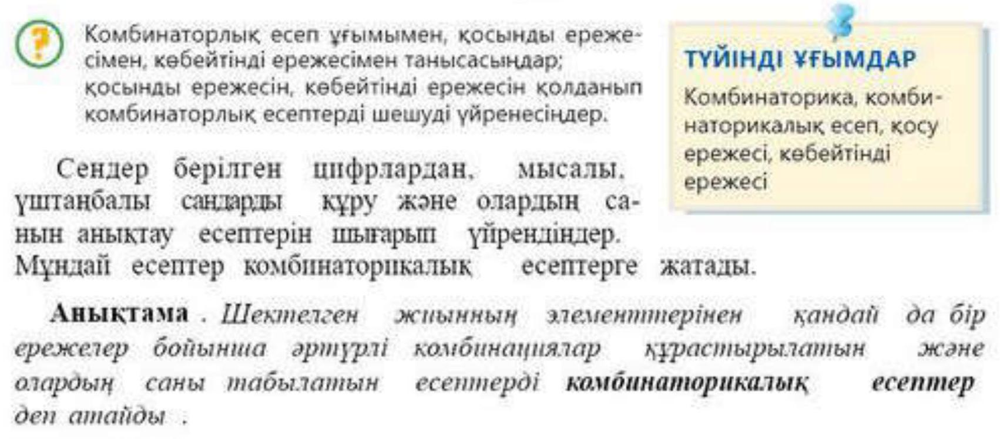

\author{
Комбинаторикалык есетперді карастыратын математиканын бөлігі комбинаторика деп аталады . \\ Комбинаторикалық есетперді карастыратын мапематиканын деп аталады .
}

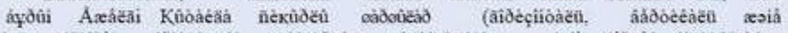
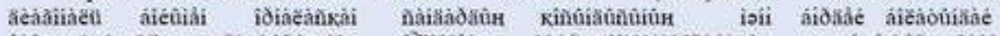
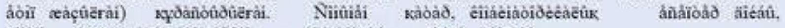
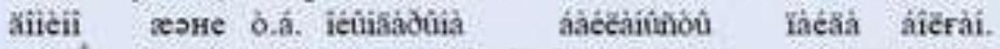
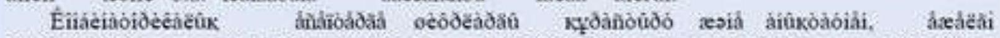
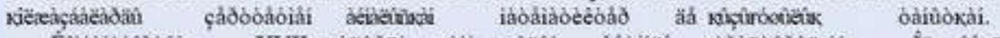
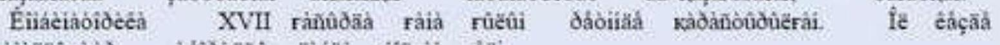
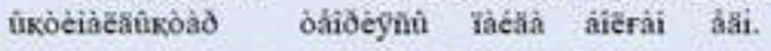

\begin{figure}
\captionsetup{labelformat=empty}
\caption{Сендер мүмкін болатын нұскаларды колдана отырып, комбинаторикалык есептер шығардындар.}
\includegraphics[alt={},max width=\textwidth]{https://cdn.mathpix.com/cropped/b3f159e3-70ef-4ad9-b9e9-0ac5b230efd7-176.jpg?height=124&width=336&top_left_y=2195&top_left_x=242}
\end{figure}
1. Казак, орыс, ағылшын тілдерінін кез кетенінен екінші бір тілге аударма жасауға болатындай канша сездік шығару кажет?
Шешуі . Мүмкін болатыи нұскаларлы. ягии канша сезлік шыгару керектігін былай керсетуте болалы:

\begin{tabular}{|l|l|l|}
\hline казакша-орысша & казакша-ағылшыниа & орысша-казакша \\
\hline орысша-ағылшынша & агылшынша-казакша & агылшынша-орысша \\
\hline
\end{tabular}

Жауабы : 6 сездік.

Егер нұскалар саны көп болса, онда мүмкін болатын нұскаларды колдана отырып есептер шығару кнынға түседі. Сондыктан комбинаторикада комбинаторикалык есептерді шығару ережелері бар.

Кептеген комбинаторикалык есептер косынды ережесі мен кебейтінді ережесі колданылып шығарылады.

Қосынды ережесі екі жнынды біріктіріп элементтер санын табуға мүмкіндік береді.

Егер $X$ және $Y$ жиындарынын ортаж элементі болмаса және $X$ жиынында а этемент, $Y$ жнынында $b$ элемент болса, онда $X$ және $Y$ жнындарыныя бірігуі ( $\hat{a}+b$ ) этеленппен турады.

\section*{МЫСАЛ}
2. Сыныпта 12 кыз бала және 15 ер бала бар. Сыныпта канша окушы бар?
Шешуі , $X$-сыныптағы кыз балалар жныны. $X$ жаваныча 12 этемент бар. $Y$ сыныптағы ер балалар жныны $Y$ жнынында 15 элемент бар. Косындынын ережесі бойынша $X$ және $Y$ жнындарынын бірігуі $12+15$, яғни 27 этементтен тұралы.

Жауабы : 27 окушы.
Егер $X$ жане $Y$ жиындарыныи ортақ элементтер саны с, $X$ жиынында à этемент, $Y$ жиынында $b$ этемент болса, онда $X$ және $Y$ жнындарынын бірігуі ( $\grave{a}+b)-c$ этементтен тұрады.

Расында, $X$ жиынынын элементтер санын $Y$ жпынынын элементтер санымен косса, онда с элементтер саны екі рет косылады, өйткені ол элемент $X$ жнынында да $Y$ жиынында да бар.

\section*{МЫСАЛ}
3. Сыныптыи барлык окушылары жузумен немесе тенние ойнаумен айналысады. 12 окушы жүзумен, 15 окушы тенние ойнаумен, 7 окушы жүзумен де тенние ойнаумен де айнатысалы. Сыныпта канша окушы бар?
Шеиуt . $X$ - сыныптағы жүумен айналысатын окушымр саны. $X$ жнынында 12 элемент бар. $Y$ - сыныптағы тенниспен айналысатын оқушылар саны. $Y$ жнынында 15 элемент бар. Сыныптын 7 окушысы жүзумен де тенниспен де айналысалы. Сондыктан 7 окушы жүзумен айналысатын 12 окушыныи санына да. тенниспен айналысатын 15 окушыным санына да кіреді.

Онда косындынын ережесі бойынша $X$ және $Y$ жнынтарынын бірігуі $12+15-7$, янни 20 элементтен тұрады.

Жауабы : 20 окушы.
Косынды ережесінін екінші тұжырымдамасы:
Егер $a \in A$ этементін $m$ тасілілен, $b \in B$ этементін $n$ тасілімен тандауга болса және А мен В жиындарынын ортаи этементі бочмаса, онда а̀ немесе $b$ этементін $m+n$ тәсілмен тандауга болады .

\section*{МЫСАЛ}
4. Erep бір сатушыда 4 каз, екіиші сатушыда 6 каз болса, онда қазды канша тәсілмен сатып атуга болалы?
Шешуі . А - бірінші сагушыдағы каз саныныи жныны. Онда 4 каз бар. $B$ скінші сатушыдағы каз санынын жныны. Онда 6 каз бар. 1 каз сатып ату керек. Онда косынды ережесі бойынша $4 \div 6=10$.

Жау абы: 10 тосіл.

\section*{МЫСАЛ}
5. Әргүрлі 4 жейде мен эртурлі 3 шалбардан жейде мен шатбардан тұратын канша комплект кұрастырута болалы (22.1-сурет)?

\section*{Шешуй.}

Ж $_{1}$-мен 3 комплект: ж $_{1}$, ш $_{1} ;$ ж $_{1}$, ш $_{2} ; \pi_{1}$, ш $_{3}$.
$\mathbb{K}_{2}$-мен 3 комплект: $\mathbb{T}_{2}, \mathrm{~m}_{1}: \mathbb{T}_{2}, \mathrm{~m}_{2}: \mathbb{M}_{2}, \mathrm{~m}_{3}$,
$\mathbb{W}_{5}$-пен 3 комплект: $\mathbb{\pi}_{3}, \mathrm{~m}_{1} ; \mathbb{\pi}_{2}, \mathrm{~m}_{2} ; \mathbb{\pi}_{3}, \mathrm{~m}_{3}$.
$\mathbb{K}_{4}$-пен 3 комплект: $\overleftarrow{\pi}_{4}, \mathrm{~m}_{1}$ : $\Im_{4}, \mathrm{~m}_{2} ; \Im_{4}, \mathrm{~m}_{3}$ куруға болады.

Барлығы 3 комплектен 4 рет курастыруга болады. ягни $3 \cdot 4=12$ (комплект).

\begin{figure}
\includegraphics[alt={},max width=\textwidth]{https://cdn.mathpix.com/cropped/b3f159e3-70ef-4ad9-b9e9-0ac5b230efd7-178.jpg?height=472&width=621&top_left_y=271&top_left_x=1260}
\captionsetup{labelformat=empty}
\caption{22.1-cyper}
\end{figure}

Мысалда жейдені 4 тәсімен, шалбарды үш тәсіммен тандауга болады. Жейде мен шалбар ждобн $3 \cdot 4$ тэсілмен атута болады.

Жауабы : 12 тэсіл.

\section*{Көбейтінді ережесі:}

Егер $x \in X$ этементін $m$ тасілмен, $y \in Y$ этементін $k$ тасілмен тандауга болса, онда $\boldsymbol{o}^{\text {ждне }} y$ жұбын $m \cdot k$ тәсідмен тандауга болады

\section*{МЫСАЛ}
6. Әргүрлі 5 конверт және эргүрлі 4 марка бар. Маркаларды канша тәсілмен конверттерге желімдеуге болалы?
Шешуі : $X$ - конверттер жиыны, онда 5 конверт; $Y$ - маркалар жныны, онда 4 марка.

Конверт пен маркадан тұратын жұп кұрастырып, ондай жұптардын санын табу керек. Кебейтіндінін ережесі бойыниа $5 \cdot 4=20$.

Жауабы: 20 тесіл.

Көбейту ережесі 3 (4, 5 және т.б.) элементті 3 (4, 5 және т.б.) жныннан табуды кажет ететін жагдайлар үшін де орындалады.

\section*{МЫСАЛ}
7. Егер саннын жазылуындағы шфрлар кайталанбайтын болса, онда 5, 6, 7 шифртарыи колданып, канша үштанбалы сан жазуга болады?
Шешуі . Ізделінді саннын бірінші шифрын үш тосілмен тандауға болады (ол не 5, не 6, не 7 саны болуы мүмкін).

Ізделінді санныи скінші цифрыи екі тосілмен тандаута болады, ейткені санныи жазылуындағы цифртар кайтатанбайды (егер бірінші цифры 5 болса, онда екінші цифры не 6, не 7 саны ботуы мүмкін, егер бірінші цифры 6 болеа, онда скінші шифы не 5 , не 7 саны божуы мүмкін және чесс.).

Ізделінді санныи үшінші цифрыи 1 тосілмен тандаука болады. Сонда кебейтіндінін срежесі бойынша үштанбалы сан $3 \cdot 2 \cdot 1=6$ тәсілмен тандалады.

\section*{Жауабы : 6 үштанбалы сан.}
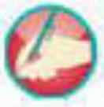

Осы есепті мүмкін болатын нускаларды қарастырып шығарындар және шыққан сандарды жазындар.
1. Комбинаторнкалык есепке мысал кеттіріндер.
2. Кандай жағдайда: 1) косынды ережесі: 2) кебейтінді ережесі колданылады?
3. Мүмкін болатын нұскаларды табу тосілі комбннаторнкалык есептерді шенгу тесілі бола ма?
4. Мүмкін болатыи нұскаларды табу тәсілін кай уакыта колданкан тиімді кай уакытта тнімсіз?

\section*{Жаттығулар}

\section*{A}
22.1. Erep дүкенде алманын 4 түрлі сорты және алмұрттын 3 түрлі сорты болса, онда 1 кг алма немесе алмұртты канша тәсілмен алуға болады?
22.2. Erep дукенде кәмпиттін 8 түрлі сорты және тәтті нанныи 10 түрлі сорты болса, онда 1 кт кәмпит пен 1 кт тәтті нанды канша тәсілмен алуға болады?
22.3. 12 окушы математика және орыс тілі боїынша емпхан тапсырды. Екі емтихан бойынша 1 окушы математикадан, 3 окушы орыс тілінен, 1 окушы екі пәннен емтихан тапсыра алмады. Үлгерімі темен окушылар саны канша?
22.4. Қызғалдактан 7 гүлшоғы, нәркестен 9 гүлшоғы, кызғалдак пен нәркестен 3 гүлшоғы жасалды. Барлығы канша гүлшоғы жасалды?
22.5. 12 окушы дойбыдан, 23 окушы шахматтан, 10 окушы шахмат және дойбыдан жарыска катысты. Осы жарыстарға барлығы канша окушы катысты?
22.6. 42 окушы математикадан, 37 окушы орыс тілінен, 19 окушы екі пән бойынша олимпиадаға катысты. Осы пәндер бойынша олимпиадаға канша окушы катысты?

\section*{B}
22.7. 9 жай және жұп сандардын 7-еуі жай сан, 1-еуі жай жұп сан. Осы 9 саннын каншасы жұп сан?
22.8. 30 санныи ішінде 10 санынан үлкен 20 жай сан, 25 так сан бар. Солардын ішінде канша жай тақ сан бар?
22.9. Тіктертбұрыш, ромб, шаршының барлык саны 17. Онын 10-ы ромб, 9-ы тіктертбұрыш. Шаршынын саны канша?

\section*{C}
22.10. Жауынды күндер саны 15, желді күндер 10, суык күндер 6, жауынды және желді күндер 3, желді және суык күндер 2, жауынды және суык күндер 4. желді, жауынды және суык күндер 2. Ауа райы колайсыз кундердин саны канша?
22.11. Топта 9 оқушы емтиханнан эте жақсы, 15-і жақсы, 7-еуі канағаттанарлык, 6-уы өте жаксы және жаксы, 3-еуі канағаттанарлык және жақсы, 3-еуі өте жаксы және канагаттанарлык, 2-уі өте жаксы, канағаттанарлык және жаксы баға алды. Топтағы окушылар саны канша?
22.12. 80 ашыкхаттын 40 -ында кызғалдак, 20 -сында нәркес, 10 -ында кызгалдак пен серігүл, 5 -еуінде нәркес пен серігүл, 5 -еуінде кызғалдак пен нәркес, 10 -ында кызғалдак, нәркес және серігүл бейнеленген. Серігүл бейнеленген ашыххаттардын саны канша?
22.13. 100 сыйлык жинағынын 50 -інде конфет, 45 -інде жанғак, 35 -інде мандарин, 20 -сында конфет, жанғак, мандарин, 25 -інде конфет және жанғак. 15 -інде жанғак және мандарин болды. Конфет пен мандариннен тұратын сыйлыктын жинағы канша?
22.14. 50 қызметкердін 40-ы казак тілін, 20-сы ағышшы тілін, 10-ы түрік тілін, 15-і казак және ағылшын тілерін, 5-еуі казак және түрік тілдерін, 5-еуі ағылшын және түрік тілерін менгерген. Қанша кызметкер қазак, ағылшын, түрік тілдерін, яғні үш тілді ментерген?

\section*{КАЙТАЛАУ}
22.15. Функциянын графигін салындар және пернодын табындар:
1) $y=\sin (2 x-3)$;
2) $y=\cos \left(\frac{x}{2}-2\right)$;
3) $y=2 \cos \left(x+\frac{\pi}{4}\right)$;
4) $y=\operatorname{tg}\left(\frac{x}{2}-1\right)$.
22.16. Тенсіздікті шешіндер:
1) $5-2 x^{2}>10$;
2) $0<x^{2}-4 \leq 1$;
3) $x^{2}-4|x|<0$.
22.17. Теңсіздікті шешіндер:
1) $\sqrt{x^{2}-4}=2$;
2) $\sqrt{1-2 x^{2}}=4$;
3) $\sqrt{x^{2}-4}=2 x-1$;

\section*{ЖАҢА БІЛІМДІ МЕҢГЕРУГЕ АРНАЛҒАН ТІРЕК ҰҒЫМДАР}

Реттетген жнын, санды жнын, берілген кұрамдагы топтар саны, натурал сандар жиыны.

\section*{§23. КАЙТА.ІАНАТЫН ОРНАЛАСТЫРУЛАР}

\section*{ЖӘНЕ КАЙТАЛАНБАЙТЫН МЕН АЛМАСТЫРУЛАР}

Орналастыру, алмастыру ұғымдарымен, қайталанатын және қайталанбайтын орналастырулар мен алмастыруларды есептеу формулаларымен танысасындар; кайталанатын және қайталанбайтын орналастырулар мен алмастыруларды есептеу фор-

\section*{ТУЙІНДІ ұғымдАР}

Алмастырулар, орналастырулар мулаларын колдануды үйренесіндер.

Әрбір элементінін орнын аныктауды кажет ететін $A=\left\{x_{1}, x_{2}, \ldots, x_{n}\right\}$ жиынын карастырайык. Мұндай реттелген жиындар жай жакшамен жазылады. ( $x_{1}, x_{2}$ ) және ( $x_{2}, x_{1}$ ) жазулары әртүрлі, ейткені оларда элементтердін орналасу реті бірдей емес: $\left(x_{1}, x_{2}\right) \neq\left(x_{2}, x_{1}\right)$. Бірак $\left\{x_{1}, x_{2}\right\}$ және $\left\{x_{2}, x_{1}\right\}$ жнындары бірдей.

Аныктама : $A=\left\{x_{1}, x_{2}, \ldots, x_{n}\right\}$ жиынынын барлык $n$ элементін камтитын реттетген жиындар $n$ этементтен тұратын қайталанбайтын алмастыругар деп аталады .

МЫСАЛ
1. $A=\{1,7,8,9\}$ жицины берілее, (1, 7, 8, 9), (7, 1, 8, 9), (9, 7, 1, 8) жиындары $A$ жиынынын 4 элементінен тұратыи кайталанбайтыи атмастырутар болып табытады.

Бетгітенуі : $P_{n}-n$ элементтен тұратын кайталанбайтын алмастырулар саны.

Теорема $n$ элементтен тұратын кайталанбайтын алмастырутар саны $n!-г а$ тен -
$n!$ (эн факторнал) белгісі 1 -ден $n$-ге дейінгі барлык наурат сандардын көбейтіндісін береді $n!=1 \cdot 2 \cdot 3 \cdot \ldots \cdot n$. Ал $1!=1$ және $0!=1$ деп саналады.
МЫСАЛ
2. $3!=1 \cdot 2 \cdot 3 ; 7!=1 \cdot 2 \cdot 3 \cdot 4 \cdot 5 \cdot 6 \cdot 7$.

Теореманын кыскаша жазыл уы: $P_{n}=n!$.
Дглелдеу $i$. $A=\left\{x_{1}, x_{2}, \ldots, x_{n}\right\}$ жиынынын $n$ элементтен тұратын каїталанбайтын алмастыруларын кұрастыру процесін карастырайык.

Алмастыруды кұрастыру дегеніміз $-A$ жнынынын кай элементі бірінші, кайсысы екінші және т.с.с. болатынын анықтау. А жнынында $n$ элемент болғандыктан, бірінші элементі $n$ тәсілмен, екінші элементті $(n-1)$ тәсімен (себебі элементтер кайталанбайды) тандап алуға болады. Үшінші элементті тандау ( $n-2$ ) тәсілмен тандалады. Осы процесті жалғастыра отырып, $n$-элементті бір ғана тәсілмен тандауға болатынына көз жеткіземіз. Көбейтінді ережесі бойынша барлык $n$ элемент $n \cdot(n-1) \cdot(n-2) \cdot \ldots \cdot 1=n!$ тәсілімен тандалады .

\section*{МЫСАЛ \\ 3. Бір шифр екі рет кайталанбайтындай 1, 3, 4 шифрларынан үш танбалы сандар кұрастырайык.}

Шешуі . $\{1,3,4\}$ жиыны берілен. Жнынды реттеп, алмастырулар санын табу керек: $P_{3}=3!=1 \cdot 2 \cdot 3=6$.

Жауабы: 6.

1,2,3,4 терт шифрын $P_{4}=4!=24$ тәсілмен алмастыруға болады.
Белеленуі : $P\left(n_{1}, n_{2}, \ldots, n_{k}\right)-n$ элементтен тұратын кайталанатын алмастырулар саны, бірінші элемент $n_{1}$ рет, екінші элемент $n_{2}$ рет және т.с.с. $k$-элемент $n_{k}$ рет қайталанады.

Теорема : $\boldsymbol{P}\left(\boldsymbol{n}_{1}, \boldsymbol{n}_{2}, \ldots, \boldsymbol{n}_{k}\right)=\frac{n!}{n_{1}!\cdot n_{2}!\ldots \cdot n_{k}!}$, мұндағы $n=n_{1}+n_{2}+ +\ldots+n_{k}$.

Далелдеу,$X=\left\{x_{1}, x_{2}, \ldots, x_{k}\right\}$ жныны берілсін. Ұзындығы $n$ болатын жолды кұрастырайык, мұнда $x_{1}$ элементі $n_{1}$ рет, $x_{2}$ элементі $n_{2}$ рет, $\ldots$, $x_{k}$ элементі $n_{k}$ рет кайтамнады, яғни
$$
(\underbrace{x_{1}, x_{1}, \ldots, x_{1}}_{n_{1} \text { per }} \underbrace{x_{2}, x_{2}, \ldots, x_{2}}_{n_{2} \text { per }} \underbrace{x_{k}, x_{k}, \ldots, x_{k}}_{\ldots k})
$$

және $n=n_{1}+n_{2}+\ldots+n_{k}$.
Барлык топ $n$ элементтен тұрады. Онын элементтерінін орынарын керсетеміз. Сонда кайталанатын алмастыруларды аламыв. Олардын саны $P\left(n_{1}, n_{2}, \ldots, n_{k}\right)$. Барлығы $n$ ! алмастыру болады.

Элементтер кайталанғандыктан, ортүрлі алмастырулар аз болады. Осы алмастыруларды езгертпейтін элементтердін алмастыру санын табайык. $x_{1}$ элемент $n_{1}$ рет каїталанғандыктан. алмастыруларды өзгертпейтін $x_{1}$ этементінін алмастыру саны $n_{1}$ !, ал $x_{2}-n_{2}$ !, $\ldots, x_{k}-n_{k}$ ! болады.

Берілген алмастыруларды өзгертпейтін $x_{1}, x_{2}, \ldots, x_{k}$ амастырулар саны көбейту ережесі бойынша $n_{1}!\cdot n_{2}!\cdot \ldots \cdot n_{k}!$.

Демек, $n!=P\left(n_{1}, n_{2}, \ldots, n_{k}\right) \cdot n_{1}!\cdot n_{2}!\cdot \ldots \cdot n_{k}!$. Бұдан
$P\left(n_{1}, n_{2}, \ldots, n_{k}\right)=\frac{n!}{n_{1}!\cdot n_{2}!\cdot \ldots \cdot n_{k}!}$, мұндағы $n=n_{1}+n_{2}+\ldots+n_{k}$.

□

\section*{МЫСАЛ 4. "Математика" сезінін эріптерінен канша алмастырулар алуга}
болады?
Шешуі . Берілген сезде 10 эріп, демек $n=10$. " $M$ " эрпі 2 рет кайталанады. $n_{1}=2$, ал " $A$ " грпі 3 рет кайталанады $\quad n_{2}=3$. " $T$ " орпі 2 рет кайталаналы $\quad n_{3}=2$. Калган эріптер 1 реттен кайталанған: $n_{4}=1, n_{5}=1, n_{6}=1$.

Сонда $n_{1}+n_{2}+n_{3}+n_{4}+n_{5}+n_{6}=2+3+2+1+1+1=10$.
$P(2,3,2,1,1,1)=\frac{10!}{2!\cdot 3!\cdot 2!}=\frac{1 \cdot 2 \cdot 3 \cdot 4 \cdot 5 \cdot 6 \cdot 7 \cdot 8 \cdot 9 \cdot 10}{1 \cdot 2 \cdot 1 \cdot 2 \cdot 3 \cdot 1 \cdot 2}=5 \cdot 6 \cdot 7 \cdot 8 \cdot 9 \cdot 10$.
Жауабы : 5-6 • 7 • 8 • 9 • 10 .

Егер кандай да бір жиыннан кайталанатын элементтерді тандау және олардын ретін аныктау кажет болса, онда каїталанатын орналастырулар

туралы айтылғаны. Мысалы, 1, 2, 3 цифрларын колданып, екітанбалы сандарды кұрастыру керек.

Аныктама : $X$ жиыныны $n$ этементінен алынган $k$-дан кұралган орналастыругар деп берітеен $n$ элементтін др тобында $m$ элемент балатын топтарды айтады -

Белгіленуі : $\bar{A}_{n}^{k}-n$ элементтен алынған $k$-дан кұралған орналастырулар саны.

Теорема : $\bar{A}_{n}^{k}=n^{k}$.
Далелдеу $X=\left\{x_{1}, x_{2}, \ldots, x_{n}\right\}$, жныны берілсін және $n(X)=n$. $n$ элементтен алынған $k$-дан құралған орналастыруларды кұрастыру жолын карастырайык. Бірінші элементі $n$ тәсілмен тандаута болады. Элементтер кайталанады. Ендеше екінші элемент $n$ тәсілмен және тс.с. $k$-элемент $n$ тжілмен тандалады. Көбейту ережесі бойынша $k$-элементті $\underbrace{n \cdot n \cdot \ldots \cdot n}_{k \text { per }}=n^{k}$ тәсіммен тандауға болады .

\section*{МЫСАЛ 5. Мидлноннан кіші канша санды 9,8 және 7 цифртары аркылы жазута болалы?}

Шешуі : Миглионнан кіші сандар біртанбалы, екітанбалы. үштанбалы. терттанбалы, бестанбалы және алтытанбалы болады. 9, 8 және 7 шифларынан 3 біртанбалы сан курастырута болады 3 элементтен тұратын $\{9,8,7\}$ жывныни екітанбалы сандарды кұрастыру ушін 2 элемент (олар бірдей болуы мумкін) алып, оларды ретсеу кажет, яни элементтер саны 2-ге тен жнынды курастырамыз Екітанбалы сандар $\bar{A}_{j}^{2}=3^{2}=9$, үштанбалы сандар $\bar{A}_{3}^{2}=3^{3}=27$, герттанбалы сандар $\bar{A}_{3}^{4}=3^{4}=81$, бестанбалы сандар $\bar{A}_{2}^{5}=3^{3}=243$, алтытанбалы сандар $\bar{A}_{3}^{6}=3^{6}=729$. Бардыты: $3+9+27+81+243+729=1092$.

Жауабы : 1092 сан.

Анықтама $n$ этементтен тұратын жиынныя туряi $k$ элешентінен ретпетген жиындарды $n$ этементтен атынган $k$-дан куралган қайталанбайтын орналастыругар деп айтады .

Белгіленуі : $A_{n}^{k}-n$ элементтен алынған $k$-дан кұралған кайталанбайтын орналастырулар саны.

Теорема : $\boldsymbol{A}_{n}^{k}=\frac{n!}{(n-k)!}$ немесе $\boldsymbol{A}_{n}^{k}=\boldsymbol{n} \cdot(\boldsymbol{n}-\mathbf{1}) \cdot(\boldsymbol{n}-\mathbf{2}) \cdot \ldots \cdot(\boldsymbol{n}-k+\mathbf{1})$.
Далелдеу $i, X=\left\{x_{1}, x_{2}, \ldots, x_{n}\right\}$ жныны берілсін және $n(X)=n$.
$n$ элементтен алынған $k$-дан кұралған кайталанбайтын орналастыруларды кұрастыруды карастырайык.

Реттелген жнынныи бірінші элементі $n$ тәсілмен;
екінші элементі ( $n-1$ ) тәсілмен;
үшінші элементі ( $n-2$ ) тәсілмен және т.с.с.
$k$-элементі ( $n-k+1$ ) тәсілмен тандалады.
$k$-элементтерді тандау тәсілінін санын көбейту ережесімен табамыз:
$$
\begin{aligned}
& A_{n}^{k}=n \cdot(n-1) \cdot(n-2) \cdot \ldots \cdot(n-k+1)= \\
= & \frac{n \cdot(n-1) \cdot(n-2) \cdot \ldots \cdot(n-k+1) \cdot(n-k) \ldots \cdot 1}{(n-k) \cdot \ldots \cdot 1}=\frac{n!}{(n-k)!} . \\
& A_{n}^{k}=\frac{P_{n}}{(n-k)!} \text { формуласы акикат. □ }
\end{aligned}
$$

\section*{МЫСАЛ}
6. Қазақ, орыс, ағылшын. француз жэне неміс тілдерінен осы тілдердін ксз келгенінс аударма жасау үшін канша сездік басып шытару керек?
Шешуі : $X=$ \{казак, орыс, агылшыи, француз, неміс\} жэне $n(X)=5$. Реттелген жұптарлы курастыру керек (элементтері кайталанбайды), яғни екі злементтен тұратын реттелген жнынды кұрастырамыз. Мысалы. (казакша, орысша), (орысша. казакша) жэне че.с.

Демек, $A_{5}^{2}=\frac{5!}{(5-2)!}=\frac{5!}{3!}=\frac{1 \cdot 2 \cdot 3 \cdot 4 \cdot 5}{1 \cdot 2 \cdot 3}=20$.
Жауабы : 20 сездік.
1. Комбинаторлык есепке мысал келтіріндер.
2. Қайталанбайтын алмастырулар мен орналастыруларда кандай ұксастык және кандай езгешелік бар?
3. Кайталанатын алмастырулар мен орналастыруларда кандай ұксастык және кандай езгешелік бар?

\section*{Жаттығулар}

\section*{A}
23.1. 1) $n$ элементтен тұратын кайталанбайтын алмастырулар саны кандай формуламен есептеледі?
2) $n$ элементтен (мұндағы $n=n_{1}+n_{2}+\ldots+n_{k}$ ) тұратын кайталанатын алмастырулар саны кандай формуламен есептеледі?
23.2. Есептендер:
1) $P_{4}$;
2) $P_{6}$ :
3) $\frac{P_{7}}{P_{5}}$;
4) $\frac{P_{6}}{P_{8}}$;
5) $\frac{P_{8}}{P_{7}}+\frac{P_{5}}{P_{6}}$;
6) $\frac{P_{9}}{P_{7}}-\frac{P_{7}}{P_{5}}$.
23.3. 1) 3334 саны өзгеретіндей етіп цифрларды алмастыру санын табындар.
2) 3334 саны езгермейтіндей етіп цифрларды алмастыру санын табындар.
3) "Комбинаторика" сезі өзгермейтіндей етіп әріптерді алмастыру санын табындар.
23.4. 1) Бір цифр екі рет кайталанбайтындай етіп 6, 7, 8, 9 цифрларынан кұрастырылатын терттанбалы сандар канша?
2) Үшбұрыш, дентелек және шаршыны түстері әргүрлі болатындай етіп көк, кызыл және сары түстермен бояу тәсілдерінін санын табындар.
3) Жарыска катысушы 7 оїыншыға 7 орынды үлестірудін канша тәсілі бар?
23.5. Есептендер:
1) $A_{7}^{4}$;
2) $\bar{A}_{7}^{4}$ :
3) $A_{5}^{4}$;
4) $\bar{A}_{5}^{4}$.

\section*{B}
23.6. Тендеуді шешіндер:
1) $A_{x}^{1}=2$;
2) $A_{x}^{1}=2 x$;
3) $A_{x}^{2}=2 x$;
4) $A_{x}^{2}=x+8$.
23.7. 1) 20 окушыдан сынып басшысы мен спорт жұмыстарына жауап берушіні тандаудын канша тәсілі бар?
2) $\{3 ; 4 ; 5\}$ бағаларыныи бірін екі окушыға коюдын канша тәсілі бар?

\section*{C}
23.8. 1) 3 фигураны 5 түспен бояудын канша тәсілі бар?
2) 1 және 2 цифрларынын көмегімен жазылатын 1000-нан кіші натурал сандар канша?
23.9. Тендеуді шешіндер :
1) $\bar{A}_{x}^{3}=8$;
2) $\bar{A}_{x}^{4}=16$;
3) $\bar{A}_{x}^{2}=x(x-1)$.
23.10. Тендеудін түбірін табындар :
1) $\bar{A}_{x}^{3}=2 x^{2}+3 x$;
2) $\bar{A}_{x}^{3}=2 x^{2}+8 x$;
3) $\bar{A}_{x}^{3}=2 x^{2}+15 x$.

\section*{KAG̈TAIAN}
23.11. 1) Арбанын алдынғы денгелегінін шенберінін ұзындығы 3 м, арткысынын шенберінін ұзындығы 4,5 м. Егер алдынғы дентелек арткысына карағанда 20 айналым артык жасаған болса, онда арбамен кандай аралык жүрілген?
2) Қар тазалайтын екі мәшне белгілі ауданды бірігіп 12 сағ-та тазалайды. Егер алдымен бірінші мәшине жұмыстын жартысын, калған жұмысты екінші мәшне тазалайтын болса, онда барлык жұмыс 25 сағ-та орындалады. Берілген ауданды әр мәшине жеке канша уакытта тазалайды?
23.12. Тенсіздіктер жүйесінін шешімдер жнынын координаталык жазыктыкта керсетіндер:
1) $\left\{\begin{array}{l}x^{2}-y-2 \leqslant 0, \\ y-|x| \leqslant 0 ;\end{array}\right.$
2) $\left\{\begin{array}{l}x^{2}+y^{2}-16 \leq 0, \\ y-2|x| \geqslant 2 .\end{array}\right.$
23.13. Қосындысынын мәні нелге тен болатындай $18 ; 16 ; 14 ; \ldots$ арифметикалык прогрессиясынын канша мүшесін алу керек?
23.14. Тендеуді шешіндер:
1) $4-\cos ^{2} x=4 \sin x$;
2) $4-5 \cos x-2 \sin ^{2} x=0$.
23.15. Функциянын графигін салындар:
1) $f(x)=2 \sin 2 x$;
2) $f(x)=3 \cos 0,5 x$;
3) $f(x)=1-\sqrt{x+1}$;
4) $f(x)=|2-\sqrt{x+2}|$.

\section*{ЖАНА БІЛІМДІ МЕҢГЕРУГЕ АРНАЛҒАН ТІРЕК ҰҒЫМДАР}

Натураг сандар, факториаг, орналастыругар, агмастыругар, қайтатанбайтын орналастыругар, кайталанбайтын агмастыругар, кайтатанатын агмастыругар мен орнатастыругар.

\section*{§24. ҚАЙТАЛАНАТЫН ЖЭНЕ КАЙТАЛАНБАЙТЫН ТЕРУЛЕР}

Қайталанбайтын және қайталанатын терулер ұғымдарымен, қайталанбайтын терулердің қасиеттерімен танысасындар; қайталанбайтын және қайталанатын терулердін формулаларын, қайта-

\section*{ТЧйІндІ ұғымдАР}

Терулер, жиын, ішкі жиын ланбайтын терулердің ережелерін қолдануды үйренесіндер.

Аныктама. Бартых элементтері әртүрті және орналасуы реттелмеген $k$ элементтен тұратын ішкі жиындар $n$ элементінен алынган к-дан құралган қайталанбайтын теругер деп аталады.

Белгіленуі : $C_{n}^{k}-n$ элементтен алынған $k$-дан кұралған кайталанбайтын терулер саны.

Теорема : $\boldsymbol{C}_{n}^{k}=\frac{n!}{k!\cdot(n-k)!}$.
Дателдеу : $X=\left\{x_{1}, x_{2}, \ldots, x_{n}\right\}$ жныны берілсін және $n(X)=n$. $n$ элементтен алынған $k$-дан кұралған кайталанбайтын терулерді кұрастыру жолын карастырайык. $k$ эпементі тандау мен реттеу $A_{n}^{k}$ тәсілмен жүргізіледі. яғни $\frac{n!}{(n-k)!}$, эйткені теруде элементтердін орналасуы манызды емес, бірак терулер саны $k$ элементтен канша алмастырулар жасалса, сонша есе, яғни $k!$ рет кіші болады: $C_{n}^{k}=\frac{n!}{k!\cdot(n-k)!}$.

\section*{МЫСАЛ}
1. 49 немірден 6 немірді канша тәсілмен тангаута болады? Шешуі : $A=\{1, \ldots, 49\}$ немірлер жныны берілген. Осы жныниан 6 немірді тандау кажег. Немірлерді тандау реті рел аткармайды. Қайталанбайтын терулер санын табамыт:
$$
C_{9}^{6}=\frac{49!}{6!\cdot(49-6)!}=\frac{49!}{6!\cdot 43!}=13983816 .
$$

\section*{Қайталанбайтын терулердін кейбір касиеттері}

1-касиет. $C_{n}^{\circ}=C_{n}^{\mathrm{p}}=1$.
Дляелдеуі. $\quad C_{n}^{0}=\frac{n!}{0!\cdot(n-0)!}=\frac{n!}{n!}=1$.
$C_{n}^{n}=\frac{n!}{n!\cdot(n-n)!}=\frac{n!}{n!}=1$. Ендеше, $C_{n}^{0}=C_{n}^{n}=1$.
МЫСАЛ
2. 1) $C_{3}^{0}=C_{3}^{7}=1$.
2) $C_{4}^{6}=C_{4}^{4}=1$.

2-касиет. $\quad C_{n}^{k}=C_{n}^{w-k}$.
Дагетдеуі. $C_{n}^{k}=\frac{n!}{k!\cdot(n-k)!}$ және $C_{n}^{n-k}=\frac{n!}{(n-k)!\cdot(n-(n-k))!}=\frac{n!}{k!\cdot(n-k)!}$.
Ендеше, $C_{n}^{k}=C_{n}^{n-k}$. □
МЫСАЛ
3. 1) $C_{7}^{3}=C_{7}^{4}$;
2) $C_{9}^{6}=C_{9}^{8}$.

3-касиет. $\quad C_{n}^{k}=C_{n-1}^{k-1}+C_{n-1}^{k}$.
$$
\begin{aligned}
& \text { Дателдеуі. } C_{n-1}^{k-1}+C_{n-1}^{k}=\frac{(n-1)!}{(k-1)!\cdot((n-1)-(k-1))!}+\frac{(n-1)!}{k!\cdot(n-1-k)!}= \\
& =\frac{(n-1)!}{(k-1)!\cdot(n-k)!}+\frac{(n-1)!}{k!\cdot(n-1-k)!}=\frac{(n-1)!}{(k-1)!\cdot(n-k-1)!} \cdot\left(\frac{1}{n-k}+\frac{1}{k}\right)= \\
& =\frac{(n-1)!}{(k-1)!\cdot(n-k-1)!} \cdot \frac{n}{(n-k) \cdot k}=\frac{n!}{k!\cdot(n-k)!}=C_{n}^{k} \cdot
\end{aligned}
$$
МЫСАЛ
4. 1) $C_{7}^{3}+C_{7}^{4}=C_{5}^{4}$.
2) $C_{5}^{2}=C_{4}^{1}+C_{4}^{2}$.

4-касиет. $C_{n}^{0}+C_{n}^{1}+\ldots+C_{n}^{n}=2^{n}$.
Теорема $n$ элементтен тұратын жиыннын $2^{n}$ ішкі жаны бар.
Далегдеуі . Долелдеу математикалык пндукция әдісімен жүргізіледі.
Теореманын $n=1$ болғандағы акикаттығын тексереміз: $C_{1}^{0}+C_{1}^{1}=2 ; \quad 2^{1}=2 ; \quad 2=2$ - тендік тура.
$n=k$ болғанда тұжырым акикат деп есептейміз, яғни $C_{k}^{0}+C_{k}^{1}+\ldots+C_{k}^{k}=2^{k}$.

Енді $n=k+1$ үшін акикат екенін дәлелдейік, яғни $C_{k-1}^{0}+C_{k-1}^{1}+\ldots+C_{k-1}^{k-1}=2^{k-1}$.

Расында, $C_{k}^{0}+C_{k}^{1}+\ldots+C_{k}^{k}=2^{k} . \quad 2\left(C_{k}^{0}+C_{k}^{1}+\ldots+C_{k}^{k}\right)=2 \cdot 2^{k}$. $C_{k}^{0}+\left(C_{k}^{0}+C_{k}^{1}\right)+\ldots+\left(C_{k}^{k-1}+C_{k}^{k}\right)+C_{k}^{k}=2^{k-1}(1-3$-каспеттер бойынша $)$.

Демек, $C_{k+1}^{0}+C_{k-1}^{1}+\ldots+C_{k-1}^{k-1}=2^{k+1}$.
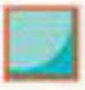

\section*{МЫСАЛ}

Erep жиынныи 5 элементі болса, онда оныи $2^{5}$ ішкі жныны, яғни 32 ішкі жныны ботады.

Қайталанатын терулерді енгізуге әкелетін жағдайды карастырайық. Әртүрлі $n$ түрі бар заттар берілсін. Мысалы, 7 түстен тұратын шарларды алайык (24.1-сурет).

\begin{figure}
\includegraphics[alt={},max width=\textwidth]{https://cdn.mathpix.com/cropped/b3f159e3-70ef-4ad9-b9e9-0ac5b230efd7-188.jpg?height=374&width=1564&top_left_y=794&top_left_x=294}
\captionsetup{labelformat=empty}
\caption{24.1-cyper}
\end{figure}

Егер комбинашидағы $k$ элементтердін орналасуын ескермей, бірак бірдей түрдегі заттар кайталанатын болса, онда осы шарлардан $k$ элементтен тұратын комбинацияларды канша тәсілмен кұруға болатынын карастырайык.

\section*{МЫСАЛ}
6. 10 шар сатып алу керек болсын. Әр түстен 10-нан кем емес шар бар. Түряі нұскалардын арасында 24.2-суретте керсетілендей комобннациятар болуы мүмкін.

\begin{figure}
\includegraphics[alt={},max width=\textwidth]{https://cdn.mathpix.com/cropped/b3f159e3-70ef-4ad9-b9e9-0ac5b230efd7-188.jpg?height=583&width=1424&top_left_y=1690&top_left_x=358}
\captionsetup{labelformat=empty}
\caption{24.2-cyper}
\end{figure}

Аныктама . Бір турдін элементтері бір-бірінен ен болмаганда этементтердін санымен өзгешеленетін $k$ элементтен тұратын ретпегмеген жнынтых эртүриі $k$ титпі $n$ этементпен тұратын қайталанатын теругер деп ататады .

Әртүрлі $k$ типті $n$ элементтен тұратын кайталанатын терулер санынын белгіленуі: $\bar{C}_{n}^{k}$.

Әртүрлі $k$ типті $n$ элементтен тұратын кайталанатын терулер санын аныктауға мысал карастырайык.

МЫСАЛ 7. Бір түсті шарларды сызыклен бөлу аркыты сызба курастырайык: (24.3-сурет).

Ондай топтар саны 7 -ге тен. Сондыктан топтарлы бір-бірінен ажырату ушін 6 таякша керек. Егер 7 түстін біреуінен туратын шарлар болеа, оны таякша аркылы білуге болады. Суреттен барлыпы 10 шар екенін байкаймыз. Әр жағдай ушін таякшалар саны 6-га тен.

Түрті сатып алуға 10 шардан және 6 таякшадан тұратын түрлі комбинациялар сойкес. Керісінше шарлар мен таякшатараын эр комобинациясына бір сатып алу сэйкес келеді.

Сондықтан 10 шардан 7 түсті шар сатып алу тосілдеріни саны $(10+6)$ жементтен тұратын кайталанатын терулер санына тен. Яғни.
$$
\vec{C}_{7}^{10}=P(10 ; 6)=\frac{16!}{10 t \cdot 6!}=\frac{11 \cdot 12 \cdot 13 \cdot 14 \cdot 15 \cdot 16}{2 \cdot 3 \cdot 4 \cdot 5 \cdot 6}=8008 .
$$

Жауабы: 8008.

\begin{figure}
\includegraphics[alt={},max width=\textwidth]{https://cdn.mathpix.com/cropped/b3f159e3-70ef-4ad9-b9e9-0ac5b230efd7-189.jpg?height=572&width=1502&top_left_y=1135&top_left_x=230}
\captionsetup{labelformat=empty}
\caption{24.3-cyper}
\end{figure}

Сонымен, $k$ типті $n$ элементтен тұратын кайталанатын терулер $\bar{C}_{n}^{k}$ терулер санын табу үшін $k$ бірліктен және $n-1$ таякшадан тұратын кайталанатын алмастырулар алынды. Сонда $k$ типті $n$ элементтен тұратын кайталанатын терулер $\bar{C}_{n}^{k}$ терулер саны $k$ бірліктен және $n-1$ таякшадан тұратын кайталанатын алмастырулар, яғни $P(k ; n-1)$ санына тен.
$$
P(k ; n-1)=\frac{(k+n-1)!}{k!\cdot(n-1)!} \text { болғандыктан, } \quad \bar{C}_{n}^{k}=\frac{(k+n-1)!}{k!\cdot(n-1)!}=C_{n+k-1}^{k}
$$

\section*{МЫСАЛ}
8. Дүкенде турлі түсті кагаздардыи 5 сұрпы бар. Сыйлык жасау үшін: 1) 14 парактан: 2) 3 парактан тұратын гурлі түсті кагазды канша тәсілмен сатып алуга болады?

Шешуі . Сыйлык жасау ушін бір түсті немесе турлі түсті каяаз сатып алу ушін: 1) 14 -ті; 2) 3-ті 5 элементтен тұратыи кайталанатыи терулер саныи табу кажет. Мұнда кағаздын түсін тандау реті манызды емес.

Сонымен, кайталатын терулер санын есептейміз:
1) 14 -тi 5 элементтен алу $\bar{C}_{5}^{14}=P(14: 4)=\frac{18!}{14!-4!}=3060$.
2) 3 -ті 5 элементтен алу $\bar{C}_{5}^{3}=P(3 ; 4)=\frac{7!}{4!\cdot 3!}=35$.

Жауабы : 1) 3060 тәсіл. 2) 35 тәсіл.
1. $k$ злементі бар кандай да жнынныи n злементтен тұратын кайталанбайтын терулер осы жныи үшін не болады?
2. Қайталанбайтын терулер мен орналастырулардыи кандай ұксастығы және кандай езгешелігі бар? Кайталанбайтын терулер мен кайталанатын терулердін кандай ұксастығы және кандай езгешелігі бар?
3. 16 ішкі жныны бар жиынныи қанша элементі бар?

\section*{Жаттығулар}

\section*{A}
1) $C_{5}^{4}$;
2) $C_{5}^{6}$;
3) $C_{6}^{2}$;
4) $C_{11}^{4}$.
24.1. Есептендер:
24.2. 1) 5 каламныи 2 -уін және 3 карындаштын 2 -уін тандау тәсілінін санын табындар.
2) 10 раушангүлдін 3-еуін және 7 калампырдын 4-еуін тандау тәсілінін санын табындар.
3) 20 ер баланыи 2-уін және 21 кыз баланыи 2-уін тандау тәсілінін санын табындар.
24.3. Тепе-тендікті далелдендер:
1) $C_{8}^{4}+C_{8}^{3}=C_{9}^{4}$;
2) $C_{8}^{4}+C_{8}^{3}+C_{9}^{6}=C_{10}^{6}$;
3) $C_{6}^{6}+C_{6}^{1}+C_{6}^{2}+\ldots+C_{6}^{6}=64$.

\section*{B}
24.4. Тендеуді шешіндер:
1) $C_{n}^{2}=28$;
2) $C_{n}^{n-3}=20$;
3) $C_{30}^{7}=435$.
24.5. Асхана мәзірінде 7 түрлі сұйык, 9 түрлі кою тағам және 4 түрлі сусын ұсынылған. Сұійк, кою және сусыннан тұратын түскі тамакты канша тәсілмен тандауға болады?
24.6. Тендеуді шешіндер:
1) $C_{2 n+1}^{n-1}: C_{2 n}^{n+1}=\frac{5}{3}$;
2) $A_{2 x+3}^{x-1}: A_{2 x}^{x+1}=\frac{1}{30}$;
3) $C_{n}^{2} \cdot A_{n}^{2}=32$.
24.7. Байланыс белімшесінде ашык хаттын 10 түрі бар.
1) 12 ашық хатты; 2) 8 ашык хатты; 3) әртүрлі 8 ашык хатты канша тәсілмен сатып алуға болады?
24.8. Нан дүкенінде наннын 3 түрі бар. 9 нанды канша тәсілмен сатып алуға болады?

\section*{C}
*24.9. Шенбердін бойында $A_{1}, A_{2}, \ldots, A_{11}, A_{12}$ нүктелері тізбектей белгіленген. 1) Ұштары осы нүктелерде болатын хордалар санын: 2) тебелері осы нүктелерде болатын үшбұрыштар санын: 3) төбелері осы нүктелерде болатын дөнес төртбұрыштар санын табындар.
*24.10. $a$ және $b$ түзулері параллель және $a \neq b$. $a$ түзуінін боїынан 8 нүкте, $b$ түзуінін боїынан 11 нүкте белгіленген.
1) Тебелері осы нүктелерде болатын үшбұрыштар санын: 2) тебелері осы нуктелерде болатын денес тертбурыштар санын (тертбұрыштын үш тебесі бір түзудін бойында жатпайды); 3) тебелері осы нүктелерде болатын, кабырғалары $a$ және $b$ түзулерінде жатпайтын сынықтын өзара кнылыспайтын он алты кабырғасынын санын табындар.
*24.11. Әргүрлі 6 жәшік пен 4 ак және 3 кара шар бар. Әр жәшікте бір шардан болатындай етіп барлык шарды жәшіктерге канша тәсілмен салуға болады?

\section*{КАЙТАЛАУ}
24.12. $f(x)$ функциясынын есу және кему аралыктарын табындар:
1) $f(x)=\frac{2 x}{x+1}$;
2) $f(x)=\frac{3 x}{x^{2}-9}$;
3) $f(x)=\frac{x}{25-x^{2}}$;
4) $f(x)=\frac{x^{2}-9}{x^{2}-4}$.
24.13. Тенсіздікті шешіндер:
1) $\sin x \geq \frac{1}{2}$;
2) $\sin ^{2} x \leq \frac{1}{4}$;
3) $\cos ^{2} x \geq \frac{1}{4}$;
4) $\operatorname{tg} x \leq 1$.
24.14. 24.4-сурете $y=f(x)$ функциясынын графигі берілген. $y=f(x)$ функшисы үшін мына тұжырымдардын кайсысы акикат божмйтьнын керсетіндер: 1) $f(2)=f(4) ;$ 2) функция ( $0 ; 9$ ) аралығында өседі: 3) функция $(2 ; 4)$ аралығында тұракты; 4) $x=2$ нүктесі мпнимум нүктесі; 5) функция $x \in(1 ; 9)$ болғанда өседі.

\begin{figure}
\includegraphics[alt={},max width=\textwidth]{https://cdn.mathpix.com/cropped/b3f159e3-70ef-4ad9-b9e9-0ac5b230efd7-191.jpg?height=319&width=615&top_left_y=2005&top_left_x=1206}
\captionsetup{labelformat=empty}
\caption{24.4-cyper}
\end{figure}

\section*{ЖАНА БІЛІМДІ МЕңГЕРУГЕ АРНАЛҒАН ТІРЕК ҰҒЫМДАР}

Екімуше, дәрежеге шыгару, кыскаша көбейту формулалары, комбинаториканын негізгі этементпері: ачиастыругар, орначастыругар, теругер ждне олардын формуталары.

\section*{§25. ЖУЫКТАП ЕСЕПТЕУТЕ АРНАЛЕАН НАТУРАЛ КӨРСЕТКІШТІ НЬЮТОН БИНОМЫ}

Ньютон биномы, биномдық коэффициенттер; Ньютон биномынын қасиеттері, Σ белгісімен танысасындар;
жуықтап есептеуте арналған натурал көрсеткішті Ньютон биномын қолдануды үйренесіндер.

\section*{ТЧЙІНДІ ұғыМДАР}

Ньютон биномы, екімүше, дәреже, дәреженін көрсеткіші, жұп сан, тақ сан, натурая сан

СЕНДЕР БИАЕСНДЕР:

Сендер кыскаша кебейту формулаларын окыдынар. Атап айтқанда, екімушеніи косындысыныи квадраты $(x+a)^{2}=x^{2}+2 a x+a^{2}$ және екімушеніи косыилысьныи кубы $(x+a)^{3}=x^{3}+3 a x^{2}+3 a^{2} x+a^{3}$.

Екімүшенін косындысынын тертінші дәрежесінін формуласын алу үшін екімүшенін косындысының кубы формуласы мен кепмүшені кепмушеге көбейтуді коднанамыз: $(x+a)^{4}=(x+a)^{3}(x+a)=\left(x^{3}+\right. \left.+3 a x^{2}+3 a^{2} x+a^{3}\right)(x+a)=x^{4}+4 a x^{3}+6 a^{2} x^{2}+4 a^{3} x+a^{4}$.

Осылай жалғастыра отырып, екімүшенін косындысынын $n$-дәрежесінін формуласын алуға болады:
$$
\begin{gather*}
(x+a)^{n}=x^{n}+n \cdot a \cdot x^{n-1}+\frac{n(n-1)}{2!} \cdot a^{2} \cdot x^{n-2}+\ldots+ \\
+\frac{n(n-1) \cdot \ldots \cdot(n-k+1)}{k!} \cdot a^{k} \cdot x^{n-k}+\ldots+a^{n} \tag{1}
\end{gather*}
$$

Енді (1)-формуланын он жак белігіндегі коэффшшенттерді $C_{n}^{2}=\frac{n!}{k!\cdot(n-k)!}$ терулер санымен алмастырсак, (1)-формула мына түрге кешеді:
$$
\begin{align*}
(x+ & a)^{n}=C_{n}^{\infty} \cdot a^{0} \cdot x^{n}+C_{n}^{1} \cdot a^{1} \cdot x^{n-1}+C_{n}^{2} \cdot a^{2} \cdot x^{n-2}+\ldots+ \\
& +C_{n}^{k} \cdot a^{k} \cdot x^{n-k}+\ldots+C_{n}^{n-1} \cdot a^{n-1} \cdot x^{1}+C_{n}^{n} \cdot a^{n} \cdot x^{0} . \tag{2}
\end{align*}
$$
$$
\begin{aligned}
& \text { Мұндағы } C_{n}^{0}=1 ; \quad a^{0}=1 ; \quad C_{n}^{1}=n ; \quad C_{n}^{2}=\frac{n(n-1)}{2!} ; \ldots ; \\
& C_{n}^{k}=\frac{n(n-1) \cdot \ldots \cdot(n-k+1)}{k!} ; \ldots ; \quad C_{n}^{n-1}=n ; \quad C_{n}^{n}=1 ; \quad x^{n-n}=1 .
\end{aligned}
$$
(1) және (2) формулагар Ньютон биномы деп апалады .
"Бином" сезі француз тілінен аударғанда алгебралык екімүше дегенді білдіреді.

Ньютон биномы биномдардын дәрежесін есептеу үшін колданылады.
Ньютон биномынын форухасындаеы коэффициентпер биномиалоы коэффициенттер деп аталады .
(2)-формуланын кыскаша түрі:
$(x+a)^{4}=\sum_{k=0}^{n} c_{n}^{k} \cdot a^{k} \cdot x^{n-k}$, мундағы $\sum$ косу белгісі.

\section*{Ньютон биномыныи касиеттері:}
1) Ньютон биномынын косылғыштарыныи саны биномныи дәреже көрсеткішінен бір санға артык;
2) $x$-тін дәреже керсеткіші $n$-нен нелге дейін кемшді. $a$-нын дәреже көрсеткіші нелден $n$-ге дейін еседі. Әрбір косылғыштын дәрежелерінін көрсеткіштерінін косындысы биномнын дәреже керсеткішіне тен:
3) биномда басынан және сонынан бірдей кашыктыкта орналаскан косылғыштардын коэффишнентері өзара тен:
4) биномнын кез келген мүшесі мына формула аркылы табылады:
$$
\begin{equation*}
T_{k-1}=C_{n}^{k} \cdot a^{k} \cdot x^{n-k}, \tag{3}
\end{equation*}
$$

мұндағы $k$-нын мәні 0 -ден $n$-ге дейін езгереді;
5) erep $x=a=1$ болса, онда $2^{n}=\sum_{k=0}^{n} C_{n}^{k}=C_{n}^{0}+C_{n}^{1}+\ldots+C_{n}^{k}+\ldots+C_{n}^{n}$, яғни Ньютон биномыныи коэффициенттерінін косындысы $2^{n}$-іне тен;
6) егер биномнын дәреже көрсеткіші так натурал сан болса, онда бином қосылғыштарыныи саны жұп; егер биномныи дәреже керсеткіші жұп натурал сан болса, онда бином косыпғыштарынын саны так болады;
7) коэффициенті ен үлкен болатын биномныи косылғышы ортангы муше деп аталады. Егер биномнын дәреже көрсеткіші так сан болса, онда жіктелуде екі ортанғы мүше, ал биномнын дәреже көрсеткіші жұп сан болса, онда жіктелуде бір ортанғы мүше болады.

МЫСАЛ
1. $(x+a)^{3}$ ернегінін дорежесін кепмуше турінде жазайық.

Шешуt $(x+a)^{5}=x^{3}+5 \cdot a+x^{4}+\frac{5 \cdot 4}{1 \cdot 2} \cdot a^{2} \cdot x^{3}+\frac{5 \cdot 4 \cdot 3}{1 \cdot 2 \cdot 3} \cdot a^{3} \cdot x^{2}+$
$+\frac{5 \cdot 4 \cdot 3 \cdot 2}{1 \cdot 2 \cdot 3 \cdot 4} \cdot a^{4} \cdot x+\frac{5 \cdot 4 \cdot 3 \cdot 2 \cdot 1}{1 \cdot 2 \cdot 3 \cdot 4 \cdot 5} \cdot a^{5} \cdot x^{0}=x^{5}+5 a x^{4}+10 a^{2} x^{3}+10 a^{3} x^{2}+5 a^{4} x+a^{5}$.
Жауабы: $(x+a)^{5}=x^{5}+5 a x^{4}+10 a^{2} x^{3}+10 a^{3} x^{2}+5 a^{4} x+a^{5}$.

\section*{МЫСАЛ \\ 2. $(x+a)^{25}$ биномынын тертінші жэне жиырмасыншы мүшелерін табайык.}

Шешуі . Бнномныя тертінші және жиырмасыншы мүшетерін табу үшін (3)-формуланы колданамыз:
$$
T_{3+1}=C_{25}^{8} \cdot a^{3} \cdot x^{22}=2300 a^{3} x^{22} \text { және } T_{19+1}=C_{25}^{19} \cdot a^{19} \cdot x^{6}=177100 a^{19} x^{6} .
$$

Жауабы: $T_{4}=2300 a^{3} x^{22} ; T_{20}=177100 a^{19} x^{6}$.
Ньютон биномыныи формулаларын жуыктап есептеу үшін колдануға болады. Кеп жагдайда формуланын тұтас емес, кандай да бір бөлігі колданылады. Атап айтканда, егер Ньютон биномынын $(x+a)^{n}= =\sum_{k=0}^{n} C_{n}^{k} \cdot a^{k} \cdot x^{n-k}$ формуласында $a=1$ алмастыруын енгізсе, онда келесі тендік шығады:
$$
\begin{equation*}
(1+x)^{n}=1+C_{n}^{1} x+C_{n}^{2} x^{2}+\ldots+C_{n}^{n-1} x^{n-1}+C_{n}^{n} x^{n}, \tag{4}
\end{equation*}
$$
$x$-тін мәні үлкен болмаған жағдайда, яғни $|x|<1$ болғанда $x^{2}, x^{3}, \ldots, x^{n}$ мәндері де ете кіші болады. Сондыктан $(1+x)^{n}$ ернегінін жуык мәнін алу үшін (1)-формуладан $x^{2}, x^{3}, \ldots, x^{n}$ мүшелері бар косылғыштар алынып тасталады. Сонда $(1+x)^{n} \approx 1+C_{n}^{1} x$. Мұндағы $C_{n}^{1}=n$ болғандыктан $(1+x)^{n} \approx 1+n x$.

\section*{ЕСТЕ САҚТАНДАР}

Жуыктап есептеу формуласы: $(1+x)^{n} \approx 1+n x$.

\section*{МЫСАЛ}
3. $1.002{ }^{5}$ ернегінін монін есептейік. Шешуі . $(1+x)^{n} \approx 1+n x$ формуласын қолданамыз: $1,002^{1}=(1+0,002)^{5} \approx 1+5 \cdot 0,002=1+0,01=1,01$.

Жауабы : $1.002{ }^{5} \approx 1.01$.
Жуыктау кателігін табамыз. Берілген ернектін монін калькуяятордын кемегімен есептейміз: $1,002^{5}=1,0100400801$. Сонда есептеудегі кателіктін шамалы екенін байкаймыз: $1,0100400801-1,01=0,0000400801$.
1. Қандай түрлендірулерде Ньютон биномы колданылалы?
2. "Бином" сезі. Σ белгісі нені білліреді?
3. Биномдык коэффициент не болып табылады?

\section*{Жаттығулар}

\section*{A}
25.1. Дәрежені кепмүше түрінде жазындар:
1) $(x+a)^{5}$;
2) $(3 x+2 a)^{6}$;
3) $(3 x-a)^{5}$.
25.2. Биномнын жіктелуіндегі $x^{n}$-нін коэффициентін табындар:
1) $(x+2)^{10}, n=3$;
2) $(1-2 x)^{7}, n=4$;
3) $\left(\sqrt{x}-\frac{2}{x}\right)^{8}, n=-5$.
25.3. $(a+b)^{11}$ Ньютон биномынын биномналды коэффишенттерінін косындысын табындар.

\section*{B}
25.4. Тепе-тендікті далелденцер:
1) $\sum_{h=0}^{n}(-1)^{h} C_{n}^{k}=0$;
2) $\sum_{k=1}^{n} k C_{n}^{k}=n \cdot 2^{n-1}$;
3) $\sum_{k=1}^{n}(-1)^{k-1} k C_{n}^{k}=0$.
25.5. $\left(3+\frac{1}{\sqrt{2}}\right)^{n}$ биномынын жіктелуіндегі тертінші косылыштын үшіншісіне қатынасы $3 \sqrt{2}$-ге тен болса, онда $n$-ді табындар.
25.6. Өрнектін жуык мәнін табындар:
1) $1.02^{11}$;
2) $1,022{ }^{15}$;
3) $0.98^{8}$;
4) $0,97^{12}$.

\section*{C}
25.7. $\left(2 n a+\frac{1}{2 n a^{2}}\right)^{3 n}$ жіктелуінін биномиалды коэффищиентерінін қосындысы 64-ке тен. Кұрамында $a$ болмайтын косылғышты табындар.
25.8. $\left(\frac{1}{a}+\sqrt{a}\right)^{n}$ биномыныи жіктелуіндегі бесінші косылғышыныи курамында $a$ ернегі болса, онда $A_{n}^{2}$-ні табындар.
25.9. Тепе-тендікті дәлелдендер :
1) $C_{n}^{1}+2 \cdot C_{n}^{2}+3 \cdot C_{n}^{3}+\ldots+n \cdot C_{n}^{n}=n \cdot 2^{n-1}$;
2) $C_{n}^{0}+2 \cdot C_{n}^{1}+3 \cdot C_{n}^{2}+\ldots+(n+1) \cdot C_{n}^{n}=(n+2) \cdot 2^{n-1}$.

\section*{КАЯТАЛАУ}
25.10. Функцияныи аныкталу облысын табындар:
1) $y=\sqrt{10-3 x-x^{2}}$;
2) $y=\frac{x}{\sqrt{2 x^{2}-x-3}}$;
3) $y=\arcsin \frac{1}{x}$;
4) $y=\arccos \sqrt{x}$.
25.11. 15-кестені толтырындар:

15- кесте

\begin{tabular}{|l|c|c|c|c|c|c|}
\hline \begin{tabular}{l} 
Астык енімділігі \\
(ига)
\end{tabular} & 9-11 & 11-13 & 13-15 & 15-17 & 17-19 & 19-21 \\
\hline \begin{tabular}{l} 
Шаруашымыктар \\
саны
\end{tabular} & 4 & 6 & 11 & 5 & 3 & 1 \\
\hline \begin{tabular}{l} 
Жннақталтан \\
жнілк
\end{tabular} & & & & & & \\
\hline
\end{tabular}
1) Қанша шаруашылыктын енімділігі 17 ц/га-дан кем емес?
2) Қанша шаруашылыктын өнімділігі ен кіші болған?
3) Шаруашылыктардын басым кепшілігінін енімділігі кандай?
25.12. Тендеуді шешіндер:
1) $2 \cos 2 x+2 \sin x \cos 2 x=1+\sin x$;
2) $4 \sin ^{2} x \cos ^{2} x=2$.
25.13. Футболдан болған турнирге 6 команда катысты. Егер турнир айналма жүйе түрінде етсе, онда барлығы канша ойын болған?
25.14. Сыныптаға 27 окушыдан үш окушыны тандап алу керек. Erep: 1) біріншісі тригонометриялык тендеуді шығара алуы тніс, екіншісі бор экелуге баруы керек, үшіншісі сыныпта кезекші болуы тис: 2) олардын бәрі би билеуі тніс болса, онда үш окушыны канша тәсілмен тандауға болады?

\section*{ЖАНА БІЛІМДІ МЕҢГЕРУГЕ АРНАЛҒАН ТІРЕК ҰҒЫМДАР}

Окига, этементар окига, жиілік, сатыстырматы жиілік, ыктиматдык, статнстика, статистикалык ыктималдык, ылтималдыятын ктассикатык аныктамасы.

\section*{§26. ОКИҒАНЫН ЫКТИМАЛДЫҒЫ ҚАСИЕТТЕРІ}

Кездейсоқ окиға ұғымымен, кездейсоқ оқиғанын түрлерімен танысасындар;
кездейсок оқиғаларға мысалдар келтіруді; ыктималдықтын касиеттерін қолданып, кездейсок окиғанын ыктималдығын табуды; комбинаторика формулаларын колданып, ықтималдыкқа есептер шығаруды үйренесінаер.
Окиғанын орындалатыны немесе орындалмайтыны туралы айтуға болатын кұбылысты түсінеміз.

\section*{\section*{ЖӘнЕ ОНЫН \\ \\ ЖӘНЕ ОНЫИ}}

\section*{ТУЙІндІ ¥ғымдАР}

Кездейсок оқиға, мүмкін емес окиға, акикат окиға, ыктималдык, тенмүмкіндікті окиғалар, үйлесімсіз окиғалар, қарама-карсы окиғалар

\section*{МЫСАЛ}
1. 1) Танертен жанбыр жауалы; 2) оныншы сынып окушылары "Алгебра және анализ бастамалары" пәнін окиды; 3) шыршада алма еседі; 4) телефон сокканда абонент бос болмайды: 5) уакытты ор мезетіндегі телефон согудын саны; 6) агу барысындағы нысанаға тигізу.

Тәжірибенін, бакылау мен өлшеулердін нәтижесі де окнға болады.

\section*{МЫСАЛ}
2. 1) Лактыру барысында тиынныи "елтанба" жагымен түсуі: 2) лактыру барысында тиыннын "сан" жағымен түсуі.

Тәжірибе жүргізу дегеніміз карастырылатын окиғалардын (нәтиженін) орындалу немесе орындалмау шарттарынын жныны.

Шарттар жныны бірнеше рет кайталанган жағдайда тжерпбетер тоттамасы туралы айтылады.

Окиғалар $A, B, C$ және тб. әріптерімен белгіленеді.
Окиғалар акикат, кездейсок және мүмкін емес окиғ аларға белінеді.

\begin{tabular}{|l|l|l|}
\hline \multicolumn{3}{|c|}{Окнғалар} \\
\hline Акикат & Кездейсок & Мүмкін емес \\
\hline Тәжірибе барысында міндеті түрде орындалатын окиға акикат окнға деп аталады. & Тәжірибе барысында орындалатын немесе орындалмайтын окиға кездейсок окнға деп аталады. & Тожірибе барысында орындалмайтын окига мумкін смес окиға деп аталады. \\
\hline
\end{tabular}

\section*{МЫСАЛ}
3. Кездейсок окигаларлын мысалы болатын окига:
1) тнынды лактыру барысында "еттанба" жағымен түсуі бір жагдайларда орындалатын тәжірнобемен, екінші бір жағдайларда орындалмайтын тәжірибелермен байланысты:
2) "танертен жанобыр жауады" окиғасыныи бір жағдайларда орындатуы. екінші бір жагдайларда орындатмауы ауа райциа байланысты.

Акикат окиганын мысалы болатын окнға:
1) "оныншы сынып окушытары "Алгебра жэне анализ бастаматары" пэнін окиды":
2) "күзаен кейіи кыс келеді".

Мүмкіи емес окинаныи мысалы болатыи окига:
1) "бес тенгелік тиынды лактырганда скі тентелік тныи түседі":
2) "маусымнан кейін кантар болзды".

Тәжірнбе нәтижесінде түрлі кездейсок окнғалар болуы мүмкін. "Ойын сүйегін лактырғанда терт саны түсті" окиғасы элементар окиға болады. Себебі оны жай окиғаларға белуге болмайды. "Ойын сүйегін лактырғанда так сан түсті" окиғасы элементар окща болмайды, себебі оны одан жай окиғаларға белуге бо-
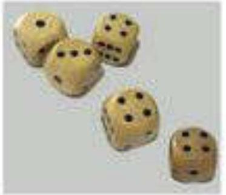
лады. Атап айтканда келесі окиғаларға бөлуте болады: "Ойын сүйегін лактырғанда бір саны түсті", "Оїын сүйегін лактырғанда үш саны түсті". "Ойын сүйегін лактырғанда бес саны түсті".

Аныктама. Элементар оқига деп жай окиеатареа бөлуге бодмайтын окиганы айтады .

Аныктама. Тәжірибе нәтижесінде ізделінді окиганын орындатуын қолайлы натиже деп атайды .

МЫСАЛ
4. Сыныпта 25 окушы бар. Онын $17-\mathrm{ci}$ ер бала, $A$ окигасы: "Кездейсок тандалган окушы ер бала болды". $A$ окитасын беретін колайлы нотиже саны 17 -ге тен.

Егер кандай да бір жныннан бір элемент тандалып, калған элементтерге тандалған элементпен салыстырғанда артыкшылык берілмесе, онда жныннын эр элементіне тандалуға тен мүмкіндік камтамасыз етіледі (тен мүмкіндік кағшасы). Мүндай окиғалар тенмүмкіндікті окигалар деп аталады.

Аныктама. Орындазуына бәріне бірдей мумкіндік берілетін тәжірибетер натижесі теңмумкіндікті нәтижелер деп аталады -

\section*{МЫСАЛ}
5. Тенмүмкіндікті окигалардыи мысалы:

A: "Ойыи суйегіи лактырганда 1 саны тусті":
B: "Ойыи суйегін лактырганда 2 саны густі";
С: "Ойыи суйегіи лактырганда 3 саны тусті":
D: "Ойын сүйегін лактырганда 4 саны густі":
E: "Ойын сүйегін лактырганда 5 саны түсті":
F: "Ойын суйегіи лактырганда 6 саны түсті".
Тәжірнбе барысында екі окиға бірдей орындалатын болса, онда мұндай окнғалар уйлесімбі ожиеалар деп аталады.

Тәжірнбе барысында екі окиганын біреуі екіншісінін орындалуын жока шығарса, онда мүндай окиғалар учтесімсіз окиеалар деп аталады.

\section*{МЫСАЛ}
6. Екі мерген нысанага аткандагы үйлесімді окиталар:

A: "Бірінші мергенніи нысанаға тигізуі":
B: "Екінші мергениін нысанага тигізуі".
Ойыи сүйегіи бір рет лактыргандағы үйлесімсіз окичалар:
A: "Ойын сүйегіи лактырганда 5 саныныи түсті":
B: "Ойын сүйегін лактырғанда 6 саныныи тусті".
Аныктама. А ожигасы орындалмаганда пайда болатын окига $A$ оқигасына карама-карсы окига деп аталады .
$A$ окиғасына карама-карсы окиғанын белгіленуі: $\bar{A}$.

\section*{МЫСАЛ}
7. Қарама-карсы окиғалар жұбы:
- "Атқан кезде нысанаға титізу" жэне "Аткан кезде нысанага тигізбеу":
— "Жуйенін барлык злементтерінін бірдей жумыс аткаруы" және "Жүйенін бір элементінін жумыс істемеуі":
— "Лактырганда тиыннын "елтанба" жағымен түсуі" және "Лактырғанда тиыннын "сан" жағымен түсуі".

Жасыл, сары және көк шартары бар жәшіктен бір шар ату тэжірибесі барысында орындалған "Жэшіктен кек шар алынды" окиғасына карама-карсы окиға "Жошіктен алынған шар кек емее", яғни сары немесе жасыл шар алынды.

Акикат окиғанын белгілеуі: $U$.
Мүмкін емес окиғанын белгілеуі: V.
$$
\bar{U}=V, \bar{V}=U .
$$

Іс жүзінде бір жағдайда бір емес бірнеше тәжірнбе жүргізіледі. Тәжірибелер саны кеп болуы мүмкін. Қандай да бір окиғанын пайда болуынын жнілігін аныктау үшін тәжірибелер санын ұлгайтады.

СЕНДЕР БЛАЕСІНДЕР:

Мысалы, и тэжірибе барысында қандай да бір окига $k$ рет орындалсын. Онда бакыланып отырған окиганыи жиілігі $\frac{k}{n}$-ге тен болады.

СЕНДЕР БИАЕСІЯДЕР:

Окнтаныи пайда болу санынын жүргізілген тәжірибелер санына қатынасы окиганыя жиіліді деп аталады.

Неліктен кез келген оқиғаның жиілігі 0 мен 1-дің аралығында орналасқан? Мүмкін емес және ақиқат оқиғаның жиілігін табындар.

СЕНДЕР БМАЕСІНДЕР:

Егер тәжірибе нотижелерінін пайда болу мукіндіктері тен және езара тәуелсіз болса, онда $A$ окнғасынын орындалуына колайлы нэтижелер саныныи барлык нәтижелер санына катынасы $A$ окиеасынын пайда богу ықтиматдыгы деп аталады.

Ыктималдык латын әліпбиінін $P$ бас әрпімен белгіленеді (мүмкіндік, ыктималдык деген мағына беретін француз тілінін "probabilite" сөзінін бірінші әрпінен алынған).

\section*{$A$ окиғасынын ыктималдығы $P(A)$ символымен белгіленеді.}

CEHAEP БИЕСІНДЕР:
$A$ окигасынын ыктималдыты темендегі формуламен есептеледі: $P(A)=\frac{m}{n}$, мұндағы $m \mathrm{~m}_{n ; m, n} \in N, m$ - тәжірибенін $A$ окигасына қолайлы нэпие лер саны, $n$ - бартык нотижелер саны.

\section*{МЫСАЛ}
8. Тиынды лактырғанда $A$ - "елтано̆а жағынын гүсуі" және $B$ - "сан жағыныи түсуі" болса, онда $P(A)=0.5 . P(B)=0.5$ немесе $P(A)=50 \%, \quad P(B)=50 \%$.

\section*{ТЧСІНДІРІНДЕР}

Here $A$ окигасыныи ыктималдыгы онын жніліне чткас 0 мен 1 сандарыныи арасында жатады: $0 \mathrm{mP(A)} \mathrm{~m} 1$ ?

\section*{МЫСАЛ}
9. Ойын сүйегін лактырғанда $x$ - "жай санныи гусуі" окиғасынын ыктималдығын табайык.
Шешуі : $X$ окиғасыныи ыктималлыныи табу ушін келесі формуланы кодданамыз: $P(X)=\frac{m}{n} \cdot m$ - тэжірибенін $A$ окиғасына колайлы нотижелер саны, $n$ - барлык нэтижетер саны.

Тожірибе нэтижесінде $1 ; 2: 3: 4: 5: 6$ сандары түсуі мүмкін және осы сандардын ішінде жай сандар тек 2; 3;5, сонлыктан $n=6, m=3$. Олай болеа, $P(X)=\frac{3}{6}=0.5$.

Жарабы: 0.5 .

\section*{МЫСАЛ}
10. Корапта 10 ак және 8 кызыл шар бар. Кезлейсок 8 шар алынды. Алыиған шарлардыи екеуі ак, біреуі кызыл шар болуыныи ыктималдыгыи табыидар.
Шешуі . Окиғанын ыктималдығын табу үшін $n$ және m мәндерін табу керек. Элементар окигаларлын жали саны $n=C_{18}^{3}, n=C_{10}^{2}, C_{1}^{1}$, ейткені 10 ак шар мен 8 кызыл шардан алымады.

Енді ктасснкатык ыктималдыктын аныктамасын колданамыз: $P=\frac{m}{n}$.
Демек, $P(A)=\frac{C_{10}^{2} \cdot C_{8}^{3}}{C_{18}^{3}}=\frac{10!}{2!\cdot 8!} \cdot \frac{8!}{1!\cdot 7!} \cdot \frac{3!\cdot 15!}{18!}=\frac{15}{34}$.
Жауабы : $\frac{15}{34}$.

\section*{Ыктималдыктын касиеттері}

1-касиет. Адикаm окиганы⿱艹 ыктималдығы 1-ге тен.
2-касиет. Мүмкін емес немесе жазан окизанын ыкпиалдығы 0-ге тен.

3-касиет. Толык топты курайтын окиғанын ыктималдығы 1-ге тен.
4-касиет. Карама-қарсы окизанын ыктналдығы 1 мен берілген окиға ыктиалцығыныи айырмасына тен, яғни $P(\bar{A})=1-P(A)$.

Окиғанын ыктималдығынын дығын тәжірнбе жасамай-ак, табуға болады.

маныздылығы - окнғанын ыктималлогикалык талдаулар жасау аркылы логикалык талдаулар жасау аркылы
1. Қандай жағдайларда окиғанын ыктималлығын тәжірибе жасамай-ак табуға болады?
2. Окиғанын ықтнмалдығы кандай мәндерге тен бола атады?

\section*{Жаттығулар}

A
26.1. Ойын сүйегін лактырған кезде 1-ден 6-ға дейінгі сандар түседі. Темендегі окиғалардын ыктналдыктарын табындар:
1) 2 санынын түсуі;
2) 1 немесе 2 санынын түсуі;
3) 4 немесе 6 санынын түсуі;
4) жұп саннын түсуі.
26.2. a) Қорашшада 2 ак және 5 кызыл шар бар. Корашшадан кездейсок алынған бір шардын: 1) ак; 2) кызыл; 3) жасыл болуынын ыктималдығын табындар.
ә) Корашшада 3 кызыл және 9 кек шар бар. Корашшадан кездейсок алынған бір шардын: 1) ак емес; 2) кызыл; 3) көк болуынын ықтималдығын табындар.
26.3. Тәжірпбе: ойын сүйегі лактырыллы. $A, B$, және $C$ окиғаларын карастырайык. $A=$ ройын сүйегінін жоғарғы жағындағы сан 12-ге белінеді $\}, B=\{$ ойын сүйегінін жоғарғы жағындағы сан 2-ге тен $\}$, $C=\{$ оїын сүйегінін жоғаржы жағындағы сан 2-ге белінеді\}. Төмендегі тендіктердін кайсысы дурыс? Жауаптарынды түсіндіріндер:
1) $P(A)=1$;
2) $P(A)=0$;
3) $P(C)=0,5$;
4) $P(\bar{B})=\frac{5}{6}$;
5) $P(B)=\frac{1}{6}$.
26.4. 1) Сыныпта 25 окушы бар. Олардын ішінде 5 окушы "өте жаксы", 12 окушы "жаксы", 6 окушы "канағаттанарлык" деген бағаға, ал 2 окушынын үлгерімі "темен". Сыныптан кездейсок тандап алынған бір окушы бағасынын "өте жаксы" немесе "жаксы" болуынын ыктималдытын табындар.
2) 25 емтихан билетінін ішінде 5 "женіл" билет бар. Екі окушы кезекпен бір билеттен алады. Бірінші окушынын "женіл" билетті алуынын ыктималдығын табындар.
26.5. 100 лоторея билетінін 15 -інде ұтыс бар. Бір билет сатып алынған. Сатып алынған бшлетте:
1) ұтыс болуынын; 2) ұтыс болмауыныи ыктималдығын табындар.

\section*{B}
26.6. Екі ойын сүйегі лактырылды. Түскен сандардын көбейтіндісі 1) 5; 2) 6 санына тен болуынын ыктпмалдығын табындар.
26.7. 1) Бір тиын екі рет лактырылды. Ен болмағанда бір рет "елтанба" жағымен түсуінін ыктюмалдығын табындар.
2) Бір тнын үш рет лактырылды. Екі рет "елтанба" жағымен түсуінін ыктимадығын табындар.
26.8. 16-кестеде бір күн ішінде Алматыдан шығатын пойыздарға сатылған билеттер женінде мәліметтер келтірілген.

\begin{table}
\captionsetup{labelformat=empty}
\caption{16- кесте}
\begin{tabular}{|l|l|l|l|l|}
\hline Пойыздын гипі & Жүйрік пойыз & Жүрдек пойыз & Жолаушылар пойызы & Қала манына катынайтын пойыз \\
\hline Бір күнде сатылган битеттер саны & 150 & 445 & 734 & 896 \\
\hline
\end{tabular}
\end{table}

Кезекті жолаушы: 1) жүйрік пойызға; 2) жолаушылар пойызына: 3) қала манына катынайтын поїызға билет сатып алуынын ыктималдығын табындар.
26.9. Емтиханға 1 -ден 25 -ке дейін немірлентен билеттер дайындалған. Бір окушынын кездейсок алған билетінін немірі: 1) бір орынды сан: 2) екі орынды сан болуынын ыктпмалдығын табындар.
26.10. Кездейсоқ екітанбалы сан тандап алынды. Төмендегі окиғалардын ыктималдыктарын табындар: 1) алынған сан 0 -мен аякталады; 2) алынған сан бірдей цифрлардан кұралған; 3) алынған сан 27 -ден артык, 46-дан кем; 4) алынған сан бүтін санныи квадраты болмайды.

\section*{C}
26.11. 100 лоторея билетінін 10 бшетінде ұтыс бар. Бес билет сатып алынған. Сатып алынған билеттердін арасында екеуі ұтысы бар билеттер болуынын ыктималдығын табындар.

\section*{ХАБАРЛАМА ДАЙЫНДАНДАР}
26.12. XVII ғасырдың ортасына дейін кездейсоқ кубылыстарды зерттеу тек сандык сипатта болды.
XIX ғасырда ықтималдықтар теориясы практикалық қолданысы бар есептерді шығару үшін пайдаланыла бастады.
Қазіргі уақыта ықтималдыктар теориясы әртүрлі процестер мен кубылыстар анализінде қолданылады. Ыктималдыктар теориясы біртекті коғамдык кубылыстар бағынатын сандық зандылықтарды зерттейді, сондықтан қоғамдық кубылыстарды болжауға мүмкіндік береді.

\section*{КАЙТАЛАУ}
26.13. Тендеуді шешіндер:
1) $\arcsin (2-x)=-\frac{\pi}{3}$;
2) $\arccos (1-2 x)=\frac{\pi}{2}$.
26.14. Шахмат турниріне 10 ойыншы катысты. Егер турнир денгелек тәртіппен ұйымдастырылса, онда барлығы канша ойын болды?
26.15. Сыныпта барлығы 27 окушы, онын ішінде кыз балалардын саны 15. Женіл атлетикадан жарыска катысу үшін бір окушыны тандау керек. Тандап алынған окушынын: 1) ер бала; 2) кыз бала болуынын ыктималдығын табындар.

\section*{ЖАҢА БІЛІМДІ МЕңГЕРУГЕ АРНАЛҒАН ТІРЕК ҰҒЫМДАР}

Сынак, окиеа, кездейсок окига, кездейсок оқиганын жиілігі, ызтиматдық, статистика, статистикатық маліметтер, бас жиынтык, тандама, статистикалых корытынды.

\section*{§27. ШАРТТЫ ЫКТИМАЛДЫК. ЫКТИМАЛДЫКТАРДЫ КОСУ ЖЭНЕ КӨБЕЙТУ ЕРЕЖЕЛЕРІ}

Шарты ықтималдык, ықтималдықтарды қосу және көбейту ережелерімен танысасындар; ықтималдықтар теориясынын ыктималдықтарды қосу және көбейту ережелерін қолдануды үйренесіндер.

\section*{ТЧЙІНДІ ¥ғымдАР}

Оқиғалар қосындысы, окиғалардын көбейтіндісі, шартты ықтималдык

\section*{1. Уйлесімсіз окнғалардын косындысыныи ыктималдығы}

Аныктама $A$ нешесе $B$ окигаларына muicmi болатын этементар окигатардан кұралган окиеа $A$ ждне $B$ оқигаларыныи қосынымсы деп аталады және $A+B$ символымен белгіленеді .

МЫСАЛ
1. Корапшада 30 шар бар: 15 кызыл, 10 кек, 5 жасыл. Кездейсок алынган бір шардын жасыл болмауынын ыктималдығыи табындар (А окигасы).
Егер алынған шар кызыл ( $B$ окиғасы) немесе кек түсті ( $C$ окитасы) болеа, онда $A$ окиғасы орындатады, яғни $A$ окиғасы үйлесімсіз $B$ және $C$ окиғаларынын косыидысына тен. Сондыктаи $P(A)=P(B+C)=P(B)+P(C)=\frac{15}{30}+\frac{10}{30}=\frac{5}{6}$.

Аныктама : $A$ және $B$ окигагарына тиісті болатын элементар ожигалароан кұрагая окиза $A$ ждне $B$ оқигаларынын көбейтіноісі деп аталады және $A B$ символымен белгіленеді .

\section*{МЫСАЛ}
2. Егер тиын мен ойын сүйегін бірге лактырса, онда тнын "елтанба" жағымен және ойын сүйегінде "5" санынын тусуінін ыктималдығын табындар.
"Елганов" түсуінін ыктималдығы $\frac{1}{2}$, "5" санынын түсуінін ыктималдығы $\frac{1}{6}$. Осы екі окичаныи кебейтіндісініи ыктиматдығы: $\quad P(A B)=P(A) \cdot P(B)=\frac{1}{2} \quad \frac{1}{6}=\frac{1}{12}$. Жауабы : $\frac{1}{12}$.

Егер $m-A$ окцасына колайлы, орындалу мүмкіндіктері бірдей элементар окиғалар саны, $k-A$ окиғасымен үйлесімді емес $B$ окнғасына колайлы, орындалу мүмкіндіктері бірдей элементар окнғалар саны, $n$ - толык топты кұрайтын орындалу мүмкіндіктері бірдей барлык элементар окиғалар саны болса, онда $P(A)=\frac{m}{n}$, және $P(B)=\frac{k}{n}$.
$A+B$ окнғасынын аныктамасы "A немесе B орындалады" деген мағынаны береді. Мүндай окиғаға колайлы, орындалу мүмкіндіктері бірдей элементар окиғалар саны $m+k$, сондыктан $P(A+B)=\frac{m+k}{n}=\frac{m}{n}+\frac{k}{n}$, яғніI $P(A+B)=P(A)+P(B)$.

\section*{ЕСТЕ САКТАНДАР}

Сонғы тендік окиғалардын кез келген саны үшін лурые болады.

\section*{ЕСТЕ САКТАНДАР}

Өзара үйлесімсіз окналардын косындысыныи ыктналдығы олардын ыктималдыктарыныи косындысына тен.

\section*{2. Уйлесімсіз окиғалардыи косындысыныи ыктималдығы}
$m-A$ окнғасына колайлы, орындалу мүмкіндіктері бірдей элементар окнғалар саны, $k-B$ окиғасына колайлы, орындалу мүмкіндіктері бірдей элементар окналар саны және $m+k$ элементар окщаларынын ішінде $A$ окиғасына да. $B$ окиғасына да колайлы элементар окиғалар саны, $q, n$ - толык топты курайтын орындалу мүмкіндіктері бірдей барлык элементар окналар саны болсын. Онда $P(A)=\frac{m}{n}, P(B)=\frac{k}{n}$, $P(A B)=\frac{q}{n}$.
$A+B$ жазуы: " $A$ окнғасы немесе $B$ окшғасы немесе екеуі де" орындалатынын білдіреді. Мұндай окиғаға $(m+k-q)$ элементар окнға колайлы болып табылады. Сондыктан:
$P(A+B)=\frac{m+k-q}{n}=\frac{m}{n}+\frac{k}{n}-\frac{q}{n}$, янни $P(A+B)=P(A)+P(B)-P(A B)$.
Бул формула $P(A+B)=P(A)+P(B)$ формуласынын жалпыламасы болып табылады.

\section*{ЕСТЕ САҚТАНДАР}

Өзара үйлесімсіз екі окитаныи косындысыныи ыктналдығы олардыи бірдей орындалу ыктималдығыи алмагандағы осы екі окиганыи ыктималдыктарынын косындысына тен.

\section*{МЫСАЛ 3. Бір тэжірибе нэтнжесінде орындалатыи бір-бірімен байланысты екі окиғаны карастырайык.}

Тажірибе: Корапта 3 ак, 2 кара шар бар. Әуелі кездейсоқ бір шар. содан кейін кездейсок тапы бір шар алынды.

А окигасы: бірінші алынган шардыи түсі ак.
$B$ окигасы: скінші алыиган шардын түсі ак.
$A$ окигасыныи ыктималдыгыи, вгии $P(A)$-ны табайык.
Аныктама бойынша: егер тэжірибе нотижелерінін пайда болу мүкіндіктері тен және өзара тәуелсіз болеа, онда $A$ окиғасынын орындалуына колайты нәтижелер $m$ санынын барлык нотижелердін $n$ санына катынасы $A$ окцеасыныя пайда багу ыжтиматдыеы деп аталады, яғни $P(A)=\frac{m}{n}$, Якни $m$ және $n$ сандарын табамыз.

Егер кораптан бірінші шар алынса, онда $m=3, n=5$ болады, сондыктан $P(A)=\frac{3}{5}$.
Егер $A$ окигасы орындалса, онда корапта 2 ак, 2 кара шар калалы. Онда $B$ окинасынын орындалу ыктималдығы: $\frac{2}{4}=\frac{1}{2}$.

Егер $A$ окигасы орындалмаса, онда корапта 3 ак. 1 кара шар калады. Онда $B$ окитасыныи орындалу ыктималдығы: $\frac{3}{4}$. Сонымен, $B$ окигасыныи орындалу ыктималдығы $A$ окитасыныи орындатуы немесе орындалмауына тәуелді болады екен. Мундай жагдайда:
1) $B$ окитасы $A$ окигасынан тәуелді:
2) В окитасынын орындалу ыктималдығы tмартmы деп аталады.

Анықтама - Бір окиганын орындапганы белгілі болган жагдайда екіниі ожиганын орындагу ыктималоызы шартты ыктималоық деп аталады.

Белгіленуі : A окнғасынын орындалғаны белгілі болған жағдайда $B$ окиғасынын орындалуынын шартты ыктималдығы $P(B / A)$ снмволымен белгіленеді.

Біздін мысалда $P(B / A)=\frac{1}{2}$.

\section*{ТУСІНДІРІНДЕР}
$P(A / B)$ жазуы нені білдіреді?

Жогарыдағы мысалға оралайык. Алынған екі шардын да ак болуынын. яғни $A$ және $B$ окцғаларынын көбейтіндісінін ыктималдығын табайык. Берілген мысалда $A$ және $B$ окиталары тәуелді окиғалар: $B$ окиғасынын орындалу ыктималдығы $A$ окнғасынын орындалуына немесе орындалмауына тәуелді. Тәуелді окнғалардын ыктмалдыктарын есептеу формуласын әзірге білмейміз. Осы формуланы корытып шығарайык.
$A$ окиғасы (бірінші алынған шар ак) орындалған жағдайда $B$ окиғасынын (екінші шардын ак болуы) орындалу ыктималдығын, яғни $P(B / A)$ шамасын табу үшін $A$ және $B$ окиғаларынын екеуіне де (бірінші алынған шар да, екінші алынған шар да ак) колайлы элементар окналар санын және ак шарлардын санын білу керек. $A B$ окиғасына колайлы элементар окигалар саны $d, A$ окигасына колайлы элементар окцалар саны $m$ және барлык элементар окцалар саны $n$ болсын. Сонда
$$
\begin{gather*}
P(B / A)=\frac{d}{m}=\frac{\frac{d}{n}}{\frac{m}{n}}=\frac{P(A B)}{P(A)} .  \tag{1}\\
P(A / B)=\frac{P(A B)}{P(B)} \tag{2}
\end{gather*}
$$

тендігінің орындалатынына көз жеткізіндер.
Аныктама $A B$ окигасына когайты этементар окигатар санынын $B$ окигасына колайты элементар ожнгалар санына ჯатынасы $B$ окигасы орындалган жагдайда А окигасынын шартты ыктималоыгы деп аталады (B озигасынын шартты ықтнматдыгынын анықтамасына ұжас) .
(1) және (2) формулаларын колдансак;
$$
\begin{align*}
& P(A B)=P(A) \cdot P(B / A),  \tag{3}\\
& P(A B)=P(B) \cdot P(A / B), \tag{4}
\end{align*}
$$

Ереже : Екі окиғанын көбейтіндісінін ыктималдығы бірінші окиғанын ыктималдығы мен екінші окиғанын бірінші окиға орындалған жағдайдағы шартты ықтималдығынын көбейтіндісіне тен.

Өзіміздін мысалға оралайык. Алынған екі шардын да ак түсті болуынын ыктималытын, яғни $P(A B)$ шамасын табайык. (3)-формуланы және жоғарыда табылған $P(A)=\frac{3}{5}$ және $P(A / B)=\frac{1}{2}$ мәндерін ескерсек:
$$
P(A B)=\frac{3}{5} \cdot \frac{1}{2}=\frac{3}{10}=0,3 .
$$

Егер $A$ және $B$ окиталары езара тәуелсіз болса, онда
$$
\begin{equation*}
P(A B)=P(A) \cdot P(B) . \tag{5}
\end{equation*}
$$

Ереже: Екі езара тәуелсіз окиғалардын ыктналдығы олардын ыктималдыктарынын көбейтіндісіне тен болады.

\section*{МЫСАЛ}
4. Бір тэжірнов нэтижесінде орындалатын бір-бірімен байланысты екі окиганы карастырайык. Екі ойын сүйегі лактырыллы. Бір ойын суйегінде "3" саныныи тусуінін, екінші ойын суйегінде жұп санныи тусуінін ыктималдығын табындар.

Шешуі . Келесі окиғаларды карастырайык:
$A$ окигасы: бір ойын сүйегінде "3" санынын түсуі.
В окнасы: екінші ойын сүйегінде жұп саннын түсуі.

\section*{ТЧСІНДІРІҢАЕР}

Неге $A$ және $B$ окиғалары эзара тәуелсіз болады?

\section*{МЫСАЛ}
5. Ойын сүйегіи лактырғандағы барлық мүмкін жағдай саны 6 . Себебі 1, 2, 3, 4, 5, 6 сандарынын біреуі түсуі мумкін. Сондыктан $P(A)=\frac{1}{6}, 1,2,3,4,5,6$ сандарыныи үшеуі жұп болгандыктан, $\quad P(B)=\frac{3}{6}=\frac{1}{2}$.

Есептін шарты бойынша бір уакытта скі ойын сүйегін лактырады, сондыктан $P(A B)$ шамасын табамыз. $A$ және $B$ езара тәуелсіз болнандыктан, $P(A B)=P(A) \cdot P(B)= =\frac{1}{6} \cdot \frac{1}{2}=\frac{1}{12}$.

Жауабы : $\frac{1}{12}$.
1. Қаидай жағдайда окиганыи ыктималдытыи тэжірибе жасамай-ак табуга болады?
2. Окнганын ыктималдығы кандай мәндерге тен бола алады?
3. Өзара үйлесімсіз окиғалардын ыктималдыктарынын косындысын есептеу мен езара тәуелеіз окиғалардын ыктималдыктарынын кебейтіндісін есептеудін ұксастығы неде?

\section*{Жаттығулар}

\section*{A}
27.1. Кез келген ретпен екі $P$ әрпі және екі $H$ әрпі жазылған.
1) $P$ әрпі сонғы жазылған; 2) $H$ әрпі екінші жазылған;
3) $H$ әрпі бірінші жазылған жағдайда екі $H$ әрпі катар тұруынын ыктималдығын табындар.
27.2. 100 лотерея билеттерінін ішінде 10 билет ұтыс билеті болып табылады.
1) Кездейсок алынған екі билет ұтыс билеттері болуынын ыктималдығын табындар.
2) Кездейсок алынған екі билеттін тек біреуі ұтыс билеті болуынын ыктималдығын табындар.
27.3 Қорапта терт шар бар: көк, жасыл және екі кызыл. Қораптан кездейсок екі шар алынады.
1) Алынған екі шардын кызыл болуынын;
2) бірінші алынган шардын жасыл, екінші алынған шардын кызыл болуынын ыктималдығын табындар.
27.4. Бірінші корапта 6 кызыл және 4 сары, екінші корапта 5 кызыл, 5 сары шар бар. Әуелі кездейсок бір корап тандап алынады, содан кейін тандап алынған кораптан кездейсок бір шар алынады.
1) Алынған шардын кызыл болуынын; 2) алынған шардын екінші кораптан алынған болуынын ыктималдығын табындар.
27.5. Екі аткыш нысанаға бір-бірден ок атады. Бірінші аткыштын нысанаға тигізу ыктпмалдығы 0,7 , екінші аткыштын нысанаға тигізу ыктималдығы 0,7 . Екі аткыштын да нысанаға ок тигізу ыктималдығын табындар.
27.6. 100 лотерея билеттерінін ішінде 10 билет ұтыс билеті болып табылады. Осы билеттердін шінен кездейсок 3 билет сатып алынады $A, B, C$, окнғаларын келесі түрде аныктайық: $A$ - бірінші бнлет ұтады: $B$ - екінші билет ұтады; $C$ - үшінші билет ұтады. Тек үшінші билеттін ұтуынын ыктималдығын табындар.
27.7 Екі кораптын әркайсысында 5 текше бар: 2 көк, жасыл, ак және қызыл. Әуелі, кездейсок бір корап тандап алынады, содан кейін тандап алынған кораптан кездейсок бір текше тандап алынады. 1) Алынған текшенін ак болуынын; 2) екінші корап тандап алынып, одан алынған текшенін көк болуынын ыктималдығын табындар.
27.8 Кілті бұраған кезде козғалткыштын іске косытуынын ыктмалдығы 0,9 . Козғалткыш оталу үшін кілті ен кеп дегенде 3 рет бұрау ыктималдығын табындар.

\section*{B}
27.9. Үш станокта жұмыс істеп отырған оператор белгілі бір уакытка үзіліс жасады. Станоктардын осы уакытта жұмысшыны қажет етпеуінін ыктималдыктары $0.7 ; 0.8 ; 0.8$. Оператор болмаған кезде бірде-бір станоктын жұмысшыны кажет етпеуінін ықтималдытын табындар.
27.10. Кернеуді арттырған кезде тізбектей жалганған үш кұрылғынын істен шығу ықтималдыктары - 0,4; 0,3; 0,5. Кернеу артқан кезде электр тізбегінін істен шықпауынын ыктималдығын табындар.
27.11. 1) Нысанага екі аткыш бір мезетте ок атты. Бірінші аткыштын нысанаға ок тигізу ыктималдығы 0,7 , екінші аткыштын тигізу ыктималдығы 0,8 . Екеуі катар аткан кезде тек бір аткыштын тигізу ыктималдығын табындар.
2) Екі аткыш бір-бірінен тәуелсіз нысаналарға ок атты. Бірінші аткыштын нысанаға ок тигізу ыктималдығы 0,9 , екінші аткыштын тигізу ыктималдығы 0.8 . Нысанаға ен болмағанда бір аткыштын ок тигізу ыктималдығын табындар.
27.12. 100 лотерея билетінін ішінде 20 ұтыс билеті бар.
1) Кездейсок алынған үш билеттін барлығы ұтыс билеттері болуынын ыктималдығын табындар.
2) Кездейсок тандап алынған екі билеттін ішінде ұтыс билеттері болуынын ыктималдығын табындар.
27.13. Бір уакытта екі ойын сүйегі лактырылды. Түскен сандардын: 1) екеуі де 2; 2) 3 және 4 болуынын ыктмалдыктарын табындар.
27.14. Өндіріс орнында дайындалған тетіктін іске жарамды болуыныи ыктималдығы $\frac{92}{100}$. Іске жарамды тетіктердін ішінен кездейсок алынған тетіктін бірінші сорты болу ыктималдығы $\frac{72}{100}$. Барлык тетіктердін ішінен кездейсок алынған тетіктін бірінші сорты болуынынц ыктималдығын табындар.
27.15. Жәшікте 2 ак, 3 кызыл, 5 жасыл шар бар. Жәшіктен кездейсок алынған шардын: 1) кызыл немесе жасыл; 2) ак немесе кызыл болуынын ыктималдығын табындар.

\section*{C}
27.16. 1) Қорапта 7 ак, 3 кызыл шар бар. Кораптан кездейсок екі шар алынады. Бірінші ак немесе кызыл бір шар алынғаннан кейін алынған екінші шардын ак болуынын ыктималдығын табындар. 2) Қорапта 30 шар бар. Онын ішінде 1 ак, 5 кызыл, 10 көк, 14 жасыл шар. Қораптан кезекпен үш шар алынады, бірак корапка кайта салынбайды. Бірінші алынған шардын кызыл, екінші шардын көк, үшінші шардын жасыл болуынын ыктималдығын табындар.
27.17. Егер окушы койылған екі сұрактын біреуіне жауап берсе, онда ол емтиханды тапсырған болып есептеледі. Емтиханға барлығы 40 сұрак дайындалған, окушы ол сұрактардын ішінде 8 сұрактын жауабын білмейді. Окушынын емтиханды тапсыруынын ыктималдығын табындар.
27.18. 10 лотерея билетінін ішінде 4 бшет ұтыс билеті болып табылады. Кездейсок сатып алынған 4 билеттін ен болмағанда біреуі ұтыс билеті болуыныи ықтималдығын табындар.
27.19. Үш дос кездесуге келісті. Олардын кездесуге келулерінін ыктималдыктары $p_{1}=0,8 ; p_{2}=0,4 ; p_{3}=0,7$. Кездесуте үшеуінін екеуі немесе үшеуінін де келуінін ыктималдығын табындар.
27.20. 1) Бес паракшада і, к, п, а, т әріптері жазылған. Паракшаларды кезекпен алып, алынған ретпен орналастырады. Нәтижесінде "кітап" сезінін пайда болу ыктималдығын табындар.
2) Тоғыз паракшада д. а, а, а, с, т, р, х, н әріптері жазылған. Паракшаларды кезекпен алып, алынған ретпен орналастырады. Нәтижесінде "дастархан" сезінін пайда болу ыктималдығын табындар.
27.21. Кұрылғыны жинау үшін үш станоктан шыкқан тетіктер кажет. Бірінші, екінші, үшінші станоктардан шыкқан тетіктердін жарамсыз болу ыктмалдығы сәйкес $0,002,0,003,0,004$. Егер кұрыпыны жинаута бірінші станоктан 250 тетік, екінші станоктан 200 тетік, үшінші станоктан 100 тетік алынтан болса, осы тетіктердін арасында жарамсыз тетік бар болуынын ыктималығын табындар.

\section*{ХАБАРЛАМА ДАЙЫНДАНДАР}
27.22. 1718 жылы шарты ықтималдык ұғымын енгізген және ыктималдықтарды көбейту теоремасын келтірген ағылшын математигі А. Муавр болып табылады.
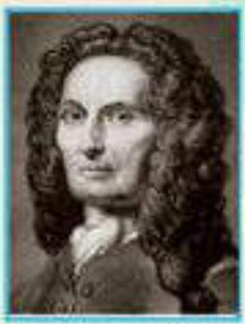

Абрахам де Муавр (1667-1754)

\section*{KARTAJAY}
27.23. Екі оїын сүйегін лактырған кезде темендегі окиғалар кандай окнғалар болып табылады (жалған, акнкат немесе кездейсок):
1) бірінші ойын сүйегінде 5 түсті, екіншісінде 1 түсті;
2) екі ойын сүйегінде түскен сандардын косындысы 1-ге тен:
3) екі ойын сүйегінде түскен сандардын косындысы 11-ге тен:
4) екі ойын сүйегінде түскен сандардын косындысы 14 -тен кем?
27.24. Қазақ тілі окулығынын кез келтен бетін ашып, сол жак бетіндегі екінші сез тандап алынады. Темендегі окнғалардын түрлерін аныктандар: 1) тандап алынған сез "Ә" немесе "K" әрпінен басталады; 2) тандап алынған сез "Б" эрпінен басталады.
27.25. 1) "Тан атты"; 2) "бүгін кесте бойынша 10 сабак"; 3) "бүгін 1 кантар": 4) "Алматы каласында ауа температурасы $+35^{\circ}$ " окиғалары аркылы үйлесімді окиғалар жұбын және үйлесімсіз окигалар жұбын кұрындар.
27.26. Кепмүшені көбейткіштерге жіктендер:
1) $x^{3}-3 x+2$;
2) $x^{3}+2 x^{2}-9 x-18 ;$
3) $x^{3}-3 x^{2}+2 x-6$.
27.27. Берілген цифрлар ішінен кездейсок алынған цифрдын жұп болу ыктималдығын табындар:
1) $1 ; 2 ; 3 ; 6 ; 7 ; 9 ;$
2) $0 ; 3 ; 4 ; 5 ; 6 ; 7 ; 9$.

\section*{ЖАҢА БІЛІМДІ МЕҢГЕРУГЕ АРНАЛҒАН ТІРЕК ҰҒЫМДАР}

Ожига, уйтесімсіз окиеа, ыжтмалдых; статистика, статистикатых матіметтер, бас жиынтых; тандама, статистикатыб корытынды.

\section*{§28. ТОЛЫК БКТИМАЛДЫК ФОРМУЛАСЫ. БАЙЕС ФОРМУЛАСЫ}

Толык ыктималдык Байес формулаларымен танысасындар; оларды есептер шығаруда қолдануды үйренесіндер.

Егер $A$ окиғасы үйлесімсіз окнғалардын толык тобын кұрайтын $B_{1}, B_{2}, \ldots, B_{n}$ окиғаларыныи бірі орындалғанда орындалатын

\section*{ТУЙІНДІ ¥ғымдАР}

Толық ықтималдық формуласы, Байес формуласы, апостериорлы ыктималдык, априорлы ыктималдық болса, онда $A$ окиғасынын ыктималдығы төмендегі формуламен есептеледі:
$$
P(A)=P\left(B_{1}\right) P\left(A / B_{1}\right)+P\left(B_{2}\right) P\left(A / B_{2}\right)+\ldots+P\left(B_{n}\right) P\left(A / B_{n}\right) .
$$

\section*{ЕСТЕ САҚТАНДАР}

Бұл формула толых ыктималдых форыуласы деп ататалы.

\section*{МЫСАЛ}
1. Дүкенге үш ендіріс орнынан жана тауар түсті. Барлык енімніц: бірінші турдегі тауар - $20 \%$, екінші турдегі тауар $30 \%$, үшінші түрдегі тауар - $50 \%$ кұрайды. Жогарғы сұрыпты тауардын улесі: бірінші ендіріс орнында - $10 \%$, екінші ендіріс орнында - $5 \%$, үшінші ендіріс орнында - $20 \%$. Кездейсоқ сатып алынған тауарлыи жоғарғы сұрыпты болуынын ыктималлығын табындар.

Шешуі. Сатып алынган тауардын бірінші сұрыпты болуыи $B$, ол тауардын бірінші. екінші. үшінші ондіріс орындарынан сатып алынуын. сойкес $A_{1}, A_{2}, A_{3}$. симводларымен белгілейік. Онда
$$
\begin{array}{ll}
P\left(A_{1}\right)=0,2 ; & P\left(B / A_{1}\right)=0,1 ; \\
P\left(A_{2}\right)=0,3 ; & P\left(B / A_{2}\right)=0,05 ; \\
P\left(A_{3}\right)=0,5 ; & P\left(B / A_{3}\right)=0,2 .
\end{array}
$$

Табылған мәндерді толык ыктималдык формуласына койсак:
$$
P(B)=0,2 \cdot 0,1+0,3 \cdot 0,05+0,5 \cdot 0,2=0,135 .
$$

Жауабы : 0,135.
Ыктималдыктары сэйкес $P\left(B_{1}\right), P\left(B_{2}\right), \ldots, P\left(B_{n}\right)$ болатын $B_{1}, B_{2}, \ldots$, $B_{n}$ үйлесімсіз окиталарыныи толык тобын карастырайык.
$A$ окиғасы zmотезалар деп аталатын $B_{1}, B_{2}, \ldots, B_{n}$ окиғаларыныи кемінде біреуімен катар орындалатын болсын.

Онда толык ыктималдык формуласы бойынша:
$$
P(A)=P\left(B_{1}\right) P\left(A / B_{1}\right)+P\left(B_{2}\right) P\left(A / B_{2}\right)+\ldots+P\left(B_{n}\right) P\left(A / B_{n}\right) .
$$
$A$ окнғасынын орындалуы гипотезалардын $P\left(B_{1}\right), P\left(B_{2}\right), \ldots, P\left(B_{n}\right)$ ыктималдыктарыныи мәндерін өзгертеді. Ыктималыктарды көбейту формуласы бойынша:
$P\left(A B_{1}\right)=P\left(B_{1}\right) P\left(A / B_{1}\right)=P(A) P\left(B_{1} / A\right)$, будан $P\left(B_{1} / A\right)=\frac{P\left(B_{1}\right) P\left(A / B_{1}\right)}{P(A)}$.
Дәл осылай, баска да гипотезалар үшін темендегі формулаларды аламыз: $P(B / A)=\frac{P\left(B_{i}\right) P\left(A / B_{i}\right)}{P(A)}, i=1, \ldots, n$.

\section*{ЕСТЕ САҚТАНДАР}

Сонғы формула Байес (Бейес) формуласы деп аталады.
$P(B / A)$ шамалары апостернорты ыктималдыятар (тәжірнбеден кейін бағаланган) деп аталады, шамалары априорты ықтималдыстар (тәжірибеге дейін бағаланған) деп аталады.

\section*{МЫСАЛ}
2. Yш аткыштыи нысанага екі рет ок агуга мүмкіндігі бар. Бір атканнан брінші апыштын нысанага тигізу ыктималдыты - 0.3 . скінші аткыштын тигізу ыктималаығы - 0.5 , үшінші аткыштын тигізу ыктималдығы - 0.8 . Егер нысанаға ок тимегені белгілі болеа, онда окты бірінші аткыштын атуынын ыктималдығын табындар.

Шешуї. Үш гипотеза жасаймыз:
$A_{1}$ - бірінші аткыштын атуы.
$A_{2}$ - екінші аткыштын атуы.
$A_{3}$ - γшінші аткыштын атуы.
Үш аткыштын да нысанага ок ату мумкіндіктері бірдей болғандыктан:
$P\left(A_{1}\right)=P\left(A_{2}\right)=P\left(A_{3}\right)=\frac{1}{3}$.
Егер нысанага октын тимеуін $B$ окнасы десек, онда жасалган гипотезалар негізінде $B$ окигасынын орывдатуыныи шартты ыктималлыпы:
$$
\begin{aligned}
& P\left(B / A_{1}\right)=0,7 \cdot 0,7=0,49 ; \\
& P\left(B / A_{2}\right)=0,5 \cdot 0,5=0,25 ; \\
& P\left(B / A_{3}\right)=0,2 \cdot 0,2=0,04 .
\end{aligned}
$$

Байес формуласын колданып, тэжірибеден кейін $A_{1}$ гипотезасынын орындату ыктималдығын табамыз:
$$
P\left(A_{1} / B\right)=\frac{0.49 \cdot \frac{1}{3}}{\frac{1}{3} \cdot 0.49+\frac{1}{3} \cdot 0.25+\frac{1}{3} \cdot 0,04}=\frac{0,49}{0,78} \approx 0,628 .
$$

Жауабы : 0,628.
1. Толык ыктнмалдык формуласы кандай жағдайда колданылады?
2. Байес формуласы кандай жағлайла колданылалы?
3. Байес формуласын жазындар. Неге бұл формуланы гипотезалар формуласы деп атайды?

\section*{Жаттығулар}

\section*{A}
28.1. Yш корапта шарлар бар. Бірінші корапта 4 кызыл, 3 сары, екінші корапта 5 кызыл, 2 сары, үшінші корапта 2 кызыл, 5 сары. Кездейсок бір корап тандап алынады да, тандап алынған кораптан кездейсок бір шар алынады. 1) Алынған шардын кызыл болуынын: 2) кызыл шардын екінші кораптан алынуынын ыктималдығын табындар.
28.2. Ок ату жарысына үш аткыш катысады. Нысанаға окты бірінші аткыштын тигізу ыктималдығы - 0,3 , екінші аткыштын тигізу ыктмалдығы - 0,8 , үшінші аткыштын питізу ыкпиалығы- 0,5 . Егер үшеуінін біреуі атып, нысанаға ппізгені белгілі болса, онда окты үшінші атқыштын атуынын ыктмалдығын табындар.
28.3. Оператор бір-біріне тәуелсіз үш станокпен жұмыс істейді. 1 сағ ішінде станоктардын оператордын кызметін кажет етпеу ыктималдыктары сәйкесінше біріншісі 0,9-ға, екіншісі 0,8-ге, үшіншісі 0,8-ге тен. Бір сағат ішінде:
1) бірде-бір станок оператордын кызметін қажет етпеу;
2) кем дегенде бір станоктын оператор кызметін кажет етпеуі ыктималдығын табындар.
28.4. Мұғалім геометрия пәнінен емтиханға 25 бшлет дайындады. Окушы тек 20 билетке дайындалды. 1) Окушы емтиханға бірінші кірсе; 2) окушы емтиханға екінші кірсе, онда емтиханды тапсыру ыктималдығын табындар.
28.5. Тиынды 8 рет лактырғана "сан" жағынын 8 рет түсу ыктималдығын табындар.

\section*{B}
28.6. Құрылғы жасауға кажет тетік екі цехтан келеді: бірінші цехтан - $70 \%$, екінші цехтан - $30 \%$. Бірінші цехта дайындалған тетіктердін ішінде $10 \%$-ы жарамсыз, екінші цехта дайындалган тетіктердін ішінде $20 \%$-ы жарамсыз. Егер кездейсок алынған тетіктін іске жарамды екені белгілі болса. онда алынған тетіктін бірінші цехта дайындалуынын ыктималдығын табындар.
28.7. Кұрылғы дайындауға кажет тетік үш автоматта дайындалады: бірінші автомат даїындаған тетіктердін $3 \%$-ы жарамсыз, екінші автомат дайындаған тетіктердін 2\%-ы жарамсыз, үшінші автомат дайындаған тетіктердін $4 \%$-ы жарамсыз. Егер бірінші автоматтан 100 , екінші автоматтан 200 , үшінші автоматтан 250 тетік алынған болса, онда кұрылғыны жннауға жарамсыз тетіктін бар болуы ықтималдығын табындар.
28.8. Үш автомат тізбектей жалғанған. Бірінші, екінші, үшінші автоматтардын істен шығу ыктималдыктары сэїкес, 0,$2 ; 0,15$ және 0,1-ге тен болса. онда тізбектін істен шығуы ыктималдыктарын табындар.

\section*{C}
28.9. Нысанаға үш аткыш бірге ок атты. Бірінші, екінші, үшінші аткышты нысанаға титізу ыктималдыктары, сжйкесінше, 0,$4 ; 0,5$; 0,6. Бірінші аткыштын нысанаға дәл тигізуінін ыктималдығын табындар.
28.10. Терт корапта шарлар бар: бірінші корапта 1 ак, 1 кызыл, екінші корапта 2 ак, 3 кызыл, үшінші корапта 3 ак, 5 кызыл, тертінші корапта 4 ак, 7 кызыл. Кораптардын тандап алыну ыктмалдыктары $P\left(A_{1}\right)=\frac{1}{10} ; P\left(A_{2}\right)=\frac{2}{10} ; P\left(A_{3}\right)=\frac{3}{10} ; P\left(A_{4}\right)=\frac{4}{10}$. Кездейсок бір корап тандап алынып, тандап алынған кораптан кездейсок бір шар алынады. Алынған шардын: 1) ак; 2) кызыл болуынын ыктималдығын табындар.

\section*{ХАБАРЛАМА ДАЙЫНДАНДАР}
28.11. Ағылшын математигі Т. Байес ыктималдықтар теориясынын негізгі есептерінің бірін шешті (Байес теоремасы). Байес формуласы ыктималдыктар теориясы мен математикалык статистикада манызды рел аткарады.

\begin{figure}
\includegraphics[alt={},max width=\textwidth]{https://cdn.mathpix.com/cropped/b3f159e3-70ef-4ad9-b9e9-0ac5b230efd7-213.jpg?height=415&width=327&top_left_y=1475&top_left_x=1471}
\captionsetup{labelformat=empty}
\caption{Томас Байес (1702-1761)}
\end{figure}

\section*{КАЙТАЛАУ}
28.12. $f(n)=\frac{c_{n}^{3} \cdot c_{n}^{2}}{(n-2)!}$ функциясы берілген. 1) $n=4$; 2) $\left.n=5 ; 3\right) n=7$ болғанда берілген функциянын мәндерін табындар.
28.13. Берілген ернекті екімүшенін дәрежесі түрінде жазындар:
1) $x^{3}-6 x^{2} a+12 x a^{2}-8 a^{3}$;
2) $y^{3}-9 y^{2} a+27 y a^{2}-27 a^{3}$;
3) $x^{4}+8 x^{3} a+24 x^{2} a^{2}+48 x a^{3}+16 a^{4}$.
28.14. Берілген екімүшенін жіктелуін жазындар:
1) $(y+2 a)^{5}$;
2) $(2 x+3 a)^{6}$;
3) $(3 x-2 a)^{4}$.

\section*{ЖАҢА БІЛІМДІ МЕҢГЕРУГЕ АРНАЛҒАН ТІРЕК ҰҒЫМДАР}

Ожига, кездейсок ожига, ыжтималдых, окиганын ыктималдыгы, теру, тажірнбе, тәуелсіз тәжірнбе.

\section*{§29. БЕРНУЛЛИ ФОРМУЛАСЫ ЖӘНЕ ОНЫИ САЛДАРЫ. НАҚТЫ ҚҰБЫЛЫСТАР МЕН ПРОЦЕСТЕРДН ЫКТИМАЛДЫҚ МОДЕЛЬДЕРІ}

Сендер Бернулли сызбасы мен Бернулли теоремасын қолдану жағдайларымен танысасындар; Бернулли формуласын және онын салдарын есептер шығаруда, нақты кубылыстар мен процестердін ыктималдык модельдерін куруда колданып үйренесіндер.

\section*{ТУЙІНДІ ҰғыМДАР}

Бернулли сызбасы, Бернулли формуласы, ықтималдық модельдері

Бірдей жағдайда тәжірнбе бірнеше рет кайталанып жасалсын. Әрбір тәжірнбеде $A$ окиғасынын орындалу ыктималдығы $P(A)$ болсын және $A$ окнғасынын орындалу ыктналдығы әрбір тәжірнбеде езгеріссіз, яғни тұракты болсын $(P(A)=$ const). Мұндай тәжірнбелер тәуелсіз деп аталады, тәжірнбелерді жасау сызбасы Бернули сызбасы деп аталады.
$A$ окинасына карама-карсы окша $A$ деп белгіленеді және карамакарсы окигалардын ыктпмалдығы 1 -ге тен, яғни $p+q=1$.

Бернулли теоремасы - Егер А окизасынын тусу ыжтималдыеы кез кетген тәжірнбеде тұрақты болса, онда п рет тәуелсіз тәжірнбе жасаганда $A$ окигасынын $k$ рет түсу ыктиматдызы
$$
P_{n, k}(A)=C_{n}^{k} \cdot p^{k} \cdot q^{n-k}
$$

формуасымен анықталады.
Мұндагы
$P_{n, k}(A)-n$ рет тжерибе жасаганда $A$ окигасынын $k$ рет тусу ыктималдыгы ;
$C_{n}^{k}-n$ этементтен атынган $k$ этемент бойыниа теругер саны :
$p-A$ ожичасынын ыктималычы :
$q-\bar{A}$ окизасынын ыктималдыеы .
ЕСТЕ САКТАНДАР
$P_{n, k}(A)=C_{n}^{k} \cdot p^{k} \cdot q^{n-k}-$ Беряулли форцитасы деп аталады

\section*{МЫСАЛ}
1. Erep $A$ окитасыныи тұракты ыктималдыгы $p=0,8$, тәуелсіз тэжірибе саны $n=5$ болеа, онда $A$ окигасыныи үш рет ( $k=2$ ) ыктималдығын табайық.
Шешуі , $A$ окиғасынын ыктималдығы $p=0,8$ болеа, онда $\bar{A}$ окиғасынын ыктималлығы $\quad q=1-p=1-0,8=0,2$ :
$$
\begin{array}{r}
P_{3,3}(A)=C_{5}^{3} \cdot(0,8)^{2} \cdot(0,2)^{3}=\frac{5!}{2!\cdot 3!} \cdot(0,8)^{2} \cdot 0,008=\frac{3!\cdot 4 \cdot 5}{1 \cdot 2 \cdot 3!} \cdot 0,64 \cdot 0,008=0,0512 . \\
\text { Жауабы: } 0,0512 .
\end{array}
$$

\section*{Бернулли формуласынын салдары}
1. $n$ рет тәжірибе жасалғанда $A$ окиғасыныи кемінде бір рет орындалу ыктималдығы: $\quad P_{n}(m \mid 1)=1-q^{2}$.
2. $n$ рет тәжірибе жасалғанда $A$ окиғасынын орындалу саны $k$ немесе $k$-дан артык болу ыктпмалдығы келесі формуламен есептеледі:
$$
P_{n}(m \mid k)=\left\{\begin{array}{l}
\sum_{m=k}^{n} P_{n}(m), k>\frac{n}{2} ; \\
1-\sum_{m=0}^{k-1} P_{n}(m), k<\frac{n}{2} .
\end{array}\right.
$$

МЫСАЛ 2. Келіктер базасынын калыпты жұмысы үшін келіктердін саны §-ден кем болмау кажет, базада 10 келік бар. Әрбір келіктін жұмыска шыкпау ыктималдығы 0.1. Келік базасынын калыпты жұмые жасауынын ыктималдығын табындар.

Шешуі. Егер жұмыска сегіз келік шыкса ( $A$ окнасы) немесе тоғыз келік шыкса ( $B$ окиғасы) немесе он келік шыкса ( $C$ окиғасы), онда көліктер базасы калыпты жұмыс жасайды ( $D$ окиғасы) Ыктималдыктарлы косу теоремасы бойынша:
$$
P(D)=P(A)+P(B)+P(C)=P_{10}(8)+P_{10}(9)+P_{10}(10) .
$$

Әрбір косылғышты Бернули формуласымен табамыз. Орбір келіктін жұмыска шыкпау ыктималдығы 0,1 болғандыктан, орбір келіктін жұмыска шығу ыктималдыгы 0,9 , жги $p=0,9, q=0,1$. Есепти шарты бойынша $n=10, m=8 ; 9 ; 10$.

Сонлыктан, $\quad P(D)=P_{10}(m \mid 8)=C_{10}^{3} \cdot(0.9)^{8} \cdot(0.1)^{2}+C_{12}^{9} \cdot(0.9)^{9} \cdot(0.1)^{1}+C_{10}^{20} \cdot(0.9)^{10} \times \times(0.1)^{0} \approx 0.1937+0.3874+0.3487=0.9298$.

Жауабы: 0,9298.
3. $n$ рет тәжірибе нәтижесінде $A$ окиғасынын орындалу санынын $k$ немесе $k$-дан кіші болу ыктималдығы келесі формуламен есептеледі:
$$
P_{n}(m \mathrm{~m} k)=\sum_{m=0}^{k} P_{n}(m) .
$$
4. Егер $A$ окиғасынын орындалу ыктималдығы осы окиғанын келесі орындалу ыктималдыктарынан артық болса, онда $A$ оқиғасынын $m^{*}$ орындалу саны ен ызтимал сан деп аталады және темендегі тенсіздіктер орындалады: $n p-q \mathrm{~m} m^{*} \mathrm{~m} n p+p$.

\section*{МЫСАЛ}
3. Бір рет атканда нысанаға октын тию ыктималдығы 0,8. Бес рет атканда нысанаға титізудін ыктимал санын жэне осы санға сойкес ықтималдықты табындар.
Шешуі. Темендегі тенсіздікті колданамыв: $n p-q \mathrm{~m} m^{*} \mathrm{~m} n p+p$. $n p-q=5 \cdot 0.8-0.2=3.8 ; n p+p=5 \cdot 0.8+0.8=4.8$ болгандыктан. $m^{*}=4$. Бастапкы ыктималлыкты Бернулли формуласымен табамыт: $P_{5,4}(A)=C_{5}^{4}(0,8)^{4} \cdot 0,2= =0,4096$.

Жауабы: 0,4096.
1. Кандай тжірнбелер тәуелсіз тэжірнбелер деп аталады?
2. Бернулти формуласы кандай жардайларда колданылады? Осы формуланы жазындар.
3. n pet τәуелсіз тәжірибелер нәтнжесінде окиганыи кемінде бір рет орындату ыктималдығы қалай табылады?

\section*{Жаттығулар}

\section*{A}
29.1. Қорапта 6 бірдей және немірленген кубнктер бар. Кубиктер бірбірден алынған. Алынған кубиктердін немірлері өспелі ретте болуынын ықтималдығын табындар.
29.2. Қорапта 3 кек және 2 кызыл шар бар. Кораптан екі шар алынған. Алынған екі шардын:
1) біреуі көк түсті; 2) екеуі де көк түсті;
3) ен болмағанда біреуі көк түсті болуынын ыктималдығын табындар.
29.3. Тиын және ойын сүйегі лактырылды. Лактыру барысында:
1) тнын "елтанов" жағымен, ойын сүйегінде 4 ұпайдың;
2) тнында "сан" жағыныи, ойын сүйегінде так саннын түсуінін ыктималдығын табындар.
29.4. $0 ; 1 ; 2 ; 3 ; 4$ цифрларынан екітанбалы сан кұрастырылган. Құрастырылған сан: 1) жұп; 2) так: 3) 5-ке белінетін; 4) 4-ке белінетін сан болуының ыктималдығын табындар.
29.5. Құралдардын бір тобында акауы бар кұралдар $3 \%$-ды екінші тобында $4 \%$-ды кұрайды. Әртоптан бір кұралдан алынған. Алынған екі кұрамда акауы бар кұралдар болуынын ыктималдығын табындар.
29.6. Құрылғынын сенімділігінін (жұмыс барысында істен шыкпауынын) ыктималығы 0.8 . Жұмыс сәті жүру үшін берілген кұрылғыға $n-1$ кұрылғы параллель жалғанады. Жұмыстын сәті жүру ыктималдығын 0,98-ге жеткізу үшін параллель канша кұрылғы косу кажет?

\section*{B}
29.7. Тетік дайындау барысында үш денгейден өтеді. Бірінші және үшінші денгейлерден өту барысында акау болуынын ыктималдығы 0,01-ге, екінші денгейде 0,02-ге тен. Үш денгейден өткеннен кейін кұрал стандартты болуынын ыктималдығын табындар.
29.8. Кез келген кезекпен он цифр аталды. 5 цпфры тура 7 рет аталуынын ыктималдығын табындар.
29.9. Ойын сүйегін лактыру барысында 5 немесе 6 ұпайынын түсуі сәтті деп саналады. 200 рет лактырудын 125 -і сәтті болуынын ыкималдығын табындар.
29.10. Кесінді тен терт бірдей бөлікке белінген. Кесіндіде кездейсок 8 нүкте белгіленген. Әр белікте екі нүктеден болуынын ыкти-

малдығын табындар. Нүктенін кесіндіге түсуінін ыктималдығы кесіндінін ұзындығына пропоршионал және онын орналасуына тәуелді емес деп ұїнарылған.
29.11. Цехта дайындалған тетіктердін 90\%-ы стандартка сай. Тауардын сапалылығын тексерудін карапайым әдісі тауардын стандартка сай деп тануынын ыктималдығы 0,96 , стандарка сай емес деп тануыныи ыктималығы 0,06 . 1) Кездейсок тандап алынған тетік сапалык тексерістен сәті өтуінін: 2) сапалык тексерістен сәті өткен тетіктін стандартка сай болуынын ыктмалдығын табындар.
29.12. Тігін шеберханасында тігілген тауардын $4 \%$-ы стандартка сай емес. Тексеріске алынган 30 тауардын ішінде екеуінін стандартка сай болмауынын ыктималдығын табындар.

\section*{C}
29.13. Erep $A$ окиғасынын орындалу саны 4-ген кем болмаса, онда $B$ окитасы орындалады. Егер эркайсысында $A$ окиғасынын орындалу ыктималдығы 0,8 -ге тен болатын 5 тәуелсіз тәжірнбе жасалса, онда $B$ окиғасының орындалу ықтималдығын табындар.
29.14. Тетіктерді дайындау барысында жұмысшынын жарамсыз тетік дайындауынын ыктималдығы 0,3 . Осы жұмысшы дайындаган 200 тетіктін ішінде жарамсыз тетіктердін ен ыктпмал санын табындар.
29.15. Шахмат жарысында бір ойында окушынын жену ықтималдығы 0,8 . Окушыныи женістерінін ен жоғары ыктимал саны 20-га тен болу үшін ол канша оїын өткізу кажет?
29.16. Бакылау $N$ каласында кыркүйек айында 12 жанбырлы күн болғанын көрсетті. Қыркүйек айынын кездейсок тандап алынған 8 күнінін ішінде: 1) үш күн; 2) үш күннен кем емес; 3) үш күннен артык емес жанбырлы күн болуынын ыктмалдығын табындар.

\section*{ХАБАРЛАМА ДАЙЫНДАНДАР}
29.17. Д. Бернулли - бірнеше практикалық есептерді шешу үшін ыктималдыктар теориясынын әдістерін колдану арқылы математикалық статистиканы дамыткан швейцар математигі.
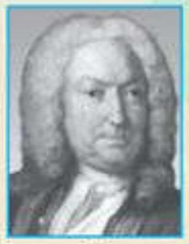

Даниил Бернулли (1700-1782)

\section*{КАЙТАЛАУ}
29.18. Кепмүшені көбейткіштерге жіктендер:
1) $x^{3}+3 x-4$;
2) $x^{3}+2 x^{2}-3 x-6$;
3) $x^{3}+3 x^{2}+3 x+9$.
29.19. Тендеуді айнымалыны ауыстыру әдісімен шешіндер:
1) $x^{4}-4 x^{2}-12=0$;
2) $x^{4}+4 x^{2}-45=0$;
3) $x^{2}-4 x-3 \sqrt{(x-2)^{2}}=14$;
4) $x-3+2 \sqrt{x-3}=8$;
5) $\left(x^{2}+3 x+1\right)\left(x^{2}+3 x+3\right)=0$;
6) $(x+1)^{2}\left(x^{2}+2 x\right)=12$.
29.20. Өрнекті ыкшамдандар:
1) $\left(x^{2}+3 x+1\right)(x-3)-3 x^{2}+3$;
2) $(x-1)\left(x^{2}+2 x\right)-12 x^{2}+3 x-2$.

\section*{ӨЗІНДІ ТЕКСЕР!}
1. $0,2,5,7,8$ цифрларынан кұрастырылған екітанбалы сандар саны:
А) 16 ;
В) 22 ;
C) 42 ;
D) 20 .
2. Сыныптағы 30 окушыдан тертеуден тұратын кезекшілерді канша тәсілмен кұрастыруға болады:
А) 16000 ;
В) 27405 ;
C) 13800 ;
D) 27000 ?
3. 1, 2 және 3 жүлделі орындарды 15 катысушының арасында канша тәсілмен белуте болады:
А) 2100 ;
В) 2700 ;
C) 2730 :
D) 2250 ?
4. Он баскетболшы ойын алдында сапка тұрды. Бірінші капитан тұрса, қалғандары кездейсок сапка тұратын болса, онда команданы сапка тұрғызудын тәсілдерінін санын табындар:
А) $9!$;
В) $8!$;
C) $10!;$
D) $11!$,
5. 20 адамнан топты 7 және 13 адамнан тұратын екі топқа белу тәсілдерінін санын табындар:
А) $C_{20}^{10}$;
B) $C_{20}^{7}$;
C) $C_{13}^{7}$;
D) $7!$.
6. $\frac{C_{6}^{3}-C_{6}^{2}}{P_{3} \cdot A_{6}^{2}}$ ернегінін мәні:
A) $\frac{1}{6}$ :
В) 0,4 ;
C) 0,5 :
D) $\frac{1}{36}$.
7. $C_{n-1}^{2}-C_{n}^{2}=49$ тендеуінін түбірі:
A) 7 ;
В) 49 ;
C) 42 ;
D) 50 .
8. $(x-2)^{10}$ биномынын жіктелуіндегі тертінші мүшенін коэффишенті:
А) -960 ;
В) 120 ;
C) -40 ;
D) 90 .
9. Жәшікте 5 ак және 10 кызыл шар бар. Жәшіктен екі шар алынды. Алынған екі шар ак түсті болуынын ыктпмалдығын табындар:
A) $\frac{4}{9}$ :
B) $\frac{1}{3}$;
C) $\frac{2}{21}$;
D) 0,5 .
10. Yш мерген нысанаға атты. Бірінші мергеннін нысанаға тигізуінін ыктималдығы 0,6-ға, екіншінікі 0,7-ге, үшіншінікі 0,8-re тен. Нысанаға бірде-бір мергеннін тигізе алмауынын ыктималдығын табындар.
А) 0,024 ;
B) 0,24 :
C) 0.016 ;
D) 0,04 .

\section*{ЖАНА БІЛІМДІ МЕҢГЕРУТЕ АРНАЛҒАН ТІРЕК ҰҒЫМДАР}

Екімушелік, көпмушелік, көпмушеліктін стандарт турі, көпмуиеліктін дәрежесі.

\begin{table}
\captionsetup{labelformat=empty}
\caption{Глоссарий}
\begin{tabular}{|l|l|}
\hline а саньдыви арккосинусы & а (а M ) санынын арккосинусы деп косннусы а-га тен [0; T] аралыкындағы санды айтады \\
\hline а санынын арккотангенсі & а саньгным арклотангенсі деп котангенсі а-га тен ( 0 ; П) интервалындағы санды айтады \\
\hline а саньнывти арксинусы & $а(a \mid \mathrm{m} 1)$ саныным архсимусы деп сшусы $a$-га тен $\left[-\frac{\pi}{2} ; \frac{\pi}{2}\right]$ аралығышдағы санды айтады \\
\hline а саныныи арктангенсі & а саныныя арктанзенсі деп тангенсі а-ға тен $\left(-\frac{\pi}{2} ; \frac{\pi}{2}\right)$ интервалындагы санды айталы \\
\hline Анықталмагандыкты aшу & $x \rightarrow a(x \rightarrow \infty)$ ұмтыланда аныкталмағандыкты беретін функпияныи шегін табу анымталмаеандыкты ашу деп аталады \\
\hline Аргументінін есімшесі & Функциянын аныктату обтысынан алынган екі аргументтіи айырымынын мәні фужция ардументінія әсімшесі деп аталады \\
\hline Аркжосниус & $y=\cos x$ функшясына кері функиия арккосинус деп аталады және $y=\arccos x$ деп белгітенеді \\
\hline Арксинус & $y=\sin x$ функциясына кері функция арксинус деп аталады және $y=\arcsin x$ деп бетіленелі \\
\hline Арккотантенс & $y=\operatorname{ctg} x$ функшисына кері функция арклоталгенс деп аталады және $y=\operatorname{arcctg} x$ деп белгіленеді \\
\hline Арктантене & $y=\operatorname{tg} x$ функциясына кері функция арктангенс деп аталады және $y=\operatorname{arctg} x$ деп белгітенеді \\
\hline Аркфункинялар & Тригонометриялык функцияларға кері функшиялар кері тригонометриялык функциятар немесе аркфужциятар деп аталады \\
\hline Асимптота & М нүктесі берілген сызык бойымен шексіздікке жыгжывана осы нуктелен а түзуіне дейінті кашыктык нелге ұмтыхеа, онда а түзуі кисыктын асимптотасы деп аталады \\
\hline Биномиалды козффншиенттер & Ньютон биномынын формуласындағы $C_{n}^{k}$ козффищиенттері бинамиалды коэффициенттер деп аталады \\
\hline Біртекті копмуше & Копмушеніи эрбір бірмушелерінін дәрежелері корсеткіштерінін косындысыныи мәні бірдей болеа. онда кепычше біртекті деп аталады \\
\hline Біртекті тригонометриялык тенлеу & Сол жак белігіндегі $\sin x$ пен $\cos x-к е$ катысты барлык мүшелерінін дәреже керсеткіштерінін косындысы бірдей, он жак белігі 0-ге тен болатын тенду $\sin x$ пен $\cos x$-ке катысты біртекті тригонометриятыц тендеу деп аталады \\
\hline Белшек-сызыктык функшия & $y=\frac{a x+b}{c x+d}, c \neq 0, a d \neq b c$, гуріндегі функия болшек-сызыхтык функция деп аталалы \\
\hline
\end{tabular}
\end{table}

Жатеасы

\begin{tabular}{|l|l|}
\hline Гармоникалык тербелістер & $f(t)=A \cos (\omega t+\phi)$ немесе $f(t)=A \sin (\omega t+\phi)$ зандарымен сипатталатыи козгалыстарды гарионикалық тербелістер деп атайды $A$ - тербелістін ампитудасы , $\omega$ - тербеліс жидла , ф тербелістін бастапьзы фазасы деп аталалы. $f(t)=A \cos (\omega t+\phi)$ жэне $f(t)=A \sin (\omega t+\phi)$ функциятарыныи $\quad \frac{2 \pi}{\omega}$-га тен перноды гармоникалық тербелистін периоды деп аталады \\
\hline Дискретті (үзілісті) кездейсок шама & Бір-бірінен окшау, белек мән кабылазйтын кездейсок шама оискретті (γзілісті ) кезбейсок шама деп аталады \\
\hline Дискретті кездейсок шаманын геометриялык үлестірімі & Бір-біріне тәуелсіз $n$ тэжірнбенін эркайсысында $A$ окигасыныи орындалу ыктималдығы p. орындалмау ыктималдығы $q=1-p$ болеын. Тежірибе $A$ окитасы бірінші рет орындалатын $k$-тжірибеден кейін токтатытады. $X$ диекретті кездейсок шамасынын мүмкін мәндерінін ыктималлыктары $P(X=k)= =q^{k-1} p$ формуласымен есептелетін үлестірім геометриялык угестірім деп аталады \\
\hline Дискретri кездейсок шаманын гипергеометриятык үлестірімі & Егер $N$ - белгілі бір жиынныи элементтерініи жалпы саны. М - осы жныннын белгілі бір касиетті канагаттандыратын элементтерінін саны. $n$ - барлык элементтер ішінен кездейсок алынтан элементтер саны, $m$ - тандап алынған элементтер ішінен берілген каснетті канағаттандыратын злементтер саны болеа, онда $X$ дискретті кездейсок шамасынын мүмкін мэндерініи ыктималдыты $\quad P(X=m)=\frac{C_{M}^{\infty} C_{N-M}^{n-m}}{c_{N}^{n}}$ формуласымен есептелетін үлестірім гипергеометриятык угестірім деп аталады \\
\hline Днепереня & $X$ кездейсок шамасынын математикалык күтімінен ауытқуыныи квадратынын математикалық кутімі кездейсок шаманы оисперсиясы деп аталалы жэне $D(X)=M\left((X-M(X))^{2}\right)$ формуласымен есептеледі \\
\hline Днфференциалдау & Функциянын туындысын табу аматын дифференциалоду деп атайды \\
\hline Денес функция & Кеп жағдайда жогары карай денестелген функцияны денес функция деп атайды (49.1.2-сурет) \\
\hline Екінші туынды & $y=f(x)$ функциясынын екіниі тумдысы деп $f^{\prime}(x)$ туындысынан атынған туындыны айтады \\
\hline Жиында лифференциалданатыи функшия & Егер жнынныи эрбір нуктесінде функцияныи шектелген туындысы болеа, онда функция жиында дифференциалданады деп айтады \\
\hline Жогары карай денестелтен функния & Егер дифференциалданатын функцияныи графигі $X$ интервалынын кез келген $X$ нуктесіне жүргізілген жанамадан төмен болмаса, онда функиия $X$ интервалында жоғары карай денестелген деп аталады \\
\hline
\end{tabular}

Жатгасы

\begin{tabular}{|l|l|}
\hline Иілу нуктесі & Erep $M$ нуктесініи кіші аймагында кисык осы нуктеде жүргізілен жанаманыи екі жагында орналасса, онда $M$ нуктесі uiгу нуктесі деп аталалы \\
\hline Қайталанатын терулер & Бір түрдін элементтері бір-бірінен сн болмағанда элементтердін санымен езгешеленетін $k$ элементтен тұратын реттелмеген жнынтык эртурлі $k$ типті $n$ элементтсн тұратын кайтатанатыя терулер деп аталады \\
\hline Кайгаланбайтын орналастырулар & $n$ этементтен тұратын жныннын $k$ этементінен реттелен жнындарды $n$ элементтен алынған $k$-дан кцралған қайтатанбайшын орнатастыругар деп айтады \\
\hline Кайталанбайтын теругер & Барлык этементері эргурлі және орналасуы реттелмеген $k$ элементеи тұратын ішкі жнындар $n$ элементінен алынган $k$-дан куражан кайтаганбайтын теругер деп аталады \\
\hline Кездейсок шама & Тәжірибе нэтижесінде бірнеше мәндердін бірін кабылдайтын шама кездейсож шама деп аталады және бұл мәндердін кайсысын кабылдайтынын алдын ала білу мүмкін емее \\
\hline Кездейсок шаманыи ауытқуы & Кездейсок шама мен оныи математикалык күтімніи айырмасы. ягни $X-M(X)$ шамасы хездейсоу шаманы аужтлудеп аталады \\
\hline Кездейсок шаманын улестірімі & Кездейсок шаманыи мүмкін мондері мен олардын ыктималдыктарын тізіп жазу кездейсок шаманын узестірімі деп аталады \\
\hline Кездейсок шаманыи бнномдык улестірімі & Кездейсок шаманын мумкін мэндерінін ыктималдыктары Бернулли формуласымен есептелетін үлестірім биномдык үлестірім деп аталады \\
\hline Күрделі функция & $y=f(x)$ функциясыныи $x$ аргументінін орнына $y=g(x)$ функциясы алынгаи $y=f(g(x))$ гуріндегі функция курдеті функция (функциялардыи композицияеы) деп аталалы \\
\hline Комбинаторика & Комбинаторикалық есептерді карастыратын математиканын белігі комбинаторика деп аталады \\
\hline Комбинаторикалык есептер & Шектелген жиынныи этементтерінен кандай да бір ережелер бойынша эргурлі комбинациялар курастырылатын және олардын саны табылатын есептерді комбинаторикалык есептер деп атайды \\
\hline Котангенстер сызығы & $t$ түзуін котангенстер сызычы деп атайды \\
\hline
\end{tabular}

Жатеасы

\begin{tabular}{|l|l|}
\hline Kemmyme & Бірмушелердін косындысы кепычйе деп аталады \\
\hline Кепмушеніи дәрежесі & Копмушеніу дәрежесі деп кұрамымдагы бірмүшетер дәрежелерінии ен үлкен дәрежесін айтады. Бірмушенін дорежесі деп кұрамындагы айнымалылардын дэреже керееткіштерінін косындысынын монін айтады \\
\hline Кепмушении мүшелері & Кепмүшеніи кұрамына кіретіи бірмүшелер копиүшенія мүиетері деп аталады \\
\hline Кепмушенін түбірі & Егер $x=x_{0}$ болганда $P(x)$ кепмушесінін мәні нелге тен болеа, онда $x_{0}$ санын $P(x)$ кепчугиесінин тройрі деп атайды \\
\hline Максимум нуктесі & а нуктесінін кандайда бір аймагында эрбір $x(x \neq a)$ үшін $f(x)<f(a)$ тенсіздігі орындалан жағдайда ғана а нуктесі $y=f(x)$ функцасыны максимум нуктесі деп аталады \\
\hline Математикалык кутімі & Мондері $x_{1}, x_{2}, x_{2}, x_{4}, \ldots, x_{k}$ сандары болатын жоне оларға сэйкес ыктималдыктары $p_{1}, p_{2}, p_{3}, p_{4}, \ldots . . p_{n}$ болатын лискретті кездейсок шаманын мәндерінін оларra сайкес ыктималдыктарына кебейтінділерінін косындысы, ягни $M(X)=x_{1} \cdot p_{1}+x_{2} \cdot p_{2}+ +\ldots+x_{k}+p_{n}$ саны днекретті кездейсок шаманыи матезатикалых кртімі деп аталады \\
\hline Минимум нуктесі & а нуктесінін кандай да бір аймағында эрбір $x(x \neq a)$ үшін $f(x)>f(a)$ тенсіздігі орындалған жағдайда ғана а нүктесі $y=f(x)$ функциясынын миницум нуктесі деп аталады \\
\hline Мода & Кездейсок шаманын ықтималдығы жоғары мәні кездейсок шаманын модасы деп ататады \\
\hline Окиғалардын көбейтіндісі & A жэне B окиталарына тиісті болатын элементар окиталардан кұралған окиға $A$ және $B$ окиваларынын кебейтіндісі деп аталады жэне $A B$ символымен белгіленеді \\
\hline Окиғаларлын қосындысы & A немесе B окиғаларына тністі болатын злементар окиғаларлан куралған окиға $A$ және $B$ окцасатарыныи косындысы деп аталады жэне $A+B$ символымен белгіленеді \\
\hline Ойыс функция & Кеп жағдайда тементе қарай денестелтен функцияны ойыс функция деп атайды \\
\hline Өзара кері функциялар & Erep $y=\phi(x)$ - берілген функция. $y=f(x)$ - берілген функиияга кері функшия болса, онда $y=f(x)$ және $y=\phi(x)$ функшиятары өзара кері функциягар деп аталалы \\
\hline n дәрежелі кепмуше & $a_{n} x^{n}+a_{n-1} x^{n-1}+a_{n-2} x^{n-2}+\ldots+a_{1} x+a_{0}$ (мұлданы $n$ - бутіи теріс емес сан, $a_{n}, a_{n-1}, a_{n-2}, \ldots, a_{1}, a_{0}$ - кез келген санар және $a_{n} \neq 0$ ) турінде берілген өрнекті $x$ айнымалысына катысты п бәрежелі копчучае деп атайды. Кез келген санды ноліний бэрежелі кепиучие деп атайды \\
\hline $n$ элементтен тұратын кайталанбайтын алмастырулар & $A=\left\{x_{1}, x_{2}, \ldots, x_{n}\right\}$ жиыныныи барлык $n$ здементін камтитын реттелген жнындар $n$ элементтен тұратын кайтаганбайтын ачмастыругар деп аталады \\
\hline
\end{tabular}

Жатгасы

\begin{tabular}{|l|l|}
\hline Нүктеле дифферениналданатын функция & Шектелген туындысы бар функшя нуктеде дифференциалданатыи фужция деп аталалы \\
\hline Нуктеде үзіліссіз функция & $\lim _{x \rightarrow x_{\mathrm{n}}} f(x)=f\left(x_{0}\right)$ тендігі орындала, онда $y=f(x)$ функциясы $x=x_{0}$ болатын нуктеде узіліссіз функция деп ататалы Кері жағдайда $y=f(x)$ функциясы $x=x_{0}$ нүктесінде үзілісті болады \\
\hline Нүктенін аймағы & Нукте тиісті болатын кез келген ннтервая нуктеніи аймаеы деп аталады \\
\hline Ньютон биномы & (1) және (2) формулалары Ньютон биноны деп аталады.
$$
\begin{align*}
& (x+a)^{n}=x^{n}+n \cdot a \cdot x^{n-1}+\frac{n(n-1)}{2!} \cdot a^{2} \cdot x^{n-2}+\ldots .+ \\
& +\frac{n(n-1) \ldots(n-k+1)}{k!} \cdot a^{k} \cdot x^{n-k}+\ldots+a^{n} \\
& (x+a)^{n}=C_{n}^{0} \cdot a^{0} \cdot x^{n}+C_{n}^{1} \cdot a^{1} \cdot x^{n-1}+C_{n}^{2} \cdot a^{2} \cdot x^{n-2}+\ldots+C_{n}^{k} \cdot a^{k} \times  \tag{2}\\
& \times x^{n-k}+\ldots+C_{n}^{n-1} \cdot a^{n-1} \cdot x^{1}+C_{n}^{\infty} \cdot a^{n} \cdot x^{0}
\end{align*}
$$ \\
\hline Сандык функшия & Аныкталу облысы $D$ богатын сандых функция деп $D$ жнынынын кез келген $x$ санына кандай да бір ереже бойынша $x$-тен тәуелді бір гана $y$ саны койылатын сэйкестікті айтады \\
\hline Стацнонар нукте & $f^{\prime}\left(x_{0}\right)=0$ болеа, онда $x_{0}$ нуктесі функцияныи стационар нүктесі деп аталады \\
\hline Стандарт гүрдегі кепмүше & Станчарт гүрдегі ұксас емес бірмүшелерден тұратын кепмушені стандарт түрдегі көпмүие деп атайды. \\
\hline Симметрияты кепмуше & Шетінен бірдей кашыктыкта орналаскан мүшелердін коэффициенттері болатын бір айнымалысы бар $n$-ші дәрежелі кепмүше симметрияты кепичие деп аталады \\
\hline Симметрияты кепмуше & $x$ және $y$ айнымалыларынан тұратын кепмүшеде $x$-ті $y$-пен және $y$-ті $x$-пен алмастырганда кепмушеніи турі езгермесе. онда ол симметрияты кепичие деп аталады \\
\hline Симметриялы тендеу & Шеттерінен бірдей қашыктыкта орналаскан коэффщиенттері тен болатын $n$-ші дорежелі тендеу синметрияты теждеу деп аталалы \\
\hline Синусонда & $y=\sin x$ және $y=\cos x$ функцияларыныи графигі синусоида деп аталады \\
\hline Сындык нукте & $f^{\prime}\left(x_{0}\right)$ туындысы нелге тен немесе болмаса, онда $x_{0}$ нүктесі функииянын сыновы нуктесі деп аталады \\
\hline Таигенсонда & $y=\operatorname{tg} x$ функциясыныи графигі тангенсоида деп аталалы \\
\hline
\end{tabular}

Жатеасы

\begin{tabular}{|l|l|}
\hline Тангенстер сызығы & $l$ түзуім танеенстер сызыеы деп атайды \\
\hline Тригонометриялык тендеу & Белгісіз (айнымалысы) тригонометрнялык функциянын аргументі түрінде берілген тендеуді тригонометриятых тендеу деп атайды \\
\hline Тригонометриялык тенсіздік & Белгісіз (айнымалыеы) тригонометриялык функцияныи аргументі түрінде берілген тенсіздікті тригонометрияты тенсіздік деп атайды \\
\hline Темен карай денестелген функция & Егер лифференциаланатын функшиянын графигі $X$ интервалынын кез келген $X$ нуктесіне жүргізілен жанамадан темен орналасса, онда функция $X$ ннтервалында теменге карай дөместетген деп аталады \\
\hline Yзіліс нуктелері & \begin{tabular}{l}
1. Erep біржақты $\lim _{x \rightarrow x_{0}-0} f(x)$ немесе $\lim _{x \rightarrow x_{0}+0} f(x)$ шектерінін ен болмағанда біреуі шексіз болса, онда абсцие сасы $x_{0}$ болатын нүкте II текті үзіліс нуктесі болады: \\
2. Erep $\lim _{x \rightarrow x_{0}-0} f(x)$ немесе $\lim _{x \rightarrow x_{0}+0} f(x)$ біржакты шектері шектелтен және эртурлі болеа, онда абщиссасы $x_{0}$ болатын нүкте I τekTi γзіліс нүктесі болады. \\
3. Erep $\lim _{x \rightarrow x_{0}-0} f(x)=\lim _{x \rightarrow x_{0}+0} f(x)=b$ және $f\left(x_{0}\right) \neq b$ немесе $f\left(x_{0}\right)$ аныкталмаган болса, онда абсциссасы $x_{0}$ болатын нукте жойылатын үзіліс нужнесі болады
\end{tabular} \\
\hline Yзіліссіз кездейсок шама & Мондерінін жныны белгілі бір екі санныи арасындағы мондердін барлығын кабылдайтын кездейсок шама үзіліссіз кездейсок шама деп аталады \\
\hline Үзіліссіз функция & Егер функция аратыктын барлык нуктелерінде үзілісеіз болеа, онда ол осы аралыкта үзіліссіз болады \\
\hline Үлестірімнін гистограммасы & Абсшиссада кездейсок шаманыи $x_{1}, x_{2}, x_{3}, \ldots, x_{n}$ мәндері. ордннатада сэйкесінше $p_{1}, p_{2}, \ldots, p_{n}$ ыктималдыктары болатын жазыктыктын ( $x_{i}, p_{j}$ ) нуктелері аркылы өтетін сынық сызык үлестірімнін кепбұрышы, оған сәйкес гистограмма улестірімнім гистограммасы деп аталады \\
\hline
\end{tabular}

Жатгасы

\begin{tabular}{|l|l|}
\hline Үлестірім катары (заны) & $X$ кездейсок шамасыныи $x_{1}, x_{2}, x_{3}, \ldots, x_{n}$ мәндері мен отардын $p_{1}, p_{2}, \ldots, p_{n}$ ыктималдыктары кереетілген кесте $X$ дискретті кездейсок шамасынын үлестірім катары (заны) деп аталады \\
\hline Шартты ыктималдық & Бір окиганыи орындалганы белгілі болган жагдайда екінші окиганыи орындалу ыктималдығы шартты ықтиматды деп аталады. $A B$ окитасына колайлы элементар окигалар саныныи $B$ окигасына колайты элементар окигалар санына қатынасы $B$ окиғасы орындатған жағдайда $A$ окиеасыныя шартты ыстималдыгы деп аталады ( $B$ окиғасынын шартты ыктималдығынын анықтамасына ұксас) \\
\hline Шексіз улкен функция & \begin{tabular}{l}
Erep $\lim f(x)=\infty$ болса, онда $x \rightarrow a(x \rightarrow \infty)$ ұмтытанда $x \rightarrow a (x \rightarrow \infty)$ \\
$y=f(x)$ функциясы шексіз улкен деп аталады
\end{tabular} \\
\hline Функциясынын ен кіші мәні & \begin{tabular}{l}
Кез келген $x \in X, x \neq x_{0}$ болғанда $f(x) \mid f\left(x_{0}\right)$ тенсіздіпі орындалса, онда $f\left(x_{0}\right)$ мәнін $X$ аралығындағы $f(x)$ фуждиясыныи ен кіші мәні деп атайды. \\
Белгітенуі: $\min _{x<x} y=f\left(x_{0}\right)$
\end{tabular} \\
\hline Функцияныи ен улкен мәиі & \begin{tabular}{l}
Кез келтен $x \in X, x \neq x_{0}$ болганда $f(x) \mathrm{m} f\left(x_{0}\right)$ тенсізмі орындалса, онда $f\left(x_{0}\right)$ мәнін $X$ аралығындағы $f(x)$ функциясыныи ен улкен мані деп атайды. \\
Белгіленуі: $\max _{x<x} y=f\left(x_{0}\right)$
\end{tabular} \\
\hline Функция максимумы & Функциянын максимум нүктесіндегі мэні функциянын максицумы деп аталады \\
\hline Функция минимумы & Функцияныи минимум нуктесіндегі моні фунхцияныи минимумы деп аталады \\
\hline Функцияныи он жак шегі & Егер $x$ айныматысы $a$ санына ұмтылган кезде $x$ тек кана а-дан үлкен мәндерді кабылдаган жағдайда $A_{2}$ саны $y=f(x)$ функинясынын шегі болса, онда $A_{2}$ саны $y=f(x)$ функциясынын а нуктесіндеті ом жах шеаi деп аталады \\
\hline Функциянын есімшесі & Мэндер жнынынан алынған функшиянын екі мәнінін айырымы фужкцияным өсімшесі деп аталады \\
\hline Функцияныи сол жак шегі & Erep $x$ айнымалысы a санына ұмтылан кезде $x$ тек кана а-дан кіші мондерді кабылдаған жағдайда $A_{1}$ саны $y=f(x)$ функциясынын шегі болеа, онда $A_{1}$ саны $y=f(x)$ функшиямнын а нуктесіндегі саг жак шегі деп аталалы \\
\hline Функцияныи туындысы & Функция есімшесінін аргумент есімшесіне катынасыныи аргумент есімшесіни нелге ұмтыландағы шеті бар болса, ол шек фужицины туымдысы деп аталады.
$$
f^{\prime}\left(x_{0}\right)=\lim _{\Delta x \rightarrow 0} \frac{\Delta y}{\Delta x}=\lim _{\Delta x \rightarrow 0} \frac{f(x+\Delta x)-f(x)}{\Delta x}
$$ \\
\hline
\end{tabular}

\begin{tabular}{|l|l|}
\hline Функциясынын meri & Erep кез келген $\varepsilon>0$ болганда $0<|x-a|<\delta$ тенсіздігін қанағаттандыратын кез келген $x \neq a$ үшін $|f(x)-A|<$ \& тенсіздігі орыпдалатындай $\delta>0$ табылса, онда $A$ саны $x$ айнымалысыныи а саныма ұмтытандагы $y=f(x)$ фулкциясылын шесі деп аталады \\
\hline Функциянын зкстремум нуктелері & Максимум және минимум нүктелері фужцияныя экстремум нужтетері деп аталады \\
\hline Экстремум & Максимум және sинимум нүктелері функииянын экстремум нуктелері, ая экстремум нуктесіндегі функииянын мані функцияны экстремумы деп аталалы \\
\hline
\end{tabular}

\section*{ЖАУАПТАРЫ}

\section*{7-9-сыныптардагы алгебра курсын кайталаута арналган жаттыгулар}
1. 1) $1 \frac{1}{3}(p-5)^{2} q^{3}$;
2) $\frac{15 b c^{2}}{d^{3}}$ :
3) $\frac{2 a^{3} x^{2} y^{2}}{y-2}$ :
4) 0 ; 5) 3 ;
6) $4+2 x ; 7) x+6$;
8) 2. 2. 1) $\{-2 ; 3\}$;
2) $\{-8 ; 2\} ; 3)\left\{\frac{3 \pm \sqrt{145}}{4}\right\}$ :
4) $\{-3-\sqrt{17}$
4):
5) $\left\{\frac{-1+\sqrt{35}}{2} ; \frac{-4-\sqrt{14}}{2}\right\}$;
6) 0 .
3. 5) $\{-4:-3: 1: 2\}$ :
6) $\{-7 ; 2\}$.
4. 1) $(-\infty:-3] \cup\{1\} \cup[2 ;+\infty)$ :
2) $(-\infty ;-5] \cup\left[\frac{1}{3} ; 1,5\right]$;
3) $(-\infty ;-4] \cup\{2 ; 5\}$;
4) $(-\infty:-3)$
\begin{tabular}{l}
$\cup(-2:-1) \cup$ \\
$\cup[6:+\infty)$ \\
\hline
\end{tabular}
$(1 ;+\infty)$ :
5): $\left(\frac{-1+\sqrt{113}}{4} ;-2\right) \cup\left(2 ; \frac{1+\sqrt{113}}{4}\right) ;$
6) $(-3 ;-1,8] \cup(-1 ; 3)$.
5. 1) $(\infty ;-3] \cup[6 ;+\infty): 2)(-\infty ;-3,4] \cup[1:+\infty)$ :
3) $\left(-\infty ;-\frac{1}{3}\right)$
$U(2.5 ;+\infty)$.
6. 1) 2;
2) 11:
3) 4 :
4) 8 :
5) 15 :
6) 10 .
7. 1) -3 ;
2) 3:
3) -4 :
4) -11 : 5) 0 ; 6) -5 .
8. 1) $\{(-5 ; 12),(4 ; 3)\}$;
2) $\{(-6 ;-22),(3 ; 5)\}$;
5) $\{(5 ; 2),(2 ;-1)\}$;
6) $\{(-7 ; 1),(-1 ; 7\}, 9,1)\{(2 ; \pm \sqrt{3}),(-2 ; \pm \sqrt{3})\}$;
3) $\{(1 ; 3)$;
$(3 ; 1):(-1:$
$-3):(-3:-1)\}:$
5) $\{(2$
$\sqrt{11}) ;(2 ;-\sqrt{11}) ;(-2 ; \sqrt{11}) ;(-2 ;-\sqrt{11})\} ;$
6) $\{(1 ; 1)\}, 1$
11. 1) (3: 4).
(4: 3):
2) $(2,-1),(-1$,
2): 3) (-2; 3), (-18; -13), (2; -3), (18;13).
12. 1) $\{(4 ; 2) ;(-4 ;-2) ;(\sqrt{10} ; \sqrt{10}) ;(-\sqrt{10} ;-\sqrt{10})\} ; 2)\{(-2 ; 1) ;(2 ;-1) ;(-0.5 ; 0.5)$; (0,5; -0,5)\};
3) $\{(1:-1)$
$(-1 ; 1)\}, 13,1)\{(2 ;-1) ;(-2 ;-1)\} ;$
2) $\{(1 ; 2) ;(-1 ;-2) ;(-1 ; 2) ;(1 ;-2)\}$; 3) $\{(1 ; 1) ;(-1 ;-1)\} ; 4)\{(2 ; 3) ;(-2 ; 3) ;(2 ;-3) ;(-2 ;-3)\} .14,1)(3 ; 5) ; 2) \emptyset ; 3)(-2 ; 4]$. 17. 1) 5;
2) 9
18. 1) $55 \mathrm{~km} / \mathrm{car}$;
2) $50 \mathrm{~km} / \mathrm{car}$;
3) $50 \mathrm{~km} / \mathrm{car}$.
19. 1) $6 \mathrm{kM} / \mathrm{car}$ және $4 \mathrm{kM} / \mathrm{car}$;
2) 2

0 кун
және 30 kyh :
3) $4 \mathrm{M} / \mathrm{c}$ және $3 \mathrm{M} / \mathrm{c} .20 .1$ ) $3 \mathrm{kr}, 5 \mathrm{kr}$ : 2) 10 кт және 8 kr
21. 1) 32:
2) 14.26 .2 )
a) $y=\frac{1}{x-3}$;

ә) $y=-2+\frac{1}{x}$;
б) $y=3+\frac{1}{x+4}$;
3) а) $y=3 \sqrt{x-3}$;
э) $y=3-\sqrt{x}-2$;
Б) $y=3 \sqrt{x+4}$ - 3. 27.
1) $f(x)=-x^{2}+2 x+3$;
2) $f(x)=\frac{x+1}{x+2}$ :
3) $f(x)=\sqrt{x+2}$
$-2$.
2. 28.
2) $f(x)=-x^{2}+3 x ; D(f)=R ; E(f)=(-\infty ;-2,25]$; функция ( $-\infty ; 1,5$ ] аралығында

еседі.
[1.5
$+\infty$
) аралығында кемиді. 30. 1) $a<0 ; b<0 ; c<0 ; D=0 ; 2) a<0 ; b=0 ; c<0 ; D<0,31,1)$ a), в); 2) a), 6), r), 32, 1) $\left.d=2 ; a_{f}=15,5 ; 2\right) d=5$; $\left.\left.a_{n}=4 ; 3\right) d=-4 ; a_{n}=7 ; 4\right) d=-2 ; a_{n}=-14,9$. 33. 1) $\left.a_{1}=8,5 ; d=2 ; 2\right) b_{1}=16,8 ; q= \pm \sqrt{\frac{27}{14}} ;$
3) 8.5 .
34. 1) $n=5 ; S_{n}=-135$;
2) $n=2 ; S_{n}=-27$.
35. 1) 105 ;
2) -40:
3) -43 .
36. 1) $q=2: b_{n}=22.4: S_{n}=44,1$;
2) $q=3 ; b_{n}=48.6 ; S_{n}=72.6 ;$
3) $q=-7 ; b_{x}=68,6 ; S_{n}=60$.
37. 1) $b_{1}=2$ және $S_{3}=\frac{1267}{896}$ :
2) $b_{1}$
$=-81$ және
$S_{5}=-211$.
38.
1) $1,5 \cdot(\sqrt{3}-1)$;
2) $\sqrt{2}+1$.
39.
1) $2 \frac{31}{99}$ :
2) $\frac{103}{999}$
2) $1-\sqrt{3}$
3) $2 \frac{338}{990}$ :
3) $0: 4)-\frac{\sqrt{3}}{2}$ :
4) $45 \frac{23}{990}$
5) $-2-\frac{\sqrt{3}}{6}$;
40. 1) $1-\sqrt{3}$
6) 0.41.
1) $1-3 \sqrt{3}$ :
2) 4 :
3) -8.5 ;
4) $\frac{18-17 \sqrt{3}}{6}$
42. 1) $-2 \sqrt{0,21} ;-1,6 \sqrt{0,21} ; 0,68$ :
3) $-\frac{1}{3} ;-\frac{2 \sqrt{2}}{3} ;-\frac{7}{9}$.
43. 1) $\sin \frac{\alpha}{2}=\frac{1}{3} ; \cos \frac{\alpha}{2}=\frac{2 \sqrt{2}}{3} ; \sin \alpha=\frac{4 \sqrt{2}}{9}$;
2) $\sin \frac{\alpha}{2}=\sqrt{\frac{3+\sqrt{7}}{6}} ; \cos \frac{\alpha}{2}= =\sqrt{\frac{3-\sqrt{7}}{6}} ; \cos \alpha=-\frac{\sqrt{7}}{3} ; \operatorname{tg} \alpha=-\sqrt{\frac{2}{7}} \cdot 44 \cdot \cos (\alpha+\beta)=\frac{3 \sqrt{105}-1}{32}, \sin (\alpha-\beta)=\frac{3 \sqrt{7}-\sqrt{15}}{32}, \operatorname{tg}(\alpha+\beta)= =\frac{3 \sqrt{7}+\sqrt{15}}{3 \sqrt{105-1}}$.
45. $\cos (\alpha-\beta)=\frac{42+\sqrt{195}}{56}, \sin (\alpha+\beta)=\frac{6 \sqrt{15}+7 \sqrt{13}}{56}, \operatorname{tg}(\alpha-\beta)=\frac{6 \sqrt{15}-7 \sqrt{13}}{42+\sqrt{195}}$.
46.
1) $\frac{2 \sqrt{3}-6}{3}$ :
2) 2 :
2) -ctg $2 \alpha_{\text {; }}$
3) $-\frac{5 \sqrt{3}}{18}$ :
3) $\sin \alpha_{;}$
4) 2. 47. 1) $-\cos \theta$ :
4) $\left.\operatorname{tg}{ }^{6} \mathrm{C}, 49,1\right)-1$ :
2) 3 ;
3) 4:
4) $-2 \sin ^{2} \alpha$
51. 1) $36 \mathrm{~m} / \mathrm{m} 4$ және
$54 \mathrm{~m} / \mathrm{mH}:$
2) 600 м-ден 1400 м-ге дейін:
3) $18 м / м 4 \%-$ тан

90 м/мин-ка
дейінгі кез келген
мон;
4) $=9$

мин: 5) 10 с-та 21 кадам.
52. 1) $3 \mathrm{~km} / \mathrm{car}$ :
2) 3 car:
3) $1.5 \mathrm{~km} / \mathrm{car}$.
53. 1) 52.5

ки;
2) 3 kr ;
3) 5 kr :
4) $24,375 \%$. 54.
1) $1 \frac{1}{3} \mathrm{ecc}$;
2) 24
c:
3) Мараттын

жылдамдығы
эскалатор
жы工ламдығынан
2 ece артык.
55.
3) $n=25 ; \bar{X} \approx 57.24$;
4) $D(X) \approx 1,7,56.60 \%$.

\section*{1-тарау . ФУНКЦИЯ, ОНЫЦ КАСИЕТТЕРІ ЖЭНЕ ГРАФИГІ}
1.1. 1) $R$; 2) $R$; 3) $R$; 4) $R$. 1.2. 1) $R$; 2) $R$; 3) $R$; 4) $R$. 1.3. 1) $(-\infty ; 0) \cup(0 ;+\infty) ; 2)(-\infty ;-2) \cup \cup(-2 ;+\infty) ; 3)(-\infty ;-2) \cup(-2 ; 0) \cup(0 ;+\infty)$. 1.4. 1) $(-\infty ;-2) \cup(-2 ; 0) \cup(0 ;+\infty) ; 2)(-\infty ;-\sqrt{7}) \cup \cup(-\sqrt{7} ; \sqrt{7}) \cup(\sqrt{7} ;+\infty) ;$ 3) $R .1 .5,1)[-11 ;+\infty) ; 2)[23 ;+\infty) ; 3)[-19 ;+\infty) ; 4)(-\infty ; 10]$. 1.7. 1) $E(y)=R$; 2) $E(y)=R$; 3) $E(y)=(-\infty ; 0) \cup(0 ;+\infty) ; 4) E(y)=(-\infty ; 0) \cup(0 ;+\infty)$; 1.8. 1) $E(y)=[-20,25 ;+\infty) ; 3)[-0,25 ;+\infty) ; 4)(-\infty ; 60,25], 1.9,1) E(y)=[2 ;+\infty) ; 2)(-\infty ; 0]$ : 3) $(-\infty ; 10] ; 4)(-\infty ;-2.3]$. 1.10. 1) $E(y)=[4 ;+\infty) ; 2) E(y)=[-11 ;+\infty] ; 3) E(y)=(-\infty ; 6]$; 4) $E(y)=(-\infty ;-2]$, 1.11. 1) $D(y)=R ; E(y)=(-\infty ; 5] ; 2) D(y)=(-\infty ; 3] ; E(y)=(-\infty ; 1]$; 3) $D(y)=(-\infty ; 2] ; E(y)=[-1 ;+\infty)$. 1.12. 1) $(-19 ;+\infty)$; 2) $(17 ;+\infty) ; 4)(-\infty ; 20)$. 1.13. 1) $[-11 ;+\infty)$; 2) $[1.3 ;+\infty)$; 3) $(-4 ; 12.5]$ : 4) $(0.3 ; 6] .1 .14,4)(-\infty ;-0.7) \cup\left(-0,7 ;-\frac{2}{11}\right) \cup \cup\left(-\frac{2}{11} ;+\infty\right)$. 1.15. 1) $(-\infty ; 2) \cup(2 ; 4) \cup(4 ; 6) \cup(6 ;+\infty)$. 1.16. 1) $\left.[9 ;+\infty) ; 2\right)[-11 ;-2) \cup \cup(-2 ; 5) \cup(5 ;+\infty)$. 1.17. 2) $\left.\left.\left[\frac{1}{9} ; 2 \frac{2}{3}\right): 3\right)(-2 ;-1] \cup(2 ;+\infty): 4\right)[-3 ; 2) \cup(3 ;+\infty)$.
1.18. 1) $(10 ;+\infty): 2)(-\infty ;-1.5): 4)[-3 ; 5), 1.19 .1)[5 ;+\infty): 2)(-\infty ; 4]$; 4) $(-\infty ; 3]: 5) R$; 6) $R$; 7) $R$; 8) $R$. 1.20. 1) $[1 ; 5]$; 2) $[-1 ; 3]$; 4) $(0 ; 3) \cup\{4\}, 1.21,1)[-18 ;+\infty)$. 1.22. 1) $(-\infty ;-5] \cup[5 ;+\infty) ; 2)[-6 ;-4] \cup[6 ; 8)$. 1.23. 1) $[-12,25 ;+\infty) ; 2) E(y)=\left[\begin{array}{l}\left(-\infty ; \frac{4}{a}\right], a>0, \\ R, a=0, \\ {\left[\frac{4}{a} ;+\infty\right), a<0 .}\end{array}\right.$
1.24. 1) $a \mid 0 ; 2)-1.8<a<0 ; 3) \odot$; 4) $a=-1.8 ;$ 5) $a<-1.8$, 1.27. 1) $\frac{7}{8} \cdot 1.28$. 1) -2 және 1. 2.1. 1) функиняныи графигі: 2) функшия графигі: 4) функиияныи графигі.
2.2. 1) $y=\left\{\begin{array}{l}x+6,-5 \leqslant x<-1, \\ 2-x,-1 \leqslant x<4, \\ -1, x=4 ;\end{array}\right.$ 2) $y=\left\{\begin{array}{l}|x+2|,-2 \leqslant x<3, \\ 2, x=3 ;\end{array}\right.$ 3) $y=\left\{\begin{array}{l}-(x-1)^{2}+5, x \neq 4, \\ 3, x=4 ;\end{array}\right.$
4) $y=\sqrt{x+3}-2$. 2.5. 1) $D(y)=R ; E(y)=(-\infty ; 3,5] \cup\{5\} ; 2) D(y)=R ; E(y)=(-2 ;+\infty)$.
2.6. 1) $y=x-2$; 2) $y=0.5 x$; 3) $y=x^{2}-7$; 4) $y=x^{2}+1$. 2.7. $\left\{\begin{array}{l}f(-x)=x^{2}+4 x+3, \\ f(x+2)=x^{2}-1, \\ f(1-x)=x^{2}+2 x ;\end{array}\right.$
1) $\left\{\begin{array}{l}E(f(-x))=[-1 ;+\infty), \\ E(f(x+2))=[-1 ;+\infty), 2) \\ E(f(1-x))=[-1 ;+\infty) ;\end{array}\left\{\begin{array}{l}A(0 ; 3) ; \\ A(0 ;-1) ; 3) \\ A(0 ; 0) ;\end{array}\left\{\begin{array}{l}x_{1}=-3 ; x_{2}=-1, \\ x_{1 / 2}= \pm 1, \\ x_{1}=-2 ; x_{2}=0 .\end{array} \quad\right.\right.\right.$ 2.9. 1) $y=x^{2}+2 x-3 ;$
2) $y=|x-3|-1 \mid$; 3) $y=3+\frac{1}{x-2}$; 4) $y=\left\{\begin{array}{l}x^{2}, x \leqslant 0, \\ 4-x^{2}, x>0 .\end{array}\right.$ 2.12. 1) $\left.y-x=0 ; 2\right) y+x=0$;
3) $3 y-2 x=0$; 4) $2 y+x=0$. 2.13. 3) $x^{2}-y-x=0$; 4) $2 x^{2}+3 x-y=0$;
2.14. 1) $y=\left\{\begin{array}{l}-x, x \leqslant 0, \\ -(x-1)^{2}+4, x>0 .\end{array}\right.$ 2) $y=\left|x^{2}-4\right|$; 3) $y=\left|\frac{x-2}{\mid x-1}\right|$; 4) $y=\left\{\begin{array}{l}-1, x<0, \\ 0, x=0, \\ 1, x>0 .\end{array}\right.$
2.16. $d(5)=1 ; d(7.5)=1 ; d(-44)=1 ; d(1.9(3))=1 ; d(\sqrt{10})=0 ; d(5 \sqrt{5}-\sqrt{3})=0$;
$d\left(\frac{\sqrt{180}-\sqrt{20}}{\sqrt{125}}\right)=d\left(\frac{4 \sqrt{5}}{5 \sqrt{5}}\right)=d\left(\frac{4}{5}\right)=1.2 .17 . R(0.7)=\frac{1}{10} ; R(0,(5))=\frac{1}{9} ; R(0,(63))=\frac{1}{11}$;
$R(0,2(3))=\frac{1}{30} ; R\left(\frac{1}{\pi}\right)=0 ; R\left(\frac{\sqrt{50}+\sqrt{2}}{\sqrt{200}}\right)=\frac{1}{5} \cdot 2.18 . \frac{1}{x+2} \cdot 2.19 .10 \mathrm{~km} / \mathrm{car} . \quad 2.21 .5 ; 6$. 3.4. 1) $\left.B_{2}(-2 ;-4) ; 2\right) B_{2}(-2 ; 2)$ 3.10. 1) Парабола; 2) парабола; 3) гипербола; 4) гипербола. 3.18. 1) $(-\infty ;-3) \cup[2 ;+\infty) ; 2)[1.5 ; 2) ; 3)\left[1 \frac{1}{3} ; 2\right]$.3.19. 2) (1; 4) жане $(-2.5 ;-1,25)$. 4.10. 1) YIII түбір: 2) екі түбір; 3) бір түбір; 4) екі түбір. 4.11. 1) $y=\sqrt{x-2}-1$; 2) $y=\sqrt{3-x}-2$. 4.16. 1) $-0.5 ;$ 2) $[4 ;+\infty) ; 3)-1$. 5.1. 1) $\left.A(2 ; 5) ; 2) A\left(2 \frac{2}{3} ; 5\right) ; 3\right) A(1 ; 5)$. 5.2. 1) $\left.C(4 ; 3) ; 2\right) \left.\left.\left.C(5 ; 3) ; 3) C\left(-2 \frac{2}{3} ; 3\right) .5 .3 .1\right) M(-8 ; 6): 2\right) M(-6 ; 6): 3\right) M(-5 ; 6) .5 .4 . y=(3 x)^{2}-2=9 x^{2}-2$. 5.5. $y=(0.4 x)^{2}+3(0.4 x)=0.16 x^{2}+1.2 x$. 5.8. 1) 2 нукте; 2) 2 нукте. 5.10. 1) 2 түбір; 2) 3 түбір. 5.13. 1) $\emptyset$; 2) $\frac{2}{3}$. 5.14. 1) $(-\infty ;-2]$ : 2) (1; 2), 6.11, 1) $(-2 ; 1,5] \cup(2 ; 3) \cup(3 ;+\infty)$;
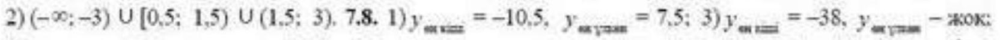 4) $\left.y_{\text {en zinl }}=9,4, y_{\text {ex yxxe }}=14,4 ; 10\right) y_{\text {en zing }}-$ WoK, $\left.y_{\text {en ymon }}=10,6,7,40,1\right) g(x)=4+x^{2} ; 2$ ) $g(x)=-5+x^{2}$. 7.41. 1) $f(x)=\operatorname{sign} x \cdot \sqrt{|x|}$; 2) $f(x)=-\operatorname{sign} x \cdot\left(x^{2}-4|x|\right)$.3) $f(x)=-\operatorname{sign} x \times \left.\left.\mathrm{x}\left(x^{2}-2|x|, 7.42,1\right) x_{\max }=2, x_{\max }=0, x_{\min }=4 ; 2\right) x_{\max }=-1, x_{\min }=-4, x_{\min }=2 ; 3\right) x_{\max }=-2$, $\left.\left.\left.\left.x_{\min }=-6, x_{\min }=2.7 .48 .1\right) \frac{3+6 \sqrt{2}-4 \sqrt{3}}{12} ; 2\right) \frac{1-2 \sqrt{2}+4 \sqrt{3}}{4}, 7.49,1\right)[-2 ;+\infty) ; 2\right)[-2.25 ;+\infty)$. 8.7. 1) $\left.\left.f(x)=1-\frac{1}{x-2} ; 2\right) f(x)=-2+\frac{1}{x+1} \cdot 8.11 . f(x)=\left|\frac{2 x-1}{x+1}\right|, 8.15,1\right) \cos (2 ; 2) \frac{\sqrt{3}}{2} \cdot \sin \alpha$; 3) $\sqrt{2} \cos \alpha_{;}$4) $0.5 \sin ($ a. 8.16 . 1) $\left.\left.\left.\left.1: 2) \sqrt{3}-1: 3\right) 1 ; 4\right) \sqrt{3}: 5\right) \frac{\sqrt{3}}{2}: 6\right)-\frac{\sqrt{3}}{2}, 9.1$. 1) Æ 4 п: 2) так: 3) так: 4) жұп. 9.2. 1) $D(f)=(-\infty ; 1) \cup(1 ;+\infty) ; E(f)=\{-1 ; 1\} ; 2) D(f)=(-\infty ;-2) \cup \cup(-2 ;+\infty) ; E(f)=\{-1 ; 1\} ; 3) D(f)=[0 ; 4) \cup(4 ;+\infty) ; E(f)=(-\infty ;-0,5] \cup(0 ;+\infty)$; 4) $D(f)=[2 ; 3) \cup(3 ;+\infty) ; E(f)=(-\infty ;-2] \cup(0 ;+\infty), 9.8,1) y_{\text {ex van }}=-2,25, y_{\text {en youm }}=-2$; 2) $y_{\text {excial }}=-14, y_{\text {ex puar }}=2.9 .14$. 1) $\left.\left.f(2 x)=4 x^{2}-2 ; 2\right) g\left(x^{2}\right)=\frac{1}{x^{2}+2} \cdot 9.16 .1\right) \sin \alpha$; 2) $-\cos \alpha$; 3) $\operatorname{tg} \alpha$; 4) 1.9 .17 . 1) III немесе IV ширекте: 2) I немесе IV ширекте:
3) II немесе III шнректе. 10.2. 1) $f(3 x)=3 x-1 ; f(2 x-1)=2 x-2 ; f\left(2 x^{2}-1\right)=2 x^{2}-2$;
2) $f(3 x)=3-18 x^{2}: f(2 x-1)=3-2(2 x-1)^{2}: f\left(2 x^{2}-1\right)=3-2\left(2 x^{2}-1\right)^{2}$; 3) $f(3 x)=9 x-9 x^{2} ; f(2 x-1)=6 x-3-(2 x-1)^{2} ; f\left(2 x^{2}-1\right)=6 x^{2}-3-\left(2 x^{2}-1\right)^{2}$. 10.3. 1) $x=\sqrt{\frac{y}{1-y}}$; 2) $x=-\sqrt{\frac{y}{1-y}}$, 10.5. 1) Иэ; 2) иг; 3) жок. 10.7 . 1) $f(g(x))=\sqrt{3 x-2}-1$, $f(f(x))=x-2, g(g(x))=\sqrt{3 \sqrt{3 x-2}-2} ; 2) f(g(x))=3-\frac{2}{(x-2)^{3}}, f(f(x))=3-2\left(3-2 x^{3}\right)^{3}$. $\left.g(g(x))=\frac{x-2}{5-2 x} ; 5\right) f(g(x))=\sin \left(3\left(x^{2}-1\right)\right)+5\left(x^{2}-1\right) . f(f(x))=\sin (3(\sin 3 x+5 x))+ +5(\sin 3 x+5 x), g(g(x))=\left(x^{2}-1\right)^{2}-1$ 10.8. 1) Болады; 2) болады; 3) болмайды; 4) болады 10.9. 1) Болады; 2) болады; 3) болмайды: 4) болмайды. 10.10. 1) Болады;
1) Жок:
2) болмайды;
2) мумкін;
3) болалы;
3) жок:
4) болады.
4) мумкін.
10.12.
10.14. 1) $y=\sqrt{x-1}$; 2) $y=-1-\sqrt{-x}$; 3) $y=1+\sqrt{x}$; 4) $y=2-\sqrt{x}$. 10.15. 1) $y=1+\sqrt{x+1}$; 2) $y=-1-\sqrt{x+1}$; 3) $y=1.5-\sqrt{2,25+x}$; 4) $x 12$ ботканд $y=2+(x-2)^{2}$. 10.17.
1) -1 ;
2) 0.5 ;
3) $\frac{2 \sqrt{2}}{3}$.

\section*{2-тарау . ТРИГОНОМЕТРИЯ.ЛЫК ФУНКЦИЯ.ЛАР, О.ІАРДЫН КАСИЕТТЕРІ ЖӘНЕ ТРАФИКТЕРІ}
11.5. 1) $\left.\left.\frac{2 \pi}{3}: 2\right) \frac{2 \pi}{5}: 3\right) 6 \pi$ 11.6. 1) $2 \pi$, 2) $0.5 \pi$ 3) $\pi$, 4) $\pi$; 5) $0.25 \pi$ 6) $3 \pi 11.7$. 1) Болмайды:
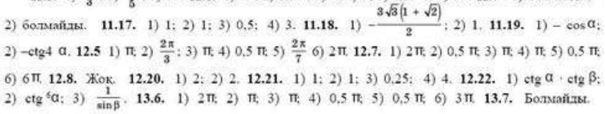 13.9. 1) $\left.\operatorname{tg}\left(-\frac{5 \pi}{4}\right)>\operatorname{tg}\left(\frac{7 \pi}{8}\right) ; 2\right) \operatorname{ctg} \frac{4 \pi}{9}<\operatorname{ctg} \frac{3 \pi}{8}$. 13.18. 1) Шексіз жиын; 2) шексіз жиыи. 13.19. 1) 1 ; 2) $\pi ;$ 3) $0.5 ;$ 4) 3.13 .20 . 1) $-\frac{\sqrt{6}}{3}$; 2) $\frac{3 \sqrt{2}}{2}$, 13.21. 1) $\left.0 ; 2\right) 0.14 .4$. 1) $D(f)=R$, $E(f)=[-3 ; 1] ; 2) D(f)=R, E(f)=[1 ; 5] ; 3) D(f)=R, E(f)=[1 ; 3]$ 14.11. 1) $[-0,5 ; 0,5] ;$ 2) $[-1 ; 1]:$ 3) $(0 ; 4] ; 4)[-1 ; 1]: 5)(0 ; 3]: 6)[1 ; 2)$. 14.12. 1) $\left.\left.\left.\frac{\pi}{3} ; 2\right) \frac{\pi}{3} ; 3\right) 2 \pi ; 4\right) 5 \pi$. 14.15. 1) $A=220 \mathrm{~B}, T=0,1$. жнілік $-20 \pi, 2) A=360 \mathrm{~B}, T=0,2$. жиілік $-10 \pi$; 3) $A=110$ В, $T=\frac{1}{15}$, жиілк $\left.-30 \pi ; 4\right) A=220$ В, $T=\frac{1}{30}$, жнілік $-60 \pi, 14.16 .1$ ) $A=5 a$, $T=0,1$, жиілк $-20 \pi ; 2$ ) $A=0,25$ а, $T=0,2$, жиілк $-10 \pi ; 3) A=10 \mathrm{a}, T=\frac{1}{15}$, жнілк - $30 \pi ; 4) A=0.8$ а. $T=\frac{1}{30}$, жиілік $-60 \pi$ 14.17. 1) $y=3 \cos \left(2 x+\frac{2 \pi}{3}\right)$; 2) $y=-2 \cos \left(3 x-\frac{3 \pi}{4}\right) \cdot 14.18$. 1) $\left[0 ; \frac{\pi}{6}\right]$ аралығында кемиді. $\left[\frac{\pi}{6} ; \frac{2 \pi}{3}\right]$ аралығында еседі: 2) еседі: 3) $\left(-1 ; \frac{\pi}{6}\right]$ аратыгында кемиді. $\left[\frac{\pi}{6} ; 1\right)$ аралынында еседі: 4) $\left[-\frac{7 \pi}{12} ;-\frac{\pi}{3}\right]$ аралығында өселі. $\left[-\frac{\pi}{3} ; 0\right]$ аралынында кемилі. 14.19, 2) $\left.p=-\frac{\pi}{6}+\frac{2 \pi n}{3}, n \in N, 14.20,1\right)-\frac{2 \pi}{3}+ \left.\left.+4 \pi_{n} \mathrm{~m}_{p} \mathrm{~m} 4 \pi_{n}, n \in Z ; 2\right) \frac{2 \pi}{3}+4 \pi_{n} \mathrm{~m}_{p} \mathrm{~m} \frac{13 \pi}{6}+4 \pi_{n}, n \in Z .14 .21 .1\right) \cos 4, \sin 3, \cos 5$, $\sin 2 ; 2) \sin 4, \sin 6, \sin 3, \sin 7,14.23,1)(0,5 ;+\infty) ; 2)(-\infty ;-1) \cup(1 ;+\infty), 14.24,1) 1 ; 2) 0$. 14.25. 1) Tepic: 2) on: 3) on: 4) repic.

\section*{3-тарау КЕРІ ТРИГОНОМЕТРИЯ.ТЫК ФУНКЦИЯЛАР}
15.1. 1) 1 : 2) 1 : 3) 2 ; 4) 1 ; 5) 2 ; 6) 0 . 15.2 . 1) $t=\frac{5 \pi}{6}$ : 2) $t=\frac{\pi}{3}$; 3) $t=\frac{\pi}{4}$; 4) $t=\pi$, 15.3. 1) $\left.\left.t=-\frac{\pi}{3} ; 2\right) t=\frac{\pi}{6} ; 3\right) t=\frac{\pi}{4}$ және $\left.t=\frac{3 \pi}{4} ; 4\right) t=\frac{\pi}{2} ; 15.4$. 1) $\left.t=-\frac{\pi}{6} ; 2\right) t=\frac{\pi}{3}$; 3) $t=\frac{\pi}{4}$;4) $t=\frac{3 \pi}{4}$.15.5.1) $t=-\frac{\pi}{3}$; 2) $\left.\left.t=\frac{\pi}{6} ; 3\right) t=\frac{\pi}{4} ; 4\right) t=\frac{3 \pi}{4}, 15.6$ 1) $\left.\left.-\frac{\pi}{2} ; 2\right) 0 ; 3\right)-\frac{\pi}{6}$; 4) $-\frac{\pi}{3}, 15.7$. 1) $\frac{\pi}{2} ; 2$ ) $0 ;$ 3) $\frac{3 \pi}{4} ;$ 4) $\frac{5 \pi}{6}, 15.8$. 1) $\left.\frac{\pi}{4} ; 2\right) 0 ;$ 3) $\left.-\frac{\pi}{4} ; 4\right)-\frac{\pi}{6} .15 .9$. 1) Жок; 2) ит; 3) нэ: 4) жок. 15.10. 1) Жок: 2) нэ; 3) но; 4) жок. 15.11. 1) Иг; 2) нэ; 3) нэ; 4) иг. 15.12. 1) Жок: 2) жок; 3) из; 4) жок; 5) из; 6) из. 15.13. 1) Артык; 2) артык; 3) кем; 4) тен. 15.14. 1) $\frac{7 \pi}{12}$; 2) $\frac{\pi}{2}$; 3) $-\frac{\pi}{6}$; 4) $\frac{5 \pi}{12}$. 15.15. 1) $\frac{5 \pi}{12}$; 2) $-\frac{7 \pi}{12}$; 3) $\frac{3 \pi}{2}$; 4) $\frac{2 \pi}{3}$. 15.16. 1) $\frac{2 \pi}{3}$; 2) $-\frac{5 \pi}{6}$; 3) $\frac{\pi}{2}$; 4) $\frac{19 \pi}{12}$. 15.17. 1) $-\frac{5 \pi}{6}$; 2) $\frac{7 \pi}{3}$; 3) $\frac{7 \pi}{6}$; 4) $\frac{\pi}{3}$, 15.20. 1) $\arcsin \frac{\pi}{6}$, $\arcsin \frac{\pi}{9}$, $\left.\arcsin (-0,1), \quad \arcsin (-0,3) ; \quad 2) \arccos (-1), \quad \arccos (-0,2), \quad \arccos \frac{\pi}{9}, \arccos \frac{\pi}{6}, 15.21,1\right) \operatorname{arctg}(-7,3)$, $\left.\operatorname{arctg}(-0,3), \quad \operatorname{arctg} \frac{\pi}{6}, \operatorname{arctg} \frac{5 \pi}{9} ; 2\right) \operatorname{arcctg} \frac{5 \pi}{9}, \operatorname{arcctg} \frac{2 \pi}{5}, \operatorname{arcctg}(-2,2), \quad \operatorname{arcctg}(-111)$. 15.22.
1) $\frac{\sqrt{6}}{2}$ :
1) $\cos 2 \alpha_{\text {; }}$
1) $[-0.5 ; 0.5]$;
2) $0,15.23$.
2) $\sin \mathrm{C}_{1}$ 16.1.
2) $[0 ; 1]$ :
3) $[-1: 0]$ :
4) $[-3 ;-1]$. 16.2. 1) $\left[-\frac{1}{3} ; \frac{1}{3}\right]$; 2) $\left.\left.[0 ; 1] ; 3\right)[-2 ;-1] ; 4\right)[2 ; 4]$. 16.5. 1) $[-1 ; 2 \pi-1]$; 2) $\left[1-\frac{\pi}{2} ; \frac{\pi}{2}+1\right]$; 3) $\left.[2-\pi \cdot 2] ; 4\right)[2-\pi \cdot 2+\pi]$. 16.6. 1) $\left.(\infty ;-1] \cup[1 ;+\infty) ; 2\right)(-\infty ; 1] \cup[3 ;+\infty)$; 3) $(-\infty ;-4] \cup[0 ;+\infty) ; 4)(-\infty ; 0] \cup[2 ;+\infty)$. 16.7. 1) $\arcsin (-0,2) ; \quad \arcsin \frac{\pi}{6} ; \arcsin 0.8 ;$ 2) $\left.\arcsin \left(-\frac{\pi}{3}\right) ; \arcsin (-0,1) ; \quad \arcsin 0,9 ; \quad 3\right) \arcsin (-0,8) ; \quad \arcsin \frac{\pi}{18} ; \arcsin 0,3$. 16.8. 1) $\arccos 0,8$; $\left.\left.\arccos \frac{\pi}{6} ; \arccos (-0.2) ; 2\right) \arccos 0.9 ; \arccos (-0.1) ; \arccos \left(-\frac{\pi}{3}\right) ; 3\right) \arccos 0.3 ; \arccos 0 ;$ arecos(-0.7). 16.9. 1) Жұn та емес, так та емес; 2) жұп: 4) жұп та емес, так та емес. 16.18. 1) $0:$ 2) $2 \cos ^{2} a$. 17.1. 1) $0,2:$ 2) $-0,3:$ 3) $-\frac{\sqrt{5}}{4}$ : 4) 0,$6 ;$ 5) $-0,4$ : 6) $\frac{\sqrt{3}}{2}$. 17.3. 1) $-\frac{5 \pi}{12}$ : 2) $-\frac{\pi}{12}$; 3) $\frac{5 \pi}{4}$ : 4) $-\frac{2 \pi}{3}$. 17.4. 1) Жок: 2) жок: 3) из: 4) жок: 5) иг; 6) жок. 17.5 . 1) $\frac{2 \sqrt{2}}{3}$; 2) $\frac{3 \sqrt{5}}{7}$; 3) $\frac{\sqrt{15}}{8}$; 4) $\frac{4 \sqrt{5}}{9}$, 17.6 . 1) $0.2 ;$ 2) $-\frac{1}{6}$; 3) $-\frac{7}{8}$; 4) $\frac{4 \sqrt{2}}{9}$. 17.7. 1) $1.5 ;$ 2) $-1.5 ;$ 3) $\frac{6 \sqrt{37}}{37} ;$ 4) $\frac{3 \sqrt{13}}{13}, 17.8$. 1) $\frac{3 \sqrt{5}}{2} ;$ 2) $\frac{\sqrt{21}}{2} ;$ 3) $\frac{\sqrt{15}}{15} ;$ 4) $-\frac{\sqrt{5}}{2}$. 17.9. 1) $20 \%$ 2) -40: 3) $10 \%$ 4) $70 \%$ 17.10. 1) Нь; 2) но; 3) на: 4) жок: 5) жок; 6) нь. 17.11. 1) Жок: 2) из: 3) жок: 4) жок: 5) из: 6) из. 17.12. 1) Иә; 2) из; 3) из; 4) жок: 5) жок; 6) жок. 17.13. 1) Жок: 2) из: 3) жок; 4) жок: 5) жок: 6) из. 17.14. 1) [1: 3]: 2) $[1 ; 2]:$ 3) $\left.\sqrt{2} \mathrm{~m}_{|a|} \mathrm{m}_{2} ; 4\right)[-2.5 ;-1,5]$; 5) $[3 ; 4]$; 6) $\sqrt{2} \mathrm{~m}|a| \mathrm{m} \sqrt{3}$. 17.15. 1) 1,2 ; 2) $\pi-2$; 3) $6-2 \pi$; 4) $20-6 \pi$ 17.16. 1) 1,1 ; 2) 2 ; 3) $2 \pi-6$; 4) $20-6 \pi$ 17.17. 1) 1.2 ; 2) $5-2 \pi$; 3) $2 \pi-6$; 4) $10-3 \pi$ 17.18. 1) $\frac{1+8 \sqrt{3}}{15}$; 2) $\frac{\sqrt{15}+2 \sqrt{6}}{20}$; 3) $-\frac{6}{7}$; 4) $\frac{19}{9}$. 17.19. 1) $\left.\frac{120}{119} ; 2\right)-0.75 ;$ 3) $\left.\left.\left.0.8,17.20,1\right) \emptyset: 2\right)\{0\}: 3\right)\left[-\frac{1}{3} ; \frac{1}{3}\right]$ : 4) R. 17.21. 1) $\frac{7 \sqrt{170}}{170}$ : 2) $\frac{\sqrt{5}(1+4 \sqrt{6})}{25}$; 3) $\frac{0.2+4 \sqrt{0.96}}{\sqrt{0.96}-0.8}$ 4) $\frac{5 \sqrt{0.84}+0.4}{2-\sqrt{0.84}}, 17.24$, 1) $\left.\left.\left.\{ \pm \sqrt{2}\} ; 2\right)\{ \pm 2\} ; 3\right)\{ \pm \sqrt{2}\} ; 4\right)\{ \pm 3\}$. 17.25. 1) $1 \pm \sqrt{5}$; 2) $\frac{-1 \pm \sqrt{21}}{2}$; 3) $\left.\pm 2 ; 4\right)$ 4. 18.1. 1) $\frac{\sqrt{3}}{4}$; 2) $\frac{\sqrt{2}}{6}$; 3) $\frac{\sin 1}{2}$; 4) 0 . 18.2. 1) $\frac{\sqrt{3}}{4}$; 2) $\frac{1}{6}$; 3) 0 : 4) $\frac{1}{2}$. 18.3. 1) $\frac{1}{4}$; 2) $-\frac{\sqrt{3}}{3}$; 3) $\frac{\sqrt{3}}{2}$; 4) 0 . 18.4 . 1) 1 ; 2) $2-\frac{\sqrt{3}}{2}$; 3) 4; 4) $\frac{\sqrt{3}-2}{4}$. 18.5 . 1) $\emptyset$; 2) $-\frac{1}{2}:$ 3) $4: 4$ ) -1.18 .6 . 1) $\frac{9-\sqrt{3}}{12}$; 2) Ф; 3) $1 \frac{1}{9}$; 4) $\frac{1}{4}$. 18.7. 1) 3 және $\frac{1}{3}$; 2) 0 және $1 \frac{2}{3}$; з) -2 және 2: 4) $\pm \sqrt{3}$. 18.8. 1) 3; 2) -2 және 2; 3) 0 жоне 3; 4) $0: 3$ жәие 5.18 .9 . 1) $-\frac{\sqrt{3}}{3} ; \sqrt{3}$; 2) ±1: 3) 9 және -1; 4) 2 және 3. 18.10. 1) $\frac{\sqrt{2}}{2}$ : 2) $\frac{\sqrt{3}}{2}$ : 3) $0.5 ;$ 4) O. 18.11. 1) $1: 2$ ) $\left.1: 3\right) 0$ : 4) -1 . 18.12. 1) $\sqrt{\frac{\sqrt{5}-1}{2}}$ : 2) 1: 3) $\frac{\sqrt{2}}{2}$; 4) $\sqrt{\frac{\sqrt{5}-1}{2}}$, 18.13. 1) 0 . 18.14 . 1) $-\frac{1}{4}$; 2) $\frac{1}{8}$; 3) $[0 ; 1]$; 4) $[-1 ; 1] .18 .17$. 1) $\left.\operatorname{tg} \frac{2 \pi}{5} ; 2\right) \frac{\sqrt{2}+1}{3}$. 18.18. 1) $\left.\left.0.16 \sqrt{21} ; 0.68 ; 2\right) 0.75 ;-\frac{24}{7} ; 3\right)-\frac{1}{3} ;-\frac{2 \sqrt{2}}{3}$, 18.19. 1) $\left.\frac{1}{3} ; \frac{2 \sqrt{2}}{3} ; \frac{4 \sqrt{2}}{3} ; 2\right)-\frac{\sqrt{7}}{3} ;-\frac{\sqrt{14}}{7}, 18.20 . \frac{3 \sqrt{105}-1}{32} ; \frac{3 \sqrt{7}-\sqrt{15}}{32}$.

\section*{4-rapay . ТРИГОНОМЕТРИЯ.ТЫК ТЕНДЕУЛЕР ЖЭНЕ ТЕНСІЗДКТЕР}
19.1. 1) $\left.\left.\left.\left\{ \pm \frac{\pi}{6}+2 \pi n, n \in Z\right\} ; 2\right)\left\{ \pm \frac{\pi}{4}+2 \pi n, n \in Z\right\} ; 3\right)\left\{ \pm \frac{\pi}{3}+2 \pi n, n \in Z\right\} ; 4\right)\left\{ \pm \frac{5 \pi}{6}+2 \pi n\right.$. $n \in Z\}$; 5) $\left\{ \pm \frac{\pi}{2}+\pi n, n \in Z\right\}$; 6) (2 $\left.\pi n, n \in Z\right\}$, 19.2. 1) $\left\{(-1)^{n} \frac{\pi}{3}+\pi r, n \in Z\right\}$; 2) $\left\{(-1)^{n} \frac{\pi}{4}+\right.$
+ Th, $n \in Z\}$; 3) $\left\{(-1)^{n-1} \frac{\pi}{6}+\Pi_{n}, n \in Z\right\}$; 4) $\left\{(-1)^{n+1} \frac{\pi}{3}+\Pi_{n}, n \in Z\right\}$; 5) ( $\left.\Pi_{n}, n \in Z\right\}$;
6) $\left\{(-1)^{n}+1 \frac{\pi}{4}+\Pi_{n}, n \in Z\right\}$. 19.3. 1) $\left\{\operatorname{arctg} 3+\Pi_{n}, n \in Z\right\}:\left\{\operatorname{arctg}(-2)+\Pi_{n}, n \in Z\right\}$;
3) $\left.\left.\left.\left\{-\frac{\pi}{6}+\pi_{n}, n \in Z\right\} ; 4\right)\left\{\frac{2 \pi}{3}+\pi_{n}, n \in Z\right\} ; 5\right)\left\{\frac{\pi}{2}+\pi_{n}, n \in Z\right\} ; 6\right)\left(\pi-\operatorname{arcctg} 3+\pi_{n}, n \in Z\right\}$.
19.4. 1) $\left.\left.\left\{ \pm(\pi-\arccos 0.7)+2 \pi_{n}, n \in Z\right\} ; 2\right)\left\{(-1)^{n+1} \arcsin \frac{\sqrt{5}}{4}+\pi_{n}, n \in Z\right\} ; 3\right)( \pm \arccos 0.3+ \left.\left.\left.\left.+2 \Pi_{n}, n \in Z\right\} ; 4\right)\left(\pi-\operatorname{arcctg} 5-\Pi_{n}, n \in Z\right\} ; 5\right)\left(\Pi_{n}, n \in Z\right\} ; 6\right)\left\{-\frac{\pi}{2}+2 \Pi_{n}, n \in Z\right\}$.
19.5. 1) $\left.\left.\left\{(-1)^{n} \frac{\pi}{6}+\frac{1}{2} \Pi_{1}, n \in Z\right\} ; 2\right)\left\{ \pm \frac{\pi}{12}+\frac{2 \pi n}{3}, n \in Z\right\} ; 3\right)\left\{(-1)^{n-1} \frac{\pi}{12}+0.5 \Pi_{1}, n \in Z\right\}$;
4) $\left\{-\frac{\pi}{3}+2 \pi_{n}, n \in Z\right\}$; 5) $\left\{0,25 \pi_{n}\right.$. $\left.n \in Z\right\}$; 6) $\left\{-\frac{\pi}{12}+\frac{1}{3} \pi_{n}\right.$, $\left.n \in Z\right\}$, 19.6. 1) 0 ; 2) 0 ;
3) $\left\{(-1)^{n+1} \frac{\pi}{2}+3 \pi_{n}, n \in Z\right\}$; 4) $\left\{-\frac{\pi}{30}+0,2 \pi_{n}, n \in Z\right\}$; 5) $\left\{\frac{\pi}{8}+\frac{1}{4} \pi_{n}, n \in Z\right\}$; 6) $\left\{\frac{\pi}{12}+\frac{1}{3} \pi_{n}\right.$. $n \in Z\}$. 19.7. 1) $\left\{(-1)^{n} \frac{\pi}{6}+\frac{\pi}{6}+\frac{1}{2} \Pi n, n \in Z\right\}$; 2) $\left\{ \pm \frac{\pi}{12}+\frac{2 \pi n}{3}, n \in Z\right\}$; 3) $\left\{(-1)^{n+1} \frac{\pi}{12}+\right. \left.\left.\left.\left.+1+0.5 \Pi_{n}, n \in Z\right\} ; 4\right)\left\{-\frac{\pi}{3}-4+2 \Pi_{n}, n \in Z\right\} ; 5\right)\left(0.25+0.25 \Pi_{n}, n \in Z\right\} ; 6\right)\left\{\frac{\pi n}{2}, n \in Z\right\}$.
19.8. 1) $\left\{(-1)^{n+1} \frac{\pi}{6}-\frac{\pi}{12}+\frac{1}{2} \pi n, n \in Z\right\}$; 2) $\left\{ \pm \frac{\pi}{4}+\frac{2}{3}+\frac{2 \pi n}{3}, n \in Z\right\}$; 3) $\left\{(-1)^{n} \frac{\pi}{18}-\right. -1+\frac{1}{3} \Pi_{r}$. n $\left.\in Z\right\}$; 4) $\left\{-\frac{\pi}{15}+0.4+0.2 \Pi_{r}\right.$. n $\left.\in Z\right\}$; 5) $\left\{0.75-\frac{\pi}{8}+0.5 \Pi_{n}\right.$. n $\left.\in Z\right\}$;
6) $\left\{-\frac{\pi}{36}+\frac{\pi n}{3}, n \in Z\right\} .19 .9$. 1) $\left.\left\{(-1)^{n} \frac{\pi}{21}+\frac{1}{7} \pi_{n}, n \in Z\right\} ; 2\right)\left\{(-1)^{n+1} \frac{\pi}{12}+0.5 \pi_{n}, n \in Z\right\}$;
3) $\left\{ \pm \frac{\pi}{6}+\frac{\pi n}{2}, n \in Z\right\}$; 4) $\left\{ \pm \frac{\pi n}{21}+\frac{2 \pi n}{7}, n \in Z\right\}$. 19.10. 1) $\left\{\frac{\pi n}{2}, n \in Z\right\}$; 2) $\left\{\frac{\pi n}{2}, \frac{\pi}{10}+\frac{\pi n}{5}\right.$, $n \in Z\}:$ 3) $\left\{\frac{\pi}{2}+\Pi_{1}, \frac{\pi}{4}+\frac{\pi n}{2}, n \in Z\right\}$, 19.11. 1) $\left.\left\{\frac{\pi}{12}+\frac{\pi n}{6}, n \in Z\right\} ; 2\right)\left\{ \pm \frac{5 \pi}{24}+\frac{\pi n}{2}, n \in Z\right\}:$
3) $\left.\left\{-\frac{\pi}{8}+\frac{\pi n}{2}, n \in Z\right\} ; 4\right)\left\{ \pm \frac{\pi}{18}+\frac{\pi n}{3}, n \in Z\right\}$.19.12. 1) $\left.\left.\left\{135^{\circ}, 165^{\circ}\right\} ; 2\right)\left\{310^{\circ}, 350^{\circ}\right\} ; 3\right)\left(370^{\circ}, 410^{\circ}\right\}$;
4) $\left\{130^{\circ}, 170^{\circ}\right\}, 19.13$, 1) $\left.90^{\circ}: 2\right) 45^{\circ}:$ 3) $\left.40^{\circ}, 80^{\circ}: 4\right) 210^{\circ}, 19.14$. 1) $\left\{\frac{\pi}{4}+\frac{\pi n}{2}, n \in Z\right\}$,
2) $\left\{ \pm \frac{\pi}{6}+\pi_{n}, n \in Z\right\}$; 3) $\left\{ \pm \frac{\pi}{9}+\frac{\pi n}{3}, n \in Z\right\}$; 4) $\left\{ \pm \frac{\pi}{6}+\frac{\pi n}{2}, n \in Z\right\}$. 19.15. 1) $\left\{130^{\circ} ; 126^{\circ}\right\}$;
2) $\left(18^{\circ}: 162^{\circ}\right\}$ : 3) $\left(25^{\circ}: 27^{\circ}\right\}$ : 4) $\left\{234^{\circ}\right\}$, 19.16. 1) $\emptyset$ : 2) 2; 3) 2; 4) шексіз жиын.
19.17. 1) $\left.\left.\pm \sqrt{\frac{6}{2 n-1}}, n \in N: 2\right) \frac{1}{2}+n, n \in Z ; 3\right) 180^{\circ}$. 19.18. 1) $\left.0 ; 2\right)$ 1; 3) 1. 19.19. 1) Шexcis; 2) шексіз: 3) $2 ; 4) 2.19 .20 .1$ ) $\left.\left[0 ; \frac{\pi}{6}\right) \cup\left(\frac{\pi}{6} ; \frac{5 \pi}{6}\right) \cup\left(\frac{5 \pi}{6} ; 6\right] ; 2\right)[2 ; \pi) \cup(\pi ; 2 \pi) \cup(2 \pi ; 7]$.
19.22. 1) $(-1)$ "arcsin $\left.\frac{1}{4}+\Pi_{n} . n \in Z ; 2\right)-\frac{\pi}{3} \pm \frac{\pi}{6}+2 \Pi_{n} . n \in Z$. 20.1. 1) $\left\{\frac{\pi}{4}+\frac{\pi n}{2}, \frac{\pi}{6}+\frac{2 \pi n}{3}, n \in Z\right\}$ :
2) $\left\{\frac{\pi}{6}+\frac{\pi n}{3}, n \in Z\right\}$; 3) $\left\{\frac{\pi n}{3}, \pm \frac{\pi}{8}+\pi, n \in Z\right\}$; 4) $\left\{\frac{\pi n}{2}, n \in Z\right\}$, 20.2. 1) $\left\{-25^{\circ}+180^{\circ} \cdot n, n \in Z\right\}$;
2) $\left\{95^{\circ}+180^{\circ} \cdot n+n \in Z\right\} ; 20.3$. 1) $\left.\frac{\pi}{24}+\frac{\pi n}{6} ; \frac{\pi}{2}+\pi n, n \in Z ; 2\right)\left\{\frac{\pi n}{2}, n \in Z\right\}$. 3) $\frac{\pi n}{8}, n \in Z$;
4) $\frac{\pi n}{7}, \frac{\pi n}{5}, n \in Z: 20.4$. 1) $\left.\left\{-\frac{\pi}{4}+\pi_{n}, \frac{\pi}{2}+\pi_{n}, n \in Z\right\} ; 2\right)\left\{\frac{\pi}{4}+\pi_{n}, n \in Z ; \operatorname{arctg} 2+\pi_{n}, n \in Z\right\}$;
3) $\left.\left\{\frac{\pi}{4}+\pi_{n}, n \in Z ;-\operatorname{arctg} \frac{2}{5}+\pi_{n}, n \in Z\right\} ; 4\right)\left\{\frac{\pi}{4}+\pi_{n}, n \in Z ; \operatorname{arctg} \frac{1}{4}+\pi_{n}, n \in Z\right\}$.
20.5. 1) $\left\{-\frac{\pi}{4} \pm \frac{5 \pi}{6}+2 \Pi, n \in Z\right\}$;
2) $\left\{\frac{\pi}{8} \pm \frac{3 \pi}{8}+\pi n, n \in Z\right\}$;
3) $\left\{\frac{\pi}{4}+2 \pi n, n \in Z\right\}$ :
4) $\left\{\frac{\pi}{6} \pm \frac{\pi}{12}+\pi_{2}, n \in Z\right\}$.
20.6.
1) $90^{\circ}$;
2) $720^{\circ}$;
3) $486^{\circ}$ :
4) $780^{\circ}$,
20.7. 1
1) $\frac{\pi n}{3}, n \neq 3 m, n, m \in Z:$
2) 0.20 .8 . 1) $\left\{\frac{\pi n}{5} ; \frac{\pi n}{2}, n \in Z\right\}$;
3) $\left\{ \pm \frac{\pi}{6}+\frac{\pi n}{2}, n \in Z\right\}$;
5) $\left\{ \pm \frac{4 \pi}{3}+4 \pi_{1}, n \in Z: \frac{\pi}{4}+\frac{\pi n}{2}, n \in Z\right\}$ :
6) $\left\{\frac{9 \pi n}{2}, n \in Z: \frac{9 \pi}{2}+9 \pi n, n \in Z\right\}$.
20.9.
1) $\frac{\pi n}{8}, n \in Z: \frac{\pi}{8}+\frac{\pi n}{4}, n \in Z:$
2) $\frac{\pi}{4}+\frac{\pi n}{2}, n \in Z$ : $\pm \frac{\pi}{3}+\pi_{n}, n \in Z ;$
3) $\frac{\pi}{8}+\frac{\pi n}{4}, n \in Z: \frac{\pi n}{2}, n \in Z ;$
4) $\left.\frac{\pi n}{14}, n \in Z ; 6\right) \frac{2 \pi n}{15}, n \in Z ; \frac{\pi}{17}+\frac{2 \pi n}{17}, n \in Z$.
20.10. 1) $\frac{\pi}{8}+\frac{\pi n}{2}, n \in Z:-\frac{\pi n}{12}+\Pi_{n}, n \in Z$ :
2) $\left.\frac{\pi n}{12}+\Pi_{n}, n \in Z: \frac{7 \pi}{48}+\frac{\pi n}{4}, n \in Z: 4\right) \Pi_{n}, n \in Z: \left\{\frac{\pi}{9}+\frac{\pi n}{3}, n \in Z\right\}$, 20.11.
1) $\left\{\frac{\pi}{4}+2 \pi n, n \in Z\right\}$ :
2) $\left\{-\frac{\pi}{4}+2 \pi_{n}, n \in Z\right\}$;
3) $\left\{-\frac{\pi}{4}+\Pi_{n}, n \in Z\right\}$.
20.12.
1) $\left(\frac{\pi}{8}+\frac{\pi n}{2} ; \frac{3 \pi}{8}+\frac{\pi n}{2}\right)$. $n \in Z$ :
2) $\left(\frac{7 \pi}{6}+\pi n ;-\frac{\pi}{6}+\pi n\right), n \in Z ;$
3) $\left(-\frac{\pi}{6}+\Pi_{2},-\Pi_{2}\right)$. $\left(-\frac{\pi}{2}+\Gamma_{n} ; \frac{\pi}{3}-\Gamma_{n}\right), n \in Z$. 20.13. 1) $\left.\left\{ \pm \frac{2 \pi}{3}+2 \Pi_{n}, n \in Z\right\} ;\left\{\frac{\pi}{4}+\Pi_{n}, n \in Z\right\} ; 2\right)\left\{\frac{\pi}{4}+\frac{\pi}{2} n, n \in Z ;\right. \left.(-1)^{k} \frac{\pi}{12}+\frac{\pi k}{2}, k \in Z\right\}$;
3) $\left\{-\frac{\pi}{12} \pm \frac{\pi}{3}+\pi_{1}, n \in Z\right\}$;
; 4) $\left\{\frac{\pi}{4}+\pi_{n}, n \in Z\right\}$.
20.14. 1) $\left\{\frac{\pi}{6}+2 \pi n, n \in Z\right\}$; $\left\{\frac{5 \pi}{6}+2 \pi n, n \in Z\right\} ;$
2) $\left\{-\frac{\pi}{4}+\pi_{n}, n \in Z\right\}$,
3) $\left\{ \pm \frac{\pi}{3}+2 \pi n, n \in Z\right\}$;
4) $\{\Pi n, n \in Z\}$.
20.15.
1) $\left\{\frac{\pi}{10}+\frac{\pi n}{5}, \frac{\pi}{4}+\frac{\pi n}{2}, \frac{\pi}{2}+\pi_{n}, n \in Z\right\}$;
2) $\left\{ \pm \frac{\pi}{12}+\frac{\pi n}{4}, n \in Z\right\}$;
4) $\left\{\frac{9 \pi n}{2}, n \in Z:\right.$ $\left.\frac{9 \pi}{2}+9 \Pi_{n}, n \in Z\right\} ;$
20.16.
1) $\left\{\frac{\pi}{2}+2 \pi_{n}, n \in Z ;-\frac{\pi}{6}+2 \pi_{n}, n \in Z\right\}$;
2) $\left\{ \pm \frac{\pi}{6}+\pi n, n \in Z\right\}$;
3) $\left\{ \pm \frac{\pi}{3}+\pi_{n}, n \in Z\right\}$;
4) $\left\{-\frac{\pi}{6}+\pi_{n}, n \in Z\right\}$,
20.17. 1) $\left(2 \pi n \pm \frac{\pi}{3} ; 2 \pi k\right)\left(2 \pi n \pm \frac{2 \pi}{3} ; 2 \pi k+\pi\right) ; \left.k, n \in Z: 2)\left(\frac{\pi}{2}+\Pi_{n} ; 2 \Pi_{k}\right):\left(\Pi_{n}: \frac{\pi}{2}+2 \Pi_{k}\right) ; k, m \in Z: 3\right)\left(\frac{\pi}{2}-k-\frac{1}{4} ; \frac{\pi}{2}+k+\frac{1}{4}\right), k \in Z$.
20.18.
1) $(0.5 ;+\infty)$;
2) $(-\infty ;-1)$
U (1: $+\infty$ ).
20.19. 1) Он: 2) теріс: 3) теріс: 4) он. 20.20.
1) $(-\infty ;-3] \cup$
(2) $\cup[4 ;+\infty): 2)(-\infty ;-6] \cup\left[\frac{2}{3} ; 1,5\right]$;
3) $(-3 ;-1,8] \cup(-1 ; 3)$. 20.21. 1) $\left.(-\infty ;-6] \cup[3 ;+\infty): 2)(-\infty ;-3.4] \cup[1 ;+\infty): 3)\left(-\infty ; \frac{1}{3}\right) \cup(2.5 ;+\infty) .20 .22 .1\right) \cos 4< <\sin 3<\cos 5<\sin 2 ; 2) \sin 4<\sin 6<\sin 3<\sin 7$. 21.1. 1) $\left(\frac{\pi}{3}+2 \pi_{n}: \frac{2 \pi}{3}+2 \pi_{n}\right) \cdot n \in Z ;$ 2) $\left.\left.\left(-\frac{4 \pi}{3}+2 \pi n ; \frac{\pi}{3}+2 \pi n\right), n \in Z ; 3\right\rangle\left[-\frac{\pi}{4}+2 \pi n ; \frac{5 \pi}{4}+2 \pi\right], n \in Z ; 4\right)\left(-\frac{\pi}{2}+2 \pi n ; \frac{3 \pi}{2}+2 \pi n\right)$; 21.2. 1) $\left.\left.\left(-\frac{5 \pi}{6}+2 \pi n ; \frac{5 \pi}{6}+2 \pi n\right), n \in Z ; 2\right)\left(\frac{\pi}{3}+2 \pi n ; \frac{5 \pi}{3}+2 \pi n\right), n \in Z ; 3\right)\left[-\frac{3 \pi}{4}+2 \pi n ; \frac{3 \pi}{4}+2 \pi n\right]$. $n \in Z: 4)\left(-\pi+2 \pi_{n} ; \pi+2 \pi_{n}\right), n \in Z .21 .3$ 1) $\left.\left(\frac{\pi}{6}+\pi n ; \frac{\pi}{2}+\pi n\right), n \in Z ; 2\right)\left(-\frac{\pi}{2}+\pi_{n} ;-\frac{\pi}{6}+\pi_{n}\right)$, $n \in Z$; 3) $\left[\frac{\pi}{3}+\pi_{n} ; \frac{\pi}{2}+\pi_{n}\right], n \in Z$;4) $\left[-\frac{\pi}{4}+\pi_{n}, \frac{\pi}{2}+\pi_{n}\right], n \in Z$. 21.4. 1) $\left(\pi_{n} ; \frac{\pi}{3}+\pi_{n}\right)$, $\left.\left.n \in Z ; 2)\left(\frac{2 \pi}{3}+\Pi_{n} ; \Pi+\Pi_{n}\right), n \in Z ; 3\right)\left(\Pi_{n} ; \frac{\pi}{6}+\Pi_{n}\right), n \in Z ; 4\right)\left[\frac{3 \pi}{4}+\Pi_{n} ; \Pi+\Pi_{n}\right), n \in Z$. 21.5. 1) $\left.\left.\left[\frac{\pi}{12}+\pi n ; \frac{5 \pi}{12}+\pi n\right], n \in Z ; 2\right)\left[\frac{\pi}{6}+\pi_{n}: \frac{5 \pi}{6}+\pi_{n}\right], n \in Z ; 3\right)\left[-\frac{7 \pi}{24}+0,5 \pi n ; \frac{\pi}{24}+0,5 \pi n\right]$. $\left.\left.n \in Z: 4)\left(-\frac{\pi}{6}+\pi n ; \frac{\pi}{6}+\pi n\right), n \in Z .21 .6 .1\right)\left[\pi_{n} ; \frac{2 \pi}{3}+\pi_{n}\right], n \in Z ; 2\right)\left(-\frac{\pi}{24}+\frac{\pi n}{2} ; \frac{\pi}{8}+\frac{\pi n}{2}\right)$,
$\left.\left.n \in Z ; 3)\left[4 \Pi_{n} ; \pi+4 \Pi_{n}\right], n \in Z .21 .7 .1\right)\left[-\frac{\pi}{3}+2 \pi n ; \frac{\pi}{3}+2 \pi n\right], n \in Z .21 .81\right)\left[-\frac{\pi}{4}+\Pi_{n} ; \frac{\pi}{4}+\Pi_{n}\right]$, $\left.\left.n \in Z: 2)\left[-\frac{\pi}{4}+\pi_{n}: \frac{\pi}{4}+\pi_{n}\right], n \in Z: 4\right)\left(\pi_{n}, \pi+\pi_{n}\right), n \in Z, 21.9,1\right)\left(2 \pi_{n}: \pi+2 \pi_{n}\right)$. $\left.n \in Z ; 2)\left[-\frac{\pi}{2}+2 \pi_{1} ; \frac{\pi}{2}+2 \pi_{1}\right], n \in Z ; 3\right)\left[\pi_{1} ; \frac{\pi}{2}+\pi_{1}, n \in Z .21 .10 .1\right)\left(-\frac{2 \pi}{3}+\pi_{1} ;-\frac{\pi}{6}+\pi_{1}\right)$, $\left.\left.n \in Z ; 2)\left(-\frac{5 \pi}{12}+2 \pi n ; \frac{\pi}{12}+2 \pi n\right), n \in Z: 3\right)\left[\pi n: \frac{\pi}{6}+\pi n\right], n \in Z .21 .11 .1\right)\left[-\frac{\pi}{4}: 0\right):$ 2) $\left(\frac{\pi}{2} ; \frac{3 \pi}{4}\right]$, 21.12. 1) $\left.\left.\left[\frac{\pi}{6} ; \frac{5 \pi}{6}\right] \cup\left[\frac{13 \pi}{6} ; 7\right] ; 2\right)\left[0 ; \frac{\pi}{6}\right) \cup\left(\frac{\pi}{6} ; \frac{5 \pi}{6}\right] \cup\left(\frac{5 \pi}{6} ; 6\right] ; 3\right)\left(2 ; \frac{2 \pi}{3}\right]$; 4) $\left.\left[\frac{\pi}{3} ; 4\right] .21 .13 .1\right)\left(\frac{\pi}{6} ; \frac{3 \pi}{4}\right) \cup\left(\frac{5 \pi}{6} ; \pi\right]$. 21.14 . 1) $\left(-\frac{2 \pi}{3}+2 \pi k ;-\frac{\pi}{4}+2 \pi k\right) \cup\left(\frac{\pi}{4}+2 \pi k ; \frac{2 \pi}{3}+2 \pi k\right) \cup \left.\left.\cup\left(\frac{3 \pi}{4}+2 \pi k ; \frac{5 \pi}{4}+2 \pi k\right), k \in Z ; 2\right)\left[\frac{\pi}{8}+0,5 \pi n ; \frac{3 \pi}{8}+0,5 \pi n\right], n \in Z .21 .15 .1\right)\left(\frac{\pi}{6}+2 \pi k ;\right. \left.\left.\frac{5 \pi}{6}+2 \pi k\right) \cup\left(-\frac{5 \pi}{6}+2 \pi k ;-\frac{\pi}{6}+2 \pi k\right), k \in Z ; 2\right)\left[\frac{\pi}{12}+\frac{\pi k}{3} ; \frac{\pi}{6}+\frac{\pi k}{3}\right) \cup\left(-\frac{\pi}{6}+\frac{\pi k}{3} ;-\frac{\pi}{12}+\frac{\pi k}{3}\right)$, $\left.\left.k \in Z: 3)\left[\frac{\pi}{2}+\pi_{k}: \frac{2 \pi}{3}+\pi_{k}\right] \cup\left[\pi_{k}: \frac{\pi}{6}+\pi_{k}\right], k \in Z .21 .16 .1\right) 0 ; 2\right)(-2 ; 2]$. 21.17. $\left(-\frac{2 \pi}{3}+2 \pi n ;-\frac{\pi}{2}+2 \pi n\right) \cup\left(-\frac{\pi}{3}+2 \pi n ; 2 \pi n\right) \cup\left(2 \pi n ; \frac{\pi}{3}+2 \pi n\right) \cup\left(\frac{\pi}{2}+2 \pi n ; \frac{2 \pi}{3}+2 \pi n\right)$, $n \in$ Z. 21.18. 1) $\left.\left.\frac{\pi}{4}+\frac{\pi k}{2}, k \in Z ; 2\right) x \neq(-1)^{k+1} \frac{\pi}{3}+\pi k, k \in Z .21 .19 .1\right)\left(2 \pi k ; \frac{\pi}{6}+2 \pi k\right) \cup \left.\cup\left(\frac{5 \pi}{6}+2 \pi_{k}: \pi+2 \pi k\right), k \in Z: 2\right)\left(-\frac{2 \pi}{3}+2 \pi_{n}:-\frac{\pi}{2}+2 \pi_{n}\right) \cup\left(\frac{\pi}{2}+2 \pi_{n}: \frac{2 \pi}{3}+2 \pi_{t}\right), n \in Z$. 21.22. 1) $0.5 ;$ 2) $\frac{2 \pi}{3} ;$ 3) $\left.1 ; 4\right) 3$.

\section*{5-тарау . КОМБИНАТОРИКА ЭЛЕМЕНТТЕРІ ЖӘнЕ ЫКТИМАЛДЫКТАР ТЕОРИЯСЫ}
22.1. 12, 22.3, 3, 22.4, 13, 22.5, 25, 22.6, 60, 22.7, 3, 22.8, $20,22.9,2$, 22.10. 24. 22.11. 21. 22.12. 10. 22.13. 10. 22.14. 5. 22.15. 1) $\pi ; 2) 4 \pi ; 3) 2 \pi ; 4) 2 \pi$, 22.16. 1) $0 ; 2)[-\sqrt{5} ;-2) \cup(2 ; \sqrt{5}]$; 3) $(-4 ; 0) \cup(0 ; 4)$, 22.17. 1) $( \pm 2 \sqrt{2}\} ; 2) \emptyset ; 3) \emptyset$. 23.1. 1) $n!; 2) \frac{n t}{n_{1}!n_{2}!\ldots+n_{1}!}$ 23.2. 1) $\left.\left.\left.\left.\left.24 ; 2\right) 720 ; 3\right) 42: 4\right) \frac{1}{56}: 5\right) 8 \frac{1}{6}: 6\right) 30,23.3$ 1) 4 : 2) 4; 3) 16. 23.4. 1) 24 ; 2) 27 ; 3) 5040 . 23.5 . 1) 840 ; 2) 74 : 3) 120 ; 4) $5^{4}$. 23.6 . 1) 2 ; 2) $0 ; 3) 3 ; 4) 4.23 .7$ 1) $380 ; 2) 9.23 .8$. 1) $125 ; 2) 14.23 .9$. 1) $2 ; 2) 2 ; 3) 3.23 .10 .1) 3 ;$ 2) $4: 3) 5.23 .11$. 1) $180 \mathrm{~m}: 2) 20$ car жohe 30 car. 23.12.

\begin{figure}
\includegraphics[alt={},max width=\textwidth]{https://cdn.mathpix.com/cropped/b3f159e3-70ef-4ad9-b9e9-0ac5b230efd7-235.jpg?height=423&width=547&top_left_y=2202&top_left_x=392}
\captionsetup{labelformat=empty}
\caption{1)}
\end{figure}

\begin{figure}
\includegraphics[alt={},max width=\textwidth]{https://cdn.mathpix.com/cropped/b3f159e3-70ef-4ad9-b9e9-0ac5b230efd7-235.jpg?height=396&width=549&top_left_y=2229&top_left_x=1030}
\captionsetup{labelformat=empty}
\caption{2)}
\end{figure}
23.13. 19. 23.14. 1) $\left.\frac{\pi}{2}+2 \pi_{1}, n \in Z ; 2\right) \pm \frac{\pi}{3}+2 \pi_{n}, n \in Z .24 .1$ 1) $\left.\left.\left.5 ; 2\right) 10 ; 3\right) 15 ; 4\right) 330$. 24.2. 1) $30 ; 2$ ) $4200 ;$ 3) 3990 . 24.4 . 1) $n=8 ; 2) n=6 ; 3) n=2$ немесе 28 . $24.5 \cdot 7 \cdot 9 \cdot 4= =252.24 .6$. 1) 7 : 3) τγόιρι жок. 24.7 . 1) $293930 ; 2) 24310 ; 3) 45.24 .8 .55$. 24.9. 1) $C_{12}^{2}=66$; 2) $\left.C_{12}^{2}=220: 3\right) C_{12}^{4}=495$. 24.10. 1) $\left.8 \cdot C_{12}^{1}+11 \cdot C_{3}^{2}=748: 2\right) C_{3}^{2} \times \times C_{11}^{2}=1540 ;$ 3) $C_{11}^{2}=55.24 .11 .6\left(C_{5}^{2}+C_{5}^{2}+5\right)=150.24 .12$. 1) $(-\infty ;-1)$ және $(-1 ;+\infty)$ аралынында еседі: 2) (- $\infty ;-3$ ). ( $-3 ; 3$ ) және ( $3 ;+\infty$ ) аралығында кемиді; 3) (-5; 5), және $(5 ;+\infty)$ аратығында еселі; 4) $(-\infty ;-2)$ және ( $-2 ; 0$ ] аралығында кемиді, $[0 ; 2)$ және $(2 ;+\infty)$ аралығында еседі. 24.13. 1) $\left.\left[\frac{\pi}{6}+2 \pi_{n} ; \frac{5 \pi}{6}+2 \pi_{n}\right], n \in Z ; 2\right)\left[-\frac{\pi}{6}+\pi_{n} ; \frac{\pi}{6}+\pi_{n}\right], n \in Z$. 25.2. 1) $128 \cdot C_{10}^{7}$; 2) $16 \cdot C_{5}^{3}=560$; 3) 1792 . 25.3. $\left.2^{11}=2048.25 .5 .5 .25 .6 .1\right)=1.22$; 2) $\approx 1.33 ; 3)=0.84: 4)=0,64,25.7,240:$ γшінші косылыш. 25.8, $\left.A_{12}^{2}=132,25.10,1\right)[-5 ; 2]$ : 2) $(-1 ; 1.5) ;$ 3) $(-\infty ;-1] \cup[1 ;+\infty) ; 4)[0 ; 1]$ 25.11. 1) $4 ; 2) 4 ; 3) 13-15$ u/ra. 25.12. 1) $-\frac{\pi}{2}+ \left.+2 \pi_{n}: \frac{\pi}{6}+\pi_{n}, n \in Z ; 2\right)$ түбірі жок. 25.13. 15 ойын. 25.14. 1) $\left.A_{22}^{3}=17550 ; 2\right) C_{22}^{3}=2925$. 26.1. 1) $\frac{1}{6}: 2$ ) $\frac{1}{3}: 3$ ) $\frac{1}{2}: 4$ ) $\frac{1}{2} .26 .2$. a) 1) $\frac{2}{7}: 2$ ) $\frac{1}{4} ;$ 3) $0 ;$ a) 1) $1: 2$ ) $\left.\frac{1}{4} ; 3\right) \frac{3}{4} .26 .3$. 1) Акикат емес; 2) акикат: 3) акикат: 4) акикат: 5) акикат. 26.4 1) $\frac{17}{25}: 2$ ) $\frac{1}{5}, 26.5$ 1) $\frac{3}{20}: 2$ ) $\frac{17}{20}, 26.6$ 1) $\frac{1}{18}$ : 2) $\frac{1}{9}: 26.7$ 1) $\frac{3}{4}$;2) $\frac{3}{8} .26 .8$. 1) $\left.\frac{445}{2225}=\frac{89}{445} ; 2\right) \frac{734}{2225} ;$ 3) $\frac{896}{2225} .26 .9$. 1) $\left.\frac{16}{25} ; 2\right) \frac{9}{25}, 26.10 .1$ ) $\frac{1}{10}$; 2) $\frac{1}{10}$; 3) $\frac{1}{5}$;4) $\frac{14}{15} \cdot$ 26.11. $P(A)=\frac{C_{90}^{3} \cdot C_{10}^{3}}{C_{100}^{5}}=\frac{5!\cdot 95!}{100!} \cdot \frac{90!}{3!\cdot 87!} \cdot \frac{10!}{2!\cdot 8!}=\frac{15 \cdot 89}{98 \cdot 87 \cdot 2}=\frac{1305}{19012} \approx 0.069$. 26.13. 1) $\varnothing ; 2) 0.5$. 26.14. 90 ойын. 26.15 . 1) $\left.\frac{4}{9} ; 2\right) \frac{5}{9} \cdot 27.1$. 1) $\left.\left.\frac{2}{3} ; 2\right) \frac{2}{3} ; 3\right) \frac{1}{3} \cdot 27.2$. 1) $\frac{10}{100} \cdot \frac{9}{99}=\frac{1}{110}$; 2) $\frac{10}{100} \cdot \frac{90}{99}+\frac{90}{100} \cdot \frac{10}{99}=\frac{1}{11}+\frac{1}{11}=\frac{2}{11} \cdot 27.3$. 1) $\left.\left.\frac{2}{4} \cdot \frac{1}{3}=\frac{1}{6} ; 2\right) \frac{1}{4} \cdot \frac{2}{3}=\frac{1}{6} \cdot 27.4 .1\right) P(A)=\frac{1}{2} \cdot \frac{6}{10}+$
$\left.+\frac{1}{2} \cdot \frac{5}{10}=\frac{11}{20} ; 2\right) P(A, A)=\frac{P\left(A_{2}\right) \cdot P\left(A / A_{2}\right)}{P(A)}=\frac{\frac{1}{2} \cdot \frac{5}{10}}{\frac{11}{20}}=\frac{5}{11}, 27.5,0,94$. Нгскаy. Бірінші немесе екіншініи титізуі бір-бірінен тәуелеіз болғандымтан $P(A+B)=P(A)+P(B)-P(A B)= =0.7+0.8-0.7 \cdot 0.8=0.94$. 27.6 $\cdot \frac{90}{100} \cdot \frac{89}{99} \cdot \frac{10}{98}=\frac{89}{11 \cdot 98} \approx 0.083$. 27.7. 1) $\frac{1}{2} \cdot \frac{1}{5}+\frac{1}{2} \cdot \frac{1}{5}=\frac{1}{5}$; 2) $\frac{1}{2} \cdot \frac{2}{5}=\frac{1}{5} \cdot 27.8 \cdot 0.9+0,1 \cdot 0,9+0,1 \cdot 0,1 \cdot 0,9=0,999$. 27.9. $0,448$. 27.10. $P= =P\left(\overline{A_{1}}\right) \cdot P\left(\overline{A_{2}}\right) \cdot P\left(\overline{A_{3}}\right)=0,6 \cdot 0,7 \cdot 0,5=0,21$. 27.11. 1) 0,$\left.38 ; 2\right) P=P(A)+P(B)-P(A B)= =0.9+0,8-0.9 \cdot 0.8=0,98$. 27.12. 1) $\frac{20}{100} \cdot \frac{19}{99} \cdot \frac{18}{98}=\frac{19}{2695}=0,0097 ; \quad$ 2) $\frac{20}{100} \cdot \frac{80}{99}+\frac{80}{100} \cdot \frac{20}{99}+ +\frac{20}{100}, \frac{19}{99}=\frac{179}{495}, 27.13$. 1) $=0.0278 ;$ 2) $=0.0556$. 27.14. $=0.66$. 27.15. 1) $\left.\frac{4}{5} ; 2\right) 0.5$. 27.16. 1) $\left.\frac{3}{10} \cdot \frac{7}{9}+\frac{7}{10} \cdot \frac{6}{9}=\frac{7}{10} ; 2\right) P(A B C)=P(A) \cdot P(B / A) \cdot P(C / A B)=\frac{5}{30} \cdot \frac{10}{29} \cdot \frac{14}{28}=0,029$. 27.17. "0.96. Шешуі , $A$ жәие $B$ - окушыныи билеттіи сэйкесінше бірінші сұрагына және екінші сұрагына жауап беруі. Онда $\bar{A}$ және $\bar{B}$ окушыныи сұракка жауап бермеуі. $C$ - окушы смтихан тапеырды, ягни сн болмағанда бір сұракка жауап берді. Демек. $\bar{C}$ окушы бірде-бір сұракка жауап бермеді. Сонда $P(\bar{C})=P(\bar{A} / \bar{B})= =P(\bar{A})=P(\bar{B} / \bar{A})=\frac{1}{5} \cdot \frac{7}{39} \approx 0,04$. Бұлан $P(C)=1-P(\bar{C})=1-0,04 \approx 0,96$. 27.18. $\frac{13}{14}$, 27.19. $0,712,27.20$. 1) $\frac{1}{120}: 2$ ) $\frac{2}{7}, \frac{3}{6}, \frac{2}{5}, \frac{2}{4}, \frac{1}{3}, \frac{1}{2}=\frac{1}{210}, 27.21 . \frac{3}{1100}, 27.23$. 1) кездейсок:
2) мүмкін емес; 3) кездейсок; 4) акнкат. 27.24. 1) кездейсок; 2) мумкін емес. 27.26. 1) $\left.\left.(x-1)^{2}(x+3) ; 2\right)(x+2)(x+3)(x-3) ; 3\right)\left(x^{2}+2\right)(x-3) .27 .27$. 1) $\left.\frac{1}{3} ; 2\right) \frac{2}{7}$,
28.1.
1) $\left.P(A)=\frac{1}{3}, \frac{4}{7}+\frac{1}{3}, \frac{5}{7}+\frac{1}{3}, \frac{2}{7}=\frac{11}{21} ; 2\right) P\left(A_{2} / A\right)=\frac{P\left(A_{2}\right) \cdot P\left(A / A_{2}\right)}{P(A)}=\frac{\frac{1}{3} \cdot \frac{5}{7}}{\frac{11}{21}}=\frac{5}{11}, 28.2 . \frac{5}{16}$, 28.3 1) $0.576 ;$ 2) $P(\bar{A})=1-0.1 \cdot 0.2 \cdot 0.2=0.996$. 28.4. 1) $\left.P(A)=\frac{20}{25}=\frac{4}{5} ; 2\right) P(A)=\frac{4}{5}$,

Weuyi. $P(A)=P(B) \cdot P(A / B)+P(C) \cdot P(A / C)=\frac{20}{25} \cdot \frac{19}{24}+\frac{5}{25} \cdot \frac{20}{24}=\frac{4}{5} \cdot 28.5 . P(A)=\left(\frac{1}{2}\right)^{8}= =\frac{1}{256}=0,0039.28 .6 . P(A)=\frac{0,7 \cdot 0,9}{0,7 \cdot 0,9+0,3 \cdot 0,8}=\frac{0,63}{0,87}=0,724.28 .7 . P(A)=0.03-\frac{100}{550}+ +0,02 \cdot \frac{200}{550}+0,04 \cdot \frac{250}{550}=\frac{34}{1100} \cdot 28,8 \cdot 0,358,28.9 \cdot \frac{0,2}{0,38}=\frac{10}{19} \cdot$ Шеицy. $P(A)=\frac{0,4+0,5}{0,4 \cdot 0,5+0,6 \cdot 0,3}= =\frac{0.63}{0.87}=0.724$. 28.10. Hycxay : $P(A)=P\left(A_{1}\right) \cdot P\left(A / A_{1}\right)+P\left(A_{2}\right) \cdot P\left(A / A_{2}\right)+P\left(A_{3}\right) \cdot P\left(A / A_{3}\right)+ +P\left(A_{6}\right) \cdot P\left(A / A_{4}\right) \cdot$ 1) $\left.\frac{1707}{4400}: P(A)=\frac{1}{10} \cdot \frac{1}{2}+\frac{2}{10} \cdot \frac{2}{5}+\frac{3}{10} \cdot \frac{3}{8}+\frac{4}{10} \cdot \frac{4}{11}=\frac{1707}{4400}: 2\right) \frac{2693}{4400}$. $P(A)=\frac{1}{10} \cdot \frac{1}{2}+\frac{2}{10} \cdot \frac{3}{5}+\frac{3}{10} \cdot \frac{5}{8}+\frac{4}{10} \cdot \frac{7}{11}=\frac{2693}{4400} \cdot$ 28.12. 1) $\left.\left.f(4)=12 ; 2\right) f(5)=\frac{50}{3} ; 3\right) f(7)=\frac{49}{8}$. 28.13. 1) $(x-2 a)^{3}$ : 2) $(y-3 a)^{3}$; 3) $(x+2 a)^{4}$. 28.14. 1) $y^{5}+10 y^{4} a+40 y^{3} a^{3}+80 y^{2} a^{3}+ +80 y a^{4}+32 a^{5}$. 29.1. $\frac{1}{720}$. 29.2. 1) $\frac{c_{3}^{1} \cdot c_{2}^{1}}{c_{5}^{2}}=0.6:$ 2) $\frac{c_{3}^{2}}{c_{5}^{2}}=0.3:$ 3) 0.9 . 29.3. 1) $\left.\frac{1}{12}: 2\right) \frac{1}{4}$.
29.4.
1) $\frac{4 \cdot 3}{4 \cdot 5}=0,6$;
2) $\frac{4 \cdot 2}{4 \cdot 5}=0,4$;
з) $\frac{4 \cdot 1}{4 \cdot 5}=0,2$;
4) $\frac{6}{4 \cdot 5}=0,3$.
29.5. $P(C)=P(A \cdot B)=$ $=P(A) \cdot P(B)=0.03 \cdot 0.04=0.0012$. 29.7. $P(A)=P\left(A_{1}\right) \cdot P\left(A_{2}\right) \cdot P\left(A_{3}\right)=0.99 \cdot 0.98 \cdot 0.99= =0.960498$. 29.8. $P(A)=P_{10}(7)=C_{10}^{7}(0,1)^{7}+(0,9)^{3} \cdot 29.9 . P_{200}(125)=C_{200}^{125} \cdot\left(\frac{1}{3}\right)^{125} \cdot\left(\frac{2}{3}\right)^{75}$.
29.10. $\left.C_{8}^{2} \cdot C_{6}^{2} \cdot C_{4}^{a} \cdot C_{2}^{2} \cdot\left(\frac{1}{4}\right)^{2} \cdot 29.11 \cdot 1\right) 0.87:$ 2) \%0.993. Шёмуі . A - бұйым бакытаудан етелі, $B_{1}$ - алынган бұйым стандарты, $B_{2}$ - алынтан бұйым стандартты емес. $P\left(B_{1}\right)=0.9, P\left(B_{2}\right)=0.1 . P\left(A / B_{1}\right)=0.96 ; P\left(A / B_{1}\right)=0.06$. Демек, 1) $P(A)=0.9 \cdot 0.96+ +0.1 \cdot 0.06=0.87 ;$ 2) $P\left(B_{1} / A\right)=\frac{0.9 \cdot 0,96}{0.87}=-0.993, \quad$ 29.12. $P_{30}(2)=C_{30}^{2} \cdot(0.04)^{2} \times \times(0.96)^{23}=0.202$. 29.13. $P_{5}(4)+P_{5}(5)=0.74$. 29.14. 60 тетік. 29.15. 25 топтамасы. 29.16. 1) $0.27869 ;$ 2) $0.62489 ;$ 3) 0.653309 . Нускау : $P=\frac{12}{30}=0.4, q=1-0.4=0.6$. $P_{n, k}(A)=C_{n}^{k} \cdot p^{k} \cdot q^{n-k}=0,27869$, 1) $n=8, k=3, p=0,4$ және $q=0,6$. Онда $P_{1,3}(A)= \left.=C_{8}^{3} \cdot p^{3} \cdot q^{5}-3 ; 2\right) n=8 ; 3 \mathrm{mk}_{k} \mathrm{~m} 8 ; p=0.4$ және $q=0.6$, онда $P_{3}\left(3 \mathrm{mk} \mathrm{m}_{k}\right)=P_{8}(3)+ +P_{8}(4)+P_{8}(5)+P_{8}(6)+P_{8}(7)+P_{8}(8)=1-P_{8}(0)-P_{8}(1)-P_{8}(2)=1-(0.6)^{3}-8 \cdot 0.4 \times \times(0,6)^{7}-28 \cdot(0,4)^{2} \cdot(0,6)^{7}=0,62489$, 3) $n=8 ; 0 \mathrm{mk} \mathrm{m}$ 3: $p=0,4$ және $q=0,6$, онда $P_{8}\left(0 \mathrm{~m}_{k} \mathrm{~m} 3\right)=P_{3}(0)+P_{8}(1)+P_{8}(2)+P_{8}(3)=0,016796+0,149292+0,209019+0,27869= =0.653309$. 29.18. 1) $\left.\left.(x-1)\left(x^{2}+x+4\right) ; 2\right)(x+2)(x+\sqrt{3})(x-\sqrt{3}): 3\right)(x+3)\left(x^{2}+3\right)$. 29.19. 1) $\pm \sqrt{6} ; 2) \pm \sqrt{5} ; 3)\{-4 ; 8\} ; 4)(7) ; 5)\{-3 ; 0\} ; 6)\{-3 ; 1\} .29 .20 .1) x^{3}-3 x^{2}+8 x ;$ 2) $x^{3}-11 x^{2}+x-2$.
МАЗМУНЫ
Али сез ..... 3
7-9-сыныптардагы алгебра курсым кайталауга арналган жаттыгулар ..... 4
1-тарау . ФУНКЦИЯ, ОНЫН КАСИЕТТЕРІ ЖЭНЕ ГРАФИГІ
§ 1. Функция ..... 16
§ 2. Функцияныи берілу тәсілдері ..... 23
§ 3. $y=f(x-n)$ және $y=f(x) \div n(n \in R)$ гүріндегі функциянын графигін салу ..... 31
§ 4. $y=a f(x), y=|f(x)|, a \in R$, түріндегі функшялардын графиктерін салу ..... 39
§ 5. $y=f(a x), y=f(x), a \in R$, түріндегі функшятарлыи графиктерін сату ..... 48
§ 6. Функцияныи графигіи түртендіру ..... 56
§ 7. Функциянын каснеттері ..... 59
§ 8. Белшек-сызыктык функция ..... 75
§ 9. Функшияны зерттеу және оныи графигіи салу ..... 78
§ 10. Күрдеті функция. Кері функция ..... 85
Өзінді тексер! ..... 90
2-тарау . ТРИГОНОМЕТРИЯЛЫК ФУНКЦИЯЛАР,
ОЛАРДЫН КАСИЕТТЕРІ ЖӘНЕ ГРАФИКТЕРІ
§ 11. $y=\sin x$ функииясыныи графигі және каснеттері ..... 92
§ 12. $\dot{b}=\cos x$ функциасыныи графигі жэне онын касиеттері ..... 98
§ 13. $y=\operatorname{tg} x, y=\operatorname{ctg} x$ функцияларынын графиктері және каснеттері ..... 104
§ 14. Тригонометриятык функцияларлын графиктерін түрлендірулер кемегімен сату ..... 112
Өзінді тексер! ..... 117
3-тарау . КЕРІ ТРИГОНОМЕТРИЯ.ІЫК ФУНКЦИЯЛАР
§ 15. Арксинус, арккосинус. арктантенс, арккотангенс ..... 119
§ 16. Кері тригонометриялық функциялар, олардын каснеттері және графигі ..... 127
§ 17. Кұрамында арксинус, арккосинус, арктангенс, арккотангенсі бар ернектерді тепе-тен түртендіру ..... 135
§ 18. Кұрамында кері тригонометриялык функциятары бар карапайым тендеулер ..... 141
Өзінді тексер! ..... 146
4-тарау . ТРИГОНОМЕТРИЯЛЫК ТЕНДЕУЛЕР ЖӘНЕ ТЕНСІЗДКТЕР
§ 19. Карапайым тригонометриялык тендеупер ..... 148
§ 20. Тригонометриялык тендеулер жоне олардын жүйетеріи шешу ..... 155
§ 21. Тригонометрнялык тенсіздіктерді шешу ..... 166
Өзінді тексер! ..... 174
5-τарау . КОМБИНАТОРИКА ЭЛЕМЕНТТЕРІ ЖЭНЕ ЫКТИМАЛДЫКТАР ТЕОРИЯСЫ
§ 22. Комбннаторлык есептер. Косынды ережесі және кебейтінді ережесі ..... 176
§ 23. Кайталанатын және кайталанбайтын орналастырулар мен алмастырулар ..... 181
§ 24. Кайталанатын және кайталанойтын терулер ..... 186
§ 25. Жуыктап есептеуге арналган натурал керсеткішті Ньютон бнномы ..... 192
§ 26. Окнғаныи ыктнмалдығы және онын каснеттері ..... 196
§ 27. Шартты ықтималдык. Ыктнмалдыктарды косужәне кебейту ережелері ..... 202
§ 28. Толык ыктималдык формуласы. Байес формуласы ..... 210
§ 29. Бернулли форыугасы және оныи салдары. Накты кұбылыстар мен процестердін ыктималдык модельдері ..... 214
Өзінді тексер! ..... 218
Глоссарий ..... 220
Жауаптары ..... 228

\section*{Учебное изоание}

\section*{Ááưẽèañûûnà Aèlà Anèiááàiâià \\ Éó+ào Òàöüýià İâäciáià}

Êio+áânêcéé Āèääèièo Aáààiüààè+
Æóiàāõĕià Çàóoà Aặũêaiiăià

\section*{А.ТГЕБРА}

\section*{Часть 1}

Учебник для 10 классов
естественно-математического направтения
общеобразовательных школ
(на казахском языке )
Релакторы ж. Qміржанова
Керкемдеуші редакторы А. Станова
Техникалык редакторы И. Тарапунец
Корректоры С. Дәурхан
Компьютерде беттеген С. Жрмагетомева
Баспага Казакстан Республикасы Білім және пылым министрлігінін № 0000001 мемлекеттік лицензиясы 2003 жылы 7 шілдеде берілген
＂Мектеп＂баспасы，050009，Алматы каласы，Абай даигылы，143－үй
Факс．：8（727）394－37－58，394－42－30．
Тел．：8（727）394－41－76，394－42－34．
E－mail：mektep＠mail．ru
Web－site：www．mektep．kz